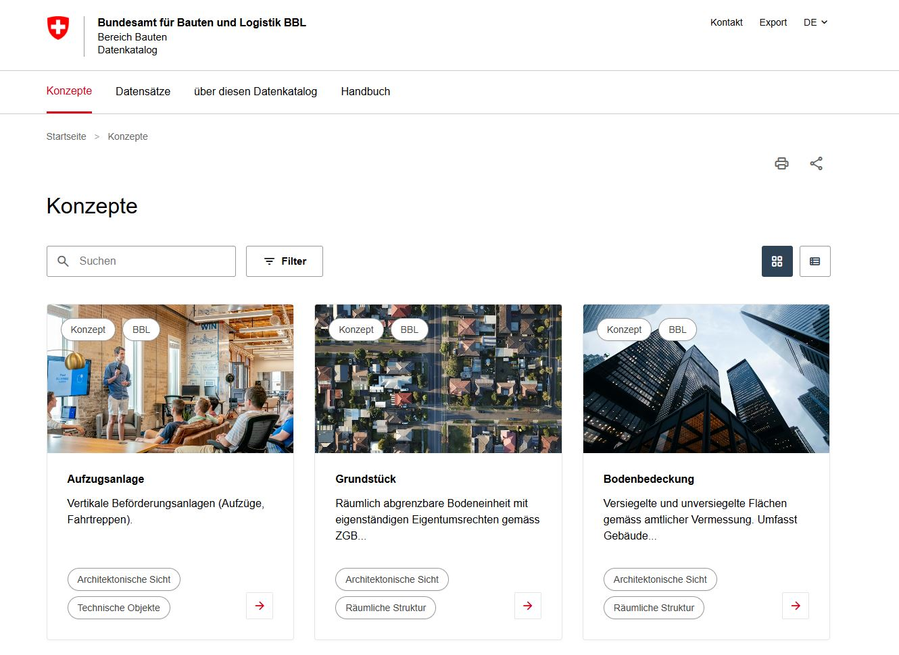

# Data Catalog Prototypes


[](https://opensource.org/licenses/MIT)
[](https://bbl-dres.github.io/data-catalog/)
[](https://www.dcat-ap.ch/)

## What is this?

A set of **five experimental web prototypes** exploring different ways to browse, search, and document the data assets of a large organisation — here, the Swiss Federal Office for Buildings and Logistics (BBL).

Each prototype tackles the same underlying question — *"how should people inside BBL find out what data exists, what it means, and where it lives?"* — but from a different angle: a polished DCAT-AP catalog, an architecture-layer browser, a SQL-backed explorer, a lineage graph, and a diagram editor.

All five are unofficial mockups. They are **not** production systems — they're meant to compare ideas and spark discussion. Where relevant, metadata follows the Swiss [DCAT-AP CH v3.0](https://www.dcat-ap.ch/) standard (the Swiss profile of the EU catalog vocabulary).

## Prototypes

You don't need to install anything — every prototype is deployed on GitHub Pages.

### Business Object & Dataset Catalog

Main catalog. Browse business objects and datasets with search, filters, grid/list views, and detail pages. Follows the DCAT-AP CH v3.0 standard. Multilingual: DE / EN / FR / IT.

- Link: https://bbl-dres.github.io/data-catalog/prototype-main/



---

### Architecture Layer Browser

Hierarchical metadata browser following a three-layer architecture model (Conceptual → Logical → Physical), with wiki-style documentation and cross-layer traceability. Multilingual (DE / EN / FR / IT), dark and light theme.

- Link: https://bbl-dres.github.io/data-catalog/prototype-dmbok/

<p>
  
  
</p>

---

### SQLite Catalog Explorer

Data catalog backed by a SQLite file that runs entirely in the browser via sql.js. Sidebar navigation, full-text search, detail views for every entity, and interactive lineage graphs.

- Link: https://bbl-dres.github.io/data-catalog/prototype-db/

<p>
  
  
</p>

---

### Data Lineage Viewer

Interactive graph for exploring data lineage across systems. Live JSON editor on the left, viewer with pan / zoom / fit / expand on the right. Six layout presets, column-level mappings, system-based grouping — vanilla JS, no framework.

- Link: https://bbl-dres.github.io/data-catalog/prototype-lineage/


---

### Mermaid Diagram Editor

Single-page editor for ER diagrams and flowcharts that accepts free-text names (spaces, umlauts, special characters). Built on Mermaid.js.

- Link: https://bbl-dres.github.io/data-catalog/prototype-markdown/

<p>
  
</p>

## Run locally

All prototypes are plain HTML/CSS/JS with **zero build step and zero npm dependencies**. Any static file server will do:

```bash
git clone https://github.com/bbl-dres/data-catalog.git
cd data-catalog

# then either:
python3 -m http.server 8000
# or:
npx http-server
```

Open <http://localhost:8000> — the root page redirects to the main catalog. Append `/prototype-dmbok/`, `/prototype-db/`, `/prototype-lineage/`, or `/prototype-markdown/` for the others.

## Repository layout

```
data-catalog/
├── index.html              # Redirect to prototype-main/
├── prototype-main/         # Business Object & Dataset Catalog (Datenkatalog IMMO)
├── prototype-dmbok/        # Architecture Layer Browser (Meta-Atlas)
├── prototype-db/           # SQLite Catalog Explorer
├── prototype-lineage/      # Data Lineage Viewer
├── prototype-markdown/     # Mermaid Diagram Editor (Simple Chart)
├── assets/                 # Shared repo assets (social preview)
└── docs-concepts/          # Shared concept docs
```

## License

Licensed under the [MIT License](https://opensource.org/licenses/MIT).

---

*Unofficial mockup — not affiliated with or endorsed by BBL.*
