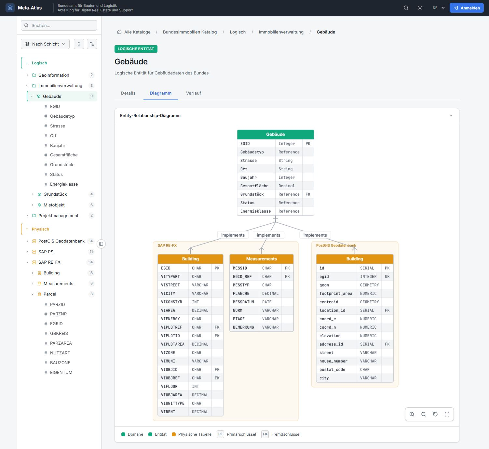
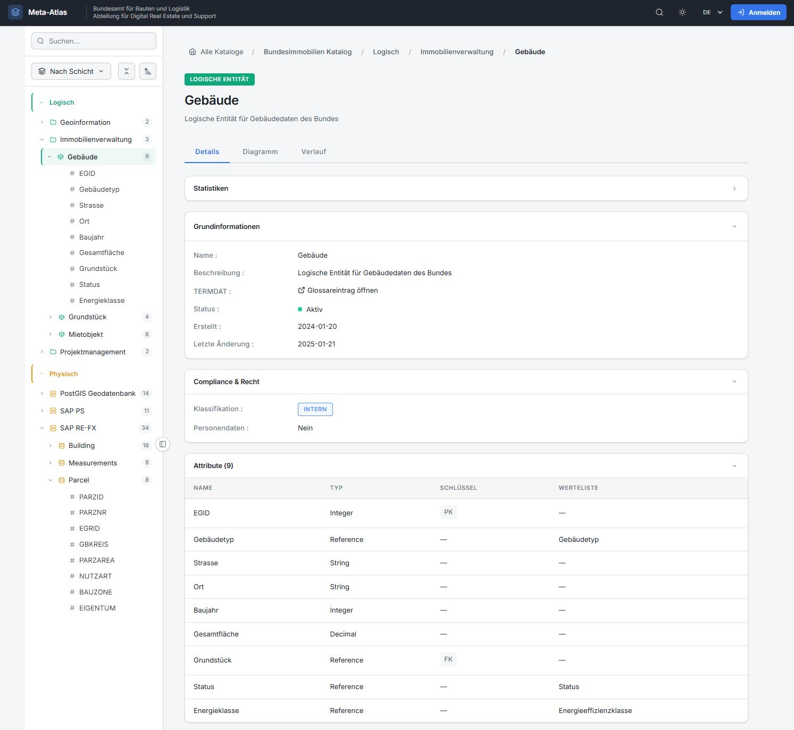
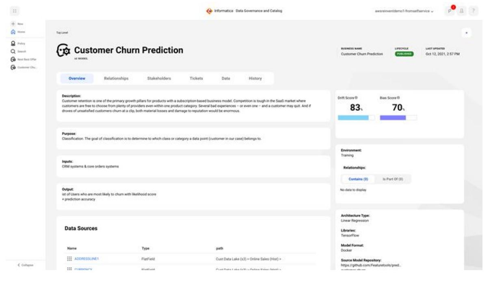
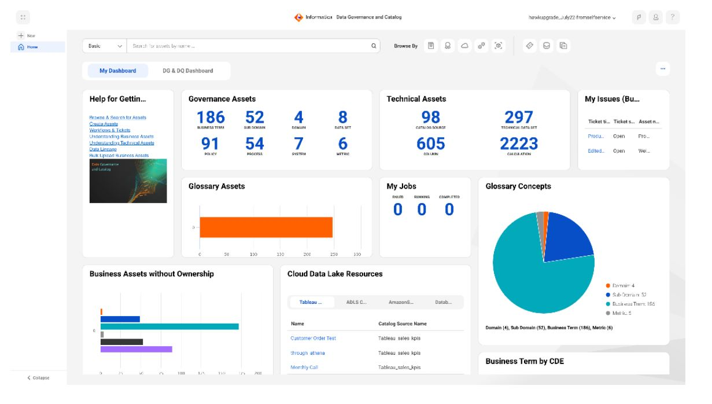
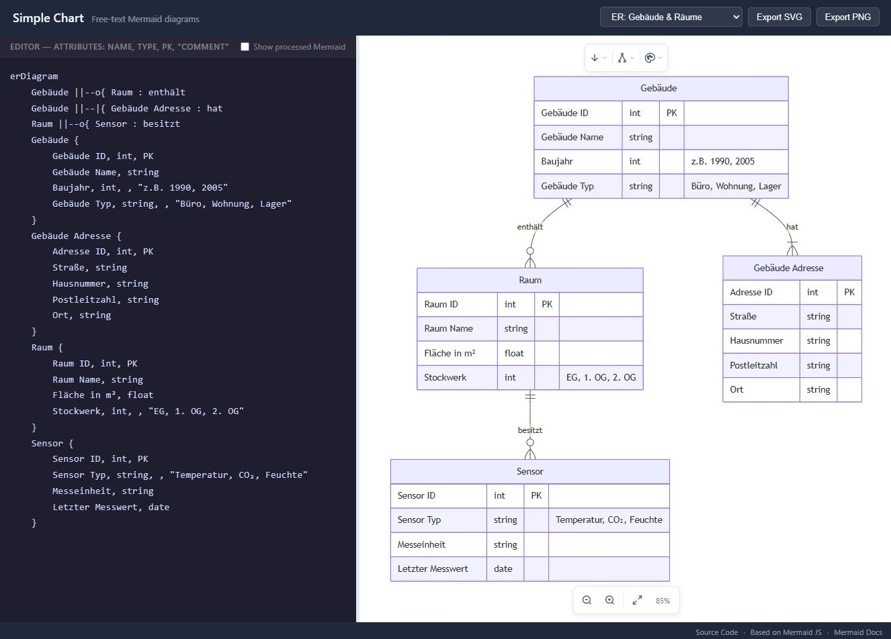

# Data Catalog / Datenkatalog IMMO

**This is a prototype for demonstration purposes.**

A prototype for a data catalog for the Swiss Federal Office for Buildings and Logistics (BBL). Documents business objects and datasets according to the DCAT-AP CH v3.0 standard.

**Live Demo:** https://bbl-dres.github.io/data-catalog/


## Features

- Browse business object concepts and datasets with full metadata
- Full-text search across titles, descriptions, and tags
- Filter by tags, system, classification, and personal data status
- Grid and list view modes
- Print and share functionality
- Mobile-responsive design

## Tech Stack

| Technology | Purpose |
|------------|---------|
| HTML5 | Structure and semantic markup |
| CSS3 | Styling with CSS variables |
| Vanilla JavaScript | Hash-based routing, dynamic UI |
| JSON | Data storage |

**Zero dependencies** - No build step, runs directly in any browser.

## Getting Started

```bash
# Clone the repository
git clone https://github.com/davras5/meta-bv.git
cd meta-bv

# Start a local server
python3 -m http.server 8000

# Open http://localhost:8000
```

## Project Structure

```
meta-bv/
├── index.html              # Single-file web application
├── content/
│   ├── about.html          # About page
│   └── manual.html         # User manual
├── data/
│   ├── concepts.json       # Business object definitions
│   └── datasets.json       # Dataset definitions
└── images/
    ├── concepts/           # Concept images
    └── datasets/           # Dataset images
```

## Prototypes

### Meta-Atlas (prototype-dmbok)

A metadata catalog following the TOGAF three-layer architecture model (Conceptual → Logical → Physical). Hierarchical tree navigation, wiki-style documentation, cross-layer traceability, multilingual support (DE/EN/FR/IT), and dark/light theme.

**Live Demo:** https://bbl-dres.github.io/data-catalog/prototype-dmbok/

<p>
  
  
</p>

---

### BBL Datenkatalog (prototype-db)

SQLite-backed data catalog with sidebar navigation, full-text search, detail views, and interactive lineage graphs. Uses sql.js to run queries entirely in the browser.

**Live Demo:** https://bbl-dres.github.io/data-catalog/prototype-db/

<p>
  
  
</p>

---

### Data Lineage Viewer (prototype-lineage)

Interactive graph visualization for exploring data lineage across systems. Supports edge routing, zoom/pan, and node interactions — all in vanilla JS with no framework dependencies.

**Live Demo:** https://bbl-dres.github.io/data-catalog/prototype-lineage/

---

### Simple Chart (prototype-markdown)

A single-page app for creating ER diagrams and flowcharts with free-text names (spaces, umlauts, special characters). Built on Mermaid.js (loaded via CDN).

**Live Demo:** https://bbl-dres.github.io/data-catalog/prototype-markdown/

<p>
  
</p>

## License

Licensed under [MIT](https://opensource.org/licenses/MIT)

---

*Unofficial mockup for demonstration purposes.*
