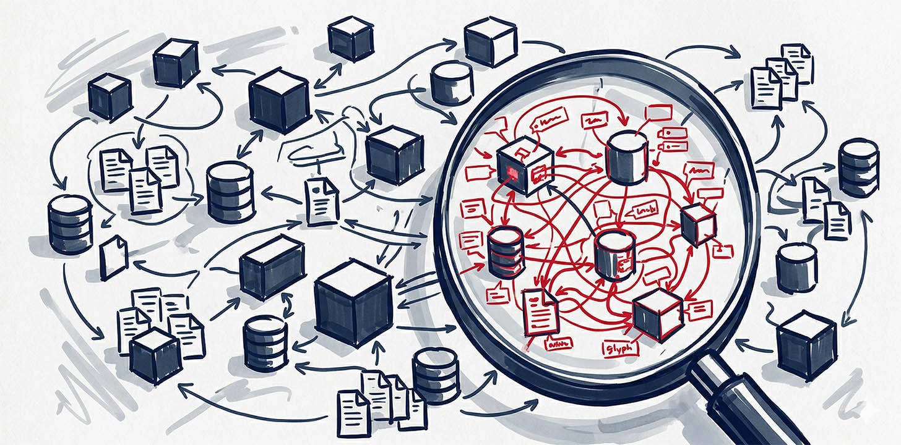
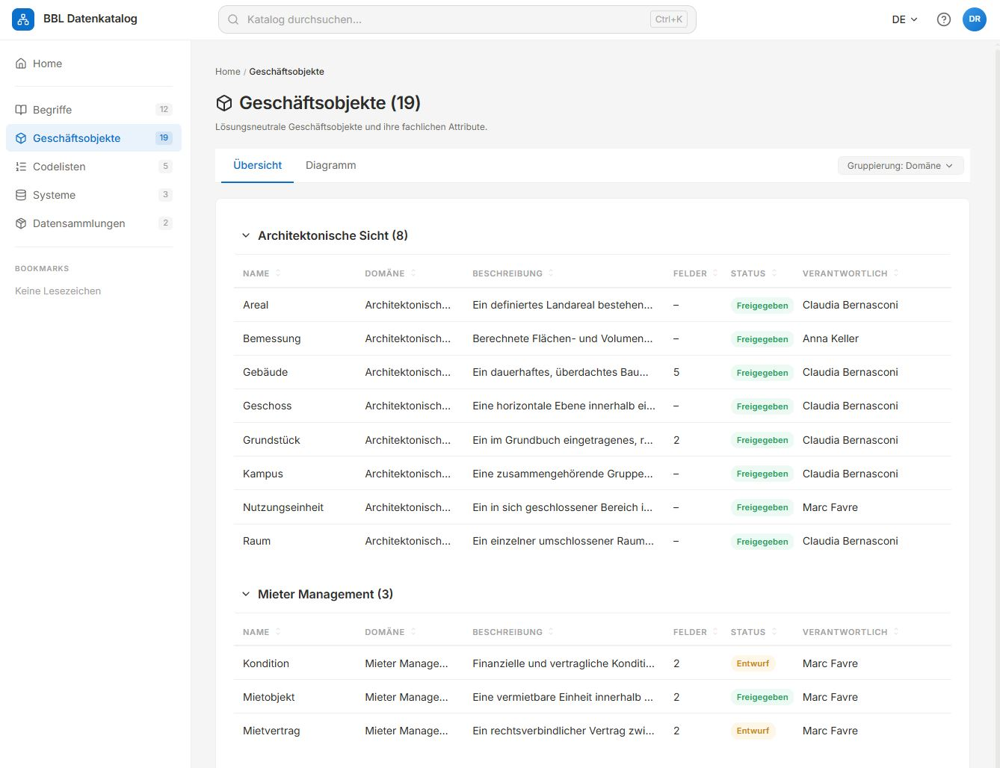
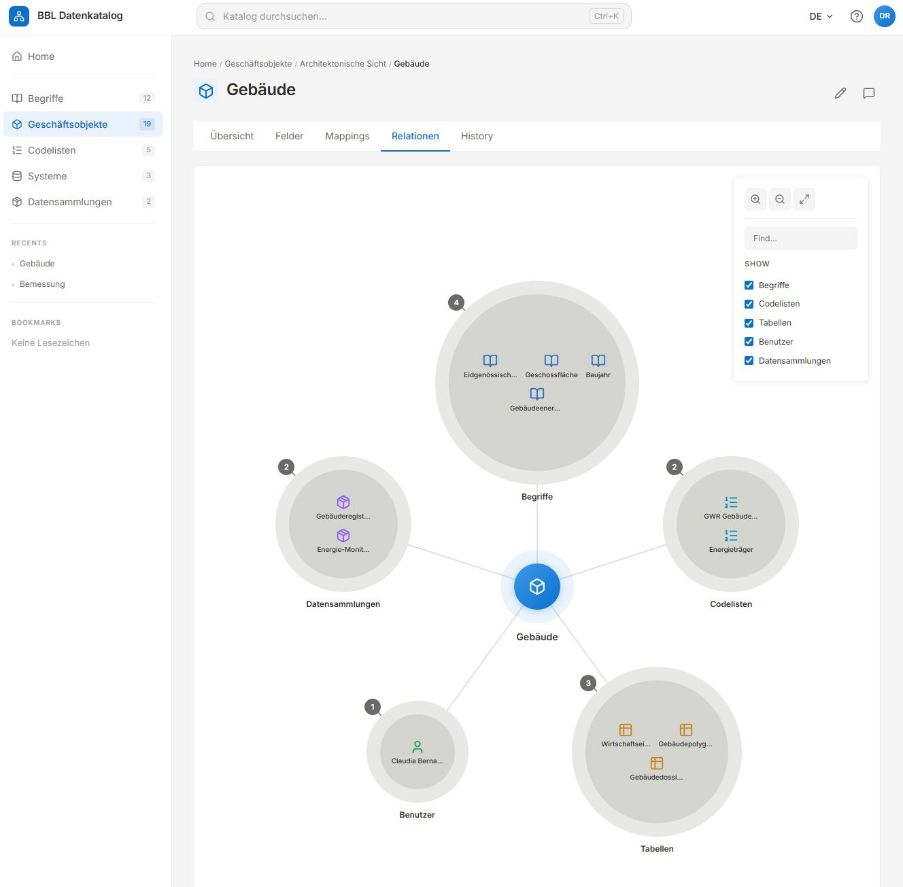
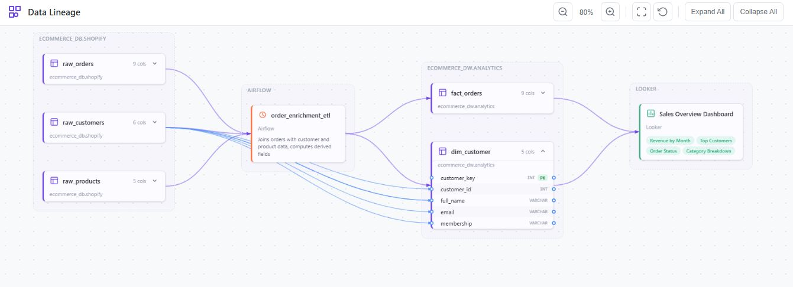

# Data Catalog Prototypes



[](https://opensource.org/licenses/MIT)
[](https://bbl-dres.github.io/data-catalog/)
[](https://www.dcat-ap.ch/)

## What is this?

A set of **five experimental web prototypes** exploring different ways to browse, search, and document the data assets of a large organisation — here, the Swiss Federal Office for Buildings and Logistics (BBL).

Each prototype tackles the same underlying question — *"how should people inside BBL find out what data exists, what it means, and where it lives?"* — but from a different angle: a polished catalog, a metadata atlas, a SQL-backed explorer, a lineage graph, and a diagramming tool.

All five are unofficial mockups. They are **not** production systems — they're meant to compare ideas and spark discussion. Where relevant, metadata follows the Swiss [DCAT-AP CH v3.0](https://www.dcat-ap.ch/) standard (the Swiss profile of the EU catalog vocabulary).

## Try them in the browser

You don't need to install anything. Every prototype is deployed on GitHub Pages:

| Prototype | What it does | Demo |
|---|---|---|
| **Datenkatalog IMMO** | Main catalog — browse business objects and datasets with search, filters, grid/list views, and detail pages. DCAT-AP CH compliant. | [Open ›](https://bbl-dres.github.io/data-catalog/) |
| **Meta-Atlas** | Hierarchical metadata atlas following the TOGAF three-layer model (Conceptual → Logical → Physical), with wiki-style docs and cross-layer traceability. Multilingual (DE/EN/FR/IT), dark/light theme. | [Open ›](https://bbl-dres.github.io/data-catalog/prototype-dmbok/) |
| **BBL Datenkatalog (DB)** | SQLite-backed catalog running entirely in the browser via sql.js. Sidebar navigation, full-text search, and interactive lineage graphs. | [Open ›](https://bbl-dres.github.io/data-catalog/prototype-db/) |
| **Data Lineage Viewer** | Interactive graph for exploring data lineage across systems. Edge routing, zoom/pan, node interactions — vanilla JS, no framework. | [Open ›](https://bbl-dres.github.io/data-catalog/prototype-lineage/) |
| **Simple Chart** | Single-page editor for ER diagrams and flowcharts that accepts free-text names (spaces, umlauts, special characters). Built on Mermaid.js. | [Open ›](https://bbl-dres.github.io/data-catalog/prototype-markdown/) |

### Previews

**Datenkatalog IMMO**


**Meta-Atlas**
<p>
  
  
</p>

**BBL Datenkatalog (DB)**
<p>
  
  
</p>

**Data Lineage Viewer**


**Simple Chart**
<p>
  
</p>

## Run locally

All prototypes are plain HTML/CSS/JS with **zero build step and zero npm dependencies**. Any static file server will do:

```bash
git clone https://github.com/bbl-dres/data-catalog.git
cd data-catalog

# then either:
python3 -m http.server 8000
# or:
npx http-server
```

Open <http://localhost:8000> for the main catalog, or append `/prototype-dmbok/`, `/prototype-db/`, `/prototype-lineage/`, `/prototype-markdown/` for the others.

## Repository layout

```
data-catalog/
├── index.html              # Main catalog (Datenkatalog IMMO)
├── css/  js/  data/        # Its styles, logic, and JSON data
├── content/                # About + user manual (DE/FR/IT/EN)
├── assets/                 # Images for the main catalog
├── prototype-dmbok/        # Meta-Atlas
├── prototype-db/           # BBL Datenkatalog (SQLite in browser)
├── prototype-lineage/      # Data Lineage Viewer
├── prototype-markdown/     # Simple Chart (Mermaid.js)
└── docs-concepts/          # Shared concept docs
```

## License

Licensed under the [MIT License](https://opensource.org/licenses/MIT).

---

*Unofficial mockup — not affiliated with or endorsed by BBL.*
