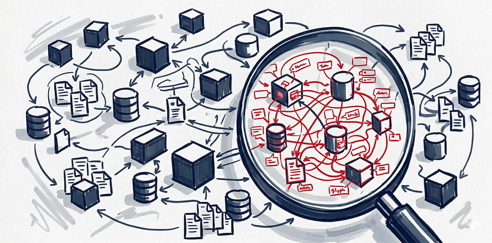

# Data Catalog Prototypes



A collection of experimental interfaces for finding, understanding, and documenting an organisation's data assets.

> [!CAUTION]
> These are unofficial prototypes with fictional data. Features may be incomplete, and none of the applications is intended for production use.

## Demo

**Landing page:** <https://bbl-dres.github.io/data-catalog/>

The landing page opens the main catalog. Use the direct links below to compare every variant.

## Prototypes

| Prototype | Focus | Demo | Details |
|---|---|---|---|
| Business Object & Dataset Catalog | Searchable DCAT-AP CH catalog | [Open](https://bbl-dres.github.io/data-catalog/prototype-main/) | [README](prototype-main/README.md) |
| SQLite Catalog Explorer | In-browser SQLite catalog and lineage | [Open](https://bbl-dres.github.io/data-catalog/prototype-sqlite/) | [README](prototype-sqlite/README.md) |
| Architecture Layer Browser | Conceptual, logical, and physical layers | [Open](https://bbl-dres.github.io/data-catalog/prototype-layers/) | [README](prototype-layers/README.md) |
| Data Lineage Viewer | Interactive system and column lineage | [Open](https://bbl-dres.github.io/data-catalog/prototype-lineage/) | [README](prototype-lineage/README.md) |
| Mermaid Diagram Editor | ER diagrams and flowcharts with free-text names | [Open](https://bbl-dres.github.io/data-catalog/prototype-mermaid/) | [README](prototype-mermaid/README.md) |
| Architecture Canvas | Miro-style data-architecture modelling | [Open](https://bbl-dres.github.io/data-catalog/prototype-canvas/) | [README](prototype-canvas/README.md) |
| EA-IMMO | Conceptual real-estate data model | [Open](https://bbl-dres.github.io/data-catalog/prototype-ea-immo/) | [README](prototype-ea-immo/README.md) |

The catalog-oriented prototypes use DCAT-AP CH where relevant; other variants explore architecture, modelling, and lineage approaches.

## Run locally

From the repository root, serve every browser prototype with:

```bash
python -m http.server 8000
```

Open <http://localhost:8000>; the root redirects to `prototype-main/`. Append a path from the table for another prototype.

## Documentation and related components

- [Market screening](docs/MARKTSCREENING.md) — data-catalog landscape and recommendations from a Swiss federal perspective
- [Chat Worker](chat-worker/README.md) — optional Cloudflare Worker for the SQLite prototype's AI assistant
- Each prototype's implementation notes, data model, and specific setup instructions are linked in the table above.

## License

[MIT](LICENSE)
