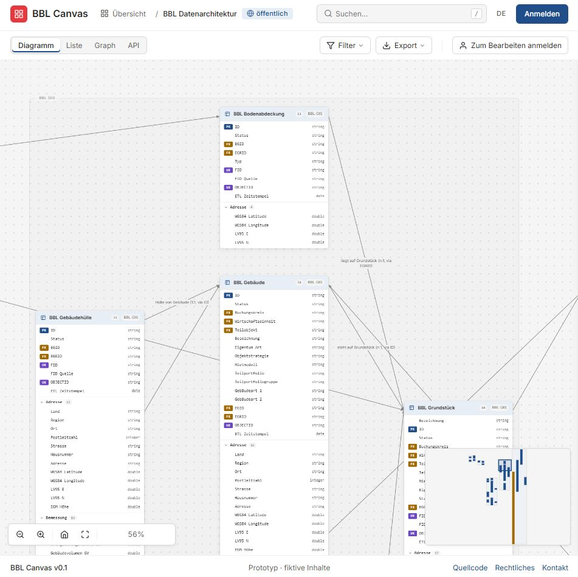
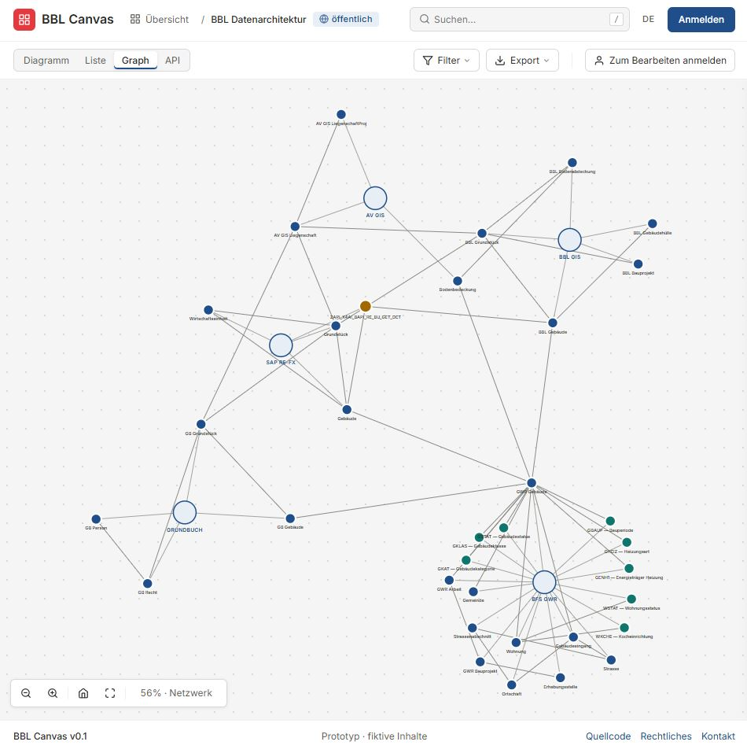

# Architecture Canvas

[](https://bbl-dres.github.io/data-catalog/prototype-canvas/)
[](../LICENSE)

> [!CAUTION]
> Unofficial prototype with fictional data. Features may be incomplete, and it is not intended for production use.

Miro-style sketching surface for data architecture: drag tables, views, APIs, files and code lists onto a canvas, group attributes into property sets and connect them with relationships. In-app branding: *BBL Canvas*. Part of the [BBL Data Catalog prototypes](../README.md).

## Demo

**Live demo:** https://bbl-dres.github.io/data-catalog/prototype-canvas/

<p align="center">
  
  
</p>

## Features

- Four views: Diagramm (canvas), Liste (filterable lists per entity type), Graph (network of systems and nodes) and API (Swagger-style mock spec).
- Two modes: Ansicht (read-only) and Bearbeiten (inline editing, drag-to-edge, palette, action bar).
- Five node types: tables, views, APIs, files and code lists.
- Property sets derived from the free-text `set` column of attributes; system frames per `system` value.
- Right-side info panel for the selected node, system, attribute or edge.
- Visibility dropdown with a tri-state master toggle and bulk expand or collapse of property sets.
- Excel round-trip (one workbook sheet per entity type) and JSON download.
- `localStorage` persistence and hash-based deep links for view and selection.
- German UI.

## Run locally

Static vanilla JavaScript with JSON data loaded by `fetch()`, so serve it over HTTP from the repository root:

```bash
python -m http.server 8000
```

Open <http://localhost:8000/prototype-canvas/>.

## Documentation

- [Data model](docs/DATAMODEL.md) — Supabase-target relational model and i18n strategy.
- [Excel round-trip](docs/EXCEL-ROUNDTRIP.md) — workbook sheets, import and export.
- [Auto-layout research](docs/AUTOLAYOUT_RESEARCH.md)

## License

Project code is covered by the [MIT License](../LICENSE). SheetJS is loaded from CDN under its own license.
