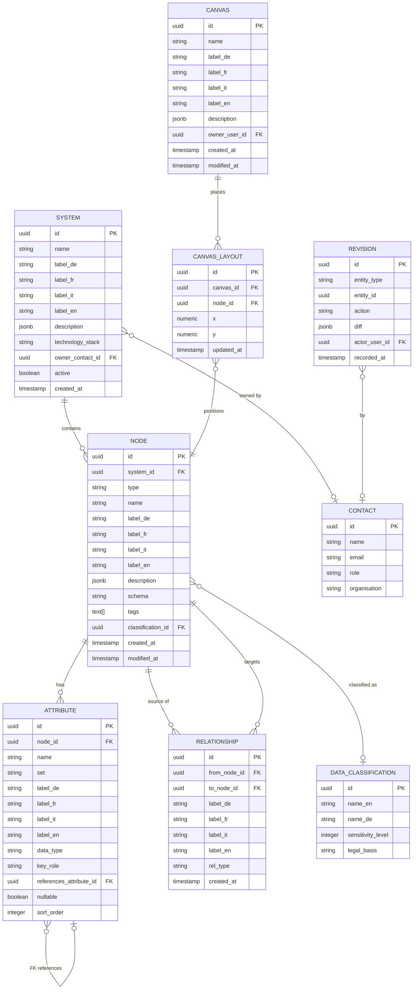

# BBL Architektur-Canvas – Data Model

**Version:** 0.1 (draft)
**Owner:** DRES – Kreis Digital Solutions
**Target backend:** Supabase (PostgreSQL 15+)
**Status:** In Review

---

## Table of Contents

1. [Goals](#1-goals)
2. [Requirements](#2-requirements)
3. [Standards Alignment](#3-standards-alignment)
4. [Conceptual Model](#4-conceptual-model)
5. [Entity Overview](#5-entity-overview)
6. [Entity Details](#6-entity-details)
   - 6.1 [System](#61-system)
   - 6.2 [Node](#62-node)
   - 6.3 [Attribute](#63-attribute)
   - 6.4 [Relationship](#64-relationship)
   - 6.5 [Tag](#65-tag)
   - 6.6 [Canvas Layout](#66-canvas-layout)
   - 6.7 [Data Classification](#67-data-classification)
   - 6.8 [Contact](#68-contact)
   - 6.9 [Revision](#69-revision)
7. [i18n Strategy](#7-i18n-strategy)
8. [Supabase-Specifics](#8-supabase-specifics)
9. [Migration Plan](#9-migration-plan-from-canvasjson)

---

## 1. Goals

The BBL Architektur-Canvas is a Miro-style sketching surface for data architects. Users place tables, views, APIs, files, and code lists on a canvas and connect them with relationships. The persisted model serves three audiences:

**G1 – Visual catalog.** The canvas is a low-friction way to capture *what* systems and tables exist and *how* they relate, before formal cataloguing in `prototype-sqlite`. This model is the authoritative source for the diagram.

**G2 – Technical fidelity.** Each node carries source-system schema (columns, types, keys, property sets) at the level of detail visible in the Excel exports from SAP RE-FX, BBL GIS, BFS GWR, and other systems. The model must round-trip with these Excel sheets without data loss.

**G3 – Layout persistence.** A user-arranged canvas must survive refresh and (later) move between devices. Layout (x/y per node) is per-canvas, not per-node — multiple saved canvases over the same data set are explicitly supported in v2.

**G4 – Multilingual labels.** All user-visible labels (system names, node labels, property-set labels, attribute display names, edge labels) support DE/FR/IT/EN. Technical names (column names, schema names) stay single-locale and follow source-system conventions.

**G5 – Supabase-ready.** Every entity is shaped for Postgres/Supabase: UUID PKs, `TIMESTAMPTZ` audit timestamps, JSONB for long-form text and arrays, no graph extensions required. Row-Level-Security (RLS) policies are sketched so the model can host BBL-internal alongside externally shared canvases.

**G6 – Bridges to prototype-sqlite.** Where this canvas overlaps with `prototype-sqlite` (concepts, fields, systems), the entities are nameable and shape-compatible — a future migration script can lift canvas data into the sqlite catalog without re-entry.

---

## 2. Requirements

### Functional

| ID | Requirement |
|----|-------------|
| FR-01 | A canvas consists of nodes and directed relationships between nodes. |
| FR-02 | A node has exactly one type from `{table, view, api, file, codelist}`. The type drives the icon and default column template; it does not alter the storage shape. |
| FR-03 | Every node belongs to exactly one system (e.g. `SAP RE-FX`, `BBL GIS`, `BFS GWR`, `AFM`). |
| FR-04 | A node has zero or more attributes (columns). Each attribute has a technical name, a data type, and an optional key role (`PK`, `FK`, `UK`). |
| FR-05 | Attributes carry an optional free-text `set` label. Property-set groupings are *derived* from the distinct `set` values across a node's attributes — there is no separate property-set entity. Renaming a set means updating every attribute whose `set` matches the old name. |
| FR-06 | Relationships are directed (`from_node` → `to_node`) and may carry an optional label (e.g. "1:n", "owns", "FK ref"). Self-loops are rejected. Duplicate `(from, to, label)` triples are rejected. |
| FR-07 | Foreign-key references between attributes (column → column) may be recorded explicitly via `attribute.references_attribute_id`. The diagram-level relationship is independent and may exist without an FK. |
| FR-08 | A node carries x/y layout coordinates within a canvas. Multiple canvases over the same nodes (different layouts) are supported. |
| FR-09 | Per-node tags allow free-text grouping (e.g. `master`, `dimension`, `legacy`). Tags are language-independent keys. |
| FR-10 | A node may carry a sensitivity classification (`public`, `internal`, `confidential`, `secret`) aligned to ISG/DSG. |
| FR-11 | Every node and system may have one or more contacts (steward/owner) — the link to a real person is optional. |
| FR-12 | Edits are tracked in a revision log so the diagram can show "last edited 2 days ago by …" and a future undo/redo can replay. |
| FR-13 | The model must round-trip with the existing 8-sheet Excel format (Systems · Tables · APIs · Files · ValueLists · PropertySets · Attributes · Relations) without loss. |

### Non-functional

| ID | Requirement |
|----|-------------|
| NR-01 | Implementable in Supabase / PostgreSQL 15+ without extensions beyond `uuid-ossp` (or `pgcrypto.gen_random_uuid()`). |
| NR-02 | All primary keys are UUIDs. |
| NR-03 | All timestamps use `TIMESTAMPTZ`, stored UTC, displayed Europe/Zurich. |
| NR-04 | Short labels use four typed `TEXT` columns (`label_de`, `label_fr`, `label_it`, `label_en`). Long-form text uses `JSONB` keyed by locale. |
| NR-05 | Default UI language is German; fallback chain `de → en → first non-null`. |
| NR-06 | RLS enabled on all data tables. Default policy: authenticated users can read; only `editor` and `admin` roles may write. |
| NR-07 | The current single-canvas localStorage prototype is migrated to Supabase by a one-shot import script (see §9). |

---

## 3. Standards Alignment

| Layer | ArchiMate 3.x | DCAT-AP / SKOS | Our entity |
|-------|--------------|----------------|-----------|
| Application | `Application Component` | `bv:System` | `system` |
| Application + Technology | `Data Object` + `Artifact` | `dcat:Dataset` (physical) | `node` (type ∈ {table, view, file}) |
| Application | `Application Interface` | `dcat:DataService` | `node` (type = api) |
| Business | `Business Object` (enumerated) | `skos:ConceptScheme` (codelist) | `node` (type = codelist) |
| Technology | `Artifact` property | `bv:Field` | `attribute` |
| Application | `Grouping` | — (local extension) | derived from `attribute.set` (free text) |
| Cross-cutting | `Association` | `dcat:qualifiedRelation` | `relationship` |
| Cross-cutting | `Assignment` | `dcat:contactPoint` | `contact` |
| Cross-cutting | — | local extension | `data_classification` |

**Bridge to `prototype-sqlite`:** the canvas `system`, `node` (type=table/view), and `attribute` map 1:1 to `prototype-sqlite`'s `system`, `dataset`, and `field`. The canvas `node` (type=codelist) maps to `code_list`. A future migration script lifts canvas content into the formal catalog without manual re-entry.

---

## 4. Conceptual Model



The model has three concerns:

- **Catalog** (system / node / attribute / relationship): *what* exists. Property-set groupings are *derived* from the free-text `attribute.set` column — no separate table.
- **Layout** (canvas / canvas_layout): *where* it sits on a sketching surface. Decoupled so the same catalog can support multiple saved layouts (e.g. "Architektur-Übersicht" vs. "GWR-Detail").
- **Cross-cutting** (data_classification / contact / revision): governance and audit overlays.

---

## 5. Entity Overview

| Entity | ArchiMate / DCAT | Description | Approx. volume |
|--------|------------------|-------------|----------------|
| `system` | `Application Component` / `bv:System` | A connected source application (SAP RE-FX, BBL GIS, …) | < 20 |
| `node` | `Data Object` / `dcat:Dataset` (or `dcat:DataService` for APIs) | Unified entity for any canvas node — table, view, API, file, code list | 50 – 1 000 |
| `attribute` | `Artifact` property / `bv:Field` | One column / property of a node. Carries optional free-text `set` for grouping. | 1 000 – 50 000 |
| `relationship` | `Association` / `dcat:qualifiedRelation` | Directed edge between nodes | 100 – 5 000 |
| `canvas` | local extension | Named perspective / viewport over the catalog | < 50 |
| `canvas_layout` | local extension | Per-canvas (x,y) for each node | nodes × canvases |
| `data_classification` | local extension | ISG/DSG sensitivity tier | < 10 |
| `contact` | `dcat:contactPoint` | Steward/owner reference | < 500 |
| `revision` | local extension | Audit log of writes | grows over time |

---

## 6. Entity Details

---

### 6.1 System

A **System** is a connected source application — the top-level grouping for nodes on the canvas. Corresponds to ArchiMate `Application Component` and `bv:System`. Currently stored as a free-text `node.system` string in the JSON prototype; promoted to a first-class entity in Supabase to enable RLS, ownership, and i18n.

**Table:** `system`

| Column | Type | Nullable | Description |
|--------|------|----------|-------------|
| `id` | `UUID` | NO | Primary key, `gen_random_uuid()` |
| `name` | `TEXT` | NO | Technical / canonical key (e.g. `SAP RE-FX`). Unique. |
| `label_de` | `TEXT` | NO | Display name DE |
| `label_fr` | `TEXT` | YES | Display name FR |
| `label_it` | `TEXT` | YES | Display name IT |
| `label_en` | `TEXT` | YES | Display name EN |
| `description` | `JSONB` | YES | `{"de": "...", "fr": "...", "it": "...", "en": "..."}` |
| `technology_stack` | `TEXT` | YES | e.g. `SAP S/4HANA`, `ArcGIS Online`, `PostgreSQL` |
| `base_url` | `TEXT` | YES | Base URL for deep links |
| `owner_contact_id` | `UUID` | YES | FK → `contact.id` |
| `active` | `BOOLEAN` | NO | Default `true` |
| `created_at` | `TIMESTAMPTZ` | NO | Default `now()` |
| `modified_at` | `TIMESTAMPTZ` | NO | Touched by trigger |

**Indexes:** `UNIQUE (name)`.

**Seed data** (BBL):

| name | label_de | technology_stack |
|------|----------|------------------|
| `AFM` | AFM | (Tenant Mgmt) |
| `SAP RE-FX` | SAP RE-FX | SAP S/4HANA |
| `BBL GIS` | BBL GIS | ArcGIS Online |
| `BFS GWR` | BFS GWR | PostgreSQL (BFS) |

---

### 6.2 Node

A **Node** is any visible element on the canvas. The `type` discriminator drives the icon, default column template, and palette grouping; the storage shape is identical across types.

Corresponds to ArchiMate `Data Object` / `Artifact` (table/view/file), `Application Interface` (api), or `Business Object` enumerated (codelist). Maps to `prototype-sqlite`'s `dataset` for table/view/file/api and to `code_list` for codelist.

**Table:** `node`

| Column | Type | Nullable | Description |
|--------|------|----------|-------------|
| `id` | `UUID` | NO | Primary key |
| `system_id` | `UUID` | NO | FK → `system.id` |
| `type` | `TEXT` | NO | `CHECK (type IN ('table', 'view', 'api', 'file', 'codelist'))` |
| `name` | `TEXT` | NO | Technical name (e.g. `refx_gebaeude`). Unique within `system_id`. |
| `label_de` | `TEXT` | YES | Display name DE (defaults to `name` if null) |
| `label_fr` | `TEXT` | YES | |
| `label_it` | `TEXT` | YES | |
| `label_en` | `TEXT` | YES | |
| `description` | `JSONB` | YES | Per-locale long-form description |
| `schema` | `TEXT` | YES | Source-system schema name (e.g. `dbo`, `public`, `gwr`) |
| `tags` | `TEXT[]` | NO | Default `{}`. Free-text language-independent keys (e.g. `master`, `legacy`). |
| `classification_id` | `UUID` | YES | FK → `data_classification.id` |
| `created_at` | `TIMESTAMPTZ` | NO | |
| `modified_at` | `TIMESTAMPTZ` | NO | |

**Indexes:** `UNIQUE (system_id, name)`, `INDEX (type)`, GIN on `tags`.

**Why a single table for all five node types** instead of one table per type:
- Identical visual treatment on the canvas (same drag/drop, same column rendering).
- Identical column model (every type has `attribute` rows; codelist columns are typically `code/label/desc/sort_order/deprecated`).
- Cross-type queries ("all nodes in system X") stay simple.
- Type-specific defaults are handled in the UI (`TYPE_DEFAULTS` in `editor.js`), not the schema.

A `CHECK` constraint guards the discriminator. Per-type validation rules (e.g. "an API node should have a `base_url`") could move to type-specific JSONB metadata in a future iteration if they grow.

---

### 6.3 Attribute

An **Attribute** is one column / field of a node. For tables and views: a database column. For APIs: a request/response field. For files: a known column in a structured file. For code lists: structural fields like `code`, `label`, `description`.

Corresponds to `bv:Field` and ArchiMate `Artifact` property. 1:1 with `prototype-sqlite`'s `field`.

**Table:** `attribute`

| Column | Type | Nullable | Description |
|--------|------|----------|-------------|
| `id` | `UUID` | NO | Primary key |
| `node_id` | `UUID` | NO | FK → `node.id` `ON DELETE CASCADE` |
| `name` | `TEXT` | NO | Technical column name. Unique within `(node_id, set, name)` to allow the same name in different sets (real example: `OBJECT_ID` repeats across SAP property sets). |
| `set` | `TEXT` | YES | Free-text grouping label (e.g. `STAMMDATEN`, `ADRESSE_VERORTUNG`). Null / empty = ungrouped. The canvas derives the visible property-set sections from the distinct values of this column. |
| `label_de` | `TEXT` | YES | Display label DE |
| `label_fr` | `TEXT` | YES | |
| `label_it` | `TEXT` | YES | |
| `label_en` | `TEXT` | YES | |
| `description` | `JSONB` | YES | Per-locale description |
| `data_type` | `TEXT` | YES | Source-system type as written (e.g. `CHAR(45)`, `DEC(10,2)`, `uuid`, `TEXT`) |
| `key_role` | `TEXT` | YES | `CHECK (key_role IN ('PK', 'FK', 'UK') OR key_role IS NULL)` |
| `references_attribute_id` | `UUID` | YES | FK → `attribute.id`; the column this FK points at. Set when `key_role = 'FK'` and the referenced column is known. |
| `nullable` | `BOOLEAN` | YES | Default `true` |
| `sort_order` | `INTEGER` | YES | Order within the property set (or within the ungrouped block) |
| `created_at` | `TIMESTAMPTZ` | NO | |

**Indexes:** `UNIQUE (node_id, COALESCE(set, ''), name)`, `INDEX (references_attribute_id)`, `INDEX (key_role) WHERE key_role IS NOT NULL`, `INDEX (node_id, set)` for fast group-by.

**Why `set` is free text and not a separate `property_set` table.** Property-set groupings on the canvas exist only to organise long attribute lists into collapsible sections — they do not carry independent metadata, ownership, or lifecycle. Promoting them to a table would force a join for every attribute list rendering and add insert/delete/rename plumbing for no information gain. Treating `set` as a denormalised text column on `attribute` keeps the model symmetrical with the JSON shape and matches how source-system Excel exports already arrive (each row carries its set name inline).

**Standard set names** the canvas establishes by convention (not enforced):

| set | Notes |
|-----|-------|
| `STAMMDATEN` | Identity + status fields |
| `ADRESSE_VERORTUNG` | Unified address + LV95 coords |
| `BEMESSUNG` | Areas / volumes / measurements |
| `KLASSIFIKATION` | Categorisation tags |

**Renaming a set** is a multi-row update across attributes:

```sql
UPDATE attribute
   SET set = 'NEUER_NAME'
 WHERE node_id = $1 AND set = 'ALTER_NAME';
```

**Note on `OBJECT_ID` repetition:** SAP RE-FX BAPI structures repeat `OBJECT_TYPE` / `OBJECT_ID` across every property set (each set is a self-contained substructure). The composite uniqueness on `(node_id, COALESCE(set, ''), name)` accommodates this naturally.

---

### 6.4 Relationship

A **Relationship** is a directed edge between two nodes. Carries an optional human label (e.g. `1:n`, `enthält`, `realises`) and an optional structured `rel_type`.

Corresponds to ArchiMate `Association` and DCAT `dcat:qualifiedRelation`.

**Table:** `relationship`

| Column | Type | Nullable | Description |
|--------|------|----------|-------------|
| `id` | `UUID` | NO | Primary key |
| `from_node_id` | `UUID` | NO | FK → `node.id` `ON DELETE CASCADE` |
| `to_node_id` | `UUID` | NO | FK → `node.id` `ON DELETE CASCADE` |
| `label_de` | `TEXT` | YES | Display label DE |
| `label_fr` | `TEXT` | YES | |
| `label_it` | `TEXT` | YES | |
| `label_en` | `TEXT` | YES | |
| `rel_type` | `TEXT` | YES | Optional taxonomy: `fk`, `derives_from`, `realises`, `contains`, `references`, `replaces` |
| `created_at` | `TIMESTAMPTZ` | NO | |

**Constraints:**
- `CHECK (from_node_id <> to_node_id)` — no self-loops (matches the JS `addEdge` guard).
- `UNIQUE (from_node_id, to_node_id, COALESCE(label_de, ''))` — disallow exact duplicates.

**Indexes:** `INDEX (from_node_id)`, `INDEX (to_node_id)`, `INDEX (rel_type) WHERE rel_type IS NOT NULL`.

A row in `relationship` is independent of FK-level wiring in `attribute.references_attribute_id`. A relationship may exist purely as a documentation arrow ("downstream report flows into dashboard") with no FK; conversely, an FK at the attribute level may exist without an explicit relationship row.

---

### 6.5 Tag

Tags are stored as a `TEXT[]` array column on `node` — pragmatic for the current canvas where tags are language-independent free-text keys (`master`, `legacy`, `dimension`).

If filtering and i18n on tags become important, promote to a normalised structure:

```sql
CREATE TABLE tag (
  id UUID PRIMARY KEY,
  name TEXT UNIQUE NOT NULL,
  label_de TEXT, label_fr TEXT, label_it TEXT, label_en TEXT
);
CREATE TABLE node_tag (
  node_id UUID REFERENCES node(id) ON DELETE CASCADE,
  tag_id UUID REFERENCES tag(id) ON DELETE CASCADE,
  PRIMARY KEY (node_id, tag_id)
);
```

For v1 the array is sufficient and matches the current JSON shape exactly.

---

### 6.6 Canvas Layout

**Layout is decoupled from `node`.** The current JSON prototype stores `x`/`y` directly on each node. In Supabase those coordinates move into a per-canvas join table so that:

- Multiple canvases can show the same nodes with different layouts ("Architektur-Übersicht" vs. "GWR-Detail").
- A read-only canvas can be cloned and re-laid-out without forking the catalog.
- A user-private layout can sit alongside a published canonical layout.

**Table:** `canvas`

| Column | Type | Nullable | Description |
|--------|------|----------|-------------|
| `id` | `UUID` | NO | Primary key |
| `name` | `TEXT` | NO | Technical key, unique |
| `label_de` | `TEXT` | NO | Display name DE |
| `label_fr` | `TEXT` | YES | |
| `label_it` | `TEXT` | YES | |
| `label_en` | `TEXT` | YES | |
| `description` | `JSONB` | YES | |
| `owner_user_id` | `UUID` | YES | FK → `auth.users.id` (Supabase) |
| `is_public` | `BOOLEAN` | NO | Default `false`. Drives RLS read access. |
| `created_at` | `TIMESTAMPTZ` | NO | |
| `modified_at` | `TIMESTAMPTZ` | NO | |

**Table:** `canvas_layout`

| Column | Type | Nullable | Description |
|--------|------|----------|-------------|
| `canvas_id` | `UUID` | NO | FK → `canvas.id` `ON DELETE CASCADE` |
| `node_id` | `UUID` | NO | FK → `node.id` `ON DELETE CASCADE` |
| `x` | `NUMERIC(10,2)` | NO | Canvas-space x coordinate |
| `y` | `NUMERIC(10,2)` | NO | Canvas-space y coordinate |
| `updated_at` | `TIMESTAMPTZ` | NO | |

**Primary key:** `(canvas_id, node_id)`.

For the v1 single-canvas migration we seed one row in `canvas` (e.g. `default`) and load every node's current `(x, y)` into `canvas_layout`.

---

### 6.7 Data Classification

Sensitivity classification aligned to ISG / DSG. Identical to `prototype-sqlite` §6.16 — kept here for consistency so a node can be flagged independently of its eventual catalog home.

**Table:** `data_classification`

| Column | Type | Nullable | Description |
|--------|------|----------|-------------|
| `id` | `UUID` | NO | Primary key |
| `name_de` | `TEXT` | NO | |
| `name_fr` | `TEXT` | YES | |
| `name_it` | `TEXT` | YES | |
| `name_en` | `TEXT` | YES | |
| `sensitivity_level` | `INTEGER` | NO | `0` public, `1` internal, `2` confidential, `3` secret |
| `legal_basis` | `TEXT` | YES | e.g. `ISG Art. 7`, `DSG Art. 5 lit. c` |
| `description` | `JSONB` | YES | |

Standard rows: Öffentlich (0), BBL-intern (1), Vertraulich (2), Personendaten (2), Besonders schützenswert (3), Geheim VS-INTERN (3).

---

### 6.8 Contact

A responsible person or team. Used for system ownership and (optionally) per-node stewardship.

**Table:** `contact`

| Column | Type | Nullable | Description |
|--------|------|----------|-------------|
| `id` | `UUID` | NO | Primary key |
| `name` | `TEXT` | NO | Full name or team name |
| `email` | `TEXT` | YES | |
| `phone` | `TEXT` | YES | |
| `organisation` | `TEXT` | YES | |
| `role` | `TEXT` | YES | `data_owner`, `data_steward`, `subject_matter_expert` |
| `user_id` | `UUID` | YES | FK → `auth.users.id` if the contact has a Supabase account |

A `node_contact` junction can be added later for per-node stewardship (`(node_id, contact_id, role)`).

---

### 6.9 Revision

Append-only audit log of write operations. Powers "last edited" UI hints and a future undo/redo over the network.

**Table:** `revision`

| Column | Type | Nullable | Description |
|--------|------|----------|-------------|
| `id` | `UUID` | NO | Primary key |
| `entity_type` | `TEXT` | NO | `system`, `node`, `attribute`, `relationship`, `canvas_layout` |
| `entity_id` | `UUID` | NO | The affected row's id |
| `action` | `TEXT` | NO | `insert`, `update`, `delete` |
| `diff` | `JSONB` | YES | Per-column before/after for updates; full row for insert/delete |
| `actor_user_id` | `UUID` | YES | FK → `auth.users.id` |
| `recorded_at` | `TIMESTAMPTZ` | NO | Default `now()` |

**Indexes:** `INDEX (entity_type, entity_id)`, `INDEX (recorded_at DESC)`.

Best implemented as a generic Postgres trigger on each catalog table, not as application code.

---

## 7. i18n Strategy

The canvas mixes two kinds of text:

**Short labels** (system name, node label, set label, attribute display name, edge label) → four typed columns:

```sql
label_de TEXT NOT NULL,
label_fr TEXT,
label_it TEXT,
label_en TEXT
```

- DE is required (default UI language).
- Other locales are optional and shown when present.
- Indexable via `pg_trgm` for fuzzy search per locale.

**Long-form text** (description, scope notes, transformation notes) → JSONB:

```sql
description JSONB
-- shape: { "de": "...", "fr": "...", "it": "...", "en": "..." }
```

- All locales optional within the JSONB.
- Resolves with the same `de → en → first non-null` fallback as the UI.

**Single-locale fields** (technical column names, schema names, codes) → plain `TEXT`:

```sql
name TEXT NOT NULL
```

These follow source-system conventions (`OBJECT_ID`, `EGID`, `Buchungskreis (Zuordnung)`) and are not translated — they are the actual identifier in the source system.

**Helper view** for resolved labels (Postgres):

```sql
CREATE OR REPLACE FUNCTION label(rec record, locale TEXT DEFAULT 'de')
RETURNS TEXT LANGUAGE sql IMMUTABLE AS $$
  SELECT COALESCE(
    rec->>('label_'||locale),
    rec->>'label_de',
    rec->>'label_en',
    rec->>'name'
  )
$$;
```

---

## 8. Supabase-Specifics

### Extensions

```sql
CREATE EXTENSION IF NOT EXISTS "pgcrypto";   -- for gen_random_uuid()
CREATE EXTENSION IF NOT EXISTS "pg_trgm";    -- for label search
```

### Row-Level Security (sketch)

All catalog tables have RLS enabled. Default policy:

```sql
ALTER TABLE node ENABLE ROW LEVEL SECURITY;

-- Read: any authenticated user
CREATE POLICY node_read ON node
  FOR SELECT TO authenticated
  USING (true);

-- Write: editor or admin role
CREATE POLICY node_write ON node
  FOR ALL TO authenticated
  USING (auth.jwt()->>'role' IN ('editor', 'admin'))
  WITH CHECK (auth.jwt()->>'role' IN ('editor', 'admin'));
```

For canvases, the read policy depends on `is_public`:

```sql
CREATE POLICY canvas_read ON canvas
  FOR SELECT TO authenticated
  USING (is_public OR owner_user_id = auth.uid());
```

### Realtime

Catalog tables are good candidates for [Supabase Realtime](https://supabase.com/docs/guides/realtime) so collaborative editing pushes node/edge changes to other open canvases. Enable per-table:

```sql
ALTER PUBLICATION supabase_realtime ADD TABLE node, attribute, relationship, canvas_layout;
```

### Storage

Custom node icons (e.g. uploaded SVGs) live in a `node-icons` Supabase Storage bucket. The path is referenced from a future `node.icon_path` column.

### Generated columns for sort

Where attributes are reordered by drag-and-drop, `sort_order` should be assigned with a sparse strategy (e.g. fractional indexing) to avoid rewriting every row on a single move. Postgres generated columns aren't needed; the application owns the value.

---

## 9. Migration Plan (from canvas.json)

The current prototype stores everything in `data/canvas.json` and `localStorage`. The migration to Supabase is one-shot and idempotent.

**Step 1 – Seed reference tables.** Insert standard `data_classification` rows, BBL `system` rows, and a `default` canvas.

**Step 2 – Lift systems.** From `canvas.json`, take the distinct `node.system` strings, upsert into `system`. Map each to a UUID for use in step 3.

**Step 3 – Lift nodes.** For each entry in `nodes[]`:
- Insert a `node` row with `(name, type, system_id, schema, tags, label_de = label)`.
- Insert one `canvas_layout` row in the `default` canvas with `(node_id, x, y)`.

**Step 4 – Lift attributes.** For each `node.columns[]`:
- Insert an `attribute` row with `(node_id, name, set=c.set, data_type=type, key_role=key, sort_order=index)`. Property-set groupings emerge automatically from the distinct `set` values.

**Step 5 – Lift relationships.** For each entry in `edges[]`:
- Resolve `from_node_id` / `to_node_id` by matching the original `node.id` strings against the new UUID-keyed rows.
- Insert a `relationship` row with `(from_node_id, to_node_id, label_de=label)`.

**Step 6 – Verify round-trip.** Re-export to `canvas.json` shape from Supabase and `diff` against the original. Zero diff = clean migration.

A reusable importer script lives in `prototype-canvas/migrations/001_canvas_to_supabase.sql` (to be written when the Supabase project is provisioned).

---

*End of document.*
