# BBL Architektur-Canvas — Data Model

**Version:** 0.3 (draft)
**Owner:** DRES — Kreis Digital Solutions
**Target backend:** Supabase (PostgreSQL 15+)
**Status:** In Review — supersedes v0.2.1
**Last updated:** 2026-04-30

---

## 1. Goals

The BBL Architektur-Canvas is a sketching surface for BBL's data architects, a working catalog for local data stewards, and a metadata source for federal interoperability bodies. The persisted model serves these audiences with one shape — a graph of nodes and edges that captures what data exists, what it means, who's responsible for it, and how it relates to federal standards and law.

| # | Goal | Plain language | MoSCoW |
|---|------|----------------|--------|
| G1 | Multi-faceted data inventory | One catalog, many lenses: technical, business, governance, and compliance metadata for every entry. The answer to "what data do we have, what does it mean, who's responsible, is it compliant?" | **Must** |
| G2 | Master-data view via Datenpakete | Organise the catalog around conceptual data packages (Adresse, Eigentum, Bewertung) that span systems. Understand a Datenpaket once; see it across SAP, GIS, GWR, Grundbuch. | **Must** |
| G3 | Clear ownership and stewardship | Every Datenpaket and distribution has a named Data Owner, Steward, and Custodian per the NaDB model. No data without an accountable party. | **Must** |
| G4 | Federal standards alignment | Speaks DCAT-AP CH, eCH, ISG, DSG, NaDB natively. Plugs into the federal Interoperabilitätsplattform without translation work. | **Should** |
| G5 | Multilingual | DE / FR / IT / EN throughout. German required; other locales populated as content matures. | **Should** |
| G6 | Domain-expert maintainable | Built for business and subject-matter experts to manage themselves. Excel round-trip, not API or web forms — the catalog adapts to the tool the steward already knows. | **Must** |
| G7 | Flexible and extensible | Node + edge model means new kinds of things and new kinds of relationships are added by extending an enum, not by restructuring tables. The catalog evolves with BBL's understanding. | **Should** |
| G8 | Operationally simple | Plain PostgreSQL with two common extensions. No graph databases, no proprietary infrastructure, no vendor lock-in. | **Must** |

**MoSCoW legend:** *Must* = ship-blocker for v0.3. *Should* = strongly recommended; absence is painful but workable for an internal v1. *Could* / *Won't* are not used at the goal level — explicit deferrals (features known but out of scope for v0.3) live in §10 Future Developments.

### Non-goals

Things the catalog is deliberately *not* in v0.3, to keep MVP scope honest:

- **Not a runtime data integration platform.** The catalog describes data; it doesn't move or transform it.
- **Not a multi-tenant SaaS.** Single-organisation, single-project, single-canvas — the multi-tenancy roadmap is in §10.
- **Not a real-time collaborative editor.** Editing is governance-serialised; multi-user merge conflicts aren't modelled.
- **Not row-level auditable.** Append-only revision tracking is deferred to §10.
- **Not an external user portal.** DCAT-AP CH export — when added per §10 — *enables* downstream publication via opendata.swiss or the IOP, but this catalog isn't the public face.
- **Not multi-canvas yet.** Layout coordinates live directly on the node. Multi-canvas reuse of the same node at different positions is in §10.
- **Not split into separate user and contact tables.** A single `contact` table covers Supabase-authenticated users, external persons without accounts, and team / org-unit references.

---

## 2. Requirements

### Functional

| ID | Requirement | MoSCoW |
|----|-------------|--------|
| FR-01 | The catalog is a graph: `node` rows connected by directed `edge` rows. Every concept on the canvas is a node; every relationship is an edge. | **Must** |
| FR-02 | A node has exactly one `kind` from `{system, pset, distribution, attribute, code_list, standard_reference}`. The kind drives the icon, default columns, and applicable side table. | **Must** |
| FR-03 | Property sets (Datenpakete) are first-class nodes with `kind = pset`. They carry their own labels, descriptions, lineage edges to standards, classification, lifecycle status, and an optional 1:1 processing-activity record. | **Must** |
| FR-04 | Systems (SAP RE-FX, BBL GIS, BFS GWR, AV GIS, Grundbuch, …) are first-class nodes with `kind = system`. Their `system_meta` side table carries `technology_stack`, `base_url`, `security_zone`, `active`. | **Must** |
| FR-05 | A distribution (`kind = distribution`) is a specific access shape of a pset within a system — table, view, API, or file. It carries DCAT-AP CH metadata: `access_url` (mandatory), `download_url`, `format`, `media_type`, `license`, `accrual_periodicity`, `availability`, `spatial_coverage`, `temporal_*`, `issued`, `modified`. | **Must** |
| FR-06 | An attribute (`kind = attribute`) is one column or field. Its `attribute_meta` carries `technical_name`, `data_type`, `key_role` (`PK`/`FK`/`UK`/null), `is_nullable`, `personal_data_category` (DSG), `source_structure` (free text label, e.g. SAP BAPI substructure), `sort_order`. | **Must** |
| FR-07 | Edges are directed (`from_node_id` → `to_node_id`) with a typed `edge_type`. Self-loops are rejected. Duplicate `(from, to, edge_type)` triples are rejected. Every "contains", "publishes", "realises", "in_pset", "values_from", "derives_from", "fk_references", "flows_into", "replaces" relationship is an edge — there are no parent-pointer FKs on side tables. | **Must** |
| FR-08 | Hierarchy invariants are enforced by partial unique indexes on `edge`. For example: each attribute has at most one parent distribution (`UNIQUE (to_node_id) WHERE edge_type = 'contains'`). | **Should** |
| FR-09 | Codelists (`kind = code_list`) are first-class nodes; their entries live in the `code_list_entry` side table keyed by `(code_list_node_id, code)`. Entries are not nodes — they are leaf data and never participate in the edge graph. | **Must** |
| FR-10 | Standard references (`kind = standard_reference`) anchor the lineage graph to external normative sources. Each carries `org`, `code`, `std_version`, `url` in its meta side table. Examples: eCH-0010, SR 510.625, ISO 19115, DCAT-AP CH 3.0.0. | **Should** |
| FR-11 | A node carries optional `(x, y)` layout coordinates directly on the `node` row. `NULL` means the node is not placed on the canvas. v0.3 is single-canvas; multi-canvas reuse of the same node at different positions is deferred to §10. | **Must** |
| FR-12 | Per-node `tags` (`text[]`) carry language-independent free-text keys (`master`, `legacy`, `dimension`). Translations live in the application's i18n catalog under the `tag.*` namespace. | **Must** |
| FR-13 | A node carries an optional ISG classification (`oeffentlich | intern | vertraulich | geheim`) on `node.classification`. The four values are CHECK-enforced. | **Must** |
| FR-14 | Every node may have one or more contacts attached via `role_assignment(contact_id, role, scope_node_id)`. Roles match the BFS NaDB enum exactly: `data_owner`, `local_data_steward`, `local_data_steward_statistics`, `local_data_custodian`, `data_producer`, `data_consumer`, `swiss_data_steward`, `data_steward_statistics`, `ida_representative`, `information_security_officer`. | **Must** |
| FR-15 | Every pset that contains attributes with `personal_data_category != 'keine'` has a `processing_activity` row recording purpose, legal basis, data subjects, recipients, retention policy, cross-border transfer details, and DPIA reference (DSG Art. 12 *Verzeichnis der Bearbeitungstätigkeiten*). | **Must** |
| FR-16 | Every node carries a `lifecycle_status` (`entwurf | standardisiert | produktiv | abgeloest`) so EA and stewardship workflows can distinguish drafts from production-grade entries. | **Should** |
| FR-17 | The model round-trips losslessly with the multi-sheet Excel workbook defined in §9 and with `data/canvas.json` v2. Excel UPSERT matches rows by stable `slug`; rows marked `_action = delete` are removed. | **Must** |
| FR-18 | User-facing content — labels and long-form descriptions — is multilingual: each translatable text is stored as four typed columns covering DE / FR / IT / EN (`label_de`, `label_fr`, `label_it`, `label_en`; `description_de`, …). All locale columns are nullable so Excel UPSERT stays permissive; the catalog is most useful when at least `label_de` is populated, and the UPSERT validator emits a warning at publication time if a `produktiv` row lacks one. Frontend display resolves the appropriate locale via fallback chain `requested → de → en → first non-null → slug`. The model itself (schema, identifiers) is in English — see NR-04. | **Must** |
| FR-19 | The catalog has a single `contact` table covering authenticated users, external persons without accounts, and team / org-unit references. `auth_user_id` is nullable; `is_team` distinguishes persons from teams. | **Must** |

### Non-functional

| ID | Requirement | MoSCoW |
|----|-------------|--------|
| NR-01 | Implementable in Supabase / PostgreSQL 15+ with only the `pgcrypto` and `pg_trgm` extensions. | **Must** |
| NR-02 | Primary keys are UUIDs (`gen_random_uuid()`), with one stable text `slug` UK on `node` for human-readable identification in Excel and URLs. Slug format is enforced by CHECK constraint. | **Must** |
| NR-03 | All timestamps use `TIMESTAMPTZ`, stored UTC, displayed Europe/Zurich. | **Must** |
| NR-04 | The data model is described in English: table names, column names, indexes, enum keys, and technical identifiers are all English. Multilingual concerns live entirely in user-facing content — translatable labels and descriptions — stored in typed locale-suffixed columns (`label_de`/`fr`/`it`/`en`; `description_de`/`fr`/`it`/`en`). The schema contains no JSONB columns in v0.3; everything is typed. | **Must** |
| NR-05 | Default frontend language is German. Frontend display resolves translatable content through fallback chain `requested → de → en → first non-null`. | **Must** |
| NR-06 | RLS is enabled on every data table. Default policy: authenticated users may read; only `editor` and `admin` `app_role` may write. `app_role` lives on `contact`. | **Must** |
| NR-07 | Side tables enforce their parent's kind at the database level via composite foreign key `(node_id, kind) REFERENCES node(id, kind)` plus a CHECK on `kind`. No triggers are needed for kind validation. | **Should** |
| NR-08 | Cascade behaviour is explicit on every FK: `ON DELETE CASCADE` for compositional relationships (edges, side tables, processing activity, role assignments scope), `ON DELETE SET NULL` for soft references (auth links), `ON DELETE RESTRICT` for accountability links (role_assignment.contact_id). | **Must** |
| NR-09 | The current single-canvas localStorage prototype migrates to Supabase via a one-shot importer (scripted under `migrations/`; not specified in this strategic doc). The `homeView` viewport state remains client-side (localStorage). | **Must** |
| NR-10 | The Excel UPSERT path returns a per-row report `{ slug, action, status, errors[] }`. Optimistic locking is intentionally absent — see §9. | **Must** |

---

## 3. Standards Alignment

| Our entity | Layer | ArchiMate 3.x | DCAT-AP CH 3.0.0 | NaDB / Federal |
|------------|-------|--------------|--------------------|----------------|
| `node` (kind = system) | Application | `Application Component` | `dcat:Catalog` | "System" / Datensammlungs-Quelle |
| `node` (kind = distribution) + `distribution_meta.type ∈ {table, view, file}` | Application + Technology | `Data Object` + `Artifact` | `dcat:Distribution` | "Datensammlung" |
| `node` (kind = distribution) + `distribution_meta.type = 'api'` | Application | `Application Interface` | `dcat:DataService` | "API / Schnittstelle" |
| `node` (kind = pset) | Business | `Business Object` (enumerated) | `dcat:Dataset` (conceptual) | "Datenpaket" |
| `node` (kind = attribute) | Technology | `Artifact` property | — (sub-distribution structure) | "Feld / Attribut" |
| `node` (kind = code_list) + side rows | Business | `Business Object` (enumerated) | `skos:ConceptScheme` (codelist) | "Werteliste / Nomenklatur" |
| `edge` (edge_type = realises) | Cross-cutting | `Realization` | — | — |
| `edge` (edge_type = derives_from / flows_into / fk_references / …) | Cross-cutting | `Association` | `dcat:qualifiedRelation` | — |
| `node` (kind = standard_reference) | Cross-cutting | external reference | `dct:conformsTo` | eCH / Fedlex / ISO |
| `role_assignment` (contact + role + scope_node) | Cross-cutting | `Assignment` | `dcat:contactPoint` / `dct:publisher` | NaDB Data Owner / Local Data Steward / Custodian |
| `node.classification` | Cross-cutting | — | `dct:accessRights` (lossy projection — see anchors) | ISG Klassifikation |
| `processing_activity` | Cross-cutting | — | — | DSG Art. 12 *Verzeichnis der Bearbeitungstätigkeiten* |

### Compliance anchors

- **DSG (SR 235.1, in force 2023-09-01)** — Bundesgesetz über den Datenschutz. Drives `attribute.personal_data_category` (`keine | personenbezogen | besonders_schutzenswert`, per Art. 5 lit. c) and the `processing_activity` table (per Art. 12 *Verzeichnis*). DPIA fields (Art. 22) and cross-border-transfer fields (Art. 16ff) are first-class columns on `processing_activity`.
- **ISG (SR 128, in force 2022-05-01)** — Bundesgesetz über die Informationssicherheit. Drives the four-value `classification` enum (`oeffentlich | intern | vertraulich | geheim`, per Art. 13) on `node` and `system_meta.security_zone`. DCAT's `dct:accessRights` vocabulary only enumerates `public | non-public | restricted`, so the projection from our four ISG tiers to DCAT is lossy; an exporter typically maps `oeffentlich → public` and the rest → `non-public`.
- **DCAT-AP CH v3.0.0** — Federal-publisher metadata profile. Distribution-level fields (`access_url`, `download_url`, `format`, `media_type`, `license`, `accrual_periodicity`, `spatial_coverage`, `temporal_*`, `issued`, `modified`) follow the profile's mandatory and recommended properties. Multilingual coverage requirement (≥ 2 official languages for federal publishers) is checked at publication time, not at insert.
- **BFS NaDB Rollenmodell (25.11.2020)** — Roles, scopes, and responsibilities are baked into the `role` enum and `role_assignment` table. No additional federal extensions.
- **eCH / SR / ISO** — Each cited standard is a node with `kind = standard_reference`; psets reach them via `derives_from` edges.

### Bridge to `prototype-sqlite`

The catalog `node` (`kind = system | pset | distribution | attribute | code_list | standard_reference`) maps to `prototype-sqlite`'s `system`, `concept`, `dataset`, `field`, `code_list`, `standard`. A future migration script can lift canvas content into the formal catalog without manual re-entry.

---

## 4. Conceptual Model

```mermaid
erDiagram

  %% =====================================================================
  %% CATALOG CORE — node + edge
  %% =====================================================================

  NODE {
    uuid        id                   PK
    text        slug                 UK   "human-readable, e.g. pset:address"
    text        kind                      "CHECK in (system,pset,distribution,attribute,code_list,standard_reference)"
    text        label_de
    text        label_fr
    text        label_it
    text        label_en
    text        description_de
    text        description_fr
    text        description_it
    text        description_en
    text_arr    tags
    text        classification            "CHECK in (oeffentlich,intern,vertraulich,geheim,null)"
    text        theme_slug                "optional grouping, free text"
    text        lifecycle_status          "CHECK in (entwurf,standardisiert,produktiv,abgeloest)"
    numeric     x                         "nullable; null = not placed on canvas"
    numeric     y                         "nullable; null = not placed on canvas"
    timestamptz created_at
    timestamptz modified_at
  }

  EDGE {
    uuid        id                   PK
    uuid        from_node_id         FK   "→ node.id, ON DELETE CASCADE"
    uuid        to_node_id           FK   "→ node.id, ON DELETE CASCADE"
    text        edge_type                 "CHECK enum, see §6.11"
    text        label_de
    text        label_fr
    text        label_it
    text        label_en
    text        cardinality               "optional, e.g. 1:n"
    text        note                      "DE-only, internal commentary"
    timestamptz created_at
    timestamptz modified_at
  }

  %% =====================================================================
  %% SIDE TABLES — kind-locked, 1:0..1 with node via composite FK (node_id, kind)
  %% =====================================================================

  SYSTEM_META {
    uuid    node_id              PK,FK   "composite FK → node(id,kind)"
    text    kind                          "CHECK = 'system'"
    text    technology_stack
    text    base_url
    text    security_zone                 "ISG zone"
    boolean is_active
  }

  DISTRIBUTION_META {
    uuid        node_id           PK,FK   "composite FK → node(id,kind)"
    text        kind                      "CHECK = 'distribution'"
    text        technical_name            "technical name in source system"
    text        type                      "CHECK in (table,view,api,file)"
    text        schema_name
    text        access_url                "DCAT mandatory"
    text        download_url
    text        format
    text        media_type
    text        license                   "VOCAB-CH-LICENSE"
    text        accrual_periodicity       "EU Frequency vocab"
    text        availability
    text        spatial_coverage
    date        temporal_start
    date        temporal_end
    timestamptz issued
    timestamptz modified
  }

  ATTRIBUTE_META {
    uuid    node_id                  PK,FK   "composite FK → node(id,kind)"
    text    kind                             "CHECK = 'attribute'"
    text    technical_name                   "technical column name"
    text    data_type
    text    key_role                         "CHECK in (PK,FK,UK,null)"
    boolean is_nullable
    text    personal_data_category           "CHECK in (keine,personenbezogen,besonders_schutzenswert)"
    text    source_structure                 "e.g. SAP BAPI substructure name"
    integer sort_order
  }

  STANDARD_REFERENCE_META {
    uuid node_id              PK,FK   "composite FK → node(id,kind)"
    text kind                         "CHECK = 'standard_reference'"
    text organisation                 "eCH, ISO, Bund, EU"
    text code                         "e.g. eCH-0010"
    text version
    text url
  }

  CODE_LIST_ENTRY {
    uuid    code_list_node_id    PK,FK   "composite FK → node(id,kind)"
    text    kind                         "CHECK = 'code_list'"
    text    code                 PK      "technical, e.g. 1010"
    text    label_de
    text    label_fr
    text    label_it
    text    label_en
    text    description_de
    text    description_fr
    text    description_it
    text    description_en
    integer sort_order
    boolean is_deprecated
  }

  %% =====================================================================
  %% COMPLIANCE
  %% =====================================================================

  PROCESSING_ACTIVITY {
    uuid        id                   PK
    uuid        pset_node_id         FK,UK   "composite FK → node(id,kind)"
    text        kind                         "CHECK = 'pset'"
    text        purpose                      "Bearbeitungszweck (DE)"
    text        legal_basis                  "Fedlex SR ref"
    text        data_subjects                "DE"
    text        recipients                   "DE"
    text        retention_policy             "DE"
    boolean     cross_border_transfer
    text_arr    transfer_countries           "ISO 3166"
    boolean     dpia_required
    text        dpia_url
    timestamptz created_at
    timestamptz modified_at
  }

  %% =====================================================================
  %% GOVERNANCE — single contact table covers users, externals, teams
  %% =====================================================================

  CONTACT {
    uuid        id                   PK
    uuid        auth_user_id         FK,UK   "→ auth.users.id, nullable, ON DELETE SET NULL"
    text        email                UK      "NOT NULL"
    text        name                          "person or team name; nullable"
    text        phone
    text        organisation
    boolean     is_team                       "default false; true = org unit / shared mailbox"
    text        app_role                      "CHECK in (viewer,editor,admin), nullable"
    timestamptz created_at
    timestamptz modified_at
  }

  ROLE_ASSIGNMENT {
    uuid        id                   PK
    uuid        contact_id           FK   "→ contact.id, ON DELETE RESTRICT"
    text        role                       "CHECK in NaDB role enum, see §6.11"
    uuid        scope_node_id        FK   "→ node.id, ON DELETE CASCADE"
    date        valid_from
    date        valid_to
    text        note
    timestamptz created_at
  }

  %% =====================================================================
  %% RELATIONSHIPS
  %% =====================================================================

  NODE                 ||--o{ EDGE                    : "from"
  NODE                 ||--o{ EDGE                    : "to"

  NODE                 ||--o| SYSTEM_META             : "if kind=system"
  NODE                 ||--o| DISTRIBUTION_META       : "if kind=distribution"
  NODE                 ||--o| ATTRIBUTE_META          : "if kind=attribute"
  NODE                 ||--o| STANDARD_REFERENCE_META : "if kind=standard_reference"
  NODE                 ||--o{ CODE_LIST_ENTRY         : "if kind=code_list"
  NODE                 ||--o| PROCESSING_ACTIVITY     : "if kind=pset"

  CONTACT              ||--o{ ROLE_ASSIGNMENT         : "holds"
  NODE                 ||--o{ ROLE_ASSIGNMENT         : "scoped to"
```



The model has two concerns:

- **Catalog** (`node` + `edge` + four meta side tables + `code_list_entry`): *what exists*, with all parent-child and lateral relationships expressed as typed edges. Layout coordinates `(x, y)` live directly on the node — single-canvas world.
- **Compliance & governance** (`processing_activity`, `node.classification`, `attribute_meta.personal_data_category`, `contact`, `role_assignment`): ISG classification and DSG processing-activity records, attached at the right scope; NaDB role attribution scoped to nodes. `dct:publisher` and `dcat:contactPoint` are derived projections of role assignments, never stored separately.

Append-only audit (`revision`) is intentionally not in v0.3 — see §10.

---

## 5. Entity Overview

| Entity | DCAT-AP CH | Description | Approx. volume |
|--------|-----------|-------------|----------------|
| `node` | varies by kind | Universal catalog entity — system, pset, distribution, attribute, code_list, standard_reference | 2 000 – 60 000 (dominated by attributes) |
| `edge` | `dcat:qualifiedRelation` and friends | Directed typed connection between two nodes | 5 000 – 100 000 |
| `system_meta` | `dcat:Catalog` extension | Per-system fields (technology stack, base URL, ISG zone) | < 50 |
| `distribution_meta` | `dcat:Distribution` properties | DCAT distribution metadata | 100 – 5 000 |
| `attribute_meta` | sub-distribution field | Per-attribute technical metadata | 1 000 – 50 000 |
| `standard_reference_meta` | `dct:conformsTo` target | External standard anchor metadata | < 200 |
| `code_list_entry` | `skos:Concept` | Rows of a controlled vocabulary | 100 – 20 000 |
| `processing_activity` | local extension (DSG Art. 12) | Per-pset processing-activity record | < 500 (one per pset with personal data) |
| `contact` | `dcat:contactPoint` target + `auth.users` link | Person, team, or org unit; optional Supabase auth link | < 500 |
| `role_assignment` | `dct:publisher` + `dcat:contactPoint` source | NaDB role attribution scoped to a node | < 5 000 |

Ten tables. Audit (`revision`), multi-tenancy (`organisation`, `canvas`, `canvas_node_layout`), and other deferrals are tracked in §10 Future Developments.

---

## 6. Entity Details

Notation: PK = primary key, FK = foreign key, UK = unique. `text_arr` denotes a Postgres `TEXT[]` column.

---

### 6.1 Node

The universal catalog entity. Every concept on the canvas is a node; the `kind` discriminator selects which side table carries kind-specific fields.

**Table:** `node`

| Column | Type | Nullable | Description |
|--------|------|----------|-------------|
| `id` | `UUID` | NO | Primary key, default `gen_random_uuid()` |
| `slug` | `TEXT` | NO | Stable human-readable key. Format: `{kind_prefix}:{technical_path}` (see §9). Unique. |
| `kind` | `TEXT` | NO | `CHECK (kind IN ('system','pset','distribution','attribute','code_list','standard_reference'))` |
| `label_de` | `TEXT` | YES | Display label DE (recommended; warning at publication time if missing — see §9) |
| `label_fr` | `TEXT` | YES | Display label FR |
| `label_it` | `TEXT` | YES | Display label IT |
| `label_en` | `TEXT` | YES | Display label EN |
| `description_de` | `TEXT` | YES | Long-form description DE |
| `description_fr` | `TEXT` | YES | |
| `description_it` | `TEXT` | YES | |
| `description_en` | `TEXT` | YES | |
| `tags` | `TEXT[]` | NO | Default `'{}'`. Language-independent free-text keys. |
| `classification` | `TEXT` | YES | ISG tier: `CHECK (classification IN ('oeffentlich','intern','vertraulich','geheim') OR classification IS NULL)` |
| `theme_slug` | `TEXT` | YES | Optional free-text grouping (Personendaten, Geokoordinaten, …) |
| `lifecycle_status` | `TEXT` | NO | `CHECK (lifecycle_status IN ('entwurf','standardisiert','produktiv','abgeloest'))`, default `'entwurf'` |
| `x` | `NUMERIC(10,2)` | YES | Canvas-space x coordinate. `NULL` = not placed. |
| `y` | `NUMERIC(10,2)` | YES | Canvas-space y coordinate. `NULL` = not placed. |
| `created_at` | `TIMESTAMPTZ` | NO | Default `now()` |
| `modified_at` | `TIMESTAMPTZ` | NO | Maintained by trigger |

**Constraints:**
- `UNIQUE (id, kind)` — required for composite-FK enforcement from side tables.
- `UNIQUE (slug)`
- Slug format: `CHECK (slug ~ '^(sys|pset|dist|attr|cl|std):[A-Za-z0-9_.-]+$')` — allows mixed case (e.g. `eCH`) and hyphens (e.g. `eCH-0010`)
- Layout coherence: `CHECK ((x IS NULL) = (y IS NULL))` — both or neither.

**Indexes:**
- `INDEX (kind)`
- `INDEX (lifecycle_status)`
- `INDEX (classification) WHERE classification IS NOT NULL`
- `INDEX (modified_at DESC)` — for "recently changed" UI patterns
- GIN on `tags`
- `pg_trgm` GIN per locale: `(label_de gin_trgm_ops)`, `(label_fr gin_trgm_ops)`, `(label_it gin_trgm_ops)`, `(label_en gin_trgm_ops)`

**Why a single table for all kinds.** The canvas treats every kind identically (drag, drop, label, connect). Identical column model means uniform RLS, uniform Realtime publication, and trivial polymorphism in the edge table. Per-kind specifics live in side tables enforcing 1:0..1 with `node.id` via composite FK on `(node_id, kind)`.

**Why x/y on node and not in a separate layout table.** v0.3 is single-canvas. A node's `(x, y)` is its position on the one canvas. Multi-canvas reuse of the same node at different positions is deferred to §10; if required later, introduce `canvas_node_layout (canvas_id, node_id, x, y)` and migrate the inline coordinates as a one-shot.

---

### 6.2 Edge

A directed typed connection between two nodes. Every parent-child, peer, and lineage relationship in the catalog is an edge — there are no parent-pointer FKs on side tables.

**Table:** `edge`

| Column | Type | Nullable | Description |
|--------|------|----------|-------------|
| `id` | `UUID` | NO | Primary key |
| `from_node_id` | `UUID` | NO | FK → `node.id`, `ON DELETE CASCADE` |
| `to_node_id` | `UUID` | NO | FK → `node.id`, `ON DELETE CASCADE` |
| `edge_type` | `TEXT` | NO | See §6.11 for the enum |
| `label_de` | `TEXT` | YES | |
| `label_fr` | `TEXT` | YES | |
| `label_it` | `TEXT` | YES | |
| `label_en` | `TEXT` | YES | |
| `cardinality` | `TEXT` | YES | Optional, e.g. `1:n`, `n:m` |
| `note` | `TEXT` | YES | DE-only internal commentary |
| `created_at` | `TIMESTAMPTZ` | NO | |
| `modified_at` | `TIMESTAMPTZ` | NO | |

**Constraints:**
- `CHECK (from_node_id <> to_node_id)` — no self-loops
- `UNIQUE (from_node_id, to_node_id, edge_type)` — no exact duplicates
- `CHECK (edge_type IN (...))` — see §6.11

**Hierarchy invariants** are enforced as partial unique indexes:

```sql
-- An attribute has at most one parent distribution.
CREATE UNIQUE INDEX edge_attribute_one_parent ON edge (to_node_id)
  WHERE edge_type = 'contains';

-- A distribution has at most one publishing system.
CREATE UNIQUE INDEX edge_distribution_one_publisher ON edge (to_node_id)
  WHERE edge_type = 'publishes';
```

**Indexes:**
- `INDEX (from_node_id)`
- `INDEX (to_node_id)`
- `INDEX (edge_type)`
- `INDEX (modified_at DESC)`

**Note on FK references between attributes.** Column-level foreign keys are recorded as edges with `edge_type = 'fk_references'` between two attribute nodes. This sits alongside higher-level `realises` or `flows_into` lineage edges between distributions and psets — both are queryable through the same `edge` table with different `edge_type` filters.

---

### 6.3 System Meta

Per-system fields. 1:0..1 with a `node` row of `kind = system`, enforced by composite FK.

**Table:** `system_meta`

| Column | Type | Nullable | Description |
|--------|------|----------|-------------|
| `node_id` | `UUID` | NO | PK. Composite FK → `node(id, kind)`, `ON DELETE CASCADE`. |
| `kind` | `TEXT` | NO | `CHECK (kind = 'system')`. Required for the composite FK. |
| `technology_stack` | `TEXT` | YES | e.g. `SAP S/4HANA`, `ArcGIS Online`, `PostgreSQL (BFS)` |
| `base_url` | `TEXT` | YES | Base URL for deep links into the system |
| `security_zone` | `TEXT` | YES | ISG security zone identifier |
| `is_active` | `BOOLEAN` | NO | Default `true`. Inactive systems remain in the catalog for historical lineage. |

```sql
FOREIGN KEY (node_id, kind) REFERENCES node (id, kind) ON DELETE CASCADE
```

**Seed systems** (BBL, as of 2026):

| slug | label_de | technology_stack |
|------|----------|------------------|
| `sys:refx` | SAP RE-FX | SAP S/4HANA |
| `sys:bbl_gis` | BBL GIS | ArcGIS Online |
| `sys:gwr` | BFS GWR | PostgreSQL (BFS) |
| `sys:av_gis` | AV GIS | ArcGIS / kantonale Geodaten |
| `sys:grundbuch` | Grundbuch | kantonale Grundbuchsysteme |

---

### 6.4 Distribution Meta

DCAT-AP CH distribution metadata. 1:0..1 with a `node` row of `kind = distribution`, enforced by composite FK.

**Table:** `distribution_meta`

| Column | Type | Nullable | Description |
|--------|------|----------|-------------|
| `node_id` | `UUID` | NO | PK. Composite FK → `node(id, kind)`, `ON DELETE CASCADE`. |
| `kind` | `TEXT` | NO | `CHECK (kind = 'distribution')`. |
| `technical_name` | `TEXT` | YES | Technical name in the source system, e.g. `refx_gebaeude`, `gwr_gebaeude_v` |
| `type` | `TEXT` | NO | `CHECK (type IN ('table','view','api','file'))` |
| `schema_name` | `TEXT` | YES | Source-system schema (e.g. `dbo`, `public`, `gwr`, `fachmodell`) |
| `access_url` | `TEXT` | YES | DCAT-AP CH mandatory at publication time. Internal URL or path. |
| `download_url` | `TEXT` | YES | |
| `format` | `TEXT` | YES | E.g. `CSV`, `XML`, `JSON`, `Shapefile` |
| `media_type` | `TEXT` | YES | IANA media type (e.g. `text/csv`) |
| `license` | `TEXT` | YES | Reference into `VOCAB-CH-LICENSE` |
| `accrual_periodicity` | `TEXT` | YES | EU Frequency vocabulary (e.g. `ANNUAL`, `MONTHLY`) |
| `availability` | `TEXT` | YES | Planned availability duration |
| `spatial_coverage` | `TEXT` | YES | LINDAS resource URI or GeoNames identifier |
| `temporal_start` | `DATE` | YES | |
| `temporal_end` | `DATE` | YES | |
| `issued` | `TIMESTAMPTZ` | YES | First publication date |
| `modified` | `TIMESTAMPTZ` | YES | Last modification of the underlying data |

**Indexes:**
- `INDEX (type)`
- `INDEX (technical_name)` — common Excel-side lookup

**Note on type.** The original v0.1 had four distinct top-level catalog types (`table`, `view`, `api`, `file`). v0.2 keeps the discriminator but as a single value on `distribution_meta.type`, since their storage shape is identical and DCAT-AP CH treats `dcat:DataService` (api) and `dcat:Distribution` (table/view/file) symmetrically for our purposes.

---

### 6.5 Attribute Meta

Per-attribute technical metadata and DSG personal-data tagging. 1:0..1 with a `node` row of `kind = attribute`, enforced by composite FK.

**Table:** `attribute_meta`

| Column | Type | Nullable | Description |
|--------|------|----------|-------------|
| `node_id` | `UUID` | NO | PK. Composite FK → `node(id, kind)`, `ON DELETE CASCADE`. |
| `kind` | `TEXT` | NO | `CHECK (kind = 'attribute')`. |
| `technical_name` | `TEXT` | YES | Technical column name (e.g. `OBJECT_ID`, `EGID`, `Buchungskreis`). Single-locale. |
| `data_type` | `TEXT` | YES | Source-system type as written (e.g. `CHAR(45)`, `DEC(10,2)`, `uuid`, `TEXT`) |
| `key_role` | `TEXT` | YES | `CHECK (key_role IN ('PK','FK','UK') OR key_role IS NULL)` |
| `is_nullable` | `BOOLEAN` | NO | Default `true` |
| `personal_data_category` | `TEXT` | NO | `CHECK (personal_data_category IN ('keine','personenbezogen','besonders_schutzenswert'))`, default `'keine'` (DSG Art. 5 lit. c) |
| `source_structure` | `TEXT` | YES | Free-text label for the source-system substructure (e.g. SAP BAPI substructure name `MEASUREMENT`, `OBJECT_ADDRESS`) |
| `sort_order` | `INTEGER` | YES | Order within the parent distribution; sparse fractional indexing recommended |

**Indexes:**
- `INDEX (technical_name)` — for cross-system attribute search
- `INDEX (key_role) WHERE key_role IS NOT NULL`
- `INDEX (personal_data_category) WHERE personal_data_category <> 'keine'`

**Pset tagging is not a column.** The `attribute → pset` association lives in the edge table as `edge_type = 'in_pset'`. An attribute can be tagged into one pset (the typical case) or, when SAP BAPI substructures legitimately span multiple Datenpakete, into more than one. Validation rules are application-level.

**FK references are not a column.** Column-level foreign keys live in the edge table as `edge_type = 'fk_references'` between two attribute nodes.

**Codelist binding is not a column.** `attribute → code_list` is `edge_type = 'values_from'`.

**Why the DSG category lives here, not in `processing_activity`.** The category is a property of the column itself (e.g. "tenant name is `personenbezogen`"), independent of which processing activity uses the column. The processing-activity record aggregates which categories are involved; the category itself is intrinsic to the attribute.

---

### 6.6 Standard Reference Meta

External normative anchors. 1:0..1 with a `node` row of `kind = standard_reference`, enforced by composite FK.

**Table:** `standard_reference_meta`

| Column | Type | Nullable | Description |
|--------|------|----------|-------------|
| `node_id` | `UUID` | NO | PK. Composite FK → `node(id, kind)`, `ON DELETE CASCADE`. |
| `kind` | `TEXT` | NO | `CHECK (kind = 'standard_reference')`. |
| `organisation` | `TEXT` | YES | Issuing organisation: `eCH`, `ISO`, `Bund`, `EU`, `BFE`, `BFS`, … |
| `code` | `TEXT` | YES | Standard identifier (e.g. `eCH-0010`, `ISO-19115`, `SR-510.625`) |
| `version` | `TEXT` | YES | Version string when applicable (e.g. `v2.0`) |
| `url` | `TEXT` | YES | Reference URL |

**Indexes:**
- `UNIQUE (organisation, code, version)`

**Standard-to-standard lineage** is itself an edge graph: `eCH-0129 derives_from eCH-0010 derives_from Adressierungsverordnung`. Standards reference one another via `edge_type = 'derives_from'` just like psets reference standards.

---

### 6.7 Code List Entry

Rows of a controlled vocabulary. Side table of a `node` row of `kind = code_list`, enforced by composite FK. Entries are **not nodes** — they are leaf data, never participate in the edge graph, and never appear on the canvas.

**Table:** `code_list_entry`

| Column | Type | Nullable | Description |
|--------|------|----------|-------------|
| `code_list_node_id` | `UUID` | NO | Composite PK. Composite FK → `node(id, kind)`, `ON DELETE CASCADE`. |
| `kind` | `TEXT` | NO | `CHECK (kind = 'code_list')`. |
| `code` | `TEXT` | NO | Composite PK. Technical key (e.g. `1010`, `BLD`, `RE`). |
| `label_de` | `TEXT` | YES | Display label DE (recommended) |
| `label_fr` | `TEXT` | YES | |
| `label_it` | `TEXT` | YES | |
| `label_en` | `TEXT` | YES | |
| `description_de` | `TEXT` | YES | |
| `description_fr` | `TEXT` | YES | |
| `description_it` | `TEXT` | YES | |
| `description_en` | `TEXT` | YES | |
| `sort_order` | `INTEGER` | YES | Display order |
| `is_deprecated` | `BOOLEAN` | NO | Default `false` |

**Indexes:**
- `INDEX (code_list_node_id)` — implicit from composite PK
- `pg_trgm` per locale on `label_*` for cross-vocabulary search

**Why entries are not nodes.** Entries cannot be referenced individually from anywhere else in the graph — an attribute's `values_from` edge points at the code_list, not at a single entry. No edge type takes an entry as endpoint. Promoting them to nodes would multiply row counts (some codelists have thousands of entries) without unlocking any new query.

---

### 6.8 Processing Activity

DSG Art. 12 *Verzeichnis der Bearbeitungstätigkeiten*. 1:0..1 with a `node` row of `kind = pset`, enforced by composite FK.

**Table:** `processing_activity`

| Column | Type | Nullable | Description |
|--------|------|----------|-------------|
| `id` | `UUID` | NO | PK |
| `pset_node_id` | `UUID` | NO | UK. Composite FK → `node(id, kind)`, `ON DELETE CASCADE`. |
| `kind` | `TEXT` | NO | `CHECK (kind = 'pset')`. |
| `purpose` | `TEXT` | YES | Bearbeitungszweck (DE). DSG Art. 12 expects this to be filled at publication; schema permits NULL during draft. |
| `legal_basis` | `TEXT` | YES | Fedlex SR reference |
| `data_subjects` | `TEXT` | YES | Description of data subjects (DE) |
| `recipients` | `TEXT` | YES | Categories of recipients (DE) |
| `retention_policy` | `TEXT` | YES | Aufbewahrungs- und Löschfristen (DE) |
| `cross_border_transfer` | `BOOLEAN` | NO | Default `false`. DSG Art. 16ff. |
| `transfer_countries` | `TEXT[]` | YES | ISO 3166-1 alpha-2 codes |
| `dpia_required` | `BOOLEAN` | NO | Default `false`. DSG Art. 22. |
| `dpia_url` | `TEXT` | YES | |
| `created_at` | `TIMESTAMPTZ` | NO | |
| `modified_at` | `TIMESTAMPTZ` | NO | |

**Triggers:**
- `before insert/update`: assert that the parent pset node has at least one attribute with `personal_data_category != 'keine'`. (Soft validation — log warning, do not block.)

**Why DE-only.** The federal Bearbeitungsverzeichnis is an internal regulatory artefact that the FDPIC reads in DE; cantonal data subjects in Romandie or Ticino interact via separate Auskunftsverfahren. Multilingual fields can be added later by appending `_fr`, `_it`, `_en` columns; no schema redesign needed.

---

### 6.9 Contact

A single table covering Supabase-authenticated catalog users, external persons without accounts, and team / org-unit references. The `auth_user_id` link to Supabase auth is optional and nullable.

**Table:** `contact`

| Column | Type | Nullable | Description |
|--------|------|----------|-------------|
| `id` | `UUID` | NO | PK |
| `auth_user_id` | `UUID` | YES | UK. FK → `auth.users.id`, `ON DELETE SET NULL`. `NULL` for external contacts and teams without Supabase accounts. |
| `email` | `TEXT` | NO | UK. Continuously monitored per DCAT-AP CH `dcat:contactPoint` requirement. Doubles as Excel join key. |
| `name` | `TEXT` | YES | Person name or team name (single-locale). Recommended; falls back to `email` if empty. |
| `phone` | `TEXT` | YES | |
| `organisation` | `TEXT` | YES | E.g. `BBL — Sektion Datenmanagement`, `BFS — Interoperabilitätsstelle` |
| `is_team` | `BOOLEAN` | NO | Default `false`. `true` distinguishes org units / shared mailboxes from individual persons. |
| `app_role` | `TEXT` | YES | `CHECK (app_role IN ('viewer','editor','admin') OR app_role IS NULL)`. `NULL` for non-users. |
| `created_at` | `TIMESTAMPTZ` | NO | |
| `modified_at` | `TIMESTAMPTZ` | NO | |

**Constraints:**
- `UNIQUE (email)` — also serves as Excel join key
- `UNIQUE (auth_user_id)` — at most one contact per Supabase user
- `CHECK (auth_user_id IS NULL OR is_team = false)` — org units / teams cannot be linked to a single auth user

**Indexes:**
- `INDEX (auth_user_id) WHERE auth_user_id IS NOT NULL`
- `INDEX (organisation)` — common Excel filter

**RLS pivot.** Catalog write policies look up `app_role` here. The complete template (USING + WITH CHECK, required because `FOR ALL` covers INSERT) lives in §8; abbreviated here for orientation:

```sql
CREATE POLICY node_write ON node
  FOR ALL TO authenticated
  USING      (EXISTS (SELECT 1 FROM contact
                      WHERE contact.auth_user_id = auth.uid()
                        AND contact.app_role IN ('editor','admin')))
  WITH CHECK (EXISTS (SELECT 1 FROM contact
                      WHERE contact.auth_user_id = auth.uid()
                        AND contact.app_role IN ('editor','admin')));
```

**Why merge user + contact.** The two-table split is a CRUD-app pattern that doesn't earn its weight when the catalog needs to reference *people* (some authenticated, some not, some teams). A single `contact` lets a Section appear as Data Owner without an awkward stub user; lets an external Custodian be referenced today and gain auth tomorrow without merging rows; and reduces every "who's responsible for X" query by one join.

---

### 6.10 Role Assignment

A NaDB role attribution: contact + role + scope (any node).

**Table:** `role_assignment`

| Column | Type | Nullable | Description |
|--------|------|----------|-------------|
| `id` | `UUID` | NO | PK |
| `contact_id` | `UUID` | NO | FK → `contact.id`, `ON DELETE RESTRICT` (force re-assignment before deleting a contact) |
| `role` | `TEXT` | NO | `CHECK` against the NaDB enum (see §6.11) |
| `scope_node_id` | `UUID` | NO | FK → `node.id`, `ON DELETE CASCADE`. Any kind allowed. |
| `valid_from` | `DATE` | YES | |
| `valid_to` | `DATE` | YES | When `NULL`, the assignment is current |
| `note` | `TEXT` | YES | DE-only |
| `created_at` | `TIMESTAMPTZ` | NO | |

**Constraints:**
- `CHECK (valid_to IS NULL OR valid_from IS NULL OR valid_to >= valid_from)`

**Indexes:**
- Unique expression index — same role for same contact at same scope may have multiple historical entries but only one active per start date. Postgres requires an expression index here, not a table-level UNIQUE constraint, because of `COALESCE`:

  ```sql
  CREATE UNIQUE INDEX role_assignment_active_uk
    ON role_assignment (contact_id, role, scope_node_id,
                        COALESCE(valid_from, '1900-01-01'::date));
  ```
- `INDEX (scope_node_id)` — supports the FK to `node.id` (Postgres does not auto-index FK columns) and historical-assignment queries
- `INDEX (contact_id, role)`
- `INDEX (scope_node_id, role) WHERE valid_to IS NULL` — fast "who is currently the X of Y?"

**Projection to DCAT.** `dct:publisher` for a pset = the active `role_assignment` row with `role = 'data_owner'` scoped to that pset's node. `dcat:contactPoint` = the active `role_assignment` with `role = 'local_data_steward'`. These are computed by view, not stored.

**Why `contact_id ON DELETE RESTRICT` rather than CASCADE.** Deleting a Data Owner who is still attached to live psets must be a deliberate act — the system forces the operator to re-assign first.

---

### 6.11 Enum Reference

All CHECK enums in one place. Keys are technical identifiers; display labels live in the application's i18n catalog (`data/i18n.json`).

#### `node.kind`

```
system | pset | distribution | attribute | code_list | standard_reference
```

#### `node.classification` (ISG Art. 13)

```
oeffentlich | intern | vertraulich | geheim
```

#### `node.lifecycle_status`

```
entwurf | standardisiert | produktiv | abgeloest
```

#### `attribute_meta.personal_data_category` (DSG Art. 5 lit. c)

```
keine | personenbezogen | besonders_schutzenswert
```

#### `attribute_meta.key_role`

```
PK | FK | UK | NULL
```

#### `distribution_meta.type`

```
table | view | api | file
```

#### `edge.edge_type`

```
publishes        — system → distribution / system → code_list
contains         — distribution → attribute / distribution → source_structure
realises         — distribution → pset (a distribution realises a pset)
in_pset          — attribute → pset (semantic tag)
values_from      — attribute → code_list
fk_references    — attribute → attribute (column-level FK)
derives_from     — pset → standard_reference / pset → pset / standard → standard
flows_into       — distribution → distribution (operational lineage)
replaces         — distribution → distribution (lifecycle: this distribution replaced that one)
```

#### `contact.app_role`

```
viewer | editor | admin | NULL
```

`NULL` indicates a non-user contact (external person or team without Supabase account).

#### `role_assignment.role` (BFS NaDB Rollenmodell + ISG)

```
data_owner                       — Dateninhaber (DSG Art. 3 lit. i)
local_data_steward               — Lokaler Datenverwalter (NaDB)
local_data_steward_statistics    — Lokaler Datenverwalter Statistik
local_data_custodian             — Lokaler Datenhalter
data_producer                    — Datenbearbeiter
data_consumer                    — Datennutzer
swiss_data_steward               — Schweizerischer Datenverwalter (BFS IOS)
data_steward_statistics          — Datenverwalter Statistik (BFS)
ida_representative               — Vertreter IDA NaDB
information_security_officer     — Informationssicherheitsbeauftragte (ISG)
```

---

## 7. i18n Strategy

### Three flavours of text

| Flavour | Storage | Required locales |
|---|---|---|
| **Short label** (≤ 200 chars: titles, names, display labels) | Four typed columns: `label_de`, `label_fr`, `label_it`, `label_en` | All optional in v0.3 to keep Excel UPSERT permissive. `label_de` is recommended; UPSERT warns when a `produktiv` row lacks one (see §9). |
| **Long-form description** (multi-line text) | Four typed columns: `description_de`, `description_fr`, `description_it`, `description_en` | All optional |
| **Single-locale technical** (column names, schema names, codes, standard codes, BAPI ids, system technology stack, role keys, contact names) | Plain `TEXT` | Not translated — they are identifiers in the source system or domain |

### Fallback chain

Single global chain applied by the application's resolver:

```
requested → de → en → first non-null
```

A French-speaking user requesting `fr` for a row with only `label_de` populated sees `label_de`. There is no per-user fallback override; the catalog's default language is German.

### Required-label policy

To keep Excel UPSERT permissive, no `label_*` columns are `NOT NULL` in v0.3 — incomplete entries are tolerated at insert time. The catalog is most useful when at least `label_de` is populated; the Excel UPSERT validator emits a warning (not an error) when a row with `lifecycle_status = produktiv` lacks `label_de`. Frontend display falls back to `slug` if every locale is null.

### Locale codes

ISO 639-1 two-letter codes: `de`, `fr`, `it`, `en`. No regions (`de-CH` etc.) — Switzerland-specific dialects are not currently distinguished.

### Tags

`node.tags` is a `TEXT[]` of language-independent keys (`master`, `legacy`, `dimension`). Translations live in the application's i18n file under the `tag.*` namespace and are applied at render time. The DB stores only keys.

### Enum keys

CHECK enum values are technical keys, not translated. Their display labels live in `data/i18n.json` under the appropriate namespace. Example:

```json
{
  "classification.oeffentlich": { "de": "Öffentlich", "fr": "Public", "it": "Pubblico", "en": "Public" },
  "role.data_owner":            { "de": "Dateninhaber", "fr": "Propriétaire des données", "it": "Detentore dei dati", "en": "Data Owner" }
}
```

Enum keys follow the source standard's language — ISG terms in German, DCAT/NaDB role keys in English. Mixed across domains by design; consistent within a domain.

### Search

`pg_trgm` GIN indexes on each translatable label column per locale enable case-insensitive trigram search:

```sql
CREATE INDEX node_label_de_trgm ON node USING gin (label_de gin_trgm_ops);
CREATE INDEX node_label_fr_trgm ON node USING gin (label_fr gin_trgm_ops);
CREATE INDEX node_label_it_trgm ON node USING gin (label_it gin_trgm_ops);
CREATE INDEX node_label_en_trgm ON node USING gin (label_en gin_trgm_ops);
-- same for code_list_entry
```

### Resolver

Resolution is application-side, not a SQL function. The catalog API returns the row with all four locales; the client picks per the fallback chain. This keeps the DB lean and allows per-request locale switching without prepared-statement plan invalidation.

### DCAT-AP CH compliance

The federal-publisher rule "metadata in ≥ 2 official languages" applies at *publication* time (e.g. when a pset is exported as DCAT-AP CH RDF), not at insert time. The schema enforces only `label_de NOT NULL`. The Excel UPSERT validator emits a warning when a row with `lifecycle_status = produktiv` lacks any non-DE label, but does not block the upload.

### Empty cells

Excel UPSERT trims whitespace and converts empty strings to `NULL`. Inserting an empty string from the API is rejected; clients must send `null`.

---

## 8. Supabase Specifics

### Extensions

```sql
CREATE EXTENSION IF NOT EXISTS pgcrypto;   -- for gen_random_uuid()
CREATE EXTENSION IF NOT EXISTS pg_trgm;    -- for label search
```

No other extensions are required. Apache AGE and pgRouting were considered for graph traversal and rejected — recursive CTEs handle the catalog scale comfortably.

### Row-Level Security (sketch)

All catalog tables have RLS enabled. Default policies query `contact.app_role` rather than a separate users table:

```sql
ALTER TABLE node ENABLE ROW LEVEL SECURITY;

-- Read: any authenticated user may read.
CREATE POLICY node_read ON node
  FOR SELECT TO authenticated
  USING (true);

-- Write: only editor or admin app_role may write.
CREATE POLICY node_write ON node
  FOR ALL TO authenticated
  USING (
    EXISTS (
      SELECT 1 FROM contact
      WHERE contact.auth_user_id = auth.uid()
        AND contact.app_role IN ('editor','admin')
    )
  )
  WITH CHECK (
    EXISTS (
      SELECT 1 FROM contact
      WHERE contact.auth_user_id = auth.uid()
        AND contact.app_role IN ('editor','admin')
    )
  );
```

The same policy template applies to `edge`, every `*_meta` table, `code_list_entry`, `processing_activity`, `role_assignment`.

`contact` itself has a slightly different policy: a user may always read and update **their own** row (matched on `auth_user_id`); an admin may read and update any row.

### Realtime

Add catalog tables to the Realtime publication so collaborative editing pushes node/edge changes:

```sql
ALTER PUBLICATION supabase_realtime
  ADD TABLE node, edge,
            system_meta, distribution_meta, attribute_meta, standard_reference_meta,
            code_list_entry, processing_activity;
```

`role_assignment` and `contact` are intentionally not in the Realtime publication — they don't need live UI updates.

### Storage

Custom node icons (uploaded SVGs) live in a Supabase Storage bucket `node-icons`. The path is referenced from a future `node.icon_path` column when needed; currently icons are derived from `node.kind` plus, for distributions, `distribution_meta.type`. See §10.

### Sort order — sparse indexing

Where `sort_order` is reorderable by drag-and-drop (attribute order in a distribution, code-list-entry order), use **fractional indexing** at the application level: assign new sort_order values as midpoints between neighbours, e.g. `1000`, `2000`, `1500`. Avoids O(n) rewrites on every reorder.

### Bulk-load path

The Excel UPSERT (§9) wraps the whole upload in a single transaction. For one-shot imports of large baselines (initial migration, full re-imports), the operator may use the service-role connection to bypass RLS for speed; the importer remains responsible for matching the data invariants (composite FKs, partial unique indexes).

---

## 9. Excel I/O Contract

### Goals

- Stewards download a workbook, edit in Excel, upload it back; the catalog UPSERTs cleanly.
- Every row addressable by a stable human-readable slug.
- Per-row outcome reporting on upload.
- Explicit delete semantics — no implicit deletion from missing rows.
- Concurrent-edit conflict detection is not modelled — the BBL editing process is serialised by governance.

### Sheet list

Eleven sheets, each backed by one or two tables:

| Sheet (DE) | Backing tables | Row identifier | Notes |
|---|---|---|---|
| `Systeme` | `node` (kind=system) + `system_meta` | `sys:refx` | |
| `Datenpakete` | `node` (kind=pset) | `pset:address` | Principal sheet |
| `Distributionen` | `node` (kind=distribution) + `distribution_meta` | `dist:refx_gebaeude` | Replaces v0.1's separate `Tabellen`/`APIs`/`Dateien` sheets |
| `Attribute` | `node` (kind=attribute) + `attribute_meta` | `attr:refx_gebaeude.MEASUREMENT.OBJECT_ID` | Largest sheet |
| `Wertelisten` | `node` (kind=code_list) | `cl:gwr_gkat` | |
| `Werteliste-Einträge` | `code_list_entry` | `cle:gwr_gkat.1010` | (sheet-only slug; not stored on a node) |
| `Standards` | `node` (kind=standard_reference) + `standard_reference_meta` | `std:eCH-0010` | |
| `Beziehungen` | `edge` | (`from_slug`, `to_slug`, `edge_type`) | Identified by endpoints, not by UUID |
| `Kontakte` | `contact` | `contact_email` | Single sheet for users, externals, and teams; `is_team` and `app_role` columns differentiate |
| `Rollen-Zuweisungen` | `role_assignment` | (`contact_email`, `role`, `scope_slug`) | |
| `Bearbeitungstätigkeiten` | `processing_activity` | `pset_slug` | One row per pset with personal data |

The v0.2 `Layouts` sheet is gone — layout coordinates `(x, y)` live on the `Distributionen`, `Datenpakete`, and other entity sheets directly as two extra columns per row.

### Slug rules

Slugs are stable, human-readable identifiers stored on `node.slug`:

```
{kind_prefix}:{technical_path}
```

Kind prefixes (also enforced by CHECK on `node.slug`):

| Kind | Prefix | Example |
|---|---|---|
| system | `sys:` | `sys:refx` |
| pset | `pset:` | `pset:address` |
| distribution | `dist:` | `dist:refx_gebaeude` |
| attribute | `attr:` | `attr:refx_gebaeude.MEASUREMENT.OBJECT_ID` |
| code_list | `cl:` | `cl:gwr_gkat` |
| standard_reference | `std:` | `std:eCH-0010` |

`code_list_entry` rows use the slug `cle:{code_list_slug_path}.{code}` in the Excel sheet only — these are not stored as `node.slug` because entries are not nodes.

Slugs use `[A-Za-z0-9_-]` plus `:` and `.` as separators (mixed case and hyphens are allowed so existing identifiers like `eCH-0010` survive verbatim). The DB enforces format with `CHECK (slug ~ '^(sys|pset|dist|attr|cl|std):[A-Za-z0-9_.-]+$')`. Renames are allowed but warn the steward that downstream references will need updating; the server does not auto-rewrite edges.

### Column ordering

Every entity sheet starts with the same prefix:

```
slug | technical_name | label_de | label_fr | label_it | label_en | description_de | description_fr | description_it | description_en | (kind-specific cols) | tags | classification | lifecycle_status | x | y | _action
```

`_action` is the last column. Default value `keep` (or empty). `delete` removes the row. `technical_name` is blank for kinds whose human name *is* `label_de` (system, pset, code_list); populated for kinds with a separate technical name (distribution, attribute) or technical code (standard_reference uses `code` from its meta).

The decision to **group by field, languages adjacent** (rather than language-block layout) is intentional: stewards typically fill DE comprehensively, then a translator does a single FR pass across all rows, then IT, then EN. Adjacent-language columns make that translator's job easier.

### UPSERT algorithm

```
for each row in sheet:
  if row._action == 'delete':
    DELETE WHERE slug = row.slug
    (cascade through side tables and edges; if any FK-protected row prevents delete, return error for this row)

  elif slug exists:
    UPDATE matched columns in node + matching meta side table
    bump modified_at
    return action = 'updated' if any column changed, else 'unchanged'

  else:
    INSERT new node + meta side table row (with kind populated to satisfy composite FK)
    set created_at, modified_at = now()
    return action = 'inserted'

  if lifecycle_status = 'produktiv' AND label_de IS NULL:
    add warning to row report (does not block)

per-row report:
  { slug, action, status, errors[] }
  status ∈ { ok, warning, error }
```

### Per-row report

Returned to the client as JSON:

```json
[
  { "slug": "pset:address", "action": "updated", "status": "ok" },
  { "slug": "pset:owner",   "action": "inserted", "status": "ok" },
  { "slug": "dist:legacy",  "action": "deleted", "status": "ok" },
  { "slug": "attr:foo.x",   "action": "rejected", "status": "error",
    "errors": ["data_type 'foobar' not allowed"] },
  { "slug": "pset:tenant",  "action": "updated", "status": "warning",
    "errors": ["lifecycle_status = produktiv but label_de is empty"] }
]
```

Warnings do not roll back; errors do (per-row). The whole upload is wrapped in a single transaction so partial uploads are atomic.

### Round-trip invariant

Download → no edits → upload → zero rows changed in the catalog. Achieved by:

- Idempotent UPSERT (no-op if no column changed).
- Round-trippable cell formatting (whitespace trimmed identically on both sides, empty = NULL).
- Stable slug-based row matching.
- Server-generated columns (`created_at`, `modified_at`) are exported as read-only informational columns; the UPSERT ignores them on upload.

### What is not modelled in v0.3

- Optimistic locking. Concurrent-edit risk is governance-controlled, not technically detected. (Deferred — see §10.)
- Cell-level merge across two stewards' edits. Last-write-wins on simultaneous uploads. (See §10.)
- Branch / draft / publish workflow. `lifecycle_status` is a flat enum, not a workflow state machine. (See §10.)
- Multi-canvas. Single canvas per catalog instance; layout coords live on the node. (See §10.)

---

## 10. Future Developments

Items deliberately deferred from v0.3 to keep the MVP narrow. Each can be added as an additive migration without disturbing the existing model.

| Category | Feature | Description |
|---|---|---|
| Governance & multi-tenancy | Organisations as first-class entity | Users belong to one or more organisations; each org owns its catalog instance. Enables BBL → BFS → cantonal multi-org federation. |
| Governance & multi-tenancy | Multiple projects / canvases per org | A "project" or "canvas" becomes a named perspective over a subset of the catalog. Re-introduces the v0.2 `canvas` table. |
| Governance & multi-tenancy | Multi-canvas reuse of the same node | Same node placed at different positions in different canvases. Re-introduces `canvas_node_layout (canvas_id, node_id, x, y)`; current `node.x` / `node.y` migrate to the layout table or remain as default-canvas coords. |
| Governance & multi-tenancy | Per-user preferences | Personal home viewport, theme choice, language preference stored server-side. Currently `localStorage` only. |
| Audit & history | Audit log + row-level version history (`revision` table) | Every mutation recorded as `(entity_kind, entity_id, action, diff JSONB, actor, recorded_at)`. Serves as both *change log* ("who changed what when") and *version history* (any prior state replayable). Powers undo/redo, point-in-time queries, diff-between-timestamps, compliance trails. Generic `emit_revision()` trigger with PK introspection for composite-key and side tables. |
| Audit & history | Optimistic locking | `row_version INTEGER` on every editable table; Excel UPSERT detects concurrent edits between download and upload. |
| Audit & history | Cell-level merge | Replaces today's last-write-wins for simultaneous uploads. |
| Audit & history | Realtime collaborative editing | Multi-user simultaneous editing on the canvas, backed by Supabase Realtime. |
| Audit & history | Tagged catalog snapshots | Optional sibling to `revision`: `catalog_snapshot (id, label, frozen_at, …)` records named moments ("v1.0 release") the audit log can replay back to. |
| Publication & interoperability | DCAT-AP CH RDF export | Generate DCAT-AP CH 3.0.0 RDF / JSON-LD feed of `produktiv` content for opendata.swiss or the federal IOP. |
| Publication & interoperability | Bridge to `prototype-sqlite` | Migration script that lifts canvas content into the formal catalog without manual re-entry (cf. §3). |
| Publication & interoperability | External user portal | Read-only public discovery view over `produktiv` and `oeffentlich` content. |
| Catalog richness | Themes as a first-class entity | Currently free-text `theme_slug`. Promoting to a `theme` entity (or a `node` of `kind = theme`) enables theme-level metadata, translations, and navigation. |
| Discovery & navigation | Views — saved custom filters | User-defined named perspectives over the catalog that constrain what is rendered to a specific topic domain or use case (e.g. "Adresse end-to-end", "Personendaten only", "SAP RE-FX surface", "GIS-relevant psets"). A view is a saved combination of filter criteria — node kinds, themes, tags, classification tiers, lifecycle status, role-scoped responsibility, edge types, full-text query — that the canvas, list and detail screens evaluate to hide everything else. Reduces complexity for domain experts who only care about one slice and lets stewards share curated entry points without forking the catalog. New `view` table `(id, slug, label_de/fr/it/en, description_de/fr/it/en, owner_contact_id, visibility CHECK IN ('private','organisation','public'), filter_spec)` with `filter_spec` modelled either as a typed sub-table per criterion (preferred, in line with NR-04's no-JSONB rule) or as a small set of `view_filter_*` join tables (`view_filter_kind`, `view_filter_tag`, `view_filter_theme`, `view_filter_classification`, `view_filter_lifecycle`, `view_filter_role_contact`). Pairs naturally with multi-canvas (a canvas may default to a view) and with the external user portal (curated public views = published entry points). |
| Catalog richness | Source structures as a first-class entity | Currently free-text on `attribute_meta.source_structure`. Promoting allows per-substructure metadata (e.g. SAP BAPI version, deprecation flag). |
| Catalog richness | System-of-record marker per pset | Explicit "this distribution is the master for this pset" pointer — boolean on `realises` edge metadata, or a dedicated `pset.master_distribution_node_id`. |
| Catalog richness | Pset / standard versioning | When eCH-0010 evolves to v2, model the transition explicitly (currently `derives_from` edges carry no version metadata). |
| Data quality | Quality requirements | Steward-declared expectations attached to a distribution or attribute: completeness threshold, freshness SLO, accuracy / uniqueness / validity / consistency / timeliness targets. New `quality_requirement (id, node_id, dimension, target_value, unit, severity, note_de/fr/it/en, valid_from, valid_to)` with `dimension CHECK IN ('completeness','freshness','accuracy','uniqueness','validity','consistency','timeliness')` and `severity CHECK IN ('info','warning','blocker')`. Provides the contractual baseline that pairs with observed metrics below — requirement vs reality is a one-row join. Read by Excel UPSERT and by downstream data-contract checks. |
| Data quality | Quality dimensions (observed metrics) | Measured completeness, freshness, accuracy values captured from upstream monitoring or scheduled probes, recorded per distribution and attribute. New `quality_metric (id, node_id, dimension, observed_value, unit, observed_at, source)` — same `dimension` enum as `quality_requirement`, joinable for drift detection and dashboards. Optionally surfaced as a banner on the canvas node when a metric breaches its requirement. |
| Data quality | Validation rules | Field-level constraints not enforceable by the source system: regex, length range, value enum (linked to a `code_list` node via `values_from`), numeric range, cross-field invariants. New `validation_rule (id, node_id, kind, expression, severity, message_de/fr/it/en)`. Feeds the Excel UPSERT validator (per-row `errors[]` already specified in NR-10) and exports as JSON Schema / SHACL alongside DCAT-AP CH publication. |
| Data quality | Quality probes / test cases | Named test fixtures stewards run against a distribution to verify a requirement still holds (e.g. `SELECT COUNT(*) FROM addr WHERE plz IS NULL` against a completeness requirement). New `quality_probe (id, requirement_id, runner, expression, last_run_at, last_status)` so probe → requirement → measurement forms a closed loop. |
| Workflow | Lifecycle as a state machine | Replace the flat `lifecycle_status` enum with a workflow including transitions, approvals, and reviewer assignments. |
| Storage & assets | Custom node icons | Uploaded SVGs in a Supabase Storage bucket `node-icons`. Referenced via a future `node.icon_path` column. |

---

*End of document.*
