# BBL Architektur-Canvas — Data Model

**Version:** 0.2 (draft)
**Owner:** DRES — Kreis Digital Solutions
**Target backend:** Supabase (PostgreSQL 15+)
**Status:** In Review — supersedes v0.1
**Last updated:** 2026-04-30

---

## Table of Contents

1. [Goals](#1-goals)
2. [Requirements](#2-requirements)
3. [Standards Alignment](#3-standards-alignment)
4. [Conceptual Model](#4-conceptual-model)
5. [Entity Overview](#5-entity-overview)
6. [Entity Details](#6-entity-details)
   - 6.1 [Node](#61-node)
   - 6.2 [Edge](#62-edge)
   - 6.3 [System Meta](#63-system-meta)
   - 6.4 [Distribution Meta](#64-distribution-meta)
   - 6.5 [Attribute Meta](#65-attribute-meta)
   - 6.6 [Standard Reference Meta](#66-standard-reference-meta)
   - 6.7 [Code List Entry](#67-code-list-entry)
   - 6.8 [Processing Activity](#68-processing-activity)
   - 6.9 [App User](#69-app-user)
   - 6.10 [Contact](#610-contact)
   - 6.11 [Role Assignment](#611-role-assignment)
   - 6.12 [Canvas](#612-canvas)
   - 6.13 [Canvas Layout](#613-canvas-layout)
   - 6.14 [Revision](#614-revision)
   - 6.15 [Enum Reference](#615-enum-reference)
7. [i18n Strategy](#7-i18n-strategy)
8. [Supabase Specifics](#8-supabase-specifics)
9. [Excel I/O Contract](#9-excel-io-contract)
10. [Migration Plan](#10-migration-plan-from-canvasjson-v2)

---

## 1. Goals

The BBL Architektur-Canvas is a Miro-style sketching surface for data architects at the Bundesamt für Bauten und Logistik. The persisted model serves three audiences — the architect drafting at the canvas, the local data steward bulk-editing in Excel, and the federal data governance bodies that consume the catalog as DCAT-AP CH metadata. v0.2 of this model rebuilds around two findings that emerged after v0.1 shipped:

1. **Property sets (Datenpakete) are not a UI label** — they are the principal noun of the catalog. They carry lineage, classifications, processing-activity records, and governance assignments. The v0.1 stance ("psets are derived from `attribute.set` strings") was structurally wrong and is reversed.
2. **The canvas is a graph editor, and storage should mirror that.** Two principal tables (`node`, `edge`) absorb the substantive catalog. Type-specific fields live in slim side tables. Regulated semantics (classification, governance, processing activity) stay typed.

The eight goals below are each defensible from at least two of the five reviewing perspectives (domain expert, senior developer, senior data architect, enterprise architect, end user / local data steward).

**G1 — Canvas-shaped storage.** The visual model (nodes, edges) and the storage model coincide. Saving a canvas is `INSERT INTO node` + `INSERT INTO edge`. New node kinds and edge types are absorbed by enum, not migration. *(Developer + Domain expert.)*

**G2 — Pset-first catalog.** Datenpakete are first-class entities and the navigation primitive. They carry lineage to standards, classifications, and a 1:1 link to the DSG processing-activity record. Distributions hang off psets via `realises` edges; attributes are tagged into psets via `in_pset` edges. *(Domain expert + Data architect.)*

**G3 — Standards-native shape.** DCAT-AP CH 3.0.0 conformance without translation: pset = `dcat:Dataset`, distribution = `dcat:Distribution` / `dcat:DataService`, system = `dcat:Catalog`. eCH / ISO / Fedlex anchors are first-class nodes (`kind = standard_reference`). Codelists are first-class controlled vocabularies. *(Data architect + EA.)*

**G4 — Governance and compliance built-in.** NaDB roles, DSG personal-data categories + processing-activity records, and ISG classification tiers are entities and enums, not free-text. Every distribution is classifiable, every attribute carries its DSG category, every pset that contains personal data has a `processing_activity` row. *(EA + Domain expert.)*

**G5 — Multilingual by construction.** Every label and description offered in DE / FR / IT / EN through typed columns. `label_de` is required everywhere; other locales are populated when known. JSONB is not used for translatable text. The default UI fallback chain is `requested → de → en → first non-null`. *(All five perspectives.)*

**G6 — Lineage as data.** Every "comes from", "derives from", "flows into", "references", and "replaces" claim is a typed edge between nodes. Lineage is queryable with recursive CTEs, not described in prose. Standards anchors (eCH-0010, SR 510.625, ISO 19115, …) live in the same graph as the data, reachable from any pset by edge traversal. *(Data architect + Domain expert.)*

**G7 — Supabase-ready, vendor-light.** PostgreSQL 15+ with `pgcrypto` and `pg_trgm` only. UUID primary keys, `TIMESTAMPTZ` audit timestamps, RLS on every catalog table. Runs unmodified against vanilla PostgreSQL for local dev; Realtime, PostgREST, and Studio amplify it on Supabase. *(Developer + EA.)*

**G8 — Excel-first editing.** The download / UPSERT / upload cycle is the primary write path for non-developer stewards. Stable human-readable slugs as user-facing keys; per-row outcome reporting on upload (inserted / updated / unchanged / deleted / rejected); explicit `_action = delete` semantics. Concurrent-edit conflict detection is intentionally not modelled — the BBL editing process is serialised by governance. *(End user + Developer + Domain expert.)*

---

## 2. Requirements

### Functional

| ID | Requirement |
|----|-------------|
| FR-01 | The catalog is a graph: `node` rows connected by directed `edge` rows. Every concept on the canvas is a node; every relationship is an edge. |
| FR-02 | A node has exactly one `kind` from `{system, pset, distribution, attribute, code_list, standard_reference}`. The kind drives the icon, default columns, and applicable side table. |
| FR-03 | Property sets (Datenpakete) are first-class nodes with `kind = pset`. They carry their own labels, descriptions, lineage edges to standards, classification, lifecycle status, and an optional 1:1 processing-activity record. |
| FR-04 | Systems (SAP RE-FX, BBL GIS, BFS GWR, AV GIS, Grundbuch, …) are first-class nodes with `kind = system`. Their `system_meta` side table carries `technology_stack`, `base_url`, `security_zone`, `active`. |
| FR-05 | A distribution (`kind = distribution`) is a specific access shape of a pset within a system — table, view, API, or file. It carries DCAT-AP CH metadata: `access_url` (mandatory), `download_url`, `format`, `media_type`, `license`, `accrual_periodicity`, `availability`, `spatial_coverage`, `temporal_*`, `issued`, `modified`. |
| FR-06 | An attribute (`kind = attribute`) is one column or field. Its `attribute_meta` carries technical `name`, `data_type`, `key_role` (`PK`/`FK`/`UK`/null), `nullable`, `personal_data_category` (DSG), `source_structure` (free text label, e.g. SAP BAPI substructure), `sort_order`. |
| FR-07 | Edges are directed (`from_node_id` → `to_node_id`) with a typed `edge_type`. Self-loops are rejected. Duplicate `(from, to, edge_type)` triples are rejected. Every "contains", "publishes", "realises", "in_pset", "values_from", "derives_from", "fk_references", "flows_into", "replaces" relationship is an edge — there are no parent-pointer FKs on side tables. |
| FR-08 | Hierarchy invariants are enforced by partial unique indexes on `edge`. For example: each attribute has at most one parent distribution (`UNIQUE (to_node_id) WHERE edge_type = 'contains' AND target.kind = 'attribute'`). |
| FR-09 | Codelists (`kind = code_list`) are first-class nodes; their entries live in the `code_list_entry` side table keyed by `(code_list_node_id, code)`. Entries are not nodes — they are leaf data and never participate in the edge graph. |
| FR-10 | Standard references (`kind = standard_reference`) anchor the lineage graph to external normative sources. Each carries `org`, `code`, `std_version`, `url` in its meta side table. Examples: eCH-0010, SR 510.625, ISO 19115, DCAT-AP CH 3.0.0. |
| FR-11 | A node carries `(x, y)` layout coordinates per canvas in the `canvas_layout` join table, not on the node itself. Multiple canvases over the same nodes (different layouts) are supported. Any node kind may be laid out; psets, themes, and standards can appear on the canvas alongside distributions. |
| FR-12 | Per-node `tags` (`text[]`) carry language-independent free-text keys (`master`, `legacy`, `dimension`). Translations live in the application's i18n catalog under the `tag.*` namespace. |
| FR-13 | A node carries an optional ISG classification (`oeffentlich | intern | vertraulich | geheim`) on `node.classification`. The four values are CHECK-enforced. |
| FR-14 | Every node may have one or more contacts attached via `role_assignment(contact_id, role, scope_node_id)`. Roles match the BFS NaDB enum exactly: `data_owner`, `local_data_steward`, `local_data_steward_statistics`, `local_data_custodian`, `data_producer`, `data_consumer`, `swiss_data_steward`, `data_steward_statistics`, `ida_representative`, `information_security_officer`. |
| FR-15 | Every pset that contains attributes with `personal_data_category != 'keine'` has a `processing_activity` row recording purpose, legal basis, data subjects, recipients, retention policy, cross-border transfer details, and DPIA reference (DSG Art. 12 *Verzeichnis der Bearbeitungstätigkeiten*). |
| FR-16 | Every node carries a `lifecycle_status` (`entwurf | standardisiert | produktiv | abgeloest`) so EA and stewardship workflows can distinguish drafts from production-grade entries. |
| FR-17 | Edits to any catalog table generate a `revision` row recording `entity_kind`, `entity_id`, `action`, `diff` (JSONB), `actor_user_id`, `recorded_at`. The audit log is append-only. |
| FR-18 | The model round-trips losslessly with the multi-sheet Excel workbook defined in §9 and with `data/canvas.json` v2. Excel UPSERT matches rows by stable `slug`; rows marked `_action = delete` are removed. |
| FR-19 | Every translatable label (`label_*`) and long-form description (`description_*`) is offered in DE / FR / IT / EN through typed columns. `label_de` is `NOT NULL` on `node`, `code_list_entry`, and `canvas`; nullable on `edge`. |

### Non-functional

| ID | Requirement |
|----|-------------|
| NR-01 | Implementable in Supabase / PostgreSQL 15+ with only the `pgcrypto` and `pg_trgm` extensions. |
| NR-02 | Primary keys are UUIDs (`gen_random_uuid()`), with one stable text `slug` UK on `node` and `canvas` for human-readable identification in Excel and URLs. |
| NR-03 | All audit timestamps use `TIMESTAMPTZ`, stored UTC, displayed Europe/Zurich. |
| NR-04 | Translatable text uses four typed columns (`label_de`, `label_fr`, `label_it`, `label_en`; `description_de`, …). The schema contains a single JSONB column (`revision.diff`); everything else is typed. |
| NR-05 | Default UI language is German. Fallback chain: `requested → de → en → first non-null`. |
| NR-06 | RLS is enabled on every data table. Default policy: authenticated users may read; only `editor` and `admin` roles may write. |
| NR-07 | The current single-canvas localStorage prototype migrates to Supabase via the importer specified in §10. |
| NR-08 | The Excel UPSERT path returns a per-row report `{ slug, action, status, errors[] }`. Optimistic locking is intentionally absent — see §9. |

---

## 3. Standards Alignment

| Layer | ArchiMate 3.x | DCAT-AP CH 3.0.0 | NaDB / Federal | Our entity |
|-------|--------------|--------------------|----------------|-----------|
| Application | `Application Component` | `dcat:Catalog` | "System" / Datensammlungs-Quelle | `node` (kind = system) |
| Application + Technology | `Data Object` + `Artifact` | `dcat:Distribution` (table/view/file) | "Datensammlung" | `node` (kind = distribution) |
| Application | `Application Interface` | `dcat:DataService` | "API / Schnittstelle" | `node` (kind = distribution, type = api) |
| Business | `Business Object` (enumerated) | `dcat:Dataset` (conceptual) | "Datenpaket" | `node` (kind = pset) |
| Technology | `Artifact` property | — (sub-distribution structure) | "Feld / Attribut" | `node` (kind = attribute) |
| Business | `Business Object` (enumerated) | `skos:ConceptScheme` (codelist) | "Werteliste / Nomenklatur" | `node` (kind = code_list) + side rows |
| Cross-cutting | `Realization` | — | — | `edge` (edge_type = realises) |
| Cross-cutting | `Association` | `dcat:qualifiedRelation` | — | `edge` (edge_type = derives_from / flows_into / fk_references / …) |
| Cross-cutting | external reference | `dct:conformsTo` | eCH / Fedlex / ISO | `node` (kind = standard_reference) |
| Cross-cutting | `Assignment` | `dcat:contactPoint` / `dct:publisher` | NaDB Data Owner / Local Data Steward / Custodian | `role_assignment` (contact + role + scope_node) |
| Cross-cutting | — | `dct:accessRights` | ISG Klassifikation | `node.classification` |
| Cross-cutting | — | — | DSG Art. 12 *Verzeichnis der Bearbeitungstätigkeiten* | `processing_activity` |

### Compliance anchors

- **DSG (SR 235.1, in force 2023-09-01)** — Bundesgesetz über den Datenschutz. Drives `attribute.personal_data_category` (`keine | personenbezogen | besonders_schutzenswert`, per Art. 5 lit. c) and the `processing_activity` table (per Art. 12 *Verzeichnis*). DPIA fields (Art. 22) and cross-border-transfer fields (Art. 16ff) are first-class columns on `processing_activity`.
- **ISG (SR 128, in force 2022-05-01)** — Bundesgesetz über die Informationssicherheit. Drives the four-value `classification` enum (`oeffentlich | intern | vertraulich | geheim`, per Art. 13) on `node` and `system_meta.security_zone`.
- **DCAT-AP CH v3.0.0** — Federal-publisher metadata profile. Distribution-level fields (`access_url`, `download_url`, `format`, `media_type`, `license`, `accrual_periodicity`, `spatial_coverage`, `temporal_*`, `issued`, `modified`) follow the profile's mandatory and recommended properties. Multilingual coverage requirement (≥ 2 official languages for federal publishers) is checked at publication time, not at insert.
- **BFS NaDB Rollenmodell (25.11.2020)** — Roles, scopes, and responsibilities are baked into the `role` enum and `role_assignment` table. No additional federal extensions.
- **eCH / SR / ISO** — Each cited standard is a node with `kind = standard_reference`; psets reach them via `derives_from` edges.

### Bridge to `prototype-sqlite`

The catalog `node` (`kind = system | pset | distribution | attribute | code_list | standard_reference`) maps to `prototype-sqlite`'s `system`, `concept`, `dataset`, `field`, `code_list`, `standard`. A future migration script can lift canvas content into the formal catalog without manual re-entry.

---

## 4. Conceptual Model

```mermaid
erDiagram

  %% =====================================================================
  %% CATALOG CORE — node + edge
  %% =====================================================================

  NODE {
    uuid        id                   PK
    text        slug                 UK   "human-readable, e.g. pset:address"
    text        kind                      "CHECK in (system,pset,distribution,attribute,code_list,standard_reference)"
    text        label_de                  "NOT NULL"
    text        label_fr
    text        label_it
    text        label_en
    text        description_de
    text        description_fr
    text        description_it
    text        description_en
    text_arr    tags
    text        classification            "CHECK in (oeffentlich,intern,vertraulich,geheim,null)"
    text        theme_slug                "optional grouping, free text"
    text        lifecycle_status          "CHECK in (entwurf,standardisiert,produktiv,abgeloest)"
    timestamptz created_at
    timestamptz modified_at
  }

  EDGE {
    uuid        id                   PK
    uuid        from_node_id         FK   "→ node.id"
    uuid        to_node_id           FK   "→ node.id"
    text        edge_type                 "CHECK enum, see §6.15"
    text        label_de
    text        label_fr
    text        label_it
    text        label_en
    text        cardinality               "optional, e.g. 1:n"
    text        note                      "DE-only, internal commentary"
    timestamptz created_at
    timestamptz modified_at
  }

  %% =====================================================================
  %% SIDE TABLES — kind-specific, 1:0..1 with node
  %% =====================================================================

  SYSTEM_META {
    uuid    node_id              PK,FK   "→ node.id, kind=system"
    text    technology_stack
    text    base_url
    text    security_zone             "ISG zone"
    boolean active
  }

  DISTRIBUTION_META {
    uuid        node_id           PK,FK   "→ node.id, kind=distribution"
    text        name                      "technical name in source system"
    text        type                      "CHECK in (table,view,api,file)"
    text        schema_name
    text        access_url                "DCAT mandatory"
    text        download_url
    text        format
    text        media_type
    text        license                   "VOCAB-CH-LICENSE"
    text        accrual_periodicity       "EU Frequency vocab"
    text        availability
    text        spatial_coverage
    date        temporal_start
    date        temporal_end
    timestamptz issued
    timestamptz modified
  }

  ATTRIBUTE_META {
    uuid    node_id                  PK,FK   "→ node.id, kind=attribute"
    text    name                             "technical column name"
    text    data_type
    text    key_role                         "CHECK in (PK,FK,UK,null)"
    boolean nullable
    text    personal_data_category           "CHECK: keine|personenbezogen|besonders_schutzenswert"
    text    source_structure                 "e.g. SAP BAPI substructure name"
    integer sort_order
  }

  STANDARD_REFERENCE_META {
    uuid node_id              PK,FK   "→ node.id, kind=standard_reference"
    text org                          "eCH|ISO|Bund|EU"
    text code                         "e.g. eCH-0010"
    text std_version
    text url
  }

  CODE_LIST_ENTRY {
    uuid    code_list_node_id    PK,FK   "→ node.id, kind=code_list"
    text    code                 PK      "technical, e.g. 1010"
    text    label_de                     "NOT NULL"
    text    label_fr
    text    label_it
    text    label_en
    text    description_de
    text    description_fr
    text    description_it
    text    description_en
    integer sort_order
    boolean deprecated
  }

  %% =====================================================================
  %% COMPLIANCE
  %% =====================================================================

  PROCESSING_ACTIVITY {
    uuid        id                   PK
    uuid        pset_node_id         FK,UK   "→ node.id, kind=pset"
    text        purpose                      "Bearbeitungszweck (DE)"
    text        legal_basis                  "Fedlex SR ref"
    text        data_subjects                "DE"
    text        recipients                   "DE"
    text        retention_policy             "DE"
    boolean     cross_border_transfer
    text_arr    transfer_countries           "ISO 3166"
    boolean     dpia_required
    text        dpia_url
    timestamptz created_at
    timestamptz modified_at
  }

  %% =====================================================================
  %% GOVERNANCE
  %% =====================================================================

  APP_USER {
    uuid id                       PK   "= auth.users.id (Supabase)"
    text app_role                      "CHECK in (viewer,editor,admin)"
  }

  CONTACT {
    uuid        id                   PK
    uuid        app_user_id          FK   "→ auth.users.id, nullable"
    text        name
    text        email                UK
    text        phone
    text        organisation
    timestamptz created_at
    timestamptz modified_at
  }

  ROLE_ASSIGNMENT {
    uuid        id                   PK
    uuid        contact_id           FK   "→ contact.id"
    text        role                       "CHECK in NaDB role enum, see §6.15"
    uuid        scope_node_id        FK   "→ node.id (any kind)"
    date        valid_from
    date        valid_to
    text        note
    timestamptz created_at
  }

  %% =====================================================================
  %% LAYOUT & AUDIT
  %% =====================================================================

  CANVAS {
    uuid        id              PK
    text        slug            UK
    uuid        owner_user_id   FK   "→ auth.users.id, nullable"
    text        label_de             "NOT NULL"
    text        label_fr
    text        label_it
    text        label_en
    text        description_de
    text        description_fr
    text        description_it
    text        description_en
    boolean     is_public
    numeric     home_scale
    numeric     home_center_x
    numeric     home_center_y
    timestamptz created_at
    timestamptz modified_at
  }

  CANVAS_LAYOUT {
    uuid        canvas_id    PK,FK   "→ canvas.id"
    uuid        node_id      PK,FK   "→ node.id (any kind)"
    numeric     x
    numeric     y
    timestamptz updated_at
  }

  REVISION {
    uuid        id             PK
    text        entity_kind         "node|edge|contact|role_assignment|…"
    uuid        entity_id
    text        action              "CHECK in (insert,update,delete)"
    jsonb       diff                "the only JSONB in the schema"
    uuid        actor_user_id  FK   "→ auth.users.id, nullable"
    timestamptz recorded_at
  }

  %% =====================================================================
  %% RELATIONSHIPS
  %% =====================================================================

  NODE                 ||--o{ EDGE                    : "from"
  NODE                 ||--o{ EDGE                    : "to"

  NODE                 ||--o| SYSTEM_META             : "if kind=system"
  NODE                 ||--o| DISTRIBUTION_META       : "if kind=distribution"
  NODE                 ||--o| ATTRIBUTE_META          : "if kind=attribute"
  NODE                 ||--o| STANDARD_REFERENCE_META : "if kind=standard_reference"
  NODE                 ||--o{ CODE_LIST_ENTRY         : "if kind=code_list"
  NODE                 ||--o| PROCESSING_ACTIVITY     : "if kind=pset"

  APP_USER             ||--o| CONTACT                 : "linked to"
  CONTACT              ||--o{ ROLE_ASSIGNMENT         : "holds"
  NODE                 ||--o{ ROLE_ASSIGNMENT         : "scoped to"

  CANVAS               ||--o{ CANVAS_LAYOUT           : "contains"
  NODE                 ||--o{ CANVAS_LAYOUT           : "positioned in"
  APP_USER             ||--o{ CANVAS                  : "owns"

  APP_USER             ||--o{ REVISION                : "actor of"
```



The model has four concerns:

- **Catalog** (`node` + `edge` + 4 meta side tables + `code_list_entry`): *what exists*, with all parent-child and lateral relationships expressed as typed edges. Promoted from v0.1's "psets are derived UI labels" to "psets are first-class nodes in the catalog graph".
- **Compliance** (`processing_activity`, plus `node.classification` and `attribute_meta.personal_data_category`): ISG classification and DSG processing-activity records, attached at the right scope.
- **Governance** (`contact`, `role_assignment`, `app_user`): NaDB role attribution scoped to nodes — system, pset, distribution, or any other kind. `dct:publisher` and `dcat:contactPoint` are derived projections of role assignments, never stored separately.
- **Layout & audit** (`canvas`, `canvas_layout`, `revision`): per-canvas layout decoupled from nodes; append-only revision log over every catalog mutation.

---

## 5. Entity Overview

| Entity | DCAT-AP CH | Description | Approx. volume |
|--------|-----------|-------------|----------------|
| `node` | varies by kind | Universal catalog entity — system, pset, distribution, attribute, code_list, standard_reference | 2 000 – 60 000 (dominated by attributes) |
| `edge` | `dcat:qualifiedRelation` and friends | Directed typed connection between two nodes | 5 000 – 100 000 |
| `system_meta` | `dcat:Catalog` extension | Per-system fields (technology stack, base URL, ISG zone) | < 50 |
| `distribution_meta` | `dcat:Distribution` properties | DCAT distribution metadata | 100 – 5 000 |
| `attribute_meta` | sub-distribution field | Per-attribute technical metadata | 1 000 – 50 000 |
| `standard_reference_meta` | `dct:conformsTo` target | External standard anchor metadata | < 200 |
| `code_list_entry` | `skos:Concept` | Rows of a controlled vocabulary | 100 – 20 000 |
| `processing_activity` | local extension (DSG Art. 12) | Per-pset processing-activity record | < 500 (one per pset with personal data) |
| `app_user` | — | Supabase auth integration with app-level role | < 100 |
| `contact` | `dcat:contactPoint` target | Person or team referenced by role assignments | < 500 |
| `role_assignment` | `dct:publisher` + `dcat:contactPoint` source | NaDB role attribution scoped to a node | < 5 000 |
| `canvas` | local extension | Named perspective over the catalog | < 100 |
| `canvas_layout` | local extension | Per-canvas (x, y) for each laid-out node | nodes × canvases |
| `revision` | local extension | Append-only audit log | grows over time |

---

## 6. Entity Details

Notation: PK = primary key, FK = foreign key, UK = unique. `text_arr` denotes a Postgres `TEXT[]` column.

---

### 6.1 Node

The universal catalog entity. Every concept on the canvas is a node; the `kind` discriminator selects which side table carries kind-specific fields.

**Table:** `node`

| Column | Type | Nullable | Description |
|--------|------|----------|-------------|
| `id` | `UUID` | NO | Primary key, default `gen_random_uuid()` |
| `slug` | `TEXT` | NO | Stable human-readable key. Format: `{kind_prefix}:{technical_name}` (see §9 for slug rules). Unique. |
| `kind` | `TEXT` | NO | `CHECK (kind IN ('system','pset','distribution','attribute','code_list','standard_reference'))` |
| `label_de` | `TEXT` | NO | Display label DE |
| `label_fr` | `TEXT` | YES | Display label FR |
| `label_it` | `TEXT` | YES | Display label IT |
| `label_en` | `TEXT` | YES | Display label EN |
| `description_de` | `TEXT` | YES | Long-form description DE |
| `description_fr` | `TEXT` | YES | |
| `description_it` | `TEXT` | YES | |
| `description_en` | `TEXT` | YES | |
| `tags` | `TEXT[]` | NO | Default `'{}'`. Language-independent free-text keys. |
| `classification` | `TEXT` | YES | ISG tier: `CHECK (classification IN ('oeffentlich','intern','vertraulich','geheim') OR classification IS NULL)` |
| `theme_slug` | `TEXT` | YES | Optional free-text grouping (Personendaten, Geokoordinaten, …) |
| `lifecycle_status` | `TEXT` | NO | `CHECK (lifecycle_status IN ('entwurf','standardisiert','produktiv','abgeloest'))`, default `'entwurf'` |
| `created_at` | `TIMESTAMPTZ` | NO | Default `now()` |
| `modified_at` | `TIMESTAMPTZ` | NO | Maintained by trigger |

**Indexes:**
- `UNIQUE (slug)`
- `INDEX (kind)`
- `INDEX (lifecycle_status)`
- `INDEX (classification) WHERE classification IS NOT NULL`
- GIN on `tags`
- `pg_trgm` GIN per locale: `(label_de gin_trgm_ops)`, `(label_fr gin_trgm_ops)`, `(label_it gin_trgm_ops)`, `(label_en gin_trgm_ops)`

**Why a single table for all kinds.** The canvas treats every kind identically (drag, drop, label, connect). Identical column model means uniform RLS, uniform Realtime publication, and trivial polymorphism in the edge table. Per-kind specifics live in side tables enforcing 1:0..1 with `node.id`.

---

### 6.2 Edge

A directed typed connection between two nodes. Every parent-child, peer, and lineage relationship in the catalog is an edge — there are no parent-pointer FKs on side tables.

**Table:** `edge`

| Column | Type | Nullable | Description |
|--------|------|----------|-------------|
| `id` | `UUID` | NO | Primary key |
| `from_node_id` | `UUID` | NO | FK → `node.id`, `ON DELETE CASCADE` |
| `to_node_id` | `UUID` | NO | FK → `node.id`, `ON DELETE CASCADE` |
| `edge_type` | `TEXT` | NO | See §6.15 for the enum |
| `label_de` | `TEXT` | YES | |
| `label_fr` | `TEXT` | YES | |
| `label_it` | `TEXT` | YES | |
| `label_en` | `TEXT` | YES | |
| `cardinality` | `TEXT` | YES | Optional, e.g. `1:n`, `n:m` |
| `note` | `TEXT` | YES | DE-only internal commentary |
| `created_at` | `TIMESTAMPTZ` | NO | |
| `modified_at` | `TIMESTAMPTZ` | NO | |

**Constraints:**
- `CHECK (from_node_id <> to_node_id)` — no self-loops
- `UNIQUE (from_node_id, to_node_id, edge_type)` — no exact duplicates
- `CHECK (edge_type IN (...))` — see §6.15

**Hierarchy invariants** are enforced as partial unique indexes:

```sql
-- An attribute has at most one parent distribution.
CREATE UNIQUE INDEX edge_attribute_one_parent ON edge (to_node_id)
  WHERE edge_type = 'contains';

-- A distribution has at most one publishing system.
CREATE UNIQUE INDEX edge_distribution_one_publisher ON edge (to_node_id)
  WHERE edge_type = 'publishes';

-- A code_list_entry — n/a, since entries are not nodes.
```

**Indexes:**
- `INDEX (from_node_id)`
- `INDEX (to_node_id)`
- `INDEX (edge_type)`

**Note on FK references between attributes.** Column-level foreign keys are recorded as edges with `edge_type = 'fk_references'` between two attribute nodes. This sits alongside the higher-level `realises` or `flows_into` lineage edges between distributions and psets — both are queryable through the same `edge` table with different `edge_type` filters.

---

### 6.3 System Meta

Per-system fields. 1:0..1 with a `node` row of `kind = system`.

**Table:** `system_meta`

| Column | Type | Nullable | Description |
|--------|------|----------|-------------|
| `node_id` | `UUID` | NO | PK, FK → `node.id`, `ON DELETE CASCADE`. The matching node must have `kind = 'system'`. |
| `technology_stack` | `TEXT` | YES | e.g. `SAP S/4HANA`, `ArcGIS Online`, `PostgreSQL (BFS)` |
| `base_url` | `TEXT` | YES | Base URL for deep links into the system |
| `security_zone` | `TEXT` | YES | ISG security zone identifier |
| `active` | `BOOLEAN` | NO | Default `true`. Inactive systems remain in the catalog for historical lineage. |

A trigger validates `kind = 'system'` on the parent node at insert time.

**Seed systems** (BBL, as of 2026):

| slug | label_de | technology_stack |
|------|----------|------------------|
| `sys:refx` | SAP RE-FX | SAP S/4HANA |
| `sys:bbl_gis` | BBL GIS | ArcGIS Online |
| `sys:gwr` | BFS GWR | PostgreSQL (BFS) |
| `sys:av_gis` | AV GIS | ArcGIS / kantonale Geodaten |
| `sys:grundbuch` | Grundbuch | kantonale Grundbuchsysteme |

---

### 6.4 Distribution Meta

DCAT-AP CH distribution metadata. 1:0..1 with a `node` row of `kind = distribution`.

**Table:** `distribution_meta`

| Column | Type | Nullable | Description |
|--------|------|----------|-------------|
| `node_id` | `UUID` | NO | PK, FK → `node.id`, `ON DELETE CASCADE`. Parent node must have `kind = 'distribution'`. |
| `name` | `TEXT` | NO | Technical name in the source system, e.g. `refx_gebaeude`, `gwr_gebaeude_v` |
| `type` | `TEXT` | NO | `CHECK (type IN ('table','view','api','file'))` |
| `schema_name` | `TEXT` | YES | Source-system schema (e.g. `dbo`, `public`, `gwr`, `fachmodell`) |
| `access_url` | `TEXT` | YES | DCAT-AP CH mandatory at publication time. Internal URL or path. |
| `download_url` | `TEXT` | YES | |
| `format` | `TEXT` | YES | E.g. `CSV`, `XML`, `JSON`, `Shapefile` |
| `media_type` | `TEXT` | YES | IANA media type (e.g. `text/csv`) |
| `license` | `TEXT` | YES | Reference into `VOCAB-CH-LICENSE` |
| `accrual_periodicity` | `TEXT` | YES | EU Frequency vocabulary (e.g. `ANNUAL`, `MONTHLY`) |
| `availability` | `TEXT` | YES | Planned availability duration |
| `spatial_coverage` | `TEXT` | YES | LINDAS resource URI or GeoNames identifier |
| `temporal_start` | `DATE` | YES | |
| `temporal_end` | `DATE` | YES | |
| `issued` | `TIMESTAMPTZ` | YES | First publication date |
| `modified` | `TIMESTAMPTZ` | YES | Last modification of the underlying data |

**Indexes:**
- `INDEX (type)`
- `INDEX (name)` — common Excel-side lookup

**Note on type.** The original v0.1 had four distinct top-level catalog types (`table`, `view`, `api`, `file`). v0.2 keeps the discriminator but as a single value on `distribution_meta.type`, since their storage shape is identical and DCAT-AP CH treats `dcat:DataService` (api) and `dcat:Distribution` (table/view/file) symmetrically for our purposes.

---

### 6.5 Attribute Meta

Per-attribute technical metadata and DSG personal-data tagging. 1:0..1 with a `node` row of `kind = attribute`.

**Table:** `attribute_meta`

| Column | Type | Nullable | Description |
|--------|------|----------|-------------|
| `node_id` | `UUID` | NO | PK, FK → `node.id`, `ON DELETE CASCADE`. Parent node must have `kind = 'attribute'`. |
| `name` | `TEXT` | NO | Technical column name (e.g. `OBJECT_ID`, `EGID`, `Buchungskreis`). Single-locale. |
| `data_type` | `TEXT` | YES | Source-system type as written (e.g. `CHAR(45)`, `DEC(10,2)`, `uuid`, `TEXT`) |
| `key_role` | `TEXT` | YES | `CHECK (key_role IN ('PK','FK','UK') OR key_role IS NULL)` |
| `nullable` | `BOOLEAN` | YES | Default `true` |
| `personal_data_category` | `TEXT` | NO | `CHECK (personal_data_category IN ('keine','personenbezogen','besonders_schutzenswert'))`, default `'keine'` (DSG Art. 5 lit. c) |
| `source_structure` | `TEXT` | YES | Free-text label for the source-system substructure (e.g. SAP BAPI substructure name `MEASUREMENT`, `OBJECT_ADDRESS`) |
| `sort_order` | `INTEGER` | YES | Order within the parent distribution; sparse fractional indexing recommended |

**Indexes:**
- `INDEX (name)` — for cross-system attribute search
- `INDEX (key_role) WHERE key_role IS NOT NULL`
- `INDEX (personal_data_category) WHERE personal_data_category <> 'keine'`

**Pset tagging is not a column.** The `attribute → pset` association lives in the edge table as `edge_type = 'in_pset'`. An attribute can be tagged into one pset (the typical case) or, when SAP BAPI substructures legitimately span multiple Datenpakete, into more than one. Validation rules are application-level.

**FK references are not a column.** Column-level foreign keys live in the edge table as `edge_type = 'fk_references'` between two attribute nodes.

**Codelist binding is not a column.** `attribute → code_list` is `edge_type = 'values_from'`.

**Why the DSG category lives here, not in `processing_activity`.** The category is a property of the column itself (e.g. "tenant name is `personenbezogen`"), independent of which processing activity uses the column. The processing-activity record aggregates which categories are involved; the category itself is intrinsic to the attribute.

---

### 6.6 Standard Reference Meta

External normative anchors. 1:0..1 with a `node` row of `kind = standard_reference`.

**Table:** `standard_reference_meta`

| Column | Type | Nullable | Description |
|--------|------|----------|-------------|
| `node_id` | `UUID` | NO | PK, FK → `node.id`, `ON DELETE CASCADE`. Parent node must have `kind = 'standard_reference'`. |
| `org` | `TEXT` | NO | Issuing organisation: `eCH`, `ISO`, `Bund`, `EU`, `BFE`, `BFS`, … |
| `code` | `TEXT` | NO | Standard identifier (e.g. `eCH-0010`, `ISO-19115`, `SR-510.625`) |
| `std_version` | `TEXT` | YES | Version string when applicable (e.g. `v2.0`) |
| `url` | `TEXT` | YES | Reference URL |

**Indexes:**
- `UNIQUE (org, code, std_version)`

**Standard-to-standard lineage** is itself an edge graph: `eCH-0129 derives_from eCH-0010 derives_from Adressierungsverordnung`. Standards reference one another via `edge_type = 'derives_from'` just like psets reference standards.

---

### 6.7 Code List Entry

Rows of a controlled vocabulary. Side table of a `node` row of `kind = code_list`. Entries are **not nodes** — they are leaf data, never participate in the edge graph, and never appear on the canvas.

**Table:** `code_list_entry`

| Column | Type | Nullable | Description |
|--------|------|----------|-------------|
| `code_list_node_id` | `UUID` | NO | Composite PK, FK → `node.id` (`kind = 'code_list'`), `ON DELETE CASCADE` |
| `code` | `TEXT` | NO | Composite PK. Technical key (e.g. `1010`, `BLD`, `RE`) |
| `label_de` | `TEXT` | NO | Display label DE |
| `label_fr` | `TEXT` | YES | |
| `label_it` | `TEXT` | YES | |
| `label_en` | `TEXT` | YES | |
| `description_de` | `TEXT` | YES | |
| `description_fr` | `TEXT` | YES | |
| `description_it` | `TEXT` | YES | |
| `description_en` | `TEXT` | YES | |
| `sort_order` | `INTEGER` | YES | Display order |
| `deprecated` | `BOOLEAN` | NO | Default `false` |

**Indexes:**
- `INDEX (code_list_node_id)` — implicit from PK
- `pg_trgm` per locale on `label_*` for cross-vocabulary search

**Why entries are not nodes.** Entries cannot be referenced individually from anywhere else in the graph — an attribute's `values_from` edge points at the code_list, not at a single entry. No edge type takes an entry as endpoint. Promoting them to nodes would multiply row counts (some codelists have thousands of entries) without unlocking any new query.

---

### 6.8 Processing Activity

DSG Art. 12 *Verzeichnis der Bearbeitungstätigkeiten*. 1:0..1 with a `node` row of `kind = pset`.

**Table:** `processing_activity`

| Column | Type | Nullable | Description |
|--------|------|----------|-------------|
| `id` | `UUID` | NO | PK |
| `pset_node_id` | `UUID` | NO | FK → `node.id` (`kind = 'pset'`), `UNIQUE`. 1:1 with the pset. |
| `purpose` | `TEXT` | NO | Bearbeitungszweck. Internal Verzeichnis is DE-only by federal practice. |
| `legal_basis` | `TEXT` | YES | Fedlex SR reference |
| `data_subjects` | `TEXT` | YES | Description of data subjects (DE) |
| `recipients` | `TEXT` | YES | Categories of recipients (DE) |
| `retention_policy` | `TEXT` | YES | Aufbewahrungs- und Löschfristen (DE) |
| `cross_border_transfer` | `BOOLEAN` | NO | Default `false`. DSG Art. 16ff. |
| `transfer_countries` | `TEXT[]` | YES | ISO 3166-1 alpha-2 codes |
| `dpia_required` | `BOOLEAN` | NO | Default `false`. DSG Art. 22. |
| `dpia_url` | `TEXT` | YES | |
| `created_at` | `TIMESTAMPTZ` | NO | |
| `modified_at` | `TIMESTAMPTZ` | NO | |

**Triggers:**
- `before insert/update`: assert that the parent pset node has at least one attribute with `personal_data_category != 'keine'`. (Soft validation — log warning, do not block.)

**Why DE-only.** The federal Bearbeitungsverzeichnis is an internal regulatory artefact that the FDPIC reads in DE; cantonal data subjects in Romandie or Ticino interact via separate Auskunftsverfahren. Multilingual fields can be added later by appending `_fr`, `_it`, `_en` columns; no schema redesign needed.

---

### 6.9 App User

Reference to Supabase `auth.users` plus app-level role. The actual user record is managed by Supabase Auth.

**Table:** `app_user`

| Column | Type | Nullable | Description |
|--------|------|----------|-------------|
| `id` | `UUID` | NO | PK = `auth.users.id` |
| `app_role` | `TEXT` | NO | `CHECK (app_role IN ('viewer','editor','admin'))`, default `'viewer'` |

`app_role` controls write access via RLS policy. NaDB roles (`role_assignment.role`) are separate — they describe data-governance responsibility, not catalog-edit permission.

---

### 6.10 Contact

A person or team referenced by role assignments. May or may not have an `app_user` account.

**Table:** `contact`

| Column | Type | Nullable | Description |
|--------|------|----------|-------------|
| `id` | `UUID` | NO | PK |
| `app_user_id` | `UUID` | YES | FK → `auth.users.id`. `NULL` for external Custodians without accounts. |
| `name` | `TEXT` | NO | Full name or team name (single-locale) |
| `email` | `TEXT` | NO | `UNIQUE`. Continuously monitored per DCAT-AP CH `dcat:contactPoint` requirement. |
| `phone` | `TEXT` | YES | |
| `organisation` | `TEXT` | YES | E.g. `BBL — Sektion Datenmanagement`, `BFS — Interoperabilitätsstelle` |
| `created_at` | `TIMESTAMPTZ` | NO | |
| `modified_at` | `TIMESTAMPTZ` | NO | |

**Indexes:**
- `UNIQUE (email)` — also serves as Excel join key
- `INDEX (app_user_id) WHERE app_user_id IS NOT NULL`

---

### 6.11 Role Assignment

A NaDB role attribution: contact + role + scope (any node).

**Table:** `role_assignment`

| Column | Type | Nullable | Description |
|--------|------|----------|-------------|
| `id` | `UUID` | NO | PK |
| `contact_id` | `UUID` | NO | FK → `contact.id` |
| `role` | `TEXT` | NO | `CHECK` against the NaDB enum (see §6.15) |
| `scope_node_id` | `UUID` | NO | FK → `node.id`. Any kind allowed. |
| `valid_from` | `DATE` | YES | |
| `valid_to` | `DATE` | YES | When `NULL`, the assignment is current |
| `note` | `TEXT` | YES | DE-only |
| `created_at` | `TIMESTAMPTZ` | NO | |

**Constraints:**
- `UNIQUE (contact_id, role, scope_node_id, COALESCE(valid_from, '1900-01-01'))` — same role for same contact at same scope can have multiple historical entries but only one active.
- `CHECK (valid_to IS NULL OR valid_from IS NULL OR valid_to >= valid_from)`

**Indexes:**
- `INDEX (scope_node_id)`
- `INDEX (contact_id, role)`
- Partial index for active assignments: `INDEX (scope_node_id, role) WHERE valid_to IS NULL`

**Projection to DCAT.** `dct:publisher` for a pset = the active `role_assignment` row with `role = 'data_owner'` scoped to that pset's node. `dcat:contactPoint` = the active `role_assignment` with `role = 'local_data_steward'`. These are computed by view, not stored.

---

### 6.12 Canvas

A named layout perspective over the catalog. Multiple canvases may show the same catalog with different layouts.

**Table:** `canvas`

| Column | Type | Nullable | Description |
|--------|------|----------|-------------|
| `id` | `UUID` | NO | PK |
| `slug` | `TEXT` | NO | UK. Format: `canvas:{name}` |
| `owner_user_id` | `UUID` | YES | FK → `auth.users.id` |
| `label_de` | `TEXT` | NO | |
| `label_fr` | `TEXT` | YES | |
| `label_it` | `TEXT` | YES | |
| `label_en` | `TEXT` | YES | |
| `description_de` | `TEXT` | YES | |
| `description_fr` | `TEXT` | YES | |
| `description_it` | `TEXT` | YES | |
| `description_en` | `TEXT` | YES | |
| `is_public` | `BOOLEAN` | NO | Default `false`. Drives RLS read access. |
| `home_scale` | `NUMERIC(6,3)` | YES | Default zoom level |
| `home_center_x` | `NUMERIC(10,2)` | YES | Default centre x (canvas coords) |
| `home_center_y` | `NUMERIC(10,2)` | YES | Default centre y |
| `created_at` | `TIMESTAMPTZ` | NO | |
| `modified_at` | `TIMESTAMPTZ` | NO | |

The `home_*` triplet replaces v0.1's JSONB `homeView`.

---

### 6.13 Canvas Layout

Per-canvas (x, y) for each laid-out node. Composite primary key.

**Table:** `canvas_layout`

| Column | Type | Nullable | Description |
|--------|------|----------|-------------|
| `canvas_id` | `UUID` | NO | Composite PK, FK → `canvas.id`, `ON DELETE CASCADE` |
| `node_id` | `UUID` | NO | Composite PK, FK → `node.id`, `ON DELETE CASCADE`. Any kind. |
| `x` | `NUMERIC(10,2)` | NO | |
| `y` | `NUMERIC(10,2)` | NO | |
| `updated_at` | `TIMESTAMPTZ` | NO | |

A node not laid out on a given canvas simply has no row. The canvas renderer computes a default position for unrendered nodes (or hides them).

---

### 6.14 Revision

Append-only audit log. The single legitimate JSONB column in the schema.

**Table:** `revision`

| Column | Type | Nullable | Description |
|--------|------|----------|-------------|
| `id` | `UUID` | NO | PK |
| `entity_kind` | `TEXT` | NO | `node`, `edge`, `contact`, `role_assignment`, `processing_activity`, `canvas`, `canvas_layout`, plus the meta side tables |
| `entity_id` | `UUID` | NO | The affected row's id (composite IDs serialised) |
| `action` | `TEXT` | NO | `CHECK (action IN ('insert','update','delete'))` |
| `diff` | `JSONB` | YES | For `update`: per-column before/after. For `insert`/`delete`: full row snapshot. |
| `actor_user_id` | `UUID` | YES | FK → `auth.users.id`. `NULL` for system-initiated mutations (importers, triggers). |
| `recorded_at` | `TIMESTAMPTZ` | NO | Default `now()` |

**Indexes:**
- `INDEX (entity_kind, entity_id)`
- `INDEX (recorded_at DESC)`
- `INDEX (actor_user_id, recorded_at DESC)` for "what did Alice change recently?"

**Append-only enforcement:** `REVOKE UPDATE, DELETE ON revision FROM authenticated`. Implemented as triggers on every mutating table (one trigger function, generic).

---

### 6.15 Enum Reference

All CHECK enums in one place for easy reference. Keys are technical identifiers; display labels live in the application's i18n catalog (`data/i18n.json`).

#### `node.kind`

```
system | pset | distribution | attribute | code_list | standard_reference
```

#### `node.classification` (ISG Art. 13)

```
oeffentlich | intern | vertraulich | geheim
```

#### `node.lifecycle_status`

```
entwurf | standardisiert | produktiv | abgeloest
```

#### `attribute_meta.personal_data_category` (DSG Art. 5 lit. c)

```
keine | personenbezogen | besonders_schutzenswert
```

#### `attribute_meta.key_role`

```
PK | FK | UK | NULL
```

#### `distribution_meta.type`

```
table | view | api | file
```

#### `edge.edge_type`

```
publishes        — system → distribution / system → code_list
contains         — distribution → attribute / distribution → source_structure
realises         — distribution → pset (a distribution realises a pset)
in_pset          — attribute → pset (semantic tag)
values_from      — attribute → code_list
fk_references    — attribute → attribute (column-level FK)
derives_from     — pset → standard_reference / pset → pset / standard → standard
flows_into       — distribution → distribution (operational lineage)
replaces         — distribution → distribution (lifecycle: this distribution replaced that one)
member_of_theme  — pset → (theme indicator) — currently unused; theme_slug field covers it
```

#### `app_user.app_role`

```
viewer | editor | admin
```

#### `role_assignment.role` (BFS NaDB Rollenmodell + ISG)

```
data_owner                       — Dateninhaber (DSG Art. 3 lit. i)
local_data_steward               — Lokaler Datenverwalter (NaDB)
local_data_steward_statistics    — Lokaler Datenverwalter Statistik
local_data_custodian             — Lokaler Datenhalter
data_producer                    — Datenbearbeiter
data_consumer                    — Datennutzer
swiss_data_steward               — Schweizerischer Datenverwalter (BFS IOS)
data_steward_statistics          — Datenverwalter Statistik (BFS)
ida_representative               — Vertreter IDA NaDB
information_security_officer     — Informationssicherheitsbeauftragte (ISG)
```

#### `revision.action`

```
insert | update | delete
```

---

## 7. i18n Strategy

### Three flavours of text

| Flavour | Storage | Required locales |
|---|---|---|
| **Short label** (≤ 200 chars: titles, names, display labels) | Four typed columns: `label_de`, `label_fr`, `label_it`, `label_en` | `label_de NOT NULL` on `node`, `code_list_entry`, `canvas`. Nullable on `edge`. |
| **Long-form description** (multi-line text) | Four typed columns: `description_de`, `description_fr`, `description_it`, `description_en` | All optional |
| **Single-locale technical** (column names, schema names, codes, standard codes, BAPI ids, system technology stack, role keys) | Plain `TEXT` | Not translated — they are identifiers in the source system or domain |

### Fallback chain

Single global chain applied by the application's resolver:

```
requested → de → en → first non-null
```

A French-speaking user requesting `fr` for a row with only `label_de` populated sees `label_de`. There is no per-user fallback override; the catalog's default language is German.

### NOT NULL rule

Every row that the user can search for or display must have a German label. Specifically:

- `node.label_de NOT NULL`
- `code_list_entry.label_de NOT NULL`
- `canvas.label_de NOT NULL`
- `edge.label_de` is **nullable** — most edges are unlabeled (just structural)

### Locale codes

ISO 639-1 two-letter codes: `de`, `fr`, `it`, `en`. No regions (`de-CH` etc.) — Switzerland-specific dialects are not currently distinguished.

### Tags

`node.tags` is a `TEXT[]` of language-independent keys (`master`, `legacy`, `dimension`). Translations live in the application's i18n file under the `tag.*` namespace and are applied at render time. The DB stores only keys.

### Enum keys

CHECK enum values are technical keys, not translated. Their display labels live in `data/i18n.json` under the appropriate namespace. Example:

```json
{
  "classification.oeffentlich": { "de": "Öffentlich", "fr": "Public", "it": "Pubblico", "en": "Public" },
  "role.data_owner":            { "de": "Dateninhaber", "fr": "Propriétaire des données", "it": "Detentore dei dati", "en": "Data Owner" }
}
```

Enum keys follow the source standard's language — ISG terms in German, DCAT/NaDB roles in English. Mixed across domains by design; consistent within a domain.

### Search

`pg_trgm` GIN indexes on each translatable label column per locale enable case-insensitive trigram search:

```sql
CREATE INDEX node_label_de_trgm ON node USING gin (label_de gin_trgm_ops);
CREATE INDEX node_label_fr_trgm ON node USING gin (label_fr gin_trgm_ops);
CREATE INDEX node_label_it_trgm ON node USING gin (label_it gin_trgm_ops);
CREATE INDEX node_label_en_trgm ON node USING gin (label_en gin_trgm_ops);
-- same for code_list_entry
```

### Resolver

Resolution is application-side, not a SQL function. The catalog API returns the row with all four locales; the client picks per the fallback chain. This keeps the DB lean and allows per-request locale switching without prepared-statement plan invalidation.

### DCAT-AP CH compliance

The federal-publisher rule "metadata in ≥ 2 official languages" applies at *publication* time (e.g. when a pset is exported as DCAT-AP CH RDF), not at insert time. The schema enforces only `label_de NOT NULL`. The Excel UPSERT validator emits a warning when a row with `lifecycle_status = produktiv` lacks any non-DE label, but does not block the upload.

### Empty cells

Excel UPSERT trims whitespace and converts empty strings to `NULL`. Inserting an empty string from the API is rejected; clients must send `null`.

---

## 8. Supabase Specifics

### Extensions

```sql
CREATE EXTENSION IF NOT EXISTS pgcrypto;   -- for gen_random_uuid()
CREATE EXTENSION IF NOT EXISTS pg_trgm;    -- for label search
```

No other extensions are required. Apache AGE and pgRouting were considered for graph traversal and rejected — recursive CTEs handle the catalog scale comfortably.

### Row-Level Security (sketch)

All catalog tables have RLS enabled. Default policies:

```sql
ALTER TABLE node ENABLE ROW LEVEL SECURITY;

-- Read: any authenticated user may read.
CREATE POLICY node_read ON node
  FOR SELECT TO authenticated
  USING (true);

-- Write: only editor or admin app_role may write.
CREATE POLICY node_write ON node
  FOR INSERT TO authenticated
  WITH CHECK (
    EXISTS (
      SELECT 1 FROM app_user
      WHERE app_user.id = auth.uid()
        AND app_user.app_role IN ('editor','admin')
    )
  );
-- Equivalent UPDATE and DELETE policies omitted for brevity.
```

The same policy template applies to `edge`, every `*_meta` table, `code_list_entry`, `processing_activity`, `contact`, `role_assignment`, `canvas`, `canvas_layout`. The `revision` table has only `INSERT` permitted (and only from triggers).

### Canvas-specific read policy

```sql
CREATE POLICY canvas_read ON canvas
  FOR SELECT TO authenticated
  USING (is_public OR owner_user_id = auth.uid());
```

`canvas_layout` inherits via FK — no additional policy needed beyond `EXISTS`-based join to `canvas`.

### Realtime

Add catalog tables to the Realtime publication so collaborative editing pushes node/edge changes:

```sql
ALTER PUBLICATION supabase_realtime
  ADD TABLE node, edge,
            system_meta, distribution_meta, attribute_meta, standard_reference_meta,
            code_list_entry, processing_activity,
            canvas, canvas_layout;
```

`role_assignment`, `contact`, `revision` are intentionally not in the Realtime publication — they don't need live UI updates.

### Storage

Custom node icons (uploaded SVGs) live in a Supabase Storage bucket `node-icons`. The path is referenced from a future `node.icon_path` column when needed; currently icons are derived from `node.kind` plus, for distributions, `distribution_meta.type`.

### Audit triggers

A single generic trigger function emits revision rows:

```sql
CREATE OR REPLACE FUNCTION emit_revision()
RETURNS TRIGGER AS $$
BEGIN
  INSERT INTO revision (entity_kind, entity_id, action, diff, actor_user_id)
  VALUES (
    TG_TABLE_NAME,
    COALESCE(NEW.id, OLD.id),
    LOWER(TG_OP),
    CASE TG_OP
      WHEN 'INSERT' THEN to_jsonb(NEW)
      WHEN 'DELETE' THEN to_jsonb(OLD)
      ELSE jsonb_build_object('before', to_jsonb(OLD), 'after', to_jsonb(NEW))
    END,
    auth.uid()
  );
  RETURN COALESCE(NEW, OLD);
END;
$$ LANGUAGE plpgsql;

-- Attached to every mutable table:
CREATE TRIGGER node_revision AFTER INSERT OR UPDATE OR DELETE ON node
  FOR EACH ROW EXECUTE FUNCTION emit_revision();
-- ... and so on for every table listed in §6
```

### Sort order — sparse indexing

Where `sort_order` is reorderable by drag-and-drop (attribute order in a distribution, code-list-entry order), use **fractional indexing** at the application level: assign new sort_order values as midpoints between neighbours, e.g. `1000`, `2000`, `1500`. Avoids O(n) rewrites on every reorder.

---

## 9. Excel I/O Contract

### Goals

- Stewards download a workbook, edit in Excel, upload it back; the catalog UPSERTs cleanly.
- Every row addressable by a stable human-readable slug.
- Per-row outcome reporting on upload.
- Explicit delete semantics — no implicit deletion from missing rows.
- Concurrent-edit conflict detection is not modelled — the BBL editing process is serialised by governance.

### Sheet list

Twelve sheets, each backed by one or two tables:

| Sheet (DE) | Backing tables | Slug pattern | Notes |
|---|---|---|---|
| `Systeme` | `node` (kind=system) + `system_meta` | `sys:refx` | |
| `Datenpakete` | `node` (kind=pset) | `pset:address` | Principal sheet |
| `Distributionen` | `node` (kind=distribution) + `distribution_meta` | `dist:refx_gebaeude` | Replaces v0.1's separate `Tabellen`/`APIs`/`Dateien` sheets |
| `Attribute` | `node` (kind=attribute) + `attribute_meta` | `attr:refx_gebaeude.MEASUREMENT.OBJECT_ID` | Largest sheet |
| `Wertelisten` | `node` (kind=code_list) | `cl:gwr_gkat` | |
| `Werteliste-Einträge` | `code_list_entry` | `cle:gwr_gkat.1010` | New sheet — was nested under codelists in v0.1 |
| `Standards` | `node` (kind=standard_reference) + `standard_reference_meta` | `std:eCH-0010` | New sheet |
| `Beziehungen` | `edge` | (`from_slug`, `to_slug`, `edge_type`) | Identified by endpoints, not by UUID |
| `Kontakte` | `contact` | `contact_email` | Identified by email |
| `Rollen-Zuweisungen` | `role_assignment` | (`contact_email`, `role`, `scope_slug`) | |
| `Bearbeitungstätigkeiten` | `processing_activity` | `pset_slug` | One row per pset with personal data |
| `Layouts` | `canvas`, `canvas_layout` | (`canvas_slug`, `node_slug`) | Optional — most stewards never edit layouts |

### Slug rules

Slugs are stable, human-readable identifiers:

```
{kind_prefix}:{technical_path}
```

Kind prefixes:

| Kind | Prefix | Example |
|---|---|---|
| system | `sys:` | `sys:refx` |
| pset | `pset:` | `pset:address` |
| distribution | `dist:` | `dist:refx_gebaeude` |
| attribute | `attr:` | `attr:refx_gebaeude.MEASUREMENT.OBJECT_ID` |
| code_list | `cl:` | `cl:gwr_gkat` |
| code_list_entry (in sheet only) | `cle:` | `cle:gwr_gkat.1010` |
| standard_reference | `std:` | `std:eCH-0010` |
| canvas | `canvas:` | `canvas:default` |

Slugs use `[a-z0-9_]` plus `:` and `.` as separators. The server validates with a regex on insert. Renames are allowed but warn the steward that downstream references will need updating; the server does not auto-rewrite edges.

### Column ordering

Every entity sheet starts with the same prefix:

```
slug | name | label_de | label_fr | label_it | label_en | description_de | description_fr | description_it | description_en | (kind-specific cols) | tags | classification | lifecycle_status | _action
```

`_action` is the last column. Default value `keep` (or empty). `delete` removes the row.

The decision to **group by field, languages adjacent** (rather than language-block layout) is intentional: stewards typically fill DE comprehensively, then a translator does a single FR pass across all rows, then IT, then EN. Adjacent-language columns make that translator's job easier.

### UPSERT algorithm

```
for each row in sheet:
  if row._action == 'delete':
    DELETE WHERE slug = row.slug
    (cascade through side tables and edges; if any FK-protected row prevents delete, return error for this row)

  elif slug exists:
    UPDATE matched columns in node + matching meta side table
    bump modified_at
    return action = 'updated' if any column changed, else 'unchanged'

  else:
    INSERT new node + meta side table row
    set created_at, modified_at = now()
    return action = 'inserted'

per-row report:
  { slug, action, status, errors[] }
  status ∈ { ok, warning, error }
```

### Per-row report

Returned to the client as JSON:

```json
[
  { "slug": "pset:address", "action": "updated", "status": "ok" },
  { "slug": "pset:owner",   "action": "inserted", "status": "ok" },
  { "slug": "dist:legacy",  "action": "deleted", "status": "ok" },
  { "slug": "attr:foo.x",   "action": "rejected", "status": "error",
    "errors": ["data_type 'foobar' not allowed"] },
  { "slug": "pset:tenant",  "action": "updated", "status": "warning",
    "errors": ["lifecycle_status = produktiv but no non-DE label provided"] }
]
```

Warnings do not roll back; errors do (per-row). The whole upload is wrapped in a single transaction so partial uploads are atomic.

### Round-trip invariant

Download → no edits → upload → zero changes recorded. The `revision` log shows zero rows from the upload. Achieved by:

- Idempotent UPSERT (no-op if no column changed).
- Round-trippable cell formatting (whitespace trimmed identically on both sides, empty = NULL).
- Stable slug-based row matching.

### What is not modelled

- Optimistic locking. Removed in v0.2 — concurrent-edit risk is governance-controlled, not technically detected.
- Cell-level merge across two stewards' edits. Last-write-wins on simultaneous uploads.
- Branch / draft / publish workflow. `lifecycle_status` is a flat enum, not a workflow state machine.

---

## 10. Migration Plan from canvas.json v2

The existing `data/canvas.json` (v2 shape: `{ version, homeView, sets[], nodes[], edges[] }`) migrates to the v0.2 model in twelve idempotent steps. Each step can be re-run safely.

### Step 1 — Apply schema

Run the DDL from §6 to create all 14 tables, indexes, constraints, triggers, and the audit revision function. CHECK constraints encode the enums from §6.15.

### Step 2 — Seed reference data

No seed table population needed — all enums are CHECK constraints, with display labels in `data/i18n.json`. Seed `data/i18n.json` with:

- `classification.oeffentlich`, `.intern`, `.vertraulich`, `.geheim`
- `lifecycle_status.entwurf`, `.standardisiert`, `.produktiv`, `.abgeloest`
- `personal_data_category.keine`, `.personenbezogen`, `.besonders_schutzenswert`
- `role.data_owner`, `.local_data_steward`, … (all NaDB roles)
- `kind.system`, `.pset`, `.distribution`, `.attribute`, `.code_list`, `.standard_reference`
- `edge_type.publishes`, `.contains`, `.realises`, … (all edge types)

### Step 3 — Lift systems

From the distinct `node[].system` strings in `canvas.json`, insert `node` rows with `kind = system`:

```python
for sys_name in distinct_systems(canvas):
    insert node(slug=f"sys:{slug_safe(sys_name)}", kind='system', label_de=sys_name, …)
    insert system_meta(node_id=…, technology_stack=…, base_url='', security_zone='', active=true)
```

Five systems expected in the current dataset: `sys:sap_re_fx`, `sys:bbl_gis`, `sys:bfs_gwr`, `sys:av_gis`, `sys:grundbuch`.

### Step 4 — Lift psets from `sets[]`

For each entry in `canvas.sets[]`:

```python
insert node(slug=f"pset:{set.id}", kind='pset',
            label_de=set.label, description_de=set.description,
            lifecycle_status='produktiv')
# lineage_note becomes a description
```

Twenty-seven psets expected. The `lineage` text on each set is preserved as `description_de`; structured edges to `standard_reference` nodes are built in step 9.

### Step 5 — Lift distributions

For each entry in `canvas.nodes[]` with `type IN ('table','view','api','file')`:

```python
insert node(slug=f"dist:{node.id}", kind='distribution',
            label_de=node.label, lifecycle_status='produktiv',
            tags=node.tags)
insert distribution_meta(node_id=…, name=node.id, type=node.type,
                          schema_name=node.schema, …)
# Also insert a `publishes` edge from sys:{node.system} → dist:{node.id}
```

### Step 6 — Lift code lists

For each entry in `canvas.nodes[]` with `type = 'codelist'`:

```python
insert node(slug=f"cl:{node.id}", kind='code_list', label_de=node.label, …)
# Also insert a `publishes` edge from sys:{node.system} → cl:{node.id}
```

### Step 7 — Lift code list entries

For each `column` in a codelist node (the v2 hack where `name = code` and `type = label`):

```python
insert code_list_entry(code_list_node_id=…, code=col.name,
                       label_de=col.type)
```

### Step 8 — Lift attributes

For each `column` in a non-codelist `nodes[]` entry:

```python
insert node(slug=f"attr:{node.id}.{col.sourceStructure or '_'}.{col.name}",
            kind='attribute', label_de=col.name)
insert attribute_meta(node_id=…, name=col.name, data_type=col.type,
                      key_role=col.key or NULL,
                      personal_data_category='keine',  # hand-edit later
                      source_structure=col.sourceStructure)

# Edges:
# - dist:{node.id} --contains--> attr:…
# - if col.setId:  attr:… --in_pset--> pset:{col.setId}
```

The deduplication caveat from v0.1 (SAP BAPI substructures repeat `OBJECT_ID` across sets) is naturally handled by the slug encoding `node.id + sourceStructure + col.name`.

### Step 9 — Lift edges from `edges[]`

For each entry in `canvas.edges[]`:

```python
# Default edge_type for current data is 'flows_into' (semantically "relates to");
# during migration, classify based on label heuristics:
#   labels with "→" or "Zuordnung" → flows_into
#   labels with "FK" or "Fremdschlüssel" → fk_references (only if both endpoints are attributes)
#   else: flows_into (the safest default)

insert edge(from_node_id=…, to_node_id=…, edge_type=…, label_de=edge.label)
```

### Step 10 — Lift homeView and create default canvas

```python
insert canvas(slug='canvas:default', label_de='Standard',
              owner_user_id=NULL, is_public=false,
              home_scale=canvas.homeView.scale,
              home_center_x=canvas.homeView.centerX,
              home_center_y=canvas.homeView.centerY)
```

### Step 11 — Lift node coordinates

For every distribution / code_list node migrated in steps 5 and 6:

```python
insert canvas_layout(canvas_id=<canvas:default.id>,
                     node_id=…, x=node.x, y=node.y)
```

Psets, attributes, and standards are not laid out in v0.1 / v0.2 import — stewards arrange them manually post-migration.

### Step 12 — Verify round-trip

Re-export the database to `canvas.json` shape using the inverse of steps 3–11; `diff` against the original. Acceptable diffs:

- `_action` columns added (Excel-only, not in JSON)
- Slugs added on every node (new identifiers; old `node.id` strings preserved as slug suffixes)
- `lifecycle_status: produktiv` added on every migrated entity
- New `kind = pset` entries for sets — these did not exist in v1's `nodes[]`

### Step 13 — Hand-edit pass

Migration produces a runnable catalog but with empty fields where v0.2 expects content:

- `attribute_meta.personal_data_category`: defaults to `'keine'`. Stewards must classify any actual personal data.
- `node.classification`: defaults to NULL. Stewards must apply ISG classification where applicable.
- `processing_activity` rows: not auto-created. Stewards must create one per pset that contains personal data after step 13's first pass.
- `role_assignment`: not auto-populated. Stewards must record at least the Data Owner per pset before publishing externally.
- DCAT-AP CH distribution fields (`license`, `accrual_periodicity`, …): not present in v1; stewards add per-distribution.

The migration script lives in `prototype-canvas/migrations/001_v0_2_supabase.sql` (to be written when the Supabase project is provisioned).

---

*End of document.*
