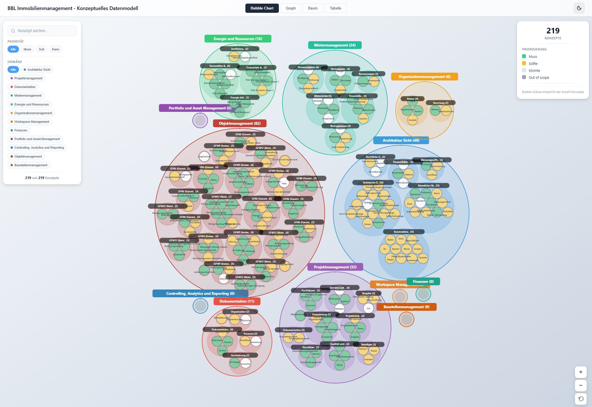
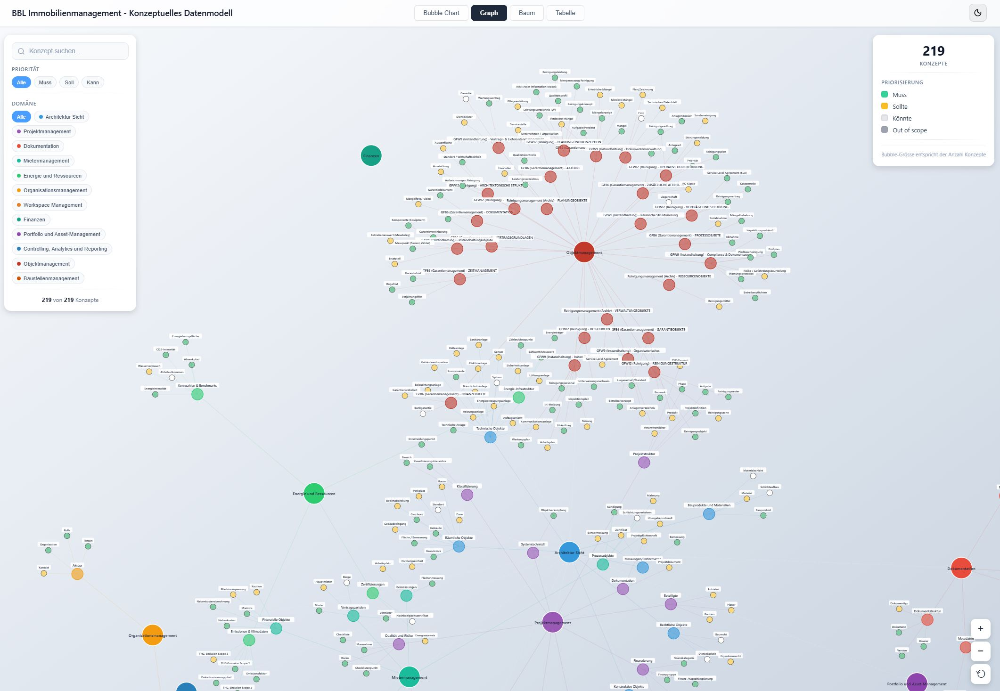

# EA-IMMO Conceptual Data Model

[](https://bbl-dres.github.io/data-catalog/prototype-datamodel/)
[](../LICENSE)

> [!CAUTION]
> Unofficial prototype with mockup and test data. Features may be incomplete, and it is not intended for production use.

Interactive visualisation of the EA-IMMO (Enterprise Architecture Immobilien) conceptual data model: business objects for real-estate management such as buildings, rooms and leases, defined in a standards-based, system-independent language and organised in prioritised domain groups. The domain documentation is a Confluence export kept under `docs/`. Part of the [BBL Data Catalog prototypes](../README.md).

## Demo

**Live demo:** https://bbl-dres.github.io/data-catalog/prototype-datamodel/

<p align="center">
  
  
</p>

## Features

- Bubble chart, graph, tree and table views of all concepts.
- Search and filters by priority (Muss, Soll, Kann) and domain.
- Domain groups prioritised with the MoSCoW method; colours and bubble sizes follow domain and concept count.
- Dark and light themes.
- Domain documentation, a standards analysis and PDF exports alongside the app.

## Run locally

Static vanilla JavaScript with JSON data loaded by `fetch()`, so serve it over HTTP from the repository root:

```bash
python -m http.server 8000
```

Open <http://localhost:8000/prototype-datamodel/>.

## Documentation

- [Documentation index (German)](docs/README.md) — goals, domain groups, principles, standards and repository structure.
- [Standards analysis](docs/Analyse%20-%20%C3%9Cbersicht%20Standards%20IMMO.md) — relevant industry standards for real-estate data.
- [Confluence migration scripts](scripts/README.md)

## License

Project code is covered by the [MIT License](../LICENSE). D3.js and Lucide are loaded from CDN under their own licenses.
