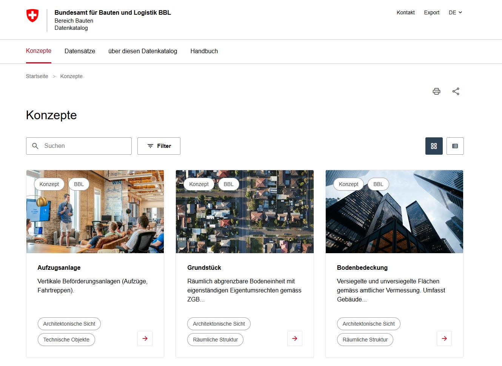
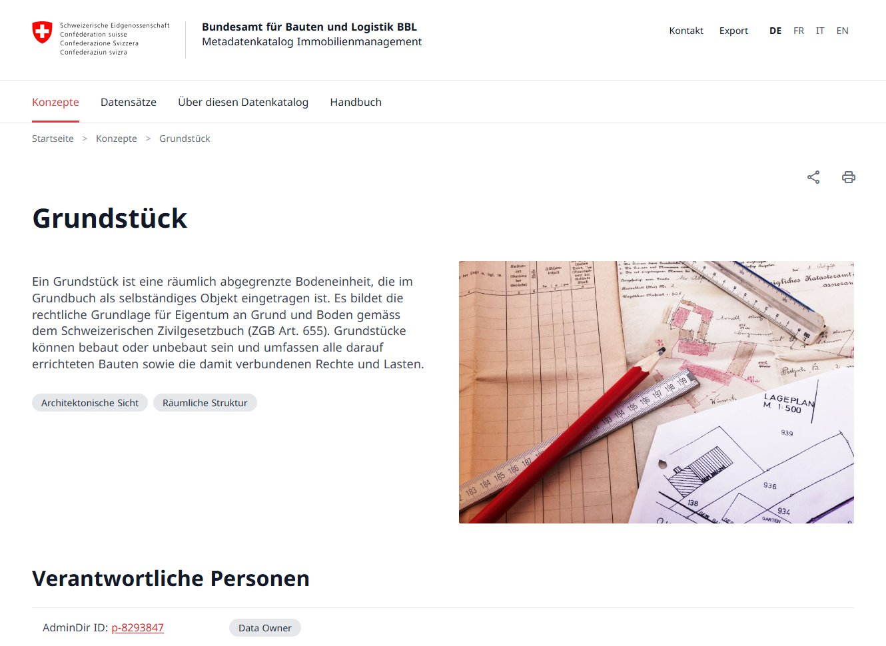

# Business Object & Dataset Catalog

[](https://bbl-dres.github.io/data-catalog/prototype-dcat/)
[](../LICENSE)

> [!CAUTION]
> Unofficial prototype with fictional data. Features may be incomplete, and it is not intended for production use.

Catalog of business objects (concepts) and datasets for BBL real-estate management, with search, tag and system filters, grid and list views, detail pages, and print and share links. The metadata follows the Swiss [DCAT-AP CH v3.0](https://www.dcat-ap.ch/) standard. In-app branding: *Datenkatalog IMMO*. Part of the [BBL Data Catalog prototypes](../README.md).

## Demo

**Live demo:** https://bbl-dres.github.io/data-catalog/prototype-dcat/

<p align="center">
  
  
</p>

## Features

- Browse business object concepts and datasets with full metadata, standards and attributes.
- Full-text search across titles, descriptions and tags.
- Filter by tags, source system, classification and personal-data status; the filter state lives in the URL.
- Grid and list view modes.
- Print and share-link support.
- Multilingual UI and content: German, French, Italian and English.
- Hash-based client-side routing and a responsive layout.

## Run locally

Static vanilla JavaScript with JSON data loaded by `fetch()`, so serve it over HTTP from the repository root:

```bash
python -m http.server 8000
```

Open <http://localhost:8000/prototype-dcat/>.

## Documentation

- [Data model](docs/DATAMODEL.md) — data files, content pages and images.
- [Development guide](../CLAUDE.md) — architecture, field schemas, i18n conventions and common tasks (the repository-level `CLAUDE.md`).

## License

Project code is covered by the [MIT License](../LICENSE). Noto Sans and Material Symbols are loaded from Google Fonts under their own licenses.
