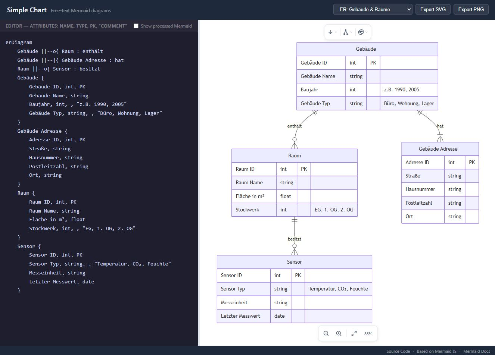
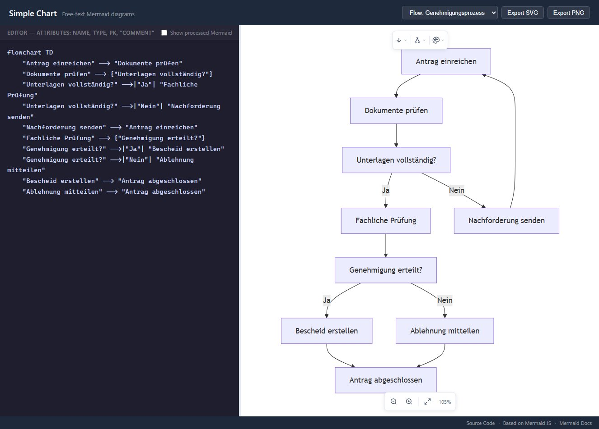

# Mermaid Diagram Editor

[](https://bbl-dres.github.io/data-catalog/prototype-erd/)
[](../LICENSE)

> [!CAUTION]
> Unofficial prototype with fictional data. Features may be incomplete, and it is not intended for production use.

Single-page editor for ER diagrams and flowcharts with free-text names: spaces, umlauts and special characters work without escaping. Built on [Mermaid](https://github.com/mermaid-js/mermaid). In-app branding: *Simple Chart*. Part of the [BBL Data Catalog prototypes](../README.md).

## Demo

**Live demo:** https://bbl-dres.github.io/data-catalog/prototype-erd/

<p align="center">
  
  
</p>

## Features

- Live Mermaid preview while typing.
- ER diagrams with a name-first attribute syntax (type, key and comment as shorthand).
- Flowcharts with free-text quoted labels; node IDs are generated automatically.
- Direction (TD, BT, LR, RL), layout and theme dropdowns.
- Zoom and pan, SVG and PNG export.
- Bundled examples in German and English.

## Run locally

Static vanilla JavaScript, so serve it over HTTP from the repository root:

```bash
python -m http.server 8000
```

Open <http://localhost:8000/prototype-erd/>.

## Documentation

- [Diagram syntax](docs/SYNTAX.md) — ER attribute format, flowchart labels and how names are preprocessed.

## License

Project code is covered by the [MIT License](../LICENSE). Mermaid (MIT) is loaded from CDN.
