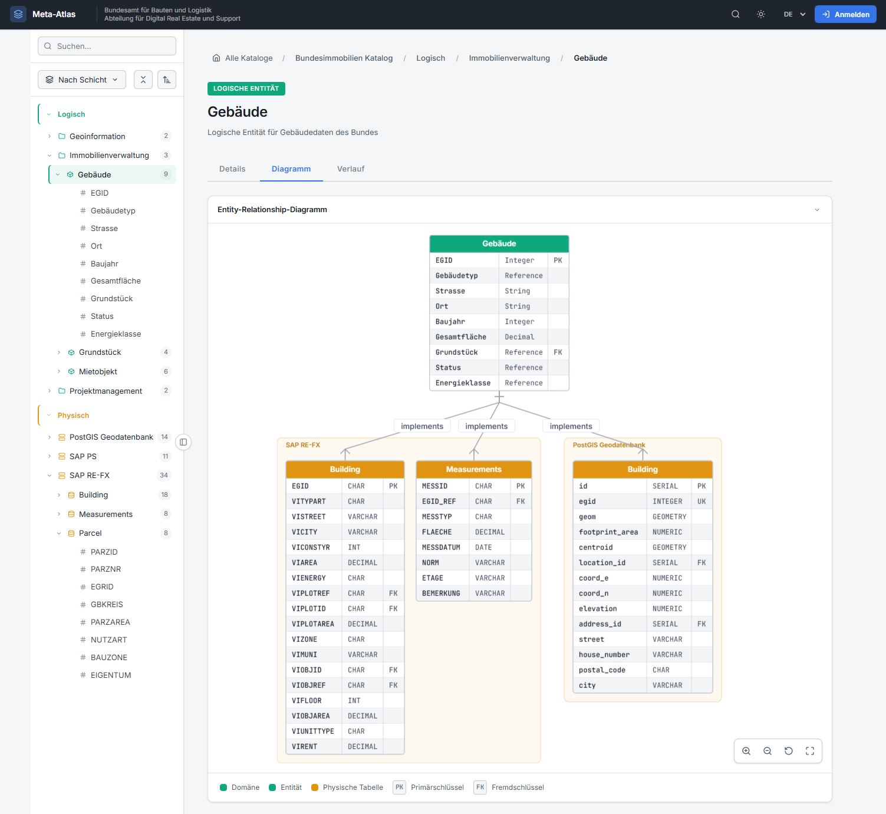
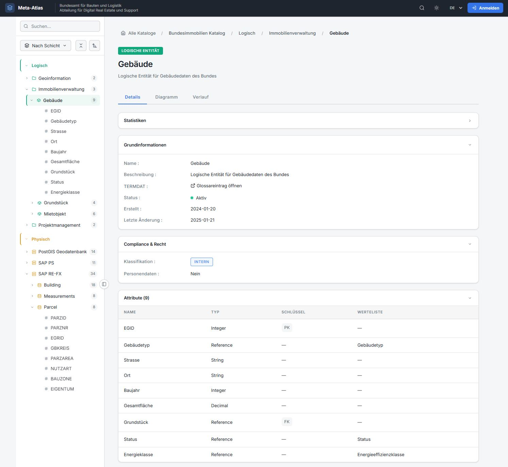

# Architecture Layer Browser

[](https://bbl-dres.github.io/data-catalog/prototype-layers/)
[](../LICENSE)

> [!CAUTION]
> Unofficial prototype with fictional data. Features may be incomplete, and it is not intended for production use.

Metadata catalog for navigating enterprise data assets across a three-layer architecture model, from conceptual through logical to physical, with cross-layer traceability and wiki-style detail pages. In-app branding: *Meta-Atlas*. Part of the [BBL Data Catalog prototypes](../README.md).

## Demo

**Live demo:** https://bbl-dres.github.io/data-catalog/prototype-layers/

<p align="center">
  
  
</p>

## Features

- Hierarchical tree navigation with layer switching (conceptual, logical, physical).
- Full-text search across all entities.
- Wiki-style detail pages with details, diagram and history tabs.
- Cross-layer traceability from logical entities to the physical tables that implement them.
- Multilingual: German, French, Italian and English, stored in the URL and `localStorage`.
- Dark and light themes, responsive design.

## Run locally

Static vanilla JavaScript with JSON data loaded by `fetch()`, so serve it over HTTP from the repository root:

```bash
python -m http.server 8000
```

Open <http://localhost:8000/prototype-layers/>.

## Documentation

- [Requirements](documentation/REQUIREMENTS.md)
- [Data model](documentation/DATAMODEL.md) and [SQL schema](documentation/SCHEMA.sql)
- [Design guide](documentation/DESIGNGUIDE.md)

## License

Project code is covered by the [MIT License](../LICENSE).
