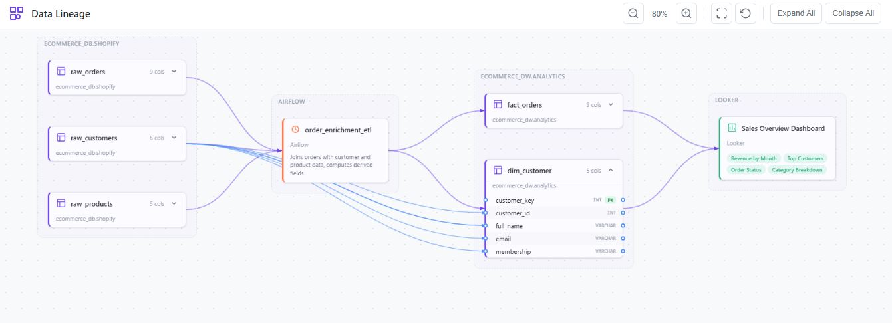
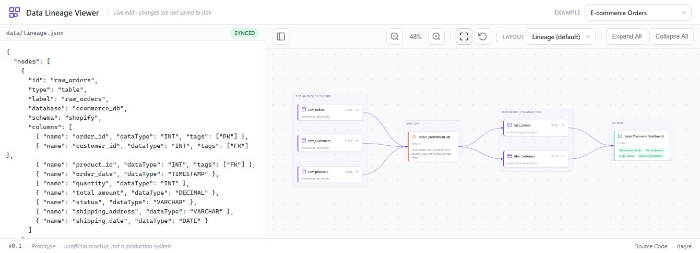

# Data Lineage Viewer

[](https://bbl-dres.github.io/data-catalog/prototype-lineage/)
[](../LICENSE)

> [!CAUTION]
> Unofficial prototype with fictional data. Features may be incomplete, and it is not intended for production use.

Interactive data-lineage graph with a live JSON editor, pan and zoom, column-level mappings and system-based grouping, laid out with dagre. Part of the [BBL Data Catalog prototypes](../README.md).

## Demo

**Live demo:** https://bbl-dres.github.io/data-catalog/prototype-lineage/

<p align="center">
  
  
</p>

## Features

- Split view: live JSON editor on the left, graph viewer on the right; the editor pane can be hidden.
- Three bundled examples: E-commerce Orders, Buildings (RE-FX and Net Zero), Music Streaming.
- Six layout presets: Lineage (default), Auto, Horizontal, Vertical, Compact and Flat.
- Dagre-based layered layout, optionally in compound mode so system boxes do not overlap.
- Expand tables to see columns; column-level lineage is drawn across pipelines.
- Click a node or column to highlight its upstream and downstream.
- Reference validation in the editor: every edge and `columnMapping` endpoint must resolve.

## Run locally

Static vanilla JavaScript with JSON data loaded by `fetch()`, so serve it over HTTP from the repository root:

```bash
python -m http.server 8000
```

Open <http://localhost:8000/prototype-lineage/>.

## Documentation

- [Data model](docs/DATAMODEL.md) — the `nodes[]` and `edges[]` shape of the example files.

## License

Project code is covered by the [MIT License](../LICENSE). [dagre](https://github.com/dagrejs/dagre) is loaded from CDN under its own license.
