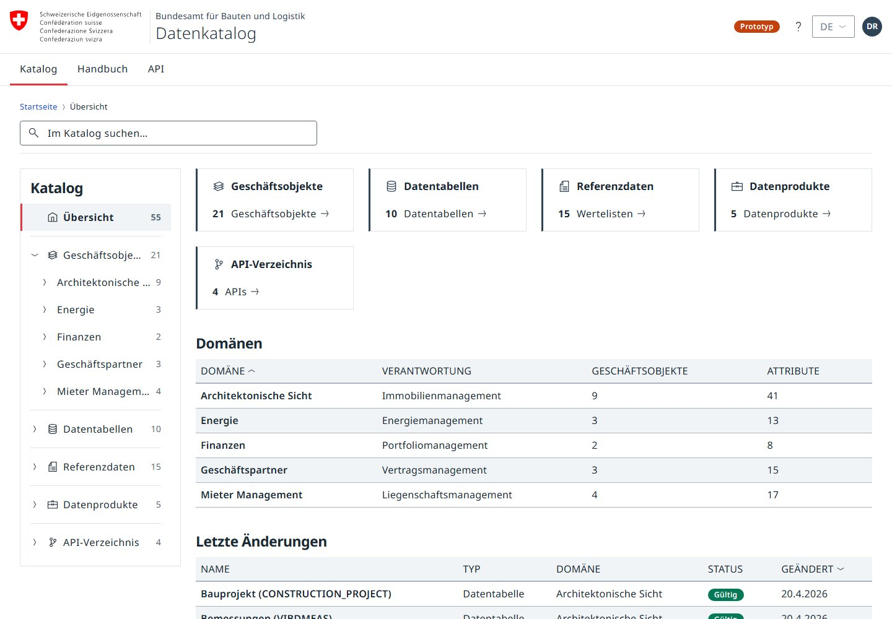
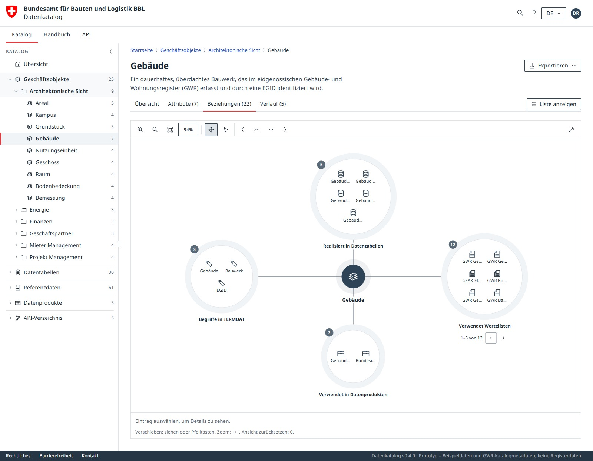

# Oblique Data Catalog

[](https://bbl-dres.github.io/data-catalog/prototype-oblique/)
[](../LICENSE)

> [!CAUTION]
> Unofficial prototype combining fictional examples and imported catalog metadata. Features may be incomplete, and it is not intended for production use.

Data catalog for the Swiss Federal Office for Buildings and Logistics (BBL) that follows the [Oblique](https://oblique.bit.admin.ch) design system of the federal administration. Browse domains, systems, business objects, attributes, data tables, code lists, data products and APIs. Domains combine an overview with tile/table browsing; other entries have profile pages with core metadata, applicable rows, relationships and a change history. In-app branding: *Datenkatalog*. Part of the [BBL Data Catalog prototypes](../README.md).

## Demo

**Live demo:** https://bbl-dres.github.io/data-catalog/prototype-oblique/

<p align="center">
  
  
</p>

## Features

- Compact 1b sidebar layout: sticky federal branding with a separate desktop navigation row, collapsible catalog/handbook navigation with icon flyouts, header search, and a mobile navigation drawer. The desktop sidebar starts at 320 px; drag its right divider to resize, or double-click to reset. Its width is remembered.
- Home page with a prominent search form, KPI cards, domain overview and latest changes.
- Seven catalog sections with a navigation tree, tile or sortable table view, and grouping by domain, responsibility, system, source, access or status.
- Profile pages with tabs for overview, attributes or fields or values, an interactive relationship diagram with zoom/pan/selection/fullscreen and a table alternative, and history.
- Domain pages with Übersicht, Kacheln and Tabelle, sharing collection search, grouping, sorting and filtered export. See [domain browsing](docs/behavior.md#navigation-and-collections).
- Relevance-ranked, umlaut-tolerant search with grouped suggestions, domain/type filters, one sortable result table with global pagination, and an optional, cited AI-answer demo. See [search options](docs/behavior.md#global-search).
- Handbook with chapter navigation, an OpenAPI 3.1 reference rendered by Swagger UI, and a help and contact popover.
- [Data model PDF export](docs/behavior.md#data-model-pdf-export) with a catalog scope tree, filter chips, Grid/List layouts, configurable columns, DE/FR/IT/EN documents, scrolling SVG preview, A4–A0 pages, continuation and federal branding. Multi-sheet [Excel export](docs/behavior.md#excel-export) and profile/list printing remain available; DCAT-AP CH export is a placeholder.
- Deep-linkable hash routes for section, entity, view mode, grouping, search query and handbook chapter.
- Two navigation models (entity-first or container-first), switched in `data/config.json` or with `?nav=container`.
- UI in German, French, Italian and English (fr/it/en as drafts); catalog labels use recorded translations with fallback.
- Public, read-only catalog data from Supabase. Self-hosted Noto Sans and pinned Swagger UI, ExcelJS, jsPDF and svg2pdf.js, with no build step. Export libraries load only when needed.

## Run locally

Apply the [Supabase SQL Editor seed and Data API setup](supabase/README.md#apply-to-the-existing-project) first. Then serve the vanilla JavaScript application over HTTP from the repository root:

```bash
python -m http.server 8000
```

Open <http://localhost:8000/prototype-oblique/>.

## Documentation

Start with the [documentation index](docs/README.md).

- [Architecture](docs/architecture.md), [design system](docs/design-system.md) and [behavior](docs/behavior.md) describe the current prototype.
- [Catalog data model](docs/data-model.md) defines the conceptual target; [implementation and migration](docs/data-model-implementation.md) covers PostgreSQL, current mappings and validation.
- [Business-object attributes](docs/business-object-attribute-proposal.md) are separate proposals for later content updates.
- [Imports and source evidence](docs/imports/README.md) preserve source instructions, curation decisions and unresolved gaps.
- [Test setup](tests/README.md) provides repeatable checks.

## License

Project code is covered by the [MIT License](../LICENSE). Oblique styles are MIT (Swiss Confederation, FOITT), Noto Sans is under the SIL Open Font License 1.1, Swagger UI is Apache 2.0, and [ExcelJS](vendor/exceljs/LICENSE), [jsPDF](vendor/jspdf/LICENSE) and [svg2pdf.js](vendor/svg2pdf.js/LICENSE) are MIT. The Swiss federal logo is protected by the Coat of Arms Protection Act and may only be used by federal bodies.
