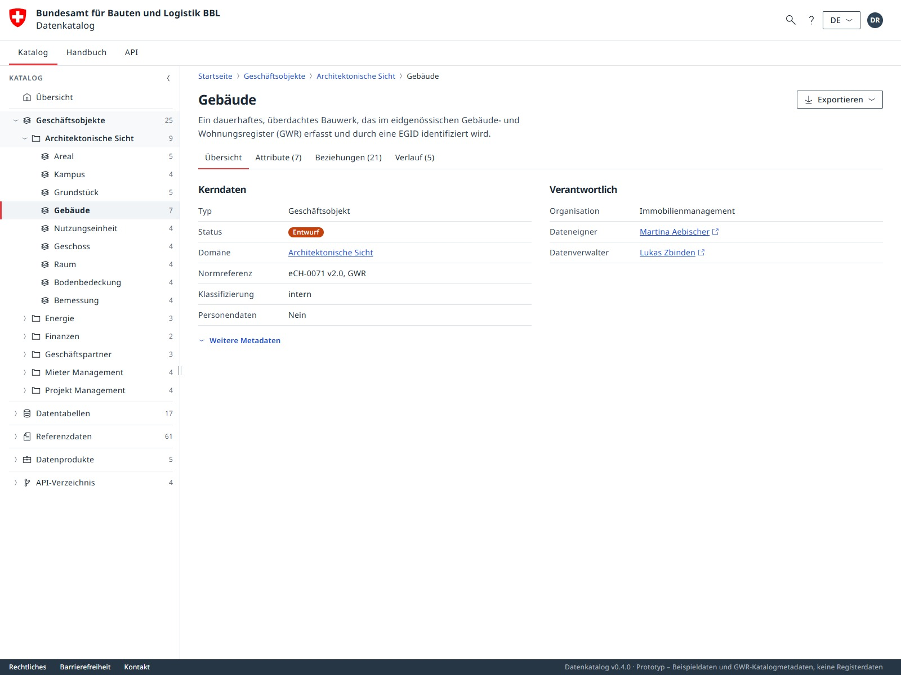

# Oblique Data Catalog

[](https://bbl-dres.github.io/data-catalog/prototype-oblique/)
[](../LICENSE)

> [!CAUTION]
> Unofficial prototype with fictional data. Features may be incomplete, and it is not intended for production use.

Data catalog for the Swiss Federal Office for Buildings and Logistics (BBL) that follows the [Oblique](https://oblique.bit.admin.ch) design system of the federal administration. Browse domains, systems, business objects, attributes, data tables, code lists, data products and APIs. Domains combine an overview with tile/table browsing; other entries have profile pages with core metadata, applicable rows, relationships and a change history. In-app branding: *Datenkatalog*. Part of the [BBL Data Catalog prototypes](../README.md).

## Demo

**Live demo:** https://bbl-dres.github.io/data-catalog/prototype-oblique/

<p align="center">
  
  
</p>

## Features

- Compact 1b sidebar layout: sticky federal branding with a separate desktop navigation row, collapsible catalog/handbook navigation with icon flyouts, header search, and a mobile navigation drawer. The desktop sidebar starts at 320 px; drag its right divider to resize, or double-click to reset. Its width is remembered.
- Home page with a prominent search form, KPI cards, domain overview and latest changes.
- Seven catalog sections with a navigation tree, tile or sortable table view, and grouping by domain, responsibility, system, source, access or status.
- Profile pages with tabs for overview, attributes or fields or values, an interactive relationship diagram with zoom/pan/selection/fullscreen and a table alternative, and history.
- Domain pages with Übersicht, Kacheln and Tabelle, sharing collection search, grouping, sorting and filtered export. See [domain browsing](docs/domain-browsing.md).
- Relevance-ranked, umlaut-tolerant search with grouped suggestions, domain/type filters, one sortable result table with global pagination, and an optional, cited AI-answer demo. See [search options](docs/search-options.md).
- Handbook with chapter navigation, an OpenAPI 3.1 reference rendered by Swagger UI, and a help and contact popover.
- Multi-sheet Excel export and print-to-PDF; DCAT-AP CH export remains a placeholder. See [Excel export](docs/excel-export.md) for workbook contents and scope.
- Deep-linkable hash routes for section, entity, view mode, grouping, search query and handbook chapter.
- Two navigation models (entity-first or container-first), switched in `data/config.json` or with `?nav=container`.
- UI in German, French, Italian and English (fr/it/en as drafts); catalog content stays German.
- Self-hosted Noto Sans, pinned Swagger UI and ExcelJS, no external requests, no build step. ExcelJS loads only when exporting.

## Run locally

Static vanilla JavaScript with JSON data loaded by `fetch()`, so serve it over HTTP from the repository root:

```bash
python -m http.server 8000
```

Open <http://localhost:8000/prototype-oblique/>.

## Documentation

- [Maintainability review, 5 September](docs/maintainability-review-2026-09-05.md) — English code naming, compact comments, module boundaries and shared contracts.
- [Design polish review, 5 September](docs/design-polish-2026-09-05.md) — visual bugs, shared components, token refinements and verification.
- [Developer review, 5 September](docs/developer-review-2026-09-05.md) — code findings, implemented fixes, verification and remaining limits.
- [Test setup](tests/README.md) — repeatable core, functional and responsive checks.
- [Responsive strategy and review](docs/responsive-strategy.md) — current layout decisions, device behavior, evidence and browser checks.
- [Relationship diagram](docs/relationship-diagram.md) — controls, dense groups, phone behavior and validation.
- [Architecture](docs/architecture.md) — file structure, rendering model, routing, state, events, how to extend.
- [Compact layout 1b](docs/compact-layout.md) — implementation plan, mockup mapping, responsive behavior and validation; includes the preserved original prototype.
- [Design system](docs/design-system.md) — how the tokens map to Oblique, what was taken from the Figma library, known deltas.
- [Contrast review](docs/contrast-review-2026-09-05.md) — measured text, graphics and focus states; targeted palette fixes and regression checks.
- [Mobile and responsive refinement](docs/mobile-responsive-review-2026-09-05.md) — keyboard viewports, touch sizing, short-screen overlays and contained API tables.
- [Data model](docs/data-model.md) — JSON files and fields.
- [Earlier code review](docs/code-review.md) — historical findings from 2 September 2026.
- [Design review](docs/design-review.md) and [responsive review](docs/design-review-responsive.md) — CD conformance, accessibility, contrast, phone and tablet layout.
- [Wireframes](docs/wireframes/) — the Claude Design mockup this app was built from.

## License

Project code is covered by the [MIT License](../LICENSE). Oblique styles are MIT (Swiss Confederation, FOITT), Noto Sans is under the SIL Open Font License 1.1, Swagger UI is Apache 2.0, and [ExcelJS](vendor/exceljs/LICENSE) is MIT. The Swiss federal logo is protected by the Coat of Arms Protection Act and may only be used by federal bodies.
