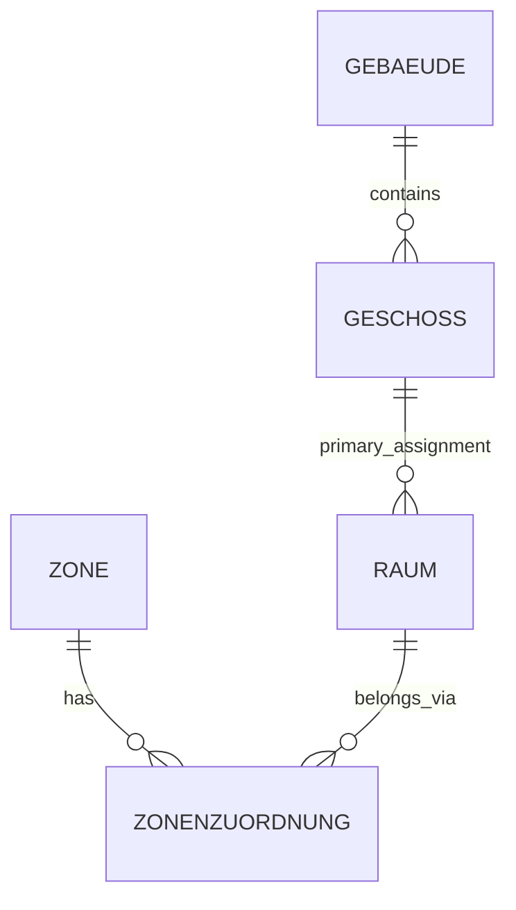

# Business-object attribute proposal

**Current catalog content: 13 September 2026.** The seven profiles contain **34 Gebäude, 12 Geschoss, 10 Raum, 9 Zone, 21 Grundstück, 8 Wirtschaftseinheit and 10 Bemessung direct attributes**: **104 direct definitions**, excluding retired definitions, plus ten visible referenced measurement definitions. The entire catalog has twelve visible measurement definitions; Nutzungseinheit and Parkplatz account for the other two. Existing identities and history remain available.

**Implemented:** Gebäude retains GF/GGF/VMF/EBF/GV. The [approved minimum](review/2026-09-13-basic-measurements-proposal.md) adds Grundstück GSF; Raumfläche (netto), Lichte Raumhöhe, Raumvolumen (netto); Nutzungseinheit NGF; Parkplatz Parkierfläche; Zone Nettofläche. The earlier optional Raum/Zone VMF and Zonenvolumen selections are outside this minimum. Geschoss's four quantity definitions remain conceptual. Values and evidence stay in Bemessung; no automatic calculation is implemented.

The [spatial review](review/2026-09-13-spatial-fks.md) adds only 23 missing FK-labelled attributes across 14 profiles, including Gebäude.Grundstück-IDs and Zone.Raum-IDs below. Areal is a separate optional group; no explicit reference-target metadata or operational relationship table is added. All active business objects use ID as the PK display name.

The [source review](review/2026-09-07-building-attribute-review.md) preserves the GIS IMMO, BBL RE-FX and GWR evidence. Its earlier attribute counts and SQL conclusions are historical; this document governs the current proposed content. Source-specific inventories and technical mappings remain separate. **Gebäudehülle (AO) remains in the GIS IMMO catalog.**

The [canonical property-set and business-key decisions](data-model.md#property-sets-and-business-keys) govern the proposed structured representation of this content. Current SQL still stores group/key-role markers in comments; the component lists and reference descriptions here do not establish deployed structured fields or physical foreign-key constraints. Review this proposal using the canonical [content-readiness checklist](data-model.md#content-readiness-review).

The [classification follow-up](review/2026-09-13-building-classifications.md) replaces the combined Gebäudeart definition with two attributes bound to the existing BBL lists, and binds Bauperiode/Gebäudeklasse to GBAUP/GKLAS. The combined definition remains archived with its history.

**Additional scope decision:** [Gebäudezustand and Schutz-/Denkmalstatus](review/2026-09-13-building-condition-heritage.md) are added. They temporarily retain source wording as text because no official value lists are documented. NF/HNF and Anzahl Wohnungen are explicitly excluded at this point.

## Reading the list

**Benennung und Formatierung:** Attributnamen werden einheitlich auf Deutsch geführt, insbesondere **ID**. Die Herkunft aus SAP oder BBL steht in der Definition, ohne entsprechenden Namenszusatz. Fachlich unterscheidende Zusätze wie **(GWR)** und **(amtlich)** bleiben erhalten. Die sieben Attributtabellen verwenden dieselben Spalten und dieselbe Schreibweise für **Property Set**. Geometrische Werte heissen **Geometrie**. **Geometriebezug** wurde am 13.09.2026 archiviert; Geometrie und Bemessung.FID bleiben erhalten. Der fachliche Lebenszyklus heisst **Status**, am Gebäude ausdrücklich **Status (GWR)** mit der Wertelistenbindung **GWR Gebäudestatus (GSTAT)**. Bewirtschaftungsstatus bezeichnet einen anderen Sachverhalt und bleibt separat. Bestehende Kennungen und technische Namen bleiben stabil.

- **Kernangabe:** needed for the business use described in the definition. Missing information remains a visible completeness gap.
- **Bedingt:** needed under the stated condition. Applicability and unknown values must be distinguished.
- **Optional:** useful information that is not a prerequisite for the intended use.

**PK** denotes the business object's primary identifier; it does not replace the catalog record's internal UUID. **PK-Komponente** denotes one separately stored part of a composite business key; no component is assumed to be unique on its own. **FK** denotes a reference to another business object or an external entity. Examples include Gebäude-ID on Geschoss, Geschoss-ID on Raum, EGID, EGRID, Eigentümer and Quelle. An FK here may target another portfolio object, a party, a document or a register record; it does not imply an implemented database constraint.

These are descriptive business requirements. Definitions and vocabularies remain **draft** during review. A missing value does not make a requirement inapplicable: record a completeness gap. “Not applicable”, “unknown” and a confirmed numeric zero are different states.

The attribute tables describe the information exposed by each business profile. Repeated owner and source references belong to related assignment rows. GF, GGF, VMF, EBF and GV are explicit building profile values; GSF is an explicit parcel profile value. Their **Basisbemessungen** tables complement the direct attribute tables and expose the values through related Bemessungen. The tables therefore do not prescribe one wide physical database table.

Value types describe the expected business value. An `identifier` preserves its textual identity, including letters and leading zeros; it does not declare a physical primary key. A `year` retains year precision. A `structured` value retains the context named in its definition; its parts belong in separate fields or a related record when implemented, not in an unstructured string. A `code` does not imply that an approved vocabulary already exists.

Object/attribute descriptions are German working definitions. Source-file revision, source observation/extraction date, business validity and catalog-edit date are distinct. An edit to this proposal changes none of those dates on actual property records.

**Temporal context:** Gültig ab/bis in the profiles concern the actual object, measurement or assignment described, not approval of its catalog definition. Dated changes to status, use, ownership, Teilportfolio, geometry and relationships retain their own validity even where the compact object profile has no separate date columns. An open end and an unknown historical end are different states; the value alone cannot distinguish them. Agree one interval convention and an explicit unknown/open-end treatment before implementation. A relationship interval must fit the relevant versions of both endpoints; an absent history cannot establish a past assignment.

**Requirement context:** presence expresses BBL's proposed information needs, not a claim about GWR reporting obligations or source-system mandatory fields. Lifecycle and intended use determine applicability. Planned, realised and historical observations must remain distinguishable; an unrealised or demolished object does not acquire fabricated current counts or measurements. Unknown required information remains a gap.

## SAP business keys and their components

**Confirmed BBL requirement:** Gebäude-ID and Grundstück-ID use the SAP key components below. Keep every component as its own attribute in **Identifikation**, with letters and leading zeros preserved.

| Business object | Business PK | Key components in order |
|---|---|---|
| Gebäude | Gebäude-ID | Buchungskreis / Wirtschaftseinheit / Gebäudenummer |
| Grundstück | Grundstück-ID | Buchungskreis / Wirtschaftseinheit / Grundstücksnummer |
| Wirtschaftseinheit | Wirtschaftseinheit-ID | Buchungskreis / Wirtschaftseinheit |

**Wirtschaftseinheit** in these keys denotes the SAP WE number. Together with Buchungskreis it identifies the referenced Wirtschaftseinheit; neither a WE number nor a local building/parcel number is treated as globally unique. The two WE components are also explicit in the Wirtschaftseinheit profile.

The named PK exposes the composite identity; it is not an additional independently editable identifier. Derive its representation consistently from the separate components. The slash notation documents their order, not an unverified SAP field format, length or padding rule. Building and parcel key values can coincide, so references retain the business-object type as well as the full key. The catalog UUID remains separate.

A change to Buchungskreis, Wirtschaftseinheit or the local object number changes this SAP business key. Preserve dated old/new key correspondences and update dependent references consistently; a new key alone does not prove that a new physical building or parcel exists. The physical boundary and identity-continuity review remains relevant even though the key components are now confirmed.

**Grundstücksnummer** is the SAP/BBL component. **Grundstücksnummer (amtlich)** identifies the registered parcel in its Nummerierungsbereich. Preserve both, together with EGRID where applicable; do not substitute the official number for the BBL key component.

## Gebäude — 34 direct attributes and 5 referenced measurements

**Working definition:** Ein baulich abgegrenztes, dauerhaftes und überdachtes Bauwerk, das im Portfolio mit eigener Identität über seinen Lebenszyklus geführt wird. Erfasst werden auch seine geplante Ausprägung und der historische Nachweis nach einem Abbruch oder einer Nichtrealisierung.

The physical boundary comes first. A commercial BBL/SAP object, an architectural object and a GIS geometry record can describe different extents. Preserve scoped operational identifiers and reviewed correspondences instead of assuming that identical labels, one address or one outline identify the same object. Use **Gebäude-ID = Buchungskreis / Wirtschaftseinheit / Gebäudenummer** as the business primary key, with each component separately available. **EGID is an optional foreign reference to GWR**, applicable to matching Swiss buildings. The portfolio is worldwide; Swiss register presence does not determine whether a building exists in the catalog.

**Identity prerequisite:** the key components are confirmed; verify that the SAP object identified by that key matches the building extent represented here. If one SAP object covers several physical buildings, or several SAP objects describe one building, neither a label nor adding EGIDs resolves the primary-key mismatch. Review those cases explicitly before migration; do not invent a key suffix or duplicate the SAP key across buildings. SAP renumbering or system migration needs a traceable identity correspondence.

| Attribut | Property Set | Schlüsselrolle | Datentyp | Fachliche Definition | Vollständigkeit |
|---|---|---|---|---|---|
| ID | Identifikation | `PK` | `identifier` | Zusammengesetzter SAP-basierter Primärschlüssel des Gebäudes aus Buchungskreis, Wirtschaftseinheit und Gebäudenummer. Die drei Bestandteile werden separat geführt; die Gebäude-ID ist deren konsistente Gesamtrepräsentation. Eine lokale Gebäudenummer oder EGID ersetzt diesen Schlüssel nicht. | Kernangabe |
| Grundstück-IDs | Räumliche Zuordnung | `FK` | `structured` | Vollständige IDs der zugeordneten Grundstücke; mehrere Parzellen sind möglich. EGRID bleibt separat. | Nach anwendbarer Zuordnung |
| Buchungskreis | Identifikation | `PK-Komponente` | `identifier` | SAP-Buchungskreis als erster Bestandteil der Gebäude-ID und Kontext der Wirtschaftseinheit. Den Originalwert einschliesslich führender Nullen erhalten; er ist weder Teilportfolio noch Profit Center. | Kernangabe |
| Wirtschaftseinheit | Identifikation | `PK-Komponente` / `FK` | `identifier` | SAP-Nummer der Wirtschaftseinheit als zweiter Bestandteil der Gebäude-ID. Zusammen mit Buchungskreis referenziert sie genau die Wirtschaftseinheit dieses SAP-Schlüssels; die Nummer allein ist kein vollständiger Fremdschlüssel. | Kernangabe |
| Gebäudenummer | Identifikation | `PK-Komponente` | `identifier` | Lokale BBL-Gebäudenummer in SAP innerhalb von Buchungskreis und Wirtschaftseinheit; dritter Bestandteil der Gebäude-ID. Schreibweise und führende Nullen erhalten. Keine Hausnummer, EGID oder allein weltweit eindeutige Gebäudekennung. | Kernangabe |
| Bezeichnung | Identifikation | — | `text` | Lesbarer Gebäudename oder kurze Bezeichnung für die fachliche Bewirtschaftung. | Kernangabe |
| Land | Adresse | — | `code` | Land der festgelegten Gebäude-Hauptadresse als separater Wert nach dem vereinbarten Ländervokabular. Das weltweite Portfolio wird nicht auf die Schweiz beschränkt. | Kernangabe |
| Region / Kanton / Bundesstaat | Adresse | — | `text` | Administrative Region der Hauptadresse, beispielsweise Kanton, Bundesstaat oder Provinz. Als eigener Adressbestandteil führen; Bedeutung und Schreibweise richten sich nach dem betreffenden Land. | Bedingt: Erforderlich, sofern die administrative Region Bestandteil der Adresse im betreffenden Land ist. |
| Ort | Adresse | — | `text` | Postalisch oder örtlich verwendete Ortsbezeichnung der Gebäude-Hauptadresse als separater Wert. Sie ist nicht automatisch identisch mit dem amtlichen Gemeindenamen. | Kernangabe |
| Postleitzahl | Adresse | — | `text` | Postleitzahl der Hauptadresse als Text. Buchstaben, Leerzeichen, Bindestriche und führende Nullen werden nach dem nationalen Adresssystem erhalten; keine Umwandlung in eine Zahl. | Bedingt: Erforderlich, sofern für die betreffende Adresse eine Postleitzahl vergeben ist. |
| Strasse | Adresse | — | `text` | Strassenname der Hauptadresse ohne Hausnummer, Postleitzahl oder Ort. Bei Gebäuden ohne Strassenadresse wird kein Strassenname erfunden. | Bedingt: Erforderlich, sofern das Gebäude eine Strassenadresse hat. |
| Hausnummer | Adresse | — | `text` | Hausnummer einschliesslich der zum amtlichen Nummernwert gehörenden Buchstaben oder Zeichen als separater Textwert. Nicht mit Strassenname oder Gebäudekennung verketten. | Bedingt: Erforderlich, sofern der Hauptadresse eine Hausnummer zugeteilt ist. |
| Adresszusatz | Adresse | — | `text` | Ergänzende lokale Adressangabe, soweit sie zur eindeutigen Adressierung benötigt wird und nicht in den übrigen Adressbestandteilen enthalten ist. Keine vollständige verkettete Adresse und kein Ersatz für bekannte Einzelbestandteile. | Bedingt: Erforderlich, wenn der Zusatz zur eindeutigen Adressierung benötigt wird. |
| WGS84 Breitengrad | Geometrie | — | `decimal` | Breitengrad des festgelegten Gebäude-Referenzpunkts im Bezugssystem WGS84 in Dezimalgrad, von −90 bis +90. Separat vom Längengrad führen; 0 ist ein gültiger Wert und kein Platzhalter für unbekannt. Der Punkt ist nicht automatisch ein Eingang oder eine Grundrissgeometrie. | Kernangabe |
| WGS84 Längengrad | Geometrie | — | `decimal` | Längengrad desselben Gebäude-Referenzpunkts im Bezugssystem WGS84 in Dezimalgrad, von −180 bis +180. Separat vom Breitengrad führen; 0 ist ein gültiger Wert und kein Platzhalter für unbekannt. Quelle, Aktualität und Punktbedeutung müssen nachvollziehbar bleiben. | Kernangabe |
| Geometrie | Geometrie | — | `geometry` | Punktgeometrie des bewirtschafteten Gebäudes in WGS84 (EPSG:4326). Sie beschreibt denselben festgelegten Referenzpunkt wie WGS84 Breitengrad und Längengrad. Bei GeoJSON gilt die Reihenfolge [Längengrad, Breitengrad]; Punkt und Einzelkoordinaten müssen übereinstimmen. Grundriss und Gebäudehülle bleiben separate Geometrien. | Kernangabe |
| Gebäudeart 1 | Klassifikation und Nutzung | — | `code` | BBL-Gebäudeklassifikation Stufe 1 gemäss RE-FX. Zulässige Werte stehen in BBL Gebäudeart 1. GWR-Klassifikationen bleiben separat. | Bedingt: Erforderlich im abgestimmten Geltungsbereich der BBL-Gebäudeklassifikation. |
| Gebäudeart 2 | Klassifikation und Nutzung | — | `code` | BBL-Gebäudeklassifikation Stufe 2 gemäss RE-FX. Zulässige Werte stehen in BBL Gebäudeart 2; die zugehörige Stufe 1 wird separat geführt. | Bedingt: Erforderlich im abgestimmten Geltungsbereich der BBL-Gebäudeklassifikation. |
| Status (GWR) | Bauwerk und Lebenszyklus | — | `code` | Physischer Lebenszyklus des Gebäudes gemäss der Werteliste GWR Gebäudestatus (GSTAT). Die zulässigen Werte werden durch diese verknüpfte Werteliste eingeschränkt. Bewirtschaftung, Verkauf, Eigentum und Katalogfreigabe sind davon getrennt. Die Verwendung des Vokabulars bescheinigt weder einen GWR-Registereintrag noch einen amtlich bestätigten Status; Herkunft und Gültigkeit des konkreten Werts bleiben nachvollziehbar. | Kernangabe |
| Bewirtschaftungsstatus | Bewirtschaftung | — | `code` | Fachlicher Bewirtschaftungszustand des Gebäudes im BBL-Portfolio mit massgeblichem Datum. Für Gebäude im BBL-Bewirtschaftungsumfang benötigt. Vokabular und Ableitung sind abzustimmen; physischer Status, Eigentumsverhältnis und gegebenenfalls mehrere SAP-System-/Anwenderstatus bleiben getrennt. | Kernangabe |
| Gebäudezustand | Bewirtschaftung | — | `text` | Beurteilung des baulichen Zustands des Gebäudes gemäss der dokumentierten Quelle. Originalbezeichnung, Beurteilungsdatum und Bewertungsverfahren erhalten; fehlende Angaben bedeuten nicht guter Zustand. | Optional; Quellwerteliste noch zu bestätigen. |
| Baujahr | Bauwerk und Lebenszyklus | — | `year` | Jahr der physischen Fertigstellung des Gebäudes. Renovation, Nutzungsänderung und geplante Fertigstellung sind gesonderte Sachverhalte und ersetzen das Baujahr nicht. | Bedingt: Für fertiggestellte Gebäude erforderlich; unbekanntes Baujahr als Lücke führen und eine belegte Bauperiode ergänzen. |
| Bauperiode | Bauwerk und Lebenszyklus | — | `code` | Periode der Fertigstellung des Gebäudes gemäss der Werteliste GWR Bauperiode (GBAUP). Herkunft und allfällige Ableitung erhalten; aus einer Periode kein genaues Baujahr ableiten. | Bedingt: Erforderlich, wenn nur eine Bauperiode bekannt ist oder die Auswertung eine solche Einteilung benötigt. |
| Abbruchjahr | Bauwerk und Lebenszyklus | — | `year` | Jahr des vollständigen physischen Abbruchs. Verkauf, Ende der Nutzung und Ausscheiden aus der Bewirtschaftung sind kein Abbruchnachweis; ein Teilabbruch wird als eigenes datiertes Ereignis geführt. | Bedingt: Für vollständig abgebrochene Gebäude erforderlich; ein unbekanntes Jahr bleibt eine Vollständigkeitslücke. |
| Anzahl Geschosse | Bauwerk und Lebenszyklus | — | `integer` | Gesamtzahl der Geschosse des identifizierten Gebäudes, einschliesslich ober- und unterirdischer Geschosse, nach einer dokumentierten baulichen Zählregel. Erdgeschoss, Dach- und Zwischengeschosse sowie Kellergeschosse nach dieser Regel behandeln; Quelle und massgeblichen Stichtag angeben. GIS IMMO gastw ist ein Kandidat für den Totalwert. SAP FLOORS/BASEMENTS und GWR GASTW erst nach Prüfung ihrer Zählregeln übernehmen: GWR zählt bestimmte Dach-/Untergeschosse nach Nutzung oder Beheizung und schliesst Kellergeschosse aus. Unbekannte Teilzahlen werden weder als 0 eingesetzt noch ungeprüft summiert. | Bedingt: Für baulich realisierte Gebäude erforderlich; unbekannte Anzahlen bleiben Vollständigkeitslücken. |
| EGID | Registerbezug | `FK` | `identifier` | Fachliche Fremdreferenz (FK) zum zugehörigen Gebäude im Schweizer GWR, sofern dieser Registerbezug anwendbar ist. Sie ist kein Primärschlüssel des BBL-/SAP-Gebäudes. Die Zuordnung setzt übereinstimmende physische Gebäudegrenzen voraus; ausländische Gebäude benötigen keine EGID, und mehrere Kandidaten werden nicht in einem Einzelwert verkettet. | Bedingt: Erforderlich bei anwendbarem Schweizer GWR-Bezug und bestätigter Übereinstimmung der physischen Gebäudeabgrenzung. |
| EGRID | Registerbezug | `FK` | `identifier` | Fachliche Fremdreferenz auf das für das Gebäude bezeichnete Grundstück im Schweizer Registerkontext. Bei mehreren Grundstücksbeziehungen bezeichnet dieser Einzelwert nur die dokumentiert ausgewählte Referenz; alle weiteren Zuordnungen bleiben separat erhalten. Eine EGRID bestimmt weder die Gebäude-ID noch automatisch eine Landparzellengeometrie. | Bedingt: Erforderlich, sofern für das Gebäude ein massgeblicher Schweizer Grundstücksbezug mit EGRID festgelegt ist; für ausländische Gebäude keine EGRID erfinden. |
| Gebäudekategorie (GWR) | Klassifikation und Nutzung | — | `code` | Gebäudekategorie des GWR nach Zweckbestimmung, insbesondere hinsichtlich Wohn- und Nichtwohnnutzung. Die bestehende GKAT-Referenzliste wird getrennt von BBL-Gebäudeart verwendet. | Bedingt: Bei einem anwendbaren GWR-Datensatz erforderlich; ohne entsprechenden Registerbezug keine Kategorie erfinden. |
| Gebäudeklasse (GWR) | Klassifikation und Nutzung | — | `code` | Detaillierte Gebäudeklassifikation gemäss der Werteliste GWR Gebäudeklasse (GKLAS), auf Grundlage der erweiterten Eurostat-Klassifikation. Gebäudekategorie und BBL-Gebäudeart bleiben separat. | Bedingt: Bei anwendbarem GWR-Bezug erforderlich. Fehlende Werte bleiben sichtbar; die Kompatibilität des vorhandenen 4.2-Vokabulars mit 5.0 bleibt zu prüfen. |
| Schutz-/Denkmalstatus | Klassifikation und Nutzung | — | `text` | Dokumentierter Schutz- oder Denkmalstatus des Gebäudes gemäss der zuständigen Quelle. Originalbezeichnung, betroffenen Umfang und massgeblichen Stand erhalten. Ein fehlender Eintrag bedeutet nicht kein Schutz. | Optional; Quellwerteliste noch zu bestätigen. |
| Eigentumsart | Eigentum | — | `code` | Bewirtschaftungsbezogene Einordnung des Gebäudes mit den drei fachlich vorgegebenen Werten Eigentum, Anmiete oder Spezialfall. Die Zuordnung aus den SAP-Stammdaten mit ihrer Gültigkeit erhalten. Diese Kategorie ist weder die Identität des eingetragenen Eigentümers noch die grundbuchliche Eigentumsform. | Kernangabe |
| Eigentümer | Eigentum | `FK` | `identifier` | Im Grundbuch eingetragener Eigentümer im für das Gebäude massgeblichen Grundstücks- beziehungsweise Registerrechtsbezug. Die Zuordnung am Gebäude wird mit diesem Registerbezug und ihrer Gültigkeit geführt; im Ausland ist das entsprechende zuständige Register massgeblich. Mehrere Eigentümer erhalten separate Zuordnungen; eine SAP-Geschäftspartner-ID ist nur bei bestätigtem Abgleich die Referenz auf die eingetragene Person oder Organisation. | Kernangabe |
| Teilportfolio | Portfoliomanagement | — | `code` | Fachliche Teilportfolio-Zuordnung des Gebäudes im BBL-Portfolio mit dem verwendeten BBL-Wert und nachvollziehbarer Gültigkeit. Teilportfolio, Teilportfoliogruppe, Wirtschaftseinheit und Profit Center sind getrennte Sachverhalte. Die BBL-Werteliste definiert die Bedeutung; das liefernde System ist separate Quelleninformation. | Kernangabe |
| Objektstrategie | Portfoliomanagement | — | `code` | Fachliche Strategie für den weiteren Umgang mit dem Gebäude gemäss SAP-Stammdaten. Die im Quellsystem geführte Zuordnung mit ihrer Bedeutung und zeitlichen Gültigkeit erhalten; Objektstrategie, Teilportfolio und aktueller Bewirtschaftungsstatus sind getrennte Angaben. Die konkrete Werteliste und technische SAP-Abbildung sind noch zu bestätigen. | Kernangabe |

### Basisbemessungen des Gebäudes

Diese fünf referenzierten Definitionen sind als Attribute am Gebäude sichtbar. Jede bezeichnet die passende Bemessung des Gebäudes für den fachlichen Zweck und Stichtag. Die Zahlenwerte, Einheit, Quelle, Standard und Gültigkeit bleiben bei Bemessung; es entstehen keine unabhängig gepflegten Kopien.

| Profilwert | Property Set | Bemessungsart | Objektauswahl (abgeleitet) | Einheit | Vollständigkeit |
|---|---|---|---|---|---|
| Geschossfläche (GF) | Basisbemessungen | `GF` | Bezugsgebäude | m² | Kernangabe |
| Gebäudegrundfläche (GGF) | Basisbemessungen | `GGF` | Bezugsgebäude | m² | Kernangabe |
| `EBF` | Energiebezugsfläche EBF | Energetische Bezugsfläche des identifizierten Gebäudes in m² nach der tatsächlich angewendeten Regel und thermischen Abgrenzung. SIA 380 und ältere SIA-416/1-Ausgaben unterscheiden; Ausgabe und Nachweis unter Standard/Quelle erhalten. Nicht pauschal aus GF, GGF oder Geschossanzahl berechnen. Geschätzte GWR- oder GIS-Angaben behalten Genauigkeit, Quelle und Stand. |
| Vermietbare Fläche (VMF) | Basisbemessungen | `VMF` | Bezugsgebäude | m² | Bedingt: anwendbare Vermietungsflächenregel |
| Energiebezugsfläche (EBF) | Basisbemessungen | `EBF` | Bezugsgebäude | m² | Bedingt: beheizte oder gekühlte energetische Bezugsfläche |
| Gebäudevolumen (GV) | Basisbemessungen | `GV` | Bezugsgebäude | m³ | Kernangabe |

GF, GGF und GV behalten die dokumentierte SIA-416-Grundlage; VMF die bestätigte Vermietungsregel. EBF behält ihre energetische Grundlage und Ausgabe (SIA 380 beziehungsweise historisch SIA 416/1). Unbekannt, nicht anwendbar und ein bestätigter Wert 0 bleiben verschieden. Die [Quellenprüfung](review/2026-09-13-catalog-refinement.md#building-profile) dokumentiert die Grenzen der GIS-, RE-FX- und GWR-Übernahme.

Ober- und unterirdische Quellwerte bleiben erhalten, gehören aber nicht mehr zur vereinfachten Auswahl am Gebäude. Auch Anzahl Geschosse wird nicht ungeprüft aus Quellzählungen summiert. Es wird kein Berechnungsmechanismus eingeführt.

### Address, coordinates and geometry

The seven address attributes describe one designated main building address in separate columns: country, region/state/canton, locality, postcode, street, house number and supplement. Preserve national address conventions and textual postal/house-number values. Assemble a display address from these components; do not store the components only in one concatenated address string.

Latitude and longitude are two separate numeric attributes in **WGS84 decimal degrees**, referring to the same building reference point. Latitude is north/south and longitude east/west. Missing coordinates remain unknown; zero is valid. Coordinate ranges are documented business expectations, not physical constraints added to a table of building instances.

Additional addresses and entrances require separate related records keyed by Gebäude-ID, with their own components and purpose. Do not pack several addresses into the main-address columns. A building reference point, an entrance point and a footprint retain their distinct meanings.

The managed **building geometry is a WGS84 Point**. Its latitude and longitude must describe the same point. Building points and parcel polygons use WGS84. GeoJSON uses **[longitude, latitude]**, equivalent to OGC CRS84, as specified by [RFC 7946, sections 3.1.1 and 4](https://www.rfc-editor.org/rfc/rfc7946#section-4). Keep the encoding and coordinate order explicit alongside EPSG:4326 metadata; a CRS label alone is not an interchange instruction. Geometry type and CRS belong to the definition. Treat building latitude/longitude as synchronized components of the managed point, not as independent editable positions. The canonical storage/derivation direction remains an implementation decision. A building point cannot provide GGF or other area/volume values.

### Building relationships and supporting information

| Information | Business requirement |
|---|---|
| Additional locations and entrances | The scalar address/coordinate attributes hold the designated main address and WGS84 reference point. Additional addresses/entrances remain separate records linked to Gebäude-ID. EGID + EDID identifies a GWR entrance; a point does not establish a footprint. |
| Spatial structure | The primary hierarchy is Gebäude → Geschoss → Raum. Zone groups rooms through separate dated memberships. Keep links to usage objects, architectural objects, footprint and envelope with extent, source/version, validity and partial correspondence. A managed building group remains a separate grouping. |
| Grundstück | All relevant parcel associations with validity. Any percentage needs its definition and denominator. GWR GEGRID is a selected reference, not a full parcel list or proof that a building-right reference denotes a land polygon. |
| Management and rights | Eigentumsart, Eigentümer and Teilportfolio are explicit profile information. Objektstrategie is also an explicit building attribute. The key components identify the primary SAP WE assignment. Keep its changes, any separate business groupings and contracts with their business validity. Each ownership assignment has one owner reference, register/right context, role and validity; retain any registered share where applicable and documented. Several owners require several assignments; do not invent equal percentages. |
| Bemessungen | Five referenced building totals: GF, GGF, VMF, EBF and GV. Values and evidence stay in Bemessung with the selected basis and validity. GSF belongs to the parcel profile. |
| Events and assessments | Renovation, reconstruction, acquisition/disposal and condition assessment with their own dates. A condition rating needs its scale, source and assessment date; it is not physical lifecycle status. |
| Protection and installations | Relevant protection/inventory assertions with their scope and source, plus technical and energy-supply relationships where needed. KGS classification and monument protection require separate semantic review. |

The building profile includes the worldwide address and point geometry, both Swiss register references, BBL classifications and ownership/portfolio information. Source fields provide evidence for these requirements; technical implementation mappings remain subject to source review.

**Vocabulary and counting:** GIS `bbl_gbda1`/`bbl_gbda2`, SAP `BUILDING_TYPE`/`MAIN_USAGE_TYPE`, GWR `GKAT`/`GKLAS` and IBPDI `PrimaryTypeOfBuilding` are not interchangeable. GWR `GASTW` uses specific rules for roof/basement levels; GIS and SAP counts require their own rule review. The existing GKLAS list was imported from the supplied **4.2** workbook and has not been verified as a 5.0 vocabulary. GKLAS is now bound to the existing list on explicit user request; its documented 4.2 source version is retained, and comparison with 5.0 remains a separate vocabulary review. GKAT and GSTAT retain their existing bindings. Bauperiode now uses GWR Bauperiode (GBAUP).

**Energy:** use a dedicated model for heating/energy relationships. The imported GWR 5.0 inventory has a separate Wärmeerzeugungsanlage entity. Older GIS heating fields and one generic Energieträger attribute do not establish an equivalent model.

## Geschoss — 12 direct attributes

**Working definition:** Eine fachlich abgegrenzte bauliche Ebene innerhalb eines Gebäudes, die Räume und weitere bauliche Bereiche räumlich einordnet. Ihre Identität wird unabhängig von einer bestimmten Flächenbemessung geführt.

| Attribut | Property Set | Schlüsselrolle | Datentyp | Fachliche Definition | Vollständigkeit |
|---|---|---|---|---|---|
| ID | Identifikation | `PK` | `identifier` | Stabile fachliche Identifikation des Geschosses im vollständigen vereinbarten Schlüsselumfang. Eine bestätigte Kennung des führenden Architektur-/Bewirtschaftungssystems kann diese Rolle erfüllen; Geschosscode, Anzeige-Reihenfolge und eine einzelne Modellobjekt-ID ersetzen die Identität nicht. | Kernangabe |
| Gebäude-ID | Räumliche Zuordnung | `FK` | `identifier` | Referenz auf das zugehörige Gebäude. Ein Geschoss hat im betrachteten Gültigkeitszeitraum genau ein fachlich übergeordnetes Gebäude; die Zuordnung verwendet dessen vollständige Gebäude-ID. | Kernangabe |
| Geschosscode | Identifikation | — | `text` | Im Gebäude verwendete Geschosskennzeichnung, beispielsweise EG, 01 oder U1. Schreibweise und führende Nullen erhalten. Der Code ist ein lokales Ordnungsmerkmal und kein weltweit eindeutiger Schlüssel. | Kernangabe |
| Bezeichnung | Identifikation | — | `text` | Lesbare Bezeichnung des Geschosses, beispielsweise Erdgeschoss oder Zwischengeschoss Ost. Sie bleibt von Geschosscode und stabiler Identifikation getrennt. | Kernangabe |
| Geschosslage | Bauwerk und Lebenszyklus | — | `code` | Zuordnung zur oberirdischen oder unterirdischen Geschosszählung nach der vereinbarten Gebäuderegel. Bei Hanglage oder Split-Level muss die Abgrenzung dokumentiert sein; weder das Vorzeichen eines Codes noch eine ungeprüfte Modellhöhe bestimmt die Zuordnung. | Bedingt: Für baulich realisierte Geschosse erforderlich; eine ungeklärte Zuordnung bleibt eine Qualitätslücke. |
| Sortierposition | Räumliche Zuordnung | — | `integer` | Reihenfolge des Geschosses innerhalb des Gebäudes für Navigation und Pläne. Die Position ist weder Höhenkote noch Geschossanzahl und kann ohne Änderung der Geschossidentität angepasst werden. | Optional |
| Status | Bauwerk und Lebenszyklus | — | `code` | Fachlicher Lebenszyklus des Geschosses, beispielsweise geplant, bestehend oder aufgehoben, nach einem abzustimmenden Vokabular. Katalogfreigabe und Nutzungsbelegung werden separat geführt. | Kernangabe |
| Geometrie | Geometrie | — | `geometry` | Räumliche Darstellung des Geschosses als 2D-Kontur und/oder 3D-Geometrie mit eindeutigem Objektumfang. GF-Kontur und AGF-Kontur werden als getrennte Darstellungen beziehungsweise Bestandteile kenntlich gemacht. Jede Darstellung erhält Geometrie-ID, Rolle, Koordinatensystem, Einheit, Höhenbezug, Quelle und Revision. Eine 2D-Kontur allein liefert kein Geschossvolumen. | Kernangabe |
| Höhenlage | Geometrie | — | `decimal` | Höhenkote der Oberkante Fertigfussboden (OKFF) des Geschosses in Metern, relativ zum separat dokumentierten Höhenbezug. Positive und negative Werte sowie 0 sind möglich. Die zugehörige Bezugsebene beziehungsweise Messstelle und Quelle mit Revision und Gültigkeit dokumentieren; bei Split-Leveln die einzelnen Ebenen unterscheiden. | Kernangabe |
| Höhenbezug | Geometrie | — | `structured` | Referenz für die Höhenlage mit eindeutig bezeichneter Bezugsebene beziehungsweise Höhensystem und Datum. Ein lokales Gebäude-Nullniveau und eine amtliche oder geodätische Höhenreferenz werden ausdrücklich unterschieden. Bei einer Umrechnung Ausgangssystem, Zielsystem und Transformationsnachweis erhalten. Die Bestandteile werden getrennt gespeichert; ein unkommentierter Wert «m ü. M.» oder eine WGS84-Lageangabe genügt nicht. | Kernangabe |
| Gültig ab | Gültigkeit | — | `date` | Beginn der fachlichen Gültigkeit des beschriebenen Geschosses. Das Datum ist nicht automatisch das Baujahr des Gebäudes, die Dateirevision oder das Änderungsdatum im Katalog. | Kernangabe |
| Gültig bis | Gültigkeit | — | `date` | Ende der fachlichen Gültigkeit des beschriebenen Geschosses. Bei offener Gültigkeit bleibt der Wert leer; Änderungen an räumlichen Zuordnungen behalten ihre eigene Gültigkeit. | Optional |

A Geschoss belongs to exactly one building in the primary hierarchy at a given time. Use the stable Geschoss-ID for references. A label such as EG or 01 does not establish a global identity, metric elevation or above-/below-ground position.

**Counting and split levels:** Geschosslage supports the building's counting rule; it does not by itself determine how GF or GV is split. Document the counting rule and each measurement partition separately, including their relationship and terrain reference. A complete storey classification need not imply that all its volume is on one side of the terrain. Distinguish complete physical storeys from partial representations, model levels and reference planes before counting. Split levels and sloping terrain require reviewed examples; do not count source rows or CAD layers as floors. No particular terrain or SIA partition rule is approved by this draft.

### Basisbemessungen des Geschosses

**Conceptual follow-up only:** these four quantities are not yet visible catalog attribute definitions.

Geschossfläche, Aussengeschossfläche, Volumen und Höhe sind im Geschossprofil sichtbar. Jede Bemessung referenziert die **Geschoss-ID**; Bezugsobjekt bedeutet den definierten Umfang dieses Geschosses.

| Profilwert | Property Set | Bemessungsart | Objektauswahl (abgeleitet) | Einheit | Vollständigkeit |
|---|---|---|---|---|---|
| Geschossfläche GF gesamt | Basisbemessungen | `GF` | Bezugsobjekt | m² | Kernangabe |
| Aussengeschossfläche AGF gesamt | Basisbemessungen | `AGF` | Bezugsobjekt | m² | Kernangabe |
| Geschossvolumen GV gesamt | Basisbemessungen | `GV` | Bezugsobjekt | m³ | Kernangabe |
| Geschosshöhe | Basisbemessungen | `GESCHOSSHOEHE` | Bezugsobjekt | m | Bedingt: Erforderlich, wenn eine übergeordnete Bodenebene als Bezug für die Boden-zu-Boden-Höhe festgelegt ist. |

**Höhe und Höhenlage — bestätigt:** Geschosshöhe ist die vertikale Distanz von OKFF dieses Geschosses zu OKFF der zugeordneten darüberliegenden Bodenebene. Höhenlage ist die Kote der eigenen OKFF gegenüber dem Höhenbezug. Die beiden Aussagen bleiben getrennt. Bei der obersten Ebene darf eine fehlende nächste Bodenebene nicht durch eine unbezeichnete Dach- oder Raumhöhe ersetzt werden. Bei variierenden Höhen die betroffene Teilfläche, Referenzstelle und Messregel dokumentieren.

**Fläche und Volumen:** AGF erfasst die dem Geschoss zugeordneten Aussenflächen nach der dokumentierten SIA-416-Grundlage, etwa Balkone oder Terrassen. AGF wird separat von GF geführt. Bei nachgewiesen fehlenden Aussenflächen ist 0 möglich; fehlende Erfassung bleibt unbekannt. GV bezeichnet hier das abgegrenzte Geschossvolumen mit dokumentierter Zuordnung von Decken, Aussenbauteilen und gegebenenfalls Dach-/Sockelanteilen. Eine Gebäudesumme oder ein Raumvolumen ersetzt diesen Geschosswert nicht. Die Kürzel werden im lokalen Profil zusammen mit Bezugsobjekt und Grundlage interpretiert.

**Geometrie und Nachweis:** Geometrie, Höhenlage und Bemessungen erhalten passende Modellrevisionen und denselben geprüften Objektumfang. Koordinatensystem, Einheit und Höhenbezug der Quelle bleiben erhalten. Die WGS84-Punktlage des Gebäudes legt kein vertikales Bezugssystem für das Geschoss fest. Höhenlage benötigt auch ohne digitale Geometrie einen dokumentierten Nachweis.

**IFC-Abgleich:** buildingSMART unterscheidet [Fertigboden-/Rohbaukoten am Geschoss](https://standards.buildingsmart.org/IFC/RELEASE/IFC4_3/HTML/lexical/IfcBuildingStorey.htm) und [Brutto-/Nettohöhen](https://standards.buildingsmart.org/IFC/RELEASE/IFC4_3/HTML/lexical/Qto_BuildingStoreyBaseQuantities.htm). Ein IFC-GrossHeight ist rohbaubezogen und daher ohne Prüfung des Bodenaufbaus nicht die hier vereinbarte OKFF-zu-OKFF-Höhe. Quelle und Bezugsflächen sind vor der Übernahme abzugleichen. Die [CAD-Richtlinien der Stadt Bern, Abschnitt 5.5](https://www.bern.ch/politik-und-verwaltung/stadtverwaltung/prd/hochbau-stadt-bern/downloads-fur-planer/organisation-und-zusammenarbeit/CAD%20Richtlinien_ISB_20200709.pdf/at_download/file) dokumentieren AGF als eigene Aussenflächenkategorie; die konkrete BBL-Erfassungsregel bleibt zu bestätigen.

## Raum — 10 direct attributes and 3 referenced measurements

**Working definition:** Eine räumlich abgegrenzte, einzeln identifizierte Einheit innerhalb eines Gebäudes mit dokumentiertem Nutzungs- und Geschossbezug. Die Abgrenzung kann baulich oder im Bewirtschaftungsmodell eindeutig festgelegt sein.

| Attribut | Property Set | Schlüsselrolle | Datentyp | Fachliche Definition | Vollständigkeit |
|---|---|---|---|---|---|
| ID | Identifikation | `PK` | `identifier` | Stabile fachliche Identifikation des Raums. Den vollständigen Schlüsselumfang des führenden Systems erhalten; eine Raumnummer, AOID oder IFC-Objektkennung wird nur nach bestätigtem Geltungsbereich gleichgesetzt. Umnummerierungen allein erzeugen keine neue Raumidentität. | Kernangabe |
| Geschoss-ID | Räumliche Zuordnung | `FK` | `identifier` | Referenz auf das fachlich primär zugeordnete Geschoss. Jeder Raum hat für den betrachteten Zeitpunkt genau eine primäre Zuordnung; das Gebäude ergibt sich über dieses Geschoss. Weitere räumliche Bezüge werden separat geführt. | Kernangabe |
| Raumnummer | Identifikation | — | `text` | Im Gebäude beziehungsweise Nummerierungsplan verwendete Raumkennzeichnung. Buchstaben, Trennzeichen und führende Nullen erhalten; die lokale Eindeutigkeit und der Geltungszeitraum müssen nachvollziehbar sein. | Kernangabe |
| Bezeichnung | Identifikation | — | `text` | Lesbarer Raumname oder kurze Bezeichnung. Die Bezeichnung kann sich ändern, ohne die stabile Raumidentität oder die dokumentierte Raumnummer zu ersetzen. | Kernangabe |
| Raumnutzung | Klassifikation und Nutzung | — | `code` | Betriebliche Funktion des Raums, beispielsweise Büro, Besprechung oder Lager, mit tatsächlicher beziehungsweise geplanter Nutzung und zeitlichem Bezug. Ein lokales Nutzungsvokabular bleibt möglich; dieses Feld enthält keine vermischte Werteliste aus SIA 416, DIN 277 und IPMS. Die normbezogene Einordnung wird separat als Flächenklassifikation geführt. | Optional |
| Flächenklassifikation | Klassifikation und Nutzung | — | `structured` | Norm- beziehungsweise schemabezogene Zuordnung der Raumfläche mit Schema, tatsächlich verwendeter Ausgabe, Kategoriecode, Kategoriename, Gültigkeit und Nachweis. SIA 416, DIN 277 sowie anwendbare IPMS-Messkategorien oder Komponenten werden separat geführt. Pro Schema und Zuordnung eine eigene strukturierte Aussage; mehrere parallele Zuordnungen sind zulässig. Die Bestandteile werden als getrennte Felder geführt. Eine Kategorie ist kein Flächenwert und keine automatische Übersetzung in ein anderes Schema. | Bedingt: Wenn die Raumfläche für eine Auswertung nach dem betreffenden Schema klassifiziert werden muss. |
| Status | Bauwerk und Lebenszyklus | — | `code` | Fachlicher Lebenszyklus des Raums, beispielsweise geplant, bestehend oder aufgehoben, nach einem abzustimmenden Vokabular. Leerstand, Belegung und Freigabe seiner Katalogdefinition sind davon getrennt. | Kernangabe |
| Geometrie | Geometrie | — | `geometry` | Räumliche Abgrenzung des Raums als 2D-Raumkontur und/oder 3D-Raumkörper. Darstellung, Modell-/Geschossbezug, Koordinatensystem, Einheit, Höhenbezug, Quelle und Revision dokumentieren. Messkonturen verschiedener Flächenschemata bleiben unterscheidbar. Eine schematische Extrusion aus Raumfläche und einzelner Raumhöhe ersetzt keinen belegten Raumkörper. | Kernangabe |
| Gültig ab | Gültigkeit | — | `date` | Beginn der fachlichen Gültigkeit des beschriebenen Raums. Herkunfts-, Erfassungs- und Dateidaten sind davon getrennt; unbekannte historische Daten bleiben unbekannt. | Kernangabe |
| Gültig bis | Gültigkeit | — | `date` | Ende der fachlichen Gültigkeit des beschriebenen Raums. Eine Aufteilung oder Zusammenlegung muss mit den Vorgänger-/Nachfolgerbezügen nachvollziehbar bleiben; eine offene Gültigkeit erhält kein erfundenes Enddatum. | Optional |

The primary hierarchy is **Gebäude → Geschoss → Raum**. A room has one primary floor for the relevant time interval. An atrium, stairwell or other multi-level space may also reference further affected floors; that must not duplicate the room or cause its volume to be counted on every floor. Whether a particular model space is one business room or several rooms depends on the agreed physical/management boundary.

A room can belong to **zero, one or several zones**. Zone membership does not replace its primary floor assignment. A room's building can be obtained through that assignment; do not maintain a contradictory second Gebäude-ID on the room.

**Numbering, change and ownership:** a room number is a local display/lookup value, not its stable identity. Preserve validity and lineage when spaces are divided or merged. Registered ownership and the building/parcel's Teilportfolio are contextual references; they are not copied into independently editable ownership attributes on every room.

### Basisbemessungen des Raums

**Raumfläche (netto), Lichte Raumhöhe und Raumvolumen (netto) sind als Attributdefinitionen implementiert.** Quelle ist vorzugsweise das zugehörige DWG-/IFC-Modell; die Werte bleiben mit Grundlage, Genauigkeit und Gültigkeit in Bemessung.

| Profilwert | Property Set | Bemessungsart | Objektauswahl (abgeleitet) | Einheit | Vollständigkeit |
|---|---|---|---|---|---|
| Raumfläche (netto) | Basisbemessungen | `RAUMFLAECHE` | Bezugsobjekt | m² | Kernangabe |
| Lichte Raumhöhe | Basisbemessungen | `RAUMHOEHE` | Bezugsobjekt | m | Kernangabe |
| Raumvolumen (netto) | Basisbemessungen | `RAUMVOLUMEN` | Bezugsobjekt | m³ | Kernangabe |

Raumfläche folgt der angegebenen Bemessungsgrundlage mit dokumentierten Grenzen und Abzügen. Raumhöhe bezeichnet die **lichte Höhe von OKFF bis zur fertigen Deckenunterseite**, bei abgehängter Decke bis zu deren Unterkante. Bei variierender Höhe die Messstelle oder Auswertungsregel angeben; ein einzelner Wert behauptet keine gleichbleibende Höhe. Raumvolumen beschreibt den abgegrenzten Innenraum nach der dokumentierten Volumenregel. Es wird nicht pauschal als Raumfläche × Raumhöhe berechnet. Ein solcher Rechenweg benötigt passende Geometrie, identische Bezugsgrenzen und einen belegten Berechnungsnachweis.

Die [IFC-Raumquantitäten](https://standards.buildingsmart.org/IFC/RELEASE/IFC4_3/HTML/lexical/Qto_SpaceBaseQuantities.htm) unterscheiden Flächen, Volumen und verschiedene Höhenbezüge. Ihre Namen allein bestätigen keine Übereinstimmung mit der gewählten SIA-, DIN-, IPMS- oder BBL-Regel; insbesondere ist IFC-Height keine pauschale Zusicherung einer fertigen lichten Raumhöhe.

### Raumnutzung und internationale Flächenschemata

**Raumnutzung** bleibt eine optionale betriebliche Angabe. Die für Flächenauswertungen benötigte fachliche Einordnung liegt in **Flächenklassifikation** und die Berechnungsregel des Werts in **Bemessungsgrundlage**. So können beispielsweise dieselbe Raumfunktion und unterschiedliche normbezogene Kategorien nebeneinander bestehen.

| Information | Aussage | Führung |
|---|---|---|
| Raumnutzung | Was geschieht im Raum? | Betriebliche Funktion mit eigenem Vokabular und Gültigkeit |
| Flächenklassifikation | Welcher Kategorie oder Komponente gehört die abgegrenzte Fläche an? | Je Zuordnung ein Schema, eine Ausgabe und ein Kategoriecode mit Nachweis |
| Bemessungsgrundlage | Wie wurde der konkrete Wert abgegrenzt und bestimmt? | Norm/Regel, Ausgabe, Messkategorie, Grenzen und Abzüge an der jeweiligen Bemessung |

Für das internationale Portfolio werden **SIA 416**, **DIN 277** und **IPMS** mit ihrem jeweiligen Stand unterstützt. IPMS wird mit der konkreten Messdefinition geführt, beispielsweise aus IPMS: All Buildings; die Angabe «RICS» allein benennt keine Berechnungsregel. Ein IPMS-Messumfang ist nicht automatisch ein Raumtyp oder eine Kategorie aus SIA/DIN. Es wird keine universelle gemischte Codeliste erzwungen.

Parallele SIA-, DIN- und IPMS-Aussagen behalten ihre eigenen Kategorien und Messwerte. Eine Zuordnung zwischen Schemata braucht einen dokumentierten Geltungsbereich und eine geprüfte Regel; sie kann unvollständig sein. Eine Kategoriezuordnung beweist noch keine Gleichheit der Flächenwerte. Die SIA-bezogenen GF/AGF/GV/GGF-Profilwerte bleiben ausdrücklich so bezeichnet; anders bestimmte Werte werden mit ihrer Originaldefinition und Bemessungsgrundlage erhalten und ohne belegte Entsprechung nicht als SIA-Profilwert ausgegeben.

[DIN 277:2021-08](https://www.dinmedia.de/en/standard/din-277/342217323) behandelt Grundflächen und Rauminhalte. [RICS beschreibt für IPMS die parallele Berichterstattung und Abstimmung mit anderen Messstandards](https://ww3.rics.org/uk/en/journals/property-journal/ipms-best-practice-property-measurement.html). Diese Quellen stützen die getrennte Führung; konkrete Klassifikationslisten und BBL-Mappings werden hier noch nicht festgelegt.

## Zone — 9 direct attributes and 1 referenced measurement

**Working definition:** Eine für einen bestimmten fachlichen Zweck gebildete und zeitlich gültige Zusammenfassung von Räumen. Die Zugehörigkeit wird durch einzelne Raumzuordnungen beschrieben; die Räume müssen nicht räumlich benachbart sein.

| Attribut | Property Set | Schlüsselrolle | Datentyp | Fachliche Definition | Vollständigkeit |
|---|---|---|---|---|---|
| ID | Identifikation | `PK` | `identifier` | Stabile fachliche Identifikation der Raumgruppe. Änderungen ihrer Bezeichnung oder einzelner Mitgliedschaften ändern die Identität nicht automatisch. Eine Quellkennung wird mit ihrem System- und Schlüsselumfang erhalten; ein bestimmtes führendes System wird nicht vorausgesetzt. | Kernangabe |
| Bezeichnung | Identifikation | — | `text` | Lesbarer Name der Zone, der sie im zuständigen Bewirtschaftungskontext unterscheidbar macht. Eine Nummer oder Abkürzung darf als Anzeige dienen, ersetzt jedoch keine stabile Zone-ID. | Kernangabe |
| Raum-IDs | Räumliche Zuordnung | `FK` | `structured` | Vollständige IDs der Mitgliedsräume zum Stichtag. Mehrere Zonenzugehörigkeiten sind möglich. | Nach anwendbarer Zuordnung |
| Zonentyp | Klassifikation und Nutzung | — | `code` | Art der fachlichen Gruppierung, beispielsweise Nutzungszone, Reinigungszone oder Sicherheitszone. Das BBL-Vokabular ist abzustimmen. Ein Zonentyp allein erteilt weder Zugangsrechte noch bestätigt er eine technische oder rechtliche Zonierung. | Kernangabe |
| Zweck und Abgrenzung | Bewirtschaftung | — | `text` | Fachlicher Zweck der Zone und nachvollziehbare Regel für die Auswahl ihrer Räume. Festhalten, ob räumliche Nähe, gleiche Nutzung oder ein anderer Zusammenhang massgeblich ist und ob Mitgliedschaften innerhalb dieses Zwecks exklusiv sein müssen. | Kernangabe |
| Status | Bewirtschaftung | — | `code` | Fachlicher Lebenszyklus der Raumgruppe, beispielsweise geplant, aktiv oder aufgehoben. Er gilt für die Zone; Raumstatus, Gültigkeit einzelner Mitgliedschaften und Katalogfreigabe bleiben separat. | Kernangabe |
| Geometrie | Geometrie | — | `geometry` | Räumliche Darstellung der zum Stichtag zugeordneten ganzen Räume als gegliederte 2D-Flächen und/oder 3D-Raumgeometrien. Sie kann aus den Mitgliedsgeometrien abgeleitet oder als belegte Darstellung übernommen werden; Raumzuordnung, Eingaberevisionen und Ableitungsregel bleiben referenziert. Mehrere Geschosse beziehungsweise Gebäude behalten ihre eigenen Bezugsrahmen und dürfen nicht in eine höhenlose Fläche abgeflacht werden. | Kernangabe |
| Gültig ab | Gültigkeit | — | `date` | Beginn der fachlichen Gültigkeit der Zone. Die Zugehörigkeit eines einzelnen Raums kann innerhalb dieses Zeitraums später beginnen. | Kernangabe |
| Gültig bis | Gültigkeit | — | `date` | Ende der fachlichen Gültigkeit der Zone. Bei offener Gültigkeit bleibt der Wert leer; Mitgliedschaften müssen zeitlich mit der Zone und dem jeweiligen Raum vereinbar sein. | Optional |

A Zone is a **collection of whole rooms** in this first profile. It is a business object with its own identity and purpose. A property set instead groups attribute definitions in the catalog; it is not a room collection.

### Zone–room membership

**Current simple catalog:** Zone.Raum-IDs is an FK-labelled collection definition. It describes whole-room membership without adding an operational table. The following per-membership fields are guidance for source systems that need temporal membership history, not implemented catalog entities:

| Zuordnungsfeld | Schlüsselrolle | Fachliche Bedeutung |
|---|---|---|
| Zuordnungs-ID | `PK` | Stabile Identifikation dieser Raumzuordnung mit eigener Historie; ein unbekanntes Anfangsdatum darf nicht Teil des Primärschlüssels sein |
| Zone-ID | `FK` | Referenz auf die vollständige Zone-ID |
| Raum-ID | `FK` | Referenz auf genau eine vollständige Raum-ID |
| Gültig ab | — | Beginn dieser Raumzugehörigkeit |
| Gültig bis | — | Ende dieser Raumzugehörigkeit; leer bei offenem Ende |

The source-system membership fields are not new catalog entities. The current Raum-IDs attribute describes an ID collection, not comma-separated storage; no single mandatory Zone-ID is imposed on Raum.

For a given time, an active Zone must have at least one room; an incomplete planned zone may have none. A room may belong to several zones for different purposes, such as cleaning and usage. If a particular zoning scheme must partition rooms without overlap, state the scheme, its covered room population and its period; there is no universal one-zone-per-room rule. Zonentyp alone does not identify such a scheme: two cleaning arrangements may have the same type. A machine-enforced partition needs an explicit scheme reference and a decision on coverage as well as exclusivity; that extension remains open. Avoid duplicate or overlapping membership intervals for the same Zone-ID/Raum-ID pair.

**Profile choices:** whole-room membership, one primary floor per room, and at least one room per active zone are proposed BBL rules for review. They are not universal requirements imposed by SAP, GWR or IFC.

**Scope:** zones can span floors. Cross-building membership is permitted only when explicitly justified by Zweck und Abgrenzung; the included buildings follow from the member rooms, so a single Gebäude-ID is not imposed on every zone. Nested zones, partial-room membership and allocation percentages are outside this initial whole-room profile.

### Basisbemessungen der Zone

**Nettofläche** ist als Attributdefinition implementiert. Die Auswahl verwendet ZONENFLAECHE mit dokumentierter Netto-Regel, Einheit m² und dem Mitgliedschaftsstand der Zone. Jeder Raum wird einmal gezählt; überlappende Zonen nicht addieren. Wert und Nachweis bleiben in Bemessung. Zonenvolumen und VMF gehören nicht zum aktuellen Minimum.

### Spatial relationships and temporal consistency

The diagram shows the primary hierarchy and membership at a point in time. Zone and room validity, membership validity and the primary hierarchy must agree for the date being examined. Archived relationships remain available for past views. The simple hierarchy does not replace additional references for multi-level spaces.

**Source review:** the retained SAP inventory describes Ebene and Raum as types of **Architektonisches Objekt**; it does not establish separate physical SAP tables or a common field schema. The GIS room inventory documents `bbl_fid` (floor assignment), `class_sia`, `ao_id` and `ao_src`; these are source clues, not confirmed mappings to the new business definitions. See [SAP scope](imports/sap-refx-catalog-scope.md) and [GIS import](imports/gis-immo-import.md).

The [IFC storey definition](https://standards.buildingsmart.org/IFC/RELEASE/IFC4_3/HTML/lexical/IfcBuildingStorey.htm) distinguishes complete and partial storeys, while [IfcSpace](https://standards.buildingsmart.org/IFC/RELEASE/IFC4_3/HTML/lexical/IfcSpace.htm) supports physical or conceptual spatial boundaries. [IfcZone](https://standards.buildingsmart.org/IFC/RELEASE/IFC4_3/HTML/lexical/IfcZone.htm) supports non-adjacent spaces and multiple zone memberships. The proposed whole-room Zone profile is deliberately narrower than all IFC grouping possibilities; no SAP or IFC mapping is approved merely by adding it here.

### Geometrie von Geschoss, Raum und Zone

**Darstellungsumfang — Vorschlag:** Die Profile unterstützen sowohl 2D als auch 3D. Für einen bestimmten Anwendungsfall wird eine geeignete Darstellung geführt; nicht jedes Bestandsobjekt muss bereits beide Formen liefern können. Fehlende benötigte Geometrie bleibt eine dokumentierte Lücke. Eine Modellreferenz und die Geometrie selbst beschreiben verschiedene Angaben.

| Objekt | 2D-Darstellung | 3D-Darstellung | Konsistenzregel |
|---|---|---|---|
| Geschoss | Kontur beziehungsweise mehrere Teilkonturen; GF und AGF gekennzeichnet | Abgegrenzte Geschossgeometrie mit dokumentierten Bauteil-/Volumengrenzen | Bezug zu Gebäude-ID, Höhenlage, Höhenbezug und Modellrevision erhalten |
| Raum | Raumkontur für das benannte Flächenschema | Abgegrenzter Raumkörper mit belegten Begrenzungsflächen | Bezug zu Geschoss-ID und gegebenenfalls weiteren betroffenen Ebenen erhalten |
| Zone | Sammlung der Mitgliedsflächen, nach Geschoss und Bezugsrahmen gegliedert | Zugeordnete beziehungsweise abgeleitete Raumkörper der Mitglieder | Genau den dokumentierten Mitgliedschaftsstand abbilden; geänderte Mitgliedschaften erfordern eine aktualisierte oder als veraltet gekennzeichnete Darstellung |

**Geometriereferenz:** Für jede Darstellung werden eine stabile **Geometrie-ID** und eine eindeutige Revision geführt. Die Geometrie trägt ihren Quellnachweis; das separate Attribut Geometriebezug ist archiviert. Die Quelle benennt zusätzlich die Datei und die darin verwendeten Modellobjekte. Eine Dokument-ID allein identifiziert noch keine bestimmte Geometrie. Darstellung/Revision, Rolle (etwa GF-Kontur, Raumkörper oder abgeleitete Zonenfläche), Dimension, horizontales Koordinatensystem, Einheit, Höhenbezug und Gültigkeit werden als getrennte Metadaten geführt. Diese unterstützende Geometriestruktur ist kein achtes Hauptprofil.

**Koordinaten und Zusammenführung:** Gebäudepunkt und Grundstücksgrenze bleiben in WGS84. Geschoss-, Raum- und Zonengeometrien können im dokumentierten lokalen Modell- oder Projektbezugssystem vorliegen. Vor einer Überlagerung Geometrien in einen gemeinsamen geprüften Bezugsrahmen überführen; Transformation und Herkunft erhalten. Bei übereinanderliegenden Räumen ist eine flache 2D-Vereinigung keine Zonenfläche über mehrere Geschosse. Eine 3D-Punktkoordinate oder Oberfläche bescheinigt noch keinen geschlossenen Volumenkörper.

**Messung und Darstellung:** Geometrie ist eine mögliche Grundlage für Bemessung, aber kein automatischer Nachweis einer SIA-, DIN- oder IPMS-Fläche. Jede Bemessung bezeichnet die verwendete Geometrierevision und die Messregel über ihren Nachweis. Bei nachträglicher Änderung von Geometrie, Modellrevision oder Zonenzuordnung bleiben historische Ergebnisse mit ihrem ursprünglichen Stand nachvollziehbar.

**IFC-Abgleich:** Die dokumentierte Raumgruppe bleibt das fachliche Zone-Konzept. [IfcZone](https://standards.buildingsmart.org/IFC/RELEASE/IFC4_3/HTML/lexical/IfcZone.htm) ist eine Gruppierung; [IfcSpatialZone](https://standards.buildingsmart.org/IFC/RELEASE/IFC4_3/HTML/lexical/IfcSpatialZone.htm) unterstützt eine eigene räumliche Darstellung. Die gewünschte Geometrie führt deshalb nicht automatisch zu einer bestimmten IFC-Zuordnung.

## Grundstück — 21 attributes

**Working definition:** Eine grundbuchlich geführte Landparzelle mit eigener Identität und räumlicher Abgrenzung.

This first profile covers land parcels. Other property/right types require an explicit extension; a building right must not be flattened into a land-parcel polygon.

| Attribut | Property Set | Schlüsselrolle | Datentyp | Fachliche Definition | Vollständigkeit |
|---|---|---|---|---|---|
| ID | Identifikation | `PK` | `identifier` | Zusammengesetzter SAP-basierter Primärschlüssel der Landparzelle aus Buchungskreis, Wirtschaftseinheit und Grundstücksnummer. Die drei Bestandteile werden separat geführt; die Grundstück-ID ist deren konsistente Gesamtrepräsentation. EGRID und Grundstücksnummer (amtlich) bleiben separate Registerreferenzen. | Kernangabe |
| Buchungskreis | Identifikation | `PK-Komponente` | `identifier` | SAP-Buchungskreis als erster Bestandteil der Grundstück-ID und Kontext der Wirtschaftseinheit. Den Originalwert einschliesslich führender Nullen erhalten; er ist weder Teilportfolio noch Profit Center. | Kernangabe |
| Wirtschaftseinheit | Identifikation | `PK-Komponente` / `FK` | `identifier` | SAP-Nummer der Wirtschaftseinheit als zweiter Bestandteil der Grundstück-ID. Zusammen mit Buchungskreis referenziert sie genau die Wirtschaftseinheit dieses SAP-Schlüssels; die Nummer allein ist kein vollständiger Fremdschlüssel. | Kernangabe |
| Grundstücksnummer | Identifikation | `PK-Komponente` | `identifier` | Lokale BBL-Grundstücksnummer in SAP innerhalb von Buchungskreis und Wirtschaftseinheit; dritter Bestandteil der Grundstück-ID. Schreibweise und führende Nullen erhalten. Sie ist fachlich von Grundstücksnummer (amtlich), Nummerierungsbereich und EGRID getrennt. | Kernangabe |
| Bezeichnung | Identifikation | — | `text` | Lesbare örtliche Bezeichnung der Parzelle, sofern eine solche verwendet wird. | Optional |
| EGRID | Registerbezug | `FK` | `identifier` | Fachliche Fremdreferenz (FK) zum Grundstück im anwendbaren Schweizer Registerkontext; kein Primärschlüssel der BBL-/SAP-Parzelle. Bei ausländischen Parzellen wird die Identität des zuständigen Registers als eigene Referenz erhalten. | Bedingt: Erforderlich, sofern im anwendbaren Schweizer Registerkontext zugeteilt; eine nicht beschaffte EGRID bleibt eine Vollständigkeitslücke. Für ausländische Parzellen keine EGRID erfinden. |
| Grundstücksnummer (amtlich) | Registerbezug | — | `identifier` | Amtliche Nummer der eingetragenen Parzelle im zugehörigen Nummerierungsbereich. Buchstaben und führende Nullen bleiben Bestandteil des Identifikators. Sie ist kein Ersatz für Grundstücksnummer im SAP-Schlüssel. | Kernangabe |
| Nummerierungsbereich | Registerbezug | — | `identifier` | Amtlicher Kontext, in dem die Grundstücksnummer (amtlich) eindeutig ist. Gemeinsam mit der amtlichen Nummer erforderlich; ein Gemeindename allein ersetzt den Nummerierungskontext nicht. | Kernangabe |
| Geometrie | Geometrie | — | `geometry` | Räumliche Grundstücksgrenze als Polygon in WGS84 (EPSG:4326), bei getrennten Flächenteilen als MultiPolygon. Aussparungen und alle Teile sowie Quelle, Version und massgebliches Datum erhalten. Bei GeoJSON gilt [Längengrad, Breitengrad]. Die separaten WGS84-Koordinaten beschreiben einen Innenpunkt und ersetzen diese Grenzgeometrie nicht. | Kernangabe |
| Rechtsstand | Registerbezug | — | `code` | Von der massgeblichen Quelle gemeldete rechtliche Gültigkeit der Parzellengrenze. Eigentum, Lieferumfang und Katalogstatus sind davon getrennt; GIS av_stat wird ohne bestätigte Bedeutung nicht gleichgesetzt. | Bedingt: Erforderlich, wenn die Grenzgeometrie als rechtlich massgeblich verwendet wird; ein fehlender oder ungeklärter Rechtsstand bleibt eine Qualitätslücke. Keine Ableitung aus einem ungeklärten Quellstatus. |
| Eigentumsart | Eigentum | — | `code` | Bewirtschaftungsbezogene Einordnung des Grundstücks mit den drei fachlich vorgegebenen Werten Eigentum, Anmiete oder Spezialfall. Die Zuordnung aus den SAP-Stammdaten mit ihrer Gültigkeit erhalten. Diese Kategorie ist weder die Identität des eingetragenen Eigentümers noch die grundbuchliche Eigentumsform. | Kernangabe |
| Eigentümer | Eigentum | `FK` | `identifier` | Im Grundbuch eingetragene Person oder Organisation als Eigentümer des Grundstücks; im Ausland gemäss dem zuständigen entsprechenden Register. Mehrere eingetragene Eigentümer erhalten getrennte Zuordnungen mit Registerbezug und Gültigkeit sowie dem eingetragenen Anteil, soweit anwendbar und belegt. Ein SAP-Geschäftspartner kann nach bestätigtem Abgleich referenziert werden; Vermieter, Verwalter und Katalog-Datenverantwortliche sind nicht automatisch Eigentümer. | Kernangabe |
| Teilportfolio | Portfoliomanagement | — | `code` | Fachliche Teilportfolio-Zuordnung des Grundstücks im BBL-Portfolio mit dem verwendeten BBL-Wert und nachvollziehbarer Gültigkeit. Teilportfolio, Teilportfoliogruppe, Wirtschaftseinheit und Profit Center sind getrennte Sachverhalte. Die BBL-Werteliste definiert die Bedeutung; das liefernde System ist separate Quelleninformation. | Kernangabe |
| Land | Adresse | — | `code` | Land der festgelegten Grundstücksadresse oder Lagebezeichnung als separater Wert nach dem vereinbarten Ländervokabular. Das weltweite Portfolio wird nicht auf die Schweiz beschränkt. | Kernangabe |
| Region / Kanton / Bundesstaat | Adresse | — | `text` | Administrative Region der Grundstücksadresse oder Lagebezeichnung, beispielsweise Kanton, Bundesstaat oder Provinz. Bedeutung und Schreibweise richten sich nach dem betreffenden Land. | Bedingt: Erforderlich, sofern die administrative Region Bestandteil der Grundstücksadresse oder Lagebezeichnung im betreffenden Land ist. |
| Ort | Adresse | — | `text` | Ortsbezeichnung der festgelegten Grundstücksadresse oder Lagebezeichnung als separater Wert. Sie ist nicht automatisch identisch mit dem amtlichen Gemeindenamen. | Kernangabe |
| Postleitzahl | Adresse | — | `text` | Postleitzahl der Grundstücksadresse als Text. Buchstaben, Leerzeichen, Bindestriche und führende Nullen nach dem nationalen Adresssystem erhalten; bei fehlender postalischer Adresse keinen Wert erfinden. | Bedingt: Erforderlich, sofern der Grundstücksadresse eine Postleitzahl zugeordnet ist. |
| Strasse | Adresse | — | `text` | Strassenname der festgelegten Grundstücksadresse ohne Hausnummer, Postleitzahl oder Ort. Mehrere angrenzende Strassen bilden getrennte Lagebezüge; keine Strassenliste im Einzelwert führen. | Bedingt: Erforderlich, sofern der Grundstücksadresse eine Strasse zugeordnet ist. |
| Adresszusatz | Adresse | — | `text` | Ergänzende örtliche Adress- oder Lageangabe zum Grundstück, soweit sie nicht in den übrigen Einzelbestandteilen enthalten ist. Keine verkettete Volladresse und keine versteckte Hausnummer; das Grundstücksprofil führt keine Hausnummer. | Optional |
| WGS84 Breitengrad | Geometrie | — | `decimal` | Breitengrad eines festgelegten Punkts innerhalb der Grundstücksfläche in WGS84-Dezimalgrad, von −90 bis +90. Zusammen mit dem Längengrad bezeichnet er einen Innenpunkt für die Lageanzeige; er ist weder Grenzgeometrie noch zwingend der geometrische Schwerpunkt. 0 ist gültig und kein Platzhalter für unbekannt. | Kernangabe |
| WGS84 Längengrad | Geometrie | — | `decimal` | Längengrad desselben festgelegten Grundstücks-Innenpunkts in WGS84-Dezimalgrad, von −180 bis +180. Der Punkt muss innerhalb der zugehörigen Polygonfläche und ausserhalb ihrer Aussparungen liegen. Quelle und Gültigkeit bleiben nachvollziehbar; 0 ist gültig und kein Platzhalter für unbekannt. | Kernangabe |

### Parcel location and ownership

The six parcel address components are **country, region/state/canton, locality, postcode, street and supplement**. There is **no house-number attribute**. For an unaddressed parcel, use its documented locality/lage information. A postal component not assigned to that location is not applicable; a component that exists but has not been obtained is unknown.

**Geometrie** is the WGS84 polygon boundary, with MultiPolygon permitted for separated parts. Preserve holes and all parts. Latitude/longitude describe a selected **point inside the parcel**, outside any holes; they do not replace the polygon. A geometric centroid must not be assumed to be an interior point. The parcel point may differ from every associated building point. For a MultiPolygon, this profile holds one selected interior point in one documented component; it is not a claim to mark every component. Recheck point containment against the applicable polygon revision after a boundary change.

Eigentumsart, Eigentümer and Teilportfolio are explicit parcel attributes as well as building attributes. A building's owner or portfolio assignment is not automatically inherited from the parcel or vice versa. Owner references belong to dated ownership assignments; co-owners are separate rows, never concatenated IDs. There are **exactly two ownership attributes**, managed for both buildings and parcels:

| Attribut | Vereinbarte Bedeutung |
|---|---|
| Eigentumsart | **Eigentum / Anmiete / Spezialfall**: the portfolio's management category, from SAP |
| Eigentümer | **Im Grundbuch eingetragener Eigentümer**: the registered person or organisation |

No separate ownership boolean is proposed. These two meanings are confirmed requirements for this model. In the Swiss context the register anchors ownership at the Grundstück/right level; the building profile retains a traceable reference to that context. The [official cadastre overview](https://www.cadastre.ch/de/grundbuch-schweiz) distinguishes registered rights from the surveyed parcel/building representation. Where registered building rights or several parcels are involved, preserve the relevant register context instead of inheriting the owner of an arbitrary parcel. For the worldwide portfolio, use the competent local register and retain its jurisdiction.

### Basisbemessung des Grundstücks

**Grundstücksfläche gehört ausdrücklich zum Grundstücksprofil.** Der Profilabschnitt **Basisbemessungen** verwendet dieselbe Darstellung wie beim Gebäude. Bezugsobjekt ist das Grundstück; Quelle, Bemessungsgrundlage, Genauigkeit und Gültigkeit bleiben bei der zugeordneten Bemessung.

| Profilwert | Property Set | Bemessungsart | Objektauswahl (abgeleitet) | Einheit | Vollständigkeit |
|---|---|---|---|---|---|
| Grundstücksfläche GSF gesamt | Basisbemessungen | `GSF` | Bezugsobjekt | m² | Kernangabe |

GSF is explicitly part of the parcel profile. Its numeric value remains in **Bemessungen** and can be displayed alongside parcel attributes. Do not introduce a second independently maintained parcel-area value. If an official area and a model/polygon-derived area differ, retain both observations with their sources and identify which is used for the requested purpose/date. Do not overwrite an official value with a geometry calculation or relabel it as SIA-compliant without evidence.

**Related information:** Standortgemeinde, buildings, WE membership and Bemessungen. Building/parcel relationships preserve every association and its validity. The building's scalar EGRID denotes its explicitly selected Swiss parcel reference, not the entire association set.

For international parcels, use the competent register's identity and numbering context. A municipality name alone does not establish that context. The GIS parcel point lies within a polygon but does not supply its boundary; neither AOID nor an undocumented `av_stat` certifies geometry or legal validity. The documented RE-FX `CUS_DATA_BU2` association percentage needs a semantic review before it can be interpreted as ownership or geometric overlap. Building zones, hazards and financial information retain their own source, scope and dates.

## Wirtschaftseinheit — 8 attributes

**Working definition:** Eine nach wirtschaftlichen Bewirtschaftungskriterien abgegrenzte Zusammenfassung von Immobilienobjekten.

A WE can include buildings and parcels. It need not coincide with a campus, parcel boundary or physical building. Its membership and management purpose define the economic grouping.

| Attribut | Property Set | Schlüsselrolle | Datentyp | Fachliche Definition | Vollständigkeit |
|---|---|---|---|---|---|
| ID | Identifikation | `PK` | `identifier` | Zusammengesetzter SAP-basierter Primärschlüssel der Wirtschaftseinheit aus Buchungskreis und Wirtschaftseinheit (SAP-WE-Nummer). Beide Bestandteile werden separat geführt; die Wirtschaftseinheit-ID ist deren konsistente Gesamtrepräsentation. Die WE-Nummer allein oder ein Profit Center ersetzt den vollständigen Schlüssel nicht. | Kernangabe |
| Buchungskreis | Identifikation | `PK-Komponente` | `identifier` | SAP-Buchungskreis als erster Bestandteil der Wirtschaftseinheit-ID. Den Originalwert einschliesslich führender Nullen erhalten; er bildet den Schlüsselkontext der WE-Nummer. | Kernangabe |
| Wirtschaftseinheit | Identifikation | `PK-Komponente` | `identifier` | SAP-WE-Nummer innerhalb des Buchungskreises als zweiter Bestandteil der Wirtschaftseinheit-ID. Sie ist die Nummer, die auch in den Gebäuden und Grundstücken dieses SAP-WE-Bezugs geführt wird; eine Bezeichnung ersetzt sie nicht. | Kernangabe |
| Bezeichnung | Identifikation | — | `text` | Lesbarer Name der wirtschaftlichen Bewirtschaftungseinheit. | Kernangabe |
| Bewirtschaftungszweck | Bewirtschaftung | — | `text` | Kurze fachliche Erklärung, weshalb die Immobilienobjekte gemeinsam bewirtschaftet werden und wo die Abgrenzung dieser Zusammenfassung liegt. | Kernangabe |
| Bewirtschaftungsstatus | Bewirtschaftung | — | `code` | Fachlicher Lebenszyklus der Bewirtschaftungseinheit, etwa geplant, aktiv oder abgeschlossen. Bedeutungen und BBL-Vokabular sind noch abzustimmen; die Freigabe der Katalogdefinition ist davon unabhängig. | Kernangabe |
| Gültig ab | Gültigkeit | — | `date` | Beginn der fachlichen Gültigkeit der wirtschaftlichen Zusammenfassung. Nach Etablierung der Einheit benötigt; unbekannte historische Daten werden nicht aus Katalog- oder Importdaten abgeleitet. | Kernangabe |
| Gültig bis | Gültigkeit | — | `date` | Ende der fachlichen Gültigkeit der wirtschaftlichen Zusammenfassung. Bis zum Abschluss darf die Gültigkeit offen bleiben; ein Enddatum wird nicht erfunden. | Optional |

**Related information:** assigned Gebäude/Grundstücke, responsible organizations/people, portfolio and relevant contracts. The Buchungskreis/Wirtschaftseinheit pair in a building or parcel key identifies exactly one primary SAP WE for that key. Preserve dated reassignments and old/new key correspondence. Other economic groupings, where needed, are separate relationships and do not supply alternative values for a single SAP key component. A reassignment alone does not establish a new physical asset.

Buchungskreis is now explicitly part of the agreed SAP identity. Profit Center and Teilportfolio remain separate assignments. In a later migration, reuse the existing WE-number definition where its semantics match the Wirtschaftseinheit component, preserving its stable catalog ID and history; do not retire that required number merely because the complete Wirtschaftseinheit-ID is also exposed.

## Bemessung — 10 attributes

**Working definition:** Ein fachlich bestimmter Flächen-, Volumen- oder Längenwert für genau ein identifiziertes Bezugsobjekt, mit Einheit, Quelle, Standard, Genauigkeit und zeitlicher Gültigkeit. Der räumliche Bezug ergibt sich aus dem Objekt, seiner Hierarchie und der Bemessungsart.

One identified measured object, measurement kind and numeric value form each assertion. Separate source evidence, applied rule and derivation method.

| Attribut | Property Set | Schlüsselrolle | Datentyp | Fachliche Definition | Vollständigkeit |
|---|---|---|---|---|---|
| ID | Identifikation | `PK` | `identifier` | Stabile Identifikation einer Bemessungsaussage; fachliche Revisionen bleiben nachvollziehbar. | Kernangabe |
| Bemessungsart | Messwert | — | `code` | Art der bestimmten Grösse: GF, AGF, GV, VMF, GGF, EBF, GSF sowie Geschosshöhe, Raumfläche, Raumhöhe, Raumvolumen, Zonenfläche und Zonenvolumen. Die dreizehn lokalen Entwurfscodes unterscheiden das Messkonzept. Das gemessene Objekt wird über measuredFor identifiziert; sein Bezug und seine Hierarchie bestimmen zusammen mit der Bemessungsart die räumliche Abgrenzung. Die tatsächlich angewendete Regel bleibt unter Standard dokumentiert. Keine Gleichsetzung mit SAP-, SIA-, DIN- oder IPMS-Codes. | Kernangabe |
| Wert | Messwert | — | `decimal` | Numerischer Flächen-, Volumen- oder Längenwert. Für eine verwendbare Bemessung benötigt; ein unbekannter Wert ist von der Zahl 0 zu unterscheiden und wird nicht durch 0 ersetzt. Höhenkoten werden als Höhenlage mit Höhenbezug am Geschoss geführt; sie sind keine Distanzbemessungen. | Kernangabe |
| Einheit | Messwert | — | `code` | Zur Bemessungsart passende Einheit: m² für GF, AGF, VMF, GGF, EBF, GSF, Raumfläche und Zonenfläche; m³ für GV, Raumvolumen und Zonenvolumen; m für Geschosshöhe und Raumhöhe. Eine dokumentierte Umrechnung erhält die ursprüngliche Einheit und Herkunft. Flächen-, Volumen- und Längenwerte werden nicht verwechselt oder gemeinsam summiert. | Kernangabe |
| Quelle | Nachweis und Methode | `FK` | `identifier` | Referenz auf die konkrete Quelldatei in der verwendeten Revision, vorzugsweise ein DWG- oder IFC-Modell. Bei manueller Ermittlung oder Übernahme auf das Messprotokoll beziehungsweise den belegenden Nachweis verweisen. Dokument-ID oder dauerhafte URI und unveränderliche Revision machen die Datei auffindbar; Dateiname oder Format allein genügen nicht. Bei mehreren Dateien je Quelle eine separate Zuordnung führen. | Kernangabe |
| FID (AOID) | Nachweis und Methode | `FK` | `identifier` | Kennung der verwendeten Quellgeometrie innerhalb der unter Quelle referenzierten Datei oder des Datensatzes und seiner Revision. Kennung als Text erhalten; Ebene beziehungsweise Layer und Kennungssystem in der Quelle angeben. GIS-FID, IFC GlobalId und DWG-Handle sind unterschiedliche Kennungen. Optional, wenn keine identifizierbare Quellgeometrie vorliegt; ersetzt weder Bemessung-ID noch die Beziehung zum gemessenen Geschäftsobjekt. | Optional |
| Gültig ab | Gültigkeit | — | `date` | Datum, ab dem der Wert für das Bezugsobjekt gilt. Für stichtagsbezogene Auswertungen benötigt; unbekannte Daten bleiben unbekannt. Das Datum ist weder automatisch Erhebungsdatum noch Bearbeitungsdatum des Katalogs. | Kernangabe |
| Gültig bis | Gültigkeit | — | `date` | Ende der Anwendbarkeit des Werts auf das Bezugsobjekt. Bei offener Gültigkeit wird kein Enddatum erfunden. | Optional |
| Genauigkeit | Nachweis und Methode | — | `code` | Qualitative Einordnung gemäss BBL Genauigkeit: Geschätzt, Gemessen, Aggregiert oder Unbekannt. Ein einzelner Code beschreibt den vorliegenden Wert; bei einer Aggregation die Eingabewerte und allfällige Schätzanteile in der Quelle dokumentieren. Die genaue Toleranz mit Einheit, Bezug und Bedingungen bleibt ebenfalls in der Quelle. Die Kategorie Gemessen bescheinigt keine bestimmte numerische Präzision. Methodendetails bleiben in Quelle. | Optional |
| Standard | Nachweis und Methode | — | `code` | Angewendeter Standard beziehungsweise dokumentierte Bemessungsregel aus der Werteliste BBL Bemessungsstandard. Die tatsächlich verwendete Ausgabe und Messkategorie sowie Objektgrenzen, Abzüge und Abweichungen in der Quelle dokumentieren. Bei unbekannter Grundlage bleibt die Angabe offen. Für GF, AGF, GV und GGF die dokumentierte SIA-Grundlage, für GSF die tatsächliche amtliche oder geometrische Grundlage und für VMF die bestätigte Vermietungsflächenregel angeben. Für EBF die tatsächlich angewendete SIA-380- oder ältere SIA-416/1-Grundlage beziehungsweise eine belegte andere Regel erhalten; ältere GWR-Angaben nicht auf eine neue Normausgabe umdeuten. Höhen behalten ihre Bezugsflächen. Ein Normname allein bescheinigt keine normkonforme Berechnung. | Kernangabe |

**Required relationship:** the seven `measuredFor` relationships document the permitted target types Gebäude, Geschoss, Raum, Grundstück, Zone, Nutzungseinheit and Parkplatz. Each operational measurement has exactly one identified target; this cardinality is a business rule for the consuming system. The catalog stores relationships between definitions, not actual building/measurement instances. Separate Bezugsobjekttyp and Bezugsobjekt-ID attributes are archived. FID identifies source geometry, not the business target. Aussenfläche needs a separately defined catalog object before an additional target relationship can be created.

**No separate Bemessungsumfang:** derive the selection from the measured object, its valid hierarchy and measurement kind. Above-/below-ground GF/GV selections use explicitly bounded storeys and the documented rule; never infer geometry from storey counts. Preserve historical totals and source evidence for partial values which cannot yet be assigned unambiguously. No automatic aggregation or operational data conversion is performed.

### Quelle, basis and method

| Information | Meaning | Example |
|---|---|---|
| Quelle | Which actual file revision provides the evidence? | Referenced DWG/IFC file, or a measurement protocol for a manual value |
| Standard | Which measurement definition and edition were applied? | Documented SIA 416 edition and agreed scope; a confirmed VMF rule |

**Preferred workflow:** derive values from DWG/IFC. Preserve the source document identity, immutable revision, displayed filename/format and, where available, checksum in the source record. A mutable “latest file” link alone cannot reproduce an earlier result. Record the relevant model objects/geometry selection and extraction rule/version alongside the source assignment; one file may support many measurements and one measurement may depend on several files. Source revision alone does not identify which floor, space or geometry was used.

For DWG, preserve drawing/revision and the relevant geometry or layer/object references. For IFC, preserve the model revision and applicable object references. The actual AOID, CAD-handle or model-ID mapping must be verified; no universal one-to-one relationship is assumed. Building reference-point geometry is not the measuring geometry.

**Manual exception:** use manual measurement or documented transfer when model-derived information is unavailable or unsuitable, and record the reason and supporting file, such as a signed measurement protocol or source report. Never manufacture a DWG/IFC reference. A source document can be a manually produced file. Missing legacy evidence remains a visible provenance gap; estimated values are labelled as estimates. Retain who/when/how in the provenance record, distinct from business validity.

File format does not prove the measurement method: a DWG can contain manually entered text, and an IFC can contain supplied quantities. Preserve whether a quantity was calculated from geometry or taken from an existing model property. Confirm units, object extent and the measurement rule before using the value. Source-linked attributes above do not prescribe physical document or assignment tables at this review stage.

**Calculated values:** where a reviewed zone or other derived value is needed, retain the contributing Bemessung IDs/revisions, formula and membership/reference date. Quelle still points to file evidence, such as a versioned calculation report and the contributing source files; lineage links complement that evidence. The derived value is a separate assertion and does not overwrite its inputs. This makes a requested calculation traceable without requiring automatic aggregation.

A readable measurement label can be derived from kind and subject. An observation date is different from business validity; do not infer Ermittelt am from Gültig ab. Operational readings and energy time series remain the separate topic Betriebsmesswert.

### Basisbemessungen und Wertelisten

All measurement values remain in **Bemessungen**. The proposed **Bemessungsart** list now has **fifteen entries**, covering the explicitly requested building, parcel, floor, room and zone values. It is a local draft profile; the descriptive codes for heights and room/zone quantities are not claimed as standard or SAP codes. The earlier five-kind SQL vocabulary is historical; fifteen kinds are deployed, including NGF and PARKIERFLAECHE from the approved minimum profile.

| Code | Bemessungsart | Fachliche Definition |
|---|---|---|
| `GF` | Geschossfläche GF | Geschossfläche des Bezugsgebäudes oder Bezugsgeschosses nach der dokumentierten SIA-416-Grundlage, in m². Gebäude- und Geschosswerte haben jeweils ihr eigenes identifiziertes Bezugsobjekt. Ober- und unterirdische Auswertungen verwenden die gültige Geschosshierarchie mit dokumentierter Abgrenzung; keine zusätzliche Umfangseigenschaft. Eine Netto-Raumfläche ist nicht automatisch GF. |
| `VMF` | Vermietbare Fläche VMF | Für die Vermietung bestimmte Fläche des jeweiligen Bezugsobjekts nach der bestätigten Vermietungsflächenregel, in m². Eine Verwendung für Raum oder Zone setzt eine entsprechende, belegte Bezugsabgrenzung voraus. Vermietbarkeit und tatsächlich vermietete Fläche unterscheiden. SIA D 0165 nur bei entsprechender Bemessungsgrundlage angeben. |
| `GV` | Volumen GV | Volumen des Bezugsgebäudes oder der abgegrenzte Volumenanteil eines Bezugsgeschosses nach der dokumentierten Grundlage, in m³. Gebäude und Geschoss sind getrennt identifizierte Bezugsobjekte. Für ober- und unterirdische Auswertungen die gültige Geschosshierarchie und die dokumentierten oberen/unteren Grenzen und Bauteilanteile verwenden. Die Anzeige lautet am Gebäude Gebäudevolumen und am Geschoss Geschossvolumen. Dies begründet keine automatische Gleichheit mit einer Summe von Raumvolumen oder anders definierten DIN-Rauminhalten. |
| `GGF` | Gebäudegrundfläche GGF | Gebäudegrundfläche des Bezugsgebäudes nach der dokumentierten SIA-416-Grundlage, in m². Der tatsächliche bodenbezogene Umfang muss belegt sein; sie ist weder die Summe der Geschossflächen noch automatisch eine Dachprojektion. Eine Grundstückssumme aus mehreren Gebäudegrundflächen ist eine andere Bezugsabgrenzung. |
| `GSF` | Grundstücksfläche GSF | Fläche des Bezugsgrundstücks, in m². SIA-416-basierte, amtlich übernommene und geometrisch ermittelte Werte behalten ihre jeweils dokumentierte Herkunft und Grundlage; die Verwendung des Fachkürzels bescheinigt keine Normkonformität. Keine vollständige Grundstücksfläche auf jedes zugeordnete Gebäude duplizieren. |
| `AGF` | Aussengeschossfläche AGF | Dem Bezugsgeschoss zugeordnete Aussenflächen nach der dokumentierten SIA-416-Grundlage, in m². Aussenbereiche wie Balkone und Terrassen werden mit belegter Abgrenzung getrennt von GF geführt. Die Zuordnung zu einer Ebene und die Behandlung mehrgeschossiger Aussenbauteile sind nachvollziehbar. |
| `GESCHOSSHOEHE` | Geschosshöhe | Vertikale Boden-zu-Boden-Distanz von OKFF des Bezugsgeschosses zur OKFF der festgelegten darüberliegenden Bodenebene, in m. Beide Bezugsflächen und ihre Revisionen dokumentieren; bei variierender Höhe die Messstelle beziehungsweise Auswertungsregel angeben. |
| `RAUMFLAECHE` | Raumfläche | Fläche des abgegrenzten Bezugsraums nach der angegebenen Bemessungsgrundlage, in m². Schema, Ausgabe, Messkategorie, Grenzen und Abzüge bestimmen den Wert. Die lokale Bezeichnung bescheinigt weder GF noch VMF oder eine normübergreifend identische Nettofläche. |
| `RAUMHOEHE` | Raumhöhe | Lichte vertikale Distanz von OKFF bis zur fertigen Deckenunterseite beziehungsweise Unterkante einer abgehängten Decke, in m. Messstelle oder Auswertungsregel für variable Höhen dokumentieren; ein Einzelwert bezeichnet nicht automatisch die Höhe des gesamten Raums. |
| `RAUMVOLUMEN` | Raumvolumen | Volumen des abgegrenzten Innenraums nach der dokumentierten Volumenregel, in m³. Bauteile, Einbauten, Öffnungen und variierende Deckenverläufe nach dieser Regel berücksichtigen. Eine pauschale Multiplikation von Raumfläche und einer einzelnen Raumhöhe genügt nicht. |
| `ZONENFLAECHE` | Zonenfläche | Fläche der zum massgeblichen Zeitpunkt zugeordneten Raumabgrenzungen nach einer gemeinsamen dokumentierten Flächenregel, in m². Bei Berechnung aus Raumwerten Eingabebemessungen und Mitgliedschaftsstand referenzieren; Überlagerungen, fehlende Werte und inkompatible Grundlagen dürfen nicht verborgen werden. |
| `ZONENVOLUMEN` | Zonenvolumen | Volumen der zum massgeblichen Zeitpunkt zugeordneten Raumabgrenzungen nach einer gemeinsamen dokumentierten Volumenregel, in m³. Bei Berechnung Eingaben, Revisionen, Mitgliedschaftsstand und Rechenregel erhalten; mehrfach erfasste räumliche Anteile nicht doppelt zählen. |
| `NGF` | Nettogeschossfläche (NGF) | Nutzungseinheit, in m²; Innenräume einmal nach gemeinsamer Regel zählen. |
| `PARKIERFLAECHE` | Parkierfläche | Einzelner Stellplatz in m², ohne Zufahrten und Manövrierflächen. |

The separate Bemessungsumfang attribute, list and three codes are archived. Object and hierarchy selections below are derived query context, not another measurement property.

**BBL Genauigkeit:** Auf ausdrücklichen Benutzerentscheid ersetzen Geschätzt, Gemessen, Aggregiert und Unbekannt die frühere Dreierliste. Es sind qualitative Kategorien, keine numerischen Toleranzklassen. Eine genaue Toleranz bleibt in Quelle. Toleranz dokumentiert wurde archiviert und nicht in Gemessen umgedeutet. Ermittlungsart ist auf Benutzerwunsch aus dem aktiven Profil entfernt.

| Code | Name | Meaning |
|---|---|---|
| `GESCHAETZT` | Geschätzt | Der Bemessungswert ist geschätzt. Schätzgrundlage und Annahmen in der Quelle festhalten; keine bestimmte Toleranz aus dieser Kategorie ableiten. |
| `GEMESSEN` | Gemessen | Der Bemessungswert beruht auf einer direkten Messung am Objekt oder einer Ausmessung der dokumentierten Geometrie. Messverfahren beziehungsweise Modellquelle und Revision festhalten. Dies bescheinigt keine bestimmte Toleranz; eine zusammengefasste Menge von Teilmessungen wird als Aggregiert eingeordnet. |
| `AGGREGIERT` | Aggregiert | Der Bemessungswert fasst mehrere Teilwerte nach einer dokumentierten Regel zusammen. Eingabe-IDs, Revisionen, Einheiten, Stichtag und Aggregationsregel in der Quelle festhalten. Vollständigkeit, Überschneidungen und Schätzanteile prüfen; eine Aggregation bescheinigt keine höhere Präzision. |
| `UNBEKANNT` | Unbekannt | Die Einordnung des Bemessungswerts als geschätzt, gemessen oder aggregiert ist nicht bekannt oder nicht ausreichend belegt. Keine Messung, Toleranz oder Nullabweichung unterstellen. |

**BBL Ermittlungsart (retained reference data):** Die Liste bleibt erhalten, wird aber nicht mehr als aktives Attribut von Bemessung verwendet.

| Code | Name | Meaning |
|---|---|---|
| `MODELLABGELEITET` | Aus Modell abgeleitet | Aus Geometrie eines dokumentierten Modells berechnet, beispielsweise DWG oder IFC. Modellrevision, Geometrieauswahl und Berechnungsregel in der Quelle erhalten. |
| `GEMESSEN` | Gemessen | Durch eine Messung vor Ort ermittelt; Messverfahren, Messzeitpunkt und Protokoll in der Quelle dokumentieren. |
| `UEBERNOMMEN` | Aus Nachweis übernommen | Bestehenden Zahlenwert aus einem dokumentierten Nachweis oder Modellattribut übernommen; dessen ursprüngliche Herkunft soweit bekannt erhalten. |
| `BERECHNET` | Aus Bemessungen berechnet | Aus vorhandenen Bemessungen berechnet. Eingabe-IDs und Revisionen, Formel, Zuordnungsstand und Einheiten dokumentieren. |
| `GESCHAETZT` | Geschätzt | Zahlenwert durch Schätzung ermittelt. Annahmen und Begründung dokumentieren; nicht als gemessenen Wert ausgeben. |

**BBL Bemessungsstandard** is the value list for **Standard**, applied in a [separate September 13 follow-up](review/2026-09-13-bemessung-standard.md). The selected code identifies the standard or documented rule; the actual edition, category, boundaries, deductions and deviations remain in **Quelle**. A missing basis stays unknown. BBL-Regel and Andere dokumentierte Regel require an identified rule in the source. Codes do not certify conformance or automatically determine a standard from Bemessungsart.

| Code | Standard |
|---|---|
| `SIA_380` | SIA 380 |
| `SIA_416` | SIA 416 |
| `SIA_416_1` | SIA 416/1 |
| `DIN_277` | DIN 277 |
| `IPMS` | IPMS |
| `BBL_REGEL` | BBL-Regel |
| `ANDERE_REGEL` | Andere dokumentierte Regel |

The previously agreed building and parcel minimum remains. The following combinations correspond exactly to the five profile values in [Basisbemessungen des Gebäudes](#basisbemessungen-des-gebäudes) and the one in [Basisbemessung des Grundstücks](#basisbemessung-des-grundstücks):

| Subject | Type | Object / hierarchy selection | Unit |
|---|---|---|---|
| Gebäude | GF | Bezugsobjekt | m² |
| Gebäude | GV | Bezugsobjekt | m³ |
| Gebäude | VMF | Bezugsobjekt | m² |
| Gebäude | GGF | Bezugsobjekt | m² |
| Gebäude | EBF | Bezugsobjekt | m² |
| Grundstück | GSF | Bezugsobjekt | m² |

Die räumlichen Profile verwenden dieselbe Bemessungsstruktur:

| Bezugsobjekt | Bemessungsart / Objektbezug / Einheit | Vollständigkeit |
|---|---|---|
| Geschoss | GF / Bezugsobjekt / m² | Kernangabe |
| Geschoss | AGF / Bezugsobjekt / m² | Kernangabe; nachgewiesen fehlende Aussenfläche kann 0 sein |
| Geschoss | GV / Bezugsobjekt / m³ | Kernangabe |
| Geschoss | GESCHOSSHOEHE / Bezugsobjekt / m | Bedingt: definierte darüberliegende Bodenebene |
| Raum | RAUMFLAECHE / Bezugsobjekt / m² | Kernangabe |
| Raum | RAUMHOEHE / Bezugsobjekt / m | Kernangabe |
| Raum | RAUMVOLUMEN / Bezugsobjekt / m³ | Kernangabe |
| Raum | VMF / Bezugsobjekt / m² | Bedingt: anwendbare Vermietungsflächenregel |
| Zone | ZONENFLAECHE / Bezugsobjekt / m² | Kernangabe |
| Zone | ZONENVOLUMEN / Bezugsobjekt / m³ | Kernangabe |
| Zone | VMF / Bezugsobjekt / m² | Optional; geprüfte Raumzuordnung und Bemessungsgrundlage |

Damit werden **fünf Gebäude-, eine Grundstücks-, vier Geschoss-, vier Raum- und drei Zonenbemessungen** im Profil sichtbar, insgesamt 17 Selektionen mit unterschiedlicher Anwendbarkeit. Die Höhenlage bleibt separat als Lageattribut am Geschoss. Weitere Messarten können später nach fachlicher Definition ergänzt werden; eine vollständige Normhierarchie oder automatische Aggregation wird hier nicht eingeführt. Eine Bemessung hat genau ein Bezugsobjekt: Ein Gebäudetotal, ein Geschosswert und eine Zonenberechnung erhalten eigene Aussagen und Identitäten.

The **five building measurements and one parcel measurement** are part of these 17 selections for each applicable basis/validity context. The 17 selections do not create independently maintained numeric copies on their subjects. Model-derived and manual observations can coexist; the source and applicable business purpose must distinguish them. VMF may be not applicable to an object without a meaningful rentable-area scope; do not fabricate a zero for such an object. Missing measurements remain completeness gaps; this proposal contains no property values. Other existing source measurement types remain available in their original inventories.

Above-/below-ground source partitions remain optional detail outside the five simplified building totals. When used, document their relation to the storey-counting rule, particularly for partial storeys and sloping terrain. A counting category alone cannot allocate geometry. The [GWR 2022 catalog, GASTW, p. 67](https://www.housing-stat.ch/files/881-2200.pdf) counts certain roof/basement levels according to use or heating and excludes cellar levels; it does not supply this BBL measurement partition. Never calculate areas or volumes from a storey count. Preserve an existing total; checking `total = above + below` is meaningful only for the same subject, type, basis, observation context and period, with a complete, non-overlapping split and documented rounding tolerance. The total and parts from different model revisions do not automatically form a comparable set. Do not sum GF + VMF + GGF, mix m² with m³, or add totals to their parts. No automatic aggregation or source-value conversion is introduced.

**Basis:** GF, AGF, GV and GGF in the SIA-based profile use the documented SIA-416 basis; retain the edition actually used. For GSF, preserve whether the supplied value is official, SIA-based or geometrically calculated. The [SIA publisher lists SIA 416:2003](https://shop.sia.ch/416_2003_dfi/product). VMF remains a distinct rentable-area requirement: its confirmed basis may be SIA D 0165 or a BBL rule. The [Canton Lucerne guidance, pp. 15–17](https://immobilien.lu.ch/-/media/Immobilien/Dokumente/Leistungen/Planen_Bauen/23031W_Flaechendefinition_Version_11.pdf?hash=608B7B185F00F2113D42992AA5954247&rev=3ead1d06ffe84bb1a1e0bd2063d4b128) illustrates this distinction; it does not establish BBL's rule. The GIS label “VMF (SIA 416)” alone is insufficient to certify the calculation.

**Source context:** GIS building rows 52–54 document GF total/above/below, row 62 VMF, row 63 EBF, rows 64–66 GV total/above/below, and rows 72–73 GGF/GSF. Parcel rows 146–147 distinguish summed building ground area from parcel area. RE-FX `MEASUREMENT` supplies object identity, type, validity, unit and distinct available/capacity values. The exact SAP type-code mapping and choice of value field still require confirmation; no SAP code or amount is invented.

## Proposed catalog feature: property sets

A **property set (Attributgruppe)** is a named, reusable grouping of related business attributes. The business object answers “what is described?”; the property set answers “which aspect are these attributes about?”. Start with one level of sets and an explicit order.

### Proposed grouping

The earlier **104 direct attribute definitions** below retain their proposed groups. Two newly added FK attributes and the subsequent removal of Ermittlungsart and Hauptnutzung bring the seven profiles to 104 direct definitions; their simple FK comments do not introduce new group metadata. The two matrices below cover those direct definitions for all seven objects. A dash means the set is not assigned to that object. The **Basisbemessungen** group additionally presents related measurement selections, as shown in the building, parcel, floor, room and zone profile tables and the separate overview below; it is not included in the count of direct definitions.

| Property Set | Gebäude | Grundstück | Wirtschaftseinheit | Bemessung |
|---|---|---|---|---|
| Identifikation | Gebäude-ID; Buchungskreis; Wirtschaftseinheit; Gebäudenummer; Bezeichnung | Grundstück-ID; Buchungskreis; Wirtschaftseinheit; Grundstücksnummer; Bezeichnung | Wirtschaftseinheit-ID; Buchungskreis; Wirtschaftseinheit; Bezeichnung | Bemessung-ID |
| Registerbezug | EGID; EGRID | EGRID; Grundstücksnummer (amtlich); Nummerierungsbereich; Rechtsstand | — | — |
| Adresse | Land; Region / Kanton / Bundesstaat; Ort; Postleitzahl; Strasse; Hausnummer; Adresszusatz | Land; Region / Kanton / Bundesstaat; Ort; Postleitzahl; Strasse; Adresszusatz | — | — |
| Geometrie | Geometrie; WGS84 Breitengrad; WGS84 Längengrad | Geometrie; WGS84 Breitengrad; WGS84 Längengrad | — | — |
| Klassifikation und Nutzung | Gebäudeart 1; Gebäudeart 2; Gebäudekategorie (GWR); Gebäudeklasse (GWR); Schutz-/Denkmalstatus | — | — | — |
| Bauwerk und Lebenszyklus | Status (GWR); Baujahr; Bauperiode; Abbruchjahr; Anzahl Geschosse | — | — | — |
| Eigentum | Eigentumsart; Eigentümer | Eigentumsart; Eigentümer | — | — |
| Bewirtschaftung | Bewirtschaftungsstatus; Gebäudezustand | — | Bewirtschaftungszweck; Bewirtschaftungsstatus | — |
| Portfoliomanagement | Teilportfolio; Objektstrategie | Teilportfolio | — | — |
| Gültigkeit | — | — | Gültig ab; Gültig bis | Gültig ab; Gültig bis |
| Messwert | — | — | — | Bemessungsart; Wert; Einheit |
| Nachweis und Methode | — | — | — | Quelle; FID (AOID); Standard; Genauigkeit |

| Property Set | Geschoss | Raum | Zone |
|---|---|---|---|
| Identifikation | Geschoss-ID; Geschosscode; Bezeichnung | Raum-ID; Raumnummer; Bezeichnung | Zone-ID; Bezeichnung |
| Räumliche Zuordnung | Gebäude-ID; Sortierposition | Geschoss-ID | — |
| Bauwerk und Lebenszyklus | Geschosslage; Status | Status | — |
| Geometrie | Geometrie; Höhenlage; Höhenbezug | Geometrie | Geometrie |
| Gültigkeit | Gültig ab; Gültig bis | Gültig ab; Gültig bis | Gültig ab; Gültig bis |
| Klassifikation und Nutzung | — | Raumnutzung; Flächenklassifikation | Zonentyp |
| Bewirtschaftung | — | — | Zweck und Abgrenzung; Status |

**Identifikation** contains the full SAP identity and its separate components. Wirtschaftseinheit also participates in the composite WE reference; that second role does not duplicate its definition in Bewirtschaftung. Full IDs and their components are counted as exposed catalog definitions, not independent sources of identity.

**Portfoliomanagement** groups Teilportfolio and Objektstrategie on Gebäude, and Teilportfolio on Grundstück. Bewirtschaftung retains operational status and management purpose. This changes the thematic grouping without adding a parcel Objektstrategie or copying the portfolio fields onto every floor, room or zone.

**Räumliche Zuordnung** is the additional reusable set for the parent reference and spatial ordering. Zone membership is a relationship between business objects; it is distinct from property-set membership between catalog definitions.

**Eigentum** is a set name, not a third attribute: it contains exactly Eigentumsart and Eigentümer. **Registerbezug** retains source-specific context, including Rechtsstand; those references are not primary identities. **Nachweis und Methode** belongs to Bemessung, so the source file is not mistaken for a property of the building as a whole.

Reuse the meaning of Adresse, Geometrie and Eigentum across building and parcel profiles, while preserving their differences. The parcel address has no Hausnummer; parcel geometry is polygonal while building geometry is a point. The shared set does not erase object-specific definitions or applicability.

### Basisbemessungen im Objektprofil

Twelve referenced measurement definitions are currently visible: five on Gebäude and the seven in the [implemented minimum](review/2026-09-13-basic-measurements-proposal.md). Geschoss's four earlier quantity selections remain conceptual. The values and evidence stay in measurement/source systems. A formal property-set UI and automatic aggregation remain outside this content change.

### Suggested first feature scope

| Concept | Purpose |
|---|---|
| PropertySet | Stable ID, multilingual name/description, status and optional managed version for the reusable group |
| Object–set assignment | Associates a set with a business object and defines its order and applicability |
| Set membership | References the object's existing attribute ID and defines its order within that assignment; no copied attribute definitions |
| Related measurement section | References Bemessung and the required type/object-hierarchy selections; shows the 17 building, parcel, floor, room and zone selections in Basisbemessungen, including missing-value gaps, without duplicating the numeric definitions |

The current catalog attributes belong to their business object. Reusing a set initially reuses the group definition, not the underlying object-specific attribute record. A future global property-template library would be a separate design decision.

For the first version, use **one primary set per attribute within an object profile** and retain a visible “Ungruppiert” section for definitions not yet assigned. This gives deterministic order and avoids duplicated rows/counts. If cross-cutting views are needed later, use additional views/tags without changing the attribute's primary group. An attribute retains its stable ID, definition, code-list binding and quality requirements when moved between sets.

Applicability and mandatory status remain attached to the attribute in its object context. Assigning an Adresse set must not make Hausnummer mandatory or add it to Grundstück. A set's draft/valid status does not automatically approve its members. Removing a set assignment leaves its attributes available; retiring a set does not delete them. Membership edits should join the catalog's normal revision/audit model.

In the app, show ordered sections with attribute counts and links, allow users to filter/export selected sets, and preserve set names and order in print/Excel exports. Counts distinguish direct definitions from related measurement selections. Keep ownership/provenance and mandatory conditions visible within each section.

**IFC terminology:** this catalog concept is locally defined. buildingSMART distinguishes [IfcPropertySet](https://standards.buildingsmart.org/IFC/RELEASE/IFC4_3/HTML/lexical/IfcPropertySet.htm) from measurement quantities carried by [IfcElementQuantity](https://standards.buildingsmart.org/IFC/RELEASE/IFC4_3/HTML/lexical/IfcElementQuantity.htm), where the measurement method also matters. Do not assume an IFC quantity named “GrossFloorArea” is automatically SIA GF, or that these catalog groups are standardized IFC property sets. Future IFC mappings retain their source set/property or quantity names and the reviewed measurement basis.

This is a **feature proposal only**; no application or schema change is included in the MD review.

## Domain consistency review

**Review outcome, 7 September 2026:** the seven profiles now contain **106 direct attribute definitions**, each with one primary property-set assignment. The confirmed SAP key components add three building, three parcel and two WE attributes. Grundstücksnummer (amtlich) is explicitly distinguished from Grundstücksnummer. The review corrected the WE measurement sentence, the external-only FK definition, availability-based requirements, ambiguous validity wording and the assumed equivalence between storey counting and measurement partitioning. It also clarified evidence for calculated measurements and the limits of zone-type exclusivity. The agreed ownership and address scope is retained. This review adds floor elevation/reference, extends the spatial measurements, supports parallel international area schemes and moves strategic portfolio attributes to Portfoliomanagement.

**Aktuelle Ergänzungen:** Geschoss, Raum und Zone enthalten nun ausdrücklich Geometrie. Geschoss enthält zusätzlich Höhenlage und Höhenbezug sowie GF, AGF, GV und Geschosshöhe als referenzierte Bemessungen. Bemessung verwendet seit 13. September typisierte Bezugsobjekt-Beziehungen anstelle der zwei Zielattribute; Zone–Raum erhält eine Zuordnungs-ID. Raum und Zone führen eigene Flächen- und Volumenwerte; Raum zusätzlich die lichte Höhe. Raumnutzung bleibt optional, während Klassifikation und Bemessungsgrundlage die jeweils angewendeten SIA-, DIN- und IPMS-Regeln getrennt dokumentieren.

The conclusions below distinguish agreed requirements from source mappings and proposed business rules. The evidence supports this semantic review; it does not establish a complete SIA calculation specification or verify actual asset values.

| Review point | Decision in this draft |
|---|---|
| Identity | All seven primary IDs and the required parent/subject references are explicit; zone membership has its own assignment ID. The confirmed SAP components are explicit attributes: Buchungskreis + Wirtschaftseinheit + Gebäudenummer or Grundstücksnummer; WE uses the first two. Full IDs derive from these components. Extent mismatches and key changes require traceable correspondence; EGID/EGRID remain conditional Swiss references. |
| Spatial meaning | Building = WGS84 point; Grundstück = WGS84 polygon/MultiPolygon plus interior point. Geschoss, Raum and Zone expose geometry and source references with explicit CRS, units, height reference and revision. Floor elevation is separate from height. The primary hierarchy is building → floor → room; zone membership is separate. |
| Tidy addresses | Seven building components; six parcel components without Hausnummer. Additional addresses are separate records. Postal codes and house numbers remain text. |
| Ownership | Exactly two attributes on both buildings and parcels: Eigentumsart = Eigentum / Anmiete / Spezialfall; Eigentümer = registered owner. Assignments retain parcel/right context, jurisdiction, validity and any documented applicable share. No ownership boolean or invented ownership percentages. |
| Building measurements | Five visible referenced definitions: GF, GGF, VMF, EBF and GV. VMF and EBF apply only under their documented conditions. Values and evidence stay in Bemessung. |
| Parcel area | Grundstücksfläche is required in the parcel profile through GSF in Bemessungen. An official area and a calculated geometry area can differ and retain their own sources. |
| Measurement identity | A value is distinguished by subject, type, scope, basis, source revision and validity. Several observations can exist for one combination; select an explicitly reviewed observation for the intended purpose, not merely the newest catalog edit. |
| Measurement provenance | Quelle identifies file evidence and any useful method details; Standard identifies the measurement rule. Calculated observations retain input IDs/revisions and formula; manual exceptions retain evidence and a reason. |
| Totals and units | Preserve supplied total and partition values; only the five simplified building totals are selected by default. Counting and quantity partitioning have separately documented rules. Compare totals only within a complete split with matching observation context and rounding tolerance; do not sum overlapping kinds or mix m² and m³. |
| Applicability | “Required if known” has been removed where it hid a completeness gap. Applicability is determined from the object's state and business use; unknown remains unknown. |
| Time and versions | File revision, derivation date, business-valid interval and catalog edit date are separate. Preserve validity of changing attributes and relationships. An unknown historical end must not be read as an open/current interval. |
| Property sets | The earlier 104 direct definitions retain their proposed groups; the two new simple FK definitions have no structural property-set membership. Teilportfolio and Objektstrategie belong to Portfoliomanagement. Zone is a room collection, not an attribute group. Related measurements stay in Bemessungen and are shown through explicit selections. |
| Room and zone identity | Local floor codes and room numbers are not global keys. Zones hold dated room memberships; room splits/merges and changes of primary floor preserve historical relationships. |
| Zone totals | Zonenfläche and Zonenvolumen are explicit requirements with reviewed room inputs, basis and membership date. A room can belong to multiple zones; overlapping memberships do not justify adding zone totals. Exclusivity/coverage requires a defined zoning scheme and period; a Zonentyp label alone is insufficient. |

**Numeric meaning:** the proposed counts and physical areas, volumes and height distances are non-negative; counts are integers. Höhenlage is a signed coordinate relative to its documented reference and may be negative or zero. A negative source value needs semantic review, such as whether it represents an adjustment rather than a physical quantity. Display rounding must not imply measurement accuracy.

**Geometry and area:** WGS84 coordinates are angular coordinates; calculate a metric area with a documented suitable projection or geodesic method, never by relabelling coordinate-area output as m². A geometric area does not automatically equal GSF from an official record or a SIA-based measurement. Keep the source CRS and transformation evidence when a model or survey was delivered in another reference system.

### Schlüssel und Referenzen aller sieben Objekte

| Objekt | Primärschlüssel | Erforderlicher Objektbezug | Review-Ergebnis |
|---|---|---|---|
| Gebäude | Gebäude-ID = Buchungskreis / Wirtschaftseinheit / Gebäudenummer | Buchungskreis + Wirtschaftseinheit referenzieren die Wirtschaftseinheit; Grundstücksbeziehungen separat | Alle drei Komponenten vorhanden; EGID und EGRID bleiben bedingte Registerreferenzen |
| Grundstück | Grundstück-ID = Buchungskreis / Wirtschaftseinheit / Grundstücksnummer | Buchungskreis + Wirtschaftseinheit referenzieren die Wirtschaftseinheit | Amtliche Grundstücksnummer und EGRID sind vom SAP-Schlüssel getrennt |
| Wirtschaftseinheit | Wirtschaftseinheit-ID = Buchungskreis / Wirtschaftseinheit | Kein fachliches Elternobjekt in diesen sieben Profilen | Beide Komponenten vorhanden |
| Geschoss | Geschoss-ID | Gebäude-ID | Vollständige, stabile Identität verlangt; konkreter führender Quellschlüssel noch zu bestätigen |
| Raum | Raum-ID | Geschoss-ID | Vollständige, stabile Identität verlangt; Raumnummer allein genügt nicht |
| Zone | Zone-ID | Räume über Zuordnungs-ID, Zone-ID und Raum-ID | Kein einzelnes Pflichtgebäude/-geschoss, da Zonen mehrere davon umfassen können |
| Bemessung | Bemessung-ID | Typisierte measuredFor-Beziehung | Genau ein identifiziertes Zielobjekt pro Aussage; die fünf Katalogrelationen sind zulässige Zieltypen |

**Eindeutigkeit:** Die Primärschlüssel müssen innerhalb ihres Objekttyps im gesamten Portfolio eindeutig sein. Derselbe Text darf bei unterschiedlichen Objekttypen vorkommen; typisierte Referenzen unterscheiden ihn. Für Geschoss, Raum und Zone wird kein unbestätigter SAP-Schlüsselaufbau erfunden. Nicht global eindeutige Quell-IDs benötigen einen dokumentierten System-/Mandanten-/Objektkontext in der Quellzuordnung. IFC-GlobalId, AOID, Geschosscode und Raumnummer sind ohne bestätigte Abbildung kein Ersatz für die jeweilige fachliche ID.

**SAP-Schlüssel im weltweiten Bestand:** Der vereinbarte Aufbau bleibt erhalten. Vor Umsetzung ist zu bestätigen, ob Buchungskreis/WE/Objektnummer über alle beteiligten SAP-Systeme und Mandanten eindeutig sind. Bei Kollisionen wird die Kontextzuordnung ausdrücklich modelliert; ein stillschweigendes Anhängen frei erfundener Zeichen ist keine Lösung. Renummerierungen behalten Alt-/Neuschlüssel und Gültigkeit, damit Bemessungen, Geometrien und Beziehungen weiter auf dasselbe physische Objekt verweisen.

**Beziehungen mit mehreren Einträgen:** Zone–Raum, Gebäude–Grundstück, Eigentümer-, Quellen- und Klassifikationszuordnungen benötigen eindeutig identifizierbare Zuordnungsdatensätze mit ihren Endpunkt-IDs und ihrer Gültigkeit beziehungsweise Revision. Eine Liste in einer Textzelle oder eine instabile Datumsverkettung ersetzt keine solche Identität. Diese unterstützenden Datensatzstrukturen sind keine zusätzlichen Hauptobjekte in der Zählung der sieben Profile.

### Decisions needed before finalizing the definitions

| Priority | Decision | Evidence or example needed |
|---|---|---|
| High | Building/parcel extent and identity continuity | The key components are confirmed; verify uniqueness across source systems and SAP clients. Review cases with multiple SAP/architectural/register correspondences and a WE or Buchungskreis reassignment. Establish how each key maps to the physical extent and how old/new keys and dependent references preserve history. |
| High | GF/GV partitions and storey counting | Agree the counting rule and the GF/GV above-/below-ground rules with the responsible measurement specialists. Check a basement, a slope and a split-level example, including terrain reference and rounding. Retain the requested split of both GF and GV. |
| High | Measurement basis and preferred observation | Confirm the actual SIA edition/rules for GF/AGF/GV/GGF, the BBL VMF definition, the adopted DIN/IPMS measurement definitions, and room/zone rules, including shared portions. Agree how one observation is selected for a purpose/date when official, model-derived or manual values coexist. |
| Medium | BBL vocabularies and register applicability | Confirm Teilportfolio and Objektstrategie, building/room classifications and physical/management statuses. The three Eigentumsart labels are already agreed. Review GKLAS 4.2/5.0 compatibility and source applicability of individual status values. Status (GWR) is now explicitly bound to GSTAT at the user’s request; the binding does not establish a register entry. |
| High | International classifications | Confirm each SIA 416, DIN 277 and IPMS edition, applicable categories/components and any reviewed mappings. Preserve parallel observations and keep room function separate. |
| Medium | Floor/room identity and boundaries | Confirm leading-system key scopes and examples for partial storeys, multi-level rooms, renumbering and splits/merges. Review the proposed single-primary-floor rule. |
| Medium | Zone scope and schemes | Confirm the whole-room scope, Zonentyp vocabulary and active-zone membership rule. If exclusivity is required, define the zoning scheme, covered room population, period and treatment of unassigned rooms. |
| High | Geometry representation and identities | Confirm the proposed 2D/3D scope, geometry ID/revision handling, supported encodings and transformation evidence. Keep multi-floor zone components distinguishable. |
| Medium | Business validity | Agree interval boundaries and the representation of open versus unknown endpoints. Confirm how dated changes to compact-profile attributes and assignments are retained. |

**Before later SQL or integration work:** confirm technical field mappings and representation of the agreed SAP key components, source-code mappings (including Eigentumsart), DWG/IFC file-revision and source-object references, measurement input/value fields, and geometry encoding/storage conventions. These implementation details must not be invented to close an otherwise open business definition. The prepared SQL retains these open points as draft requirements and leaves unconfirmed mappings unbound.

## SQL synchronization

**Historischer Bearbeitungsumfang, 7. September 2026:** Diese Überarbeitung ergänzt Portfoliomanagement, die expliziten Geometrieangaben, Höhenlage und Höhenbezug am Geschoss, die Zielobjektfelder an Bemessung sowie die sichtbaren Basisbemessungen für Gebäude, Grundstück, Geschoss, Raum und Zone. Sie trennt Raumnutzung von internationalen Flächenschemata und erweitert Bemessung um Längenwerte und die zugehörigen Messarten. **Der damalige Vorschlag hatte 106 direkte Attribute und zwölf Bemessungsarten; die [106-Attribut-Synchronisierung](../supabase/archive/20260907-business-object-geometry.sql) hat die Datenbank am 7. September 2026 auf diesen Stand gebracht.** Sie ergänzt die acht neuen Definitionen, überarbeitet sieben bestehende, verschiebt Teilportfolio und Objektstrategie nach Portfoliomanagement, erweitert die Wertelisten auf zwölf Bemessungsarten und die Einheit m, aktualisiert die drei räumlichen Messbeziehungen auf die 20 Profilselektionen und stellt Raumnutzung auf optional um; die zugehörige Bedingungsregel ist stillgelegt. Die folgenden Absätze beschreiben die zuvor angewendeten Operationen.

The [profile update](../supabase/archive/20260907-business-object-profiles.sql) creates the **32 / 10 / 10 / 7 / 21 / 8 / 10** profiles of the previous review from the original import. It has already committed in the hosted database. Its embedded content is kept unchanged for repeat-run recognition; the [incremental naming update](../supabase/archive/20260907-business-object-labels.sql) updates the display names and their definitions, object comments and affected completeness-rule name. Existing installations with the profile update need only this follow-up; a fresh import needs both scripts in that order. See the [execution guide](../supabase/archive/README.md).

Six existing business objects are updated and Zone is created. Of the 98 active attributes, 21 reuse existing catalog identities and 77 are created; seven superseded definitions are retired with their records/history retained. This preserves the existing building EGRID reference, official parcel number, WE number, Buchungskreis, and floor/room identities where their meanings continue.

Property-set labels and exact key roles are retained in attribute comments within the current schema. Four local draft value lists cover the five measurement kinds, three scopes, three Eigentumsart labels and two units. Five candidate measuredFor links retain the measurement requirements for buildings, parcels, floors, rooms and zones, including required GSF for Grundstück. Actual measurements and source-system code mappings are not created.

Property-set app behavior, room hierarchy and zone-membership storage remain later feature work. The schema, source inventories including Gebäudehülle (AO), and existing relationship assertions are preserved. All three scripts are transactional and repeatable. They generate no change-log entries; a private operation marker prevents repeated edits. Final result queries read the catalog directly and can also run after commit. **All three operations are applied in the hosted database**; see the [execution guide](../supabase/archive/README.md) for status, order on a fresh import and validation.

## Evidence and open decisions

**SAP key clarification — confirmed by the business owner, 7 September 2026:** Gebäude uses Buchungskreis / Wirtschaftseinheit / Gebäudenummer; Grundstück uses Buchungskreis / Wirtschaftseinheit / Grundstücksnummer. Their components are required separate attributes. The WE profile exposes Buchungskreis and its SAP WE number consistently. This supersedes the earlier open key-composition question and the previous exclusion of Buchungskreis from business identity. Exact technical fields, formatting and cross-system correspondence remain integration work.

**Objektstrategie — database API check, 7 September 2026:** a read-only `catalog.read_snapshot` call returned `t-geb-gis/bbl_ostr`, label **BBL Objektstrategie**, technical name `bbl_ostr`, source type `String`, description **“Objektstrategie entsprechend SAP Stammdaten”**, draft revision 1. No linked code list or confirmed field mapping was returned. The preserved GIS source row 19 documents this as SAP-sourced building master data. This supports the proposed building attribute, now grouped under Portfoliomanagement; it does not identify a SAP physical column or certify a value list. The API also returns `t-gis-green-area/bbl_ostr` without a description; its preserved workbook row 258 says it is inherited from Grundstück. No direct Grundstück counterpart was returned. Parcel strategy therefore remains a scope/mapping candidate rather than an asserted absence of that capability.

GIS rows 18/130 identify Eigentumsart (`bbl_eigen`); rows 23/128 identify the BBL concept Teilportfolio (`bbl_port`) with SAP master data as its documented source. The source system does not define the ownership or name of the BBL concept. Teilportfoliogruppe (`bbl_port2`) is separate. RE-FX `PARTNER` supplies partner identity, role, validity and ownership shares. These references support the added requirements without asserting an unverified SAP physical field or identifying catalog stewards as owners.

The source-specific [review](review/2026-09-07-building-attribute-review.md) provides exact GIS worksheet rows, RE-FX response fields, GWR meanings and uncertainties. Additional background is retained in the [GIS import](imports/gis-immo-import.md), [SAP scope](imports/sap-refx-catalog-scope.md), [GWR import](imports/gwr-import.md) and [AV import](imports/av-import.md) guides.

The supplied IBPDI April 2024 workbook supports selective reuse of Building, Land and AreaMeasurement concepts. It does not establish BBL's WE identity or a reviewed BBL/GWR classification mapping. Source: `202404_IBPDI_Real_Estate_CDM.xlsx`, sheet `IBPDI_Real_Estate_CDM`, 1,977 attribute rows and 256 cluster/entity combinations; SHA-256 `4eb31075e726c63a9864be3f3505b9843ac4ae251a37732e91dee61c5f722428`. Preserve the distinctions between area and volume, observation and validity, derivation method and numeric accuracy.

Before finalizing definitions or mappings, review building extents using concrete BBL examples and validate the GKLAS vocabulary version in addition to the open decisions above. Keep interface exposure, physical persistence and actual data coverage as separate assessments. Missing fields in the documented building API, including EGID, establish an interface-documentation gap rather than proof that SAP cannot store the business value.
