# Catalog model implementation guide

**Implementation contract and migration · 6 September 2026.** The [conceptual data model](data-model.md) is authoritative for entities, attributes and semantics. This guide maps that target to PostgreSQL and the legacy JSON shapes. The complete target contract extends the current read-only implementation described below.

The [Supabase implementation](../supabase/README.md) now includes the storage schema, integrity guards, public SELECT policies, deterministic JSON import, consistent snapshot RPC and frontend adapter. The initial SQL Editor import is applied; anonymous hosted reads and browser navigation were verified against all imported records on 6 September 2026. The existing JSON files remain frozen import inputs and test fixtures. Their source-only properties are preserved there instead of being added back to the target model. The audited write API, server-side search and future quality/lineage editing remain to be implemented. The private Auth access list is operational configuration, separate from catalog Actor records. Subsequent sections describe the complete target contract; the SQL setup identifies the implemented boundary and migration decisions.

## Purpose and reading guide

Implementation details may evolve without changing the conceptual model. A change to entity meaning or attributes belongs in data-model.md first. This guide owns storage layout, technical constraints, serialization, application projections, prototype coverage and migration.

| Task | Section |
|---|---|
| Understand the current starting point | [Prototype coverage](#prototype-coverage), [presentation mapping](#current-presentation-mapping) and [source inventory](#source-inventory) |
| Design PostgreSQL storage | [Physical ER diagram](#physical-er-review-diagram) and [persistence](#postgresql-persistence) |
| Implement editing and reads | [Write rules](#editing-review-and-imports), [read models](#read-models) and [language handling](#display-fallback-and-language-handling) |
| Migrate and verify | [Migration](#migration-from-the-current-prototype), [property appendix](#appendix-json-property-migration) and [acceptance checks](#implementation-acceptance) |
| Plan standards publication | [Publication](#standards-publication) |

## Prototype coverage

Current coverage of the 16 target entities is listed alphabetically. **Implemented** means a current JSON counterpart exists, not that its target attributes or constraints are implemented. **Planned** means the record type is not yet implemented; this is separate from record catalog status.

JSON paths are relative to prototype-oblique/. Entity meanings and standards alignment belong to the [conceptual overview](data-model.md#entity-overview); the [owned values](data-model.md#reusable-value-types) are not additional entities.

| Entity | Implementation status | Current prototype JSON / notes |
|---|---|---|
| [Actor](data-model.md#actor) | Planned | Internal roles are embedded in `dataOwner`, `dataSteward`, `dataCustodian` or `contact`; external organisations remain inline values. |
| [BusinessAttribute](data-model.md#businessattribute) | Implemented | `data/objects.json → attributes[]`; normalization and stable child identities still need review. |
| [BusinessObject](data-model.md#businessobject) | Implemented | `data/objects.json`. |
| [ChangeEvent](data-model.md#changeevent) | Implemented | `data/changelog.json`; stable event IDs and typed targets are planned. |
| [CodeList](data-model.md#codelist) | Implemented | `data/codelists.json`. |
| [CodeValue](data-model.md#codevalue) | Implemented | `data/codelists.json → values[]`. |
| [DataField](data-model.md#datafield) | Implemented | `data/tables.json → fields[]`; field profiles derive from these embedded records. |
| [DataProduct](data-model.md#dataproduct) | Implemented | `data/products.json`; keep current format, licence and cadence metadata on the product. |
| [DataService](data-model.md#dataservice) | Implemented | `data/apis.json`; endpoints and source details use the current API shape. |
| [DataTable](data-model.md#datatable) | Implemented | `data/tables.json`. |
| [Domain](data-model.md#domain) | Implemented | `data/domains.json`. |
| [LineageRelation](data-model.md#lineagerelation) | Planned | No lineage collection or importer; current associations do not establish data flow. |
| [ProductAttribute](data-model.md#productattribute) | Implemented | `data/products.json → attributes[]`. |
| [QualityRequirement](data-model.md#qualityrequirement) | Planned | No current JSON collection; attributes and fields will reference shared rule records. |
| [Relationship](data-model.md#relationship) | Planned | `tables.realizes`, product `basedOn`/`sourcedFrom`/`servedBy` and source reconciliation payloads hold current assertions; no uniform relationship collection. |
| [System](data-model.md#system) | Implemented | `data/systems.json`. |

## Physical ER review diagram

The diagram shows all 16 core entities, every proposed PK/FK and selected attributes. Two quality junctions and the owned service_endpoint table implement collections without adding catalog entities. The [complete dictionaries](data-model.md#entity-definitions) and [key constraints](#key-and-constraint-review) define the remaining details.

```mermaid
erDiagram
    direction TB
    actor {
        uuid id PK
        text identifier UK
        bigint row_version
        text name_de "NULL"
        text name_it "NULL"
        text name_fr "NULL"
        text name_en "NULL"
        text description_de "NULL; also _it _fr _en"
        text comment "NULL"
        text actor_type
    }
    business_attribute {
        uuid id PK
        text identifier UK
        bigint row_version
        text name_de "NULL"
        text name_it "NULL"
        text name_fr "NULL"
        text name_en "NULL"
        text description_de "NULL; also _it _fr _en"
        text comment "NULL"
        text status
        text version "NULL; catalog definition"
        date version_date "NULL; date of version"
        jsonb responsible_organisation "NULL; inline; no FK"
        uuid data_owner_id FK "NULL; actor.id"
        uuid data_steward_id FK "NULL; actor.id"
        uuid contact_actor_id FK "NULL; actor.id"
        uuid business_object_id FK, UK "business_object.id; U1"
        text semantic_name UK "U1"
        jsonb value_specification "NULL"
        boolean is_identifier "NULL"
        uuid code_list_id FK "NULL; code_list.id"
    }
    business_object {
        uuid id PK
        text identifier UK
        bigint row_version
        text name_de "NULL"
        text name_it "NULL"
        text name_fr "NULL"
        text name_en "NULL"
        text description_de "NULL; also _it _fr _en"
        text comment "NULL"
        text status
        text version "NULL; catalog definition"
        date version_date "NULL; date of version"
        jsonb responsible_organisation "NULL; inline; no FK"
        uuid data_owner_id FK "NULL; actor.id"
        uuid data_steward_id FK "NULL; actor.id"
        uuid contact_actor_id FK "NULL; actor.id"
        uuid domain_id FK "domain.id"
    }
    change_event {
        uuid id PK
        text identifier UK
        uuid record_actor_id FK "NULL; actor.id"
        uuid record_business_attribute_id FK "NULL; business_attribute.id"
        uuid record_business_object_id FK "NULL; business_object.id"
        uuid record_code_list_id FK "NULL; code_list.id"
        uuid record_code_value_id FK "NULL; code_value.id"
        uuid record_data_field_id FK "NULL; data_field.id"
        uuid record_data_product_id FK "NULL; data_product.id"
        uuid record_data_service_id FK "NULL; data_service.id"
        uuid record_data_table_id FK "NULL; data_table.id"
        uuid record_domain_id FK "NULL; domain.id"
        uuid record_lineage_relation_id FK "NULL; lineage_relation.id"
        uuid record_relationship_id FK "NULL; relationship.id"
        uuid record_product_attribute_id FK "NULL; product_attribute.id"
        uuid record_quality_requirement_id FK "NULL; quality_requirement.id"
        uuid record_system_id FK "NULL; system.id"
        date occurred_on
        timestamptz occurred_at "NULL"
        text action
        uuid actor_id FK "NULL; actor.id"
        jsonb before "NULL"
        jsonb after "NULL"
        text import_id "NULL"
    }
    code_list {
        uuid id PK
        text identifier UK
        bigint row_version
        text name_de "NULL"
        text name_it "NULL"
        text name_fr "NULL"
        text name_en "NULL"
        text description_de "NULL; also _it _fr _en"
        text comment "NULL"
        text status
        text version "NULL; catalog definition"
        date version_date "NULL; date of version"
        uuid domain_id FK "NULL; domain.id"
        uuid business_object_id FK "NULL; business_object.id"
        jsonb authority_organisation "NULL"
    }
    code_value {
        uuid id PK, UK "U2"
        text identifier UK
        bigint row_version
        text name_de "NULL"
        text name_it "NULL"
        text name_fr "NULL"
        text name_en "NULL"
        text description_de "NULL; also _it _fr _en"
        text comment "NULL"
        uuid code_list_id FK, UK "code_list.id; U1/U2"
        text code UK "U1"
        uuid parent_code_value_id FK "NULL; code_value.id"
    }
    data_field {
        uuid id PK
        text identifier UK
        bigint row_version
        text name_de "NULL"
        text name_it "NULL"
        text name_fr "NULL"
        text name_en "NULL"
        text description_de "NULL; also _it _fr _en"
        text comment "NULL"
        text status
        text version "NULL; catalog definition"
        date version_date "NULL; date of version"
        jsonb responsible_organisation "NULL; inline; no FK"
        uuid data_owner_id FK "NULL; actor.id"
        uuid data_steward_id FK "NULL; actor.id"
        uuid data_custodian_id FK "NULL; actor.id"
        uuid contact_actor_id FK "NULL; actor.id"
        uuid data_table_id FK "data_table.id"
        text technical_name
        text technical_name_kind
        text source_path "NULL"
        text source_data_type "NULL"
        text data_type_scope "NULL"
        boolean is_required "NULL"
        boolean is_nullable "NULL"
        text[] key_roles "NULL; source keys"
        uuid code_list_id FK "NULL; code_list.id"
    }
    data_product {
        uuid id PK
        text identifier UK
        bigint row_version
        text name_de "NULL"
        text name_it "NULL"
        text name_fr "NULL"
        text name_en "NULL"
        text description_de "NULL; also _it _fr _en"
        text comment "NULL"
        text status
        text version "NULL; catalog definition"
        date version_date "NULL; date of version"
        jsonb responsible_organisation "NULL; inline; no FK"
        uuid data_owner_id FK "NULL; actor.id"
        uuid data_steward_id FK "NULL; actor.id"
        uuid contact_actor_id FK "NULL; actor.id"
        uuid domain_id FK "NULL; domain.id"
        text access_mode "NULL"
        text access_notes "NULL; one authored value"
        text license_uri "NULL"
        text license_notes "NULL; one authored value"
    }
    data_service {
        uuid id PK
        text identifier UK
        bigint row_version
        text name_de "NULL"
        text name_it "NULL"
        text name_fr "NULL"
        text name_en "NULL"
        text description_de "NULL; also _it _fr _en"
        text comment "NULL"
        text status
        text version "NULL; catalog definition"
        date version_date "NULL; date of version"
        jsonb responsible_organisation "NULL; inline; no FK"
        uuid data_owner_id FK "NULL; actor.id"
        uuid data_steward_id FK "NULL; actor.id"
        uuid data_custodian_id FK "NULL; actor.id"
        uuid contact_actor_id FK "NULL; actor.id"
        uuid system_id FK "NULL; system.id"
        uuid domain_id FK "NULL; domain.id"
        text technical_name "NULL"
        text service_version "NULL"
        text purpose "NULL"
        text access_mode "NULL"
        text access_notes "NULL; one authored value"
    }
    data_table {
        uuid id PK
        text identifier UK
        bigint row_version
        text name_de "NULL"
        text name_it "NULL"
        text name_fr "NULL"
        text name_en "NULL"
        text description_de "NULL; also _it _fr _en"
        text comment "NULL"
        text status
        text version "NULL; catalog definition"
        date version_date "NULL; date of version"
        jsonb responsible_organisation "NULL; inline; no FK"
        uuid data_owner_id FK "NULL; actor.id"
        uuid data_steward_id FK "NULL; actor.id"
        uuid data_custodian_id FK "NULL; actor.id"
        uuid contact_actor_id FK "NULL; actor.id"
        uuid system_id FK "system.id"
        uuid domain_id FK "NULL; domain.id"
        text technical_name "NULL"
        text database_name "NULL"
        text schema_name "NULL"
    }
    domain {
        uuid id PK
        text identifier UK
        bigint row_version
        text name_de "NULL"
        text name_it "NULL"
        text name_fr "NULL"
        text name_en "NULL"
        text description_de "NULL; also _it _fr _en"
        text comment "NULL"
        text status
        text version "NULL; catalog definition"
        date version_date "NULL; date of version"
        jsonb responsible_organisation "NULL; inline; no FK"
        uuid data_owner_id FK "NULL; actor.id"
        uuid data_steward_id FK "NULL; actor.id"
        uuid contact_actor_id FK "NULL; actor.id"
        uuid parent_domain_id FK "NULL; domain.id"
    }
    lineage_relation {
        uuid id PK
        text identifier UK
        bigint row_version
        uuid source_data_table_id FK "NULL; data_table.id"
        uuid source_data_field_id FK "NULL; data_field.id"
        uuid target_data_table_id FK "NULL; data_table.id"
        uuid target_data_field_id FK "NULL; data_field.id"
        text operation
        text transformation_notes_de "NULL; also _it _fr _en"
        text verification_status
        jsonb documentation_links "supporting links"
    }
    product_attribute {
        uuid id PK
        text identifier UK
        bigint row_version
        text name_de "NULL"
        text name_it "NULL"
        text name_fr "NULL"
        text name_en "NULL"
        text description_de "NULL; also _it _fr _en"
        text comment "NULL"
        uuid data_product_id FK, UK "data_product.id; U1"
        text semantic_name UK "U1"
        uuid business_attribute_id FK "NULL; business_attribute.id"
        jsonb value_specification "NULL"
        boolean is_required "NULL"
    }
    quality_requirement {
        uuid id PK
        text identifier UK
        bigint row_version
        text name_de "NULL"
        text name_it "NULL"
        text name_fr "NULL"
        text name_en "NULL"
        text description_de "NULL; also _it _fr _en"
        text comment "NULL"
        text status
        text version "NULL; catalog definition"
        date version_date "NULL; date of version"
        jsonb responsible_organisation "NULL; inline; no FK"
        uuid contact_actor_id FK "NULL; actor.id"
        text rule_type
        numeric comparison_value "NULL; greaterThan only"
        text dimension
    }
    relationship {
        uuid id PK
        text identifier UK
        bigint row_version
        uuid source_business_object_id FK "NULL; business_object.id"
        uuid source_data_product_id FK "NULL; data_product.id"
        uuid source_data_table_id FK "NULL; data_table.id"
        uuid source_data_field_id FK "NULL; data_field.id"
        uuid source_data_service_id FK "NULL; data_service.id"
        uuid target_business_object_id FK "NULL; business_object.id"
        uuid target_business_attribute_id FK "NULL; business_attribute.id"
        uuid target_data_table_id FK "NULL; data_table.id"
        uuid target_data_field_id FK "NULL; data_field.id"
        uuid target_data_service_id FK "NULL; data_service.id"
        text relationship_type
        text comment "NULL"
        uuid source_endpoint_id FK "NULL; service_endpoint.id"
        text verification_status
        text coverage "NULL"
        text support_status "NULL"
        text assessed_service_version "NULL"
        text rule_notes_de "NULL; also _it _fr _en"
        jsonb documentation_links "supporting links"
    }
    system {
        uuid id PK
        text identifier UK
        bigint row_version
        text name_de "NULL"
        text name_it "NULL"
        text name_fr "NULL"
        text name_en "NULL"
        text description_de "NULL; also _it _fr _en"
        text comment "NULL"
        text status
        text version "NULL; catalog definition"
        date version_date "NULL; date of version"
        jsonb responsible_organisation "NULL; inline; no FK"
        uuid data_owner_id FK "NULL; actor.id"
        uuid data_steward_id FK "NULL; actor.id"
        uuid data_custodian_id FK "NULL; actor.id"
        uuid contact_actor_id FK "NULL; actor.id"
        text system_type "NULL"
        text technology "NULL"
    }
    service_endpoint {
        uuid id PK, UK "U2"
        uuid data_service_id FK, UK "data_service.id; U1/U2"
        text identifier UK "U1"
        text url "NULL"
        text relative_path "NULL"
        text protocol "NULL"
        text http_method "NULL"
        text operation_name "NULL"
        text environment "NULL"
        text verification_status
    }
    business_attribute_quality_requirement {
        uuid business_attribute_id PK, FK "business_attribute.id"
        uuid quality_requirement_id PK, FK "quality_requirement.id"
    }
    data_field_quality_requirement {
        uuid data_field_id PK, FK "data_field.id"
        uuid quality_requirement_id PK, FK "quality_requirement.id"
    }

    domain o|..o{ domain : parent
    domain ||..o{ business_object : groups
    domain o|..o{ data_table : classifies
    domain o|..o{ code_list : classifies
    domain o|..o{ data_product : classifies
    domain o|..o{ data_service : classifies
    business_object ||..o{ business_attribute : defines
    system ||..o{ data_table : contains
    system o|..o{ data_service : provides
    data_table ||..o{ data_field : describes
    code_list ||..o{ code_value : contains
    code_value o|..o{ code_value : parent_in_same_list
    code_list o|..o{ business_attribute : constrains
    code_list o|..o{ data_field : constrains
    data_product ||..o{ product_attribute : promises
    business_attribute o|..o{ product_attribute : reuses
    data_service ||..o{ service_endpoint : owns
    service_endpoint o|..o{ relationship : scopes_service_source
    data_product o|..o{ relationship : source_product
    business_object o|..o{ relationship : target_concept
    actor o|..o{ change_event : edited_by
    business_attribute ||--o{ business_attribute_quality_requirement : assigns
    quality_requirement ||--o{ business_attribute_quality_requirement : referenced_by
    data_field ||--o{ data_field_quality_requirement : assigns
    quality_requirement ||--o{ data_field_quality_requirement : referenced_by
```

<details>
<summary>Expand the ER diagram — 19 tables, including owned and junction tables</summary>



</details>

## PostgreSQL persistence

Use concrete entity tables and native relational constraints. Bounded owned values use validated JSONB; RecordReference is an API shape resolved into typed foreign keys.

### Identity and relational structure

Each core entity has its own table and internal `id uuid` primary key. Map the attributes enumerated in its complete dictionary using the scalar, owned-value and reference rules below. The Key column identifies these persistence roles without making array-valued API references SQL array foreign keys. No shared base table, discriminator joins, inheritance or separate responsibility table is needed.

| Conceptual records | PostgreSQL tables and ownership |
|---|---|
| Actor, Domain, System | `actor`, `domain`, `system`. |
| BusinessObject, BusinessAttribute | `business_object`, `business_attribute`; typed object/domain FKs. |
| DataTable, DataField | `data_table`, `data_field`; fields have a required table owner. |
| CodeList, CodeValue | `code_list`, `code_value`; each code belongs to one CodeList. |
| DataProduct, ProductAttribute, DataService | `data_product`, `product_attribute`, `data_service`; product attributes have a required product owner. |
| QualityRequirement | `quality_requirement`; assignments use `business_attribute_quality_requirement` and `data_field_quality_requirement` junctions with composite PKs over their two endpoint FKs. |
| Relationship | `relationship`; constrained typed endpoints as specified below. |
| LineageRelation | Planned `lineage_relation`; directed technical endpoint FKs and one relation identity per pair, including inactive records. |
| ChangeEvent | `change_event`; append-only history with typed target FKs. |
| ServiceEndpoint value | Owned `service_endpoint` rows, unique by `(data_service_id, identifier)`; no separate catalog lifecycle. |

Every core entity table has a stable external `identifier`, unique within that table. ServiceEndpoint identifiers are scoped to their owning DataService; junction tables need only their endpoint keys. Internal UUIDs are not source names or route IDs. Existing reused child identifiers require owner-scoped migration and stable aliases; never merge two fields because both are named EGID. Mutable core records have `row_version bigint NOT NULL`, initially 1. Expected-revision checks apply to every mutation path, including imports and owned endpoint/link edits. ChangeEvents are append-only and do not need an edit revision. Editing documentationLinks changes the owner's revision.

Singular relationships use concrete FKs, for example `data_field.data_table_id → data_table.id`. Applicable data-owner, steward and contact ID columns reference `actor.id`; custodian FKs exist only on the four technical entity tables; inline organisation values use JSONB. Explicit product associations use the Relationship table, with the DataProduct as source; the three legacy product arrays have no additional authoritative junction tables. Quality assignment junctions use `(business_attribute_id, quality_requirement_id)` or `(data_field_id, quality_requirement_id)` as the composite PK; both members are FKs and no separate assignment ID is needed. The API may expose identifier arrays; authoritative relationship IDs do not live only in JSONB.

### Resolving assigned requirements

Each owner uses its planned quality junction as the only assignment store. Join to QualityRequirement to obtain its names, descriptions, rule type, threshold, version and catalog status. No copied rule text or per-assignment overrides are needed. Resolve the API identifier to its internal UUID before binding $1 below; field queries use the data_field_quality_requirement junction. Apply the normal language fallback when displaying the joined definitions.

```sql
SELECT rule.*
FROM business_attribute_quality_requirement AS assignment
JOIN quality_requirement AS rule
  ON rule.id = assignment.quality_requirement_id
WHERE assignment.business_attribute_id = $1
ORDER BY rule.identifier;
```

### Owned endpoint persistence

The PostgreSQL owned-row representation adds internal `id UUID PK` and `dataServiceId UUID FK → DataService.id`; neither is a separate public value attribute or shown in the UI. The composite service/endpoint key prevents references crossing owners.

Endpoint replacement matches stable identifiers within the service. Reordering does not recreate endpoints or change their UUIDs. Omitting a referenced endpoint from a replacement rejects the whole edit, even when its referring assertion is obsolete; retain it with its history. An unreferenced endpoint may be removed through an audited service edit. At least one of URL, relative path or operation name is known. Supporting links belong to the DataService; their title or the review summary identifies the operation. Record the scope/result of endpoint checks in the service ChangeEvent summary. No per-endpoint source payload is required.

Source extensions may preserve request parameters, response structures, capabilities and error documentation until a dedicated API schema model is required. Do not flatten those inventories into fabricated physical DataFields.

### Typed support-record references

RecordReference is an API shape, not a polymorphic database FK. Keep the small supported target set explicit:

- Relationship has nullable source FKs for BusinessObject, DataProduct, DataTable, DataField and DataService, and target FKs for BusinessObject, BusinessAttribute, DataTable, DataField and DataService. Row-local checks require exactly one source and one target and enforce the relationship signature table. Non-null FKs ensure existence. Checks must handle SQL NULL explicitly; unknown must not accidentally pass a required test.
- LineageRelation has nullable source/target FKs to DataTable and DataField. Exactly one source and target must be set, with matching kinds and distinct IDs. Partial unique indexes enforce one directed pair per kind. No generic unconstrained target string is stored.
- ChangeEvent has one nullable FK column for every one of the 15 RecordReference kinds. Require exactly one non-null target. A ChangeEvent cannot target another ChangeEvent. Adding a new referenceable kind requires an explicit migration; this closed set trades nullable columns for native referential integrity without a universal entity table.
- Relationship `source_endpoint_id`, when present, uses a composite FK with `source_data_service_id` to the owning service/endpoint pair, backed by a unique `(data_service_id, id)` constraint on `service_endpoint`. Checks require it for assesses and allow it only for service sources. Deleting a referenced endpoint is restricted.
- Enforce one Relationship per type, endpoints and optional endpoint scope. Separate partial unique indexes for each signature and for null versus specified endpoint scope avoid nullable-FK uniqueness loopholes. Index predicates must include rejected/obsolete rows; filter by signature/scope, never verificationStatus. Obsolete/rejected assertions remain in the same record with history; changing endpoint identity creates a different assertion.

Foreign keys restrict deleting referenced records. Prefer retirement of definitions and retention of source/history targets. QualityRequirement has its own PK and stable identifier, with FK junctions from attributes/fields. No application path may bypass these constraints with an unvalidated `(kind, identifier)` string pair.

### JSONB boundaries and scalar types

| Value | Storage rule |
|---|---|
| Translatable text | Explicit nullable `text` columns per language; multiword bases use snake_case, such as `transformation_notes_fr`. For each named entity, require at least one non-empty name column; apply the documented family-level conditions to descriptions and other required prose. |
| Formats / normative citations | `text[]` for language-independent tokens/citations. No duplicate members. |
| ValueSpecification | Validated `jsonb` with the documented owned shape; no hidden authoritative entity references. |
| OrganisationDetails | Validated JSONB for responsibleOrganisation and authorityOrganisation, with four name fields and an optional websiteUrl. No foreign key, generated organisation ID or separate table. |
| DocumentationLink arrays | Owned `jsonb` arrays with validated URLs, purposes and the four allowed title suffixes; absent translations stay omitted. Stable URL/purpose selectors identify evidence/history paths. |
| ChangeEvent before/after | Historical JSONB snapshots, never a second writable source of current metadata. References preserve kind/identifier; access follows the audit policy. |
| Import archive | Original files, raw payloads and reconciliation reports stay outside catalog entity tables. The migration manifest links captured records to catalog identities; no replacement JSONB provenance property is introduced. |
| Dates / timestamps / numbers | `date`, `timestamptz`, nullable `boolean`, `integer`/`bigint`, and exact `numeric` as appropriate. Codes and technical IDs stay text. |
| English enum tokens | Text with explicit checks; translated labels belong in the UI dictionary. No new managed-vocabulary entity merely for internal enums. |
| DataField keyRoles | Nullable `text[]` with allowed tokens. SQL NULL = unknown; an empty array = reviewed no role. No default or COALESCE may erase that distinction. |

Reject duplicate JSON keys before JSONB conversion and hash the original capture, never a reserialization. SQL NULL represents unknown optional scalars; regular collections use empty arrays. The keyRoles exception is deliberate. Omit unknown translation keys inside owned JSONB and reject blank translations or explicit null stored as a translation value; a patch clear operation removes the key instead.

### Constraint and serialization contract

Use UTF8 storage and exact, case-sensitive comparison for catalog identifiers, semantic names and official code strings. Choose deterministic `COLLATE "C"` for these identity/uniqueness columns; never lowercase, unaccent or Unicode-normalize them when matching references. User-facing names use the requested locale's collation separately. Provider/locale names must be pinned and verified in the deployed database. PostgreSQL permits collation choices independently of the database default; see [collation support](https://www.postgresql.org/docs/18/collation.html).

| Boundary | Required behavior |
|---|---|
| Required/conditional values | Apply NOT NULL to required scalars and explicit row checks to enum/conditional requirements. A positive-value check alone does not reject NULL. Require the family-level name/description rules, not a name in every language. |
| Owned JSONB | Validate shape, types, allowed keys, enum values, bounds, language suffixes and owner-local identifiers. Reject unknown canonical keys rather than silently losing them. Keep unmodeled upstream properties in the external import archive. An optional absent object uses SQL NULL; collection arrays may be empty only when their minimum cardinality is zero. Reject null array members. |
| Optional owned properties | Omit unknown scalar keys inside JSONB; explicit patch null removes a key. Do not persist JSON null as a substitute for an unknown canonical value. Original import captures may retain upstream nulls. |
| Integer | JSON integer within the documented safe range; tighter domain bounds still apply. Keep rowVersion positive. Converting a bigint to a JavaScript Number must never silently round it. |
| Decimal | Accept canonical strings matching `^-?[0-9]+(\.[0-9]+)?$`, with no redundant leading integer zeros; no exponent, grouping separator, NaN or infinity. Normalize redundant fractional zeros and negative zero. Use decimal arithmetic; JSON numeric tokens for these target properties are rejected. |
| Decimal storage | Scalar Decimal properties use finite numeric columns; Decimal properties inside JSONB stay strings and are validated/cast as exact numerics for comparisons. Do not run either representation through binary floating point. Original source number tokens remain in their capture. |
| Constraints on other rows | Use native FK/unique constraints for identity and ownership, plus transactional checks for hierarchy cycles, current rule state and applicable assertion scope. These are not safe as CHECK functions querying other tables. |

The canonical Decimal text `"0"` becomes numeric zero in SQL; a missing comparisonValue stays SQL NULL. The rule examples' unquoted zero describes the mathematical value. PostgreSQL offers exact numeric storage but also special numeric values, which this contract excludes; see [numeric types](https://www.postgresql.org/docs/18/datatype-numeric.html). Row checks must treat unknown explicitly and native constraints should express relational invariants; see [constraint behavior](https://www.postgresql.org/docs/18/ddl-constraints.html). The UTF8 text boundary also excludes the zero character; see [character types](https://www.postgresql.org/docs/18/datatype-character.html).

### Numeric source declarations

PostgreSQL permits negative scales and scales above precision; see its [numeric type rules](https://www.postgresql.org/docs/18/datatype-numeric.html#DATATYPE-NUMERIC-DECIMAL). Such declarations describe source rounding/representation and do not change this catalog's exact Decimal transport format.

### Integrity and access

Use native FK/unique constraints and row-local checks for the key rules below. Validate organisation shapes, rule compatibility, hierarchy cycles and applicable assertion scope in the audited transaction or constraint triggers. Cross-record queries inside CHECK expressions are insufficient; serialize concurrent hierarchy changes.

Store precise event instants with timestamptz and derive dates in UTC. PostgreSQL retains the instant, not the original input offset; see its [date/time storage rules](https://www.postgresql.org/docs/18/datatype-datetime.html#DATATYPE-DATETIME-INPUT). Never populate unknown historical dates from migration timestamps.

Index FK/owner lookups and actual locale-aware search paths. Add JSONB indexes only for demonstrated queries. Serve data through an authorized backend; keep credentials out of the browser. [Editing rules](#editing-review-and-imports) define atomic audit writes and [migration](#migration-from-the-current-prototype) defines cutover and recovery.

### Key and constraint review

| Structure | Required constraint |
|---|---|
| Version/date pair | version_date requires version. New or changed versions require a date through the write contract; unknown legacy version dates remain allowed. Neither modifiedOn nor an import time substitutes for the version date. |
| Core identity | Each core table has id as UUID PK and identifier as a separate unique public identity. Every mutable record has row_version; ChangeEvent is append-only. |
| BusinessAttribute U1 | Unique (business_object_id, semantic_name). |
| ProductAttribute U1 | Unique (data_product_id, semantic_name). |
| CodeValue U1 / U2 | Unique (code_list_id, code) and (code_list_id, id). Composite parent FK (code_list_id, parent_code_value_id) references the same CodeList using MATCH SIMPLE, allowing a null parent. Retain the ordinary code_list_id FK for roots. |
| ServiceEndpoint U1 / U2 | Unique (data_service_id, identifier) and (data_service_id, id). Relationship's (source_data_service_id, source_endpoint_id) FK uses MATCH SIMPLE; separate signature checks enforce required/allowed endpoint scope. Keep the standalone DataService FK when the endpoint is absent. |
| Two quality junctions | Each two-column PK consists of two FKs. No assignment identifier or duplicate writable JSONB reference array. |
| Relationship | Exactly one source and one target; allowed signatures, coverage and endpoint scope follow its dictionary. One assertion per type, endpoints and optional endpoint scope, enforced with signature-specific uniqueness including absent scope. |
| LineageRelation | Exactly one source and target of the same technical kind, with distinct UUIDs and unique directed pairs. Endpoints alone do not prove flow. |
| ChangeEvent | Exactly one of the 15 record_* target FKs. actor_id attributes the edit; record_actor_id means an Actor was edited. They are independent roles. Snapshots include owned values and junction-backed collections. |
| QualityRequirement | comparison_value is required only for greaterThan; zero is valid. Rule assignments and changes validate compatibility transactionally; joined users read the current rule without copied requirements. |
| Ownership and links | Actor role FKs are optional where documented; external organisations require no Actor. Organisation values and documentationLinks use owned JSONB; Actor keeps only websiteUrl for contact navigation. |
| Cycles and retention | Domain and CodeValue hierarchies reject cycles transactionally. Referenced records and audit targets are retained; deleting referenced endpoints is restricted. |

Technical names and source key_roles are metadata about a source, never catalog PKs. Table/field technical-name uniqueness needs known source namespace/scope and must not merge separately documented draft structures. The [PostgreSQL implementation acceptance cases](#postgresql-implementation-acceptance-cases) cover the behavior that diagram syntax alone cannot validate.

## Serialization and presentation

### Primitive formats

| Format | Representation and constraints |
|---|---|
| `UUID` | Internal database identifier, generated once on creation and immutable; not a source identifier or translated label. |
| `Identifier` | Non-empty Unicode string; no leading/trailing whitespace. Case-sensitive and never reused for another record. |
| `Text` | Non-empty, not whitespace-only Unicode text when present. Reject U+0000 and unpaired surrogates at the UTF8 boundary. Preserve meaningful source punctuation and line breaks. Escape at rendering; no embedded HTML. |
| `Boolean` | `true` or `false`; absence remains a third, unknown state. |
| `Integer` | Whole JSON number in the safe range -9007199254740991 through 9007199254740991, subject to tighter per-attribute bounds. Digit-only source identifiers remain strings. |
| `Decimal` | Exact finite decimal. Canonical API/JSONB representation is a base-10 string, for example `"0"` or `"123.45"`; scalar SQL storage uses numeric. See the numeric boundary below. |
| `Date` | Calendar date in `YYYY-MM-DD` form. No artificial time of day. |
| `Timestamp` | [RFC 3339](https://www.rfc-editor.org/rfc/rfc3339) date-time with `Z` or an explicit UTC offset. Date-only evidence does not establish an exact timestamp. |
| `LanguageCode` | Exactly `de`, `it`, `fr` or `en`; supported content/UI languages and suffixes. |
| `LanguageTag` | Valid [BCP 47 tag](https://www.w3.org/International/articles/language-tags/) for source, destination or dataset-content language, which may differ from the four supported translation languages. |
| `HttpUrl` | Absolute HTTP or HTTPS URL without embedded credentials. Validate schemes before rendering links. |
| `Enum` | Documented English application token with a translated UI label. Official source codes are not translated. |
| `Object` | JSON object constrained by its documented owned shape; not an arbitrary replacement for entity attributes. |
| `<Format>[]` | Array of values of the stated format; member constraints also apply to every element. |
| `RecordReference` | Reference resolved using both catalog kind and identifier. |

### Display fallback and language handling

**Completeness.** Every named entity needs at least one populated name. Valid Domains, BusinessObjects, BusinessAttributes and QualityRequirements also need at least one populated description. Individual language columns remain optional. Preserve exact source definitions in their actual language; empty strings, guessed translations and copied fallback text do not count as translations.

**Display fallback.** Resolve each property family in this order, removing duplicates:

1. Requested supported language; a regional locale such as de-CH selects de.
2. Configured application fallback, initially de.
3. Remaining languages in de, it, fr, en order.

Return the resolved language and fallback indicator, and apply that language to the rendered text. This rule covers entity/owned-value labels, mapping notes, evidence and history. It never applies to comment, accessNotes, licenseNotes or verbatim source text, and never writes into missing translations. No language preference is stored per record.

When no name resolves on a legacy/incomplete record, display technicalName or identifier. Other missing prose uses the empty placeholder; applicable metadata rows stay visible. Table and field labels use `Name (TECHNICAL_NAME)` when the values differ. Search uses all translations; sort uses the resolved name and selected locale. Translation edits never change identity.

**Language-independent values.** Identifiers, technicalName, semanticName, paths, codes, URLs, protocol names, units and machine-readable constraints have no suffix. Dates and numbers retain neutral stored values with localized presentation. Unknown translations remain SQL NULL and may be omitted from JSON responses.

Original documents and import captures retain their source language outside the catalog schema. Record accurate translations in the supported language fields and use documentation links for citations. Personal names remain exact proper names; organisation names may have documented translations. Never invent identities or translations.

Illustrative multilingual example; these short descriptions are examples, not imported official definitions:

```json
{
  "identifier": "building",
  "kind": "businessObject",
  "rowVersion": 1,
  "name_de": "Gebäude",
  "name_it": "Edificio",
  "name_fr": "Bâtiment",
  "name_en": "Building",
  "description_de": "Ein separat identifiziertes Gebäude.",
  "description_it": "Un edificio identificato separatamente.",
  "description_fr": "Un bâtiment identifié séparément.",
  "description_en": "A separately identified building.",
  "status": "draft",
  "domainId": "architecture"
}
```

Translations belong to the same record. The example assumes the referenced Domain exists and does not migrate the current building definition. The optional `comment` is omitted here because no internal note is recorded.

### Domain example

Illustrative record with all four supported name/description columns populated:

```json
{
  "identifier": "energy",
  "kind": "domain",
  "rowVersion": 1,
  "name_de": "Energie",
  "name_it": "Energia",
  "name_fr": "Énergie",
  "name_en": "Energy",
  "description_de": "Energieversorgung und Energieverbrauch von Immobilien.",
  "description_it": "Approvvigionamento e consumo energetico degli immobili.",
  "description_fr": "Approvisionnement et consommation énergétiques des biens immobiliers.",
  "description_en": "Energy supply and consumption of real estate.",
  "status": "draft"
}
```

The example omits optional unknown values and empty collections. It defines catalog metadata, not operational energy readings. The running prototype still uses its current JSON shape until migration.

### Organisation example

Example value for a GWR entry, using its currently recorded organisation and contact page:

```json
{
  "responsibleOrganisation": {
    "name_de": "Bundesamt für Statistik (BFS)",
    "websiteUrl": "https://www.housing-stat.ch/de/home.html"
  }
}
```

This is a property fragment, not a complete entity. The four name columns are supported; only documented translations are populated. No Actor ID is needed.

### Current presentation mapping

The conceptual dictionaries are in [data-model.md](data-model.md#entity-definitions). This mapping records current prototype placement; it is not a visibility setting or a target attribute. Blank placement means hidden/internal, export-only or not implemented. Rows with identical placement/context are grouped; language attributes remain distinct in the target.

**Visible in** identifies where the current prototype presents the corresponding value in the mapping below. It is documentation, not a stored visibility setting. Multiple locations are separated by semicolons. An **empty cell means no current visible counterpart**: hidden/internal, export-only or not yet implemented. Planned placement must be agreed when its feature is implemented; blank does not forbid future display. All suffixed translation columns remain proposed; their location describes the resolved label/value, not four simultaneously displayed translations.

| Location | Meaning |
|---|---|
| Table | A collection/search table or the owning entity's table tab. Conditional columns and inherited context are explained in the row description. |
| Key facts | The overview's Key facts section (`detail.facts`). |
| Responsible | The overview's Responsible section (`detail.contacts`), including role labels and contact links. |
| Further metadata | The expandable metadata section (`detail.metadata`). |
| Header | Page heading/description or tile label outside the detail sections. |
| Relationships | Relationship presentation, including its table option. |
| History | The history tab; shown together with Table for its visible columns. |

Placements are entity-specific. CodeValue and ProductAttribute currently have only parent-table rows; Actor has only embedded contact counterparts. Parent-derived status, dates or responsibility are identified in the description. An applicable visible row or column stays visible when its value is unknown and displays an em dash; a blank visibility cell never means "hide if empty." Source-link conditions remain explicitly documented.

| Entity / value | Attributes | Visible in | Current counterpart / context |
|---|---|---|---|
| [Actor](data-model.md#actor) | `id`, `identifier`, `rowVersion`, `createdOn`, `modifiedOn`, `description_de`, `description_it`, `description_fr`, `description_en`, `comment` |  |  |
| [Actor](data-model.md#actor) | `name_de`, `name_it`, `name_fr`, `name_en` | Responsible | Current counterpart: embedded name. |
| [Actor](data-model.md#actor) | `actorType` |  | Current counterpart: controls contact links. |
| [Actor](data-model.md#actor) | `websiteUrl` | Responsible | Current counterpart: link destination. |
| [BusinessAttribute](data-model.md#businessattribute) | `id`, `rowVersion`, `versionDate`, `semanticName`, `qualityRequirementIds`, `codeListId` |  |  |
| [BusinessAttribute](data-model.md#businessattribute) | `identifier`, `version` | Further metadata |  |
| [BusinessAttribute](data-model.md#businessattribute) | `createdOn`, `modifiedOn` | Further metadata | Current counterpart: currently parent context. |
| [BusinessAttribute](data-model.md#businessattribute) | `name_de`, `name_it`, `name_fr`, `name_en`, `description_de`, `description_it`, `description_fr`, `description_en` | Table; Header |  |
| [BusinessAttribute](data-model.md#businessattribute) | `comment`, `classification`, `containsPersonalData` | Key facts |  |
| [BusinessAttribute](data-model.md#businessattribute) | `documentationLinks` | Table; Key facts; Relationships | Current counterpart: by purpose. |
| [BusinessAttribute](data-model.md#businessattribute) | `status` | Key facts | Current counterpart: currently parent status. |
| [BusinessAttribute](data-model.md#businessattribute) | `responsibleOrganisation`, `dataOwnerId`, `dataStewardId`, `contactActorId` | Responsible |  |
| [BusinessAttribute](data-model.md#businessattribute) | `businessObjectId` | Table; Key facts; Relationships |  |
| [BusinessAttribute](data-model.md#businessattribute) | `valueSpecification` | Table; Key facts | Current counterpart: value type only. |
| [BusinessAttribute](data-model.md#businessattribute) | `isIdentifier` | Table; Key facts | Current counterpart: legacy key role. |
| [BusinessObject](data-model.md#businessobject) | `id`, `rowVersion`, `versionDate` |  |  |
| [BusinessObject](data-model.md#businessobject) | `identifier`, `createdOn`, `version` | Further metadata |  |
| [BusinessObject](data-model.md#businessobject) | `modifiedOn` | Table; Further metadata |  |
| [BusinessObject](data-model.md#businessobject) | `name_de`, `name_it`, `name_fr`, `name_en`, `description_de`, `description_it`, `description_fr`, `description_en` | Table; Header |  |
| [BusinessObject](data-model.md#businessobject) | `comment`, `classification`, `containsPersonalData`, `normativeReferences` | Key facts |  |
| [BusinessObject](data-model.md#businessobject) | `documentationLinks` | Table; Key facts; Relationships | Current counterpart: by purpose. |
| [BusinessObject](data-model.md#businessobject) | `status`, `domainId` | Table; Key facts |  |
| [BusinessObject](data-model.md#businessobject) | `responsibleOrganisation` | Table; Responsible |  |
| [BusinessObject](data-model.md#businessobject) | `dataOwnerId`, `dataStewardId`, `contactActorId` | Responsible |  |
| [ChangeEvent](data-model.md#changeevent) | `id`, `identifier`, `occurredAt`, `actorId`, `changedProperties`, `before`, `after`, `importId` |  |  |
| [ChangeEvent](data-model.md#changeevent) | `record` | History | Current counterpart: profile context. |
| [ChangeEvent](data-model.md#changeevent) | `occurredOn`, `action`, `actorName_de`, `actorName_it`, `actorName_fr`, `actorName_en`, `summary_de`, `summary_it`, `summary_fr`, `summary_en` | Table; History |  |
| [CodeList](data-model.md#codelist) | `id`, `rowVersion`, `versionDate` |  |  |
| [CodeList](data-model.md#codelist) | `identifier`, `createdOn`, `version` | Further metadata |  |
| [CodeList](data-model.md#codelist) | `modifiedOn` | Table; Further metadata |  |
| [CodeList](data-model.md#codelist) | `name_de`, `name_it`, `name_fr`, `name_en`, `description_de`, `description_it`, `description_fr`, `description_en` | Table; Header |  |
| [CodeList](data-model.md#codelist) | `comment` | Key facts |  |
| [CodeList](data-model.md#codelist) | `documentationLinks` | Table; Key facts; Relationships | Current counterpart: by purpose. |
| [CodeList](data-model.md#codelist) | `status` | Table; Key facts |  |
| [CodeList](data-model.md#codelist) | `domainId` | Key facts | Current counterpart: resolved. |
| [CodeList](data-model.md#codelist) | `businessObjectId` | Table; Key facts; Relationships |  |
| [CodeList](data-model.md#codelist) | `authorityOrganisation` |  | No dedicated current authority field. |
| [CodeList](data-model.md#codelist) | `normativeReferences` | Table; Key facts | Current counterpart: normReference, renamed from sourceAuthority. |
| [CodeValue](data-model.md#codevalue) | `id`, `identifier`, `rowVersion`, `createdOn`, `modifiedOn`, `description_de`, `description_it`, `description_fr`, `description_en`, `comment`, `documentationLinks`, `shortName_de`, `shortName_it`, `shortName_fr`, `shortName_en`, `parentCodeValueId` |  |  |
| [CodeValue](data-model.md#codevalue) | `name_de`, `name_it`, `name_fr`, `name_en` | Table | Current counterpart: current source-language value. |
| [CodeValue](data-model.md#codevalue) | `codeListId` | Table | Current counterpart: parent context. |
| [CodeValue](data-model.md#codevalue) | `code` | Table |  |
| [DataField](data-model.md#datafield) | `id`, `rowVersion`, `versionDate`, `technicalNameKind`, `sourcePath`, `dataTypeScope`, `qualityRequirementIds`, `isNullable`, `appliesToTypeNames` |  |  |
| [DataField](data-model.md#datafield) | `identifier`, `version` | Further metadata |  |
| [DataField](data-model.md#datafield) | `createdOn`, `modifiedOn` | Further metadata | Current counterpart: currently parent context. |
| [DataField](data-model.md#datafield) | `name_de`, `name_it`, `name_fr`, `name_en`, `technicalName` | Table; Key facts; Header |  |
| [DataField](data-model.md#datafield) | `description_de`, `description_it`, `description_fr`, `description_en` | Table; Header |  |
| [DataField](data-model.md#datafield) | `comment`, `classification`, `containsPersonalData`, `isRequired` | Key facts |  |
| [DataField](data-model.md#datafield) | `documentationLinks` | Table; Key facts; Relationships | Current counterpart: by purpose. |
| [DataField](data-model.md#datafield) | `status` | Key facts | Current counterpart: currently parent status. |
| [DataField](data-model.md#datafield) | `responsibleOrganisation`, `dataOwnerId`, `dataStewardId`, `dataCustodianId`, `contactActorId` | Responsible |  |
| [DataField](data-model.md#datafield) | `dataTableId`, `codeListId` | Table; Key facts; Relationships |  |
| [DataField](data-model.md#datafield) | `sourceDataType` | Table; Key facts |  |
| [DataField](data-model.md#datafield) | `keyRoles` | Table; Key facts | Current counterpart: legacy keyRole. |
| [DataProduct](data-model.md#dataproduct) | `id`, `rowVersion`, `versionDate`, `landingPageUrl` |  |  |
| [DataProduct](data-model.md#dataproduct) | `identifier`, `createdOn`, `version` | Further metadata |  |
| [DataProduct](data-model.md#dataproduct) | `modifiedOn` | Table; Further metadata |  |
| [DataProduct](data-model.md#dataproduct) | `name_de`, `name_it`, `name_fr`, `name_en`, `description_de`, `description_it`, `description_fr`, `description_en` | Table; Header |  |
| [DataProduct](data-model.md#dataproduct) | `comment`, `classification`, `containsPersonalData`, `domainId`, `licenseNotes`, `updateFrequency` | Key facts |  |
| [DataProduct](data-model.md#dataproduct) | `documentationLinks` | Table; Key facts; Relationships | Current counterpart: by purpose. |
| [DataProduct](data-model.md#dataproduct) | `status`, `formats` | Table; Key facts |  |
| [DataProduct](data-model.md#dataproduct) | `responsibleOrganisation`, `dataOwnerId`, `dataStewardId`, `contactActorId` | Responsible |  |
| [DataProduct](data-model.md#dataproduct) | `accessMode` | Key facts | Current counterpart: legacy access text. |
| [DataProduct](data-model.md#dataproduct) | `accessNotes` | Table; Key facts | Current counterpart: legacy access text. |
| [DataProduct](data-model.md#dataproduct) | `licenseUri` | Key facts | Current counterpart: legacy licence text. |
| [DataService](data-model.md#dataservice) | `id`, `rowVersion`, `versionDate`, `technicalName`, `purpose`, `endpointDescriptionUrls` |  |  |
| [DataService](data-model.md#dataservice) | `identifier`, `createdOn`, `version` | Further metadata |  |
| [DataService](data-model.md#dataservice) | `modifiedOn` | Table; Further metadata |  |
| [DataService](data-model.md#dataservice) | `name_de`, `name_it`, `name_fr`, `name_en`, `description_de`, `description_it`, `description_fr`, `description_en` | Table; Header |  |
| [DataService](data-model.md#dataservice) | `comment`, `classification`, `containsPersonalData`, `domainId` | Key facts |  |
| [DataService](data-model.md#dataservice) | `documentationLinks` | Table; Key facts; Relationships | Current counterpart: by purpose. |
| [DataService](data-model.md#dataservice) | `status` | Table; Key facts |  |
| [DataService](data-model.md#dataservice) | `responsibleOrganisation`, `dataOwnerId`, `dataStewardId`, `dataCustodianId`, `contactActorId` | Responsible |  |
| [DataService](data-model.md#dataservice) | `systemId` | Table; Key facts; Relationships |  |
| [DataService](data-model.md#dataservice) | `serviceVersion` | Table; Further metadata | Current counterpart: legacy version. |
| [DataService](data-model.md#dataservice) | `accessMode`, `accessNotes` | Key facts | Current counterpart: legacy access text. |
| [DataService](data-model.md#dataservice) | `endpoints` | Key facts | Current counterpart: protocol / base URL only. |
| [DataTable](data-model.md#datatable) | `id`, `rowVersion`, `versionDate`, `databaseName`, `schemaName` |  |  |
| [DataTable](data-model.md#datatable) | `identifier`, `createdOn`, `version` | Further metadata |  |
| [DataTable](data-model.md#datatable) | `modifiedOn` | Table; Further metadata |  |
| [DataTable](data-model.md#datatable) | `name_de`, `name_it`, `name_fr`, `name_en`, `description_de`, `description_it`, `description_fr`, `description_en` | Table; Header |  |
| [DataTable](data-model.md#datatable) | `comment`, `classification`, `containsPersonalData` | Key facts |  |
| [DataTable](data-model.md#datatable) | `documentationLinks` | Table; Key facts; Relationships | Current counterpart: by purpose. |
| [DataTable](data-model.md#datatable) | `status` | Table; Key facts |  |
| [DataTable](data-model.md#datatable) | `responsibleOrganisation`, `dataOwnerId`, `dataStewardId`, `dataCustodianId`, `contactActorId` | Responsible |  |
| [DataTable](data-model.md#datatable) | `systemId` | Table; Key facts; Relationships |  |
| [DataTable](data-model.md#datatable) | `domainId` | Key facts | Current counterpart: resolved. |
| [DataTable](data-model.md#datatable) | `technicalName` | Table; Key facts; Header |  |
| [Domain](data-model.md#domain) | `id`, `rowVersion`, `versionDate`, `parentDomainId` |  |  |
| [Domain](data-model.md#domain) | `identifier`, `createdOn`, `modifiedOn`, `version` | Further metadata |  |
| [Domain](data-model.md#domain) | `name_de`, `name_it`, `name_fr`, `name_en`, `description_de`, `description_it`, `description_fr`, `description_en` | Table; Header |  |
| [Domain](data-model.md#domain) | `comment` | Key facts |  |
| [Domain](data-model.md#domain) | `documentationLinks` | Table; Key facts; Relationships | Current counterpart: by purpose. |
| [Domain](data-model.md#domain) | `status` | Table; Key facts |  |
| [Domain](data-model.md#domain) | `responsibleOrganisation` | Table; Responsible |  |
| [Domain](data-model.md#domain) | `dataOwnerId`, `dataStewardId`, `contactActorId` | Responsible |  |
| [LineageRelation](data-model.md#lineagerelation) | `id`, `identifier`, `rowVersion`, `createdOn`, `modifiedOn`, `source`, `target`, `operation`, `transformationNotes_de`, `transformationNotes_it`, `transformationNotes_fr`, `transformationNotes_en`, `verificationStatus`, `documentationLinks` |  |  |
| [ProductAttribute](data-model.md#productattribute) | `id`, `identifier`, `rowVersion`, `createdOn`, `modifiedOn`, `comment`, `documentationLinks`, `semanticName`, `businessAttributeId`, `isRequired` |  |  |
| [ProductAttribute](data-model.md#productattribute) | `name_de`, `name_it`, `name_fr`, `name_en`, `description_de`, `description_it`, `description_fr`, `description_en` | Table | Current counterpart: current source-language value. |
| [ProductAttribute](data-model.md#productattribute) | `dataProductId` | Table | Current counterpart: parent context. |
| [ProductAttribute](data-model.md#productattribute) | `valueSpecification` | Table | Current counterpart: value type only. |
| [QualityRequirement](data-model.md#qualityrequirement) | `id`, `identifier`, `rowVersion`, `createdOn`, `modifiedOn`, `name_de`, `name_it`, `name_fr`, `name_en`, `description_de`, `description_it`, `description_fr`, `description_en`, `comment`, `documentationLinks`, `status`, `version`, `versionDate`, `responsibleOrganisation`, `contactActorId`, `ruleType`, `comparisonValue`, `dimension` |  |  |
| [Relationship](data-model.md#relationship) | `id`, `identifier`, `rowVersion`, `createdOn`, `modifiedOn`, `sourceEndpointId`, `verificationStatus`, `coverage`, `supportStatus`, `assessedServiceVersion`, `ruleNotes_de`, `ruleNotes_it`, `ruleNotes_fr`, `ruleNotes_en`, `documentationLinks` |  |  |
| [Relationship](data-model.md#relationship) | `source`, `target` | Table; Relationships | Current counterpart: legacy realizes and product reference arrays. |
| [Relationship](data-model.md#relationship) | `relationshipType` | Table; Relationships | Current counterpart: derived from the legacy reference property. |
| [Relationship](data-model.md#relationship) | `comment` |  | Planned relationship editing only; no current profile row. |
| [System](data-model.md#system) | `id`, `rowVersion`, `versionDate`, `systemType` |  |  |
| [System](data-model.md#system) | `identifier`, `createdOn`, `modifiedOn`, `version` | Further metadata |  |
| [System](data-model.md#system) | `name_de`, `name_it`, `name_fr`, `name_en`, `description_de`, `description_it`, `description_fr`, `description_en` | Table; Header |  |
| [System](data-model.md#system) | `comment`, `classification`, `containsPersonalData` | Key facts |  |
| [System](data-model.md#system) | `documentationLinks` | Table; Key facts; Relationships | Current counterpart: by purpose. |
| [System](data-model.md#system) | `status`, `technology` | Table; Key facts |  |
| [System](data-model.md#system) | `responsibleOrganisation`, `dataOwnerId`, `dataStewardId`, `dataCustodianId`, `contactActorId` | Responsible |  |
| [LocalizedTextFields](data-model.md#localizedtextfields) | `<base>_de`, `<base>_it`, `<base>_fr`, `<base>_en` |  |  |
| [RecordReference](data-model.md#recordreference) | `kind`, `identifier` |  |  |
| [OrganisationDetails](data-model.md#organisationdetails) | `name_de`, `name_it`, `name_fr`, `name_en` | Key facts; Responsible |  |
| [OrganisationDetails](data-model.md#organisationdetails) | `websiteUrl` | Responsible | Current counterpart: contact link. |
| [DocumentationLink](data-model.md#documentationlink) | `url` | Table; Key facts; Relationships | Current counterpart: by purpose. |
| [DocumentationLink](data-model.md#documentationlink) | `title_de`, `title_it`, `title_fr`, `title_en` | Table; Key facts; Relationships | Current counterpart: link text. |
| [DocumentationLink](data-model.md#documentationlink) | `purpose`, `language` |  |  |
| [DocumentationLink](data-model.md#documentationlink) | `externalIdentifier` | Table; Relationships | Current counterpart: TERMDAT ID. |
| [ValueSpecification](data-model.md#valuespecification) | `valueType` | Table; Key facts | Current counterpart: legacy valueType. |
| [ValueSpecification](data-model.md#valuespecification) | `format`, `minimumLength`, `maximumLength`, `minimumValue`, `maximumValue`, `precision`, `scale`, `unit`, `geometryType`, `coordinateReferenceSystem`, `ruleNotes_de`, `ruleNotes_it`, `ruleNotes_fr`, `ruleNotes_en` |  |  |
| [ServiceEndpoint](data-model.md#serviceendpoint) | `identifier`, `relativePath`, `httpMethod`, `operationName`, `environment`, `isReadOnly`, `supportsBulk`, `authenticationMethods`, `verificationStatus` |  |  |
| [ServiceEndpoint](data-model.md#serviceendpoint) | `url` | Key facts | Current counterpart: legacy endpointURL. |
| [ServiceEndpoint](data-model.md#serviceendpoint) | `protocol` | Table; Key facts |  |

### Current detail context

The current attribute profile also displays its parent BusinessObject's standard reference and governance metadata. These are derived context, not separate attribute assertions; use BusinessObject `normativeReferences` and identify the parent as their origin.

### Relationship label configuration

Maintain these types as application configuration with an English token, permitted endpoint kinds and `forwardLabel_de`, `forwardLabel_it`, `forwardLabel_fr`, `forwardLabel_en`, `inverseLabel_de`, `inverseLabel_it`, `inverseLabel_fr`, `inverseLabel_en`. Translate all labels before enabling a type. For example, `basedOn` reads “Based on” from the product and “Used in products” from the object. No RelationshipType catalog entity or per-record label overrides are needed. Each type has a fixed meaning and permitted endpoint kinds; it is not arbitrary free text.

### Current relationship examples

#### Examples and verification

| Source | Type | Target | Evidence state |
|---|---|---|---|
| Energy consumption of properties (`p-energie`) | `basedOn` | Operational measurement (`betriebsmesswert`) | Existing product-array assertion; migrate with its source evidence as candidate unless confirmation is supported. |
| A documented building DataTable | `realizes` | Building BusinessObject | Preserve the source mapping and its uncertainty. |
| Operational measurement BusinessObject | `measuredFor` | Building BusinessObject | Proposed example only; no such assertion is currently stored or confirmed. |

The TERMDAT “Messwert” link remains an owned DocumentationLink with purpose `terminology`. A field's owning table, a table's system, a code list's classified business object and a field's code list remain direct FKs. Do not mirror them as Relationship rows. Other business association types may be added when their meaning and endpoint signatures are agreed; a vague relatedTo type is not part of this initial set.

## Editing, review and imports

### Status and history

Status and verificationStatus are manual catalog metadata. Validate required content for the selected state and record the edit in ChangeEvent. There is no dedicated reviewer, review date, approval workflow or automatic status cascade. Existing known statuses can migrate without manufacturing historical events.

CodeValue/ProductAttribute use parent status; BusinessAttribute/DataField have their own. A relationship's confirmation does not approve its endpoints or product. Editors must consider changed definitions when updating verification; the interface can show linked rule states and outdated service assessments directly.

### Transactional write contract

All edits/imports use one authorized backend path. Apply expected-rowVersion checks, validation, revisions and history atomically. Updates must compare the expected revision in the write predicate (id and row_version), or lock the row before checking; an unlocked read followed by an unconditional update is insufficient. Zero updated rows means stale/missing input, never success. Use serializable transactions for cross-record constraints; retry serialization failures as complete transactions, but never replace a stale caller revision with a newer one silently.

| Operation | Atomic rule |
|---|---|
| Scalar or owned value | Validate the resulting record, increment rowVersion once and write a complete ChangeEvent. A no-op creates neither. |
| Quality assignment or service endpoint | Edit the owner collection and revision together; snapshot the collection. Rule definitions stay in QualityRequirement. |
| CodeValue or ProductAttribute | Update the child and owning CodeList/DataProduct revision together, with an event for each changed record. |
| Product association | Update the Relationship and product revision atomically when its contract membership/scope changes. Require product permission and expected revision; comment-only edits affect only the relationship. |
| Shared quality rule | Edit/audit the rule itself, validate incompatible uses and let readers join the current definition. Do not rewrite each attribute's metadata or status. |
| Hierarchy edit | Validate ancestor paths and scoped keys in the same transaction so concurrent edits cannot create cycles. |
| Status or verification | Validate the selected state and its content/scope. Record the change as an ordinary edit; no extra approval fields or actions. |
| Retirement or restoration | Retain identities/history. Explicit link removal sets obsolete; restoring that assertion reuses its ID as candidate. Reject new/restored/confirmed assertions with retired endpoints and suppress existing ones in active views. No hard-delete bypass. |

For a multi-record command, revise/audit each changed record once and use one importId across its events and retries. Referenced records that were not edited keep their revisions/status. New records use the transaction date for createdOn/modifiedOn; versionDate follows the separate version rule.

### History attribution

Changes, snapshots and revisions commit together. New events copy known Actor name values into actorName fields without inventing translations; preserve legacy recorded names even when actorId resolves. History displays these snapshots, never a current Actor name as a historical name. A current contact link can still resolve through actorId. Restoring a record creates a new event; history is never rewritten. Automated edits may lack actorId but retain import attribution. History access is separate from public catalog publication.

### Audit snapshots and event grouping

Creating a new record sets its own createdOn/modifiedOn to the UTC transaction date; subsequent writes update modifiedOn. Migrated unknown dates remain unknown until a real new edit supplies modifiedOn. Use one server-generated transaction timestamp for new occurredAt values and its UTC date for occurredOn and current metadata dates; never manufacture precise historical timestamps. Entity revision order, not the alphabetical order of event IDs, establishes an entity's edit sequence.

Snapshot the canonical writable aggregate: scalar metadata, direct references, owned JSONB, quality-reference collections and owned service endpoints. Include empty collections; exclude derived labels, inherited facts and expanded referenced entities. A scalar-row-only audit trigger is insufficient.

Product associations have their own Relationship snapshots, without a second writable product array. Every multi-record command uses one ChangeEvent.importId for all events, including parent/child edits, and reuses it across transaction retries. Product summaries may name affected relationships; the shared operation ID is the machine-readable audit link.

An endpoint edit must remain reconstructable after later changes. Read new event revisions from after.rowVersion. Legacy events without snapshots retain their known date order without invented revisions.

Restrict direct table writes to authorized backend/migration roles and enforce the same database constraints and audited transaction path for maintenance. Role/identity authorization is deployment configuration, not another catalog entity. Access to history/source captures is separate from publication and the classification of the data being described. Runtime credentials never belong in static JSON or browser bundles.

### Batch editing contract

| Operation | Required behavior |
|---|---|
| Match an existing row | Use concrete kind plus stable identifier and expected rowVersion. Never match by translated name, technical-name guess or array position. Creation is an explicit operation. |
| Omitted property / blank spreadsheet cell | On update, keep the stored value. On explicit creation, apply only documented defaults and validate required fields; optional unknowns stay absent. |
| Clear an optional scalar | Use explicit null in a machine patch or an explicit spreadsheet clear operation in the import manifest. Do not reserve a magic text value that might be valid source content. |
| Replace / clear a collection | Explicit replace operation with the full new members, or explicit clear to an empty array. For keyRoles, unknown is a scalar-null operation; empty is a reviewed assertion. |
| Clear a role | Remove the direct actor reference, restoring any documented parent fallback. |
| Required value or owner missing | Reject explicit clearing or a missing required value on creation; do not invent a default name, source type, foreign key or date. |
| Concurrent update | Reject stale expected revisions and report affected rows before retry. Do not silently overwrite or merge conflicts. |
| Apply a batch | Preview proposed changes, validate the complete resulting scope, then commit catalog rows and history in one database transaction. Prepare immutable source captures first; a database rollback leaves an unused capture, never a partially published catalog. Default is all-or-nothing. |
| No-op or repeated source import | Identical accepted catalog metadata creates no revision/event. Match stable source identities, not row positions. Archiving a new input alone does not edit a catalog record or version. Changing a documentation link or note is an audited owner edit; edit verification/status explicitly when the documented basis changes. |
| Omitted source rows | Do not delete or retire catalog records automatically. Retirement requires an explicit reviewed action. |

A source refresh may update a source-managed property only when its current value still matches the previously accepted import. Preserve curated comments, translations, links and reviewed mappings. When source and curator changed the same property, report the conflict with old/current/incoming values; do not prefer the newest file automatically. Original source captures remain immutable. Corrections update the affected canonical property, documentation link or note with ChangeEvent history. Keep unresolved disagreements in import reports and relevant curator notes. Removed sample records must not reappear during refresh.

Group import/batch events with the existing ChangeEvent `importId`, following the same multi-record operation rule as interactive commands. Resolve source identities and preview conflicts without adding workflow, import-job or change-request entities. Database write permissions must enforce the same validation and audit transaction for UI edits and batch tools.

## Read models

Search, diagrams, inverse lists and counts are derived from authoritative records. They are not separately editable metadata.

### Read model and pagination

The backend resolves UUID references into the existing kind/identifier API shapes; the browser never queries PostgreSQL directly. Translate legacy route/JSON kinds using the adapter table below; a target kind is not the plural of its class name. Retain the current global search scope: BusinessObject, DataTable, CodeList, DataProduct, DataService, Domain and System. Attributes/fields keep their local searchable tables. A UNION ALL projection over concrete tables can serve the global result list without a new writable catalog entity table.

Apply authorization and filters before totals, facets, sorting and pagination. Produce exactly one hit per `(kind, identifier)`; use EXISTS or deduplication when matching many domains/rules/fields so joins do not inflate counts. Name search uses all four translations and exact technical names/codes; locale fallback is a read projection, never copied into stored translations. Do not index internal comments, contact details or raw evidence into public search by default.

Domain filtering is an intersection with the selected content types. CodeList uses its explicit domainId, otherwise its active businessObjectId target's domain; CodeValue inherits that resolved domain. Domain hierarchy alone does not reclassify records or silently expand a selection to descendants. With all domains selected, include unassigned records. With a proper subset, ordinary records match if any effective domain is selected; systems match through either their tables **or APIs**. Thus GIS IMMO can match an Energy-filtered system search through Energie-API, although Energy is absent from its table-derived diagram domain group. An explicit empty or wholly unknown selection returns no results; never reinterpret it as all. The current search/form URL, ranking, pagination and demo-answer contracts remain in [Application behavior](behavior.md#global-search).

Alphabetical lists use resolved name plus stable `(kind, identifier)` tie-breakers. Relevance sorting ends with the same stable tie-breakers. Preserve the current numbered pagination initially; constrain page size server-side and parameterize filters/sort choices. Count and page rows must come from one SQL statement or one read-only repeatable-read transaction. Separate page requests may reflect intervening edits; do not promise a frozen multi-request snapshot. Large-offset performance and any later cursor API need measured evidence. PostgreSQL requires a unique ordering for predictable limited results; see [LIMIT/OFFSET](https://www.postgresql.org/docs/18/queries-limit.html).

Fetch row summaries without large history payloads; load full metadata through its authorized detail/export operations. Rebuild search projections from authoritative records and update them transactionally or explicitly mark them as derived caches. Index actual FK/owner lookups and rule-assignment reverse lookups; a compound index only starting with the owner does not cover every target lookup efficiently. Do not create GIN indexes on every JSONB column automatically.

### Service assessment freshness

Keep one assessment per service/endpoint/requirement scope. assessedServiceVersion identifies the assessed release, not another identity component. A new confirmed exposes/assesses assertion must match the known DataService.serviceVersion; unknown versions require clear scope notes. If the service later changes version, the read projection marks the old assessment as outdated and excludes it from current gap claims, without automatic cross-record writes. Editors update it explicitly.

### Relationship projection for the UI

In the target model, the bubble diagram and its list option share a read projection combining **explicit Relationship records, structural FKs and owned external links**. Relationship is the writable source for the supported assertion types; the graph itself is derived and stores no duplicate edges. The current implementation already shares one group provider between both renderers (`data.relations`); preserve that boundary when the backend replaces the static JSON snapshot.

#### System example

For `#/systems/gis?tab=relations`, the inspected GIS IMMO snapshot resolves these groups:

| Group | Current source and result | Proposed PostgreSQL derivation |
|---|---|---|
| Provided tables | tables.system = gis: **7 DataTables**. | Inverse of DataTable.systemId; query data_table by system_id. |
| Realized business objects | Those tables' realizes references: **5 distinct BusinessObjects** (Building, Construction project, Land cover, Parcel and Room). Two tables reference Building. | Join the system's tables to Relationship with relationshipType = realizes, then resolve BusinessObject targets. Deduplicate by target identity; retain mapping evidence/state. |
| Provided APIs | apis.system = gis: **1 DataService**, Energie-API. | Inverse of DataService.systemId; query data_service by system_id. |
| Domains | Domains resolved from those tables: **2 Domains**, Architectural view and Project Management. | Use each table's explicit domainId; where absent, derive domains from confirmed realizes mappings to BusinessObjects. Collect every distinct domain rather than selecting the first mapping. |

These counts describe the current snapshot, not permanent constraints. The API's Energy domain does not add a third domain to the current group, whose scope is the system's **tables**. The target explicit-domain precedence differs from today's business-object-first fallback and needs the deliberate migration described under [Current prototype differences](#current-prototype-differences).

Persist each association in one place: edit DataTable.systemId to move a table, DataService.systemId to associate a service, or the relevant Relationship to change the documented table-to-concept correspondence. Derive the reverse lists; do not duplicate them as System.tableIds, System.businessObjectIds or a saved set of diagram edges. Products derive their groups from outgoing basedOn, sourcedFrom and servedBy Relationship records. Their inverse groups query the same records. Field owners and code-list links use their direct FKs.

#### Assertion visibility

Import legacy realizes values as candidate Relationships with their source context unless evidence supports confirmation. Candidates may appear alongside confirmed links but remain explicitly provisional.

Exclude rejected/obsolete assertions and those with retired endpoints from active relationship/lineage groups; retain them in authorized history/review views. Domain fallback uses confirmed, active mappings only. Keep unresolved context in staging/evidence instead of inventing a domain.

Return one node per target within a group, retaining every contributing mapping/state. One confirmed assertion does not confirm the other contributions.

Name-based attribute/field/code-list matches in the current renderer are suggestions, not authoritative links. A future persisted represents mapping requires identity resolution and review. Confirmed mappings, API gap reports and lineage must not inherit certainty from a visual connection or a similar label.

#### Group response contract

| Part | Rule |
|---|---|
| Root and groups | Root kind/identifier, stable group keys, resolved labels, assertion states and totals. |
| Target | Exactly one catalog kind/identifier or external DocumentationLink per item. Preserve external URL, title and externalIdentifier without inventing an internal record. |
| Counts | Apply permissions before grouping/counting. Deduplicate within each group; the tab total sums displayed items across groups. An entry serving distinct roles may appear in several groups. |
| Renderers | Bubbles and the relationship table consume the same projection of stored assertions and structural context. |
| Presentation | Icons, localized titles, routes, coordinates, expansion and zoom remain UI concerns. No writable graph copy is stored; assertion lifecycle belongs only to Relationship/LineageRelation records. |

#### Business-object example

For `#/objects/betriebsmesswert?tab=relations`, the current snapshot contains two visible links: product `p-energie` through its basedOn array, and the external TERMDAT “Messwert” entry. Migration creates one `Relationship` from that product to the business object with type `basedOn`; the inverse object view shows “Used in products” from the same record. TERMDAT remains a DocumentationLink. There are currently no realizing tables or applicable code lists for this object. A proposed `measuredFor` link to Building would be a new, explicitly reviewed business assertion, not an inferred result of sharing a domain.

#### Other relationship groups

Other current and planned groups follow these rules:

| Profile / group | Existing source and migration rule |
|---|---|
| BusinessObject / related tables | Inverse of tables.realizes; use the relevant realizes Relationships with their assertion state. |
| BusinessObject / business associations | Planned: incoming and outgoing measuredFor Relationship records with direction-specific labels. Do not infer them from shared names/domains or create operational instance links. |
| BusinessObject / code lists | CodeList.businessObjectId applicability links; this does not imply every attribute uses each vocabulary. |
| BusinessObject or DataTable / products | basedOn and sourcedFrom Relationship records, using the entity's documented business context where applicable. Deduplicate a product reached by both paths. |
| DataTable / related tables | Other tables with the same business-object mapping; this is shared meaning, not a physical FK or data flow. |
| DataTable / code lists | Distinct DataField.codeListId values when recorded; today's fallback uses CodeList.businessObjectId. Keep fallback applicability separate from confirmed field use. |
| CodeList / used in tables | Inverse of fields' explicit codeListId links. Today's renderer falls back to the associated business object's tables when no direct use exists; mark that fallback as business context, never as verified use. |
| DataField / context | Owning DataTable, its System, explicit code list and table's business mappings. No duplicated field-level system/business-object FK. |
| DataService / products and system | Inverse servedBy Relationship records and direct systemId. Service absence/availability is not a lineage assertion. |
| Terminology | DocumentationLink values with purpose = terminology; current TERMDAT groups are external links, including inherited object terminology. Attribute-specific name matches remain suggestions. |

LineageRelation is reserved for documented upstream/downstream technical data flow. It does not replace these associations, and ordinary system membership or a realizes mapping must not create lineage automatically. The measuredFor Relationship type supports explicitly documented business associations between concept definitions. The diagram must distinguish these from structural membership, provisional correspondences and technical lineage.

## Migration from the current prototype

Use this section for the transition from static JSON to the target model. The detailed property-by-property conversion is in the [appendix](#appendix-json-property-migration).

### Existing files

| Current file | Target responsibility |
|---|---|
| `data/domains.json` | Domain records. |
| `data/systems.json` | System records; preserve inline organisation/contact details and create optional Actor references only for established managed identities. |
| `data/objects.json` | BusinessObject and BusinessAttribute definitions. |
| `data/tables.json` | DataTable and DataField inventories, source evidence and mapping candidates. |
| `data/codelists.json` | CodeList and CodeValue records. |
| `data/products.json` | DataProduct and ProductAttribute definitions. |
| `data/apis.json` | DataService, ServiceEndpoint and service evidence. |
| `data/changelog.json` | ChangeEvents with stable identifiers and typed targets. |
| `data/model.json` | UI kind labels, icons and presentation configuration; not the authoritative schema. |
| `data/i18n.json` | UI messages, separate from localized catalog content. |
| `data/config.json` | Deployment/UI configuration, including supported languages and fallback policy. |
| `data/manual.json` | Handbook content and navigation, outside the catalog entity model. |
| `data/swagger.json` | Current API contract, to be aligned and validated during migration. |

### Source inventory

The 6 September 2026 snapshot contains 244 distinct immediate properties across eight catalog files and four child collections. The [property appendix](#property-migration) covers each occurrence, including complete nested source payloads. These counts describe the migration input, not permanent constraints.

| Input records (`data/<file>.json`, then child collection) | Records | Distinct immediate properties |
|---|---|---|
| `domains` | 6 | 15 |
| `systems` | 4 | 24 |
| `objects` | 25 | 21 |
| `tables` | 30 | 44 |
| `codelists` | 64 | 26 |
| `products` | 5 | 24 |
| `apis` | 7 | 49 |
| `objects.attributes` | 119 | 7 |
| `tables.fields` | 621 | 17 |
| `codelists.values` | 572 | 8 |
| `products.attributes` | 12 | 3 |
| `changelog` | 309 | 6 |

### Current prototype differences

| Area | Migration decision |
|---|---|
| Child profiles | Attribute/field profiles currently inherit parent dates, status, standard references and responsibility. Preserve origin; do not fabricate independent child statuses or dates. |
| Domain resolution | The renderer currently prefers a linked business object's domain over a table/code-list domain and ignores System.domain. Apply the target explicit-domain precedence deliberately. |
| Visibility | CodeValue/ProductAttribute have no independent profiles. Source extensions and translations may be exported without appearing in detail tables. Keep the documented exclusions; schema presence alone does not require a UI row. |
| Source context | Keep sourceDetail in the import archive. Promote useful human context to an existing comment or link title only after review; do not invent a source version. |
| Configuration/schema drift | model.json and swagger.json lag some rendering decisions. Their old position/source fields and standards claims do not establish runtime behavior. |

### Runtime adapters and export coverage

The conceptual/API kind and current route kind are different identifiers. Keep this mapping explicit in the compatibility layer:

| Target RecordReference kind | Current JSON / route kind | Identity scope |
|---|---|---|
| businessObject | objects | Existing object identifier. |
| businessAttribute | attrs; objects/{objectId}/attributes/{attributeId} | Current object + local attribute key; resolve through the migration identity map. |
| dataTable | tables | Existing table identifier. |
| dataField | fields; tables/{tableId}/fields/{fieldId} | Current table + explicit field identifier or technical-name fallback. |
| codeList | refs; stored in codelists.json | Existing code-list identifier. |
| codeValue | refs.values; no individual profile route | Owning list + exact code. |
| dataProduct | products | Existing product identifier. |
| productAttribute | products.attributes; no individual profile route | Explicit migration identity; current export positions are not durable IDs. |
| dataService | apis | Existing API identifier; distinct from the top-level /api documentation route. |
| domain / system | domains / systems | Existing container identifier. |

Actor, Relationship, LineageRelation and QualityRequirement have no current route/collection to preserve. ChangeEvent has parent-profile presentation and no individual route. Parse legacy history entity keys as a known kind prefix plus the complete remaining identifier, not by translated names. Parent history shown on attribute/field profiles stays attributed to that parent; do not create duplicate child ChangeEvents. Percent-encode route segments independently and retain slash-containing child keys through the explicit identity map.

| Current consumer | Data contract to preserve |
|---|---|
| Home KPIs / recent changes | KPIs count the five content collections; Domain/System are containers. Recent changes derive from top-level modified dates, not a second event feed. Counts and ordering are read projections. |
| Local collection/detail search | Filter before sort/page. Table fields, system tables, business/product attributes and code-list values retain their local searches. Counts describe the full list; current empty-row/column behavior is documented in Application behavior. |
| Entity names and context | Tables/fields use alias plus exact technical name; API labels include serviceVersion, not the independent catalog definition version. Parent-derived context is labelled with its origin. |
| Excel roots | Collections export all filtered members across pages; entity profiles export their complete schema despite a local row filter. Capture the selection once. |
| Excel expansion | Domain Overview adds its objects, tables, code lists, products and APIs; System adds its tables/APIs. Included business objects add their realizing tables and applicable code lists; included fields add explicitly referenced code lists. These are bounded passes, not recursive traversal through every diagram neighbour. |
| Excel payload | Target exports retain translations, exact codes, documentation, relationship labels/URLs, notes and applicable history. Long text retains continuation parts; never truncate or evaluate formula-like strings. Current nested source payloads remain in the import archive, with separate access when needed. |
| Presentation/configuration | Tree disclosure/width, graph coordinates/zoom, tab selection, search preferences, UI messages, handbook, help contacts and the deterministic AI demo belong to application configuration/state. They are not missing catalog entities or attributes. |

The current table renderer omits the code-list column when no field has a code-list link, while field profiles keep the empty code-list fact. Current headers may omit empty descriptions. These are presentation conditions; they do not make codeListId or description disappear from the target dictionary. The prospective empty-value rule must be applied deliberately when the renderer migrates.

### Migration identity and cutover

The inspected snapshot has 119 business attributes with eight identifier values reused across owners; 619 of 621 fields lack an explicit identifier, though all have a runtime key and 77 runtime keys repeat across tables. All 12 product attributes lack an identifier. 21 distinct code strings occur in multiple code lists; their owning list is part of the source identity. These are normal nested-JSON scopes, not evidence that records should be merged.

| Stage | Acceptance rule |
|---|---|
| Freeze and capture | Preserve the exact JSON/source files, hashes and current route inventory. Record counts and source-property coverage before transforming data. |
| Allocate identities | Match a top-level record by kind + existing identifier. Match a child by kind + owning source record + original child key. Reuse owner-qualified current routes as catalog identifiers when unambiguous. Allocate missing IDs once and save their mapping; never use name matching or current array position as a continuing import key. |
| Resolve ambiguous children | Product attributes and imports without a stable source key require an explicit identity decision in the migration manifest. A captured row position may locate the initial source evidence, but must not become the durable match key. |
| Persist the identity map | Keep a versioned migration manifest from the exact source tuple/legacy route to the allocated catalog identifier and UUID. Reuse it on reruns and to configure legacy-route resolution. It is an implementation artifact, not a new catalog entity. Do not add application-only row IDs to the source files merely to simulate migration. |
| Stage then validate | Load concrete owners first, then children, then associations and audit targets; resolve deferred self-references in the same controlled load. Retain unresolved source assertions in staging/evidence until reviewed. Do not invent FK targets, bypass constraints or silently drop unmatched rows. |
| Reconcile before activation | Check counts, source-property preservation, every route/identity, exact source codes, DE/IT/FR/EN fallback, direct versus inherited metadata, and repeated-import stability. The single comment is copied as-is. Preserve known catalog statuses and their recorded origin. |
| Activate one writer | After reconciliation, switch the backend/read API and stop treating JSON files as a second editable source. JSON remains a generated fixture/export format or a controlled import input. Avoid dual independent writes. |
| Rollback boundary | Keep the source snapshot and tested database backup/restore procedure. Returning to the old static snapshot is safe only before new database edits; afterward it requires export/reconciliation of those edits. Never discard them by switching a URL back to old JSON. |

Freeze the owning parent for BusinessAttribute, DataField, CodeValue, ProductAttribute and ServiceEndpoint after identity allocation. An exceptional move needs an explicit reviewed migration with reference/history checks; ordinary edits must not silently reparent them. Domain regrouping of a BusinessObject remains an ordinary metadata edit with the usual audit rules.

### Legacy values and nested source coverage

Keep semantic conversion explicit. Legacy empty optional text becomes unknown in the target while its original capture stays intact. Do not manufacture translations, historical edit attribution or source constraints. Preserve original tokens alongside the reviewed migration decision:

| Current field / tokens | Target conversion |
|---|---|
| status: Entwurf / Gültig | draft / valid, preserving the known catalog status. Unknown tokens require an explicit migration decision. |
| Business/product valueType: Text / Code / Datum / Dezimal / Ganzzahl | text / code / date / decimal / integer in valueSpecification; sourceDataType on technical fields remains exact source text. |
| Table technicalNameKind: physical-table / model-class / service-layer | Retain the original classification in the import archive. Preserve the documented technicalName without recasting a model class or service layer as a physical table. |
| Table fieldScope: model-inventory / api-projection / datasource-projection | Retain the original scope in the import archive. Describe consequential inventory limitations in comment and documentationLinks; do not infer a complete physical schema. |
| Field technicalNameKind: model-attribute / api-field / datasource-field | modelAttribute / apiField / dataSourceField. Missing evidence means unknown; technical spelling alone proves no physical column. |
| Field dataTypeKind: model-type / service-schema | modelDefinition / serviceSchema when sourceDataType is present. Missing sourceDataType keeps both properties absent. |
| Field keyRole: PK / FK / absent | primary / foreign only within the documented source scope; preserve uncertainty instead of inferring a physical constraint. Absent stays unknown, never an empty reviewed keyRoles array. |
| servicePurpose: map-image / vector-features | mapImage / featureAccess. Preserve protocol/version strings separately. A map service does not establish access to parcel polygons. |
| Product format, license, access and frequency | Preserve exact source wording. Split documented format lists into tokens; resolve accessMode and licenseUri only with evidence, keeping access and licence text unchanged in accessNotes and licenseNotes. |

Retain original JSON/files and complete nested payloads in the import archive: API request/response inventories and reconciliation flags, GWR source metadata, GIS workbook formulas/type membership, and AV declarations/service extents. Promote only reviewed values into declared catalog properties, links or notes. Matching names do not confirm a physical identifier, exposure or correspondence.

A source name without a usable URL stays in the original capture and migration manifest; it does not require a fabricated link or catalog field. Preserve known documentation URLs as documentationLinks on entities that support them. Existing comments and translated definitions must not be overwritten with raw import metadata.

### Implementation sequence

1. Agree on this core dictionary, explicit role references and evidence boundaries. Keep real-estate business-attribute content decisions separate.
2. Inventory current identifiers and source scopes, preserve organisation details inline, resolve managed actor identities, and preview field/property migration conflicts. Define concrete PostgreSQL tables, constraints and owned JSONB validation; publication extensions are not prerequisites.
3. Implement shared suffixed-text/reference helpers, DE/IT/FR/EN fallback and stable route aliases. Add expected-revision updates, append-only history, preserved source captures and sparse batch semantics together.
4. Stage representative business definitions, systems, tables, fields, vocabularies and APIs. Preserve source language, unknown constraints, comments, curated links and original evidence. Allocate stable child IDs; migrating a name match never confirms it.
5. Migrate legacy realizes and product arrays into Relationship records once, with stable assertion IDs and preserved source scope. Retire duplicate product junction/array writes. Update imports, API adapters/schema, search, tree labels, detail tables and Excel export together. Resolve direct roles and documented parent fallback. Carry known legacy catalog status with explicit origin, without invented historical events.
6. Validate counts, typed references, all four languages, missing-translation fallback, empty metadata visibility, routes and exports. Exercise API-gap assessments, code-edition changes, stale edit rejection and atomic batch rollback before activating the new backend.
7. Add the reusable QualityRequirement registry and attribute/field assignment junctions with impact review, then implement the separate LineageRelation store and view. Start with documented dependencies; automated checks, measured results and run ingestion are later work.
8. Only when needed, select a publication profile and introduce the minimum Dataset/Distribution/Catalog representation or export configuration. Validate it separately before claiming standards conformance.

Preserve atomic snapshot loading and parent-derived field context until the backend migration is validated.

## Implementation acceptance

These checks define the future backend and migration acceptance criteria. Document checks alone do not execute database constraints.

### PostgreSQL implementation acceptance cases

These tests are required when SQL/backend implementation begins; documentation checks do not execute them.

| Case | Expected result |
|---|---|
| Same technical field name in two source tables | Two independent catalog IDs/UUIDs; original routes still resolve to the correct owner. A repeat import creates no duplicates. |
| Empty language family / comment | An unnamed record fails validation; missing individual translations remain allowed. comment has one optional value and never participates in fallback. |
| Version/date lifecycle | A newly assigned/changed version without versionDate fails. A versionDate without version fails. Metadata edits preserve the current version/date; legacy versions retain unknown dates rather than borrowing synced/modified dates. |
| Exact numbers | Decimal `"0"` survives API → SQL → API; high precision is unchanged. Unsafe Integer values, JSON numeric Decimal tokens, NaN and infinity fail. |
| Source numeric scale | Documented numeric(2, -3) and numeric(3, 5) declarations retain their scale without being rejected or normalized into a different source constraint. Exact Decimal transport remains unchanged. |
| Wrong scoped FK | A CodeValue parent from another list and an endpoint from another service both fail. Null optional parents/endpoint scopes remain valid only for the permitted signature. |
| Typed targets | Zero or multiple Relationship/Lineage sources or targets fail; mismatched lineage kinds fail. Every ChangeEvent has exactly one valid record target. |
| Joined business requirements | Two attributes can reference the same rule without copying it. Read labels, conditions and thresholds through the junction. Inline business requiredness, condition, multiplicity and validation-bound properties fail validation; an empty rule set remains undocumented, not optional. |
| Concurrent edits/rule assignment | Validate the current joined rule when assigning it. A serialization failure retries the whole command; a stale caller revision is reported as a conflict. No copied rule metadata or automatic status updates. |
| Audit aggregate | Quality-junction/endpoint changes increment the owner revision and snapshot the collection. Product-association and child-contract edits record the affected revisions/events atomically without resetting status. |
| Manual status and audit grouping | Status changes are ordinary edits with no review-date/reviewer columns. Multi-record changes share one importId and one event per changed record; unrelated records keep their status/revision. |
| Source refresh conflict | Curator and source edits to the same property produce a reviewable conflict; the last file received does not win automatically. |
| Source-only migration / fresh capture | A source name without a URL remains in the import archive; no fake link is created. Archiving a fresh input alone leaves catalog revisions and versions unchanged. Edited links/notes are audited. |
| Search and counts | Equal labels/scores have stable tie-breakers; joins do not duplicate hits. Filtering and permission scopes match both rows and totals in one response snapshot. |
| Kind adapter / inherited history | Current refs/apis/attrs/fields links resolve to the correct typed target; encoded child names retain their owner. Viewing parent history on a field creates no new field events. |
| Export / import archive | Catalog export preserves selection, bounded expansion, exact codes, translations, links, notes and long text. Raw formulas/reconciliation payloads remain in separate import captures; they are not additional entity attributes. Removed contact values are not restored. |
| Domain search | GIS matches an Energy-filtered system search through its API; its diagram still contains only table-derived domains. Unrestricted search includes unassigned records; explicit none returns none. |
| Relationship projection | GIS groups agree between bubbles and the list; Building appears once despite two matching tables. Candidate assertions remain provisional. The Operational measurement product link resolves from one basedOn record in both directions; its TERMDAT link stays external. No measuredFor relation is invented during migration. |
| Relationship uniqueness and scope | Duplicating a canonical type/source/target/endpoint scope fails, including absent scope. Invalid endpoint kinds, self-links and forbidden assessment fields fail. Inverse display creates no row. Reject stale relationship/product revisions atomically. |
| Restore a removed assertion | Re-adding a rejected/obsolete Relationship scope or LineageRelation pair requires explicit restoration of the same ID as candidate. Replacement is atomic; a plain repeat import cannot reactivate it. |
| Retired endpoints / outdated assessment | New, restored or newly confirmed links to retired records fail. Existing assertions remain in history but disappear from active groups while an endpoint is retired, without cascading status/revision edits. New confirmation with a known mismatching service version fails; an existing assessment becomes outdated in the read view without a stored status change; restoring an obsolete assertion requires an explicit candidate-state edit. |
| Retained version date | Updating an unchanged legacy version may preserve its unknown date. A new/changed version requires a date; a known date cannot be cleared without clearing the version too. |
| Historical attribution | Renaming an Actor leaves prior actorName snapshots unchanged, including events that also have actorId. Missing historical names stay unknown. |
| Field source types and quality | Source type names require no removed table type registry. Unknown/conflicting sourceDataType does not erase an assigned expectation; changing a business value type checks its existing rule assignments. |
| Endpoint collection replacement | Reordering preserves endpoint identities. Removing a referenced endpoint rolls back the complete edit, including its service revision/history. A null endpoint is valid only for the permitted relationship signatures. |
| Code-list domain and lineage summaries | An explicit code-list domain wins; otherwise use its active business object. Within-table field lineage creates no table self-edge. |
| Recovery | Restore a backup with its source captures and identity manifest; reconcile imports and all known routes before reactivation. |

### Document consistency checks

Run these specification checks whenever the model changes:

| Check | Required outcome |
|---|---|
| Complete entity dictionaries | Every stored attribute appears in its own conceptual entity table in data-model.md, including all DE/IT/FR/EN names and descriptions. No implicit shared-field lookup. |
| Diagram-to-dictionary agreement | Every drawn connection corresponds to a declared FK or junction, with matching optionality. ProductAttribute has no direct CodeList FK. An inherited vocabulary through businessAttributeId is derived context, not a new association. |
| Conditional requirements | Family-level requirements for names, valid Domain/business/quality-rule descriptions match the table and prose rules. Missing optional translations remain valid. |
| Organisation-only responsibility | External entries and code-list authorities can hold organisation names/contact details directly, with no Actor record. |
| Stored versus derived values | Child status, responsibility and context are explicitly identified; no parent-derived values masquerade as separately stored assertions. |
| Status and documentation | Status changes and link/note corrections are ordinary owner edits with history; no approval metadata or automatic cascade. Import captures remain unchanged outside the schema. |
| Keys and visibility | Each core dictionary has one internal UUID PK, a unique public identifier and correctly typed references. The physical ER review diagram covers every key, including junction and composite scopes. The companion presentation mapping uses consistent Visible in locations; hidden/unimplemented counterparts are blank, while visible empty values retain their row. |
| Storage semantics | Endpoint identifiers are owner-scoped; unknown constraints remain unknown; version dates and exact history dates retain their distinct meanings. |
| Planned quality and lineage | QualityRequirement rules are reused through attribute/field reference collections; LineageRelation is separate from semantic Relationship and does not imply execution history. |
| Regression coverage | Cover all 244 current source-property occurrences, the 16-entity scope, valid links/diagrams and complete four-language property families. |

These are documentation checks and future implementation rules. They do not claim that PostgreSQL constraints or new runtime behavior have been implemented.

## Standards publication

A resource URI identifies the described subject; a UI route identifies a page. Where an exchange needs catalog-entry metadata, derive `dcat:CatalogRecord` with `foaf:primaryTopic` pointing to the published subject. It is an export projection, not a required internal entity. See DCAT's [catalog-record distinction](https://www.w3.org/TR/vocab-dcat-3/#Class:Catalog_Record).

### Optional publication extension

The core catalog can work without these three entities. Introduce them only when publishing to a selected DCAT consumer or managing independently identifiable collections and representations. Standards alignment does not require every standard class to become an internal table.

| Deferred concept | Introduce when | Minimum information to define then |
|---|---|---|
| Catalog (`dcat:Catalog`) | A catalog publication needs managed identity, membership and publisher metadata. A single deployment may initially use an export configuration. | Stable publication URI, four-language titles/descriptions, explicit publisher organisation, metadata licence, homepage, theme scheme and selected resource membership. |
| Dataset (`dcat:Dataset`) | A data collection has its own release, coverage or access identity beyond a product contract/table description. | Stable identity, four-language names/descriptions, domains, schema-table links, publisher, language/coverage, release/version/cadence and information/access page. |
| Distribution (`dcat:Distribution`) | One collection has a documented accessible representation, such as a downloadable file or service access. | Owning dataset, access URL, optional direct download URL/service references, format, licence and usage terms; size only when meaningful. |

Dataset-to-Distribution ownership, product-to-dataset membership and service-to-dataset links would be added together with their validation. Confirm the exact exchange profile first; these are deferred concepts, not incomplete core records requiring empty rows now. Do not automatically create a dataset for every table or product. Keep product commitments on DataProduct; move representation-specific assertions only when their subject has been reviewed, preserving original evidence.

A WMS image does not establish downloadable parcel polygons. The application's Excel export publishes catalog metadata, not the operational data described by each entry. Publication URIs, dataset release dates, spatial/temporal coverage and licence terms must be documented before export; no production namespace or URL is invented.

### Publication acceptance

Select the exact consumer profile/version, such as DCAT-AP CH, before implementing export. Define stable resource identities and explicit publisher/contact roles, then add only the publication concepts needed by that exchange. Map rights, formats and cadence to that profile's controlled terms. Do not infer release dates, geographic coverage or data freshness from a service sample.

Use [DCTAP elements](https://www.dublincore.org/specifications/dctap/elements/) for statement requirements on exported metadata. Its mandatory/repeatable flags do not represent business requiredness or source nullability. Cross-record rules, language uniqueness and review evidence need additional validation. DCTAP describes the exchange profile; it does not change the application export format.

Publish populated, recorded language values as language-tagged literals, never UI fallback copies or suffixed RDF predicates. Validate representative service/vocabulary fixtures and, only if introduced, dataset/distribution fixtures. Include identity, language, rights, date scope, target resolution and reviewed mapping tests. No RDF/JSON-LD export, profile compliance or architecture-tool exchange is implemented by this document.

## Appendix: JSON property migration

Implementation reference for the current JSON shapes. Keep these source keys unchanged when interpreting captures; the target attributes use the English schema names defined above.

### Property migration

Resolve source language before writing suffixed properties. Legacy language maps with unsupported or ambiguous tags need review; preserve their originals. Missing translations stay unknown. Keep full import captures and the identity manifest outside the catalog schema. Each row below either maps to a declared property or explicitly remains archive-only; Current UI placement describes today's prototype, not a promise to retain every source-specific row.

#### Shared record properties

Applies to top-level entity records, except ChangeEvent. The entity-specific rows below override shared handling where noted. Child collections have their own rows because they do not store the whole common contract today.

| Current fields | Target / preservation decision | Current UI placement |
|---|---|---|
| `identifier` | Concrete entity identifier; allocate stable child IDs separately. | Further metadata |
| `name`, `labels` | `name_de`, `name_it`, `name_fr`, `name_en`; reconcile legacy name/label conflicts. | Header / lists; resolved field label in Key facts |
| `description` | `description_<language>`; preserve exact source wording and actual language. | Header; descriptions also appear in rows/lists |
| `comment` | Single `comment`; preserve the authored text without translation or parent inheritance. | Key facts |
| `status` | Catalog status with checked English token mapping; child profiles currently use parent status. | Key facts / lists |
| `version` | Catalog version; API records use DataService.serviceVersion instead. Set versionDate only from a documented definition-version date. | Further metadata; API list label |
| `created`, `modified`, `synced` | createdOn / modifiedOn retain their known dates. synced stays only in the migration capture; never use it as versionDate. | Further metadata |
| `classification`, `personalData` | Sensitivity classification / containsPersonalData; preserve unknown values. | Key facts |
| `domain` | Owner-specific domainId. Current tables, fields and code lists can derive it through a business object; System.domain is an exception below. | Key facts / grouping |
| `responsibleOrg`, `dataOwner`, `dataSteward`, `dataCustodian` | Map responsibleOrg to responsibleOrganisation with suffixed names and documented contact details. Resolve optional dataOwnerId and dataStewardId only for managed Actor identities; dataCustodianId applies only to System, DataTable, DataField and DataService. Preserve unresolved role labels as evidence; never invent an external Actor or equate all roles with the organisation. | Responsible |
| `contact` | The current URL maps to responsibleOrganisation.websiteUrl after resolving attribution. Managed contacts may use contactActorId. Email and phone were deliberately removed from active catalog records on 6 September 2026; old captures must not reintroduce them. | Organisation link in Responsible |
| `source` | Retain the original source name in the import archive; optionally add reviewed context to comment. Do not infer a System FK from this display label. | Further metadata |
| `sourceDetail` | Archive the original scope/edition prose. Promote only useful reviewed context into an existing note/link title, without replacing curated content. | Conditional Key facts; excluded for fields/tables/code lists |
| `sourceUrl` | Reviewed DocumentationLink where supported. Keep exact URLs and deduplicate identical URL/purpose pairs. | Key facts; consolidated into More information for data tables, code lists and business objects |
| `sourceModified` | Archive only; not catalog modifiedOn or versionDate. | Stored only |
| `provenance` | Retain the full object and associated captures in the external import archive, without a replacement catalog property. | Stored only / Excel |

#### `domains`

The shared mapping applies except for classification and personalData: preserve those legacy values only in the import archive. Domain has no target sensitivity fields, and its members do not inherit them. Earlier email/phone-only contact objects were removed; domains have no remaining contact object in this snapshot.

#### `systems`

| Current fields | Target / preservation decision | Current UI placement |
|---|---|---|
| `technology` | System.technology. | Key facts |
| `informationUrl` | DocumentationLink with purpose=documentation. | Key facts |
| `domain` | Retain the original in the import archive. Runtime domainForEntity deliberately returns no domain for systems; associated domains derive from their tables. | Not rendered as a value; Key facts shows an empty domain |

#### `objects`

| Current fields | Target / preservation decision | Current UI placement |
|---|---|---|
| `normReference` | BusinessObject.normativeReferences; keep an unparsed citation intact. Attribute profiles currently display this inherited parent context. | Key facts on object and attribute |
| `informationUrls` | DocumentationLink[]; preserve all distinct URLs. | Key facts, including an empty row |
| `termdat` | DocumentationLink[] with purpose=terminology; each id becomes externalIdentifier, name becomes title_<language>, url stays exact. | Relationships |
| `attributes` | BusinessAttribute rows owned by businessObjectId; preserve explicit identifiers. | Rows |

#### `tables`

| Current fields | Target / preservation decision | Current UI placement |
|---|---|---|
| `system` | DataTable.systemId. | Key facts / Relationships |
| `technicalName`, `technicalNameKind` | DataTable.technicalName preserves the documented identifier; retain its original classification in the import archive. Never promote a model alias to an unverified physical table ID. | Name in Key facts / Header / lists; kind stored only |
| `realizes` | A scoped Relationship from DataTable to BusinessObject. Review evidence before marking confirmed; retain legacy assertion and route context. | Key facts / Relationships |
| `fields` | DataField rows; array order is not identity. | Rows |
| `informationUrls` | DocumentationLink[]; preserve all distinct URLs. | Key facts, including an empty row |
| `descriptionSource` | Use a DocumentationLink for the definition URL/title; keep the complete original citation and review marker in the import archive. | Source-link caption only on tables; no separate definition-source row |
| `fieldsSourceUrl`, `technicalNameSource` | DocumentationLinks to the field inventory/technical-name documentation; use clear titles and retain original scope in the import archive. | Stored only; listed documentation URLs can supply Key facts links |
| `fieldScope` | Keep the original scope in the import archive; no structured target counterpart. Document material inventory limitations in comment and documentationLinks. | Stored only |
| `apiStructure`, `dataSource` | Preserve both distinct identifiers in the import archive. Link to the relevant inventory documentation; do not treat either name as a verified physical table ID. | Stored only / source-link caption |
| `modelAbstract`, `modelAssociations`, `modelClass`, `modelDeclaration`, `modelIdentifiers`, `modelView` | Complete model declarations in the import archive. They are not certified physical keys, schema names or conceptual business relationships. | Stored only / Excel |
| `objectTypes` | Preserve the complete nested type payload in the import archive, including names, descriptions, source classes, geometry types and field membership. Promote only confirmed correspondences into Relationship records; no type-name index on DataTable. | Stored only / Excel; excluded from Key facts |
| `sourceStatusCounts` | Source lifecycle statistics in the import archive; not catalog status or derived record counts. | Stored only / Excel |
| `serviceMetadata` | Full service collection payload, including identifiers, titles, descriptions, links, CRS and extent, in the import archive. Retain this evidence for an optional publication extension; no Dataset/Distribution is created during core migration. | Stored only / Excel |

#### `codelists`

CodeList is intentionally minimal. Shared classification/personal-data fields and owner/steward/contact roles have no target counterpart; retain their original values only in migration captures. Populate authorityOrganisation only when the defining organisation is established, never by blindly merging legacy roles.

| Current fields | Target / preservation decision | Current UI placement |
|---|---|---|
| `businessObject` | CodeList.businessObjectId; vocabulary applicability is separate from a field using it. | Key facts / Relationships |
| `normReference` | CodeList.normativeReferences; preserve the unparsed citation. Renamed from sourceAuthority with its original text on 6 September 2026. Existing labels such as GWR / eCH or BBL intern do not establish a specific standard edition or an organisation identity. | Table / Key facts / Relationships |
| `informationUrls` | DocumentationLink[]; preserve all distinct URLs, including legacy sourceUrl links. Source notes stay in source evidence, without separate source-document/context rows. | Key facts, including an empty row |
| `codeListOrigin`, `sourceField` | Archive origin, edition and source field identifier; keep documented editions in normativeReferences/documentation links where appropriate. Source field text alone is not a DataField FK. | Stored only / Excel |
| `values` | CodeValue rows owned by codeListId; preserve exact wire codes. | Rows |

#### `products`

| Current fields | Target / preservation decision | Current UI placement |
|---|---|---|
| `accessRights` | Review structured DataProduct.accessMode and accessNotes; keep the original access statement. | Key facts |
| `format`, `license`, `accrualPeriodicity` | DataProduct.formats, licenseUri / licenseNotes and updateFrequency. Preserve exact source text; resolve structured tokens only when documented. Publication-specific assertions are deferred with the optional extension. | Key facts on the current product |
| `basedOn`, `sourcedFrom`, `servedBy` | Create outgoing Relationship records of the corresponding type from the DataProduct. Preserve each distinct source assertion as candidate unless evidence supports confirmation; derive inverse groups. Compatibility arrays are read-only projections, never an additional store. | Relationships |
| `attributes` | ProductAttribute rows with stable IDs. Current Excel IDs use positions, which must not become persistent identities. | Rows |

#### `apis`

| Current fields | Target / preservation decision | Current UI placement |
|---|---|---|
| `system` | DataService.systemId. | Key facts / Relationships |
| `technicalName` | DataService.technicalName; exact interface identifier. | Stored only |
| `version` | DataService.serviceVersion; do not also claim this as the catalog-definition version. | Further metadata / API list label |
| `accessRights` | Review DataService.accessMode and accessNotes; preserve the original statement. | Key facts |
| `protocol`, `endpointURL` | ServiceEndpoint.protocol / url; preserve current evidence and endpoint verification separately. | Key facts |
| `documentation`, `wsdlDocumentation` | Human documentation becomes DocumentationLink; a verified machine-readable WSDL/capabilities URL may become endpointDescriptionUrls. Preserve unverified links in evidence. | documentation in Key facts; wsdlDocumentation stored only |
| `httpMethod`, `operation`, `documentedPath` | ServiceEndpoint.httpMethod / operationName / relativePath after resolving endpoint scope. | Stored only / Excel |
| `readOnly`, `bulkSupported`, `authentication` | ServiceEndpoint.isReadOnly / supportsBulk / authenticationMethods when documented; retain source wording and unknowns. | Stored only / Excel |
| `oauthSupported`, `callType` | Preserve explicit positive/negative capability statements and call cardinality in the import archive. An omitted authentication method cannot encode a documented false value. | Stored only / Excel |
| `servicePurpose` | Review DataService.purpose using the documented service scope. | Stored only |
| `documentedServers`, `documentedRequestParameters`, `responseStructures`, `layers` | Retain full server, request, response and layer inventories in the import archive. Stable source identifiers are exact; nested labels and descriptions keep their source language. Do not invent physical DataFields from request parameters. | Stored only / Excel |
| `documentedFieldMappings`, `modelMappings` | Relationship candidates with complete evidence, including table/field IDs, API structure/field and physicalColumnVerified. Existing exposure does not certify a physical column. | Stored only; not the runtime relation diagram |
| `modelCoverage` | Preserve scoped reconciliation counts and source run as evidence; recompute only from the same defined scope. | Stored only / Excel |
| `documentationIssues`, `errorHandling`, `endpointVerification`, `verification`, `sourceReconciliation`, `sourceStatus` | Archive the complete scoped payload, including issue IDs, conflicts, verification results, errors and source lifecycle. Curated summaries may use existing notes or change summaries. None automatically changes catalog catalog status. | Stored only / Excel |

#### `objects.attributes`

| Current fields | Target / preservation decision | Current UI placement |
|---|---|---|
| `identifier` | BusinessAttribute.identifier plus owning businessObjectId; preserve legacy routes. | Further metadata on the derived profile |
| `name`, `description` | name_<language> / description_<language>; source-language text is currently a scalar. | Header / Rows |
| `valueType` | BusinessAttribute.valueSpecification.valueType after reviewing English tokens. | Key facts / Rows |
| `mandatory` | Review true as an assignment to a reusable Required rule; add Not null only when the documented meaning also excludes null. False/absence does not establish an optionality rule or remove other requirements. Preserve the original flag in the import capture. | Key facts / Rows |
| `keyRole` | Review isIdentifier and business relationship semantics. Retain original PK/FK flags as evidence; a conceptual FK is not a physical constraint. | Key facts / Rows |
| `position` | Keep source ordering as evidence/export context only; not a target business attribute. | Excel only; no row-number column or Key facts row |

#### `tables.fields`

| Current fields | Target / preservation decision | Current UI placement |
|---|---|---|
| `identifier`, `technicalName` | DataField.identifier and technicalName; missing legacy identifiers currently fall back to technicalName within the table. | Technical name in Key facts / Rows; ID in Further metadata |
| `labels`, `description`, `comment` | name_<language>, description_<language>, single comment; current name resolves labels with the technical name. | Name in Header / Key facts / Rows; comment in Key facts |
| `technicalNameKind` | DataField.technicalNameKind with explicit token migration. | Stored only |
| `dataType`, `dataTypeKind` | DataField.sourceDataType and dataTypeScope; model-type and service-schema are evidence scopes, not proof of physical schema. | Data type in Key facts / Rows; kind stored only |
| `mandatory`, `keyRole`, `codeList` | DataField.isRequired, reviewed keyRoles and codeListId. Keep unknowns; a missing keyRole is not a reviewed empty key set. | Key facts; key/code list also in Rows |
| `appliesToObjectTypes` | DataField.appliesToTypeNames, preserving type-specific membership and the parent objectTypes payload. | Stored only / Excel; excluded from Key facts |
| `source`, `sourceUrl` | Keep the field-specific URL in documentationLinks and its source name in the import archive or a reviewed note. Do not substitute inherited table context. | Further metadata / source link in Key facts |
| `sourceStatus`, `catalogMetadata` | Preserve the full import payload outside the catalog schema, including source row/sheet/ID, attribute group, reported format, spreadsheet formulas/cached values and original GWR metadata keys. | Stored / Excel; excluded from Key facts |
| `apiMappings` | Scoped Relationship candidates/evidence with all API/structure/field IDs and verification details retained. | Stored only / Excel |

#### `codelists.values`

| Current fields | Target / preservation decision | Current UI placement |
|---|---|---|
| `code` | CodeValue.code; preserve leading zeros, case and symbolic notation. | Rows |
| `label`, `labels` | CodeValue.name_<language>; reconcile the German scalar label with any explicit language entries. | Rows currently show scalar label; extra languages in Excel |
| `shortLabels` | CodeValue.shortName_de / shortName_it / shortName_fr / shortName_en. | Stored only / Excel |
| `note` | CodeValue.comment; not a substitute for the definition. | Stored only / Excel |
| `sourceOrdinal`, `sourceRow`, `sourceVersion` | Archive the original row locator, source edition and payload. Ordering is not identity or a selectable code. | Stored only / Excel |

#### `products.attributes`

| Current fields | Target / preservation decision | Current UI placement |
|---|---|---|
| `name`, `description`, `valueType` | ProductAttribute.name_<language>, description_<language>, valueSpecification.valueType; allocate stable identity before migration. | Rows only; no child detail profile |

#### `changelog`

| Current fields | Target / preservation decision | Current UI placement |
|---|---|---|
| `entity` | ChangeEvent.record parsed as a typed kind/identifier; retain parent-history attribution for child views. | History context |
| `date`, `action`, `detail`, `user` | ChangeEvent.occurredOn, action, summary_<language>, actorName_<language>; resolve actorId only with evidence. | History |
| `importId` | ChangeEvent.importId; preserve batch correlation. | Stored only |

#### Derived records and schema-only properties

| Current property or behavior | Target decision | Current UI placement |
|---|---|---|
| Runtime `kind`, `attrId`, `fieldId`, `object`, `table`, composed child `identifier` | Kind and typed ownership/identity; preserve route aliases. Do not store both composed and local IDs as competing identities. | Type in Key facts; IDs in Further metadata; parent in Key facts |
| Derived field `label`, `name`, `system`, `domain`, `status`, `position` | Resolve suffixed names and parent references; retain provenance for inherited status. Position stays ordering/export context. | Header / Key facts; position Excel only |
| Inherited attribute `normReference`, responsibility, classification, dates/source context | Use the parent record as the source of inherited context; separate direct child assertions. | Key facts / Responsible / Further metadata |
| `swagger.json` Field `nullable`, `mapsToAttribute` | DataField.isNullable and reviewed Relationship respectively; declared schema properties, absent from current field JSON. | Planned |
| Schema `responsible`, `attributeCount`, `fieldCount`, `tableCount`, `valueCount` | Responsibility presentation and derived counts; no parallel writable properties. | Lists / row counts; not new detail attributes |
| Schema Relation `type`, `targetKind`, `targetId`, `targetName` | Typed derived association view; targetName resolves from the target. A read projection over structural references, Relationship assertions and external links; this shape alone does not establish confirmation. | Relationships |
| Schema collection `items`, `limit`, `offset`, `total`; SearchHit `href`; Error `code`, `message`, `traceId` | Transport/UI values, outside catalog entities. | Search / pagination / error UI |
| Field-source GWR access/master-data helpers and old dictionary labels | Retain exact source payload and documented export behavior. An unused i18n key is not a visible field. | Excel / stored evidence; excluded from Key facts |
| Runtime inferred attribute-to-field, code-list and TERMDAT suggestions | Review before creating confirmed mappings; name heuristics are not authoritative semantics. | Relationships |
| Product Obtain link | Currently a placeholder action without a stored destination. A later DataProduct landingPageUrl needs actual evidence. | Key facts action |

## References

### Standards and modeling guidance

- [W3C DCAT 3](https://www.w3.org/TR/vocab-dcat-3/) — catalog, dataset, distribution and service vocabulary; [namespace](https://www.w3.org/ns/dcat).
- [DCMI Metadata Terms](https://www.dublincore.org/specifications/dublin-core/dcmi-terms/) — shared metadata properties; [DCMI specifications index](https://www.dublincore.org/specifications/).
- [W3C SKOS Reference](https://www.w3.org/TR/skos-reference/) — terminology and controlled vocabularies.
- [W3C Data Quality Vocabulary](https://www.w3.org/TR/vocab-dqv/) — quality dimensions, metrics and measurements; local requirements remain distinct.
- [OpenLineage object model](https://openlineage.io/docs/spec/object-model/) — future lineage ingestion concepts and execution-model boundary.
- [DCTAP](https://www.dublincore.org/specifications/dctap/) and [Elements](https://www.dublincore.org/specifications/dctap/elements/) — tabular application-profile structure.
- [DAMA-DMBOK](https://dama.org/learning-resources/dama-data-management-body-of-knowledge-dmbok/) — data-management guidance.
- [ArchiMate community introduction](https://archimate-community.pages.opengroup.org/workgroups/archimate-101/) and [TOGAF overview](https://www.opengroup.org/togaf) — architecture concepts and methodology; interpretive use only.
- [BCP 47 language tags](https://www.w3.org/International/articles/language-tags/), [RFC 3339 timestamps](https://www.rfc-editor.org/rfc/rfc3339) and [Mermaid ER notation](https://mermaid.js.org/syntax/entityRelationshipDiagram.html) — formats and diagram notation.
- [PostgreSQL 18 JSON types](https://www.postgresql.org/docs/18/datatype-json.html) and [constraints](https://www.postgresql.org/docs/18/ddl-constraints.html) and [date/time types](https://www.postgresql.org/docs/18/datatype-datetime.html) — persistence capabilities and limits used by the proposed storage mapping; deployed version to be selected during implementation.
- [PostgreSQL 18 transactions](https://www.postgresql.org/docs/18/transaction-iso.html), [collations](https://www.postgresql.org/docs/18/collation.html), [numeric types](https://www.postgresql.org/docs/18/datatype-numeric.html) and [pagination](https://www.postgresql.org/docs/18/queries-limit.html) — implementation review of concurrent edits, exact values and stable reads.

### Other prototype models

These are design precedents, not authoritative content for Oblique. SQLite technical datasets correspond to DataTable where appropriate; the domain prototype supplies candidate business content. Their identities, standards claims and source evidence require review before import. PostgreSQL uses the concrete tables defined here rather than the other prototypes' shared-node schemas.

- [SQLite relational model](../../prototype-sqlite/docs/DATAMODEL.md), [current SQL schema](../../prototype-sqlite/docs/init-schema.sql), [hybrid draft](../../prototype-sqlite/docs/DATAMODEL-HYBRID.md) and [generic-node draft](../../prototype-sqlite/docs/DATAMODEL-NODE.md).
- [EA-IMMO domain documentation](../../prototype-datamodel/docs/README.md), [metadata goals](../../prototype-datamodel/docs/Metadaten.md), [standards analysis](../../prototype-datamodel/docs/Analyse%20-%20%C3%9Cbersicht%20Standards%20IMMO.md) and [concept inventory](../../prototype-datamodel/data/Konzepte.json).
- [DCAT prototype model](../../prototype-dcat/docs/DATAMODEL.md) and [layered prototype model](../../prototype-layers/documentation/DATAMODEL.md).
- [Canvas model](../../prototype-canvas/docs/DATAMODEL.md), [lineage model](../../prototype-lineage/docs/DATAMODEL.md) and [ER editor syntax](../../prototype-erd/docs/SYNTAX.md).

### Repository references

- [Documentation index](README.md) — current architecture, behavior and design guides.
- [Imports and source evidence](imports/README.md) — GWR, SAP RE-FX, GIS IMMO and AV source instructions, curation decisions and unresolved mappings.
- [Business-object attribute proposal](business-object-attribute-proposal.md) — separate proposed business content.
- [English UI terminology](../data/i18n.json), [detail facts and responsibility rendering](../js/detail.js), [derived records and relationships](../js/data.js), [headers and collections](../js/views.js), and [Excel mapping](../js/excel.js) - evidence for attribute aliases, current placement and inheritance.
- [Test guide](../tests/README.md) — runtime, import, browser and export verification.
