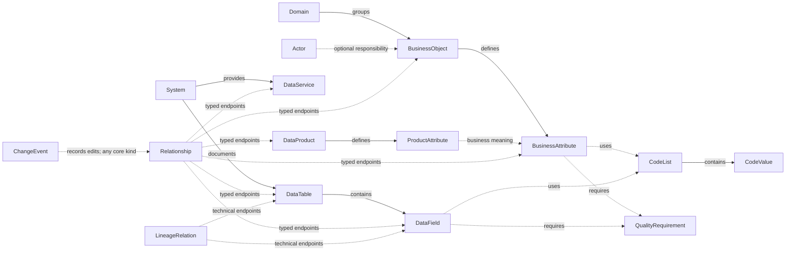

# Catalog data model

**Stable target specification.** This document defines the catalog's meaning, entities, attributes and rules. PostgreSQL design, application behavior and migration are maintained in the [implementation guide](data-model-implementation.md).

## Vision and purpose

Build a shared DE/IT/FR/EN catalog that connects business meaning with documented data structures and services. Business definitions lead; documented relationships make implementation coverage and API gaps understandable.

The model describes metadata, not individual buildings, parcels or observations. Building, Parcel, EconomicUnit and Measurement are BusinessObject records with BusinessAttribute definitions; their proposed content is maintained in the [business-object attribute proposal](business-object-attribute-proposal.md).

The scope includes reusable quality requirements, documented lineage, controlled vocabularies, responsibility and edit history. Quality execution/results, workflow, separate organisation registries, multi-tenancy and diagram editing are outside the core model. Implementation status does not determine whether an entity belongs to the target.

## Reading guide

| Question | Section |
|---|---|
| What does the catalog describe? | [Conceptual model](#conceptual-model) and [entity overview](#entity-overview) |
| What are the exact attributes and relationships? | [Conventions](#conventions), [entity definitions](#entity-definitions) and [owned value types](#reusable-value-types) |
| How does it align with standards? | [Standards alignment](#standards-alignment) |
| How is it stored, displayed or migrated? | [Implementation guide](data-model-implementation.md) |

Each entity dictionary is complete. Keep conceptual changes here and implementation-specific decisions in the companion guide; neither document should redefine the other's rules.

## Conceptual model

BusinessObject and BusinessAttribute define meaning and requirements. System, DataTable and DataField describe technical structures. CodeList and CodeValue supply controlled values. DataProduct and ProductAttribute describe an offering and its contract; DataService describes access. Domain groups definitions, Actor provides optional managed responsibility identities, and ChangeEvent preserves history.

Relationship records explicitly documented associations, correspondences and service-support assessments. LineageRelation separately describes technical dependencies. QualityRequirement supplies reusable expectations for business attributes and fields. Organisation details and documentation links are owned values, not additional entities.

### Relationship overview

This overview shows the main conceptual connections. The dictionaries define complete cardinalities and permitted relationship endpoints. The implementation guide contains the single detailed [physical ER review diagram](data-model-implementation.md#physical-er-review-diagram).

### Entity overview

The 16 core entities are listed alphabetically. Standards indicate intended alignment, not conformance. Owned value types are defined separately and are not additional entities.

| Entity | Purpose | Standards / alignment |
|---|---|---|
| [Actor](#actor) | Reuses managed internal contact/responsibility identities. | DCMI: `dcterms:Agent` |
| [BusinessAttribute](#businessattribute) | Defines a business characteristic and its expected values. | Local |
| [BusinessObject](#businessobject) | Defines a solution-neutral business concept, such as Building. | Local; optional SKOS glossary: `skos:Concept` |
| [ChangeEvent](#changeevent) | Records catalog edit history. | Local |
| [CodeList](#codelist) | Defines a controlled vocabulary and its authority. | SKOS: `skos:ConceptScheme` |
| [CodeValue](#codevalue) | Defines one stable code and its multilingual meaning. | SKOS: `skos:Concept`, `skos:notation` |
| [DataField](#datafield) | Describes one field in a technical structure. | Local |
| [DataProduct](#dataproduct) | Describes a governed data offering and its product contract. | Local |
| [DataService](#dataservice) | Describes an API or other interface providing data access. | DCAT 3: `dcat:DataService` |
| [DataTable](#datatable) | Describes a technical structure and its documented field inventory. | Local; ArchiMate Data Object correspondence where applicable |
| [Domain](#domain) | Groups definitions by business subject area. | SKOS: `skos:Concept` in a theme scheme |
| [LineageRelation](#lineagerelation) | Records directed table/field data movement and transformation dependencies. | Local; future OpenLineage import alignment |
| [ProductAttribute](#productattribute) | Describes a characteristic promised by a data product. | Local |
| [QualityRequirement](#qualityrequirement) | Defines reusable checks such as Not null, Unique and Greater than zero. | Local; DQV-inspired quality dimensions |
| [Relationship](#relationship) | Records typed business/product associations, implementation correspondences and endpoint support for business requirements. | Local; type-specific standards alignment |
| [System](#system) | Describes an application, register or distributed source inventory. | Local; ArchiMate Application Component correspondence where applicable |

## Conventions

### Naming and completeness

Documentation, entity names, attribute bases and controlled application tokens are English. Entities use PascalCase; attributes use lowerCamelCase with _de, _it, _fr and _en suffixes for translated content. Preserve exact source identifiers, technical names and official codes, including their original language and case.

| Convention | Meaning |
|---|---|
| `1` | Exactly one value is required. |
| `0..1` | Optional value; absence is unknown or undocumented unless stated otherwise. |
| `0..*` / `1..*` | Zero or more / one or more values. Reference collections contain no duplicates. |
| Unknown values | Do not substitute false, zero, blank text or invented dates for missing information. |
| Empty collections | No members or assertions are recorded; this does not prove that none exist in the source. DataField.keyRoles distinguishes unknown from a documented empty set. |
| Catalog validation | Validate metadata separately from the business-data or source constraints it describes. Unknown source constraints are valid catalog metadata. |
| Stored and derived information | Each assertion has one authoritative location. Inverse relationships, inherited context and counts are derived. |

### Reading attribute tables

Each dictionary is complete. Alias (EN) is the English human-readable label, not an additional attribute. Key describes identity and reference roles in the target model; it never describes keys in the source data being cataloged.

| Key | Meaning |
|---|---|
| PK | Immutable internal identity. |
| UQ / UQ (composite) | Unique public identifier or member of a stated scoped uniqueness rule. |
| FK | Reference to an existing record of the stated entity type. |
| FK (typed) | Reference whose entity kind and identifier are both specified. |
| FK (collection) | Multiple references to records of the stated type. |
| FK (composite) | Reference constrained by its owner, such as a parent code in the same list. |
| — | No identity or reference role. |

The implementation guide defines [physical storage](data-model-implementation.md#postgresql-persistence), [prototype coverage](data-model-implementation.md#prototype-coverage) and [current presentation](data-model-implementation.md#current-presentation-mapping). Those concerns do not change the conceptual attributes.

### Primitive formats

| Format | Meaning |
|---|---|
| UUID | Immutable internal identity, independent of labels or source identifiers. |
| Identifier | Non-empty, case-sensitive catalog identifier without leading/trailing whitespace; never reused for another record. |
| Text | Non-empty plain Unicode text when present; preserve meaningful punctuation and line breaks. |
| Boolean | True or false; absence remains unknown. |
| Integer | Whole number, subject to the attribute's bounds. |
| Decimal | Exact finite decimal value. |
| Date | Calendar date without an artificial time of day. |
| Timestamp | Exact instant with a defined timezone/UTC offset; a date alone does not establish one. |
| LanguageCode | One of de, it, fr or en. |
| LanguageTag | BCP 47 language tag for source/destination content, which can differ from the supported translations. |
| HttpUrl | Absolute HTTP or HTTPS URL without embedded credentials. |
| Enum | One documented application token; display labels may be translated. |
| Object | Owned structured value with a documented shape. |
| <Format>[] | Collection of values of that format; element constraints apply to every member. |
| RecordReference | Existing record identified by both entity kind and catalog identifier. |

Serialization and database limits are defined in the [implementation guide](data-model-implementation.md#primitive-formats).

### Internationalisation

Support German (DE), Italian (IT), French (FR) and English (EN). Every declared localized family has four sibling attributes, each optional individually. Every named entity needs at least one populated name; valid Domains, BusinessObjects, BusinessAttributes and QualityRequirements also need at least one populated description.

| Content | German | Italian | French | English |
|---|---|---|---|---|
| Name | name_de | name_it | name_fr | name_en |
| Description | description_de | description_it | description_fr | description_en |
| Link title | title_de | title_it | title_fr | title_en |
| Change summary | summary_de | summary_it | summary_fr | summary_en |

Names, descriptions and declared localized notes are ordinary editable content. Missing translations remain unknown; never invent them or copy display fallback into the record. Personal names remain proper names; organisation names may have documented translations. Translation edits do not change identity.

comment, accessNotes and licenseNotes each retain one authored value without language variants. Identifiers, technical names, codes, URLs, units and machine-readable constraints are language-independent. A suffix identifies the content language, not the language in which someone edited the record. LocalizedTextFields defines the reusable family convention.

[Display fallback and language handling](data-model-implementation.md#display-fallback-and-language-handling) belong to the application contract.

### Shared attribute conventions

Every entity chapter contains its complete target attribute table. Names, descriptions, comments, identity, status and responsibility fields are repeated where applicable so the chapter can be read on its own. Matching fields follow the same rules below; repetition does not introduce inheritance, extra entities. Internal identities are marked in each dictionary; read-only projections are described separately.

#### Identity

`identifier` is stable and unique within the concrete kind; source technical names and translated labels do not determine identity. `rowVersion` is an optimistic edit revision on mutable records. Catalog dates describe the record itself; inherited parent dates are context, not new child assertions. `kind` is derived from the concrete entity and is not an independent attribute. [RecordReference](#recordreference) lists the allowed target kinds; ChangeEvent is not itself a target.

#### Version and dates

For entities with version, versionDate records when that catalog definition version was issued. New assignments and version changes require a date. Correcting the date or version is an audited edit; history retains the previous pair. A normal metadata edit changes modifiedOn/rowVersion without silently issuing a new version.

When version is absent, versionDate must also be absent; clear both in the same edit. A known date may be corrected but cannot be cleared while its version remains. Preserve a legacy version with an unknown date until the next version is issued; do not substitute creation, modification or import dates. API serviceVersion describes the source interface release. External vocabulary editions remain in standard citations/documentation links, separate from the catalog version.

#### Localized content

Named entities list all four name/description columns. Their family-level completeness and fallback rules are defined under [Internationalisation](#internationalisation). The single optional comment is internal; accessNotes and licenseNotes retain authored access and usage terms. These fields have no translated copies or display fallback.

Relationship has one optional comment and localized rule notes; LineageRelation has transformation notes. Both derive their display labels from endpoints and translated type/operation labels. DocumentationLink has localized titles; ChangeEvent has summaries and attribution. These supporting records have their own prose fields instead of generic names and descriptions. English aliases are human-readable attribute labels; translated names are the preferred content labels. Language fallback follows [Internationalisation](#internationalisation).

#### Status

The ten entities with status use draft, valid and retired. Status is maintained manually and describes catalog readiness, not a formal approval. BusinessAttribute and DataField have independent status; CodeValue and ProductAttribute derive it from their owner. Relationship and LineageRelation use verificationStatus. Actor has no editorial lifecycle; ChangeEvent records edits without separate reviewer/date fields or an approval workflow.

#### Responsibility

Use `responsibleOrganisation` for organisation details stored directly on an entry. Use optional `dataOwnerId`, `dataStewardId` and `contactActorId` where the entity declares them and an internal Actor record is maintained. QualityRequirement keeps only responsibleOrganisation and contactActorId, without owner/steward roles or parent inheritance. Technical entries also support `dataCustodianId` as scoped below. External metadata may contain only the organisation; an empty personal role is valid. Recording an organisation does not automatically assign it every role.

Data custodian is a technical responsibility, available on System, DataTable, DataField and DataService only. Domain, BusinessObject, BusinessAttribute, CodeList, CodeValue, DataProduct, ProductAttribute and QualityRequirement have no custodian field or inherited custodian. Reference-data authority and stewardship do not imply technical custody. Omit inapplicable roles; keep applicable unknown roles visible.

Store roles directly on the governed record. Resolve each applicable role independently: a BusinessAttribute falls back to its BusinessObject, a DataField to its DataTable, and a table's custodian to its System. CodeValue uses its CodeList authority; ProductAttribute uses its parent roles without overrides. No other inheritance, including Domain membership, is implied. Show where inherited roles come from. Clearing an override returns to the inherited value; it does not suppress a known parent role.

The initial model permits one responsible organisation value and one managed actor per optional role. Conflicting or multiple explicitly named parties require clarification; never silently discard them. Role changes use ChangeEvent. Catalog ownership is distinct from property ownership, facility management and publication responsibility.

Apply organisation fallback as a whole: a directly supplied organisation replaces the parent value, without mixing one organisation's name with another's website. Contact links use an explicit contactActorId when supplied, otherwise the responsibleOrganisation's website/contact page. Dedicated email and phone attributes are excluded from catalog entries. Keep their origin clear; do not infer a contact from a data-owner name. CodeList uses authorityOrganisation alone, without owner/steward/contact overrides; CodeValue inherits that authority as context. Other entities use their declared responsibility fields.

For GWR, the entry can hold Bundesamt für Statistik directly, plus its documented website/contact page, and leave all Actor links empty. An internal editor's edit attribution is independent of the external provider; no employee of that provider needs an Actor record.

#### Sensitivity

A child BusinessAttribute or DataField may supply explicit sensitivity; otherwise it inherits from its owner, with origin shown. Other entities with these attributes use their own assertions. Domain has neither attribute and supplies no sensitivity fallback to its members. An empty inherited and direct value stays unknown. This classification describes cataloged information and is not the access-control policy for catalog contacts or review history.

## Entity definitions

Alphabetical reference. Each dictionary lists all stored attributes, including applicable shared metadata. Key and visibility notation follows [Conventions](#conventions).

### Actor

Derived `kind = actor`. The table lists its complete attributes and identity. An internally managed person or organisation, independent of the roles it fulfils. External organisations need no Actor record; their details belong directly to the catalog entry.

| Attribute | Alias (EN) | Key | Format | Cardinality | Constraints and description |
|---|---|---|---|---|---|
| `id` | Internal ID | PK | UUID | 1 | Immutable internal identity, separate from the public catalog identifier and source identifiers. |
| `identifier` | ID | UQ | Identifier | 1 | Stable and unique within its kind. Child identifiers distinguish records across owners. |
| `rowVersion` | Edit revision | — | Integer | 1 | Automatically maintained edit revision; initially 1 and incremented once per committed change. Separate from catalog definition version. |
| `createdOn` | Created | — | Date | 0..1 | Date the catalog record was created; unknown historical dates remain unknown. |
| `modifiedOn` | Last modified | — | Date | 0..1 | Date the catalog record last changed; not before createdOn. History and edit revision establish order. |
| `name_de` | Name (DE) | — | Text | 0..1 | German name; at least one language is required. Not an identifier. |
| `name_it` | Name (IT) | — | Text | 0..1 | Italian name; at least one language is required. Not an identifier. |
| `name_fr` | Name (FR) | — | Text | 0..1 | French name; at least one language is required. Not an identifier. |
| `name_en` | Name (EN) | — | Text | 0..1 | English name; at least one language is required. Not an identifier. |
| `description_de` | Description (DE) | — | Text | 0..1 | German. Definition; preserve documented wording. |
| `description_it` | Description (IT) | — | Text | 0..1 | Italian. Definition; preserve documented wording. |
| `description_fr` | Description (FR) | — | Text | 0..1 | French. Definition; preserve documented wording. |
| `description_en` | Description (EN) | — | Text | 0..1 | English. Definition; preserve documented wording. |
| `comment` | Comment | — | Text | 0..1 | Internal note in its authored language; no translation variants, fallback or parent inheritance. |
| `actorType` | Actor type | — | Enum | 1 | `person`, `organisation`. |
| `websiteUrl` | Website | — | HttpUrl | 0..1 | Official website or directory entry. Do not fabricate URLs from names. |

Organisation names may have official language variants. Personal names are proper names and must not be automatically translated. Matching labels alone are insufficient to merge actors.

Contact actors are independent of login accounts. Changing an Actor updates references without duplicating its contact fields on every record. Retain historical attribution in ChangeEvent where recorded.

### BusinessAttribute

Derived `kind = businessAttribute`. The table lists its complete attributes and identity. Describes expected business values; it does not hold those values.

| Attribute | Alias (EN) | Key | Format | Cardinality | Constraints and description |
|---|---|---|---|---|---|
| `id` | Internal ID | PK | UUID | 1 | Immutable internal identity, separate from the public catalog identifier and source identifiers. |
| `identifier` | ID | UQ | Identifier | 1 | Stable and unique within its kind. Child identifiers distinguish records across owners. |
| `rowVersion` | Edit revision | — | Integer | 1 | Automatically maintained edit revision; initially 1 and incremented once per committed change. Separate from catalog definition version. |
| `createdOn` | Created | — | Date | 0..1 | Date the catalog record was created; unknown historical dates remain unknown. Do not copy a parent date as a child assertion. |
| `modifiedOn` | Last modified | — | Date | 0..1 | Date the catalog record last changed; not before createdOn. History and edit revision establish order. Do not copy a parent date as a child assertion. |
| `name_de` | Name (DE) | — | Text | 0..1 | German name; at least one language is required. Not an identifier. |
| `name_it` | Name (IT) | — | Text | 0..1 | Italian name; at least one language is required. Not an identifier. |
| `name_fr` | Name (FR) | — | Text | 0..1 | French name; at least one language is required. Not an identifier. |
| `name_en` | Name (EN) | — | Text | 0..1 | English name; at least one language is required. Not an identifier. |
| `description_de` | Description (DE) | — | Text | 0..1 | German. Definition; preserve documented wording. At least one language value in this property family is required before status becomes valid. |
| `description_it` | Description (IT) | — | Text | 0..1 | Italian. Definition; preserve documented wording. At least one language value in this property family is required before status becomes valid. |
| `description_fr` | Description (FR) | — | Text | 0..1 | French. Definition; preserve documented wording. At least one language value in this property family is required before status becomes valid. |
| `description_en` | Description (EN) | — | Text | 0..1 | English. Definition; preserve documented wording. At least one language value in this property family is required before status becomes valid. |
| `comment` | Comment | — | Text | 0..1 | Internal note in its authored language; no translation variants, fallback or parent inheritance. |
| `documentationLinks` | More information | — | DocumentationLink[] | 0..* | Curated supporting links; deduplicate identical URL/purpose pairs. |
| `status` | Status | — | Enum | 1 | `draft`, `valid`, `retired`; new records default to draft. Status changes are manual and audited; source publication alone does not establish the correctness of local interpretations. |
| `version` | Version | — | Text | 0..1 | Catalog definition version, if managed; paired with versionDate. Separate from source editions, serviceVersion and the technical rowVersion. |
| `versionDate` | Version date | — | Date | 0..1 | Date this catalog definition version was issued. Required for a newly assigned/changed version; absent without version. Preserve unknown legacy dates. Not an import, last-edit or service-release date. |
| `responsibleOrganisation` | Responsible organisation | — | OrganisationDetails | 0..1 | Inline organisation; no Actor required. Apply the documented parent fallback only when this whole value is absent. |
| `dataOwnerId` | Data owner | FK | Identifier → Actor | 0..1 | Accountable person/organisation. One optional Actor; apply only the documented parent fallback. |
| `dataStewardId` | Data steward | FK | Identifier → Actor | 0..1 | Person/organisation maintaining meaning and metadata. One optional Actor; apply only the documented parent fallback. |
| `contactActorId` | Contact | FK | Identifier → Actor | 0..1 | Optional managed contact with name and website/contact page. External links may stay in responsibleOrganisation. Apply only the documented parent fallback. |
| `classification` | Classification | — | Enum | 0..1 | `public`, `internal`, `confidential`, `secret`. Classification of the described information, separate from technical access. |
| `containsPersonalData` | Personal data | — | Boolean | 0..1 | Whether the described data contains personal data. Listing a catalog contact does not establish this for the underlying dataset. |
| `businessObjectId` | Business object | FK | Identifier → BusinessObject | 1 | Owning business definition. |
| `semanticName` | Semantic name | UQ (composite) | Identifier | 1 | Stable English name, unique within the owner, for example `constructionYear`. Independent of localized labels. |
| `valueSpecification` | Value specification | — | ValueSpecification | 0..1 | Descriptive value type/format/unit only; required before status becomes valid. Validation rules come from qualityRequirementIds, not inline bounds or conditions. |
| `qualityRequirementIds` | Data quality requirements | FK (collection) | Identifier[] → QualityRequirement | 0..* | Reusable quality rules assigned to this attribute/field; no duplicates or per-assignment overrides. Resolve each referenced rule's definition and status; no automatic parent-status cascade. Business requirements stay solution-neutral; field rules describe additional source expectations. |
| `isIdentifier` | Business identifier | — | Boolean | 0..1 | Participation in business identification. Does not establish a physical key or global uniqueness. |
| `codeListId` | Code list | FK | Identifier → CodeList | 0..1 | Reviewed vocabulary; similar source wording is insufficient evidence. |

BusinessAttribute derives normative references from its BusinessObject; these are parent context, not separate attribute assertions.

Validation requirements are resolved through qualityRequirementIds. An empty assignment list means no requirements are recorded; it does not establish optionality. isIdentifier describes the attribute's identification role, not a uniqueness check. Conditional requirements and cardinality limits belong to reusable QualityRequirement definitions.

Derived context: domain and normative references from BusinessObject; effective roles and sensitivity use the documented fallback. Status is independent; parent dates and history remain labelled parent context.

### BusinessObject

Derived `kind = businessObject`. The table lists its complete attributes and identity. Defines a business **type** independently of physical schemas and interface capabilities.

| Attribute | Alias (EN) | Key | Format | Cardinality | Constraints and description |
|---|---|---|---|---|---|
| `id` | Internal ID | PK | UUID | 1 | Immutable internal identity, separate from the public catalog identifier and source identifiers. |
| `identifier` | ID | UQ | Identifier | 1 | Stable and unique within its kind. Child identifiers distinguish records across owners. |
| `rowVersion` | Edit revision | — | Integer | 1 | Automatically maintained edit revision; initially 1 and incremented once per committed change. Separate from catalog definition version. |
| `createdOn` | Created | — | Date | 0..1 | Date the catalog record was created; unknown historical dates remain unknown. |
| `modifiedOn` | Last modified | — | Date | 0..1 | Date the catalog record last changed; not before createdOn. History and edit revision establish order. |
| `name_de` | Name (DE) | — | Text | 0..1 | German name; at least one language is required. Not an identifier. |
| `name_it` | Name (IT) | — | Text | 0..1 | Italian name; at least one language is required. Not an identifier. |
| `name_fr` | Name (FR) | — | Text | 0..1 | French name; at least one language is required. Not an identifier. |
| `name_en` | Name (EN) | — | Text | 0..1 | English name; at least one language is required. Not an identifier. |
| `description_de` | Description (DE) | — | Text | 0..1 | German. Definition; preserve documented wording. At least one language value in this property family is required before status becomes valid. |
| `description_it` | Description (IT) | — | Text | 0..1 | Italian. Definition; preserve documented wording. At least one language value in this property family is required before status becomes valid. |
| `description_fr` | Description (FR) | — | Text | 0..1 | French. Definition; preserve documented wording. At least one language value in this property family is required before status becomes valid. |
| `description_en` | Description (EN) | — | Text | 0..1 | English. Definition; preserve documented wording. At least one language value in this property family is required before status becomes valid. |
| `comment` | Comment | — | Text | 0..1 | Internal note in its authored language; no translation variants, fallback or parent inheritance. |
| `documentationLinks` | More information | — | DocumentationLink[] | 0..* | Curated supporting links; deduplicate identical URL/purpose pairs. |
| `status` | Status | — | Enum | 1 | `draft`, `valid`, `retired`; new records default to draft. Status changes are manual and audited; source publication alone does not establish the correctness of local interpretations. |
| `version` | Version | — | Text | 0..1 | Catalog definition version, if managed; paired with versionDate. Separate from source editions, serviceVersion and the technical rowVersion. |
| `versionDate` | Version date | — | Date | 0..1 | Date this catalog definition version was issued. Required for a newly assigned/changed version; absent without version. Preserve unknown legacy dates. Not an import, last-edit or service-release date. |
| `responsibleOrganisation` | Responsible organisation | — | OrganisationDetails | 0..1 | Inline organisation; no Actor required. Apply the documented parent fallback only when this whole value is absent. |
| `dataOwnerId` | Data owner | FK | Identifier → Actor | 0..1 | Accountable person/organisation. One optional Actor; apply only the documented parent fallback. |
| `dataStewardId` | Data steward | FK | Identifier → Actor | 0..1 | Person/organisation maintaining meaning and metadata. One optional Actor; apply only the documented parent fallback. |
| `contactActorId` | Contact | FK | Identifier → Actor | 0..1 | Optional managed contact with name and website/contact page. External links may stay in responsibleOrganisation. Apply only the documented parent fallback. |
| `classification` | Classification | — | Enum | 0..1 | `public`, `internal`, `confidential`, `secret`. Classification of the described information, separate from technical access. |
| `containsPersonalData` | Personal data | — | Boolean | 0..1 | Whether the described data contains personal data. Listing a catalog contact does not establish this for the underlying dataset. |
| `domainId` | Domain | FK | Identifier → Domain | 1 | Primary business domain. A copied domain label is not the relationship. |
| `normativeReferences` | Standard reference | — | Text[] | 0..* | Documented standards/rules, including edition when known. URLs belong in DocumentationLink. |

Derived: BusinessAttributes by owner and technical realisations through Relationship. Terminology links use `purpose = terminology`. API limitations must not define the business concept.

### ChangeEvent

Derived `kind = changeEvent`. The table lists its complete attributes and identity. Append-only metadata history, separate from business transactions or operational measurement history.

| Attribute | Alias (EN) | Key | Format | Cardinality | Constraints and description |
|---|---|---|---|---|---|
| `id` | Internal ID | PK | UUID | 1 | Immutable internal identity, separate from the public catalog identifier and source identifiers. |
| `identifier` | ID | UQ | Identifier | 1 | Unique event identifier; never an array position. |
| `record` | Catalog entity | FK (typed) | RecordReference | 1 | Changed catalog record. |
| `occurredOn` | Date | — | Date | 1 | Known event date. For events with occurredAt, use its UTC calendar date; preserve standalone legacy dates without inventing a timestamp. |
| `occurredAt` | Event timestamp | — | Timestamp | 0..1 | Exact event time when known; normalize to UTC. Its UTC calendar date must equal occurredOn. Keep legacy date-only events without this attribute. |
| `action` | Change | — | Enum | 1 | `created`, `updated`, `imported`, `retired`, `restored`. Preserve unmapped original action wording in summaries. |
| `actorId` | Actor | FK | Identifier → Actor | 0..1 | Identified editor when available; this is edit attribution, not approval. |
| `actorName_de` | Edited by (DE) | — | Text | 0..1 | German. Recorded name at the time of the edit, also when actorId resolves. Preserve known wording without translation or inferred identity; later Actor edits must not rewrite attribution. |
| `actorName_it` | Edited by (IT) | — | Text | 0..1 | Italian. Recorded name at the time of the edit, also when actorId resolves. Preserve known wording without translation or inferred identity; later Actor edits must not rewrite attribution. |
| `actorName_fr` | Edited by (FR) | — | Text | 0..1 | French. Recorded name at the time of the edit, also when actorId resolves. Preserve known wording without translation or inferred identity; later Actor edits must not rewrite attribution. |
| `actorName_en` | Edited by (EN) | — | Text | 0..1 | English. Recorded name at the time of the edit, also when actorId resolves. Preserve known wording without translation or inferred identity; later Actor edits must not rewrite attribution. |
| `summary_de` | Details (DE) | — | Text | 0..1 | German. Change summary. At least one of the four summaries is required. |
| `summary_it` | Details (IT) | — | Text | 0..1 | Italian. Change summary. At least one of the four summaries is required. |
| `summary_fr` | Details (FR) | — | Text | 0..1 | French. Change summary. At least one of the four summaries is required. |
| `summary_en` | Details (EN) | — | Text | 0..1 | English. Change summary. At least one of the four summaries is required. |
| `changedProperties` | Changed properties | — | Text[] | 0..* | Canonical property paths, including the exact language suffix for translated text, where known. |
| `before` | Before change | — | Object | 0..1 | Snapshot before the edit; required for new edits to existing records, absent for creation. Legacy events may lack it. Includes direct attributes, typed references, owned values, reference collections, owned endpoints and rowVersion; no linked-record expansion or derived counts. |
| `after` | After change | — | Object | 0..1 | Snapshot after the edit, required for all new events; retirement retains the record and snapshot. Legacy history may omit it; never reconstruct unknown past values. |
| `importId` | Import or operation ID | — | Identifier | 0..1 | Shared operation identifier grouping related events from an import, batch or multi-record command. Required for new commands emitting multiple events, including relationship/product edits. One generated value is reused across retries; no separate operation entity is required. |

Parent history may appear as related context on child profiles, clearly labelled as parent history. Do not duplicate it as child events. Retain stable archival references when retiring records referenced by history.

ChangeEvent preserves the recorded editor name independently of later Actor edits. Events and prior snapshots are immutable; restoring a record creates a new event.

### CodeList

Derived `kind = codeList`. The table lists its complete attributes and identity. A vocabulary independent of labels and applications using it.

| Attribute | Alias (EN) | Key | Format | Cardinality | Constraints and description |
|---|---|---|---|---|---|
| `id` | Internal ID | PK | UUID | 1 | Immutable internal identity, separate from the public catalog identifier and source identifiers. |
| `identifier` | ID | UQ | Identifier | 1 | Stable and unique within its kind. Child identifiers distinguish records across owners. |
| `rowVersion` | Edit revision | — | Integer | 1 | Automatically maintained edit revision; initially 1 and incremented once per committed change. Separate from catalog definition version. |
| `createdOn` | Created | — | Date | 0..1 | Date the catalog record was created; unknown historical dates remain unknown. |
| `modifiedOn` | Last modified | — | Date | 0..1 | Date the catalog record last changed; not before createdOn. History and edit revision establish order. |
| `name_de` | Name (DE) | — | Text | 0..1 | German name; at least one language is required. Not an identifier. |
| `name_it` | Name (IT) | — | Text | 0..1 | Italian name; at least one language is required. Not an identifier. |
| `name_fr` | Name (FR) | — | Text | 0..1 | French name; at least one language is required. Not an identifier. |
| `name_en` | Name (EN) | — | Text | 0..1 | English name; at least one language is required. Not an identifier. |
| `description_de` | Description (DE) | — | Text | 0..1 | German. Definition; preserve documented wording. |
| `description_it` | Description (IT) | — | Text | 0..1 | Italian. Definition; preserve documented wording. |
| `description_fr` | Description (FR) | — | Text | 0..1 | French. Definition; preserve documented wording. |
| `description_en` | Description (EN) | — | Text | 0..1 | English. Definition; preserve documented wording. |
| `comment` | Comment | — | Text | 0..1 | Internal note in its authored language; no translation variants, fallback or parent inheritance. |
| `documentationLinks` | More information | — | DocumentationLink[] | 0..* | Curated supporting links; deduplicate identical URL/purpose pairs. |
| `status` | Status | — | Enum | 1 | `draft`, `valid`, `retired`; new records default to draft. Status changes are manual and audited; source publication alone does not establish the correctness of local interpretations. |
| `version` | Version | — | Text | 0..1 | Catalog definition version, if managed; paired with versionDate. Separate from source editions, serviceVersion and the technical rowVersion. |
| `versionDate` | Version date | — | Date | 0..1 | Date this catalog definition version was issued. Required for a newly assigned/changed version; absent without version. Preserve unknown legacy dates. Not an import, last-edit or service-release date. |
| `domainId` | Domain | FK | Identifier → Domain | 0..1 | Explicit primary domain; if absent, derive it from businessObjectId when that object is active. Explicit domain takes precedence. |
| `businessObjectId` | Business object | FK | Identifier → BusinessObject | 0..1 | Primary classified concept. Actual attribute/field usage comes from their direct references. |
| `authorityOrganisation` | Source authority | — | OrganisationDetails | 0..1 | Organisation defining the vocabulary, recorded directly. The sole organisation value on a CodeList. Keep unresolved authority wording in comment/import notes; do not infer an organisation from a standard citation. |
| `normativeReferences` | Standard reference | — | Text[] | 0..* | Documented standards/rules, including edition when known. Preserve partial or composite citations intact; do not invent a standard identifier. URLs belong in DocumentationLink. |

Derived: CodeValues and the attributes/fields using the list. Use version/versionDate for catalog releases and documentationLinks/normativeReferences for the applicable external specification. Record known incompleteness or usage restrictions in comment; an empty list does not prove completeness.

A compatible update or added translation keeps the same identity. If a code changes meaning and existing users must retain the old vocabulary, create a separately identified CodeList with its own CodeValues; do not silently retarget existing references. ChangeEvent preserves edits without an edition-chain entity or link.

### CodeValue

Derived `kind = codeValue`. The table lists its complete attributes and identity. Several translated labels describe the same vocabulary member.

| Attribute | Alias (EN) | Key | Format | Cardinality | Constraints and description |
|---|---|---|---|---|---|
| `id` | Internal ID | PK | UUID | 1 | Immutable internal identity, separate from the public catalog identifier and source identifiers. |
| `identifier` | ID | UQ | Identifier | 1 | Stable and unique within its kind. Child identifiers distinguish records across owners. |
| `rowVersion` | Edit revision | — | Integer | 1 | Automatically maintained edit revision; initially 1 and incremented once per committed change. Separate from catalog definition version. |
| `createdOn` | Created | — | Date | 0..1 | Date the catalog record was created; unknown historical dates remain unknown. |
| `modifiedOn` | Last modified | — | Date | 0..1 | Date the catalog record last changed; not before createdOn. History and edit revision establish order. |
| `name_de` | Name (DE) | — | Text | 0..1 | German name; at least one language is required. Not an identifier. |
| `name_it` | Name (IT) | — | Text | 0..1 | Italian name; at least one language is required. Not an identifier. |
| `name_fr` | Name (FR) | — | Text | 0..1 | French name; at least one language is required. Not an identifier. |
| `name_en` | Name (EN) | — | Text | 0..1 | English name; at least one language is required. Not an identifier. |
| `description_de` | Description (DE) | — | Text | 0..1 | German. Definition; preserve documented wording. |
| `description_it` | Description (IT) | — | Text | 0..1 | Italian. Definition; preserve documented wording. |
| `description_fr` | Description (FR) | — | Text | 0..1 | French. Definition; preserve documented wording. |
| `description_en` | Description (EN) | — | Text | 0..1 | English. Definition; preserve documented wording. |
| `comment` | Comment | — | Text | 0..1 | Internal note in its authored language; no translation variants, fallback or parent inheritance. |
| `documentationLinks` | More information | — | DocumentationLink[] | 0..* | Curated supporting links; deduplicate identical URL/purpose pairs. |
| `codeListId` | Code list | FK | Identifier → CodeList | 1 | Owning vocabulary. |
| `code` | Code | UQ (composite) | Text | 1 | Unique within the list. Preserve leading zeros, punctuation, case and symbolic paths. Source order is not a wire code. |
| `shortName_de` | Short name (DE) | — | Text | 0..1 | German. Official abbreviations where available. |
| `shortName_it` | Short name (IT) | — | Text | 0..1 | Italian. Official abbreviations where available. |
| `shortName_fr` | Short name (FR) | — | Text | 0..1 | French. Official abbreviations where available. |
| `shortName_en` | Short name (EN) | — | Text | 0..1 | English. Official abbreviations where available. |
| `parentCodeValueId` | Parent code value | FK (composite) | Identifier → CodeValue | 0..1 | Broader member in the same vocabulary; enforce the composite FK with codeListId. No self-reference or cycles. Do not invent selectable parent codes from source headings. |

If a code changes meaning while existing references must retain its old definition, use a separately identified CodeList. Do not silently relabel historical references. Status is inherited from CodeList; version and edit history record changes without validity periods.

Derived context: status, authority and domain from CodeList. CodeList/CodeValue have no sensitivity classification or personal-data flag, including inherited values.

### DataField

Derived `kind = dataField`. The table lists its complete attributes and identity. Has a stable catalog identifier independent of its source name or array position.

| Attribute | Alias (EN) | Key | Format | Cardinality | Constraints and description |
|---|---|---|---|---|---|
| `id` | Internal ID | PK | UUID | 1 | Immutable internal identity, separate from the public catalog identifier and source identifiers. |
| `identifier` | ID | UQ | Identifier | 1 | Stable and unique within its kind. Child identifiers distinguish records across owners. |
| `rowVersion` | Edit revision | — | Integer | 1 | Automatically maintained edit revision; initially 1 and incremented once per committed change. Separate from catalog definition version. |
| `createdOn` | Created | — | Date | 0..1 | Date the catalog record was created; unknown historical dates remain unknown. Do not copy a parent date as a child assertion. |
| `modifiedOn` | Last modified | — | Date | 0..1 | Date the catalog record last changed; not before createdOn. History and edit revision establish order. Do not copy a parent date as a child assertion. |
| `name_de` | Name (DE) | — | Text | 0..1 | German name; at least one language is required. Not an identifier. |
| `name_it` | Name (IT) | — | Text | 0..1 | Italian name; at least one language is required. Not an identifier. |
| `name_fr` | Name (FR) | — | Text | 0..1 | French name; at least one language is required. Not an identifier. |
| `name_en` | Name (EN) | — | Text | 0..1 | English name; at least one language is required. Not an identifier. |
| `description_de` | Description (DE) | — | Text | 0..1 | German. Definition; preserve documented wording. |
| `description_it` | Description (IT) | — | Text | 0..1 | Italian. Definition; preserve documented wording. |
| `description_fr` | Description (FR) | — | Text | 0..1 | French. Definition; preserve documented wording. |
| `description_en` | Description (EN) | — | Text | 0..1 | English. Definition; preserve documented wording. |
| `comment` | Comment | — | Text | 0..1 | Internal note in its authored language; no translation variants, fallback or parent inheritance. |
| `documentationLinks` | More information | — | DocumentationLink[] | 0..* | Curated supporting links; deduplicate identical URL/purpose pairs. |
| `status` | Status | — | Enum | 1 | `draft`, `valid`, `retired`; new records default to draft. Status changes are manual and audited; source publication alone does not establish the correctness of local interpretations. |
| `version` | Version | — | Text | 0..1 | Catalog definition version, if managed; paired with versionDate. Separate from source editions, serviceVersion and the technical rowVersion. |
| `versionDate` | Version date | — | Date | 0..1 | Date this catalog definition version was issued. Required for a newly assigned/changed version; absent without version. Preserve unknown legacy dates. Not an import, last-edit or service-release date. |
| `responsibleOrganisation` | Responsible organisation | — | OrganisationDetails | 0..1 | Inline organisation; no Actor required. Apply the documented parent fallback only when this whole value is absent. |
| `dataOwnerId` | Data owner | FK | Identifier → Actor | 0..1 | Accountable person/organisation. One optional Actor; apply only the documented parent fallback. |
| `dataStewardId` | Data steward | FK | Identifier → Actor | 0..1 | Person/organisation maintaining meaning and metadata. One optional Actor; apply only the documented parent fallback. |
| `dataCustodianId` | Data custodian | FK | Identifier → Actor | 0..1 | Maintains the technical source; may be a person or organisation. One explicit actor per role; missing means undocumented or inherited as specified below. |
| `contactActorId` | Contact | FK | Identifier → Actor | 0..1 | Optional managed contact with name and website/contact page. External links may stay in responsibleOrganisation. Apply only the documented parent fallback. |
| `classification` | Classification | — | Enum | 0..1 | `public`, `internal`, `confidential`, `secret`. Classification of the described information, separate from technical access. |
| `containsPersonalData` | Personal data | — | Boolean | 0..1 | Whether the described data contains personal data. Listing a catalog contact does not establish this for the underlying dataset. |
| `dataTableId` | Data table | FK | Identifier → DataTable | 1 | Owning technical structure. |
| `technicalName` | Technical name | — | Text | 1 | Exact documented source field name, preserving case. Never translated. |
| `technicalNameKind` | Technical name kind | — | Enum | 1 | `physicalColumn`, `modelAttribute`, `apiField`, `dataSourceField`, `unknown`. |
| `sourcePath` | Source path | — | Text | 0..1 | Documented nesting or path context when the name is ambiguous. Not a guessed flattened column. |
| `sourceDataType` | Data type | — | Text | 0..1 | Exact reported type, including documented length/precision. |
| `dataTypeScope` | Data type scope | — | Enum | 0..1 | `physicalSchema`, `modelDefinition`, `serviceSchema`, `unknown`; required when sourceDataType is present, otherwise absent. Use unknown when a documented type has no established scope. |
| `qualityRequirementIds` | Data quality requirements | FK (collection) | Identifier[] → QualityRequirement | 0..* | Reusable quality rules assigned to this attribute/field; no duplicates or per-assignment overrides. Resolve each referenced rule's definition and status; no automatic parent-status cascade. Business requirements stay solution-neutral; field rules describe additional source expectations. |
| `isRequired` | Mandatory | — | Boolean | 0..1 | Documented presence requirement in the stated source scope. Not inherited from the business definition. |
| `isNullable` | Nullable | — | Boolean | 0..1 | Whether explicit null is permitted. Distinct from whether the field may be absent. |
| `keyRoles` | Key | — | Enum[] | 0..* | `primary`, `foreign`, `unique`. An absent value means unknown; an empty set means reviewed with no documented role. Never treat an unknown key set as a confirmed empty set. Composite-key membership does not make a field individually unique.  Describes source-data keys; not a catalog key. |
| `codeListId` | Code list | FK | Identifier → CodeList | 0..1 | Verified source vocabulary; never infer service wire codes from a similarly named model enumeration. |
| `appliesToTypeNames` | Applies to model types | — | Text[] | 0..* | Exact documented source type names using the field; descriptive text, not references to a catalog type registry. Use the documented source declaration to establish membership. The DataTable has no stored type set. |

Duplicate source names may remain as separately identified draft records with evidence of the ambiguity. Domain and system derive through the table. Parent descriptions, comments and provenance are not copied as field-specific facts. Business correspondence belongs to Relationship.

Derived context: system and domains from DataTable; effective roles and sensitivity use the documented fallback. Status is independent; parent dates and history remain labelled parent context.

### DataProduct

Derived `kind = dataProduct`. The table lists its complete attributes and identity. A governed offering assembled for a user purpose; its schema is a product contract rather than necessarily one source table.

| Attribute | Alias (EN) | Key | Format | Cardinality | Constraints and description |
|---|---|---|---|---|---|
| `id` | Internal ID | PK | UUID | 1 | Immutable internal identity, separate from the public catalog identifier and source identifiers. |
| `identifier` | ID | UQ | Identifier | 1 | Stable and unique within its kind. Child identifiers distinguish records across owners. |
| `rowVersion` | Edit revision | — | Integer | 1 | Automatically maintained edit revision; initially 1 and incremented once per committed change. Separate from catalog definition version. |
| `createdOn` | Created | — | Date | 0..1 | Date the catalog record was created; unknown historical dates remain unknown. |
| `modifiedOn` | Last modified | — | Date | 0..1 | Date the catalog record last changed; not before createdOn. History and edit revision establish order. |
| `name_de` | Name (DE) | — | Text | 0..1 | German name; at least one language is required. Not an identifier. |
| `name_it` | Name (IT) | — | Text | 0..1 | Italian name; at least one language is required. Not an identifier. |
| `name_fr` | Name (FR) | — | Text | 0..1 | French name; at least one language is required. Not an identifier. |
| `name_en` | Name (EN) | — | Text | 0..1 | English name; at least one language is required. Not an identifier. |
| `description_de` | Description (DE) | — | Text | 0..1 | German. Definition; preserve documented wording. |
| `description_it` | Description (IT) | — | Text | 0..1 | Italian. Definition; preserve documented wording. |
| `description_fr` | Description (FR) | — | Text | 0..1 | French. Definition; preserve documented wording. |
| `description_en` | Description (EN) | — | Text | 0..1 | English. Definition; preserve documented wording. |
| `comment` | Comment | — | Text | 0..1 | Internal note in its authored language; no translation variants, fallback or parent inheritance. |
| `documentationLinks` | More information | — | DocumentationLink[] | 0..* | Curated supporting links; deduplicate identical URL/purpose pairs. |
| `status` | Status | — | Enum | 1 | `draft`, `valid`, `retired`; new records default to draft. Status changes are manual and audited; source publication alone does not establish the correctness of local interpretations. |
| `version` | Version | — | Text | 0..1 | Catalog definition version, if managed; paired with versionDate. Separate from source editions, serviceVersion and the technical rowVersion. |
| `versionDate` | Version date | — | Date | 0..1 | Date this catalog definition version was issued. Required for a newly assigned/changed version; absent without version. Preserve unknown legacy dates. Not an import, last-edit or service-release date. |
| `responsibleOrganisation` | Responsible organisation | — | OrganisationDetails | 0..1 | Inline organisation; no Actor required. Apply the documented parent fallback only when this whole value is absent. |
| `dataOwnerId` | Data owner | FK | Identifier → Actor | 0..1 | Accountable person/organisation. One optional Actor; apply only the documented parent fallback. |
| `dataStewardId` | Data steward | FK | Identifier → Actor | 0..1 | Person/organisation maintaining meaning and metadata. One optional Actor; apply only the documented parent fallback. |
| `contactActorId` | Contact | FK | Identifier → Actor | 0..1 | Optional managed contact with name and website/contact page. External links may stay in responsibleOrganisation. Apply only the documented parent fallback. |
| `classification` | Classification | — | Enum | 0..1 | `public`, `internal`, `confidential`, `secret`. Classification of the described information, separate from technical access. |
| `containsPersonalData` | Personal data | — | Boolean | 0..1 | Whether the described data contains personal data. Listing a catalog contact does not establish this for the underlying dataset. |
| `domainId` | Domain | FK | Identifier → Domain | 0..1 | Primary business classification. |
| `accessMode` | Access | — | Enum | 0..1 | `public`, `internal`, `restricted`; separate from authentication configuration. |
| `accessNotes` | Access notes | — | Text | 0..1 | Who may obtain the product and under what conditions. One value in its authored language; no translation variants or fallback. |
| `landingPageUrl` | Information page | — | HttpUrl | 0..1 | Documented product information/access page; no placeholder destination. |
| `formats` | Format | — | Text[] | 0..* | Documented product format names or media types; preserve exact tokens and do not guess a standard vocabulary URI. |
| `licenseUri` | License | — | HttpUrl | 0..1 | Identified product usage terms. Missing does not imply open reuse. |
| `licenseNotes` | License notes | — | Text | 0..1 | Documented usage terms in their authored language, including unresolved legacy licence text. One value; no language variants or fallback. |
| `updateFrequency` | Update frequency | — | Enum | 0..1 | `continuous`, `daily`, `weekly`, `monthly`, `quarterly`, `annually`, `onChange`, `onDemand`, `irregular`. Product commitment, not evidence of actual data freshness. |

Derived: ProductAttributes by owner. Format, licence and cadence describe the product offering. Multiple independently managed data collections or representations can justify the optional publication extension later. A product is not automatically a DCAT Dataset or an ArchiMate Product.

Derived associations: outgoing Relationship records with type `basedOn` resolve BusinessObjects, `sourcedFrom` resolve DataTables, and `servedBy` resolve DataServices. These are not independently stored DataProduct attributes. ProductAttribute ownership remains a direct FK. A `servedBy` assertion does not prove that the service exposes every product attribute or source field.

### DataService

Derived `kind = dataService`. The table lists its complete attributes and identity. Describes access interfaces, including SOAP, REST, map and feature services.

| Attribute | Alias (EN) | Key | Format | Cardinality | Constraints and description |
|---|---|---|---|---|---|
| `id` | Internal ID | PK | UUID | 1 | Immutable internal identity, separate from the public catalog identifier and source identifiers. |
| `identifier` | ID | UQ | Identifier | 1 | Stable and unique within its kind. Child identifiers distinguish records across owners. |
| `rowVersion` | Edit revision | — | Integer | 1 | Automatically maintained edit revision; initially 1 and incremented once per committed change. Separate from catalog definition version. |
| `createdOn` | Created | — | Date | 0..1 | Date the catalog record was created; unknown historical dates remain unknown. |
| `modifiedOn` | Last modified | — | Date | 0..1 | Date the catalog record last changed; not before createdOn. History and edit revision establish order. |
| `name_de` | Name (DE) | — | Text | 0..1 | German name; at least one language is required. Not an identifier. |
| `name_it` | Name (IT) | — | Text | 0..1 | Italian name; at least one language is required. Not an identifier. |
| `name_fr` | Name (FR) | — | Text | 0..1 | French name; at least one language is required. Not an identifier. |
| `name_en` | Name (EN) | — | Text | 0..1 | English name; at least one language is required. Not an identifier. |
| `description_de` | Description (DE) | — | Text | 0..1 | German. Definition; preserve documented wording. |
| `description_it` | Description (IT) | — | Text | 0..1 | Italian. Definition; preserve documented wording. |
| `description_fr` | Description (FR) | — | Text | 0..1 | French. Definition; preserve documented wording. |
| `description_en` | Description (EN) | — | Text | 0..1 | English. Definition; preserve documented wording. |
| `comment` | Comment | — | Text | 0..1 | Internal note in its authored language; no translation variants, fallback or parent inheritance. |
| `documentationLinks` | More information | — | DocumentationLink[] | 0..* | Curated supporting links; deduplicate identical URL/purpose pairs. |
| `status` | Status | — | Enum | 1 | `draft`, `valid`, `retired`; new records default to draft. Status changes are manual and audited; source publication alone does not establish the correctness of local interpretations. |
| `version` | Version | — | Text | 0..1 | Catalog definition version, if managed; paired with versionDate. Separate from source editions, serviceVersion and the technical rowVersion. |
| `versionDate` | Version date | — | Date | 0..1 | Date this catalog definition version was issued. Required for a newly assigned/changed version; absent without version. Preserve unknown legacy dates. Not an import, last-edit or service-release date. |
| `responsibleOrganisation` | Responsible organisation | — | OrganisationDetails | 0..1 | Inline organisation; no Actor required. Apply the documented parent fallback only when this whole value is absent. |
| `dataOwnerId` | Data owner | FK | Identifier → Actor | 0..1 | Accountable person/organisation. One optional Actor; apply only the documented parent fallback. |
| `dataStewardId` | Data steward | FK | Identifier → Actor | 0..1 | Person/organisation maintaining meaning and metadata. One optional Actor; apply only the documented parent fallback. |
| `dataCustodianId` | Data custodian | FK | Identifier → Actor | 0..1 | Maintains the technical source; may be a person or organisation. One explicit actor per role; missing means undocumented or inherited as specified below. |
| `contactActorId` | Contact | FK | Identifier → Actor | 0..1 | Optional managed contact with name and website/contact page. External links may stay in responsibleOrganisation. Apply only the documented parent fallback. |
| `classification` | Classification | — | Enum | 0..1 | `public`, `internal`, `confidential`, `secret`. Classification of the described information, separate from technical access. |
| `containsPersonalData` | Personal data | — | Boolean | 0..1 | Whether the described data contains personal data. Listing a catalog contact does not establish this for the underlying dataset. |
| `systemId` | System | FK | Identifier → System | 0..1 | Providing system, if identified. External services need no invented system assignment. |
| `domainId` | Domain | FK | Identifier → Domain | 0..1 | Primary catalog classification. |
| `technicalName` | Technical name | — | Text | 0..1 | Official interface identifier. |
| `serviceVersion` | Service version | — | Text | 0..1 | Source interface release, separate from catalog `version`. |
| `purpose` | Purpose | — | Enum | 0..1 | `recordAccess`, `featureAccess`, `mapImage`, `download`, `mixed`. Map display does not imply polygon extraction. |
| `accessMode` | Access | — | Enum | 0..1 | `public`, `internal`, `restricted`. |
| `accessNotes` | Access notes | — | Text | 0..1 | Access restrictions and limitations. One value in its authored language; no translation variants or fallback. |
| `endpointDescriptionUrls` | Interface descriptions | — | HttpUrl[] | 0..* | Machine-readable interface descriptions, such as OpenAPI, WSDL or capabilities documents. Human help pages stay in DocumentationLink. |
| `endpoints` | Endpoints | — | ServiceEndpoint[] | 0..* | Documented entry points or operations with distinct stable identifiers. |

Derived: served products and exposure mappings. Link request/response and capability documentation through documentationLinks. A successful sample does not certify all operations, coverage or completeness.

### DataTable

Derived `kind = dataTable`. The table lists its complete attributes and identity. Describes a documented technical structure within a System. Keep its known technical identifier and field inventory; document relevant source limitations in comment and documentationLinks. An API-derived inventory does not establish the full physical schema, and an empty field list does not prove the source has no fields.

| Attribute | Alias (EN) | Key | Format | Cardinality | Constraints and description |
|---|---|---|---|---|---|
| `id` | Internal ID | PK | UUID | 1 | Immutable internal identity, separate from the public catalog identifier and source identifiers. |
| `identifier` | ID | UQ | Identifier | 1 | Stable and unique within its kind. Child identifiers distinguish records across owners. |
| `rowVersion` | Edit revision | — | Integer | 1 | Automatically maintained edit revision; initially 1 and incremented once per committed change. Separate from catalog definition version. |
| `createdOn` | Created | — | Date | 0..1 | Date the catalog record was created; unknown historical dates remain unknown. |
| `modifiedOn` | Last modified | — | Date | 0..1 | Date the catalog record last changed; not before createdOn. History and edit revision establish order. |
| `name_de` | Name (DE) | — | Text | 0..1 | German name; at least one language is required. Not an identifier. |
| `name_it` | Name (IT) | — | Text | 0..1 | Italian name; at least one language is required. Not an identifier. |
| `name_fr` | Name (FR) | — | Text | 0..1 | French name; at least one language is required. Not an identifier. |
| `name_en` | Name (EN) | — | Text | 0..1 | English name; at least one language is required. Not an identifier. |
| `description_de` | Description (DE) | — | Text | 0..1 | German. Definition; preserve documented wording. |
| `description_it` | Description (IT) | — | Text | 0..1 | Italian. Definition; preserve documented wording. |
| `description_fr` | Description (FR) | — | Text | 0..1 | French. Definition; preserve documented wording. |
| `description_en` | Description (EN) | — | Text | 0..1 | English. Definition; preserve documented wording. |
| `comment` | Comment | — | Text | 0..1 | Internal note in its authored language; no translation variants, fallback or parent inheritance. |
| `documentationLinks` | More information | — | DocumentationLink[] | 0..* | Curated supporting links; deduplicate identical URL/purpose pairs. |
| `status` | Status | — | Enum | 1 | `draft`, `valid`, `retired`; new records default to draft. Status changes are manual and audited; source publication alone does not establish the correctness of local interpretations. |
| `version` | Version | — | Text | 0..1 | Catalog definition version, if managed; paired with versionDate. Separate from source editions, serviceVersion and the technical rowVersion. |
| `versionDate` | Version date | — | Date | 0..1 | Date this catalog definition version was issued. Required for a newly assigned/changed version; absent without version. Preserve unknown legacy dates. Not an import, last-edit or service-release date. |
| `responsibleOrganisation` | Responsible organisation | — | OrganisationDetails | 0..1 | Inline organisation; no Actor required. Apply the documented parent fallback only when this whole value is absent. |
| `dataOwnerId` | Data owner | FK | Identifier → Actor | 0..1 | Accountable person/organisation. One optional Actor; apply only the documented parent fallback. |
| `dataStewardId` | Data steward | FK | Identifier → Actor | 0..1 | Person/organisation maintaining meaning and metadata. One optional Actor; apply only the documented parent fallback. |
| `dataCustodianId` | Data custodian | FK | Identifier → Actor | 0..1 | Maintains the technical source; may be a person or organisation. One explicit actor per role; missing means undocumented or inherited as specified below. |
| `contactActorId` | Contact | FK | Identifier → Actor | 0..1 | Optional managed contact with name and website/contact page. External links may stay in responsibleOrganisation. Apply only the documented parent fallback. |
| `classification` | Classification | — | Enum | 0..1 | `public`, `internal`, `confidential`, `secret`. Classification of the described information, separate from technical access. |
| `containsPersonalData` | Personal data | — | Boolean | 0..1 | Whether the described data contains personal data. Listing a catalog contact does not establish this for the underlying dataset. |
| `systemId` | System | FK | Identifier → System | 1 | System or source inventory documenting the structure. |
| `domainId` | Domain | FK | Identifier → Domain | 0..1 | Explicit primary classification, especially without a confirmed business mapping. |
| `technicalName` | Technical name | — | Text | 0..1 | Exact documented table, class or feature-type identifier. Never substitute an alias for an unknown physical table ID. |
| `databaseName` | Database name | — | Text | 0..1 | Exact source database name, if documented. A source system is not necessarily a database. |
| `schemaName` | Schema name | — | Text | 0..1 | Exact source namespace/schema, if documented; no invented default schema. |

Derived: DataFields by owner, business mappings and consuming products/services. Display the explicit primary domain when supplied; otherwise derive the set of domains from confirmed realisation mappings. Do not silently reduce multiple domains to the first one.

Use documentationLinks for definition and schema references; the catalog describes the structure without embedding the complete source model.

### Domain

Derived `kind = domain`. The table includes its own names and descriptions. A business subject area independent of an application or navigation layout.

| Attribute | Alias (EN) | Key | Format | Cardinality | Constraints and description |
|---|---|---|---|---|---|
| `id` | Internal ID | PK | UUID | 1 | Immutable internal identity, separate from the public catalog identifier and source identifiers. |
| `identifier` | ID | UQ | Identifier | 1 | Stable and unique within its kind. Child identifiers distinguish records across owners. |
| `rowVersion` | Edit revision | — | Integer | 1 | Automatically maintained edit revision; initially 1 and incremented once per committed change. Separate from catalog definition version. |
| `createdOn` | Created | — | Date | 0..1 | Date the catalog record was created; unknown historical dates remain unknown. |
| `modifiedOn` | Last modified | — | Date | 0..1 | Date the catalog record last changed; not before createdOn. History and edit revision establish order. |
| `name_de` | Name (DE) | — | Text | 0..1 | German name; at least one language is required. Not an identifier. |
| `name_it` | Name (IT) | — | Text | 0..1 | Italian name; at least one language is required. Not an identifier. |
| `name_fr` | Name (FR) | — | Text | 0..1 | French name; at least one language is required. Not an identifier. |
| `name_en` | Name (EN) | — | Text | 0..1 | English name; at least one language is required. Not an identifier. |
| `description_de` | Description (DE) | — | Text | 0..1 | German. Definition; preserve documented wording. At least one language value in this property family is required before status becomes valid. |
| `description_it` | Description (IT) | — | Text | 0..1 | Italian. Definition; preserve documented wording. At least one language value in this property family is required before status becomes valid. |
| `description_fr` | Description (FR) | — | Text | 0..1 | French. Definition; preserve documented wording. At least one language value in this property family is required before status becomes valid. |
| `description_en` | Description (EN) | — | Text | 0..1 | English. Definition; preserve documented wording. At least one language value in this property family is required before status becomes valid. |
| `comment` | Comment | — | Text | 0..1 | Internal note in its authored language; no translation variants, fallback or parent inheritance. |
| `documentationLinks` | More information | — | DocumentationLink[] | 0..* | Curated supporting links; deduplicate identical URL/purpose pairs. |
| `status` | Status | — | Enum | 1 | `draft`, `valid`, `retired`; new records default to draft. Status changes are manual and audited; source publication alone does not establish the correctness of local interpretations. |
| `version` | Version | — | Text | 0..1 | Catalog definition version, if managed; paired with versionDate. Separate from source editions, serviceVersion and the technical rowVersion. |
| `versionDate` | Version date | — | Date | 0..1 | Date this catalog definition version was issued. Required for a newly assigned/changed version; absent without version. Preserve unknown legacy dates. Not an import, last-edit or service-release date. |
| `responsibleOrganisation` | Responsible organisation | — | OrganisationDetails | 0..1 | Inline organisation; no Actor required. Apply the documented parent fallback only when this whole value is absent. |
| `dataOwnerId` | Data owner | FK | Identifier → Actor | 0..1 | Accountable person/organisation. One optional Actor; apply only the documented parent fallback. |
| `dataStewardId` | Data steward | FK | Identifier → Actor | 0..1 | Person/organisation maintaining meaning and metadata. One optional Actor; apply only the documented parent fallback. |
| `contactActorId` | Contact | FK | Identifier → Actor | 0..1 | Optional managed contact with name and website/contact page. External links may stay in responsibleOrganisation. Apply only the documented parent fallback. |
| `parentDomainId` | Parent domain | FK | Identifier → Domain | 0..1 | Broader domain; no self-reference or cycles. |

Derived: child domains and BusinessObjects referencing this domain. Domains may have no members.

A Domain's description explains its subject area, including relevant inclusion/exclusion boundaries. No name, description or responsibility is borrowed from its parentDomainId.

### LineageRelation

Derived `kind = lineageRelation`. A directed dependency describing documented data movement or transformation between technical tables or fields. Its display label derives from the endpoints. It has no generic name, ownership or second status. Lineage is distinct from catalog associations.

| Attribute | Alias (EN) | Key | Format | Cardinality | Constraints and description |
|---|---|---|---|---|---|
| `id` | Internal ID | PK | UUID | 1 | Immutable internal identity, separate from the public catalog identifier and source identifiers. |
| `identifier` | ID | UQ | Identifier | 1 | Stable and unique within its kind. Child identifiers distinguish records across owners. |
| `rowVersion` | Edit revision | — | Integer | 1 | Automatically maintained edit revision; initially 1 and incremented once per committed change. Separate from catalog definition version. |
| `createdOn` | Created | — | Date | 0..1 | Date the catalog record was created; unknown historical dates remain unknown. |
| `modifiedOn` | Last modified | — | Date | 0..1 | Date the catalog record last changed; not before createdOn. History and edit revision establish order. |
| `source` | Source | FK (typed) | RecordReference | 1 | Upstream DataTable or DataField. Must resolve and differ from target. |
| `target` | Target | FK (typed) | RecordReference | 1 | Downstream record of the same kind: table-to-table or field-to-field. BusinessObject and BusinessAttribute are meaning definitions, not flow nodes. |
| `operation` | Operation | — | Enum | 1 | `copy`, `transform`, `aggregate`, `unknown`. A documented dependency may have an unknown operation; do not infer copy from similar names. |
| `transformationNotes_de` | Transformation notes (DE) | — | Text | 0..1 | German. Documented derivation and scope. At least one note is required for confirmed transform or aggregate relations. No executable expression is assumed. |
| `transformationNotes_it` | Transformation notes (IT) | — | Text | 0..1 | Italian. Documented derivation and scope. At least one note is required for confirmed transform or aggregate relations. No executable expression is assumed. |
| `transformationNotes_fr` | Transformation notes (FR) | — | Text | 0..1 | French. Documented derivation and scope. At least one note is required for confirmed transform or aggregate relations. No executable expression is assumed. |
| `transformationNotes_en` | Transformation notes (EN) | — | Text | 0..1 | English. Documented derivation and scope. At least one note is required for confirmed transform or aggregate relations. No executable expression is assumed. |
| `verificationStatus` | Verification status | — | Enum | 1 | `candidate`, `confirmed`, `rejected`, `obsolete`; new records default to candidate. Confirmation requires a documented basis in transformation notes and/or documentationLinks, an explicit verification-state edit recorded in ChangeEvent. |
| `documentationLinks` | More information | — | DocumentationLink[] | 0..* | Supporting documentation for the scoped assertion. Deduplicate URL/purpose pairs; confirmation also needs the review and scope notes below. |

Store one relation identity per directed source/target pair, including rejected/obsolete rows; retain changes in history. Endpoints are immutable: a different pair has a different identity. Explicitly restoring a previously recorded pair reuses its ID and history, returns it to candidate. Several input relations can lead into the same output, with transformation scope documented in notes and documentation links. The initial model records dependency, not distinct execution instances or multiple scheduled jobs for the same pair.

Field-level lineage may produce a derived table-level summary through field ownership. Omit a table self-edge when both fields share an owner; retain the field-level dependency. Mark derived summaries and do not persist them as duplicate assertions. A separately documented table relation is allowed but does not prove field-level detail. Multiple hops support impact analysis only within the recorded scope; no path does not prove independence. Feedback cycles may be documented; traversal must guard against loops rather than assume every graph is acyclic.

A business correspondence, product source-table association or API exposure does not establish lineage. Record the flow basis in documentation links and transformation notes. Editors maintain verificationStatus explicitly; there is no automated reassessment of upstream changes.

### ProductAttribute

Derived `kind = productAttribute`. The table lists its complete attributes and identity. Defines a product-specific characteristic, distinct from business definitions and source fields.

| Attribute | Alias (EN) | Key | Format | Cardinality | Constraints and description |
|---|---|---|---|---|---|
| `id` | Internal ID | PK | UUID | 1 | Immutable internal identity, separate from the public catalog identifier and source identifiers. |
| `identifier` | ID | UQ | Identifier | 1 | Stable and unique within its kind. Child identifiers distinguish records across owners. |
| `rowVersion` | Edit revision | — | Integer | 1 | Automatically maintained edit revision; initially 1 and incremented once per committed change. Separate from catalog definition version. |
| `createdOn` | Created | — | Date | 0..1 | Date the catalog record was created; unknown historical dates remain unknown. |
| `modifiedOn` | Last modified | — | Date | 0..1 | Date the catalog record last changed; not before createdOn. History and edit revision establish order. |
| `name_de` | Name (DE) | — | Text | 0..1 | German name; at least one language is required. Not an identifier. |
| `name_it` | Name (IT) | — | Text | 0..1 | Italian name; at least one language is required. Not an identifier. |
| `name_fr` | Name (FR) | — | Text | 0..1 | French name; at least one language is required. Not an identifier. |
| `name_en` | Name (EN) | — | Text | 0..1 | English name; at least one language is required. Not an identifier. |
| `description_de` | Description (DE) | — | Text | 0..1 | German. Definition; preserve documented wording. |
| `description_it` | Description (IT) | — | Text | 0..1 | Italian. Definition; preserve documented wording. |
| `description_fr` | Description (FR) | — | Text | 0..1 | French. Definition; preserve documented wording. |
| `description_en` | Description (EN) | — | Text | 0..1 | English. Definition; preserve documented wording. |
| `comment` | Comment | — | Text | 0..1 | Internal note in its authored language; no translation variants, fallback or parent inheritance. |
| `documentationLinks` | More information | — | DocumentationLink[] | 0..* | Curated supporting links; deduplicate identical URL/purpose pairs. |
| `dataProductId` | Data product | FK | Identifier → DataProduct | 1 | Owning product contract. |
| `semanticName` | Semantic name | UQ (composite) | Identifier | 1 | Stable English name, unique within the product. |
| `businessAttributeId` | Business attribute | FK | Identifier → BusinessAttribute | 0..1 | Reviewed business meaning when correspondence is direct. |
| `valueSpecification` | Value specification | — | ValueSpecification | 0..1 | Value format and constraints promised by the product. |
| `isRequired` | Mandatory | — | Boolean | 0..1 | Requiredness in the product contract; absence is unknown. |

Product restrictions must not overwrite the business attribute's general definition. Array positions do not identify product attributes.

Status and responsibilities come from the owning DataProduct.

Derived context: status, responsibilities, sensitivity and domain from DataProduct. These are read-only parent values, not additional ProductAttribute columns.

### QualityRequirement

Derived `kind = qualityRequirement`. A reusable definition of an expected data-quality check. BusinessAttribute and DataField each reference zero or more rules through qualityRequirementIds. The same Required, Not null or Unique record can be reused across many attributes and fields; a Greater than zero rule stores its threshold once. Assignments reference reusable rules without duplicating their definitions.

| Attribute | Alias (EN) | Key | Format | Cardinality | Constraints and description |
|---|---|---|---|---|---|
| `id` | Internal ID | PK | UUID | 1 | Immutable internal identity, separate from the public catalog identifier and source identifiers. |
| `identifier` | ID | UQ | Identifier | 1 | Stable rule identifier, unique in the rule library and independent of translated labels or assignments. |
| `rowVersion` | Edit revision | — | Integer | 1 | Automatically maintained edit revision; initially 1 and incremented once per committed change. Separate from catalog definition version. |
| `createdOn` | Created | — | Date | 0..1 | Date the catalog record was created; unknown historical dates remain unknown. |
| `modifiedOn` | Last modified | — | Date | 0..1 | Date the catalog record last changed; not before createdOn. History and edit revision establish order. |
| `name_de` | Name (DE) | — | Text | 0..1 | German name; at least one language is required. Not an identifier. |
| `name_it` | Name (IT) | — | Text | 0..1 | Italian name; at least one language is required. Not an identifier. |
| `name_fr` | Name (FR) | — | Text | 0..1 | French name; at least one language is required. Not an identifier. |
| `name_en` | Name (EN) | — | Text | 0..1 | English name; at least one language is required. Not an identifier. |
| `description_de` | Description (DE) | — | Text | 0..1 | German. Definition; preserve documented wording. At least one language value in this property family is required before status becomes valid. |
| `description_it` | Description (IT) | — | Text | 0..1 | Italian. Definition; preserve documented wording. At least one language value in this property family is required before status becomes valid. |
| `description_fr` | Description (FR) | — | Text | 0..1 | French. Definition; preserve documented wording. At least one language value in this property family is required before status becomes valid. |
| `description_en` | Description (EN) | — | Text | 0..1 | English. Definition; preserve documented wording. At least one language value in this property family is required before status becomes valid. |
| `comment` | Comment | — | Text | 0..1 | Internal note in its authored language; no translation variants, fallback or parent inheritance. |
| `documentationLinks` | More information | — | DocumentationLink[] | 0..* | Curated supporting links; deduplicate identical URL/purpose pairs. |
| `status` | Status | — | Enum | 1 | `draft`, `valid`, `retired`; new records default to draft. Status changes are manual and audited; source publication alone does not establish the correctness of local interpretations. |
| `version` | Version | — | Text | 0..1 | Catalog definition version, if managed; paired with versionDate. Separate from source editions, serviceVersion and the technical rowVersion. |
| `versionDate` | Version date | — | Date | 0..1 | Date this catalog definition version was issued. Required for a newly assigned/changed version; absent without version. Preserve unknown legacy dates. Not an import, last-edit or service-release date. |
| `responsibleOrganisation` | Responsible organisation | — | OrganisationDetails | 0..1 | Organisation responsible for maintaining this rule; stored inline. No parent responsibility inheritance. |
| `contactActorId` | Contact | FK | Identifier → Actor | 0..1 | Optional managed contact for this rule. Organisation details may be supplied independently in responsibleOrganisation. No parent responsibility inheritance. |
| `ruleType` | Rule type | — | Enum | 1 | `required`, `notNull`, `unique`, `greaterThan`, `custom`. Describes the rule semantics below; no executable rule body is stored. |
| `comparisonValue` | Comparison value | — | Decimal | 0..1 | Required only for greaterThan; forbidden for the other rule types. Zero is a valid value. Stored once on the reusable rule, with no per-assignment override. |
| `dimension` | Quality dimension | — | Enum | 1 | `completeness`, `validity`, `consistency`, `uniqueness`, `timeliness`, `accuracy`. Local classification tokens, not a standards-conformance claim. |

#### Rule semantics and examples

| Example name (EN) | ruleType | comparisonValue | Meaning |
|---|---|---|---|
| Required | `required` | Absent | The attribute/field must be provided in each instance in scope. Null handling is checked separately by Not null. |
| Not null | `notNull` | Absent | A provided value must not be null; absence is checked separately by Required. An empty string is not automatically null. |
| Unique | `unique` | Absent | Non-null values occur at most once within the owning object/table population being checked. Missing or null values require Not null/presence rules separately. Does not mean global uniqueness across systems. |
| Greater than zero | `greaterThan` | `0` | Every non-null value is numeric and strictly greater than zero. Non-numeric values fail; null handling remains separate. An explicitly non-numeric BusinessAttribute valueType is incompatible; an unknown type leaves compatibility unassessed. |
| Required for occupied buildings | `custom` | Absent | The rule description states the condition, required value and applicable population. Reuse the complete criterion; no condition is stored on an assignment or attribute. |
| At most one value | `custom` | Absent | The rule description limits the attribute to one value per business-object instance. No inline maximum-value property. |
| Monthly identifier completeness | `custom` | Absent | An explicit multilingual acceptance criterion, such as at least 99.5% completeness in a specified monthly reporting population. No automatic execution is implied. |

These are proposed reusable definitions, not new BBL policies or measured results. Create another rule record for a different threshold or meaning. A mere label change keeps identity; changing a shared rule's meaning deliberately affects every referencing attribute/field and requires impact review. Never redefine Greater than zero to mean greater than ten while leaving its name unchanged.

An assignment applies one complete rule in the owning BusinessObject/DataTable context. Reusing Unique on two fields creates independent checks, not a composite key. Custom descriptions may state conditions or cardinality limits; define their scope explicitly. Automated cross-field evaluation, execution-specific filters, per-assignment thresholds and measured results remain outside this model.

For BusinessAttribute, all validation requirements are stored on assigned QualityRequirements and resolved through those references. valueSpecification contains descriptive type/format/unit information; codeListId identifies the vocabulary and isIdentifier the identification role. Do not duplicate bounds, requiredness, conditions or cardinalities on the attribute.

DataField.sourceDataType, isRequired, isNullable and keyRoles describe documented source behavior. There is no second interpreted value specification on a field. Quality targets are separate expectations and must not overwrite that source description. Flag incompatible types, thresholds or nullability for review; a stricter business requirement can coexist with a nullable source field.

Confirmed represents mappings can show the referenced business attribute's rules on a field as derived context. Do not copy those links into the field automatically. Explicit field assignments add source-specific expectations; show each rule's origin and deduplicate only its presentation when the same rule is both inherited as context and directly assigned.

Rule assignments are audited owner edits. Changing a shared rule updates its joined definition without copying attributes or changing their status. Keep history and reject new assignments to retired rules. Check compatibility on assignment, rule edits and changes to the assigned attribute/field type. Reject malformed rule parameters and numeric rules on an explicitly non-numeric business value type. For DataField, sourceDataType remains exact text. An unknown type leaves compatibility unassessed; a documented mismatch is reported without invalidating the expectation or rewriting the source description. Neither establishes an API capability gap without a scoped assessment. A stricter expectation may coexist with the documented source behavior.

### Relationship

Derived `kind = relationship`. The table lists its complete attributes and identity. Stores an explicitly maintained, typed association between catalog definitions. The display label derives from its endpoints and the relationship type. No independent name, description, generic catalog status, owner or classification is required. Structural ownership stays in direct FKs; external documentation stays in DocumentationLink; technical data flow stays in LineageRelation. Neither operational instances nor diagram coordinates are stored here.

| Attribute | Alias (EN) | Key | Format | Cardinality | Constraints and description |
|---|---|---|---|---|---|
| `id` | Internal ID | PK | UUID | 1 | Immutable internal identity, separate from the public catalog identifier and source identifiers. |
| `identifier` | ID | UQ | Identifier | 1 | Stable and unique within its kind. Child identifiers distinguish records across owners. |
| `rowVersion` | Edit revision | — | Integer | 1 | Automatically maintained edit revision; initially 1 and incremented once per committed change. Separate from catalog definition version. |
| `createdOn` | Created | — | Date | 0..1 | Date the catalog record was created; unknown historical dates remain unknown. |
| `modifiedOn` | Last modified | — | Date | 0..1 | Date the catalog record last changed; not before createdOn. History and edit revision establish order. |
| `source` | Source | FK (typed) | RecordReference | 1 | Must satisfy the signature table below. |
| `target` | Target | FK (typed) | RecordReference | 1 | Must resolve; cannot identify the same kind and record as source. |
| `relationshipType` | Relationship type | — | Enum | 1 | Controlled English token from the signature table below. |
| `comment` | Comment | — | Text | 0..1 | Optional internal explanation, stored once without translation or language fallback. |
| `sourceEndpointId` | Source endpoint | FK (composite) | Identifier → ServiceEndpoint | 0..1 | Endpoint within the source DataService. Required for assesses; optional for exposes; prohibited for all other relationship types. |
| `verificationStatus` | Verification status | — | Enum | 1 | `candidate`, `confirmed`, `rejected`, `obsolete`; defaults to candidate. This is the sole relationship review lifecycle. Rejected/obsolete records remain available in history and review tools. |
| `coverage` | Coverage | — | Enum | 0..1 | `full`, `partial`, `unknown`; required for realizes, represents, correspondsTo and exposes, absent for all other relationship types. Describes source coverage of the documented target scope; partial needs a rule note. |
| `supportStatus` | Requirement support | — | Enum | 0..1 | For assesses only: `notAssessed`, `supported`, `partial`, `missing`. Required for that type; confirmed requires a value other than notAssessed. |
| `assessedServiceVersion` | Assessed service version | — | Text | 0..1 | Exact source service release assessed for exposes/assesses; absent for other types. Required when known; never invented. Evidence must identify its documentation scope even when no release number exists. |
| `ruleNotes_de` | Rule notes (DE) | — | Text | 0..1 | German. Scope limits, semantic differences or the capability gap. At least one ruleNotes language value is required for partial/missing support or partial coverage. No executable code. |
| `ruleNotes_it` | Rule notes (IT) | — | Text | 0..1 | Italian. Scope limits, semantic differences or the capability gap. At least one ruleNotes language value is required for partial/missing support or partial coverage. No executable code. |
| `ruleNotes_fr` | Rule notes (FR) | — | Text | 0..1 | French. Scope limits, semantic differences or the capability gap. At least one ruleNotes language value is required for partial/missing support or partial coverage. No executable code. |
| `ruleNotes_en` | Rule notes (EN) | — | Text | 0..1 | English. Scope limits, semantic differences or the capability gap. At least one ruleNotes language value is required for partial/missing support or partial coverage. No executable code. |
| `documentationLinks` | More information | — | DocumentationLink[] | 0..* | Supporting documentation for the scoped assertion. Deduplicate URL/purpose pairs; confirmation also needs the review and scope notes below. |

#### Relationship types

| Relationship type | Allowed source | Allowed target | Meaning |
|---|---|---|---|
| `realizes` | DataTable | BusinessObject | Inventory represents some or all of the business concept. |
| `represents` | DataField | BusinessAttribute | Source field carries the stated business characteristic. |
| `correspondsTo` | DataField | DataField | Documented correspondence; does not establish physical storage or processing direction. |
| `exposes` | DataService | DataTable or DataField | Service or specified endpoint exposes this inventory scope. |
| `assesses` | DataService | BusinessAttribute | Whether one endpoint supports the business requirement, including reviewed gaps. |
| `basedOn` | DataProduct | BusinessObject | Business concept included in the product contract. |
| `sourcedFrom` | DataProduct | DataTable | Documented source inventory; this association alone does not establish processing lineage. |
| `servedBy` | DataProduct | DataService | Service documented as providing the product; field/endpoint exposure needs separate evidence. |
| `measuredFor` | BusinessObject | BusinessObject | Measurement concept describes observations for the target business concept; not a link between operational instances. |

Relationship types form a closed set with fixed meanings and permitted endpoint kinds. Forward and inverse meaning belong to the type; individual assertions do not override it.

Save the canonical direction in the signature table; derive inverse labels and navigation. `correspondsTo` coverage is directional. Reverse navigation does not assert reverse coverage, business-instance multiplicity, transitive closure, a physical FK or data flow.

Source, target, relationship type and optional sourceEndpointId form an immutable scope. A scope change obsoletes the old assertion and creates a replacement only if that scope has never been recorded.

Restore a matching rejected/obsolete record explicitly, reusing its ID/history and returning it to candidate. Report an already active match instead of duplicating it. Distinct same-kind records may be connected where the signature permits.

#### Relationship examples

| Source | Type | Target | Meaning |
|---|---|---|---|
| DataProduct | `basedOn` | BusinessObject | Business concept included in an offering. |
| DataTable | `realizes` | BusinessObject | Documented technical realisation of a business concept. |
| Measurement BusinessObject | `measuredFor` | Building BusinessObject | The measurement concept describes observations for that kind of object. |

These illustrate allowed meanings, not assertions that particular records are linked. Terminology references remain DocumentationLink values. Structural ownership and code-list references remain direct relationships, without duplicate Relationship records.

#### Coverage and confirmation

Coverage is directional: full means the source satisfies the documented target scope, not that its complete physical schema or every API operation is known. Partial names the limitation; unknown records an unassessed extent. A correspondsTo assertion does not automatically establish equal coverage in reverse. Exposing a DataTable does not establish exposure of every DataField; no exposure is inferred merely from matching systems or names.

Setting verificationStatus to confirmed requires a documented basis in localized rule notes and/or documentationLinks. Notes delimit scope when a link alone is insufficient; partial/missing support always needs a gap note. This is an ordinary audited edit with no separate reviewer/date fields. Candidate assertions remain provisional; rejected/obsolete assertions are inactive.

The association types basedOn, sourcedFrom, servedBy and measuredFor omit endpoint scope, coverage, supportStatus and assessedServiceVersion. Optional rule notes explain scope; comment stays internal. Update the single scoped record with ChangeEvents.

#### Service assessments

Assessments describe requirement support. A missing capability must never appear as a positive exposure edge.

For example, **Building.EGID** may be required in BusinessAttribute, while a Relationship assesses the documented building-detail endpoint as `missing`, with confirmation and source evidence. This supports a change-request report. It makes no assertion that the SAP system cannot store EGID. Absence of an assessment is unassessed; a rejected field correspondence is not proof of missing capability. Positive support requires documented response scope or field correspondence, not a similarly named response field.

Verification is maintained manually; status does not promise automated reassessment after a related definition changes. Show recorded scope and documentation with the assertion. Change-request reports include only confirmed assessments applicable to the current service scope; no system limitation changes the business definition automatically.

Keep one assessment per service/endpoint/requirement scope. assessedServiceVersion identifies the assessed release, not another identity component. Confirmation applies to the documented release and scope; a changed release requires explicit reassessment of the same assertion.

### System

Derived `kind = system`. The table lists its complete attributes and identity. A source application, register, model repository or coordinated distributed inventory.

| Attribute | Alias (EN) | Key | Format | Cardinality | Constraints and description |
|---|---|---|---|---|---|
| `id` | Internal ID | PK | UUID | 1 | Immutable internal identity, separate from the public catalog identifier and source identifiers. |
| `identifier` | ID | UQ | Identifier | 1 | Stable and unique within its kind. Child identifiers distinguish records across owners. |
| `rowVersion` | Edit revision | — | Integer | 1 | Automatically maintained edit revision; initially 1 and incremented once per committed change. Separate from catalog definition version. |
| `createdOn` | Created | — | Date | 0..1 | Date the catalog record was created; unknown historical dates remain unknown. |
| `modifiedOn` | Last modified | — | Date | 0..1 | Date the catalog record last changed; not before createdOn. History and edit revision establish order. |
| `name_de` | Name (DE) | — | Text | 0..1 | German name; at least one language is required. Not an identifier. |
| `name_it` | Name (IT) | — | Text | 0..1 | Italian name; at least one language is required. Not an identifier. |
| `name_fr` | Name (FR) | — | Text | 0..1 | French name; at least one language is required. Not an identifier. |
| `name_en` | Name (EN) | — | Text | 0..1 | English name; at least one language is required. Not an identifier. |
| `description_de` | Description (DE) | — | Text | 0..1 | German. Definition; preserve documented wording. |
| `description_it` | Description (IT) | — | Text | 0..1 | Italian. Definition; preserve documented wording. |
| `description_fr` | Description (FR) | — | Text | 0..1 | French. Definition; preserve documented wording. |
| `description_en` | Description (EN) | — | Text | 0..1 | English. Definition; preserve documented wording. |
| `comment` | Comment | — | Text | 0..1 | Internal note in its authored language; no translation variants, fallback or parent inheritance. |
| `documentationLinks` | More information | — | DocumentationLink[] | 0..* | Curated supporting links; deduplicate identical URL/purpose pairs. |
| `status` | Status | — | Enum | 1 | `draft`, `valid`, `retired`; new records default to draft. Status changes are manual and audited; source publication alone does not establish the correctness of local interpretations. |
| `version` | Version | — | Text | 0..1 | Catalog definition version, if managed; paired with versionDate. Separate from source editions, serviceVersion and the technical rowVersion. |
| `versionDate` | Version date | — | Date | 0..1 | Date this catalog definition version was issued. Required for a newly assigned/changed version; absent without version. Preserve unknown legacy dates. Not an import, last-edit or service-release date. |
| `responsibleOrganisation` | Responsible organisation | — | OrganisationDetails | 0..1 | Inline organisation; no Actor required. Apply the documented parent fallback only when this whole value is absent. |
| `dataOwnerId` | Data owner | FK | Identifier → Actor | 0..1 | Accountable person/organisation. One optional Actor; apply only the documented parent fallback. |
| `dataStewardId` | Data steward | FK | Identifier → Actor | 0..1 | Person/organisation maintaining meaning and metadata. One optional Actor; apply only the documented parent fallback. |
| `dataCustodianId` | Data custodian | FK | Identifier → Actor | 0..1 | Maintains the technical source; may be a person or organisation. One explicit actor per role; missing means undocumented or inherited as specified below. |
| `contactActorId` | Contact | FK | Identifier → Actor | 0..1 | Optional managed contact with name and website/contact page. External links may stay in responsibleOrganisation. Apply only the documented parent fallback. |
| `classification` | Classification | — | Enum | 0..1 | `public`, `internal`, `confidential`, `secret`. Classification of the described information, separate from technical access. |
| `containsPersonalData` | Personal data | — | Boolean | 0..1 | Whether the described data contains personal data. Listing a catalog contact does not establish this for the underlying dataset. |
| `systemType` | System type | — | Enum | 0..1 | `application`, `register`, `modelRepository`, `distributedSource`; omit if unreviewed. |
| `technology` | Technology | — | Text | 0..1 | Documented platform or technology name. |

Derived: DataTables and DataServices referencing this system. Websites use DocumentationLink; custodians use the direct `dataCustodianId` reference. No stored table counts.

## Reusable value types

### LocalizedTextFields

A reusable attribute-family convention, not a nested object or separate entity. For each translatable base, define these four sibling Text attributes on the owning record or value object:

| Attribute | Alias (EN) | Key | Format | Cardinality | Constraints and description |
|---|---|---|---|---|---|
| `<base>_de` | Text (DE) | — | Text | 0..1 | German text. |
| `<base>_it` | Text (IT) | — | Text | 0..1 | Italian text. |
| `<base>_fr` | Text (FR) | — | Text | 0..1 | French text. |
| `<base>_en` | Text (EN) | — | Text | 0..1 | English text. |

Each supplied value must be non-empty plain text. Per-field optionality allows missing translations; family-level constraints still apply (at least one name, a conditionally required description or rule note, or at least one change summary). Missing optional translations remain unknown. Empty strings are invalid; fallback never changes stored values.

Nested value objects use the same names: DocumentationLink has `title_de` through `title_en`, and ValueSpecification has `ruleNotes_de` through `ruleNotes_en`. These sibling fields do not introduce a nested translation-map representation.

### RecordReference

| Attribute | Alias (EN) | Key | Format | Cardinality | Constraints and description |
|---|---|---|---|---|---|
| `kind` | Type | — | Enum | 1 | `actor`, `businessAttribute`, `businessObject`, `codeList`, `codeValue`, `dataField`, `dataProduct`, `dataService`, `dataTable`, `domain`, `lineageRelation`, `productAttribute`, `qualityRequirement`, `relationship`, `system`. ChangeEvent cannot itself be a target. Owned value types are not reference targets. |
| `identifier` | ID | — | Identifier | 1 | Existing identifier of that kind. |

Typed properties such as `domainId` imply their kind and contain only the identifier. Labels never serve as references. This shape is an API convenience: persistence uses concrete foreign keys, not an unenforced pair of type and ID.

### OrganisationDetails

An owned organisation/contact value, not a catalog entity or separate registry. Used by responsibleOrganisation and CodeList.authorityOrganisation. At least one of the four names is required when the value exists; missing translations and contact details remain unknown. Omit the whole optional object when no organisation is known.

| Attribute | Alias (EN) | Key | Format | Cardinality | Constraints and description |
|---|---|---|---|---|---|
| `name_de` | Organisation name (DE) | — | Text | 0..1 | German. Documented organisation name. At least one name is required; never fabricate translations. |
| `name_it` | Organisation name (IT) | — | Text | 0..1 | Italian. Documented organisation name. At least one name is required; never fabricate translations. |
| `name_fr` | Organisation name (FR) | — | Text | 0..1 | French. Documented organisation name. At least one name is required; never fabricate translations. |
| `name_en` | Organisation name (EN) | — | Text | 0..1 | English. Documented organisation name. At least one name is required; never fabricate translations. |
| `websiteUrl` | Website | — | HttpUrl | 0..1 | Documented organisation website or relevant contact page. |

Organisation details are deliberately repeated across entries when needed, so each entry can maintain its documented organisation independently. This permits updates without registering external contacts. Do not silently unify two entries because their organisation labels match. If a registry becomes necessary later, it requires a separate model decision.

### DocumentationLink

An owned link value on entities that declare `documentationLinks`.

| Attribute | Alias (EN) | Key | Format | Cardinality | Constraints and description |
|---|---|---|---|---|---|
| `url` | URL | — | HttpUrl | 1 | Documentation destination with validated scheme. |
| `title_de` | Title (DE) | — | Text | 0..1 | German. Link text; fall back to the URL when no title resolves. |
| `title_it` | Title (IT) | — | Text | 0..1 | Italian. Link text; fall back to the URL when no title resolves. |
| `title_fr` | Title (FR) | — | Text | 0..1 | French. Link text; fall back to the URL when no title resolves. |
| `title_en` | Title (EN) | — | Text | 0..1 | English. Link text; fall back to the URL when no title resolves. |
| `purpose` | Purpose | — | Enum | 1 | `documentation`, `definition`, `standard`, `terminology`, `license`, `access`. |
| `language` | Language | — | LanguageTag | 0..1 | Destination language, independent of the link-title language. |
| `externalIdentifier` | External ID | — | Text | 0..1 | Official terminology, standard or document identifier. |

Several links are supported. A link alone is not evidence that every assertion on the linked page was reviewed.

### ValueSpecification

Describes business values and product-contract values. The containing entity determines the allowed properties. For BusinessAttribute, allow only valueType, format, unit, geometryType and coordinateReferenceSystem as descriptive metadata; validation requirements come from referenced QualityRequirements. ProductAttribute may retain documented contract bounds and rule notes. DataField uses sourceDataType and assigned QualityRequirements instead of this value. This value never establishes a physical schema by itself.

| Attribute | Alias (EN) | Key | Format | Cardinality | Constraints and description |
|---|---|---|---|---|---|
| `valueType` | Value type | — | Enum | 1 | `text`, `identifier`, `integer`, `decimal`, `boolean`, `date`, `dateTime`, `year`, `code`, `geometry`, `structured`. |
| `format` | Format | — | Text | 0..1 | Reviewed representation or official identifier format. No invented storage length. |
| `minimumLength` | Minimum length | — | Integer | 0..1 | At least zero; applies to text/code/identifier values. Count Unicode code points, not bytes. |
| `maximumLength` | Maximum length | — | Integer | 0..1 | Non-negative; at least the minimum when both exist. A source byte limit is a separately documented constraint. |
| `minimumValue` | Minimum value | — | Decimal | 0..1 | Inclusive lower numeric bound. |
| `maximumValue` | Maximum value | — | Decimal | 0..1 | Inclusive upper numeric bound, not below the minimum. |
| `precision` | Precision | — | Integer | 0..1 | Positive total decimal digits when defined by the applicable specification. |
| `scale` | Scale | — | Integer | 0..1 | Documented decimal scale. Negative values or a scale greater than precision are allowed when the source specification supports them. |
| `unit` | Unit | — | Text | 0..1 | Defined unit identifier or symbol. A measurement's unit is a business value, not its field's storage type. |
| `geometryType` | Geometry type | — | Text | 0..1 | Documented geometric form, independent of transport/file format. |
| `coordinateReferenceSystem` | Coordinate reference system | — | Text | 0..1 | Authority-qualified reference system where established. |
| `ruleNotes_de` | Rule notes (DE) | — | Text | 0..1 | German. Conditional, composite-identifier, uniqueness or other rules beyond the simple bounds. |
| `ruleNotes_it` | Rule notes (IT) | — | Text | 0..1 | Italian. Conditional, composite-identifier, uniqueness or other rules beyond the simple bounds. |
| `ruleNotes_fr` | Rule notes (FR) | — | Text | 0..1 | French. Conditional, composite-identifier, uniqueness or other rules beyond the simple bounds. |
| `ruleNotes_en` | Rule notes (EN) | — | Text | 0..1 | English. Conditional, composite-identifier, uniqueness or other rules beyond the simple bounds. |

Only applicable constraints may be supplied: numeric bounds for numbers, geometric constraints for geometry, and so on. A year remains a year; do not fabricate month/day. Requiredness, nullability and multiplicity are represented only where the containing entity dictionary declares them; absence of a counterpart implies no constraint. Preserve unsupported product constraints in explanatory rule notes. Field source declarations remain in sourceDataType and linked documentation. Precision and scale follow the documented specification; they do not establish a physical schema.

### ServiceEndpoint

An owned technical interface value describing documented capabilities.

| Attribute | Alias (EN) | Key | Format | Cardinality | Constraints and description |
|---|---|---|---|---|---|
| `identifier` | ID | UQ (composite) | Identifier | 1 | Stable and unique within the DataService. Unique with the owning DataService; internal persistence keys are described below. |
| `url` | URL | — | HttpUrl | 0..1 | Documented base or operation URL; unknown hosts are not invented. |
| `relativePath` | Relative path | — | Text | 0..1 | Documented path where the base is unavailable or separately specified. |
| `protocol` | Protocol | — | Text | 0..1 | Official protocol name/version, such as `SOAP`, `REST`, `WMS`, `WFS`. |
| `httpMethod` | HTTP method | — | Enum | 0..1 | `GET`, `POST`, `PUT`, `PATCH`, `DELETE`, `HEAD`, `OPTIONS`. |
| `operationName` | Operation name | — | Text | 0..1 | Exact operation identifier, never translated. |
| `environment` | Environment | — | Enum | 0..1 | `production`, `test`, `development`, only when documented. |
| `isReadOnly` | Read-only | — | Boolean | 0..1 | Documented behaviour, not inferred from the operation label. |
| `supportsBulk` | Bulk access supported | — | Boolean | 0..1 | Explicit bulk capability; not inferred from pagination or a sample response. |
| `authenticationMethods` | Authentication methods | — | Text[] | 0..* | Documented mechanism names. No passwords, tokens or private credentials. |
| `verificationStatus` | Verification status | — | Enum | 1 | `notChecked`, `metadataChecked`, `sampleChecked`, `accessDenied`, `failed`. Every state beyond `notChecked` requires an operation-scoped result in the owning service's ChangeEvent summary. |

An endpoint belongs to one DataService and has a stable identifier within that service. At least one of URL, relative path or operation name is known. Supporting links belong to the DataService; their title or the check summary identifies the operation. Referenced endpoints remain available for their assertion history.

Request/response inventories are not automatically physical DataFields.

## Standards alignment

### Recommended profile and boundaries

Use DCMI for reusable metadata and SKOS for vocabularies. DCAT 3 guides DataService and the optional publication extension. DCTAP can describe a future exchange profile. DMBOK and architecture frameworks guide scope and responsibility; they do not dictate additional entities. These are proposed mappings, not current conformance claims.

| Reference | Use here | Boundary |
|---|---|---|
| [DCAT 3](https://www.w3.org/TR/vocab-dcat-3/) | DataService and optional Catalog/Dataset/Distribution publication. | Business definitions and schema inventories are not automatically datasets. |
| [DCMI Metadata Terms](https://www.dublincore.org/specifications/dublin-core/dcmi-terms/) | Identifiers, names, descriptions, dates, agents and rights. | Preserve the subject of each assertion; metadata-edit dates are not data freshness. |
| [SKOS Reference](https://www.w3.org/TR/skos-reference/) | Domain themes, code schemes, codes and multilingual terminology. | Does not define database constraints or business cardinalities. |
| [W3C DQV](https://www.w3.org/TR/vocab-dqv/) | Distinguishes quality dimensions, metrics and observed measurements. | Our QualityRequirement is a local acceptance criterion, not a QualityMeasurement; no measurement engine is included. |
| [OpenLineage object model](https://openlineage.io/docs/spec/object-model/) | Future import guidance for dataset dependencies through jobs/runs. | LineageRelation stores a reviewed dependency projection, not the complete event model or an executed run. |
| [DCTAP](https://www.dublincore.org/specifications/dctap/) | Later tabular exchange-profile constraints. | Not a domain vocabulary or database schema. |
| [DAMA-DMBOK](https://dama.org/learning-resources/dama-data-management-body-of-knowledge-dmbok/) | Explicit accountability, metadata, evidence and reference-data management. | Advisory guidance, not entity equivalence or a conformance claim. |
| [ArchiMate introduction](https://archimate-community.pages.opengroup.org/workgroups/archimate-101/) / [TOGAF overview](https://www.opengroup.org/togaf) | Separate business meaning, application structures and technical realization. | Interpretive correspondence; no architecture interchange or extra process/capability entities. |

### Class and metadata correspondence

| Local record or property | Proposed exchange treatment | Constraint |
|---|---|---|
| DataService | `dcat:DataService` | Describes data access, not all APIs regardless of purpose. |
| DataService endpoint URL / `endpointDescriptionUrls` | `dcat:endpointURL` / `dcat:endpointDescription` | Resolve documented URLs only; human help pages are not machine-readable interface descriptions. |
| DataService `serviceVersion` | `dcat:version` | Source release, not catalog editorial version. |
| Actor | `dcterms:Agent` | No automatic publisher/contact role is inferred from ownership. |
| CodeList | `skos:ConceptScheme` | Each separately retained vocabulary has its own identity; version dates are catalog metadata. |
| CodeValue | `skos:Concept`, `skos:notation`, `skos:inScheme` | Preserve exact codes and owning CodeList. |
| Domain | `skos:Concept` in an agreed theme scheme | No invented scheme URI. |
| BusinessObject | Optional glossary `skos:Concept` projection | Describes a business type, not an individual building; no automatic OWL class semantics. |
| DataTable / DataField | Local schema descriptions | Not automatically a dataset or distribution. |
| BusinessAttribute / ProductAttribute | Local definitions | Preserve semantic scope and requirements. |
| DataProduct | Local offering/contract | No automatic equivalence to DCAT Dataset or ArchiMate Product. |
| Relationship | Local typed association, correspondence or requirement-support assessment | Review each type before standards export; no automatic `owl:sameAs`, `skos:exactMatch` or processing-lineage assertion. |
| LineageRelation | Local technical dependency | OpenLineage alignment concerns dependencies; jobs/runs remain outside the core model. No complete interchange claim. |
| QualityRequirement | Local reusable rule definition | Keep required quality separate from measured scores and observations. |
| DocumentationLink / ChangeEvent | Supporting links / audit records | No structured provenance entity or qualified PROV export in this model. |
| `identifier` | `dcterms:identifier` | Exact stable identifier; publication subject URIs require a separate approved export namespace. |
| `name_<language>` / `description_<language>` | `dcterms:title` / `dcterms:description` | Populated suffixes become language-tagged literals; concepts instead use `skos:prefLabel` / `skos:definition`. |
| CodeValue `shortName_<language>` | `skos:altLabel` | Distinct from that language's preferred label; no duplicate preferred labels per language. |
| `parentCodeValueId` / `parentDomainId` | `skos:broader` | Reviewed hierarchy only; no invented selectable parents from headings. |
| `createdOn` / `modifiedOn` | Metadata history dates | Never export as release or modification dates of the underlying data. |
| Product formats, licence and cadence | Local product contract | Review the subject before mapping to publication format, licence or update-frequency terms. |
| Direct responsibility fields, status, comments and sensitivity | Local governance metadata | Export only under an explicit exposure/role policy. A data owner is not automatically a publisher or public contact. |

For example, Building, a documented SAP table, a published building collection, a file representation and its access API describe different subjects. A source field named EGID does not by itself prove a business-attribute mapping. A building-to-parcel association is not a SKOS hierarchy. A reviewed application data structure may correspond to an ArchiMate Data Object and an application System to an Application Component; a distributed inventory need not be an application component.

Publication extensions and profile validation are defined in the [implementation guide](data-model-implementation.md#optional-publication-extension). They are not required core entities.

## References

- [W3C DCAT 3](https://www.w3.org/TR/vocab-dcat-3/) — catalog, dataset, distribution and service vocabulary; [namespace](https://www.w3.org/ns/dcat).
- [DCMI Metadata Terms](https://www.dublincore.org/specifications/dublin-core/dcmi-terms/) — shared metadata properties; [DCMI specifications index](https://www.dublincore.org/specifications/).
- [W3C SKOS Reference](https://www.w3.org/TR/skos-reference/) — terminology and controlled vocabularies.
- [W3C Data Quality Vocabulary](https://www.w3.org/TR/vocab-dqv/) — quality dimensions, metrics and measurements; local requirements remain distinct.
- [OpenLineage object model](https://openlineage.io/docs/spec/object-model/) — future lineage ingestion concepts and execution-model boundary.
- [DCTAP](https://www.dublincore.org/specifications/dctap/) and [Elements](https://www.dublincore.org/specifications/dctap/elements/) — tabular application-profile structure.
- [DAMA-DMBOK](https://dama.org/learning-resources/dama-data-management-body-of-knowledge-dmbok/) — data-management guidance.
- [ArchiMate community introduction](https://archimate-community.pages.opengroup.org/workgroups/archimate-101/) and [TOGAF overview](https://www.opengroup.org/togaf) — architecture concepts and methodology; interpretive use only.
- [BCP 47 language tags](https://www.w3.org/International/articles/language-tags/), [RFC 3339 timestamps](https://www.rfc-editor.org/rfc/rfc3339) and [Mermaid ER notation](https://mermaid.js.org/syntax/entityRelationshipDiagram.html) — formats and diagram notation.

- [Implementation guide](data-model-implementation.md) — persistence, presentation, migration and validation.
- [Business-object attribute proposal](business-object-attribute-proposal.md) — separate proposed business content.
- [Documentation index](README.md) — the maintained guide set.
