# Catalog data model

**Proposed target model · 5 September 2026 · documentation only.** This specification describes the catalog's metadata entities. It will guide a later application and data migration. Individual buildings, parcels and measurement values are outside this model. The [standards alignment](#standards-alignment) defines the proposed DCAT 3/DCMI/SKOS profile and local extensions.

## Vision and goals

Build a shared, multilingual catalog that connects business meaning with documented data structures and services. Business definitions lead; systems and APIs describe their implementation, with evidence making coverage and gaps reviewable.

- Agree on business concepts and requirements independently of individual solutions.
- Trace definitions to source documentation and reviewed mappings, preserving uncertainty and known gaps.
- Reuse multilingual metadata and controlled vocabularies through the agreed standards profile.
- Support a maintainable PostgreSQL implementation while preserving source identifiers, provenance and review history.

## Purpose and intended use

This document defines the target metadata model for the BBL data catalog. It gives business and technical reviewers a shared vocabulary and a concrete basis for the next application/data-model update.

The model connects solution-neutral business definitions with documented systems, structures, fields, vocabularies, products and services. It keeps meaning, source evidence and confirmed mappings distinct, so a gap in an API can be assessed against a business requirement without becoming the definition of that requirement.

Use the entity dictionaries to agree on attributes, ownership, formats and constraints; use the implementation-status and JSON-location columns to plan migration. Multilingual content and standards mappings prepare the catalog for interoperable publication. PostgreSQL is the agreed target store, with relational references and JSONB for suitable structured values. This is a specification and review baseline, not an operational property database, executable database migration or implemented standards export.

## Scope and conventions

This is a conceptual catalog model with attribute formats and constraints, followed by a proposed PostgreSQL persistence mapping. Conceptual associations keep their business meaning independently of their storage. The target stores entities and references relationally. Translatable text uses explicit language-suffixed columns; bounded value objects and scoped source extensions may use JSONB. Current JSON files are migration inputs and may remain fixture/export formats, rather than the future authoritative store.

Building, Parcel, EconomicUnit and Measurement would be **BusinessObject records**, with BusinessAttribute definitions. Their separate [business-object proposal](business-object-attribute-proposal.md) is catalog content, not an extension of the catalog's entity types.

### Naming and completeness

| Convention | Rule |
|---|---|
| Documentation and schema | English prose, entity names, property names and application-owned enumeration values. Use `PascalCase` entities, `lowerCamelCase` conceptual/API property bases and enum values, and `snake_case` PostgreSQL table/column names. Translatable properties append `_de`, `_it`, `_fr` or `_en` to the English base, for example `name_de` and `accessNotes_fr` (PostgreSQL `access_notes_fr`). Standard protocol tokens retain their defined case. |
| Catalog identifiers | Stable opaque strings, unique within their entity kind. Use English terms for new human-readable identifiers. Preserve existing identifiers and route aliases during migration. |
| Source identifiers | Preserve exact spelling and case, even when the source uses another language. Never translate a physical column, API field, official code or source identifier. |
| `1` | Exactly one documented value is required in a conforming target record. |
| `0..1` | Optional scalar or structured value. Absence means unknown or undocumented unless the attribute states otherwise. |
| `0..*` / `1..*` | Zero or more / one or more values. Reference collections contain no duplicates. |
| Unknown values | Use SQL NULL for unknown optional scalars; omit them in JSON responses. A patch may use explicit null to clear an optional scalar. Never substitute `false`, zero, a blank string or a fabricated date. |
| Empty collections | No members or assertions have been recorded. This does not certify that none exist in the source. DataField `keyRoles` has an explicit unknown-versus-reviewed-empty exception. |
| Empty presentation | Show applicable empty metadata as an em dash. Do not hide attribute rows or columns solely because values are empty. Explicitly excluded source details remain excluded from the overview. |
| Validation | Distinguish validation of a **catalog record** from constraints it describes for **business data or source fields**. Unknown source constraints are valid catalog metadata. |
| Review status | `draft`, `valid`, `retired`: catalog review, not the lifecycle of a building, source field or API deployment. |

Each entity chapter lists its complete target attributes, including the internal storage key and applicable names and descriptions in all four languages. [Shared attribute conventions](#shared-attribute-conventions) explain repeated rules; no fields must be inferred from another table. Derived context, collections and counts are identified separately and are not writable copies of relationships.

### Reading attribute tables

**Alias (EN)** is the human-readable field label. Existing wording is reused from `data/i18n.json` (`fact.*`, `col.*`, `detail.*`); new concepts use an explicit English label. Language variants carry DE/IT/FR/EN in the alias. The alias documents the UI label, not an additional stored property.

**Key** describes the proposed catalog database, not keys in the source data being cataloged.

| Key | Meaning |
|---|---|
| PK | Internal UUID primary key of the entity table. |
| FK | Reference to another record, persisted as a foreign key to its internal UUID. The conceptual/API value uses the referenced record's stable identifier. |
| FK (typed) | RecordReference resolved into constrained, concrete FK columns; no universal entity table. |
| FK (junction) | Collection persisted in a junction table whose endpoint FKs form a unique pair. |
| FK (composite) | Reference constrained together with its owner, such as a service endpoint and its DataService. |
| UQ / UQ (composite) | Unique identifier, or member of an explicitly documented scoped uniqueness constraint. Not an additional primary key. |
| — | No database key role. Owned JSONB values have no independent PK/FK. |

Every core dictionary includes storage-only `id` alongside the public `identifier`. API examples omit internal UUIDs. Source keys are described by DataField.keyRoles; that metadata property itself is not a PK or FK. Owner-local identifiers inside source arrays remain value-level uniqueness rules. Reusable quality rules have their own entity keys and references.

**Visible in** identifies where the current prototype presents the corresponding value. It is documentation, not a stored visibility setting. Multiple locations are separated by semicolons. An **empty cell means no current visible counterpart**: hidden/internal, export-only or not yet implemented. Planned placement must be agreed when its feature is implemented; blank does not forbid future display. All suffixed translation columns remain proposed; their location describes the resolved label/value, not four simultaneously displayed translations.

| Location | Meaning |
|---|---|
| Table | A collection/search table or the owning entity's table tab. Conditional columns and inherited context are explained in the row description. |
| Key facts | The overview's Key facts section (`detail.facts`). |
| Responsible | The overview's Responsible section (`detail.contacts`), including role labels and contact links. |
| Further metadata | The expandable metadata section (`detail.metadata`). |
| Header | Page heading/description or tile label outside the detail sections. |
| Relationships | Relationship presentation, including its table option. |
| History | The history tab; shown together with Table for its visible columns. |

Placements are entity-specific. CodeValue and ProductAttribute currently have only parent-table rows; Actor has only embedded contact counterparts. Parent-derived status, dates or responsibility are identified in the description. An applicable visible row or column stays visible when its value is unknown and displays an em dash; a blank visibility cell never means "hide if empty." Source-link conditions remain explicitly documented.

### Primitive formats

| Format | Representation and constraints |
|---|---|
| `UUID` | Internal database identifier, generated once on creation and immutable; not a source identifier or translated label. |
| `Identifier` | Non-empty Unicode string; no leading/trailing whitespace. Case-sensitive and never reused for another record. |
| `Text` | Non-empty, not whitespace-only plain Unicode text when present. Preserve meaningful source punctuation and line breaks. Escape at rendering; no embedded HTML. |
| `Boolean` | `true` or `false`; absence remains a third, unknown state. |
| `Integer` | Whole JSON number in the safe range -9007199254740991 through 9007199254740991, subject to tighter per-attribute bounds. Digit-only source identifiers remain strings. |
| `Decimal` | Exact finite decimal. Canonical API/JSONB representation is a base-10 string, for example `"0"` or `"123.45"`; scalar SQL storage uses numeric. See the numeric boundary below. |
| `Date` | Calendar date in `YYYY-MM-DD` form. No artificial time of day. |
| `Timestamp` | [RFC 3339](https://www.rfc-editor.org/rfc/rfc3339) date-time with `Z` or an explicit UTC offset. Date-only evidence does not establish an exact timestamp. |
| `LanguageCode` | Exactly `de`, `it`, `fr` or `en`; supported content/UI languages and suffixes. |
| `LanguageTag` | Valid [BCP 47 tag](https://www.w3.org/International/articles/language-tags/) for source, destination or dataset-content language, which may differ from the four supported translation languages. |
| `HttpUrl` | Absolute HTTP or HTTPS URL without embedded credentials. Validate schemes before rendering links. |
| `Enum` | Documented English application token with a translated UI label. Official source codes are not translated. |
| `Object` | JSON object constrained by its documented owned shape or source namespace; not an arbitrary replacement for entity attributes. |
| `<Format>[]` | Array of values of the stated format; member constraints also apply to every element. |
| `RecordReference` | Reference resolved using both catalog kind and identifier. |

## Internationalisation

### Supported languages and field names

Support **German (DE), Italian (IT), French (FR) and English (EN)**. Every translatable name, description, title, note, condition and summary has four distinct attributes. Use an English property base and a lowercase language suffix; the suffix identifies the content language.

| Content | German | Italian | French | English |
|---|---|---|---|---|
| Name / preferred label | `name_de` | `name_it` | `name_fr` | `name_en` |
| Description / definition | `description_de` | `description_it` | `description_fr` | `description_en` |
| Documentation-link title | `title_de` | `title_it` | `title_fr` | `title_en` |
| Change summary | `summary_de` | `summary_it` | `summary_fr` | `summary_en` |

The entity dictionaries enumerate all four attributes for each applicable family. In prose, `<language>` is shorthand for `de`, `it`, `fr` or `en`; it is not a literal property. [LocalizedTextFields](#localizedtextfields) defines the shared rules for these sibling attributes. There is no parallel unsuffixed name/description or nested language map in the target contract. Additional translation languages require a schema and API change.

Names, descriptions and other prose are ordinary editable language columns. Preserve other language values when one changes; editors maintain their wording directly, with edits recorded in normal history.

The unsuffixed `comment` is an internal note and is intentionally language-independent at schema level; keep its authored text unchanged. Names, descriptions and other declared localized families still use all four suffixes.

Content translations remain separate from UI messages. The later UI dictionary must cover the same four languages, including enum display labels, validation messages and accessibility text. English schema names and documentation do not require English source content to be invented.

### Completeness, evidence and fallback

- Every named entity needs at least one populated name among `name_de`, `name_it`, `name_fr` and `name_en`. Valid Domains, BusinessObjects, BusinessAttributes and QualityRequirements also need at least one populated description. Each language column is individually optional; these requirements apply to the family as a whole.
- Preserve original definitions exactly in the field for their actual language. Unknown translations are SQL NULL and may be omitted from JSON responses. Empty strings, copied fallback values and automatically guessed translations do not count as translations.
- Use one application-wide display fallback for every property family: requested supported language, configured application fallback (initially `de`), then the remaining languages in `de`, `it`, `fr`, `en` order, removing duplicates. A regional UI locale such as `de-CH` selects `de`. The same rule applies to their declared localized families on entities, owned values, mapping notes, evidence and history; it never applies to comment or verbatim source text. No language preference is stored on individual records.
- Return the resolved language and whether fallback was used. Apply that language to rendered text. Never write fallback text into a missing translation field. For legacy or incomplete records where no name resolves, display `technicalName` or `identifier`; other missing prose displays the empty-value placeholder. Keep applicable metadata rows visible.
- Display table and field names as `Name (TECHNICAL_NAME)` when both differ. Search indexes the four language variants; sorting uses the resolved name and the selected locale. Translation changes never change identity or reference resolution.
- Identifiers, `technicalName`, `semanticName`, source paths, codes, URLs, protocol names, units and machine-readable constraints are language-independent and have no suffix. Dates and numbers keep language-neutral stored values; presentation may be localized.
- Verbatim `SourceReference.originalText`, its `sourceLanguage`, raw captures, exact source locators and standard citations remain evidence, not translated UI prose. Preserve sources in other languages there until an accurate translation into a supported language is recorded. Personal names remain exact proper names; organisation names may have documented language variants. The suffixed actor/origin names must not introduce invented identities or translations.

Illustrative multilingual example; these short descriptions are examples, not imported official definitions:

```json
{
  "identifier": "building",
  "kind": "businessObject",
  "rowVersion": 1,
  "name_de": "Gebäude",
  "name_it": "Edificio",
  "name_fr": "Bâtiment",
  "name_en": "Building",
  "description_de": "Ein separat identifiziertes Gebäude.",
  "description_it": "Un edificio identificato separatamente.",
  "description_fr": "Un bâtiment identifié séparément.",
  "description_en": "A separately identified building.",
  "status": "draft",
  "domainId": "architecture"
}
```

Translations belong to the same record. The example assumes the referenced Domain exists and does not migrate the current building definition. The optional `comment` is omitted here because no internal note is recorded.

## Conceptual model

BusinessObject and BusinessAttribute describe meaning and requirements. System, DataTable and DataField document implementation structures. CodeList and CodeValue supply controlled values. DataProduct and ProductAttribute describe an offered data contract; DataService describes access. Domain groups definitions, Actor supplies optional internal responsibility/reviewer references, and ChangeEvent preserves history.

Mapping connects documented implementations to meaning or API support. QualityRequirement supplies reusable rules for attributes and fields. Planned LineageRelation records technical data flow. Inline organisations and SourceReference values remain owned metadata.

The current bubble diagram derives catalog associations from these references; it needs no separate relationship entity. See [relationship projection for the UI](#relationship-projection-for-the-ui) for the GIS example and [the single ER review diagram](#er-review-diagram) for important attributes and all proposed PK/FKs.

## Entity overview

The **16 core entities** below cover the existing catalog and the explicit governance, mapping and evidence gaps. They do not include operational buildings, parcels, geometry instances or measurement values. [Publication extensions](#optional-publication-extension) are deferred until an actual exchange requirement needs them.

Twelve have current JSON counterparts. The four planned additions have distinct purposes: Actor reuses internal contact/reviewer identities, Mapping records correspondence and API gaps, LineageRelation documents technical data flow, and QualityRequirement defines reusable quality checks. SourceReference values preserve scoped assertions directly on the owning record. Attributes and fields share quality rules through ordinary reference collections; no assignment entity is needed. Shared metadata and responsibility roles need no additional entities. Import runs, translations, reviews and vocabulary editions reuse existing records or owned values.

**Implemented** means a counterpart exists in Oblique, not that all target attributes exist. **Planned** means the record type is not yet implemented. This is independent of a record's review status. JSON locations are relative to `prototype-oblique/`. Standards describe intended alignment, not implemented conformance; DCTAP is an exchange-profile format, and DMBOK/TOGAF provide guidance.

| Entity | Purpose | Standards / alignment | Implementation status | Current prototype JSON / notes |
|---|---|---|---|---|
| [Actor](#actor) | Reuses internal contact and reviewer identities where managed. | DCMI: `dcterms:Agent` | Planned | Internal roles are embedded in `dataOwner`, `dataSteward`, `dataCustodian` or `contact`; external organisations remain inline values. |
| [BusinessAttribute](#businessattribute) | Defines a business characteristic and its expected values. | Local | Implemented | `data/objects.json → attributes[]`; normalization and stable child identities still need review. |
| [BusinessObject](#businessobject) | Defines a solution-neutral business concept, such as Building. | Local; optional SKOS glossary: `skos:Concept` | Implemented | `data/objects.json`. |
| [ChangeEvent](#changeevent) | Records a catalog change separately from business validity. | Local | Implemented | `data/changelog.json`; stable event IDs and typed targets are planned. |
| [CodeList](#codelist) | Defines a controlled vocabulary and its authority. | SKOS: `skos:ConceptScheme` | Implemented | `data/codelists.json`. |
| [CodeValue](#codevalue) | Defines one stable code and its multilingual meaning. | SKOS: `skos:Concept`, `skos:notation` | Implemented | `data/codelists.json → values[]`. |
| [DataField](#datafield) | Describes one field in a technical structure. | Local | Implemented | `data/tables.json → fields[]`; field profiles derive from these embedded records. |
| [DataProduct](#dataproduct) | Describes a governed data offering and its product contract. | Local | Implemented | `data/products.json`; keep current format, licence and cadence metadata on the product. |
| [DataService](#dataservice) | Describes an API or other interface providing data access. | DCAT 3: `dcat:DataService` | Implemented | `data/apis.json`; endpoints and source details use the current API shape. |
| [DataTable](#datatable) | Describes a technical structure and its documented field inventory. | Local; ArchiMate Data Object correspondence where applicable | Implemented | `data/tables.json`. |
| [Domain](#domain) | Groups definitions by business subject area. | SKOS: `skos:Concept` in a theme scheme | Implemented | `data/domains.json`. |
| [LineageRelation](#lineagerelation) | Records directed table/field data movement and transformation dependencies. | Local; future OpenLineage import alignment | Planned | No lineage collection or importer; current associations do not establish data flow. |
| [Mapping](#mapping) | Records reviewed correspondences and endpoint support for business requirements. | Local | Planned | `realizes`, source-specific reconciliation payloads and `docs/sources/` hold partial assertions; no uniform mapping registry. |
| [ProductAttribute](#productattribute) | Describes a characteristic promised by a data product. | Local | Implemented | `data/products.json → attributes[]`. |
| [QualityRequirement](#qualityrequirement) | Defines reusable checks such as Not null, Unique and Greater than zero. | Local; DQV-inspired quality dimensions | Planned | No current JSON collection; attributes and fields will reference shared rule records. |
| [System](#system) | Describes an application, register or distributed source inventory. | Local; ArchiMate Application Component correspondence where applicable | Implemented | `data/systems.json`. |

Owned value types such as SourceReference, OrganisationDetails, DocumentationLink and ServiceEndpoint are defined under [Reusable value types](#reusable-value-types); they are not additional catalog entities.

## Shared attribute conventions

Every entity chapter contains its complete target attribute table. Names, descriptions, comments, identity, review and responsibility fields are repeated where applicable so the chapter can be read on its own. Matching fields follow the same rules below; repetition does not introduce inheritance, extra entities or database joins. Internal database keys are marked in each dictionary; read-only projections are described separately.

### Identity

`identifier` is stable and unique within the concrete kind; source technical names and translated labels do not determine identity. `rowVersion` is an optimistic edit revision on mutable records. Catalog dates describe the record itself; inherited parent dates are context, not new child assertions. `kind` is derived from the concrete entity and is not a stored column. [RecordReference](#recordreference) lists the allowed target kinds; ChangeEvent is not itself a target. SourceReference is owned metadata and has no global identity.

### Localized content

Each named entity explicitly lists `name_de`, `name_it`, `name_fr`, `name_en`, and the corresponding description fields. Internal curatorial notes use a single optional `comment` field; they have no translated copies or display fallback. At least one name is required across the four language columns. A valid Domain, BusinessObject, BusinessAttribute or QualityRequirement also needs at least one description across its four columns. The other descriptions are optional where source documentation is incomplete. Four supported fields do not mean four translations must be fabricated.

Mapping has localized rule notes and LineageRelation has transformation notes; both derive their display labels from endpoints. Owned SourceReference values have source titles/context/notes, and ChangeEvent has summaries and attribution. These supporting records have their own prose fields instead of generic names and descriptions. English schema aliases are UI labels; translated names are the preferred content labels. Language fallback follows [Internationalisation](#internationalisation).

### Review

The ten entity tables with a stored `status` use draft, valid and retired. New valid approvals require a reviewer Actor and review date. BusinessAttribute and DataField have independent review status. CodeValue and ProductAttribute derive review from their owner and have no stored approval fields. Mapping and LineageRelation use only `verificationStatus`. Actor has no editorial approval lifecycle; ChangeEvent is append-only; source values are edited with their owner. None acquires a second status implicitly.

### Responsibility

Use `responsibleOrganisation` for organisation details stored directly on an entry. Use optional `dataOwnerId`, `dataStewardId`, `dataCustodianId` and `contactActorId` when an internal Actor record is actually maintained. External metadata may contain only the organisation; an empty personal role is valid. Recording an organisation does not automatically assign it every role.

Store roles directly on the governed record. Resolve each role independently: a BusinessAttribute falls back to its BusinessObject, a DataField to its DataTable, and a table's custodian to its System. CodeValue and ProductAttribute use their parent roles without overrides. No other inheritance, including Domain membership, is implied. Show where inherited roles come from. Clearing an override returns to the inherited value; it does not suppress a known parent role.

The initial model permits one responsible organisation value and one managed actor per optional role. During migration, conflicting or multiple explicitly named parties require review; never silently discard them. Role changes use ChangeEvent. Catalog ownership is distinct from property ownership, facility management and publication responsibility.

Apply organisation fallback as a whole: a directly supplied organisation replaces the parent value, without mixing one organisation's name with another's email. Contact links use an explicit contactActorId when supplied, otherwise the responsibleOrganisation's own public contact details. Keep their origin clear; do not infer a contact from a data-owner name. CodeList.authorityOrganisation follows its own source assertion and is never automatically copied from responsibility.

For GWR, the entry can hold Bundesamt für Statistik directly, plus its documented website/shared contact address, and leave all Actor links empty. An internal editor's review attribution is independent of the external provider; review rules do not require an employee of that provider to be registered.

### Sensitivity

A child BusinessAttribute or DataField may supply explicit sensitivity; otherwise it inherits from its owner, with origin shown. Other records use their own assertions. An empty inherited and direct value stays unknown. This classification describes cataloged information and is not the access-control policy for catalog contacts or review history.

## Actor

Derived `kind = actor`. The table lists the conceptual attributes and internal storage key for this entity. An internally managed person or organisation, independent of the roles it fulfils. External organisations need no Actor record; their details belong directly to the catalog entry.

| Attribute | Alias (EN) | Key | Format | Cardinality | Visible in | Constraints and description |
|---|---|---|---|---|---|---|
| `id` | Internal ID | PK | UUID | 1 | | Generated database primary key; immutable, storage-only and omitted from public metadata examples. Separate from the catalog identifier and any source technical name. |
| `identifier` | ID | UQ | Identifier | 1 |  | Stable and unique within the concrete entity kind. Child IDs must be unambiguous across parents after migration; retain legacy route aliases. |
| `rowVersion` | Edit revision | — | Integer | 1 |  | Server-managed positive integer, initially 1, incremented for each committed change. Required as the expected revision for updates; separate from editorial version. Not editable by imports. Do not exceed the Integer safe range. |
| `createdOn` | Created | — | Date | 0..1 |  | Known catalog creation date; new records use the UTC transaction date. Preserve unknown legacy dates. |
| `modifiedOn` | Last modified | — | Date | 0..1 |  | Known catalog modification date; new edits use the UTC transaction date. Not before `createdOn` when both exist; precise ordering comes from history and rowVersion. |
| `name_de` | Name (DE) | — | Text | 0..1 | Responsible | German. Human-readable name. At least one of the four name fields is required. Never an identifier. Current counterpart: embedded name. |
| `name_it` | Name (IT) | — | Text | 0..1 | Responsible | Italian. Human-readable name. At least one of the four name fields is required. Never an identifier. Current counterpart: embedded name. |
| `name_fr` | Name (FR) | — | Text | 0..1 | Responsible | French. Human-readable name. At least one of the four name fields is required. Never an identifier. Current counterpart: embedded name. |
| `name_en` | Name (EN) | — | Text | 0..1 | Responsible | English. Human-readable name. At least one of the four name fields is required. Never an identifier. Current counterpart: embedded name. |
| `description_de` | Description (DE) | — | Text | 0..1 |  | German. Definition; preserve documented wording. |
| `description_it` | Description (IT) | — | Text | 0..1 |  | Italian. Definition; preserve documented wording. |
| `description_fr` | Description (FR) | — | Text | 0..1 |  | French. Definition; preserve documented wording. |
| `description_en` | Description (EN) | — | Text | 0..1 |  | English. Definition; preserve documented wording. |
| `comment` | Comment | — | Text | 0..1 |  | Internal curatorial note in its authored language; one shared value, without language variants or fallback. Never inherited from a parent. |
| `documentationLinks` | More information | — | DocumentationLink[] | 0..* |  | Curated supporting links; deduplicate identical URL/purpose pairs. |
| `actorType` | Actor type | — | Enum | 1 |  | `person`, `organisation`. Current counterpart: controls contact links. |
| `websiteUrl` | Website | — | HttpUrl | 0..1 | Responsible | Official website or directory entry. Do not fabricate URLs from names. Current counterpart: link destination. |
| `email` | Email | — | Text | 0..1 | Responsible | Documented email address; validate format and avoid placeholder mailboxes. |
| `phone` | Phone | — | Text | 0..1 | Responsible | Documented phone number, preferably with country code. Preserve readable formatting; never a numeric type. |
| `sources` | Sources | — | SourceReference[] | 0..* |  | Source assertions owned by this record; identifiers are unique within the array. Preserve source scope and raw import details. Source-link visibility is specified per owned property; the complete value is not displayed. |

Organisation names may have official language variants. Personal names are proper names and must not be automatically translated. Matching labels alone are insufficient to merge actors.

Contact actors are independent of login accounts. Changing an Actor updates references without duplicating its contact fields on every record. Retain historical attribution in ChangeEvent where recorded.

## BusinessAttribute

Derived `kind = businessAttribute`. The table lists the conceptual attributes and internal storage key for this entity. Describes expected business values; it does not hold those values.

| Attribute | Alias (EN) | Key | Format | Cardinality | Visible in | Constraints and description |
|---|---|---|---|---|---|---|
| `id` | Internal ID | PK | UUID | 1 | | Generated database primary key; immutable, storage-only and omitted from public metadata examples. Separate from the catalog identifier and any source technical name. |
| `identifier` | ID | UQ | Identifier | 1 | Further metadata | Stable and unique within the concrete entity kind. Child IDs must be unambiguous across parents after migration; retain legacy route aliases. |
| `rowVersion` | Edit revision | — | Integer | 1 |  | Server-managed positive integer, initially 1, incremented for each committed change. Required as the expected revision for updates; separate from editorial version. Not editable by imports. Do not exceed the Integer safe range. |
| `createdOn` | Created | — | Date | 0..1 | Further metadata | Known catalog creation date; new records use the UTC transaction date. Preserve unknown legacy dates. Own record date; do not copy a parent date as a child assertion. Current counterpart: currently parent context. |
| `modifiedOn` | Last modified | — | Date | 0..1 | Further metadata | Known catalog modification date; new edits use the UTC transaction date. Not before `createdOn` when both exist; precise ordering comes from history and rowVersion. Own record date; do not copy a parent date as a child assertion. Current counterpart: currently parent context. |
| `name_de` | Name (DE) | — | Text | 0..1 | Table; Header | German. Human-readable name. At least one of the four name fields is required. Never an identifier. |
| `name_it` | Name (IT) | — | Text | 0..1 | Table; Header | Italian. Human-readable name. At least one of the four name fields is required. Never an identifier. |
| `name_fr` | Name (FR) | — | Text | 0..1 | Table; Header | French. Human-readable name. At least one of the four name fields is required. Never an identifier. |
| `name_en` | Name (EN) | — | Text | 0..1 | Table; Header | English. Human-readable name. At least one of the four name fields is required. Never an identifier. |
| `description_de` | Description (DE) | — | Text | 0..1 | Table; Header | German. Definition; preserve documented wording. At least one language value in this property family is required before status becomes valid. |
| `description_it` | Description (IT) | — | Text | 0..1 | Table; Header | Italian. Definition; preserve documented wording. At least one language value in this property family is required before status becomes valid. |
| `description_fr` | Description (FR) | — | Text | 0..1 | Table; Header | French. Definition; preserve documented wording. At least one language value in this property family is required before status becomes valid. |
| `description_en` | Description (EN) | — | Text | 0..1 | Table; Header | English. Definition; preserve documented wording. At least one language value in this property family is required before status becomes valid. |
| `comment` | Comment | — | Text | 0..1 | Key facts | Internal curatorial note in its authored language; one shared value, without language variants or fallback. Never inherited from a parent. |
| `documentationLinks` | More information | — | DocumentationLink[] | 0..* | Table; Key facts; Relationships | Curated supporting links; deduplicate identical URL/purpose pairs. Current counterpart: by purpose. |
| `status` | Status | — | Enum | 1 | Key facts | `draft`, `valid`, `retired`; new records default to draft. New approvals follow the review rules below; source publication does not approve local interpretations. Current counterpart: currently parent status. |
| `version` | Version | — | Text | 0..1 | Further metadata | Catalog definition version, if managed. Not the source document edition or service release. |
| `lastHarvestedOn` | Last synced | — | Date | 0..1 | Further metadata | Last known metadata import; not evidence of live-data currency. |
| `reviewedOn` | Reviewed | — | Date | 0..1 |  | Date of approval of the current definition; required for new valid approvals. Clear when a material change returns it to draft; prior approval stays in history. |
| `reviewedByActorId` | Reviewed by | FK | Identifier → Actor | 0..1 |  | Identified reviewer for the current approval; required with reviewedOn for new valid approvals. A display name alone does not establish identity. |
| `responsibleOrganisation` | Responsible organisation | — | OrganisationDetails | 0..1 | Responsible | Organisation details stored directly on this entry; no Actor record or organisation registry is required. Use the documented parent fallback only when the whole value is absent. |
| `dataOwnerId` | Data owner | FK | Identifier → Actor | 0..1 | Responsible | Accountable for the described data or definition; may be a person or organisation. One explicit actor per role; missing means undocumented or inherited as specified below. |
| `dataStewardId` | Data steward | FK | Identifier → Actor | 0..1 | Responsible | Maintains its meaning and metadata; may be a person or organisation. One explicit actor per role; missing means undocumented or inherited as specified below. |
| `dataCustodianId` | Data custodian | FK | Identifier → Actor | 0..1 | Responsible | Maintains the technical source; may be a person or organisation. One explicit actor per role; missing means undocumented or inherited as specified below. |
| `contactActorId` | Contact | FK | Identifier → Actor | 0..1 | Responsible | Optional managed contact whose email, phone and website are shown. External organisation contact details can remain in responsibleOrganisation. One explicit actor per role; missing means undocumented or inherited as specified below. |
| `classification` | Classification | — | Enum | 0..1 | Key facts | `public`, `internal`, `confidential`, `secret`. Classification of the described information, separate from technical access. |
| `containsPersonalData` | Personal data | — | Boolean | 0..1 | Key facts | Whether the described data contains personal data. Listing a catalog contact does not establish this for the underlying dataset. |
| `businessObjectId` | Business object | FK | Identifier → BusinessObject | 1 | Table; Key facts; Relationships | Owning business definition. |
| `semanticName` | Semantic name | UQ (composite) | Identifier | 1 |  | Stable English name, unique within the owner, for example `constructionYear`. Independent of localized labels. |
| `valueSpecification` | Value specification | — | ValueSpecification | 0..1 | Table; Key facts | Business format and constraints; required before status becomes `valid`. Current counterpart: value type only. |
| `qualityRequirementIds` | Data quality requirements | FK (junction) | Identifier[] → QualityRequirement | 0..* |  | Reusable quality rules assigned to this attribute/field; no duplicates or per-assignment overrides. A new valid approval requires the referenced rules to be valid. Business requirements stay solution-neutral; field rules describe additional source expectations. |
| `requirementLevel` | Requirement level | — | Enum | 1 | Table; Key facts | `required`, `conditional`, `optional`, `unknown`: business completeness, not database nullability. Current counterpart: legacy mandatory. |
| `requirementCondition_de` | Requirement condition (DE) | — | Text | 0..1 |  | German. When a value is needed. For `conditional`, at least one of the four condition fields is required; no executable code. |
| `requirementCondition_it` | Requirement condition (IT) | — | Text | 0..1 |  | Italian. When a value is needed. For `conditional`, at least one of the four condition fields is required; no executable code. |
| `requirementCondition_fr` | Requirement condition (FR) | — | Text | 0..1 |  | French. When a value is needed. For `conditional`, at least one of the four condition fields is required; no executable code. |
| `requirementCondition_en` | Requirement condition (EN) | — | Text | 0..1 |  | English. When a value is needed. For `conditional`, at least one of the four condition fields is required; no executable code. |
| `maximumValues` | Maximum values | — | Integer or `unbounded` | 0..1 |  | Positive maximum values per object; omit if unreviewed. Not text length. |
| `isIdentifier` | Business identifier | — | Boolean | 0..1 | Table; Key facts | Participation in business identification. Does not establish a physical key or global uniqueness. Current counterpart: legacy key role. |
| `codeListId` | Code list | FK | Identifier → CodeList | 0..1 |  | Reviewed vocabulary; similar source wording is insufficient evidence. |
| `sources` | Sources | — | SourceReference[] | 0..* |  | Source assertions owned by this record; identifiers are unique within the array. Preserve source scope and raw import details. Source-link visibility is specified per owned property; the complete value is not displayed. |

The current attribute profile also displays its parent BusinessObject's standard reference and governance metadata. These are derived context, not separate attribute assertions; use BusinessObject `normativeReferences` and identify the parent as their origin.

Composite identification and conditional uniqueness need explicit rule notes; an identifier flag alone is insufficient.

Derived context: domain and normative references from BusinessObject; effective roles and sensitivity use the documented fallback. Status is independent; parent dates and history remain labelled parent context.

## BusinessObject

Derived `kind = businessObject`. The table lists the conceptual attributes and internal storage key for this entity. Defines a business **type** independently of physical schemas and interface capabilities.

| Attribute | Alias (EN) | Key | Format | Cardinality | Visible in | Constraints and description |
|---|---|---|---|---|---|---|
| `id` | Internal ID | PK | UUID | 1 | | Generated database primary key; immutable, storage-only and omitted from public metadata examples. Separate from the catalog identifier and any source technical name. |
| `identifier` | ID | UQ | Identifier | 1 | Further metadata | Stable and unique within the concrete entity kind. Child IDs must be unambiguous across parents after migration; retain legacy route aliases. |
| `rowVersion` | Edit revision | — | Integer | 1 |  | Server-managed positive integer, initially 1, incremented for each committed change. Required as the expected revision for updates; separate from editorial version. Not editable by imports. Do not exceed the Integer safe range. |
| `createdOn` | Created | — | Date | 0..1 | Further metadata | Known catalog creation date; new records use the UTC transaction date. Preserve unknown legacy dates. |
| `modifiedOn` | Last modified | — | Date | 0..1 | Table; Further metadata | Known catalog modification date; new edits use the UTC transaction date. Not before `createdOn` when both exist; precise ordering comes from history and rowVersion. |
| `name_de` | Name (DE) | — | Text | 0..1 | Table; Header | German. Human-readable name. At least one of the four name fields is required. Never an identifier. |
| `name_it` | Name (IT) | — | Text | 0..1 | Table; Header | Italian. Human-readable name. At least one of the four name fields is required. Never an identifier. |
| `name_fr` | Name (FR) | — | Text | 0..1 | Table; Header | French. Human-readable name. At least one of the four name fields is required. Never an identifier. |
| `name_en` | Name (EN) | — | Text | 0..1 | Table; Header | English. Human-readable name. At least one of the four name fields is required. Never an identifier. |
| `description_de` | Description (DE) | — | Text | 0..1 | Table; Header | German. Definition; preserve documented wording. At least one language value in this property family is required before status becomes valid. |
| `description_it` | Description (IT) | — | Text | 0..1 | Table; Header | Italian. Definition; preserve documented wording. At least one language value in this property family is required before status becomes valid. |
| `description_fr` | Description (FR) | — | Text | 0..1 | Table; Header | French. Definition; preserve documented wording. At least one language value in this property family is required before status becomes valid. |
| `description_en` | Description (EN) | — | Text | 0..1 | Table; Header | English. Definition; preserve documented wording. At least one language value in this property family is required before status becomes valid. |
| `comment` | Comment | — | Text | 0..1 | Key facts | Internal curatorial note in its authored language; one shared value, without language variants or fallback. Never inherited from a parent. |
| `documentationLinks` | More information | — | DocumentationLink[] | 0..* | Table; Key facts; Relationships | Curated supporting links; deduplicate identical URL/purpose pairs. Current counterpart: by purpose. |
| `status` | Status | — | Enum | 1 | Table; Key facts | `draft`, `valid`, `retired`; new records default to draft. New approvals follow the review rules below; source publication does not approve local interpretations. |
| `version` | Version | — | Text | 0..1 | Further metadata | Catalog definition version, if managed. Not the source document edition or service release. |
| `lastHarvestedOn` | Last synced | — | Date | 0..1 | Further metadata | Last known metadata import; not evidence of live-data currency. |
| `reviewedOn` | Reviewed | — | Date | 0..1 |  | Date of approval of the current definition; required for new valid approvals. Clear when a material change returns it to draft; prior approval stays in history. |
| `reviewedByActorId` | Reviewed by | FK | Identifier → Actor | 0..1 |  | Identified reviewer for the current approval; required with reviewedOn for new valid approvals. A display name alone does not establish identity. |
| `responsibleOrganisation` | Responsible organisation | — | OrganisationDetails | 0..1 | Table; Responsible | Organisation details stored directly on this entry; no Actor record or organisation registry is required. Use the documented parent fallback only when the whole value is absent. |
| `dataOwnerId` | Data owner | FK | Identifier → Actor | 0..1 | Responsible | Accountable for the described data or definition; may be a person or organisation. One explicit actor per role; missing means undocumented or inherited as specified below. |
| `dataStewardId` | Data steward | FK | Identifier → Actor | 0..1 | Responsible | Maintains its meaning and metadata; may be a person or organisation. One explicit actor per role; missing means undocumented or inherited as specified below. |
| `dataCustodianId` | Data custodian | FK | Identifier → Actor | 0..1 | Responsible | Maintains the technical source; may be a person or organisation. One explicit actor per role; missing means undocumented or inherited as specified below. |
| `contactActorId` | Contact | FK | Identifier → Actor | 0..1 | Responsible | Optional managed contact whose email, phone and website are shown. External organisation contact details can remain in responsibleOrganisation. One explicit actor per role; missing means undocumented or inherited as specified below. |
| `classification` | Classification | — | Enum | 0..1 | Key facts | `public`, `internal`, `confidential`, `secret`. Classification of the described information, separate from technical access. |
| `containsPersonalData` | Personal data | — | Boolean | 0..1 | Key facts | Whether the described data contains personal data. Listing a catalog contact does not establish this for the underlying dataset. |
| `domainId` | Domain | FK | Identifier → Domain | 1 | Table; Key facts | Primary business domain. A copied domain label is not the relationship. |
| `normativeReferences` | Standard reference | — | Text[] | 0..* | Key facts | Documented standards/rules, including edition when known. URLs belong in DocumentationLink. |
| `sources` | Sources | — | SourceReference[] | 0..* |  | Source assertions owned by this record; identifiers are unique within the array. Preserve source scope and raw import details. Source-link visibility is specified per owned property; the complete value is not displayed. |

Derived: BusinessAttributes by owner and technical realisations through Mapping. Terminology links use `purpose = terminology`. API limitations must not define the business concept.

## ChangeEvent

Derived `kind = changeEvent`. The table lists the conceptual attributes and internal storage key for this entity. Append-only metadata history, separate from business transactions or operational measurement history.

| Attribute | Alias (EN) | Key | Format | Cardinality | Visible in | Constraints and description |
|---|---|---|---|---|---|---|
| `id` | Internal ID | PK | UUID | 1 | | Generated database primary key; immutable, storage-only and omitted from public metadata examples. Separate from the catalog identifier and any source technical name. |
| `identifier` | ID | UQ | Identifier | 1 |  | Unique event identifier; never an array position. |
| `record` | Catalog entity | FK (typed) | RecordReference | 1 | History | Changed catalog record. Current counterpart: profile context. |
| `occurredOn` | Date | — | Date | 1 | Table; History | Known event date. For events with occurredAt, use its UTC calendar date; preserve standalone legacy dates without inventing a timestamp. |
| `occurredAt` | Event timestamp | — | Timestamp | 0..1 |  | Exact event time when known; normalize to UTC. Its UTC calendar date must equal occurredOn. Keep legacy date-only events without this attribute. |
| `action` | Change | — | Enum | 1 | Table; History | `created`, `updated`, `imported`, `reviewed`, `retired`, `restored`. Preserve unmapped original action wording in summaries. |
| `actorId` | Actor | FK | Identifier → Actor | 0..1 |  | Identified editor/reviewer. |
| `actorName_de` | Edited by (DE) | — | Text | 0..1 | Table; History | German. Historical attribution when no Actor is resolved; preserve the recorded name and never infer identity from it. |
| `actorName_it` | Edited by (IT) | — | Text | 0..1 | Table; History | Italian. Historical attribution when no Actor is resolved; preserve the recorded name and never infer identity from it. |
| `actorName_fr` | Edited by (FR) | — | Text | 0..1 | Table; History | French. Historical attribution when no Actor is resolved; preserve the recorded name and never infer identity from it. |
| `actorName_en` | Edited by (EN) | — | Text | 0..1 | Table; History | English. Historical attribution when no Actor is resolved; preserve the recorded name and never infer identity from it. |
| `summary_de` | Details (DE) | — | Text | 0..1 | Table; History | German. Change summary. At least one of the four summaries is required. |
| `summary_it` | Details (IT) | — | Text | 0..1 | Table; History | Italian. Change summary. At least one of the four summaries is required. |
| `summary_fr` | Details (FR) | — | Text | 0..1 | Table; History | French. Change summary. At least one of the four summaries is required. |
| `summary_en` | Details (EN) | — | Text | 0..1 | Table; History | English. Change summary. At least one of the four summaries is required. |
| `changedProperties` | Changed properties | — | Text[] | 0..* |  | Canonical property paths, including the exact language suffix for translated text, where known. |
| `before` | Before change | — | Object | 0..1 |  | Snapshot before the edit; required for new edits to existing records, absent for creation. Legacy events may lack it. Includes direct attributes, typed references, owned values, junction-backed identifier collections, owned endpoints and rowVersion; no linked-record expansion or derived counts. |
| `after` | After change | — | Object | 0..1 |  | Snapshot after the edit, required for all new events; retirement retains the record and snapshot. Legacy history may omit it; never reconstruct unknown past values. |
| `importId` | Import run | — | Identifier | 0..1 |  | Import or batch identifier grouping related events, including manual batch edits. No separate batch entity is required. |

Parent history may appear as related context on child profiles, clearly labelled as parent history. Do not duplicate it as child events. Retain stable archival references when retiring records referenced by history.

New changes, snapshots, parent-review invalidation and revision increments commit together. A restoration creates a new revision/event; history is never rewritten. Automated changes may lack actorId but retain a documented import attribution. New human approvals require an identified reviewer. Snapshots and evidence can contain sensitive metadata, so authorization for history must be enforced independently of public catalog publication.

## CodeList

Derived `kind = codeList`. The table lists the conceptual attributes and internal storage key for this entity. A vocabulary independent of labels and applications using it.

| Attribute | Alias (EN) | Key | Format | Cardinality | Visible in | Constraints and description |
|---|---|---|---|---|---|---|
| `id` | Internal ID | PK | UUID | 1 | | Generated database primary key; immutable, storage-only and omitted from public metadata examples. Separate from the catalog identifier and any source technical name. |
| `identifier` | ID | UQ | Identifier | 1 | Further metadata | Stable and unique within the concrete entity kind. Child IDs must be unambiguous across parents after migration; retain legacy route aliases. |
| `rowVersion` | Edit revision | — | Integer | 1 |  | Server-managed positive integer, initially 1, incremented for each committed change. Required as the expected revision for updates; separate from editorial version. Not editable by imports. Do not exceed the Integer safe range. |
| `createdOn` | Created | — | Date | 0..1 | Further metadata | Known catalog creation date; new records use the UTC transaction date. Preserve unknown legacy dates. |
| `modifiedOn` | Last modified | — | Date | 0..1 | Table; Further metadata | Known catalog modification date; new edits use the UTC transaction date. Not before `createdOn` when both exist; precise ordering comes from history and rowVersion. |
| `name_de` | Name (DE) | — | Text | 0..1 | Table; Header | German. Human-readable name. At least one of the four name fields is required. Never an identifier. |
| `name_it` | Name (IT) | — | Text | 0..1 | Table; Header | Italian. Human-readable name. At least one of the four name fields is required. Never an identifier. |
| `name_fr` | Name (FR) | — | Text | 0..1 | Table; Header | French. Human-readable name. At least one of the four name fields is required. Never an identifier. |
| `name_en` | Name (EN) | — | Text | 0..1 | Table; Header | English. Human-readable name. At least one of the four name fields is required. Never an identifier. |
| `description_de` | Description (DE) | — | Text | 0..1 | Table; Header | German. Definition; preserve documented wording. |
| `description_it` | Description (IT) | — | Text | 0..1 | Table; Header | Italian. Definition; preserve documented wording. |
| `description_fr` | Description (FR) | — | Text | 0..1 | Table; Header | French. Definition; preserve documented wording. |
| `description_en` | Description (EN) | — | Text | 0..1 | Table; Header | English. Definition; preserve documented wording. |
| `comment` | Comment | — | Text | 0..1 | Key facts | Internal curatorial note in its authored language; one shared value, without language variants or fallback. Never inherited from a parent. |
| `documentationLinks` | More information | — | DocumentationLink[] | 0..* | Table; Key facts; Relationships | Curated supporting links; deduplicate identical URL/purpose pairs. Current counterpart: by purpose. |
| `status` | Status | — | Enum | 1 | Table; Key facts | `draft`, `valid`, `retired`; new records default to draft. New approvals follow the review rules below; source publication does not approve local interpretations. |
| `version` | Version | — | Text | 0..1 | Further metadata | Catalog definition version, if managed. Not the source document edition or service release. |
| `lastHarvestedOn` | Last synced | — | Date | 0..1 | Further metadata | Last known metadata import; not evidence of live-data currency. |
| `reviewedOn` | Reviewed | — | Date | 0..1 |  | Date of approval of the current definition; required for new valid approvals. Clear when a material change returns it to draft; prior approval stays in history. |
| `reviewedByActorId` | Reviewed by | FK | Identifier → Actor | 0..1 |  | Identified reviewer for the current approval; required with reviewedOn for new valid approvals. A display name alone does not establish identity. |
| `responsibleOrganisation` | Responsible organisation | — | OrganisationDetails | 0..1 | Responsible | Organisation details stored directly on this entry; no Actor record or organisation registry is required. Use the documented parent fallback only when the whole value is absent. |
| `dataOwnerId` | Data owner | FK | Identifier → Actor | 0..1 | Responsible | Accountable for the described data or definition; may be a person or organisation. One explicit actor per role; missing means undocumented or inherited as specified below. |
| `dataStewardId` | Data steward | FK | Identifier → Actor | 0..1 | Responsible | Maintains its meaning and metadata; may be a person or organisation. One explicit actor per role; missing means undocumented or inherited as specified below. |
| `dataCustodianId` | Data custodian | FK | Identifier → Actor | 0..1 | Responsible | Maintains the technical source; may be a person or organisation. One explicit actor per role; missing means undocumented or inherited as specified below. |
| `contactActorId` | Contact | FK | Identifier → Actor | 0..1 | Responsible | Optional managed contact whose email, phone and website are shown. External organisation contact details can remain in responsibleOrganisation. One explicit actor per role; missing means undocumented or inherited as specified below. |
| `classification` | Classification | — | Enum | 0..1 | Key facts | `public`, `internal`, `confidential`, `secret`. Classification of the described information, separate from technical access. |
| `containsPersonalData` | Personal data | — | Boolean | 0..1 | Key facts | Whether the described data contains personal data. Listing a catalog contact does not establish this for the underlying dataset. |
| `domainId` | Domain | FK | Identifier → Domain | 0..1 | Key facts | Primary business classification. Current counterpart: resolved. |
| `businessObjectId` | Business object | FK | Identifier → BusinessObject | 0..1 | Table; Key facts; Relationships | Primary classified concept. Actual attribute/field usage comes from their direct references. |
| `authorityOrganisation` | Source authority | — | OrganisationDetails | 0..1 | Table; Key facts | Organisation defining the vocabulary, recorded directly. Independent of the responsible organisation; preserve unresolved or composite authority wording in evidence. Current counterpart: legacy authority text. |
| `codeScheme` | Code scheme | — | Text | 0..1 |  | Official scheme identifier or namespace. |
| `edition` | Vocabulary edition | — | Text | 0..1 |  | Documented vocabulary edition, independent of catalog version. Do not invent an edition label. Current counterpart: source edition. Source-link visibility is specified per owned property; the complete value is not displayed. |
| `previousEditionId` | Previous edition | FK | Identifier → CodeList | 0..1 |  | Previous reviewed edition of this same vocabulary. No self-reference or cycles; authority and scheme identity must be compatible when known. |
| `valueCoverage` | Value coverage | — | Enum | 1 |  | `complete`, `partial`, `unknown` for the cited edition. An empty list does not imply source completeness. |
| `isExtensible` | Extensible vocabulary | — | Boolean | 0..1 |  | Whether the authority permits additional codes; not inferred from a catch-all label. |
| `sources` | Sources | — | SourceReference[] | 0..* |  | Source assertions owned by this record; identifiers are unique within the array. Preserve source scope and raw import details. Source-link visibility is specified per owned property; the complete value is not displayed. |

Derived: CodeValues by owner and BusinessAttributes/DataFields using the list. A new source edition or reused code with changed meaning gets a separate CodeList identity and its own CodeValues. Preserve existing field references until an explicit reviewed update selects the new edition. Completing a partial inventory from the same edition, correcting an extraction error or adding translations needs only a new row revision and the applicable review. Missing source edition text does not prevent separate identities; never merge editions solely by code labels.

## CodeValue

Derived `kind = codeValue`. The table lists the conceptual attributes and internal storage key for this entity. Several translated labels describe the same vocabulary member.

| Attribute | Alias (EN) | Key | Format | Cardinality | Visible in | Constraints and description |
|---|---|---|---|---|---|---|
| `id` | Internal ID | PK | UUID | 1 | | Generated database primary key; immutable, storage-only and omitted from public metadata examples. Separate from the catalog identifier and any source technical name. |
| `identifier` | ID | UQ | Identifier | 1 |  | Stable and unique within the concrete entity kind. Child IDs must be unambiguous across parents after migration; retain legacy route aliases. |
| `rowVersion` | Edit revision | — | Integer | 1 |  | Server-managed positive integer, initially 1, incremented for each committed change. Required as the expected revision for updates; separate from editorial version. Not editable by imports. Do not exceed the Integer safe range. |
| `createdOn` | Created | — | Date | 0..1 |  | Known catalog creation date; new records use the UTC transaction date. Preserve unknown legacy dates. |
| `modifiedOn` | Last modified | — | Date | 0..1 |  | Known catalog modification date; new edits use the UTC transaction date. Not before `createdOn` when both exist; precise ordering comes from history and rowVersion. |
| `name_de` | Name (DE) | — | Text | 0..1 | Table | German. Human-readable name. At least one of the four name fields is required. Never an identifier. Current counterpart: current source-language value. |
| `name_it` | Name (IT) | — | Text | 0..1 | Table | Italian. Human-readable name. At least one of the four name fields is required. Never an identifier. Current counterpart: current source-language value. |
| `name_fr` | Name (FR) | — | Text | 0..1 | Table | French. Human-readable name. At least one of the four name fields is required. Never an identifier. Current counterpart: current source-language value. |
| `name_en` | Name (EN) | — | Text | 0..1 | Table | English. Human-readable name. At least one of the four name fields is required. Never an identifier. Current counterpart: current source-language value. |
| `description_de` | Description (DE) | — | Text | 0..1 |  | German. Definition; preserve documented wording. |
| `description_it` | Description (IT) | — | Text | 0..1 |  | Italian. Definition; preserve documented wording. |
| `description_fr` | Description (FR) | — | Text | 0..1 |  | French. Definition; preserve documented wording. |
| `description_en` | Description (EN) | — | Text | 0..1 |  | English. Definition; preserve documented wording. |
| `comment` | Comment | — | Text | 0..1 |  | Internal curatorial note in its authored language; one shared value, without language variants or fallback. Never inherited from a parent. |
| `documentationLinks` | More information | — | DocumentationLink[] | 0..* |  | Curated supporting links; deduplicate identical URL/purpose pairs. |
| `codeListId` | Code list | FK | Identifier → CodeList | 1 | Table | Owning vocabulary. Current counterpart: parent context. |
| `code` | Code | UQ (composite) | Text | 1 | Table | Unique within the list. Preserve leading zeros, punctuation, case and symbolic paths. Source order is not a wire code. |
| `shortName_de` | Short name (DE) | — | Text | 0..1 |  | German. Official abbreviations where available. |
| `shortName_it` | Short name (IT) | — | Text | 0..1 |  | Italian. Official abbreviations where available. |
| `shortName_fr` | Short name (FR) | — | Text | 0..1 |  | French. Official abbreviations where available. |
| `shortName_en` | Short name (EN) | — | Text | 0..1 |  | English. Official abbreviations where available. |
| `parentCodeValueId` | Parent code value | FK | Identifier → CodeValue | 0..1 |  | Broader member in the same vocabulary; no cycles. Do not invent selectable parent codes from source headings. |
| `validFrom` | Valid from | — | Date | 0..1 |  | Documented business validity start. |
| `validUntil` | Valid until | — | Date | 0..1 |  | Documented end, not before the start. An open end needs no artificial future date. |
| `sources` | Sources | — | SourceReference[] | 0..* |  | Source assertions owned by this record; identifiers are unique within the array. Preserve source scope and raw import details. Source-link visibility is specified per owned property; the complete value is not displayed. |

If the authority reuses a code for another meaning, retain separately identified vocabulary editions. Do not silently relabel historical references. Review status is inherited from CodeList; source code validity remains independent. Editing a code or its meaning invalidates the parent approval in the same transaction.

Derived context: review fields, responsibilities, sensitivity and domain from CodeList. These are read-only parent values, not additional CodeValue columns.

## DataField

Derived `kind = dataField`. The table lists the conceptual attributes and internal storage key for this entity. Has a stable catalog identifier independent of its source name or array position.

| Attribute | Alias (EN) | Key | Format | Cardinality | Visible in | Constraints and description |
|---|---|---|---|---|---|---|
| `id` | Internal ID | PK | UUID | 1 | | Generated database primary key; immutable, storage-only and omitted from public metadata examples. Separate from the catalog identifier and any source technical name. |
| `identifier` | ID | UQ | Identifier | 1 | Further metadata | Stable and unique within the concrete entity kind. Child IDs must be unambiguous across parents after migration; retain legacy route aliases. |
| `rowVersion` | Edit revision | — | Integer | 1 |  | Server-managed positive integer, initially 1, incremented for each committed change. Required as the expected revision for updates; separate from editorial version. Not editable by imports. Do not exceed the Integer safe range. |
| `createdOn` | Created | — | Date | 0..1 | Further metadata | Known catalog creation date; new records use the UTC transaction date. Preserve unknown legacy dates. Own record date; do not copy a parent date as a child assertion. Current counterpart: currently parent context. |
| `modifiedOn` | Last modified | — | Date | 0..1 | Further metadata | Known catalog modification date; new edits use the UTC transaction date. Not before `createdOn` when both exist; precise ordering comes from history and rowVersion. Own record date; do not copy a parent date as a child assertion. Current counterpart: currently parent context. |
| `name_de` | Name (DE) | — | Text | 0..1 | Table; Key facts; Header | German. Human-readable name. At least one of the four name fields is required. Never an identifier. |
| `name_it` | Name (IT) | — | Text | 0..1 | Table; Key facts; Header | Italian. Human-readable name. At least one of the four name fields is required. Never an identifier. |
| `name_fr` | Name (FR) | — | Text | 0..1 | Table; Key facts; Header | French. Human-readable name. At least one of the four name fields is required. Never an identifier. |
| `name_en` | Name (EN) | — | Text | 0..1 | Table; Key facts; Header | English. Human-readable name. At least one of the four name fields is required. Never an identifier. |
| `description_de` | Description (DE) | — | Text | 0..1 | Table; Header | German. Definition; preserve documented wording. |
| `description_it` | Description (IT) | — | Text | 0..1 | Table; Header | Italian. Definition; preserve documented wording. |
| `description_fr` | Description (FR) | — | Text | 0..1 | Table; Header | French. Definition; preserve documented wording. |
| `description_en` | Description (EN) | — | Text | 0..1 | Table; Header | English. Definition; preserve documented wording. |
| `comment` | Comment | — | Text | 0..1 | Key facts | Internal curatorial note in its authored language; one shared value, without language variants or fallback. Never inherited from a parent. |
| `documentationLinks` | More information | — | DocumentationLink[] | 0..* | Table; Key facts; Relationships | Curated supporting links; deduplicate identical URL/purpose pairs. Current counterpart: by purpose. |
| `status` | Status | — | Enum | 1 | Key facts | `draft`, `valid`, `retired`; new records default to draft. New approvals follow the review rules below; source publication does not approve local interpretations. Current counterpart: currently parent status. |
| `version` | Version | — | Text | 0..1 | Further metadata | Catalog definition version, if managed. Not the source document edition or service release. |
| `lastHarvestedOn` | Last synced | — | Date | 0..1 | Further metadata | Last known metadata import; not evidence of live-data currency. |
| `reviewedOn` | Reviewed | — | Date | 0..1 |  | Date of approval of the current definition; required for new valid approvals. Clear when a material change returns it to draft; prior approval stays in history. |
| `reviewedByActorId` | Reviewed by | FK | Identifier → Actor | 0..1 |  | Identified reviewer for the current approval; required with reviewedOn for new valid approvals. A display name alone does not establish identity. |
| `responsibleOrganisation` | Responsible organisation | — | OrganisationDetails | 0..1 | Responsible | Organisation details stored directly on this entry; no Actor record or organisation registry is required. Use the documented parent fallback only when the whole value is absent. |
| `dataOwnerId` | Data owner | FK | Identifier → Actor | 0..1 | Responsible | Accountable for the described data or definition; may be a person or organisation. One explicit actor per role; missing means undocumented or inherited as specified below. |
| `dataStewardId` | Data steward | FK | Identifier → Actor | 0..1 | Responsible | Maintains its meaning and metadata; may be a person or organisation. One explicit actor per role; missing means undocumented or inherited as specified below. |
| `dataCustodianId` | Data custodian | FK | Identifier → Actor | 0..1 | Responsible | Maintains the technical source; may be a person or organisation. One explicit actor per role; missing means undocumented or inherited as specified below. |
| `contactActorId` | Contact | FK | Identifier → Actor | 0..1 | Responsible | Optional managed contact whose email, phone and website are shown. External organisation contact details can remain in responsibleOrganisation. One explicit actor per role; missing means undocumented or inherited as specified below. |
| `classification` | Classification | — | Enum | 0..1 | Key facts | `public`, `internal`, `confidential`, `secret`. Classification of the described information, separate from technical access. |
| `containsPersonalData` | Personal data | — | Boolean | 0..1 | Key facts | Whether the described data contains personal data. Listing a catalog contact does not establish this for the underlying dataset. |
| `dataTableId` | Data table | FK | Identifier → DataTable | 1 | Table; Key facts; Relationships | Owning technical structure. |
| `technicalName` | Technical name | — | Text | 1 | Table; Key facts; Header | Exact documented source field name, preserving case. Never translated. |
| `technicalNameKind` | Technical name kind | — | Enum | 1 |  | `physicalColumn`, `modelAttribute`, `apiField`, `dataSourceField`, `unknown`. |
| `sourcePath` | Source path | — | Text | 0..1 |  | Documented nesting or path context when the name is ambiguous. Not a guessed flattened column. |
| `sourceDataType` | Data type | — | Text | 0..1 | Table; Key facts | Exact reported type, including documented length/precision. |
| `dataTypeScope` | Data type scope | — | Enum | 0..1 |  | `physicalSchema`, `modelDefinition`, `serviceSchema`, `unknown`; required when sourceDataType is present, otherwise absent. Use unknown when a documented type has no established scope. |
| `valueSpecification` | Value specification | — | ValueSpecification | 0..1 |  | Reviewed interpretation of type and constraints. Do not infer storage length from source-label length or spreadsheet formulas. |
| `qualityRequirementIds` | Data quality requirements | FK (junction) | Identifier[] → QualityRequirement | 0..* |  | Reusable quality rules assigned to this attribute/field; no duplicates or per-assignment overrides. A new valid approval requires the referenced rules to be valid. Business requirements stay solution-neutral; field rules describe additional source expectations. |
| `isRequired` | Mandatory | — | Boolean | 0..1 | Key facts | Documented presence requirement in the stated source scope. Not inherited from the business definition. |
| `isNullable` | Nullable | — | Boolean | 0..1 |  | Whether explicit null is permitted. Distinct from whether the field may be absent. |
| `keyRoles` | Key | — | Enum[] | 0..* | Table; Key facts | `primary`, `foreign`, `unique`. SQL NULL / omitted means unknown; `[]` means reviewed with no documented role. Preserve this exception to the collection convention; never default an unknown key set to empty. Composite-key membership does not make a field individually unique. Current counterpart: legacy keyRole. Describes source-data keys; not a catalog database key. |
| `codeListId` | Code list | FK | Identifier → CodeList | 0..1 | Table; Key facts; Relationships | Verified source vocabulary; never infer service wire codes from a similarly named model enumeration. |
| `appliesToTypeNames` | Applies to model types | — | Text[] | 0..* |  | Source types using the field. Must belong to the parent's type set when that set is recorded. |
| `sources` | Sources | — | SourceReference[] | 0..* |  | Source assertions owned by this record; identifiers are unique within the array. Preserve source scope and raw import details. Source-link visibility is specified per owned property; the complete value is not displayed. |

Duplicate source names may remain as separately identified draft records with evidence of the ambiguity. Domain and system derive through the table. Parent descriptions, comments and provenance are not copied as field-specific facts. Business correspondence belongs to Mapping.

Derived context: system and domains from DataTable; effective roles and sensitivity use the documented fallback. Status is independent; parent dates and history remain labelled parent context.

## DataProduct

Derived `kind = dataProduct`. The table lists the conceptual attributes and internal storage key for this entity. A governed offering assembled for a user purpose; its schema is a product contract rather than necessarily one source table.

| Attribute | Alias (EN) | Key | Format | Cardinality | Visible in | Constraints and description |
|---|---|---|---|---|---|---|
| `id` | Internal ID | PK | UUID | 1 | | Generated database primary key; immutable, storage-only and omitted from public metadata examples. Separate from the catalog identifier and any source technical name. |
| `identifier` | ID | UQ | Identifier | 1 | Further metadata | Stable and unique within the concrete entity kind. Child IDs must be unambiguous across parents after migration; retain legacy route aliases. |
| `rowVersion` | Edit revision | — | Integer | 1 |  | Server-managed positive integer, initially 1, incremented for each committed change. Required as the expected revision for updates; separate from editorial version. Not editable by imports. Do not exceed the Integer safe range. |
| `createdOn` | Created | — | Date | 0..1 | Further metadata | Known catalog creation date; new records use the UTC transaction date. Preserve unknown legacy dates. |
| `modifiedOn` | Last modified | — | Date | 0..1 | Table; Further metadata | Known catalog modification date; new edits use the UTC transaction date. Not before `createdOn` when both exist; precise ordering comes from history and rowVersion. |
| `name_de` | Name (DE) | — | Text | 0..1 | Table; Header | German. Human-readable name. At least one of the four name fields is required. Never an identifier. |
| `name_it` | Name (IT) | — | Text | 0..1 | Table; Header | Italian. Human-readable name. At least one of the four name fields is required. Never an identifier. |
| `name_fr` | Name (FR) | — | Text | 0..1 | Table; Header | French. Human-readable name. At least one of the four name fields is required. Never an identifier. |
| `name_en` | Name (EN) | — | Text | 0..1 | Table; Header | English. Human-readable name. At least one of the four name fields is required. Never an identifier. |
| `description_de` | Description (DE) | — | Text | 0..1 | Table; Header | German. Definition; preserve documented wording. |
| `description_it` | Description (IT) | — | Text | 0..1 | Table; Header | Italian. Definition; preserve documented wording. |
| `description_fr` | Description (FR) | — | Text | 0..1 | Table; Header | French. Definition; preserve documented wording. |
| `description_en` | Description (EN) | — | Text | 0..1 | Table; Header | English. Definition; preserve documented wording. |
| `comment` | Comment | — | Text | 0..1 | Key facts | Internal curatorial note in its authored language; one shared value, without language variants or fallback. Never inherited from a parent. |
| `documentationLinks` | More information | — | DocumentationLink[] | 0..* | Table; Key facts; Relationships | Curated supporting links; deduplicate identical URL/purpose pairs. Current counterpart: by purpose. |
| `status` | Status | — | Enum | 1 | Table; Key facts | `draft`, `valid`, `retired`; new records default to draft. New approvals follow the review rules below; source publication does not approve local interpretations. |
| `version` | Version | — | Text | 0..1 | Further metadata | Catalog definition version, if managed. Not the source document edition or service release. |
| `lastHarvestedOn` | Last synced | — | Date | 0..1 | Further metadata | Last known metadata import; not evidence of live-data currency. |
| `reviewedOn` | Reviewed | — | Date | 0..1 |  | Date of approval of the current definition; required for new valid approvals. Clear when a material change returns it to draft; prior approval stays in history. |
| `reviewedByActorId` | Reviewed by | FK | Identifier → Actor | 0..1 |  | Identified reviewer for the current approval; required with reviewedOn for new valid approvals. A display name alone does not establish identity. |
| `responsibleOrganisation` | Responsible organisation | — | OrganisationDetails | 0..1 | Responsible | Organisation details stored directly on this entry; no Actor record or organisation registry is required. Use the documented parent fallback only when the whole value is absent. |
| `dataOwnerId` | Data owner | FK | Identifier → Actor | 0..1 | Responsible | Accountable for the described data or definition; may be a person or organisation. One explicit actor per role; missing means undocumented or inherited as specified below. |
| `dataStewardId` | Data steward | FK | Identifier → Actor | 0..1 | Responsible | Maintains its meaning and metadata; may be a person or organisation. One explicit actor per role; missing means undocumented or inherited as specified below. |
| `dataCustodianId` | Data custodian | FK | Identifier → Actor | 0..1 | Responsible | Maintains the technical source; may be a person or organisation. One explicit actor per role; missing means undocumented or inherited as specified below. |
| `contactActorId` | Contact | FK | Identifier → Actor | 0..1 | Responsible | Optional managed contact whose email, phone and website are shown. External organisation contact details can remain in responsibleOrganisation. One explicit actor per role; missing means undocumented or inherited as specified below. |
| `classification` | Classification | — | Enum | 0..1 | Key facts | `public`, `internal`, `confidential`, `secret`. Classification of the described information, separate from technical access. |
| `containsPersonalData` | Personal data | — | Boolean | 0..1 | Key facts | Whether the described data contains personal data. Listing a catalog contact does not establish this for the underlying dataset. |
| `domainId` | Domain | FK | Identifier → Domain | 0..1 | Key facts | Primary business classification. |
| `basedOnObjectIds` | Based on business objects | FK (junction) | Identifier[] → BusinessObject | 0..* | Table; Relationships | Included business concepts. |
| `sourceTableIds` | Source data tables | FK (junction) | Identifier[] → DataTable | 0..* | Table; Relationships | Documented source structures; not processing lineage. |
| `serviceIds` | Provided by services | FK (junction) | Identifier[] → DataService | 0..* | Table; Relationships | Services promised by the product contract, with scope established by evidence and Mapping. |
| `accessMode` | Access | — | Enum | 0..1 | Key facts | `public`, `internal`, `restricted`; separate from authentication configuration. Current counterpart: legacy access text. |
| `accessNotes_de` | Access notes (DE) | — | Text | 0..1 | Table; Key facts | German. Who may obtain the product and under what conditions. Current counterpart: legacy access text. |
| `accessNotes_it` | Access notes (IT) | — | Text | 0..1 | Table; Key facts | Italian. Who may obtain the product and under what conditions. Current counterpart: legacy access text. |
| `accessNotes_fr` | Access notes (FR) | — | Text | 0..1 | Table; Key facts | French. Who may obtain the product and under what conditions. Current counterpart: legacy access text. |
| `accessNotes_en` | Access notes (EN) | — | Text | 0..1 | Table; Key facts | English. Who may obtain the product and under what conditions. Current counterpart: legacy access text. |
| `landingPageUrl` | Information page | — | HttpUrl | 0..1 |  | Documented product information/access page; no placeholder destination. |
| `formats` | Format | — | Text[] | 0..* | Table; Key facts | Documented product format names or media types; preserve exact tokens and do not guess a standard vocabulary URI. |
| `licenseUri` | License | — | HttpUrl | 0..1 | Key facts | Identified product usage terms. Missing does not imply open reuse. Current counterpart: legacy licence text. |
| `licenseNotes_de` | License notes (DE) | — | Text | 0..1 | Key facts | German. Documented usage terms, including an unresolved legacy licence statement. Current counterpart: legacy licence text. |
| `licenseNotes_it` | License notes (IT) | — | Text | 0..1 | Key facts | Italian. Documented usage terms, including an unresolved legacy licence statement. Current counterpart: legacy licence text. |
| `licenseNotes_fr` | License notes (FR) | — | Text | 0..1 | Key facts | French. Documented usage terms, including an unresolved legacy licence statement. Current counterpart: legacy licence text. |
| `licenseNotes_en` | License notes (EN) | — | Text | 0..1 | Key facts | English. Documented usage terms, including an unresolved legacy licence statement. Current counterpart: legacy licence text. |
| `updateFrequency` | Update frequency | — | Enum | 0..1 | Key facts | `continuous`, `daily`, `weekly`, `monthly`, `quarterly`, `annually`, `onChange`, `onDemand`, `irregular`. Product commitment, not evidence of actual data freshness. |
| `sources` | Sources | — | SourceReference[] | 0..* |  | Source assertions owned by this record; identifiers are unique within the array. Preserve source scope and raw import details. Source-link visibility is specified per owned property; the complete value is not displayed. |

Derived: ProductAttributes by owner. Keep the current format, licence and cadence metadata here while the catalog manages product offerings. Multiple independently managed data collections or representations can justify the optional publication extension later. A product is not automatically a DCAT Dataset or an ArchiMate Product.

## DataService

Derived `kind = dataService`. The table lists the conceptual attributes and internal storage key for this entity. Covers the current API directory, including SOAP, REST, map and feature services.

| Attribute | Alias (EN) | Key | Format | Cardinality | Visible in | Constraints and description |
|---|---|---|---|---|---|---|
| `id` | Internal ID | PK | UUID | 1 | | Generated database primary key; immutable, storage-only and omitted from public metadata examples. Separate from the catalog identifier and any source technical name. |
| `identifier` | ID | UQ | Identifier | 1 | Further metadata | Stable and unique within the concrete entity kind. Child IDs must be unambiguous across parents after migration; retain legacy route aliases. |
| `rowVersion` | Edit revision | — | Integer | 1 |  | Server-managed positive integer, initially 1, incremented for each committed change. Required as the expected revision for updates; separate from editorial version. Not editable by imports. Do not exceed the Integer safe range. |
| `createdOn` | Created | — | Date | 0..1 | Further metadata | Known catalog creation date; new records use the UTC transaction date. Preserve unknown legacy dates. |
| `modifiedOn` | Last modified | — | Date | 0..1 | Table; Further metadata | Known catalog modification date; new edits use the UTC transaction date. Not before `createdOn` when both exist; precise ordering comes from history and rowVersion. |
| `name_de` | Name (DE) | — | Text | 0..1 | Table; Header | German. Human-readable name. At least one of the four name fields is required. Never an identifier. |
| `name_it` | Name (IT) | — | Text | 0..1 | Table; Header | Italian. Human-readable name. At least one of the four name fields is required. Never an identifier. |
| `name_fr` | Name (FR) | — | Text | 0..1 | Table; Header | French. Human-readable name. At least one of the four name fields is required. Never an identifier. |
| `name_en` | Name (EN) | — | Text | 0..1 | Table; Header | English. Human-readable name. At least one of the four name fields is required. Never an identifier. |
| `description_de` | Description (DE) | — | Text | 0..1 | Table; Header | German. Definition; preserve documented wording. |
| `description_it` | Description (IT) | — | Text | 0..1 | Table; Header | Italian. Definition; preserve documented wording. |
| `description_fr` | Description (FR) | — | Text | 0..1 | Table; Header | French. Definition; preserve documented wording. |
| `description_en` | Description (EN) | — | Text | 0..1 | Table; Header | English. Definition; preserve documented wording. |
| `comment` | Comment | — | Text | 0..1 | Key facts | Internal curatorial note in its authored language; one shared value, without language variants or fallback. Never inherited from a parent. |
| `documentationLinks` | More information | — | DocumentationLink[] | 0..* | Table; Key facts; Relationships | Curated supporting links; deduplicate identical URL/purpose pairs. Current counterpart: by purpose. |
| `status` | Status | — | Enum | 1 | Table; Key facts | `draft`, `valid`, `retired`; new records default to draft. New approvals follow the review rules below; source publication does not approve local interpretations. |
| `version` | Version | — | Text | 0..1 | Further metadata | Catalog definition version, if managed. Not the source document edition or service release. |
| `lastHarvestedOn` | Last synced | — | Date | 0..1 | Further metadata | Last known metadata import; not evidence of live-data currency. |
| `reviewedOn` | Reviewed | — | Date | 0..1 |  | Date of approval of the current definition; required for new valid approvals. Clear when a material change returns it to draft; prior approval stays in history. |
| `reviewedByActorId` | Reviewed by | FK | Identifier → Actor | 0..1 |  | Identified reviewer for the current approval; required with reviewedOn for new valid approvals. A display name alone does not establish identity. |
| `responsibleOrganisation` | Responsible organisation | — | OrganisationDetails | 0..1 | Responsible | Organisation details stored directly on this entry; no Actor record or organisation registry is required. Use the documented parent fallback only when the whole value is absent. |
| `dataOwnerId` | Data owner | FK | Identifier → Actor | 0..1 | Responsible | Accountable for the described data or definition; may be a person or organisation. One explicit actor per role; missing means undocumented or inherited as specified below. |
| `dataStewardId` | Data steward | FK | Identifier → Actor | 0..1 | Responsible | Maintains its meaning and metadata; may be a person or organisation. One explicit actor per role; missing means undocumented or inherited as specified below. |
| `dataCustodianId` | Data custodian | FK | Identifier → Actor | 0..1 | Responsible | Maintains the technical source; may be a person or organisation. One explicit actor per role; missing means undocumented or inherited as specified below. |
| `contactActorId` | Contact | FK | Identifier → Actor | 0..1 | Responsible | Optional managed contact whose email, phone and website are shown. External organisation contact details can remain in responsibleOrganisation. One explicit actor per role; missing means undocumented or inherited as specified below. |
| `classification` | Classification | — | Enum | 0..1 | Key facts | `public`, `internal`, `confidential`, `secret`. Classification of the described information, separate from technical access. |
| `containsPersonalData` | Personal data | — | Boolean | 0..1 | Key facts | Whether the described data contains personal data. Listing a catalog contact does not establish this for the underlying dataset. |
| `systemId` | System | FK | Identifier → System | 0..1 | Table; Key facts; Relationships | Providing system, if identified. External services need no invented system assignment. |
| `domainId` | Domain | FK | Identifier → Domain | 0..1 | Key facts | Primary catalog classification. |
| `technicalName` | Technical name | — | Text | 0..1 |  | Official interface identifier. |
| `serviceVersion` | Service version | — | Text | 0..1 | Table; Further metadata | Source interface release, separate from catalog `version`. Current counterpart: legacy version. |
| `purpose` | Purpose | — | Enum | 0..1 |  | `recordAccess`, `featureAccess`, `mapImage`, `download`, `mixed`. Map display does not imply polygon extraction. |
| `accessMode` | Access | — | Enum | 0..1 | Key facts | `public`, `internal`, `restricted`. Current counterpart: legacy access text. |
| `accessNotes_de` | Access notes (DE) | — | Text | 0..1 | Key facts | German. Access restrictions and limitations. Current counterpart: legacy access text. |
| `accessNotes_it` | Access notes (IT) | — | Text | 0..1 | Key facts | Italian. Access restrictions and limitations. Current counterpart: legacy access text. |
| `accessNotes_fr` | Access notes (FR) | — | Text | 0..1 | Key facts | French. Access restrictions and limitations. Current counterpart: legacy access text. |
| `accessNotes_en` | Access notes (EN) | — | Text | 0..1 | Key facts | English. Access restrictions and limitations. Current counterpart: legacy access text. |
| `endpointDescriptionUrls` | Interface descriptions | — | HttpUrl[] | 0..* |  | Machine-readable interface descriptions, such as OpenAPI, WSDL or capabilities documents. Human help pages stay in DocumentationLink. |
| `endpoints` | Endpoints | — | ServiceEndpoint[] | 0..* | Key facts | Documented entry points or operations with distinct stable identifiers. Current counterpart: protocol / base URL only. |
| `sources` | Sources | — | SourceReference[] | 0..* |  | Source assertions owned by this record; identifiers are unique within the array. Preserve source scope and raw import details. Source-link visibility is specified per owned property; the complete value is not displayed. |

Derived: served products and exposure mappings. Request/response documentation, source lifecycle, capabilities and sample checks remain scoped SourceReference. A successful sample does not certify all operations, nationwide coverage or completeness.

## DataTable

Derived `kind = dataTable`. The table lists the conceptual attributes and internal storage key for this entity. Retains the catalog's familiar table concept while distinguishing physical tables, model classes and published structures. A physical table identifier can coexist with an incomplete API-derived field inventory.

| Attribute | Alias (EN) | Key | Format | Cardinality | Visible in | Constraints and description |
|---|---|---|---|---|---|---|
| `id` | Internal ID | PK | UUID | 1 | | Generated database primary key; immutable, storage-only and omitted from public metadata examples. Separate from the catalog identifier and any source technical name. |
| `identifier` | ID | UQ | Identifier | 1 | Further metadata | Stable and unique within the concrete entity kind. Child IDs must be unambiguous across parents after migration; retain legacy route aliases. |
| `rowVersion` | Edit revision | — | Integer | 1 |  | Server-managed positive integer, initially 1, incremented for each committed change. Required as the expected revision for updates; separate from editorial version. Not editable by imports. Do not exceed the Integer safe range. |
| `createdOn` | Created | — | Date | 0..1 | Further metadata | Known catalog creation date; new records use the UTC transaction date. Preserve unknown legacy dates. |
| `modifiedOn` | Last modified | — | Date | 0..1 | Table; Further metadata | Known catalog modification date; new edits use the UTC transaction date. Not before `createdOn` when both exist; precise ordering comes from history and rowVersion. |
| `name_de` | Name (DE) | — | Text | 0..1 | Table; Header | German. Human-readable name. At least one of the four name fields is required. Never an identifier. |
| `name_it` | Name (IT) | — | Text | 0..1 | Table; Header | Italian. Human-readable name. At least one of the four name fields is required. Never an identifier. |
| `name_fr` | Name (FR) | — | Text | 0..1 | Table; Header | French. Human-readable name. At least one of the four name fields is required. Never an identifier. |
| `name_en` | Name (EN) | — | Text | 0..1 | Table; Header | English. Human-readable name. At least one of the four name fields is required. Never an identifier. |
| `description_de` | Description (DE) | — | Text | 0..1 | Table; Header | German. Definition; preserve documented wording. |
| `description_it` | Description (IT) | — | Text | 0..1 | Table; Header | Italian. Definition; preserve documented wording. |
| `description_fr` | Description (FR) | — | Text | 0..1 | Table; Header | French. Definition; preserve documented wording. |
| `description_en` | Description (EN) | — | Text | 0..1 | Table; Header | English. Definition; preserve documented wording. |
| `comment` | Comment | — | Text | 0..1 | Key facts | Internal curatorial note in its authored language; one shared value, without language variants or fallback. Never inherited from a parent. |
| `documentationLinks` | More information | — | DocumentationLink[] | 0..* | Table; Key facts; Relationships | Curated supporting links; deduplicate identical URL/purpose pairs. Current counterpart: by purpose. |
| `status` | Status | — | Enum | 1 | Table; Key facts | `draft`, `valid`, `retired`; new records default to draft. New approvals follow the review rules below; source publication does not approve local interpretations. |
| `version` | Version | — | Text | 0..1 | Further metadata | Catalog definition version, if managed. Not the source document edition or service release. |
| `lastHarvestedOn` | Last synced | — | Date | 0..1 | Further metadata | Last known metadata import; not evidence of live-data currency. |
| `reviewedOn` | Reviewed | — | Date | 0..1 |  | Date of approval of the current definition; required for new valid approvals. Clear when a material change returns it to draft; prior approval stays in history. |
| `reviewedByActorId` | Reviewed by | FK | Identifier → Actor | 0..1 |  | Identified reviewer for the current approval; required with reviewedOn for new valid approvals. A display name alone does not establish identity. |
| `responsibleOrganisation` | Responsible organisation | — | OrganisationDetails | 0..1 | Responsible | Organisation details stored directly on this entry; no Actor record or organisation registry is required. Use the documented parent fallback only when the whole value is absent. |
| `dataOwnerId` | Data owner | FK | Identifier → Actor | 0..1 | Responsible | Accountable for the described data or definition; may be a person or organisation. One explicit actor per role; missing means undocumented or inherited as specified below. |
| `dataStewardId` | Data steward | FK | Identifier → Actor | 0..1 | Responsible | Maintains its meaning and metadata; may be a person or organisation. One explicit actor per role; missing means undocumented or inherited as specified below. |
| `dataCustodianId` | Data custodian | FK | Identifier → Actor | 0..1 | Responsible | Maintains the technical source; may be a person or organisation. One explicit actor per role; missing means undocumented or inherited as specified below. |
| `contactActorId` | Contact | FK | Identifier → Actor | 0..1 | Responsible | Optional managed contact whose email, phone and website are shown. External organisation contact details can remain in responsibleOrganisation. One explicit actor per role; missing means undocumented or inherited as specified below. |
| `classification` | Classification | — | Enum | 0..1 | Key facts | `public`, `internal`, `confidential`, `secret`. Classification of the described information, separate from technical access. |
| `containsPersonalData` | Personal data | — | Boolean | 0..1 | Key facts | Whether the described data contains personal data. Listing a catalog contact does not establish this for the underlying dataset. |
| `systemId` | System | FK | Identifier → System | 1 | Table; Key facts; Relationships | System or source inventory documenting the structure. |
| `domainId` | Domain | FK | Identifier → Domain | 0..1 | Key facts | Explicit primary classification, especially without a confirmed business mapping. Current counterpart: resolved. |
| `technicalName` | Technical name | — | Text | 0..1 | Table; Key facts; Header | Exact documented table, class or feature-type identifier. Never substitute an alias for an unknown physical table ID. |
| `databaseName` | Database name | — | Text | 0..1 |  | Exact source database name, if documented. A source system is not necessarily a database. |
| `schemaName` | Schema name | — | Text | 0..1 |  | Exact source namespace/schema, if documented; no invented default schema. |
| `structureKind` | Structure kind | — | Enum | 1 |  | `physicalTable`, `view`, `modelClass`, `apiStructure`, `featureType`, `unknown`. Classifies the named structure. Current counterpart: source classification. Source-link visibility is specified per owned property; the complete value is not displayed. |
| `fieldScope` | Field scope | — | Enum | 1 |  | `physicalSchema`, `modelInventory`, `apiProjection`, `dataSourceProjection`, `serviceSchema`, `unknown`. Classifies field evidence independently of structure kind. |
| `inventoryCompleteness` | Inventory completeness | — | Enum | 1 |  | `complete`, `partial`, `unknown`, relative to the stated field scope. Complete API documentation does not establish a complete physical schema. |
| `projectionName` | Projection name | — | Text | 0..1 |  | Exact response structure, extractor or layer name identifying a projected inventory. Source-link visibility is specified per owned property; the complete value is not displayed. |
| `modelTypeNames` | Model types | — | Text[] | 0..* |  | Documented source types of a shared model class; not additional physical tables. |
| `sources` | Sources | — | SourceReference[] | 0..* |  | Source assertions owned by this record; identifiers are unique within the array. Preserve source scope and raw import details. Source-link visibility is specified per owned property; the complete value is not displayed. |

Derived: DataFields by owner, business mappings and consuming products/services. Display the explicit primary domain when supplied; otherwise derive the set of domains from confirmed realisation mappings. Do not silently reduce multiple domains to the first one.

Source dates, definition citations, model declarations and source lifecycle flags belong to SourceReference. They remain auditable without reinstating excluded overview rows. Curated documentation links retain their row even when empty.

## Domain

Derived `kind = domain`. The table lists all stored conceptual attributes for this entity, including its own names and descriptions. A business subject area independent of an application or navigation layout.

| Attribute | Alias (EN) | Key | Format | Cardinality | Visible in | Constraints and description |
|---|---|---|---|---|---|---|
| `id` | Internal ID | PK | UUID | 1 | | Generated database primary key; immutable, storage-only and omitted from public metadata examples. Separate from the catalog identifier and any source technical name. |
| `identifier` | ID | UQ | Identifier | 1 | Further metadata | Stable and unique within the concrete entity kind. Child IDs must be unambiguous across parents after migration; retain legacy route aliases. |
| `rowVersion` | Edit revision | — | Integer | 1 |  | Server-managed positive integer, initially 1, incremented for each committed change. Required as the expected revision for updates; separate from editorial version. Not editable by imports. Do not exceed the Integer safe range. |
| `createdOn` | Created | — | Date | 0..1 | Further metadata | Known catalog creation date; new records use the UTC transaction date. Preserve unknown legacy dates. |
| `modifiedOn` | Last modified | — | Date | 0..1 | Further metadata | Known catalog modification date; new edits use the UTC transaction date. Not before `createdOn` when both exist; precise ordering comes from history and rowVersion. |
| `name_de` | Name (DE) | — | Text | 0..1 | Table; Header | German. Human-readable name. At least one of the four name fields is required. Never an identifier. |
| `name_it` | Name (IT) | — | Text | 0..1 | Table; Header | Italian. Human-readable name. At least one of the four name fields is required. Never an identifier. |
| `name_fr` | Name (FR) | — | Text | 0..1 | Table; Header | French. Human-readable name. At least one of the four name fields is required. Never an identifier. |
| `name_en` | Name (EN) | — | Text | 0..1 | Table; Header | English. Human-readable name. At least one of the four name fields is required. Never an identifier. |
| `description_de` | Description (DE) | — | Text | 0..1 | Table; Header | German. Definition; preserve documented wording. At least one language value in this property family is required before status becomes valid. |
| `description_it` | Description (IT) | — | Text | 0..1 | Table; Header | Italian. Definition; preserve documented wording. At least one language value in this property family is required before status becomes valid. |
| `description_fr` | Description (FR) | — | Text | 0..1 | Table; Header | French. Definition; preserve documented wording. At least one language value in this property family is required before status becomes valid. |
| `description_en` | Description (EN) | — | Text | 0..1 | Table; Header | English. Definition; preserve documented wording. At least one language value in this property family is required before status becomes valid. |
| `comment` | Comment | — | Text | 0..1 | Key facts | Internal curatorial note in its authored language; one shared value, without language variants or fallback. Never inherited from a parent. |
| `documentationLinks` | More information | — | DocumentationLink[] | 0..* | Table; Key facts; Relationships | Curated supporting links; deduplicate identical URL/purpose pairs. Current counterpart: by purpose. |
| `status` | Status | — | Enum | 1 | Table; Key facts | `draft`, `valid`, `retired`; new records default to draft. New approvals follow the review rules below; source publication does not approve local interpretations. |
| `version` | Version | — | Text | 0..1 | Further metadata | Catalog definition version, if managed. Not the source document edition or service release. |
| `lastHarvestedOn` | Last synced | — | Date | 0..1 | Further metadata | Last known metadata import; not evidence of live-data currency. |
| `reviewedOn` | Reviewed | — | Date | 0..1 |  | Date of approval of the current definition; required for new valid approvals. Clear when a material change returns it to draft; prior approval stays in history. |
| `reviewedByActorId` | Reviewed by | FK | Identifier → Actor | 0..1 |  | Identified reviewer for the current approval; required with reviewedOn for new valid approvals. A display name alone does not establish identity. |
| `responsibleOrganisation` | Responsible organisation | — | OrganisationDetails | 0..1 | Table; Responsible | Organisation details stored directly on this entry; no Actor record or organisation registry is required. Use the documented parent fallback only when the whole value is absent. |
| `dataOwnerId` | Data owner | FK | Identifier → Actor | 0..1 | Responsible | Accountable for the described data or definition; may be a person or organisation. One explicit actor per role; missing means undocumented or inherited as specified below. |
| `dataStewardId` | Data steward | FK | Identifier → Actor | 0..1 | Responsible | Maintains its meaning and metadata; may be a person or organisation. One explicit actor per role; missing means undocumented or inherited as specified below. |
| `dataCustodianId` | Data custodian | FK | Identifier → Actor | 0..1 | Responsible | Maintains the technical source; may be a person or organisation. One explicit actor per role; missing means undocumented or inherited as specified below. |
| `contactActorId` | Contact | FK | Identifier → Actor | 0..1 | Responsible | Optional managed contact whose email, phone and website are shown. External organisation contact details can remain in responsibleOrganisation. One explicit actor per role; missing means undocumented or inherited as specified below. |
| `classification` | Classification | — | Enum | 0..1 | Key facts | `public`, `internal`, `confidential`, `secret`. Classification of the described information, separate from technical access. |
| `containsPersonalData` | Personal data | — | Boolean | 0..1 | Key facts | Whether the described data contains personal data. Listing a catalog contact does not establish this for the underlying dataset. |
| `parentDomainId` | Parent domain | FK | Identifier → Domain | 0..1 |  | Broader domain; no self-reference or cycles. |
| `scopeNotes_de` | Scope notes (DE) | — | Text | 0..1 |  | German. Inclusion/exclusion boundaries beyond the short definition. |
| `scopeNotes_it` | Scope notes (IT) | — | Text | 0..1 |  | Italian. Inclusion/exclusion boundaries beyond the short definition. |
| `scopeNotes_fr` | Scope notes (FR) | — | Text | 0..1 |  | French. Inclusion/exclusion boundaries beyond the short definition. |
| `scopeNotes_en` | Scope notes (EN) | — | Text | 0..1 |  | English. Inclusion/exclusion boundaries beyond the short definition. |
| `sources` | Sources | — | SourceReference[] | 0..* |  | Source assertions owned by this record; identifiers are unique within the array. Preserve source scope and raw import details. Source-link visibility is specified per owned property; the complete value is not displayed. |

Derived: child domains and BusinessObjects referencing this domain. Domains may have no members.

A Domain's description explains the subject area; scopeNotes adds optional inclusion/exclusion boundaries. Both belong to the Domain itself. No name, description or responsibility is borrowed from its parentDomainId.

Illustrative record with all four supported name/description columns populated:

```json
{
  "identifier": "energy",
  "kind": "domain",
  "rowVersion": 1,
  "name_de": "Energie",
  "name_it": "Energia",
  "name_fr": "Énergie",
  "name_en": "Energy",
  "description_de": "Energieversorgung und Energieverbrauch von Immobilien.",
  "description_it": "Approvvigionamento e consumo energetico degli immobili.",
  "description_fr": "Approvisionnement et consommation énergétiques des biens immobiliers.",
  "description_en": "Energy supply and consumption of real estate.",
  "status": "draft"
}
```

The example omits optional unknown values and empty collections. It defines catalog metadata, not operational energy readings. The running prototype still uses its current JSON shape until migration.

## LineageRelation

**Planned.** Derived `kind = lineageRelation`. A directed dependency describing documented data movement or transformation between technical tables or fields. Its display label derives from the endpoints. It has no generic name, ownership or second status. This entity supports the requested future lineage feature; the current relationship diagram remains a catalog association view.

| Attribute | Alias (EN) | Key | Format | Cardinality | Visible in | Constraints and description |
|---|---|---|---|---|---|---|
| `id` | Internal ID | PK | UUID | 1 | | Generated database primary key; immutable, storage-only and omitted from public metadata examples. Separate from the catalog identifier and any source technical name. |
| `identifier` | ID | UQ | Identifier | 1 |  | Stable and unique within the concrete entity kind. Child IDs must be unambiguous across parents after migration; retain legacy route aliases. |
| `rowVersion` | Edit revision | — | Integer | 1 |  | Server-managed positive integer, initially 1, incremented for each committed change. Required as the expected revision for updates; separate from editorial version. Not editable by imports. Do not exceed the Integer safe range. |
| `createdOn` | Created | — | Date | 0..1 |  | Known catalog creation date; new records use the UTC transaction date. Preserve unknown legacy dates. |
| `modifiedOn` | Last modified | — | Date | 0..1 |  | Known catalog modification date; new edits use the UTC transaction date. Not before `createdOn` when both exist; precise ordering comes from history and rowVersion. |
| `source` | Source | FK (typed) | RecordReference | 1 |  | Upstream DataTable or DataField. Must resolve and differ from target. |
| `target` | Target | FK (typed) | RecordReference | 1 |  | Downstream record of the same kind: table-to-table or field-to-field. BusinessObject and BusinessAttribute are meaning definitions, not flow nodes. |
| `operation` | Operation | — | Enum | 1 |  | `copy`, `transform`, `aggregate`, `unknown`. A documented dependency may have an unknown operation; do not infer copy from similar names. |
| `transformationNotes_de` | Transformation notes (DE) | — | Text | 0..1 |  | German. Documented derivation and scope. At least one note is required for confirmed transform or aggregate relations. No executable expression is assumed. |
| `transformationNotes_it` | Transformation notes (IT) | — | Text | 0..1 |  | Italian. Documented derivation and scope. At least one note is required for confirmed transform or aggregate relations. No executable expression is assumed. |
| `transformationNotes_fr` | Transformation notes (FR) | — | Text | 0..1 |  | French. Documented derivation and scope. At least one note is required for confirmed transform or aggregate relations. No executable expression is assumed. |
| `transformationNotes_en` | Transformation notes (EN) | — | Text | 0..1 |  | English. Documented derivation and scope. At least one note is required for confirmed transform or aggregate relations. No executable expression is assumed. |
| `verificationStatus` | Verification status | — | Enum | 1 |  | `candidate`, `confirmed`, `rejected`, `obsolete`; new records default to candidate. Confirmation requires usable sources, reviewer and review date. |
| `reviewedOn` | Reviewed | — | Date | 0..1 |  | Date of current confirmation; required with reviewedByActorId when confirmed. Clear both when invalidated. |
| `reviewedByActorId` | Reviewed by | FK | Identifier → Actor | 0..1 |  | Internal catalog reviewer confirming the flow, separate from the data provider. |
| `sources` | Sources | — | SourceReference[] | 0..* |  | Source scope or captured lineage evidence owned by this relation. At least one usable source is required for confirmation. |

Store one current relation per directed source/target pair; retain changes in history. Endpoints are immutable: a different pair is another relation. Several input relations can lead into the same output, with transformation scope documented in notes/sources. The initial model records dependency, not distinct execution instances or multiple scheduled jobs for the same pair.

Field-level lineage may produce a derived table-level summary through field ownership. Mark derived summaries and do not persist them as duplicate assertions. A separately documented table relation is allowed but does not prove field-level detail. Multiple hops support impact analysis only within the recorded scope; no path does not prove independence. Feedback cycles may be documented; traversal must guard against loops rather than assume every graph is acyclic.

A confirmed business mapping, a product's source-table list or an API exposure assertion never automatically becomes lineage. Those describe meaning or access. Confirm flow from pipeline documentation, transformations or captured lineage events. Relevant endpoint/schema, transformation or supporting-source changes return affected confirmations to candidate. External lineage payloads can be retained in sources[].sourceMetadata until a reviewed importer resolves their table/field identities.

## Mapping

Derived `kind = mapping`. The table lists the conceptual attributes and internal storage key for this entity. Describes a correspondence or a scoped service-support assessment. The display label derives from its endpoints. No independent name, description, generic review status, owner or classification is required. A mapping is not executable transformation code or a processing-lineage edge.

| Attribute | Alias (EN) | Key | Format | Cardinality | Visible in | Constraints and description |
|---|---|---|---|---|---|---|
| `id` | Internal ID | PK | UUID | 1 | | Generated database primary key; immutable, storage-only and omitted from public metadata examples. Separate from the catalog identifier and any source technical name. |
| `identifier` | ID | UQ | Identifier | 1 |  | Stable and unique within the concrete entity kind. Child IDs must be unambiguous across parents after migration; retain legacy route aliases. |
| `rowVersion` | Edit revision | — | Integer | 1 |  | Server-managed positive integer, initially 1, incremented for each committed change. Required as the expected revision for updates; separate from editorial version. Not editable by imports. Do not exceed the Integer safe range. |
| `createdOn` | Created | — | Date | 0..1 |  | Known catalog creation date; new records use the UTC transaction date. Preserve unknown legacy dates. |
| `modifiedOn` | Last modified | — | Date | 0..1 |  | Known catalog modification date; new edits use the UTC transaction date. Not before `createdOn` when both exist; precise ordering comes from history and rowVersion. |
| `source` | Source | FK (typed) | RecordReference | 1 | Table; Relationships | Must satisfy the signature table below. Current counterpart: realizes. |
| `target` | Target | FK (typed) | RecordReference | 1 | Table; Relationships | Must resolve; cannot equal source. Current counterpart: realizes. |
| `mappingType` | Mapping type | — | Enum | 1 | Table; Relationships | `realizes`, `represents`, `correspondsTo`, `exposes`, `assesses`. Current counterpart: derived. |
| `sourceEndpointId` | Source endpoint | FK (composite) | Identifier → ServiceEndpoint | 0..1 |  | Endpoint within the source DataService. Required for assesses; optional for exposes; prohibited for other mapping types. |
| `verificationStatus` | Verification status | — | Enum | 1 |  | `candidate`, `confirmed`, `rejected`, `obsolete`; defaults to candidate. This is the sole mapping review lifecycle. |
| `coverage` | Coverage | — | Enum | 0..1 |  | `full`, `partial`, `unknown`; required for realizes, represents, correspondsTo and exposes, absent for assesses. Describes source coverage of the documented target scope; partial needs a rule note. |
| `supportStatus` | Requirement support | — | Enum | 0..1 |  | For assesses only: `notAssessed`, `supported`, `partial`, `missing`. Required for that type; confirmed requires a value other than notAssessed. |
| `assessedServiceVersion` | Assessed service version | — | Text | 0..1 |  | Exact source service release assessed for exposes/assesses; absent for other types. Required when known; never invented. Evidence must identify its documentation scope even when no release number exists. |
| `ruleNotes_de` | Rule notes (DE) | — | Text | 0..1 |  | German. Scope limits, semantic differences or the capability gap. At least one ruleNotes language value is required for partial/missing support or partial coverage. No executable code. |
| `ruleNotes_it` | Rule notes (IT) | — | Text | 0..1 |  | Italian. Scope limits, semantic differences or the capability gap. At least one ruleNotes language value is required for partial/missing support or partial coverage. No executable code. |
| `ruleNotes_fr` | Rule notes (FR) | — | Text | 0..1 |  | French. Scope limits, semantic differences or the capability gap. At least one ruleNotes language value is required for partial/missing support or partial coverage. No executable code. |
| `ruleNotes_en` | Rule notes (EN) | — | Text | 0..1 |  | English. Scope limits, semantic differences or the capability gap. At least one ruleNotes language value is required for partial/missing support or partial coverage. No executable code. |
| `reviewedOn` | Reviewed | — | Date | 0..1 |  | Date of the current confirmation. Required with reviewedByActorId for confirmed mappings; clear both when confirmation is invalidated. |
| `reviewedByActorId` | Reviewed by | FK | Identifier → Actor | 0..1 |  | Actor who confirmed the current scoped assertion; required with reviewedOn. Never inferred from endpoint ownership. |
| `sources` | Sources | — | SourceReference[] | 0..* |  | Source assertions owned by this record; identifiers are unique within the array. Preserve source scope and raw import details. Source-link visibility is specified per owned property; the complete value is not displayed. |

| Mapping type | Allowed source | Allowed target | Meaning |
|---|---|---|---|
| `realizes` | DataTable | BusinessObject | Inventory represents some or all of the business concept. |
| `represents` | DataField | BusinessAttribute | Source field carries the stated business characteristic. |
| `correspondsTo` | DataField | DataField | Documented correspondence; does not establish physical storage or processing direction. |
| `exposes` | DataService | DataTable or DataField | Service or specified endpoint exposes this inventory scope. |
| `assesses` | DataService | BusinessAttribute | Whether one endpoint supports the business requirement, including reviewed gaps. |

Coverage is directional: full means the source satisfies the documented target scope, not that its complete physical schema or every API operation is known. Partial names the limitation; unknown records an unassessed extent. A correspondsTo assertion does not automatically establish equal coverage in reverse. Exposing a DataTable does not establish exposure of every DataField; no exposure is inferred merely from matching systems or names.

Confirming a mapping requires at least one usable SourceReference in the Mapping's sources, review date, reviewer and enough scope to justify the result. For `missing` or `partial` support, at least one of the four ruleNotes fields must explain the gap. The combination of mappingType, source, target and sourceEndpointId defines its immutable identity. One assertion per such scope is sufficient; update it with ChangeEvents rather than adding a separate assessment or change-request entity. Rejected/obsolete mappings remain traceable and do not create active correspondence edges. Candidates are visibly provisional. Assessments appear as requirement-support information, never as positive exposure edges for missing capabilities.

For example, **Building.EGID** may be required in BusinessAttribute, while a Mapping assesses the documented building-detail endpoint as `missing`, with confirmation and source evidence. This supports a change-request report. It makes no assertion that the SAP system cannot store EGID. Absence of an assessment is unassessed; a rejected field correspondence is not proof of missing capability. Positive support requires documented response scope or field correspondence, not a similarly named response field.

A relevant business requirement, mapping endpoint definition, or service-version change returns affected confirmations to candidate and clears their current review stamp. Preserve the former result and evidence in history until re-review. Only confirmed, current assessments may appear as reviewed gaps in a change-request report; candidate results remain provisional. No system limitation changes the business definition automatically.

## ProductAttribute

Derived `kind = productAttribute`. The table lists the conceptual attributes and internal storage key for this entity. Preserves the existing product-specific characteristic capability without conflating it with business definitions or source fields.

| Attribute | Alias (EN) | Key | Format | Cardinality | Visible in | Constraints and description |
|---|---|---|---|---|---|---|
| `id` | Internal ID | PK | UUID | 1 | | Generated database primary key; immutable, storage-only and omitted from public metadata examples. Separate from the catalog identifier and any source technical name. |
| `identifier` | ID | UQ | Identifier | 1 |  | Stable and unique within the concrete entity kind. Child IDs must be unambiguous across parents after migration; retain legacy route aliases. |
| `rowVersion` | Edit revision | — | Integer | 1 |  | Server-managed positive integer, initially 1, incremented for each committed change. Required as the expected revision for updates; separate from editorial version. Not editable by imports. Do not exceed the Integer safe range. |
| `createdOn` | Created | — | Date | 0..1 |  | Known catalog creation date; new records use the UTC transaction date. Preserve unknown legacy dates. |
| `modifiedOn` | Last modified | — | Date | 0..1 |  | Known catalog modification date; new edits use the UTC transaction date. Not before `createdOn` when both exist; precise ordering comes from history and rowVersion. |
| `name_de` | Name (DE) | — | Text | 0..1 | Table | German. Human-readable name. At least one of the four name fields is required. Never an identifier. Current counterpart: current source-language value. |
| `name_it` | Name (IT) | — | Text | 0..1 | Table | Italian. Human-readable name. At least one of the four name fields is required. Never an identifier. Current counterpart: current source-language value. |
| `name_fr` | Name (FR) | — | Text | 0..1 | Table | French. Human-readable name. At least one of the four name fields is required. Never an identifier. Current counterpart: current source-language value. |
| `name_en` | Name (EN) | — | Text | 0..1 | Table | English. Human-readable name. At least one of the four name fields is required. Never an identifier. Current counterpart: current source-language value. |
| `description_de` | Description (DE) | — | Text | 0..1 | Table | German. Definition; preserve documented wording. Current counterpart: current source-language value. |
| `description_it` | Description (IT) | — | Text | 0..1 | Table | Italian. Definition; preserve documented wording. Current counterpart: current source-language value. |
| `description_fr` | Description (FR) | — | Text | 0..1 | Table | French. Definition; preserve documented wording. Current counterpart: current source-language value. |
| `description_en` | Description (EN) | — | Text | 0..1 | Table | English. Definition; preserve documented wording. Current counterpart: current source-language value. |
| `comment` | Comment | — | Text | 0..1 |  | Internal curatorial note in its authored language; one shared value, without language variants or fallback. Never inherited from a parent. |
| `documentationLinks` | More information | — | DocumentationLink[] | 0..* |  | Curated supporting links; deduplicate identical URL/purpose pairs. |
| `dataProductId` | Data product | FK | Identifier → DataProduct | 1 | Table | Owning product contract. Current counterpart: parent context. |
| `semanticName` | Semantic name | UQ (composite) | Identifier | 1 |  | Stable English name, unique within the product. |
| `businessAttributeId` | Business attribute | FK | Identifier → BusinessAttribute | 0..1 |  | Reviewed business meaning when correspondence is direct. |
| `valueSpecification` | Value specification | — | ValueSpecification | 0..1 | Table | Value format and constraints promised by the product. Current counterpart: value type only. |
| `isRequired` | Mandatory | — | Boolean | 0..1 |  | Requiredness in the product contract; absence is unknown. |
| `sources` | Sources | — | SourceReference[] | 0..* |  | Source assertions owned by this record; identifiers are unique within the array. Preserve source scope and raw import details. Source-link visibility is specified per owned property; the complete value is not displayed. |

Product restrictions must not overwrite the business attribute's general definition. Array positions do not identify product attributes.

Review status and responsibilities come from the owning DataProduct. A contract change invalidates the parent approval; no separate approval record is required for each product attribute.

Derived context: review fields, responsibilities, sensitivity and domain from DataProduct. These are read-only parent values, not additional ProductAttribute columns.

## QualityRequirement

**Planned.** Derived `kind = qualityRequirement`. A reusable definition of an expected data-quality check. BusinessAttribute and DataField each reference zero or more rules through qualityRequirementIds. The same Not null or Unique record can be reused across many attributes and fields; a Greater than zero rule stores its threshold once. No extra assignment entity is needed.

| Attribute | Alias (EN) | Key | Format | Cardinality | Visible in | Constraints and description |
|---|---|---|---|---|---|---|
| `id` | Internal ID | PK | UUID | 1 |  | Generated database primary key; immutable, storage-only and omitted from public metadata examples. Separate from the catalog identifier and any source technical name. |
| `identifier` | ID | UQ | Identifier | 1 |  | Stable rule identifier, unique in the rule library and independent of translated labels or assignments. |
| `rowVersion` | Edit revision | — | Integer | 1 |  | Server-managed positive integer, initially 1, incremented for each committed change. Required as the expected revision for updates; separate from editorial version. Not editable by imports. Do not exceed the Integer safe range. |
| `createdOn` | Created | — | Date | 0..1 |  | Known catalog creation date; new records use the UTC transaction date. Preserve unknown legacy dates. |
| `modifiedOn` | Last modified | — | Date | 0..1 |  | Known catalog modification date; new edits use the UTC transaction date. Not before `createdOn` when both exist; precise ordering comes from history and rowVersion. |
| `name_de` | Name (DE) | — | Text | 0..1 |  | German. Human-readable name. At least one of the four name fields is required. Never an identifier. |
| `name_it` | Name (IT) | — | Text | 0..1 |  | Italian. Human-readable name. At least one of the four name fields is required. Never an identifier. |
| `name_fr` | Name (FR) | — | Text | 0..1 |  | French. Human-readable name. At least one of the four name fields is required. Never an identifier. |
| `name_en` | Name (EN) | — | Text | 0..1 |  | English. Human-readable name. At least one of the four name fields is required. Never an identifier. |
| `description_de` | Description (DE) | — | Text | 0..1 |  | German. Definition; preserve documented wording. At least one language value in this property family is required before status becomes valid. |
| `description_it` | Description (IT) | — | Text | 0..1 |  | Italian. Definition; preserve documented wording. At least one language value in this property family is required before status becomes valid. |
| `description_fr` | Description (FR) | — | Text | 0..1 |  | French. Definition; preserve documented wording. At least one language value in this property family is required before status becomes valid. |
| `description_en` | Description (EN) | — | Text | 0..1 |  | English. Definition; preserve documented wording. At least one language value in this property family is required before status becomes valid. |
| `comment` | Comment | — | Text | 0..1 |  | Internal curatorial note in its authored language; one shared value, without language variants or fallback. Never inherited from a parent. |
| `documentationLinks` | More information | — | DocumentationLink[] | 0..* |  | Curated supporting links; deduplicate identical URL/purpose pairs. |
| `status` | Status | — | Enum | 1 |  | `draft`, `valid`, `retired`; new records default to draft. New approvals follow the review rules below; source publication does not approve local interpretations. |
| `version` | Version | — | Text | 0..1 |  | Catalog definition version, if managed. Not the source document edition or service release. |
| `lastHarvestedOn` | Last synced | — | Date | 0..1 |  | Last known metadata import; not evidence of live-data currency. |
| `reviewedOn` | Reviewed | — | Date | 0..1 |  | Date of approval of the current definition; required for new valid approvals. Clear when a material change returns it to draft; prior approval stays in history. |
| `reviewedByActorId` | Reviewed by | FK | Identifier → Actor | 0..1 |  | Identified reviewer for the current approval; required with reviewedOn for new valid approvals. A display name alone does not establish identity. |
| `responsibleOrganisation` | Responsible organisation | — | OrganisationDetails | 0..1 |  | Organisation responsible for maintaining this rule; stored inline. No parent responsibility inheritance. |
| `dataOwnerId` | Data owner | FK | Identifier → Actor | 0..1 |  | Accountable for the described data or definition; may be a person or organisation. One explicit actor per role; missing means undocumented or inherited as specified below. |
| `dataStewardId` | Data steward | FK | Identifier → Actor | 0..1 |  | Maintains its meaning and metadata; may be a person or organisation. One explicit actor per role; missing means undocumented or inherited as specified below. |
| `dataCustodianId` | Data custodian | FK | Identifier → Actor | 0..1 |  | Maintains the technical source; may be a person or organisation. One explicit actor per role; missing means undocumented or inherited as specified below. |
| `contactActorId` | Contact | FK | Identifier → Actor | 0..1 |  | Optional managed contact whose email, phone and website are shown. External organisation contact details can remain in responsibleOrganisation. One explicit actor per role; missing means undocumented or inherited as specified below. |
| `sources` | Sources | — | SourceReference[] | 0..* |  | Source assertions owned by this record; identifiers are unique within the array. Preserve source scope and raw import details. Source-link visibility is specified per owned property; the complete value is not displayed. |
| `ruleType` | Rule type | — | Enum | 1 | | `notNull`, `unique`, `greaterThan`, `custom`. Describes the rule semantics below; no SQL or script is stored or executed. |
| `comparisonValue` | Comparison value | — | Decimal | 0..1 | | Required only for greaterThan; forbidden for the other rule types. Zero is a valid value. Stored once on the reusable rule, with no per-assignment override. |
| `dimension` | Quality dimension | — | Enum | 1 | | `completeness`, `validity`, `consistency`, `uniqueness`, `timeliness`, `accuracy`. Local classification tokens, not a standards-conformance claim. |

### Rule semantics and examples

| Example name (EN) | ruleType | comparisonValue | Meaning |
|---|---|---|---|
| Not null | `notNull` | Absent | The value must not be null when the attribute/field is present. Missing-property requiredness remains separately described by requirementLevel/isRequired; an empty string is not automatically null. |
| Unique | `unique` | Absent | Non-null values occur at most once within the owning object/table population being checked. Missing or null values require Not null/presence rules separately. Does not mean global uniqueness across systems. |
| Greater than zero | `greaterThan` | `0` | Every non-null value is numeric and strictly greater than zero. Non-numeric values fail; null handling remains separate. The rule is applicable only to a documented numeric value type. |
| Monthly identifier completeness | `custom` | Absent | An explicit multilingual acceptance criterion, such as at least 99.5% completeness in a specified monthly reporting population. No automatic execution is implied. |

These are proposed reusable definitions, not new BBL policies or measured results. Create another rule record for a different threshold or meaning. A mere label change keeps identity; changing a shared rule's meaning deliberately affects every referencing attribute/field and requires impact review. Never redefine Greater than zero to mean greater than ten while leaving its name unchanged.

An assignment applies the rule to one attribute or field, in its owning BusinessObject/DataTable context. Reusing Unique on two fields means two independent checks, not a composite key. Composite/cross-field checks, execution-specific population filters, per-assignment thresholds and measured results remain outside this first model. Custom criteria must define their scope clearly enough to be reused without guessing; do not hide assignment-specific exceptions in shared wording.

ValueSpecification, requirementLevel, isRequired, isNullable and codeListId still describe the value contract. Quality rules express checks against that contract and may repeat its intent, such as uniqueness, but cannot silently contradict it or overwrite source-documented constraints. Flag incompatible numeric types, thresholds or nullability for review. A stricter business quality target may coexist with a technically nullable source; label that distinction rather than falsifying the source definition.

Confirmed represents mappings can show the referenced business attribute's rules on a field as derived context. Do not copy those links into the field automatically. Explicit field assignments add source-specific expectations; show each rule's origin and deduplicate only its presentation when the same rule is both inherited as context and directly assigned.

A new valid attribute/field approval requires its explicitly assigned rules to be valid. Attaching or removing a rule is a semantic owner edit. Changing a rule's semantics, retiring it, or returning it to draft invalidates approvals of directly referencing attributes/fields and affected mapping/lineage confirmations in the same transaction. Increment revisions and record ChangeEvents for the rule and affected records; translation-only or contact edits do not invalidate approvals. Preserve historical rule references and before/after snapshots; restrict deletion while referenced. New assignments to retired rules are rejected.

## System

Derived `kind = system`. The table lists the conceptual attributes and internal storage key for this entity. A source application, register, model repository or coordinated distributed inventory.

| Attribute | Alias (EN) | Key | Format | Cardinality | Visible in | Constraints and description |
|---|---|---|---|---|---|---|
| `id` | Internal ID | PK | UUID | 1 | | Generated database primary key; immutable, storage-only and omitted from public metadata examples. Separate from the catalog identifier and any source technical name. |
| `identifier` | ID | UQ | Identifier | 1 | Further metadata | Stable and unique within the concrete entity kind. Child IDs must be unambiguous across parents after migration; retain legacy route aliases. |
| `rowVersion` | Edit revision | — | Integer | 1 |  | Server-managed positive integer, initially 1, incremented for each committed change. Required as the expected revision for updates; separate from editorial version. Not editable by imports. Do not exceed the Integer safe range. |
| `createdOn` | Created | — | Date | 0..1 | Further metadata | Known catalog creation date; new records use the UTC transaction date. Preserve unknown legacy dates. |
| `modifiedOn` | Last modified | — | Date | 0..1 | Further metadata | Known catalog modification date; new edits use the UTC transaction date. Not before `createdOn` when both exist; precise ordering comes from history and rowVersion. |
| `name_de` | Name (DE) | — | Text | 0..1 | Table; Header | German. Human-readable name. At least one of the four name fields is required. Never an identifier. |
| `name_it` | Name (IT) | — | Text | 0..1 | Table; Header | Italian. Human-readable name. At least one of the four name fields is required. Never an identifier. |
| `name_fr` | Name (FR) | — | Text | 0..1 | Table; Header | French. Human-readable name. At least one of the four name fields is required. Never an identifier. |
| `name_en` | Name (EN) | — | Text | 0..1 | Table; Header | English. Human-readable name. At least one of the four name fields is required. Never an identifier. |
| `description_de` | Description (DE) | — | Text | 0..1 | Table; Header | German. Definition; preserve documented wording. |
| `description_it` | Description (IT) | — | Text | 0..1 | Table; Header | Italian. Definition; preserve documented wording. |
| `description_fr` | Description (FR) | — | Text | 0..1 | Table; Header | French. Definition; preserve documented wording. |
| `description_en` | Description (EN) | — | Text | 0..1 | Table; Header | English. Definition; preserve documented wording. |
| `comment` | Comment | — | Text | 0..1 | Key facts | Internal curatorial note in its authored language; one shared value, without language variants or fallback. Never inherited from a parent. |
| `documentationLinks` | More information | — | DocumentationLink[] | 0..* | Table; Key facts; Relationships | Curated supporting links; deduplicate identical URL/purpose pairs. Current counterpart: by purpose. |
| `status` | Status | — | Enum | 1 | Table; Key facts | `draft`, `valid`, `retired`; new records default to draft. New approvals follow the review rules below; source publication does not approve local interpretations. |
| `version` | Version | — | Text | 0..1 | Further metadata | Catalog definition version, if managed. Not the source document edition or service release. |
| `lastHarvestedOn` | Last synced | — | Date | 0..1 | Further metadata | Last known metadata import; not evidence of live-data currency. |
| `reviewedOn` | Reviewed | — | Date | 0..1 |  | Date of approval of the current definition; required for new valid approvals. Clear when a material change returns it to draft; prior approval stays in history. |
| `reviewedByActorId` | Reviewed by | FK | Identifier → Actor | 0..1 |  | Identified reviewer for the current approval; required with reviewedOn for new valid approvals. A display name alone does not establish identity. |
| `responsibleOrganisation` | Responsible organisation | — | OrganisationDetails | 0..1 | Responsible | Organisation details stored directly on this entry; no Actor record or organisation registry is required. Use the documented parent fallback only when the whole value is absent. |
| `dataOwnerId` | Data owner | FK | Identifier → Actor | 0..1 | Responsible | Accountable for the described data or definition; may be a person or organisation. One explicit actor per role; missing means undocumented or inherited as specified below. |
| `dataStewardId` | Data steward | FK | Identifier → Actor | 0..1 | Responsible | Maintains its meaning and metadata; may be a person or organisation. One explicit actor per role; missing means undocumented or inherited as specified below. |
| `dataCustodianId` | Data custodian | FK | Identifier → Actor | 0..1 | Responsible | Maintains the technical source; may be a person or organisation. One explicit actor per role; missing means undocumented or inherited as specified below. |
| `contactActorId` | Contact | FK | Identifier → Actor | 0..1 | Responsible | Optional managed contact whose email, phone and website are shown. External organisation contact details can remain in responsibleOrganisation. One explicit actor per role; missing means undocumented or inherited as specified below. |
| `classification` | Classification | — | Enum | 0..1 | Key facts | `public`, `internal`, `confidential`, `secret`. Classification of the described information, separate from technical access. |
| `containsPersonalData` | Personal data | — | Boolean | 0..1 | Key facts | Whether the described data contains personal data. Listing a catalog contact does not establish this for the underlying dataset. |
| `systemType` | System type | — | Enum | 0..1 |  | `application`, `register`, `modelRepository`, `distributedSource`; omit if unreviewed. |
| `technology` | Technology | — | Text | 0..1 | Table; Key facts | Documented platform or technology name. |
| `sources` | Sources | — | SourceReference[] | 0..* |  | Source assertions owned by this record; identifiers are unique within the array. Preserve source scope and raw import details. Source-link visibility is specified per owned property; the complete value is not displayed. |

Derived: DataTables and DataServices referencing this system. Websites use DocumentationLink; custodians use the direct `dataCustodianId` reference. No stored table counts.

## Reusable value types

### LocalizedTextFields

A reusable attribute-family convention, not a nested object or separate entity. For each translatable base, define these four sibling Text attributes on the owning record or value object:

| Attribute | Alias (EN) | Key | Format | Cardinality | Visible in | Constraints and description |
|---|---|---|---|---|---|---|
| `<base>_de` | Text (DE) | — | Text | 0..1 |  | German text. |
| `<base>_it` | Text (IT) | — | Text | 0..1 |  | Italian text. |
| `<base>_fr` | Text (FR) | — | Text | 0..1 |  | French text. |
| `<base>_en` | Text (EN) | — | Text | 0..1 |  | English text. |

Each supplied value must be non-empty plain text. Per-field optionality allows missing translations; family-level constraints still apply (at least one name, a conditionally required description or condition, or at least one change summary). Missing optional translations remain SQL NULL and may be omitted in JSON. Empty strings are invalid; fallback never changes stored values.

Nested value objects use the same names: DocumentationLink has `title_de` through `title_en`, and ValueSpecification has `ruleNotes_de` through `ruleNotes_en`. PostgreSQL uses snake_case bases, for example `source_title_it`; JSONB-owned values retain the conceptual/API property names. They do not introduce a second translation-map representation.

### RecordReference

| Attribute | Alias (EN) | Key | Format | Cardinality | Visible in | Constraints and description |
|---|---|---|---|---|---|---|
| `kind` | Type | — | Enum | 1 |  | `actor`, `businessAttribute`, `businessObject`, `codeList`, `codeValue`, `dataField`, `dataProduct`, `dataService`, `dataTable`, `domain`, `lineageRelation`, `mapping`, `productAttribute`, `qualityRequirement`, `system`. ChangeEvent cannot itself be a target. SourceReference values are owned metadata, not target entities. |
| `identifier` | ID | — | Identifier | 1 |  | Existing identifier of that kind. |

Typed properties such as `domainId` imply their kind and contain only the identifier. Labels never serve as references. This shape is an API convenience: persistence uses concrete foreign keys, not an unenforced pair of type and ID.

### SourceReference

An owned source value stored in an entity's `sources` array. It preserves the provenance and scope of assertions without a source entity, registry or foreign key to a shared record. Multiple sources may support different properties on the same entity. Changes to these values are part of the owner's revision and ChangeEvent snapshots.

| Attribute | Alias (EN) | Key | Format | Cardinality | Visible in | Constraints and description |
|---|---|---|---|---|---|---|
| `identifier` | ID | — | Identifier | 1 |  | Stable within the owning record's sources array; never an array position. No global source-record identity. |
| `propertyPaths` | Documented properties | — | Text[] | 0..* |  | Canonical property paths, for example `technicalName` or `description_de`. Empty means the record as a whole. |
| `evidenceType` | Evidence type | — | Enum | 1 |  | `sourceExcerpt`, `sourceSummary`, `inventory`, `mappingReview`, `serviceCheck`. |
| `sourceTitle_de` | Source title (DE) | — | Text | 0..1 | Key facts | German. Human-readable source title. Current counterpart: conditional link caption. |
| `sourceTitle_it` | Source title (IT) | — | Text | 0..1 | Key facts | Italian. Human-readable source title. Current counterpart: conditional link caption. |
| `sourceTitle_fr` | Source title (FR) | — | Text | 0..1 | Key facts | French. Human-readable source title. Current counterpart: conditional link caption. |
| `sourceTitle_en` | Source title (EN) | — | Text | 0..1 | Key facts | English. Human-readable source title. Current counterpart: conditional link caption. |
| `sourceUrl` | Source document | — | HttpUrl | 0..1 | Key facts | Exact source page/document URL when addressable. Current counterpart: conditional. |
| `resourcePath` | Source capture path | — | Text | 0..1 |  | Relative key within the configured immutable capture store; repository-relative paths remain valid migration inputs. No absolute user path, URL credentials or path traversal. Do not resolve it against an arbitrary filesystem root. |
| `originName_de` | Source name (DE) | — | Text | 0..1 | Key facts; Further metadata | German. Repository, publisher or tool display name when no System/Actor is resolved; preserve documented spelling. |
| `originName_it` | Source name (IT) | — | Text | 0..1 | Key facts; Further metadata | Italian. Repository, publisher or tool display name when no System/Actor is resolved; preserve documented spelling. |
| `originName_fr` | Source name (FR) | — | Text | 0..1 | Key facts; Further metadata | French. Repository, publisher or tool display name when no System/Actor is resolved; preserve documented spelling. |
| `originName_en` | Source name (EN) | — | Text | 0..1 | Key facts; Further metadata | English. Repository, publisher or tool display name when no System/Actor is resolved; preserve documented spelling. |
| `sourceLanguage` | Source language | — | LanguageTag | 0..1 |  | Language of the original source text. |
| `sourceContext_de` | Source context (DE) | — | Text | 0..1 | Key facts | German. Source context, scope or edition wording as documented; preserves legacy `sourceDetail` without treating prose as a version identifier. Current counterpart: conditional; excludes fields/tables. |
| `sourceContext_it` | Source context (IT) | — | Text | 0..1 | Key facts | Italian. Source context, scope or edition wording as documented; preserves legacy `sourceDetail` without treating prose as a version identifier. Current counterpart: conditional; excludes fields/tables. |
| `sourceContext_fr` | Source context (FR) | — | Text | 0..1 | Key facts | French. Source context, scope or edition wording as documented; preserves legacy `sourceDetail` without treating prose as a version identifier. Current counterpart: conditional; excludes fields/tables. |
| `sourceContext_en` | Source context (EN) | — | Text | 0..1 | Key facts | English. Source context, scope or edition wording as documented; preserves legacy `sourceDetail` without treating prose as a version identifier. Current counterpart: conditional; excludes fields/tables. |
| `sourceVersion` | Source version | — | Text | 0..1 |  | Source edition, separate from catalog version. |
| `sourceModifiedOn` | Source last modified | — | Date | 0..1 |  | Date reported by the source, not harvest time. |
| `capturedOn` | Captured | — | Date | 0..1 |  | Evidence capture or review date. |
| `contentSha256` | Source SHA-256 | — | Text | 0..1 |  | Exactly 64 hexadecimal characters; original captured bytes before normalization. |
| `locator` | Source location | — | Text | 0..1 |  | Sheet/row, section, model path or operation locating the assertion. |
| `originalText` | Original text | — | Text | 0..1 |  | Verbatim excerpt. Require `sourceLanguage` when this is present. |
| `notes_de` | Notes (DE) | — | Text | 0..1 |  | German. Interpretation, ambiguity and verification limits. |
| `notes_it` | Notes (IT) | — | Text | 0..1 |  | Italian. Interpretation, ambiguity and verification limits. |
| `notes_fr` | Notes (FR) | — | Text | 0..1 |  | French. Interpretation, ambiguity and verification limits. |
| `notes_en` | Notes (EN) | — | Text | 0..1 |  | English. Interpretation, ambiguity and verification limits. |
| `sourceMetadata` | Source metadata | — | Object | 0..1 |  | Namespaced source-specific extension payload; not another source of canonical business attributes. |

Require a usable locator: sourceUrl, resourcePath, or an originName value together with locator. `propertyPaths` refer to the owning record; for example `description_de`, `technicalName`, or `comparisonValue` on a QualityRequirement. There is no duplicate target identifier inside the value. New metadata keys are English; exact upstream payload keys remain unchanged inside sourceMetadata.

Keep original files and their hashes unchanged. Correct an existing source assertion through a normal audited owner edit; its previous value remains in the history snapshot. Add a separate source value for a new capture or an independent source. Contradictory sources remain visible until explicitly reconciled. A correction that changes the basis of a reviewed definition, mapping or lineage relation triggers the corresponding review rule.

Human documentation links remain convenient curated navigation; sources retain assertion scope and import evidence. Neither a link nor a successful API sample proves a complete physical schema. Source ordering remains audit/export context, not a user-facing Position attribute.

### OrganisationDetails

An owned organisation/contact value, not a catalog entity or separate registry. Used by responsibleOrganisation and CodeList.authorityOrganisation. At least one of the four names is required when the value exists; missing translations and contact details remain unknown. Omit the whole optional object when no organisation is known.

| Attribute | Alias (EN) | Key | Format | Cardinality | Visible in | Constraints and description |
|---|---|---|---|---|---|---|
| `name_de` | Organisation name (DE) | — | Text | 0..1 | Key facts; Responsible | German. Documented organisation name. At least one name is required; never fabricate translations. |
| `name_it` | Organisation name (IT) | — | Text | 0..1 | Key facts; Responsible | Italian. Documented organisation name. At least one name is required; never fabricate translations. |
| `name_fr` | Organisation name (FR) | — | Text | 0..1 | Key facts; Responsible | French. Documented organisation name. At least one name is required; never fabricate translations. |
| `name_en` | Organisation name (EN) | — | Text | 0..1 | Key facts; Responsible | English. Documented organisation name. At least one name is required; never fabricate translations. |
| `websiteUrl` | Website | — | HttpUrl | 0..1 | Responsible | Documented organisation website or relevant contact page. Current counterpart: contact link. |
| `email` | Email | — | Text | 0..1 | Responsible | Documented shared contact mailbox; validate the address. |
| `phone` | Phone | — | Text | 0..1 | Responsible | Documented contact number, preserving readable formatting; not numeric. |

Organisation details are deliberately repeated across entries when needed, making them directly editable in a batch. This permits updates without registering external contacts. Do not silently unify two entries because their organisation labels match. If a registry becomes necessary later, it is a separate migration decision.

Example value for a GWR entry, using its currently recorded organisation and contact page:

```json
{
  "responsibleOrganisation": {
    "name_de": "Bundesamt für Statistik (BFS)",
    "websiteUrl": "https://www.housing-stat.ch/de/home.html"
  }
}
```

This is a property fragment, not a complete entity. The four name columns are supported; only documented translations are populated. No Actor ID is needed.

### DocumentationLink

An owned link value on entities that declare `documentationLinks`.

| Attribute | Alias (EN) | Key | Format | Cardinality | Visible in | Constraints and description |
|---|---|---|---|---|---|---|
| `url` | URL | — | HttpUrl | 1 | Table; Key facts; Relationships | Documentation destination with validated scheme. Current counterpart: by purpose. |
| `title_de` | Title (DE) | — | Text | 0..1 | Table; Key facts; Relationships | German. Link text; fall back to the URL when no title resolves. Current counterpart: link text. |
| `title_it` | Title (IT) | — | Text | 0..1 | Table; Key facts; Relationships | Italian. Link text; fall back to the URL when no title resolves. Current counterpart: link text. |
| `title_fr` | Title (FR) | — | Text | 0..1 | Table; Key facts; Relationships | French. Link text; fall back to the URL when no title resolves. Current counterpart: link text. |
| `title_en` | Title (EN) | — | Text | 0..1 | Table; Key facts; Relationships | English. Link text; fall back to the URL when no title resolves. Current counterpart: link text. |
| `purpose` | Purpose | — | Enum | 1 |  | `documentation`, `definition`, `standard`, `terminology`, `license`, `access`. |
| `language` | Language | — | LanguageTag | 0..1 |  | Destination language, independent of the link-title language. |
| `externalIdentifier` | External ID | — | Text | 0..1 | Table; Relationships | Official terminology, standard or document identifier. Current counterpart: TERMDAT ID. |

Several links are supported. A link alone is not evidence that every assertion on the linked page was reviewed.

### ValueSpecification

Describes expected values in business, product or source context. The **containing entity determines constraint scope**; this value never implies a physical schema by itself.

| Attribute | Alias (EN) | Key | Format | Cardinality | Visible in | Constraints and description |
|---|---|---|---|---|---|---|
| `valueType` | Value type | — | Enum | 1 | Table; Key facts | `text`, `identifier`, `integer`, `decimal`, `boolean`, `date`, `dateTime`, `year`, `code`, `geometry`, `structured`. Current counterpart: legacy valueType. |
| `format` | Format | — | Text | 0..1 |  | Reviewed representation or official identifier format. No invented storage length. |
| `minimumLength` | Minimum length | — | Integer | 0..1 |  | At least zero; applies to text/code/identifier values. Count Unicode code points, not bytes. |
| `maximumLength` | Maximum length | — | Integer | 0..1 |  | Non-negative; at least the minimum when both exist. A source byte limit is a separately documented constraint. |
| `minimumValue` | Minimum value | — | Decimal | 0..1 |  | Inclusive lower numeric bound. |
| `maximumValue` | Maximum value | — | Decimal | 0..1 |  | Inclusive upper numeric bound, not below the minimum. |
| `precision` | Precision | — | Integer | 0..1 |  | Positive total decimal digits when defined by the applicable specification. |
| `scale` | Scale | — | Integer | 0..1 |  | Non-negative fractional digits, not exceeding precision when both apply. |
| `unit` | Unit | — | Text | 0..1 |  | Defined unit identifier or symbol. A measurement's unit is a business value, not its field's storage type. |
| `geometryType` | Geometry type | — | Text | 0..1 |  | Documented geometric form, independent of transport/file format. |
| `coordinateReferenceSystem` | Coordinate reference system | — | Text | 0..1 |  | Authority-qualified reference system where established. |
| `ruleNotes_de` | Rule notes (DE) | — | Text | 0..1 |  | German. Conditional, composite-identifier, uniqueness or other rules beyond the simple bounds. |
| `ruleNotes_it` | Rule notes (IT) | — | Text | 0..1 |  | Italian. Conditional, composite-identifier, uniqueness or other rules beyond the simple bounds. |
| `ruleNotes_fr` | Rule notes (FR) | — | Text | 0..1 |  | French. Conditional, composite-identifier, uniqueness or other rules beyond the simple bounds. |
| `ruleNotes_en` | Rule notes (EN) | — | Text | 0..1 |  | English. Conditional, composite-identifier, uniqueness or other rules beyond the simple bounds. |

Only applicable constraints may be supplied: numeric bounds for numbers, geometric constraints for geometry, and so on. A year remains a year; do not fabricate month/day. Requiredness, nullability and multiplicity are defined on the containing attribute or field.

### ServiceEndpoint

An owned technical interface value describing documented capabilities.

| Attribute | Alias (EN) | Key | Format | Cardinality | Visible in | Constraints and description |
|---|---|---|---|---|---|---|
| `identifier` | ID | UQ (composite) | Identifier | 1 |  | Stable and unique within the DataService. Unique with the owning DataService; internal persistence keys are described below. |
| `url` | URL | — | HttpUrl | 0..1 | Key facts | Documented base or operation URL; unknown hosts are not invented. Current counterpart: legacy endpointURL. |
| `relativePath` | Relative path | — | Text | 0..1 |  | Documented path where the base is unavailable or separately specified. |
| `protocol` | Protocol | — | Text | 0..1 | Table; Key facts | Official protocol name/version, such as `SOAP`, `REST`, `WMS`, `WFS`. |
| `httpMethod` | HTTP method | — | Enum | 0..1 |  | `GET`, `POST`, `PUT`, `PATCH`, `DELETE`, `HEAD`, `OPTIONS`. |
| `operationName` | Operation name | — | Text | 0..1 |  | Exact operation identifier, never translated. |
| `environment` | Environment | — | Enum | 0..1 |  | `production`, `test`, `development`, only when documented. |
| `isReadOnly` | Read-only | — | Boolean | 0..1 |  | Documented behaviour, not inferred from the operation label. |
| `supportsBulk` | Bulk access supported | — | Boolean | 0..1 |  | Explicit bulk capability; not inferred from pagination or a sample response. |
| `authenticationMethods` | Authentication methods | — | Text[] | 0..* |  | Documented mechanism names. No passwords, tokens or private credentials. |
| `verificationStatus` | Verification status | — | Enum | 1 |  | `notChecked`, `metadataChecked`, `sampleChecked`, `accessDenied`, `failed`. Every state beyond `notChecked` requires scoped service-check evidence. |

The PostgreSQL owned-row representation adds internal `id UUID PK` and `dataServiceId UUID FK → DataService.id`; neither is a separate public value attribute or shown in the UI. The composite service/endpoint key prevents references crossing owners.

At least one of URL, relative path or operation name is known. Evidence for an endpoint attaches to its DataService and identifies the endpoint in `propertyPaths` and/or `locator`. A stable selector such as `endpoints[identifier=detail].protocol` avoids array-position references.

Source extensions may preserve request parameters, response structures, capabilities and error documentation until a dedicated API schema model is required. Do not flatten those inventories into fabricated physical DataFields.

## Optional publication extension

The core catalog can work without these three entities. Introduce them only when publishing to a selected DCAT consumer or managing independently identifiable collections and representations. Standards alignment does not require every standard class to become an internal table.

| Deferred concept | Introduce when | Minimum information to define then |
|---|---|---|
| Catalog (`dcat:Catalog`) | A catalog publication needs managed identity, membership and publisher metadata. A single deployment may initially use an export configuration. | Stable publication URI, four-language titles/descriptions, explicit publisher organisation, metadata licence, homepage, theme scheme and selected resource membership. |
| Dataset (`dcat:Dataset`) | A data collection has its own release, coverage or access identity beyond a product contract/table description. | Stable identity, four-language names/descriptions, domains, schema-table links, publisher, language/coverage, release/version/cadence and information/access page. |
| Distribution (`dcat:Distribution`) | One collection has a documented accessible representation, such as a downloadable file or service access. | Owning dataset, access URL, optional direct download URL/service references, format, licence and usage terms; size only when meaningful. |

Dataset-to-Distribution ownership, product-to-dataset membership and service-to-dataset links would be added together with their validation. Confirm the exact exchange profile first; these are deferred concepts, not incomplete core records requiring empty rows now. Do not automatically create a dataset for every table or product. Keep product commitments on DataProduct; move representation-specific assertions only when their subject has been reviewed, preserving original evidence.

A WMS image does not establish downloadable parcel polygons. The application's Excel export publishes catalog metadata, not the operational data described by each entry. Publication URIs, dataset release dates, spatial/temporal coverage and licence terms must be documented before export; no production namespace or URL is invented.

## Standards alignment

### Recommended profile and boundaries

Use DCMI for reusable metadata and SKOS for vocabularies. DCAT 3 guides DataService and the optional publication extension. DCTAP can describe a future exchange profile. DMBOK and architecture frameworks guide scope and responsibility; they do not dictate additional entities. These are proposed mappings, not current conformance claims.

| Reference | Use here | Boundary |
|---|---|---|
| [DCAT 3](https://www.w3.org/TR/vocab-dcat-3/) | DataService and optional Catalog/Dataset/Distribution publication. | Business definitions and schema inventories are not automatically datasets. |
| [DCMI Metadata Terms](https://www.dublincore.org/specifications/dublin-core/dcmi-terms/) | Identifiers, names, descriptions, dates, agents and rights. | Preserve the subject of each assertion; metadata-edit dates are not data freshness. |
| [SKOS Reference](https://www.w3.org/TR/skos-reference/) | Domain themes, code schemes, codes and multilingual terminology. | Does not define database constraints or business cardinalities. |
| [W3C DQV](https://www.w3.org/TR/vocab-dqv/) | Distinguishes quality dimensions, metrics and observed measurements. | Our QualityRequirement is a local acceptance criterion, not a QualityMeasurement; no measurement engine is included. |
| [OpenLineage object model](https://openlineage.io/docs/spec/object-model/) | Future import guidance for dataset dependencies through jobs/runs. | LineageRelation stores a reviewed dependency projection, not the complete event model or an executed run. |
| [DCTAP](https://www.dublincore.org/specifications/dctap/) | Later tabular exchange-profile constraints. | Not a domain vocabulary or database schema. |
| [DAMA-DMBOK](https://dama.org/learning-resources/dama-data-management-body-of-knowledge-dmbok/) | Explicit accountability, metadata, evidence and reference-data management. | Advisory guidance, not entity equivalence or a conformance claim. |
| [ArchiMate introduction](https://archimate-community.pages.opengroup.org/workgroups/archimate-101/) / [TOGAF overview](https://www.opengroup.org/togaf) | Separate business meaning, application structures and technical realization. | Interpretive correspondence; no architecture interchange or extra process/capability entities. |

Reviewed on 5 September 2026. DCAT 3 is the 22 August 2024 Recommendation; the DCMI terms page identifies its 20 January 2020 release. The reviewed DCTAP Elements page is marked draft/request for comments. Detailed Open Group specification pages required sign-in, so correspondence uses accessible official/community material. Full DMBOK book text was not used.

### Class and metadata correspondence

| Local record or property | Proposed exchange treatment | Constraint |
|---|---|---|
| DataService | `dcat:DataService` | Describes data access, not all APIs regardless of purpose. |
| DataService endpoint URL / `endpointDescriptionUrls` | `dcat:endpointURL` / `dcat:endpointDescription` | Resolve documented URLs only; human help pages are not machine-readable interface descriptions. |
| DataService `serviceVersion` | `dcat:version` | Source release, not catalog editorial version. |
| Actor | `dcterms:Agent` | No automatic publisher/contact role is inferred from ownership. |
| CodeList | `skos:ConceptScheme` | Each explicitly retained edition has its own identity. |
| CodeValue | `skos:Concept`, `skos:notation`, `skos:inScheme` | Preserve exact codes and owning edition. |
| Domain | `skos:Concept` in an agreed theme scheme | No invented scheme URI. |
| BusinessObject | Optional glossary `skos:Concept` projection | Describes a business type, not an individual building; no automatic OWL class semantics. |
| DataTable / DataField | Local schema descriptions | Not automatically a dataset or distribution. |
| BusinessAttribute / ProductAttribute | Local definitions | Preserve semantic scope and requirements. |
| DataProduct | Local offering/contract | No automatic equivalence to DCAT Dataset or ArchiMate Product. |
| Mapping | Local correspondence or requirement-support assessment | Not `owl:sameAs`, processing lineage or automatic `skos:exactMatch`. |
| LineageRelation | Local technical dependency | OpenLineage import is planned; jobs/runs need source evidence and identity resolution. No complete interchange claim. |
| QualityRequirement | Local reusable rule definition | Keep required quality separate from measured scores and observations. |
| SourceReference / ChangeEvent | Local source values / audit records | Qualified PROV export deferred until provenance scope is agreed. |
| `identifier` | `dcterms:identifier` | Exact stable identifier; publication subject URIs require a separate approved export namespace. |
| `name_<language>` / `description_<language>` | `dcterms:title` / `dcterms:description` | Populated suffixes become language-tagged literals; concepts instead use `skos:prefLabel` / `skos:definition`. |
| CodeValue `shortName_<language>` | `skos:altLabel` | Distinct from that language's preferred label; no duplicate preferred labels per language. |
| `parentCodeValueId` / `parentDomainId` | `skos:broader` | Reviewed hierarchy only; no invented selectable parents from headings. |
| Domain `scopeNotes_<language>` | `skos:scopeNote` | Preserve source meaning and language. |
| `createdOn` / `modifiedOn` | Metadata history dates | Never export as release or modification dates of the underlying data. |
| Product formats, licence and cadence | Local product contract | Review the subject before mapping to publication format, licence or update-frequency terms. |
| Direct responsibility fields, review, comments and sensitivity | Local governance metadata | Export only under an explicit exposure/role policy. A data owner is not automatically a publisher or public contact. |

A resource URI identifies the described subject; a UI route identifies a page. Where an exchange needs catalog-entry metadata, derive `dcat:CatalogRecord` with `foaf:primaryTopic` pointing to the published subject. It is an export projection, not a required internal entity. See DCAT's [catalog-record distinction](https://www.w3.org/TR/vocab-dcat-3/#Class:Catalog_Record).

For example, Building, a documented SAP table, a published building collection, a file representation and its access API describe different subjects. A source field named EGID does not by itself prove a business-attribute mapping. A building-to-parcel association is not a SKOS hierarchy. A reviewed application data structure may correspond to an ArchiMate Data Object and an application System to an Application Component; a distributed inventory need not be an application component.

### Publication acceptance

Select the exact consumer profile/version, such as DCAT-AP CH, before implementing export. Define stable resource identities and explicit publisher/contact roles, then add only the publication concepts needed by that exchange. Map rights, formats and cadence to that profile's controlled terms. Do not infer release dates, geographic coverage or data freshness from a service sample.

Use [DCTAP elements](https://www.dublincore.org/specifications/dctap/elements/) for statement requirements on exported metadata. Its mandatory/repeatable flags do not represent business requiredness or source nullability. Cross-record rules, language uniqueness and review evidence need additional validation. This does not restore CSV as an application export option.

Publish populated, recorded language values as language-tagged literals, never UI fallback copies or suffixed RDF predicates. Validate representative service/vocabulary fixtures and, only if introduced, dataset/distribution fixtures. Include identity, language, rights, date scope, target resolution and reviewed mapping tests. No RDF/JSON-LD export, profile compliance or architecture-tool exchange is implemented by this document.

## Lessons from the repository prototypes

The comparison covered the checked-in documentation and representative data. The SQLite database was inspected read-only to distinguish its shipped relational model from its exploratory drafts. These prototypes are design inputs; their sample content, compliance claims and implementation-status labels are not automatically authoritative for Oblique.

| Prototype | Useful precedent | Decision for this model |
|---|---|---|
| `prototype-sqlite` | Separate concepts, attributes, fields, vocabularies, products and distributions; explicit mappings and contacts. | Preserve those distinctions. Its technical `dataset` often corresponds to our DataTable, not automatically our Dataset. Review product/distribution scope before migration. |
| SQLite hybrid/node drafts | Shared identities, scoped role assignments and separation of containment from cross-cutting relations. | Use stable identity in concrete PostgreSQL tables and direct actor-role references. Keep ownership FKs and computed inverse views; shared base rows and a universal edge store are unnecessary. |
| `prototype-datamodel` | Solution-neutral real-estate concepts, domain priorities, standards references and the business-to-IT purpose. | Treat its domain documents and `Konzepte.json` as candidate business content, not extra catalog entity classes. Preserve original citations and review maturity before importing. |
| `prototype-dcat` | Separate concepts and datasets, multilingual text and embedded distribution descriptions. | Retain the conceptual/publication boundary and multilingual content, using the agreed suffixed fields; review actual access and licence facts before creating Dataset/Distribution records. |
| `prototype-layers` | Explicit conceptual/logical/physical views, attribute-to-column mappings and governance scope. | Retain schema scope, typed mappings and responsibility. Add optional database/schema names without introducing an empty mandatory Schema layer. |
| `prototype-canvas`, `prototype-lineage`, `prototype-erd` | Diagram editing, explicit processing edges and specialized diagram syntax. | Keep view coordinates outside catalog definitions. Add the requested planned LineageRelation for documented dependencies; execution tracking remains deferred. The Mermaid diagrams here use standard ER syntax. |

Specific corrections to carry forward:

- The SQLite model's concept-to-field `skos:exactMatch` does not establish concept equivalence. Use the local Mapping contract with endpoint types, evidence and verification status.
- Keep one authoritative relationship direction. A cached adjacency table or stored inverse SKOS edge must not become a second editable fact.
- EGID/EGRID describe business identifiers or source fields. Do not copy individual property identifiers into singleton metadata columns on every Dataset.
- Use the agreed four suffixed field variants (`_de`, `_it`, `_fr`, `_en`) for translated text. Preserve missing translations and source-language definitions; do not adopt another prototype's translation storage unchanged.
- Contacts/organisations and their responsibilities remain independent of authentication users. A public contact need not have an application account.
- Separate Term/Vocabulary management, measured quality results, data policies, lineage execution tracking, multi-tenancy and canvas editing remain outside this first scope. Attribute/field quality requirements and documented lineage relations are planned. DocumentationLink and SourceReference preserve terminology references until a dedicated use case justifies expanding the model.

Links to the reviewed models are collected in [References](#references). PostgreSQL is selected for this target; neither the browser SQLite file nor the other prototypes' node schemas are adopted wholesale.

## PostgreSQL implementation review

**Assessment — 5 September 2026:** the 16-entity model is a suitable baseline for the next version. The main remaining risks are migration identity and write/read contracts, not missing core entities. Static JSON currently makes an entire snapshot available to one browser; PostgreSQL introduces concurrent writers, partial responses and database-enforced constraints. The changes below specify that boundary without migrating the application.

| Priority | Finding | Resolution in this specification |
|---|---|---|
| High | Child IDs are not ready for flat entity tables: 619 of 621 DataFields have no explicit identifier; runtime names repeat across parents. | Require a persisted migration identity map based on source kind, owner and original child key; reuse it on every import. Never match children globally by name. |
| High | rowVersion alone does not protect cross-record approvals, new rule assignments or hierarchy cycles. | Define one transactional write path with serializable validation, bounded transaction retries and explicit stale-edit rejection. |
| High | A valid legacy record may have no reviewer stamp, while new approvals require one. | Separate controlled legacy import from normal approval commands; raw evidence flags cannot bypass review validation. |
| High | Array/junction/endpoint changes can disappear from history if snapshots contain only scalar SQL rows. | Snapshot the complete writable aggregate and increment the owning revision for association/value edits. |
| High | The Decimal contract left JavaScript rounding and JSONB shape handling open. | Use exact decimal strings at JSON boundaries, finite numeric SQL values and safe JSON integers. Validate owned values before storage. |
| Medium | Identifiers and translated display labels have different comparison needs. | Keep exact identifier/code equality separate from locale-aware search and sorting. |
| Medium | SQL queries can produce unstable pages, duplicate joined search hits or inconsistent counts. | Define one authorized read projection, unique result identities and deterministic ordering; calculate each response from one snapshot. |
| Medium | Field source constraints and business/API coverage could be read as the same assertion. | Keep requiredness/nullability/source key roles separate; define Mapping coverage relative to its target scope. |
| Medium | Repository paths and repeated imports were underspecified for a database deployment. | Define the capture-store base, migration reconciliation, repeatable imports, cutover and rollback boundaries. |
| Simplification | The bubble diagram could be mistaken for a separately authored business relationship model. | Derive it from existing FKs, junctions and scoped mappings; document the GIS groups and preserve uncertainty. |
| Simplification | Four translations of internal comments add editing effort without a user need. | Keep one comment per named entity. All other declared translated families retain DE/IT/FR/EN. |

These are resolved documentation findings; database constraints, backend workflows, access controls and migration tests remain implementation work. The review preserves inline external organisations, owned source evidence, reusable quality rules and the explicit separation of business Mapping from technical lineage. No generic base entity or extra assignment entity is introduced.

## PostgreSQL persistence

Target storage for later implementation; no database or migration is created by this document. Use concrete tables with [PostgreSQL relational constraints](https://www.postgresql.org/docs/18/ddl-constraints.html) and [JSONB](https://www.postgresql.org/docs/18/datatype-json.html) for bounded owned values.

### Identity and relational structure

Each core entity has its own table and internal `id uuid` primary key. Map the attributes enumerated in its complete dictionary using the scalar, owned-value and reference rules below. The Key column identifies these persistence roles without making array-valued API references SQL array foreign keys. No shared base table, discriminator joins, inheritance or separate responsibility table is needed.

| Conceptual records | PostgreSQL tables and ownership |
|---|---|
| Actor, Domain, System | `actor`, `domain`, `system`. |
| BusinessObject, BusinessAttribute | `business_object`, `business_attribute`; typed object/domain FKs. |
| DataTable, DataField | `data_table`, `data_field`; fields have a required table owner. |
| CodeList, CodeValue | `code_list`, `code_value`; each code belongs to one vocabulary edition. |
| DataProduct, ProductAttribute, DataService | `data_product`, `product_attribute`, `data_service`; product attributes have a required product owner. |
| QualityRequirement | `quality_requirement`; assignments use `business_attribute_quality_requirement` and `data_field_quality_requirement` junctions with composite PKs over their two endpoint FKs. |
| Mapping | `mapping`; constrained typed endpoints as specified below. |
| LineageRelation | Planned `lineage_relation`; directed technical endpoint FKs and one current relation per pair. |
| ChangeEvent | `change_event`; append-only history with typed target FKs. |
| ServiceEndpoint value | Owned `service_endpoint` rows, unique by `(data_service_id, identifier)`; no separate catalog lifecycle. |

Every core entity table has a stable external `identifier`, unique within that table. ServiceEndpoint identifiers are scoped to their owning DataService; junction tables need only their endpoint keys. Internal UUIDs are not source names or route IDs. Existing reused child identifiers require owner-scoped migration and stable aliases; never merge two fields because both are named EGID. Mutable core records have `row_version bigint NOT NULL`, initially 1. Expected-revision checks apply to every mutation path, including imports and owned endpoint/link edits. ChangeEvents are append-only and do not need an edit revision. Editing sources changes the owner's revision.

Singular relationships use concrete FKs, for example `data_field.data_table_id → data_table.id`. Optional data-owner, steward, custodian, contact and reviewer ID columns reference `actor.id`; inline organisation values use JSONB. Multi-valued entity references use junctions such as `product_business_object`, `product_source_table` and `product_service`, with composite PKs over their two endpoint FKs. Quality assignment junctions use `(business_attribute_id, quality_requirement_id)` or `(data_field_id, quality_requirement_id)` as the composite PK; both members are FKs and no separate assignment ID is needed. The API may expose identifier arrays; authoritative relationship IDs do not live only in JSONB.

### Typed support-record references

RecordReference is an API shape, not a polymorphic database FK. Keep the small supported target set explicit:

- Mapping has nullable source FKs for DataTable, DataField and DataService, and target FKs for BusinessObject, BusinessAttribute, DataTable and DataField. Row-local checks require exactly one source and one target and enforce the mapping signature table. Non-null FKs ensure existence. Checks must handle SQL NULL explicitly; unknown must not accidentally pass a required test.
- LineageRelation has nullable source/target FKs to DataTable and DataField. Exactly one source and target must be set, with matching kinds and distinct IDs. Partial unique indexes enforce one directed pair per kind; reviewer uses an Actor FK. No generic unconstrained target string is stored.
- ChangeEvent has one nullable FK column for every one of the 15 RecordReference kinds. Require exactly one non-null target. A ChangeEvent cannot target another ChangeEvent. Adding a new referenceable kind requires an explicit migration; this closed set trades nullable columns for native referential integrity without a universal entity table.
- Mapping `source_endpoint_id`, when present, uses a composite FK with `source_data_service_id` to the owning service/endpoint pair, backed by a unique `(data_service_id, id)` constraint on `service_endpoint`. Checks require it for assesses and allow it only for service sources. Deleting a referenced endpoint is restricted.
- Enforce one Mapping per type, endpoints and optional endpoint scope. Separate partial unique indexes for each signature and for null versus specified endpoint scope avoid nullable-FK uniqueness loopholes. Obsolete/rejected assertions remain in the same record with history; changing endpoint identity creates a different assertion.

Foreign keys restrict deleting referenced records. Prefer retirement of definitions and retention of source/history targets. QualityRequirement has its own PK and stable identifier, with FK junctions from attributes/fields. SourceReference identifiers are unique only within their owning arrays and validated with the JSONB shapes; they are not references to another table. No application path may bypass these constraints with an unvalidated `(kind, identifier)` string pair.

### JSONB boundaries and scalar types

| Value | Storage rule |
|---|---|
| Translatable text | Explicit nullable `text` columns per language; multiword bases use snake_case, such as `access_notes_fr`. For each named entity, require at least one non-empty name column; apply the documented family-level conditions to descriptions and other required prose. |
| Formats / normative citations | `text[]` for language-independent tokens/citations. No duplicate members. |
| ValueSpecification / SourceReference arrays and their sourceMetadata | Validated `jsonb` with the documented owned shape; no hidden authoritative entity references. |
| maximumValues | Validated JSONB: a positive integer or JSON string `"unbounded"` for maximumValues. SQL NULL means unknown; do not substitute zero or unlimited. |
| OrganisationDetails | Validated JSONB for responsibleOrganisation and authorityOrganisation, with four name fields and optional website/email/phone. No foreign key, generated organisation ID or separate table. |
| DocumentationLink arrays | Owned `jsonb` arrays with validated URLs, purposes and all four suffixed title properties. Stable URL/purpose selectors identify evidence/history paths. |
| ChangeEvent before/after | Historical JSONB snapshots, never a second writable source of current metadata. References preserve kind/identifier; access follows the audit policy. |
| Source captures | SourceReference values in owned JSONB retain excerpts, locators and hashes; original files remain in the configured capture store, addressed by resourcePath. JSONB is not a byte-preserving archive. |
| Dates / timestamps / numbers | `date`, `timestamptz`, nullable `boolean`, `integer`/`bigint`, and exact `numeric` as appropriate. Codes and technical IDs stay text. |
| English enum tokens | Text with explicit checks; translated labels belong in the UI dictionary. No new managed-vocabulary entity merely for internal enums. |
| DataField keyRoles | Nullable `text[]` with allowed tokens. SQL NULL = unknown; an empty array = reviewed no role. No default or COALESCE may erase that distinction. |

Reject duplicate JSON keys before JSONB conversion and hash the original capture, never a reserialization. SQL NULL represents unknown optional scalars; regular collections use empty arrays. The keyRoles exception is deliberate. Omit unknown translation keys inside owned JSONB and reject blank translations or explicit null stored as a translation value; a patch clear operation removes the key instead.

### Constraint and serialization contract

Use UTF8 storage and exact, case-sensitive comparison for catalog identifiers, semantic names and official code strings. Choose deterministic `COLLATE "C"` for these identity/uniqueness columns; never lowercase, unaccent or Unicode-normalize them when matching references. User-facing names use the requested locale's collation separately. Provider/locale names must be pinned and verified in the deployed database. PostgreSQL permits collation choices independently of the database default; see [collation support](https://www.postgresql.org/docs/18/collation.html).

| Boundary | Required behavior |
|---|---|
| Required/conditional values | Apply NOT NULL to required scalars and explicit row checks to enum/conditional requirements. A positive-value check alone does not reject NULL. Require the family-level name/description rules, not a name in every language. |
| Owned JSONB | Validate shape, types, allowed keys, enum values, bounds, language suffixes and owner-local identifiers. Reject unknown canonical keys rather than silently losing them. Preserve upstream keys only inside namespaced sourceMetadata. An optional absent object uses SQL NULL; required arrays use an empty array. Reject null array members. |
| Optional owned properties | Omit unknown scalar keys inside JSONB; explicit patch null removes a key. Do not persist JSON null as a substitute for an unknown canonical value. Raw sourceMetadata and original captures may retain upstream nulls. |
| Integer | JSON integer within the documented safe range; tighter domain bounds still apply. Keep rowVersion positive. Converting a bigint to a JavaScript Number must never silently round it. |
| Decimal | Accept canonical strings matching `^-?[0-9]+(\.[0-9]+)?$`, with no redundant leading integer zeros; no exponent, grouping separator, NaN or infinity. Normalize redundant fractional zeros and negative zero. Use decimal arithmetic; JSON numeric tokens for these target properties are rejected. |
| Decimal storage | Scalar Decimal properties use finite numeric columns; Decimal properties inside JSONB stay strings and are validated/cast as exact numerics for comparisons. Do not run either representation through binary floating point. Original source number tokens remain in their capture. |
| Constraints on other rows | Use native FK/unique constraints for identity and ownership, plus transactional checks for hierarchy cycles, current rule state, approval dependencies and scoped source evidence. These are not safe as CHECK functions querying other tables. |

The canonical Decimal text `"0"` becomes numeric zero in SQL; a missing comparisonValue stays SQL NULL. The rule examples' unquoted zero describes the mathematical value. PostgreSQL offers exact numeric storage but also special numeric values, which this contract excludes; see [numeric types](https://www.postgresql.org/docs/18/datatype-numeric.html). Row checks must treat unknown explicitly and native constraints should express relational invariants; see [constraint behavior](https://www.postgresql.org/docs/18/ddl-constraints.html).

### Read model and pagination

The backend resolves UUID references into the existing kind/identifier API shapes; the browser never queries PostgreSQL directly. Retain the current global search scope: BusinessObject, DataTable, CodeList, DataProduct, DataService, Domain and System. Attributes/fields keep their local searchable tables. A UNION ALL projection over concrete tables can serve the global result list without a new writable catalog entity table.

Apply authorization and filters before totals, facets, sorting and pagination. Produce exactly one hit per `(kind, identifier)`; use EXISTS or deduplication when matching many domains/rules/fields so joins do not inflate counts. Name search uses all four translations and exact technical names/codes; locale fallback is a read projection, never copied into stored translations. Do not index internal comments, contact details or raw evidence into public search by default.

Alphabetical lists use resolved name plus stable `(kind, identifier)` tie-breakers. Relevance sorting ends with the same stable tie-breakers. Preserve the current numbered pagination initially; constrain page size server-side and parameterize filters/sort choices. Count and page rows must come from one SQL statement or one read-only repeatable-read transaction. Separate page requests may reflect intervening edits; do not promise a frozen multi-request snapshot. Large-offset performance and any later cursor API need measured evidence. PostgreSQL requires a unique ordering for predictable limited results; see [LIMIT/OFFSET](https://www.postgresql.org/docs/18/queries-limit.html).

Fetch row summaries without large sourceMetadata/history payloads; load full metadata through its authorized detail/export operations. Rebuild search projections from authoritative records and update them transactionally or explicitly mark them as derived caches. Index actual FK/owner lookups and rule-assignment reverse lookups; a compound index only starting with the owner does not cover every target lookup efficiently. Do not create GIN indexes on every JSONB column automatically.

### Relationship projection for the UI

The bubble diagram and its list option are two renderings of **derived catalog associations**. They do not need a writable Relationship entity. The current implementation already shares one group provider between both renderers (`data.relations`); preserve that boundary when the backend replaces the static JSON snapshot.

For `#/systems/gis?tab=relations`, the inspected GIS IMMO snapshot resolves these groups:

| Group | Current source and result | Proposed PostgreSQL derivation |
|---|---|---|
| Provided tables | tables.system = gis: **7 DataTables**. | Inverse of DataTable.systemId; query data_table by system_id. |
| Realized business objects | Those tables' realizes references: **5 distinct BusinessObjects** (Building, Construction project, Land cover, Parcel and Room). Two tables reference Building. | Join the system's tables to Mapping with mappingType = realizes, then resolve BusinessObject targets. Deduplicate by target identity; retain mapping evidence/state. |
| Provided APIs | apis.system = gis: **1 DataService**, Energie-API. | Inverse of DataService.systemId; query data_service by system_id. |
| Domains | Domains resolved from those tables: **2 Domains**, Architectural view and Project Management. | Use each table's explicit domainId; where absent, derive domains from confirmed realizes mappings to BusinessObjects. Collect every distinct domain rather than selecting the first mapping. |

These counts describe the current snapshot, not permanent constraints. The API's Energy domain does not add a third domain to the current group, whose scope is the system's **tables**. The target explicit-domain precedence differs from today's business-object-first fallback and needs the deliberate migration already noted in the current-code review.

Persist each association in one place: edit DataTable.systemId to move a table, DataService.systemId to associate a service, or the relevant Mapping to change the documented table-to-concept correspondence. Derive the reverse lists; do not duplicate them as System.tableIds, System.businessObjectIds or a saved set of diagram edges. Products likewise derive their groups from the three product junctions. Field owners and code-list links use their direct FKs.

Legacy realizes values are existing assertions, without a uniform confirmation record. Import them as candidate Mappings with their source context unless evidence supports confirmation. The relationship projection may include candidates alongside confirmed links, but candidates must remain explicitly provisional. Exclude rejected/obsolete assertions. If several assertions reach the same object, return one node with its contributing mappings and states; do not promote all of them because one is confirmed. Domain fallback uses confirmed mappings only. Preserve any unresolved legacy context in staging/evidence until reconciled rather than fabricating a domain or silently losing an assertion.

Name-based attribute/field/code-list matches in the current renderer are suggestions, not authoritative links. A future persisted represents mapping requires identity resolution and review. Confirmed mappings, API gap reports and lineage must not inherit certainty from a visual connection or a similar label.

The backend group response needs only the root kind/identifier, stable group keys and related kind/identifier references with resolved labels, relevant assertion state and group totals. This is an API projection, not another entity dictionary. Apply permissions before grouping/counting and deduplicate within each group. The same projection must feed bubbles and the relationship table. Icons, localized group titles, routes, bubble positions, expansion and zoom remain presentation concerns; no stored coordinates or extra association lifecycle is required. A saved diagram is never authoritative metadata.

LineageRelation is reserved for documented upstream/downstream technical data flow. It does not replace these associations, and ordinary system membership or a realizes mapping must not create lineage automatically. Semantic associations between business-object types are outside the current target scope.

### Integrity and access

Use FKs, unique constraints and row-local checks for identifiers, owner references, allowed tokens and bounds. Enforce owner/semanticName uniqueness for BusinessAttribute and ProductAttribute, and owner/code uniqueness for CodeValue. A CodeValue parent must belong to the same CodeList: enforce `(code_list_id, parent_code_value_id) → code_value(code_list_id, id)`, backed by unique `(code_list_id, id)` and a nullable parent reference. Keep the ordinary code_list_id FK for root codes as well. Validate inline organisation shapes, rule compatibility, hierarchy/edition cycles, cross-record approval invalidation and mapping evidence transactionally or with constraint triggers. A CHECK expression alone cannot enforce conditions on other rows. Lock or otherwise serialize affected hierarchy/review records so concurrent writes cannot evade validation.

Commit record edits, owned-value/junction changes, revision increments and ChangeEvents atomically. Store new precise event times in UTC and derive occurredOn in UTC. PostgreSQL timestamptz preserves the instant, not the original input offset; see its [date/time storage rules](https://www.postgresql.org/docs/18/datatype-datetime.html#DATATYPE-DATETIME-INPUT). New persistence timestamps must not populate unknown historical metadata dates during migration. Index owner/FK lookups and the actual locale-aware searches; add JSONB indexes only for demonstrated query needs. Serve paginated data through an authorized backend, never expose database credentials to the browser.

Schema migrations, access controls, backup/restore, database search and the future export profile remain implementation work. Existing JSON fixtures may remain API compatibility/export formats while PostgreSQL becomes authoritative.

## Editing, review and imports

### Review and history

A new `valid` approval requires a named reviewer Actor, review date and the entity's required definition/constraint metadata. Approval covers the current definition, owned contract values and cited evidence. BusinessAttribute and DataField can have their own review, while CodeValue and ProductAttribute use their parent's review without a second approval workflow. A parent's approval never silently approves independently reviewed children.

Changing meaning, a technical identifier, requirement, constraint, code meaning or source scope returns an affected valid record to draft and clears its current review stamp. Semantic CodeValue/ProductAttribute changes invalidate the parent approval. Every CodeValue/ProductAttribute edit increments its owning CodeList/DataProduct revision in the same transaction to prevent approval of a concurrently changed contract; translation-only or formatting edits do not invalidate semantic approval. Also invalidate confirmations whose mapping or lineage scope depends on the changed requirement, endpoint, transformation or service version. Rule assignments are part of the attribute/field definition; their semantic edits invalidate that owner's approval. Changes to a shared QualityRequirement also invalidate its affected users as described in the rule chapter. Contact/role updates, formatting corrections and translation-only additions are audited without automatically changing semantic approval. Language fields are edited directly; no per-language approval state is stored.

Legacy approved records may retain their known status without inventing a reviewer or approval date. Flag this migration exception as unverified review provenance in source evidence; any new approval must meet the complete rule. Child effective status may be carried forward with explicit parent origin, without fabricating a historical independent review. Restoring retired records to active use starts in draft (candidate for mappings and lineage relations).

### Transactional write contract

All UI edits, batch operations and imports use the same authorized command/validation path. Use SERIALIZABLE transactions for metadata writes as the initial correctness baseline, including dependency checks and association edits. Retry serialization failures by rerunning the complete transaction a bounded number of times; never retry a stale expected rowVersion by replacing it with a newer revision. Compare and increment the revision atomically, reject no-match updates as conflicts, and return results only after commit. PostgreSQL serializable transactions can abort and require a full retry; see [transaction isolation](https://www.postgresql.org/docs/18/transaction-iso.html#XACT-SERIALIZABLE).

| Operation | Atomic scope and rule |
|---|---|
| Scalar/owned-value edit | Validate the complete resulting record, update it, increment rowVersion once and create its ChangeEvent. An unchanged writable aggregate creates neither a revision nor an event; nonsemantic edits such as translations still do. |
| Junction or endpoint edit | Treat the collection as part of the owner aggregate. Insert/delete the association or edit the owned endpoint, update the owner revision and snapshot the full before/after collections together. No independent endpoint/junction history stream is required. |
| Child contract edit | Apply the documented CodeValue/ProductAttribute parent-revision and approval rules. Independently reviewed BusinessAttributes/DataFields retain their separate review scope. |
| Shared rule / hierarchy change | Read the complete affected scope and validate concurrent assignments and ancestor paths in the same transaction. Locking only the rows seen before a new assignment is inserted is insufficient. Recheck after any serialization retry. |
| Approval or mapping/lineage confirmation | Recheck required content, rule state, source scope and the revisions of definitions/endpoints the approval relied on. Derive the reviewer identity from the authenticated command context; do not trust a caller-supplied Actor UUID as proof of authority. |
| Legacy approved record | A dedicated migration operation may retain a known valid status without invented stamps. Record the exception in immutable import history and source provenance. Normal creation/approval cannot invoke this exception by posting a sourceMetadata flag. Nonsemantic edits may preserve it; the next semantic edit returns the record to draft. |
| Retirement / link removal | Retire core records where a lifecycle exists and retain their references/history. Removing a junction is an audited owner edit, not deletion of its target. Ordinary editing provides no hard-delete bypass for retained records. |

Creating a new record sets its own createdOn/modifiedOn to the UTC transaction date; subsequent writes update modifiedOn. Migrated unknown dates remain unknown until a real new edit supplies modifiedOn. Use one server-generated transaction timestamp for new occurredAt values and its UTC date for occurredOn and current metadata dates; never manufacture precise historical timestamps. Entity revision order, not the alphabetical order of event IDs, establishes an entity's edit sequence.

Snapshots are the canonical writable aggregate at that revision: scalar metadata, direct identifier references, owned JSONB, quality/product reference collections and owned service endpoints. Include empty collections; exclude derived labels, inherited facts and expanded referenced entities. An endpoint edit must therefore remain reconstructable after its current value changes. Read each new event's revision from its after.rowVersion; legacy events without snapshots retain their known date order without an invented revision. A generic audit trigger copying only the owner's SQL row is insufficient.

Restrict direct table writes to authorized backend/migration roles and enforce the same database constraints and audited transaction path for maintenance. Role/identity authorization is deployment configuration, not another catalog entity. Access to history/source captures is separate from publication and the classification of the data being described. Runtime credentials never belong in static JSON or browser bundles.

### Batch editing contract

| Operation | Required behavior |
|---|---|
| Match an existing row | Use concrete kind plus stable identifier and expected rowVersion. Never match by translated name, technical-name guess or array position. Creation is an explicit operation. |
| Omitted property / blank spreadsheet cell | On update, keep the stored value. On explicit creation, apply only documented defaults and validate required fields; optional unknowns stay absent. |
| Clear an optional scalar | Use explicit null in a machine patch or an explicit spreadsheet clear operation in the import manifest. Do not reserve a magic text value that might be valid source content. |
| Replace / clear a collection | Explicit replace operation with the full new members, or explicit clear to an empty array. For keyRoles, unknown is a scalar-null operation; empty is a reviewed assertion. |
| Clear a role | Remove the direct actor reference, restoring any documented parent fallback. |
| Required value or owner missing | Reject explicit clearing or a missing required value on creation; do not invent a default name, source type, foreign key or date. |
| Concurrent update | Reject stale expected revisions and report affected rows before retry. Do not silently overwrite or merge conflicts. |
| Apply a batch | Preview proposed changes, validate the complete resulting scope, then commit all rows, evidence and history in one transaction. Default is all-or-nothing. |
| No-op or repeated source import | No spurious revision/history churn. Match stable source scope/IDs and accepted content, not import row position. A fresh capture may add evidence without claiming the metadata changed. |
| Omitted source rows | Do not delete or retire catalog records automatically. Retirement requires an explicit reviewed action. |

A source refresh may update a source-managed property only when its current value still matches the previously accepted import. Preserve curated comments, translations, links and reviewed mappings. When source and curator changed the same property, report the conflict with old/current/incoming values; do not prefer the newest file automatically. Original source captures remain immutable. Corrections to source assertions update the owned sources value and preserve its previous value in ChangeEvent; independent source disagreements remain visible. Removed sample records must not reappear during refresh.

Group import/batch events with the existing ChangeEvent `importId`. Resolve source identities and preview conflicts without adding workflow, import-job or change-request entities. Database write permissions must enforce the same validation and audit transaction for UI edits and batch tools.

## Integrity and derived behaviour

1. Resolve references using their declared kind. Validate a complete snapshot before publishing it; failed loads must retain the previous usable snapshot. Report unresolved imported references for review before migration.
2. Store one authoritative direction for each relationship and derive inverse lists and counts. Table fields derive from DataField ownership; service products derive from DataProduct `serviceIds`. None of these associations asserts access to every source-table field.
3. Repeated labels across systems/domains are valid; duplicate identities are not. A renamed or translated label must not redirect a tree link to another entity.
4. Keep business requiredness, source presence, source nullability and catalog completeness separate. Unknown source types and constraints remain visibly unknown.
5. Evidence scope limits assertions: a model class is not a certified physical table, an API field is not a verified physical column, and complete model coverage is not complete API exposure.
6. Imports preserve comments, translations, curated links and reviewed mappings. They must not recreate intentionally removed sample records.
7. Source ordering may remain in evidence. It is neither identity nor a universal Position attribute. Sorting and pagination do not change semantic identity or export completeness.
8. Preserve source codes as strings and decimal values without loss. Spreadsheet exports must not interpret source text as formulas or executable markup.

## Migration from the current prototype

This section distinguishes the target contract from the running prototype. **No application or data migration is implemented by this documentation change.**

### Existing files

| Current file | Target responsibility |
|---|---|
| `data/domains.json` | Domain records. |
| `data/systems.json` | System records; preserve inline organisation/contact details and create optional Actor references only for established managed identities. |
| `data/objects.json` | BusinessObject and BusinessAttribute definitions. |
| `data/tables.json` | DataTable and DataField inventories, source evidence and mapping candidates. |
| `data/codelists.json` | CodeList and CodeValue records. |
| `data/products.json` | DataProduct and ProductAttribute definitions. |
| `data/apis.json` | DataService, ServiceEndpoint and service evidence. |
| `data/changelog.json` | ChangeEvents with stable identifiers and typed targets. |
| `data/model.json` | UI kind labels, icons and presentation configuration; not the authoritative schema. |
| `data/i18n.json` | UI messages, separate from localized catalog content. |
| `data/config.json` | Deployment/UI configuration, including supported languages and fallback policy. |
| `data/manual.json` | Handbook content and navigation, outside the catalog entity model. |
| `data/swagger.json` | Current API contract, to be aligned and validated during migration. |

### Current-code review

Reviewed the eight catalog JSON files, their four child collections, `data/model.json`, `data/swagger.json`, the English UI dictionary and the rendering/export paths on 5 September 2026. The counts below describe this snapshot, not permanent model constraints. Every observed immediate property is assigned below; source-extension rows preserve the complete nested payload, including unknown upstream members.

| Input records (`data/<file>.json`, then child collection) | Records | Distinct immediate properties |
|---|---|---|
| `domains` | 6 | 16 |
| `systems` | 4 | 24 |
| `objects` | 25 | 20 |
| `tables` | 30 | 44 |
| `codelists` | 64 | 25 |
| `products` | 5 | 24 |
| `apis` | 7 | 49 |
| `objects.attributes` | 119 | 7 |
| `tables.fields` | 621 | 17 |
| `codelists.values` | 572 | 8 |
| `products.attributes` | 12 | 3 |
| `changelog` | 309 | 6 |

The core business and technical fields largely had target counterparts. The missing detail was how the current prototype stores and displays them:

- Added SourceReference `sourceContext_de`, `sourceContext_it`, `sourceContext_fr`, `sourceContext_en` for the free-text `sourceDetail` value. It may describe scope or a file/sheet, so migration must not force it into sourceVersion.
- Expanded the mapping of API reconciliation, GWR/GIS/AV source metadata and model-type evidence. A generic provenance pointer was insufficient to explain which assertions must survive migration.
- Attribute profiles inherit parent standard references, dates, status and responsibility. Field profiles similarly synthesize parent metadata and a one-based position. These are current rendering rules, not proof of independently recorded child metadata. Preserve origins when migrating and do not materialize inherited dates as new evidence.
- Current domain resolution differs from the target: a linked business object's domain takes precedence over a table/code-list domain, while System.domain is ignored. The target explicit-domain rule requires a deliberate renderer change later.
- CodeValue and ProductAttribute have no independent profiles. Source extensions and extra value translations can appear in Excel while remaining absent from detail tables.
- The current header omits an empty description. Some source-related Key facts rows are conditional. The standard fact, responsibility and Further metadata rows otherwise retain empty placeholders; the placement column documents this actual behavior.
- `data/model.json` and `swagger.json` are descriptive/configuration artifacts and lag the renderer. Declared position/source-documentation fields and old standards claims do not prove runtime support. Keep the reviewed conceptual distinctions and explicit exclusions.

This review updates the documentation. It does not restore Position, source lifecycle, GWR access/master-data details, object types or excluded definition-source rows to the UI. It also does not migrate the database, content translations or responsibility structure.

### Property migration

Resolve source language before writing suffixed properties. Legacy language maps with unsupported or ambiguous tags need review; preserve their originals. Missing translations stay unknown. Keep full evidence until the migration has been checked for loss.

#### Shared record properties

Applies to top-level entity records, except ChangeEvent. The entity-specific rows below override shared handling where noted. Child collections have their own rows because they do not store the whole common contract today.

| Current fields | Target / preservation decision | Current UI placement |
|---|---|---|
| `identifier` | Concrete entity identifier; allocate stable child IDs separately. | Further metadata |
| `name`, `labels` | `name_de`, `name_it`, `name_fr`, `name_en`; reconcile legacy name/label conflicts. | Header / lists; resolved field label in Key facts |
| `description` | `description_<language>`; preserve exact source wording and actual language. | Header; descriptions also appear in rows/lists |
| `comment` | Single `comment`; preserve the authored text without translation or parent inheritance. | Key facts |
| `status` | Review status with reviewed English token mapping; child profiles currently use parent status. | Key facts / lists |
| `version` | Review version; API records use DataService.serviceVersion instead. | Further metadata; API list label |
| `created`, `modified`, `synced` | Identity createdOn, modifiedOn, lastHarvestedOn; retain known date precision. | Further metadata |
| `classification`, `personalData` | Sensitivity classification / containsPersonalData; preserve unknown values. | Key facts |
| `domain` | Owner-specific domainId. Current tables, fields and code lists can derive it through a business object; System.domain is an exception below. | Key facts / grouping |
| `responsibleOrg`, `dataOwner`, `dataSteward`, `dataCustodian` | Map responsibleOrg to responsibleOrganisation with suffixed names and documented contact details. Resolve optional dataOwnerId, dataStewardId and dataCustodianId only for managed Actor identities. Preserve unresolved role labels as evidence; never invent an external Actor or equate all roles with the organisation. | Responsible |
| `contact` | External organisation contact details map to responsibleOrganisation.email, phone and websiteUrl. Managed contact details may use contactActorId. Resolve attribution first and preserve the whole `{email, phone, url}` object in evidence if unknown. | Responsible |
| `source` | sources[].originName_<language>; current label is System of record, although stored text may name a repository or publication. Do not infer a System FK from that label. | Further metadata |
| `sourceDetail` | sources[].sourceContext_<language>; prose about edition/scope is not automatically sourceVersion. | Conditional Key facts; excluded for fields/tables |
| `sourceUrl` | sources[].sourceUrl and a reviewed DocumentationLink where appropriate. Avoid duplicate links. | Conditional Key facts |
| `sourceModified` | sources[].sourceModifiedOn; separate from catalog modifiedOn. | Stored only |
| `provenance` | Preserve the complete object in namespaced sources[].sourceMetadata. Extract verified capture dates, locators and hashes without dropping extra members or multiple files. | Stored only / Excel |

#### `domains`

All observed properties are covered by the shared record mapping.

#### `systems`

| Current fields | Target / preservation decision | Current UI placement |
|---|---|---|
| `technology` | System.technology. | Key facts |
| `informationUrl` | DocumentationLink with purpose=documentation. | Key facts |
| `domain` | Retain the original in SourceReference. Runtime domainForEntity deliberately returns no domain for systems; associated domains derive from their tables. | Not rendered as a value; Key facts shows an empty domain |

#### `objects`

| Current fields | Target / preservation decision | Current UI placement |
|---|---|---|
| `normReference` | BusinessObject.normativeReferences; keep an unparsed citation intact. Attribute profiles currently display this inherited parent context. | Key facts on object and attribute |
| `termdat` | DocumentationLink[] with purpose=terminology; each id becomes externalIdentifier, name becomes title_<language>, url stays exact. | Relationships |
| `attributes` | BusinessAttribute rows owned by businessObjectId; preserve explicit identifiers. | Rows |

#### `tables`

| Current fields | Target / preservation decision | Current UI placement |
|---|---|---|
| `system` | DataTable.systemId. | Key facts / Relationships |
| `technicalName`, `technicalNameKind` | DataTable.technicalName and reviewed structureKind; physical-table and model-class assertions remain distinct. | Name in Key facts / Header / lists; kind stored only |
| `realizes` | A scoped Mapping from DataTable to BusinessObject. Review evidence before marking confirmed; retain legacy assertion and route context. | Key facts / Relationships |
| `fields` | DataField rows; array order is not identity. | Rows |
| `informationUrls` | DocumentationLink[]; preserve all distinct URLs. | Key facts, including an empty row |
| `descriptionSource` | SourceReference: title to sourceTitle_<language>, url to sourceUrl, kind to evidenceType, version to sourceVersion. Preserve the whole citation and exact reviewed marker; populate a review date only when an actual date is documented. | Source-link caption only on tables; no separate definition-source row |
| `fieldsSourceUrl`, `technicalNameSource` | Separate SourceReference values scoped to field inventory or technicalName; keep each exact URL. | Stored only; listed documentation URLs can supply Key facts links |
| `fieldScope` | DataTable.fieldScope; normalize tokens without changing evidence scope. | Stored only |
| `apiStructure`, `dataSource` | Preserve both distinct identifiers in source evidence. Set projectionName only for the identified field projection; do not overwrite one name with the other or treat a data source as a verified table. | Stored only / source-link caption |
| `modelAbstract`, `modelAssociations`, `modelClass`, `modelDeclaration`, `modelIdentifiers`, `modelView` | Complete model declarations under sources[].sourceMetadata. They are not certified physical keys, schema names or conceptual business relationships. | Stored only / Excel |
| `objectTypes` | Preserve every nested type: name, description, sourceClass, geometryType, businessObject, fieldIds and any additional members. modelTypeNames is only an index of type names, not a replacement for this evidence. Retain reviewed type-specific mappings and field membership. | Stored only / Excel; excluded from Key facts |
| `sourceStatusCounts` | Source lifecycle statistics in sourceMetadata; not catalog review status or derived record counts. | Stored only / Excel |
| `serviceMetadata` | Full service collection payload, including identifiers, titles, descriptions, links, CRS and extent, in sourceMetadata. Retain this evidence for an optional publication extension; no Dataset/Distribution is created during core migration. | Stored only / Excel |

#### `codelists`

| Current fields | Target / preservation decision | Current UI placement |
|---|---|---|
| `businessObject` | CodeList.businessObjectId; vocabulary applicability is separate from a field using it. | Key facts / Relationships |
| `sourceAuthority` | Map an identified organisation directly to CodeList.authorityOrganisation. Keep unresolved or composite authority wording in sources[].originName_<language>; no Actor registration is required. | Key facts / Relationships |
| `codeListOrigin`, `sourceField` | Namespaced SourceReference, retaining origin/edition and the source field identifier. Source field text alone is not a DataField FK. | Stored only / Excel |
| `values` | CodeValue rows owned by codeListId; preserve exact wire codes. | Rows |

#### `products`

| Current fields | Target / preservation decision | Current UI placement |
|---|---|---|
| `accessRights` | Review structured DataProduct.accessMode and accessNotes_<language>; keep the original access statement. | Key facts |
| `format`, `license`, `accrualPeriodicity` | DataProduct.formats, licenseUri / licenseNotes_<language> and updateFrequency. Preserve exact source text; resolve structured tokens only when documented. Publication-specific assertions are deferred with the optional extension. | Key facts on the current product |
| `basedOn`, `sourcedFrom`, `servedBy` | DataProduct.basedOnObjectIds, sourceTableIds and serviceIds. | Relationships |
| `attributes` | ProductAttribute rows with stable IDs. Current Excel IDs use positions, which must not become persistent identities. | Rows |

#### `apis`

| Current fields | Target / preservation decision | Current UI placement |
|---|---|---|
| `system` | DataService.systemId. | Key facts / Relationships |
| `technicalName` | DataService.technicalName; exact interface identifier. | Stored only |
| `version` | DataService.serviceVersion; do not also claim this as the catalog-definition version. | Further metadata / API list label |
| `accessRights` | Review DataService.accessMode and accessNotes_<language>; preserve the original statement. | Key facts |
| `protocol`, `endpointURL` | ServiceEndpoint.protocol / url; preserve current evidence and endpoint verification separately. | Key facts |
| `documentation`, `wsdlDocumentation` | Human documentation becomes DocumentationLink; a verified machine-readable WSDL/capabilities URL may become endpointDescriptionUrls. Preserve unverified links in evidence. | documentation in Key facts; wsdlDocumentation stored only |
| `httpMethod`, `operation`, `documentedPath` | ServiceEndpoint.httpMethod / operationName / relativePath after resolving endpoint scope. | Stored only / Excel |
| `readOnly`, `bulkSupported`, `authentication` | ServiceEndpoint.isReadOnly / supportsBulk / authenticationMethods when documented; retain source wording and unknowns. | Stored only / Excel |
| `oauthSupported`, `callType` | Preserve explicit positive/negative capability statements and call cardinality in sourceMetadata. An omitted authentication method cannot encode a documented false value. | Stored only / Excel |
| `servicePurpose` | Review DataService.purpose using the documented service scope. | Stored only |
| `documentedServers`, `documentedRequestParameters`, `responseStructures`, `layers` | Retain full server, request, response and layer inventories in sourceMetadata. Stable source identifiers are exact; nested labels and descriptions keep their source language. Do not invent physical DataFields from request parameters. | Stored only / Excel |
| `documentedFieldMappings`, `modelMappings` | Mapping candidates with complete evidence, including table/field IDs, API structure/field and physicalColumnVerified. Existing exposure does not certify a physical column. | Stored only; not the runtime relation diagram |
| `modelCoverage` | Preserve scoped reconciliation counts and source run as evidence; recompute only from the same defined scope. | Stored only / Excel |
| `documentationIssues`, `errorHandling`, `endpointVerification`, `verification`, `sourceReconciliation`, `sourceStatus` | Complete scoped SourceReference, including issue identifiers, conflicts, verification results, errors and source lifecycle. None automatically changes catalog review status. | Stored only / Excel |

#### `objects.attributes`

| Current fields | Target / preservation decision | Current UI placement |
|---|---|---|
| `identifier` | BusinessAttribute.identifier plus owning businessObjectId; preserve legacy routes. | Further metadata on the derived profile |
| `name`, `description` | name_<language> / description_<language>; source-language text is currently a scalar. | Header / Rows |
| `valueType` | BusinessAttribute.valueSpecification.valueType after reviewing English tokens. | Key facts / Rows |
| `mandatory` | BusinessAttribute.requirementLevel; true/false map to required/optional only if that is the documented business meaning. | Key facts / Rows |
| `keyRole` | Review isIdentifier and business relationship semantics. Retain original PK/FK flags as evidence; a conceptual FK is not a physical constraint. | Key facts / Rows |
| `position` | Keep source ordering as evidence/export context only; not a target business attribute. | Excel only; no row-number column or Key facts row |

#### `tables.fields`

| Current fields | Target / preservation decision | Current UI placement |
|---|---|---|
| `identifier`, `technicalName` | DataField.identifier and technicalName; missing legacy identifiers currently fall back to technicalName within the table. | Technical name in Key facts / Rows; ID in Further metadata |
| `labels`, `description`, `comment` | name_<language>, description_<language>, single comment; current name resolves labels with the technical name. | Name in Header / Key facts / Rows; comment in Key facts |
| `technicalNameKind` | DataField.technicalNameKind with explicit token migration. | Stored only |
| `dataType`, `dataTypeKind` | DataField.sourceDataType and dataTypeScope; model-type and service-schema are evidence scopes, not proof of physical schema. | Data type in Key facts / Rows; kind stored only |
| `mandatory`, `keyRole`, `codeList` | DataField.isRequired, reviewed keyRoles and codeListId. Keep unknowns; a missing keyRole is not a reviewed empty key set. | Key facts; key/code list also in Rows |
| `appliesToObjectTypes` | DataField.appliesToTypeNames, preserving type-specific membership and the parent objectTypes payload. | Stored only / Excel; excluded from Key facts |
| `source`, `sourceUrl` | Field-scoped sources[].originName_<language> / sourceUrl. Do not overwrite local source values with inherited table context. | Further metadata / source link in Key facts |
| `sourceStatus`, `catalogMetadata` | Preserve full SourceReference payload, including source row/sheet/ID, attribute group, reported format, spreadsheet formulas/cached values and original GWR metadata keys. | Stored / Excel; excluded from Key facts |
| `apiMappings` | Scoped Mapping candidates/evidence with all API/structure/field IDs and verification details retained. | Stored only / Excel |

#### `codelists.values`

| Current fields | Target / preservation decision | Current UI placement |
|---|---|---|
| `code` | CodeValue.code; preserve leading zeros, case and symbolic notation. | Rows |
| `label`, `labels` | CodeValue.name_<language>; reconcile the German scalar label with any explicit language entries. | Rows currently show scalar label; extra languages in Excel |
| `shortLabels` | CodeValue.shortName_de / shortName_it / shortName_fr / shortName_en. | Stored only / Excel |
| `note` | CodeValue.comment; not a substitute for the definition. | Stored only / Excel |
| `sourceOrdinal`, `sourceRow`, `sourceVersion` | Value-scoped SourceReference locator/sourceVersion and original payload. Ordering is not identity or a selectable code. | Stored only / Excel |

#### `products.attributes`

| Current fields | Target / preservation decision | Current UI placement |
|---|---|---|
| `name`, `description`, `valueType` | ProductAttribute.name_<language>, description_<language>, valueSpecification.valueType; allocate stable identity before migration. | Rows only; no child detail profile |

#### `changelog`

| Current fields | Target / preservation decision | Current UI placement |
|---|---|---|
| `entity` | ChangeEvent.record parsed as a typed kind/identifier; retain parent-history attribution for child views. | History context |
| `date`, `action`, `detail`, `user` | ChangeEvent.occurredOn, action, summary_<language>, actorName_<language>; resolve actorId only with evidence. | History |
| `importId` | ChangeEvent.importId; preserve batch correlation. | Stored only |

#### Derived records and schema-only properties

| Current property or behavior | Target decision | Current UI placement |
|---|---|---|
| Runtime `kind`, `attrId`, `fieldId`, `object`, `table`, composed child `identifier` | Kind and typed ownership/identity; preserve route aliases. Do not store both composed and local IDs as competing identities. | Type in Key facts; IDs in Further metadata; parent in Key facts |
| Derived field `label`, `name`, `system`, `domain`, `status`, `position` | Resolve suffixed names and parent references; retain provenance for inherited status. Position stays ordering/export context. | Header / Key facts; position Excel only |
| Inherited attribute `normReference`, responsibility, classification, dates/source context | Use the parent record as the source of inherited context; separate direct child assertions. | Key facts / Responsible / Further metadata |
| `swagger.json` Field `nullable`, `mapsToAttribute` | DataField.isNullable and reviewed Mapping respectively; declared schema properties, absent from current field JSON. | Planned |
| Schema `responsible`, `attributeCount`, `fieldCount`, `tableCount`, `valueCount` | Responsibility presentation and derived counts; no parallel writable properties. | Lists / row counts; not new detail attributes |
| Schema Relation `type`, `targetKind`, `targetId`, `targetName` | Typed derived association view; targetName resolves from the target. A read projection, not a stored semantic association or confirmed Mapping. | Relationships |
| Schema collection `items`, `limit`, `offset`, `total`; SearchHit `href`; Error `code`, `message`, `traceId` | Transport/UI values, outside catalog entities. | Search / pagination / error UI |
| Field-source GWR access/master-data helpers and old dictionary labels | Retain exact source payload and documented export behavior. An unused i18n key is not a visible field. | Excel / stored evidence; excluded from Key facts |
| Runtime inferred attribute-to-field, code-list and TERMDAT suggestions | Review before creating confirmed mappings; name heuristics are not authoritative semantics. | Relationships |
| Product Obtain link | Currently a placeholder action without a stored destination. A later DataProduct landingPageUrl needs actual evidence. | Key facts action |

### Migration identity and cutover

The inspected snapshot has 119 business attributes with eight identifier values reused across owners; 619 of 621 fields lack an explicit identifier, though all have a runtime key and 77 runtime keys repeat across tables. All 12 product attributes lack an identifier. 21 distinct code strings occur in multiple code lists; their owning list is part of the source identity. These are normal nested-JSON scopes, not evidence that records should be merged.

| Stage | Acceptance rule |
|---|---|
| Freeze and capture | Preserve the exact JSON/source files, hashes and current route inventory. Record counts and source-property coverage before transforming data. |
| Allocate identities | Match a top-level record by kind + existing identifier. Match a child by kind + owning source record + original child key. Reuse owner-qualified current routes as catalog identifiers when unambiguous. Allocate missing IDs once and save their mapping; never use name matching or current array position as a continuing import key. |
| Resolve ambiguous children | Product attributes and imports without a stable source key require an explicit identity decision in the migration manifest. A captured row position may locate the initial source evidence, but must not become the durable match key. |
| Persist the identity map | Keep a versioned migration manifest from the exact source tuple/legacy route to the allocated catalog identifier and UUID. Reuse it on reruns and to configure legacy-route resolution. It is an implementation artifact, not a new catalog entity. Do not add application-only row IDs to the source files merely to simulate migration. |
| Stage then validate | Load concrete owners first, then children, then associations and audit targets; resolve deferred self-references in the same controlled load. Retain unresolved source assertions in staging/evidence until reviewed. Do not invent FK targets, bypass constraints or silently drop unmatched rows. |
| Reconcile before activation | Check counts, source-property preservation, every route/identity, exact source codes, DE/IT/FR/EN fallback, direct versus inherited metadata, and repeated-import stability. The single comment is copied as-is. Preserve known source approvals through the controlled legacy operation. |
| Activate one writer | After reconciliation, switch the backend/read API and stop treating JSON files as a second editable source. JSON remains a generated fixture/export format or a controlled import input. Avoid dual independent writes. |
| Rollback boundary | Keep the source snapshot and tested database backup/restore procedure. Returning to the old static snapshot is safe only before new database edits; afterward it requires export/reconciliation of those edits. Never discard them by switching a URL back to old JSON. |

Freeze the owning parent for BusinessAttribute, DataField, CodeValue, ProductAttribute and ServiceEndpoint after identity allocation. An exceptional move needs an explicit reviewed migration with reference/history checks; ordinary edits must not silently reparent them. Domain regrouping of a BusinessObject remains an ordinary metadata edit with the usual audit rules.

### Implementation sequence

1. Agree on this core dictionary, explicit role references and evidence boundaries. Keep real-estate business-attribute content decisions separate.
2. Inventory current identifiers and source scopes, preserve organisation details inline, resolve managed actor identities, and preview field/property migration conflicts. Define concrete PostgreSQL tables, constraints and owned JSONB validation; publication extensions are not prerequisites.
3. Implement shared suffixed-text/reference helpers, DE/IT/FR/EN fallback and stable route aliases. Add expected-revision updates, append-only history, preserved source captures and sparse batch semantics together.
4. Stage representative business definitions, systems, tables, fields, vocabularies and APIs. Preserve source language, unknown constraints, comments, curated links and original evidence. Allocate stable child IDs; migrating a name match never confirms it.
5. Update imports, API adapters/schema, search, tree labels, detail tables and Excel export together. Resolve direct roles and documented parent fallback. Carry known legacy review state with explicit origin, without invented dates or reviewers.
6. Validate counts, typed references, all four languages, missing-translation fallback, empty metadata visibility, routes and exports. Exercise API-gap assessments, code-edition changes, stale edit rejection and atomic batch rollback before activating the new backend.
7. Add the reusable QualityRequirement registry and attribute/field assignment junctions with impact review, then implement the separate LineageRelation store and view. Start with documented dependencies; automated checks, measured results and run ingestion are later work.
8. Only when needed, select a publication profile and introduce the minimum Dataset/Distribution/Catalog representation or export configuration. Validate it separately before claiming standards conformance.

The current runtime loads static JSON snapshots atomically and derives field profiles from parent tables. These remain runtime facts, not proof that the proposed editing, multilingual or approval rules are implemented. This document creates no application screens, data migrations or RDF/JSON-LD export.

### PostgreSQL implementation acceptance cases

These tests are required when SQL/backend implementation begins; documentation checks do not execute them.

| Case | Expected result |
|---|---|
| Same technical field name in two source tables | Two independent catalog IDs/UUIDs; original routes still resolve to the correct owner. A repeat import creates no duplicates. |
| Empty language family / comment | An unnamed record fails validation; missing individual translations remain allowed. comment has one optional value and never participates in fallback. |
| Exact numbers | Decimal `"0"` survives API → SQL → API; high precision is unchanged. Unsafe Integer values, JSON numeric Decimal tokens, NaN and infinity fail. |
| Wrong scoped FK | A CodeValue parent from another list and an endpoint from another service both fail. Null optional parents/endpoint scopes remain valid only for the permitted signature. |
| Typed targets | Zero or multiple Mapping/Lineage sources or targets fail; mismatched lineage kinds fail. Every ChangeEvent has exactly one valid record target. |
| Concurrent approval/rule assignment | A shared-rule change cannot leave a concurrently assigned or approved field falsely valid. A serialization failure retries the whole command; a stale client revision is reported as conflict. |
| Audit aggregate | Changing only serviceIds, qualityRequirementIds or an endpoint increments the owner revision and records the complete before/after collections. |
| Source refresh conflict | Curator and source edits to the same property produce a reviewable conflict; the last file received does not win automatically. |
| Search and counts | Equal labels/scores have stable tie-breakers; joins do not duplicate hits. Filtering and permission scopes match both rows and totals in one response snapshot. |
| Relationship projection | GIS groups agree between bubbles and the list; Building appears once despite two matching tables. Candidate mappings remain provisional, and the API domain does not leak into table-derived domain groups. |
| Recovery | Restore a backup with its source captures and identity manifest; reconcile imports and all known routes before reactivation. |

### Document consistency checks

The September 2026 consistency pass addressed these specification gaps. Apply the same checks when extending the model:

| Check | Required outcome |
|---|---|
| Complete entity dictionaries | Every stored attribute appears in its own entity table, including all DE/IT/FR/EN names and descriptions. No implicit shared-field lookup. |
| Conditional requirements | Family-level requirements for names, approved Domain/business/quality-rule descriptions match the table and prose rules. Missing optional translations remain valid. |
| Organisation-only responsibility | External entries and code-list authorities can hold organisation names/contact details directly, with no Actor record. |
| Stored versus derived values | Child review, responsibility and context are explicitly identified; no parent-derived values masquerade as separately stored assertions. |
| Review and evidence | Semantic edits invalidate the appropriate approval; translation-only edits retain semantic approval. Source corrections are owner edits with before/after history; original captures remain unchanged. |
| Keys and visibility | Each core dictionary has one internal UUID PK, a unique public identifier and correctly typed references. The single ER review diagram covers every key, including junction and composite scopes. Visible in uses consistent locations; hidden/unimplemented counterparts are blank, while visible empty values retain their row. |
| Storage semantics | Endpoint identifiers are owner-scoped; unbounded and unknown bounds remain distinct; exact history dates agree in UTC. |
| Planned quality and lineage | QualityRequirement rules are reused through attribute/field reference collections; LineageRelation is separate from business Mapping and does not imply execution history. |
| Regression coverage | Preserve all 243 observed source-property mappings, the 16-entity scope, valid links/diagrams and complete four-language property families. |

These are documentation checks and future implementation rules. They do not claim that PostgreSQL constraints or new runtime behavior have been implemented.

## ER review diagram

This single diagram shows **all 16 core entities, every proposed PK/FK and selected important attributes**. Five junction tables and the owned service_endpoint table implement existing collections; they add no catalog entities. Use the diagram viewer's zoom to inspect individual tables. The complete dictionaries above remain authoritative. No SQL migration is implemented here.

| Notation | Reading rule |
|---|---|
| Names and types | Proposed PostgreSQL snake_case; references store UUIDs while API references use stable identifiers. Text enum columns retain their dictionary constraints. |
| PK / FK / UK | Mermaid UK means the dictionary's UQ. U1/U2 mark composite uniqueness scopes listed below; their members are not individually unique. |
| NULL | Optional column; family-level and conditional requirements still apply. Collections follow the documented empty-value rules. |
| Languages and comments | All four name columns are shown. Other selected localized families show the DE column with an explicit note for their IT/FR/EN siblings. Internal comment is one unsuffixed value. |
| Lines and targets | Solid lines identify junction rows by their parent keys; dashed lines connect records with independent UUIDs. Every FK names its target in a column annotation. Repeated Actor roles and typed Mapping/Lineage/audit alternatives use these annotations instead of drawing overlapping lines. |
| Selected attributes | All keys are shown, including the concrete expansion of typed references. Optional prose, dates and source details omitted for space remain in the dictionaries. Diagram omission does not change UI visibility. |

Key notation follows [Mermaid ER syntax](https://mermaid.js.org/syntax/entityRelationshipDiagram.html#attribute-keys-and-comments); scoped references follow [PostgreSQL constraints](https://www.postgresql.org/docs/18/ddl-constraints.html).

```mermaid
erDiagram
    direction TB
    actor {
        uuid id PK
        text identifier UK
        bigint row_version
        text name_de "NULL"
        text name_it "NULL"
        text name_fr "NULL"
        text name_en "NULL"
        text description_de "NULL; also _it _fr _en"
        text comment "NULL"
        text actor_type
        text email "NULL"
        jsonb sources "owned SourceReference array"
    }
    business_attribute {
        uuid id PK
        text identifier UK
        bigint row_version
        text name_de "NULL"
        text name_it "NULL"
        text name_fr "NULL"
        text name_en "NULL"
        text description_de "NULL; also _it _fr _en"
        text comment "NULL"
        text status
        date reviewed_on "NULL"
        uuid reviewed_by_actor_id FK "NULL; actor.id"
        jsonb responsible_organisation "NULL; inline; no FK"
        uuid data_owner_id FK "NULL; actor.id"
        uuid data_steward_id FK "NULL; actor.id"
        uuid data_custodian_id FK "NULL; actor.id"
        uuid contact_actor_id FK "NULL; actor.id"
        uuid business_object_id FK, UK "business_object.id; U1"
        text semantic_name UK "U1"
        jsonb value_specification "NULL"
        text requirement_level
        jsonb maximum_values "NULL"
        boolean is_identifier "NULL"
        uuid code_list_id FK "NULL; code_list.id"
        jsonb sources "owned SourceReference array"
    }
    business_object {
        uuid id PK
        text identifier UK
        bigint row_version
        text name_de "NULL"
        text name_it "NULL"
        text name_fr "NULL"
        text name_en "NULL"
        text description_de "NULL; also _it _fr _en"
        text comment "NULL"
        text status
        date reviewed_on "NULL"
        uuid reviewed_by_actor_id FK "NULL; actor.id"
        jsonb responsible_organisation "NULL; inline; no FK"
        uuid data_owner_id FK "NULL; actor.id"
        uuid data_steward_id FK "NULL; actor.id"
        uuid data_custodian_id FK "NULL; actor.id"
        uuid contact_actor_id FK "NULL; actor.id"
        uuid domain_id FK "domain.id"
        jsonb sources "owned SourceReference array"
    }
    change_event {
        uuid id PK
        text identifier UK
        uuid record_actor_id FK "NULL; actor.id"
        uuid record_business_attribute_id FK "NULL; business_attribute.id"
        uuid record_business_object_id FK "NULL; business_object.id"
        uuid record_code_list_id FK "NULL; code_list.id"
        uuid record_code_value_id FK "NULL; code_value.id"
        uuid record_data_field_id FK "NULL; data_field.id"
        uuid record_data_product_id FK "NULL; data_product.id"
        uuid record_data_service_id FK "NULL; data_service.id"
        uuid record_data_table_id FK "NULL; data_table.id"
        uuid record_domain_id FK "NULL; domain.id"
        uuid record_lineage_relation_id FK "NULL; lineage_relation.id"
        uuid record_mapping_id FK "NULL; mapping.id"
        uuid record_product_attribute_id FK "NULL; product_attribute.id"
        uuid record_quality_requirement_id FK "NULL; quality_requirement.id"
        uuid record_system_id FK "NULL; system.id"
        date occurred_on
        timestamptz occurred_at "NULL"
        text action
        uuid actor_id FK "NULL; actor.id"
        jsonb before "NULL"
        jsonb after "NULL"
        text import_id "NULL"
    }
    code_list {
        uuid id PK
        text identifier UK
        bigint row_version
        text name_de "NULL"
        text name_it "NULL"
        text name_fr "NULL"
        text name_en "NULL"
        text description_de "NULL; also _it _fr _en"
        text comment "NULL"
        text status
        date reviewed_on "NULL"
        uuid reviewed_by_actor_id FK "NULL; actor.id"
        jsonb responsible_organisation "NULL; inline; no FK"
        uuid data_owner_id FK "NULL; actor.id"
        uuid data_steward_id FK "NULL; actor.id"
        uuid data_custodian_id FK "NULL; actor.id"
        uuid contact_actor_id FK "NULL; actor.id"
        uuid domain_id FK "NULL; domain.id"
        uuid business_object_id FK "NULL; business_object.id"
        jsonb authority_organisation "NULL"
        text code_scheme "NULL"
        text edition "NULL"
        uuid previous_edition_id FK "NULL; code_list.id"
        text value_coverage
        boolean is_extensible "NULL"
        jsonb sources "owned SourceReference array"
    }
    code_value {
        uuid id PK, UK "U2"
        text identifier UK
        bigint row_version
        text name_de "NULL"
        text name_it "NULL"
        text name_fr "NULL"
        text name_en "NULL"
        text description_de "NULL; also _it _fr _en"
        text comment "NULL"
        uuid code_list_id FK, UK "code_list.id; U1/U2"
        text code UK "U1"
        uuid parent_code_value_id FK "NULL; code_value.id"
        date valid_from "NULL"
        date valid_until "NULL"
        jsonb sources "owned SourceReference array"
    }
    data_field {
        uuid id PK
        text identifier UK
        bigint row_version
        text name_de "NULL"
        text name_it "NULL"
        text name_fr "NULL"
        text name_en "NULL"
        text description_de "NULL; also _it _fr _en"
        text comment "NULL"
        text status
        date reviewed_on "NULL"
        uuid reviewed_by_actor_id FK "NULL; actor.id"
        jsonb responsible_organisation "NULL; inline; no FK"
        uuid data_owner_id FK "NULL; actor.id"
        uuid data_steward_id FK "NULL; actor.id"
        uuid data_custodian_id FK "NULL; actor.id"
        uuid contact_actor_id FK "NULL; actor.id"
        uuid data_table_id FK "data_table.id"
        text technical_name
        text technical_name_kind
        text source_path "NULL"
        text source_data_type "NULL"
        text data_type_scope "NULL"
        jsonb value_specification "NULL"
        boolean is_required "NULL"
        boolean is_nullable "NULL"
        text[] key_roles "NULL; source keys"
        uuid code_list_id FK "NULL; code_list.id"
        jsonb sources "owned SourceReference array"
    }
    data_product {
        uuid id PK
        text identifier UK
        bigint row_version
        text name_de "NULL"
        text name_it "NULL"
        text name_fr "NULL"
        text name_en "NULL"
        text description_de "NULL; also _it _fr _en"
        text comment "NULL"
        text status
        date reviewed_on "NULL"
        uuid reviewed_by_actor_id FK "NULL; actor.id"
        jsonb responsible_organisation "NULL; inline; no FK"
        uuid data_owner_id FK "NULL; actor.id"
        uuid data_steward_id FK "NULL; actor.id"
        uuid data_custodian_id FK "NULL; actor.id"
        uuid contact_actor_id FK "NULL; actor.id"
        uuid domain_id FK "NULL; domain.id"
        text access_mode "NULL"
        text license_uri "NULL"
        jsonb sources "owned SourceReference array"
    }
    data_service {
        uuid id PK
        text identifier UK
        bigint row_version
        text name_de "NULL"
        text name_it "NULL"
        text name_fr "NULL"
        text name_en "NULL"
        text description_de "NULL; also _it _fr _en"
        text comment "NULL"
        text status
        date reviewed_on "NULL"
        uuid reviewed_by_actor_id FK "NULL; actor.id"
        jsonb responsible_organisation "NULL; inline; no FK"
        uuid data_owner_id FK "NULL; actor.id"
        uuid data_steward_id FK "NULL; actor.id"
        uuid data_custodian_id FK "NULL; actor.id"
        uuid contact_actor_id FK "NULL; actor.id"
        uuid system_id FK "NULL; system.id"
        uuid domain_id FK "NULL; domain.id"
        text technical_name "NULL"
        text service_version "NULL"
        text purpose "NULL"
        text access_mode "NULL"
        jsonb sources "owned SourceReference array"
    }
    data_table {
        uuid id PK
        text identifier UK
        bigint row_version
        text name_de "NULL"
        text name_it "NULL"
        text name_fr "NULL"
        text name_en "NULL"
        text description_de "NULL; also _it _fr _en"
        text comment "NULL"
        text status
        date reviewed_on "NULL"
        uuid reviewed_by_actor_id FK "NULL; actor.id"
        jsonb responsible_organisation "NULL; inline; no FK"
        uuid data_owner_id FK "NULL; actor.id"
        uuid data_steward_id FK "NULL; actor.id"
        uuid data_custodian_id FK "NULL; actor.id"
        uuid contact_actor_id FK "NULL; actor.id"
        uuid system_id FK "system.id"
        uuid domain_id FK "NULL; domain.id"
        text technical_name "NULL"
        text database_name "NULL"
        text schema_name "NULL"
        text structure_kind
        text field_scope
        text inventory_completeness
        jsonb sources "owned SourceReference array"
    }
    domain {
        uuid id PK
        text identifier UK
        bigint row_version
        text name_de "NULL"
        text name_it "NULL"
        text name_fr "NULL"
        text name_en "NULL"
        text description_de "NULL; also _it _fr _en"
        text comment "NULL"
        text status
        date reviewed_on "NULL"
        uuid reviewed_by_actor_id FK "NULL; actor.id"
        jsonb responsible_organisation "NULL; inline; no FK"
        uuid data_owner_id FK "NULL; actor.id"
        uuid data_steward_id FK "NULL; actor.id"
        uuid data_custodian_id FK "NULL; actor.id"
        uuid contact_actor_id FK "NULL; actor.id"
        uuid parent_domain_id FK "NULL; domain.id"
        jsonb sources "owned SourceReference array"
    }
    lineage_relation {
        uuid id PK
        text identifier UK
        bigint row_version
        uuid source_data_table_id FK "NULL; data_table.id"
        uuid source_data_field_id FK "NULL; data_field.id"
        uuid target_data_table_id FK "NULL; data_table.id"
        uuid target_data_field_id FK "NULL; data_field.id"
        text operation
        text transformation_notes_de "NULL; also _it _fr _en"
        text verification_status
        date reviewed_on "NULL"
        uuid reviewed_by_actor_id FK "NULL; actor.id"
        jsonb sources "owned SourceReference array"
    }
    mapping {
        uuid id PK
        text identifier UK
        bigint row_version
        uuid source_data_table_id FK "NULL; data_table.id"
        uuid source_data_field_id FK "NULL; data_field.id"
        uuid source_data_service_id FK "NULL; data_service.id"
        uuid target_business_object_id FK "NULL; business_object.id"
        uuid target_business_attribute_id FK "NULL; business_attribute.id"
        uuid target_data_table_id FK "NULL; data_table.id"
        uuid target_data_field_id FK "NULL; data_field.id"
        text mapping_type
        uuid source_endpoint_id FK "NULL; service_endpoint.id"
        text verification_status
        text coverage "NULL"
        text support_status "NULL"
        text assessed_service_version "NULL"
        text rule_notes_de "NULL; also _it _fr _en"
        date reviewed_on "NULL"
        uuid reviewed_by_actor_id FK "NULL; actor.id"
        jsonb sources "owned SourceReference array"
    }
    product_attribute {
        uuid id PK
        text identifier UK
        bigint row_version
        text name_de "NULL"
        text name_it "NULL"
        text name_fr "NULL"
        text name_en "NULL"
        text description_de "NULL; also _it _fr _en"
        text comment "NULL"
        uuid data_product_id FK, UK "data_product.id; U1"
        text semantic_name UK "U1"
        uuid business_attribute_id FK "NULL; business_attribute.id"
        jsonb value_specification "NULL"
        boolean is_required "NULL"
        jsonb sources "owned SourceReference array"
    }
    quality_requirement {
        uuid id PK
        text identifier UK
        bigint row_version
        text name_de "NULL"
        text name_it "NULL"
        text name_fr "NULL"
        text name_en "NULL"
        text description_de "NULL; also _it _fr _en"
        text comment "NULL"
        text status
        date reviewed_on "NULL"
        uuid reviewed_by_actor_id FK "NULL; actor.id"
        jsonb responsible_organisation "NULL; inline; no FK"
        uuid data_owner_id FK "NULL; actor.id"
        uuid data_steward_id FK "NULL; actor.id"
        uuid data_custodian_id FK "NULL; actor.id"
        uuid contact_actor_id FK "NULL; actor.id"
        jsonb sources "owned SourceReference array"
        text rule_type
        numeric comparison_value "NULL; greaterThan only"
        text dimension
    }
    system {
        uuid id PK
        text identifier UK
        bigint row_version
        text name_de "NULL"
        text name_it "NULL"
        text name_fr "NULL"
        text name_en "NULL"
        text description_de "NULL; also _it _fr _en"
        text comment "NULL"
        text status
        date reviewed_on "NULL"
        uuid reviewed_by_actor_id FK "NULL; actor.id"
        jsonb responsible_organisation "NULL; inline; no FK"
        uuid data_owner_id FK "NULL; actor.id"
        uuid data_steward_id FK "NULL; actor.id"
        uuid data_custodian_id FK "NULL; actor.id"
        uuid contact_actor_id FK "NULL; actor.id"
        text system_type "NULL"
        text technology "NULL"
        jsonb sources "owned SourceReference array"
    }
    service_endpoint {
        uuid id PK, UK "U2"
        uuid data_service_id FK, UK "data_service.id; U1/U2"
        text identifier UK "U1"
        text url "NULL"
        text relative_path "NULL"
        text protocol "NULL"
        text http_method "NULL"
        text operation_name "NULL"
        text environment "NULL"
        text verification_status
    }
    product_business_object {
        uuid data_product_id PK, FK "data_product.id"
        uuid business_object_id PK, FK "business_object.id"
    }
    product_source_table {
        uuid data_product_id PK, FK "data_product.id"
        uuid data_table_id PK, FK "data_table.id"
    }
    product_service {
        uuid data_product_id PK, FK "data_product.id"
        uuid data_service_id PK, FK "data_service.id"
    }
    business_attribute_quality_requirement {
        uuid business_attribute_id PK, FK "business_attribute.id"
        uuid quality_requirement_id PK, FK "quality_requirement.id"
    }
    data_field_quality_requirement {
        uuid data_field_id PK, FK "data_field.id"
        uuid quality_requirement_id PK, FK "quality_requirement.id"
    }

    domain o|..o{ domain : parent
    domain ||..o{ business_object : groups
    domain o|..o{ data_table : classifies
    domain o|..o{ code_list : classifies
    domain o|..o{ data_product : classifies
    domain o|..o{ data_service : classifies
    business_object ||..o{ business_attribute : defines
    system ||..o{ data_table : contains
    system o|..o{ data_service : provides
    data_table ||..o{ data_field : describes
    code_list ||..o{ code_value : contains
    code_list o|..o{ code_list : previous_edition
    code_value o|..o{ code_value : parent_in_same_list
    code_list o|..o{ business_attribute : constrains
    code_list o|..o{ data_field : constrains
    code_list o|..o{ product_attribute : constrains
    data_product ||..o{ product_attribute : promises
    business_attribute o|..o{ product_attribute : reuses
    data_service ||..o{ service_endpoint : owns
    service_endpoint o|..o{ mapping : scopes_service_source
    actor o|..o{ change_event : edited_by
    data_product ||--o{ product_business_object : assigns
    business_object ||--o{ product_business_object : referenced_by
    data_product ||--o{ product_source_table : assigns
    data_table ||--o{ product_source_table : referenced_by
    data_product ||--o{ product_service : assigns
    data_service ||--o{ product_service : referenced_by
    business_attribute ||--o{ business_attribute_quality_requirement : assigns
    quality_requirement ||--o{ business_attribute_quality_requirement : referenced_by
    data_field ||--o{ data_field_quality_requirement : assigns
    quality_requirement ||--o{ data_field_quality_requirement : referenced_by
```



### Key and constraint review

| Structure | Required constraint |
|---|---|
| Core identity | Each core table has id as UUID PK and identifier as a separate unique public identity. Every mutable record has row_version; ChangeEvent is append-only. |
| BusinessAttribute U1 | Unique (business_object_id, semantic_name). |
| ProductAttribute U1 | Unique (data_product_id, semantic_name). |
| CodeValue U1 / U2 | Unique (code_list_id, code) and (code_list_id, id). Composite parent FK (code_list_id, parent_code_value_id) references the same list/edition; retain the ordinary code_list_id FK for roots. |
| ServiceEndpoint U1 / U2 | Unique (data_service_id, identifier) and (data_service_id, id). Mapping's (source_data_service_id, source_endpoint_id) FK enforces endpoint ownership. |
| Five junctions | Each two-column PK consists of two FKs. No assignment identifier or duplicate writable JSONB reference array. |
| Mapping | Exactly one source and one target; allowed signatures, coverage and endpoint scope follow its dictionary. One assertion per type, endpoints and optional endpoint scope, enforced with signature-specific uniqueness including absent scope. |
| LineageRelation | Exactly one source and target of the same technical kind, with distinct UUIDs and unique directed pairs. Endpoints alone do not prove flow. |
| ChangeEvent | Exactly one of the 15 record_* target FKs. actor_id attributes the edit; record_actor_id means an Actor was edited. They are independent roles. Snapshots include owned values and junction-backed collections. |
| QualityRequirement | comparison_value is required only for greaterThan; zero is valid. Rule assignments and changes validate compatibility and affected approvals transactionally. |
| Ownership and sources | Actor role FKs are optional where documented; external organisation details require no Actor. SourceReference and organisation values remain owned JSONB. |
| Cycles and retention | Domain, CodeValue and vocabulary-edition hierarchies reject cycles transactionally. Referenced records and audit targets are retained; deleting referenced endpoints is restricted. |

Technical names and source key_roles are metadata about a source, never catalog PKs. Table/field technical-name uniqueness needs known source namespace/scope and must not merge separately documented draft structures. The [PostgreSQL implementation acceptance cases](#postgresql-implementation-acceptance-cases) cover the behavior that diagram syntax alone cannot validate.

## References

### Standards and modeling guidance

- [W3C DCAT 3](https://www.w3.org/TR/vocab-dcat-3/) — catalog, dataset, distribution and service vocabulary; [namespace](https://www.w3.org/ns/dcat).
- [DCMI Metadata Terms](https://www.dublincore.org/specifications/dublin-core/dcmi-terms/) — shared metadata properties; [DCMI specifications index](https://www.dublincore.org/specifications/).
- [W3C SKOS Reference](https://www.w3.org/TR/skos-reference/) — terminology and controlled vocabularies.
- [W3C Data Quality Vocabulary](https://www.w3.org/TR/vocab-dqv/) — quality dimensions, metrics and measurements; local requirements remain distinct.
- [OpenLineage object model](https://openlineage.io/docs/spec/object-model/) — future lineage ingestion concepts and execution-model boundary.
- [DCTAP](https://www.dublincore.org/specifications/dctap/) and [Elements](https://www.dublincore.org/specifications/dctap/elements/) — tabular application-profile structure.
- [DAMA-DMBOK](https://dama.org/learning-resources/dama-data-management-body-of-knowledge-dmbok/) — data-management guidance.
- [ArchiMate community introduction](https://archimate-community.pages.opengroup.org/workgroups/archimate-101/) and [TOGAF overview](https://www.opengroup.org/togaf) — architecture concepts and methodology; interpretive use only.
- [BCP 47 language tags](https://www.w3.org/International/articles/language-tags/), [RFC 3339 timestamps](https://www.rfc-editor.org/rfc/rfc3339) and [Mermaid ER notation](https://mermaid.js.org/syntax/entityRelationshipDiagram.html) — formats and diagram notation.
- [PostgreSQL 18 JSON types](https://www.postgresql.org/docs/18/datatype-json.html) and [constraints](https://www.postgresql.org/docs/18/ddl-constraints.html) and [date/time types](https://www.postgresql.org/docs/18/datatype-datetime.html) — persistence capabilities and limits used by the proposed storage mapping; deployed version to be selected during implementation.
- [PostgreSQL 18 transactions](https://www.postgresql.org/docs/18/transaction-iso.html), [collations](https://www.postgresql.org/docs/18/collation.html), [numeric types](https://www.postgresql.org/docs/18/datatype-numeric.html) and [pagination](https://www.postgresql.org/docs/18/queries-limit.html) — implementation review of concurrent edits, exact values and stable reads.

### Other prototype models

- [SQLite relational model](../../prototype-sqlite/docs/DATAMODEL.md), [current SQL schema](../../prototype-sqlite/docs/init-schema.sql), [hybrid draft](../../prototype-sqlite/docs/DATAMODEL-HYBRID.md) and [generic-node draft](../../prototype-sqlite/docs/DATAMODEL-NODE.md).
- [EA-IMMO domain documentation](../../prototype-datamodel/docs/README.md), [metadata goals](../../prototype-datamodel/docs/Metadaten.md), [standards analysis](../../prototype-datamodel/docs/Analyse%20-%20%C3%9Cbersicht%20Standards%20IMMO.md) and [concept inventory](../../prototype-datamodel/data/Konzepte.json).
- [DCAT prototype model](../../prototype-dcat/docs/DATAMODEL.md) and [layered prototype model](../../prototype-layers/documentation/DATAMODEL.md).
- [Canvas model](../../prototype-canvas/docs/DATAMODEL.md), [lineage model](../../prototype-lineage/docs/DATAMODEL.md) and [ER editor syntax](../../prototype-erd/docs/SYNTAX.md).

### Repository references

- [Documentation index](README.md) — current architecture, behavior and design guides.
- [Imports and source evidence](imports/README.md) — GWR, SAP RE-FX, GIS IMMO and AV source instructions, curation decisions and unresolved mappings.
- [Business-object attribute proposal](business-object-attribute-proposal.md) — separate proposed business content.
- [English UI terminology](../data/i18n.json), [detail facts and responsibility rendering](../js/detail.js), [derived records and relationships](../js/data.js), [headers and collections](../js/views.js), and [Excel mapping](../js/excel.js) - evidence for attribute aliases, current placement and inheritance.
- [Test guide](../tests/README.md) — runtime, import, browser and export verification.
