# Mobile and multi-device design review

7 September 2026. Scope: the whole catalog application on smartphones, tablets, small laptops and large desktop screens, with mobile support as the focus. Every recommendation was implemented as a refactor of presentation, spacing, sizing, wrapping, alignment, tokens or markup structure. No feature was added or removed, no string changed, and catalog data is untouched.

## Method

Measurements use `getBoundingClientRect()` and computed styles after fonts and layout settle, in CSS pixels, on the local JSON fixture in headless Chromium 141 through the repository's test server. Ten independent review passes (shell on phones, shell on wide screens, home and search, collections, profiles, relationship diagram, print workspace, handbook and API, typography and control consistency, states and edge cases) captured about 400 states and produced 113 raw findings. Duplicates were merged into 81 findings; a second, adversarial pass reproduced each one, tried to refute it against the documented design decisions, and confirmed 72. Nine were refuted and three dropped (see [Refuted and deliberately unchanged](#refuted-and-deliberately-unchanged)).

| Class | Viewports (CSS px) | Emulation |
| --- | --- | --- |
| Phones | 320 × 568, 360 × 780, 390 × 844, 430 × 932, landscape 844 × 390, keyboard-like 390 × 280 | touch, mobile |
| Tablets | 768 × 1024, 834 × 1194, 1024 × 768, 1024 × 1366, 1180 × 820 | touch, mobile |
| Small laptops | 1093 × 615 (1366 at 125 %), 1280 × 720, 1366 × 768, 1440 × 900 | mouse |
| Desktops | 1920 × 1080, 2560 × 1440, 3840 × 2160 | mouse |

Threshold pairs (479/480, 599/600, 640/641, 960/961, 1200/1201, 1600/1601 px), French, Italian and English labels, device pixel ratios 2 and 3, forced colours, reduced motion and simulated keyboard viewports were included. [design-review.cjs](../../tests/design-review.cjs) reproduces the 18 representative states used for the comparison images below and writes their measurements next to the screenshots.

## What already worked

- No horizontal page overflow in any captured state from 320 to 3840 px, including an 84-character query, a 97-character reference name and the longer French labels.
- One control-height token switches every button, input, select, tab, tree row and menu item between 32 and 44 px; every phone and tablet input uses 16 px text.
- Type tokens are applied uniformly: 24/32 headings, 17/24 section headings, 14/20 body, 15/24 leads, 13/20 breadcrumbs, 12/18 table headers. No application text below 12 px.
- Desktop vertical rhythm is identical on every catalog route, and the 1600 px workspace cap is applied consistently to header, main region and footer.
- The resizable sidebar, tree geometry, group headers, tiles and status chips are stable across widths, languages, rail and flyout.
- Search suggestions, help and menus respect the visual viewport, including at 390 × 280 and 844 × 390; the print workspace keeps its 280 px preview minimum with reachable actions.

## Findings and implemented changes

Identifiers (C01…C81) are the review's stable finding ids; they appear in test comments where an assertion was updated. Measurements are before → after.

### Page header and title row

| Finding | Measured before | Implemented change | Measured after |
| --- | --- | --- | --- |
| C01/C48/C77 (high): on phones the two page actions stacked into a 96 px column beside the title, which broke mid-word; the icon-only export had no outline; the h1 baseline shifted 6 px on touch layouts | 390 px #/objects: h1 193 × 64 px, 2 lines (Geschäftsobjekt‖e), actions 157 × 96 px; 320 px: Geschäftsobj‖ekte; breadcrumb→h1 20 px and h1→lead 12 px on phones versus 16/8 on desktop | The title row is top-aligned everywhere, the h1 keeps its full width and hyphenates, the action pair never wraps internally and moves to its own right-aligned row below 600 px only when it does not fit; the export button keeps the same outline as Drucken; the pair's negative block margin keeps the h1 line box as the row height | 390 px: h1 358 × 32 px on one line, action row 161 × 44 px; 320 px: 288 × 32 px; 430 px: title and pair on one row; breadcrumb→h1→lead 8/8 on phones, 16/8 on tablets and desktops |
| C05/C13 (medium): landscape phones and 615–720 px laptops carried the 72 px identity row | 844 × 390: header 100 px (26 % of the height); 1093 × 615: 117 px (19 %); 1280 × 720: 117 px | Viewports up to 720 px high keep the 56 px identity row and the 14 px logo title from 768 px upward (token override) | 844 × 390: 84 px (22 %); 1093 × 615: 101 px (16 %); 1280 × 720: 101 px; 1366 × 768 unchanged at 117 px |
| C47 (low): the logo title scale was not monotonic | 479 px: 14 px; 480–639 px: 12 px; 640 px: 14 px | Removed the 12 px step | 14 px up to 1279 px, 16 px from 1280 px |
| C51/C52 (low): the home link spanned the whole header column and the notice crowded the logo between 961 and 1050 px | Link box 529 px for a 375 px lockup at 1366; lockup→notice/notice→tools 19/156 px at 961 | `justify-self: start` on the logo; between 961 and 1200 px the header grid is auto / 1fr / auto with the notice centred in the free space | Link box equals the lockup (375 px); 87/87 px at 961, 152/152 px at 1093 |

### Navigation drawer, footer and floating widgets

| Finding | Measured before | Implemented change | Measured after |
| --- | --- | --- | --- |
| C06/C46/C53 (medium): the drawer's fixed chrome left little room for the tree on short screens; the section overline repeated the active tab; drawer tabs were 47 px with a 20 px inset | 844 × 390: 189 px of tree under 201 px of chrome; tab 47 px | Navigation tabs, heading and tree share one scroll region (`.ob-drawer-body`, `display: contents` on desktop); the overline is hidden in the drawer; the drawer header is 44 px on viewports up to 500 px high; tabs are 44 px with the label at x = 16 like the drawer title | 844 × 390: 285 px scroll region; 320 × 568: 451 px (was 367); scroll position retained across tree toggles; desktop sidebar, rail and flyout unchanged |
| C07 (medium): the help label sat outside its control | Quiet 44 × 44 px icon plus a separate 109 × 19 px label | The drawer help control is an outlined button with icon and label, sharing markup with the header variant | 173 × 44 px button (154 × 44 in French), same style as the language button |
| C49/C50 (low): drawer labels truncated at 320 px; wrapped breadcrumb rows touched | Level-2 label 153 px, "Architektonische Sicht" cut; 20 px breadcrumb rows flush | 280 px drawer at ≤ 360 px with 12 px indent steps; 24 px breadcrumb rows with a 4 px gap on touch layouts | No truncated labels in German or French; rows at y 92 and 120 |
| C08/C09/C12 (medium): footer rows wrapped with opposite alignments, the back-to-top button covered footer links and pager controls, tablet footer links were 17 px targets | 390 px: button over "Quellencode"; 320 px: three footer rows; 1024 × 768: links 17 px | New `--ob-footer-height` token (28 px, 60 px on touch layouts); both phone footer rows left-aligned; the button docks inside the band whose right corner is reserved; footer links are 44 px targets on every touch layout; the page end reserves the button footprint | 0 px overlap at 320, 390, 844 × 390, 1024 and 1093–2560; footer 104 px at 390, 132 px at 320 |
| C10/C66 (medium/low): the sticky tree panel slid under the header at the page end; the last handbook chapter could not reach the header | 1093 × 615: 24.5 px of the panel hidden; last chapter 58–385 px below the header offset | Panel and flyout heights subtract the footer band; the last chapter reserves the viewport height below the header offset | Panel top equals header bottom at every width; chapter 8 lands 16 px under the header from 768 to 2560 px and becomes the active tree row |
| C11/C54 (medium): floating widgets were anchored to the viewport above 1600 px and the labelled button covered content on laptops | 1920: button 136 px outside the workspace; 1093 × 615: 132 px label over handbook lines | Back-to-top and toasts anchor 24 px inside the workspace edge; the button is icon-only up to 1200 px | 1920/2560: 24 px inside the workspace; 1024–1200: 44 × 44 px icon |
| C44/C45/C78/C79 (medium/low): inline not-found link, missing edges in forced colours, clipped French placeholder, whole-panel focus ring | 20 px link; chips and drawer edge invisible; placeholder cut; tab panels were Tab stops with a viewport-long ring | Not-found action rendered as an anchor button; chips, drawer and footer get a CanvasText edge; search inputs end with an ellipsis; tab panels are keyboard stops only when they hold no focusable content and their ring is inset | 44 px button on phones, 32 px on desktop; edges visible at 390 and 1280; no Tab stop on content panels |
| C29 (medium): controls inside `
` measured 2 px taller than their siblings | Print toolbar 34 px buttons beside 32 px selects | The base reset sets `box-sizing: border-box` on every element instead of inheriting it | All toolbar controls 32 px (44 px on touch); no other measurement changed |

### Collections, tables and profiles

| Finding | Measured before | Implemented change | Measured after |
| --- | --- | --- | --- |
| C19 (high): short enumerated values broke mid-word while the clamped description kept slack | "Immobilienmanage‖ment" in a 165 px column at 1280, 181 px at 1366 (all rows 57 px); "DM.01-AV-‖CH" in reference tables | Short text columns reserve 14 em (was 10), descriptions 18 em with weight 3 (was 4); the search table uses the same em sizing instead of percentages | 212 px at 1280, 231 px at 1366: no broken rows; table-to-card thresholds move from 703–927 px to 759–983 px, so products and APIs render as cards in the 942 px column of a 1366 px laptop |
| C20 (medium): the grouping menu was orphaned on its own right-aligned row | 1024 × 768: "Gruppieren" alone at y 349 under search and view; 320/360 px: L-shaped gap | View and grouping menus form one pair; below 680 px containers the search takes row one and the pair shares row two with equal widths, stacking full width where they no longer fit | 1024 × 768: search 600 px, menus 309 + 283 px; 320/360: three full-width rows sharing the left edge; the 24/29 px controls-to-content contract holds |
| C21/C76 (medium/low): sortable header buttons were 18 px targets; header rows measured 36 or 38 px | 147 × 18 px buttons in 36 px cells; 38 px header rows on home | The button fills the header cell and gets 44 px on touch layouts | Buttons equal their cells; 36 px header rows everywhere on desktop, 45 px on touch |
| C22 (medium): fact labels wrapped and rows alternated 37/57 px; values broke mid-word at 320 px | 160 px label column ≥ 1201 px, 128 px below; "Weitere Informationen" wrapped everywhere; 7 French labels wrapped at 1366 | Label column 176 px, 144 px at ≤ 1200 px, 128 px only in content columns narrower than 600 px; labels break at words or hyphenation points, values may break anywhere | 0 wrapped German labels at 1280–1920; French 7 → 4, Italian 4 → 2; row height 37 px |
| C23 (medium): the profile tab strip clipped its last tab without an affordance | "Verlauf (5)" 0 px visible at 320/360, 15 px at 390; no end fade on profile frames | Tab padding 8 px at ≤ 430 px; the end fade returns on profile frames in ≤ 640 px containers, limited to the tab row; scroll padding keeps a focused tab clear of the fade | 79 px visible at 430, 39 px at 390; 24 × 43 px fade; first tab fully visible again at scroll 0 |
| C17 (medium): the 600 px content column reserved by the sidebar received the phone layout | 1024 × 768: single-column hero form, stacked KPI cards, 16 px panel padding | Phone container rules use `width < 600px`; the 600 px column gets the desktop layout | 1024 × 768: two-column hero form, 3 + 2 KPI grid, 24 px panel padding; 599 px keeps the phone layout |
| C75 (medium): the KPI grid left an orphan slot between 600 and 1100 px | 1280 px: 3 + 2 cards with an empty 275 px cell | Six-track grid: three cards span two tracks, the last two span three | 1280 px: 3 × 275 px above 2 × 420 px, both rows full width |
| C42 (medium): pager buttons and sort selects stayed 44 px on desktop beside 32 px controls | 44 × 44 px pager, 168 × 44 px sort select at 1366 | Pager buttons, the current-page box and sort selects follow `--ob-control-height`; the comfortable-select modifier is gone | 32 px on desktop, 44 px on touch; hero search stays 48 px |
| C57/C58 (low): numbers sat at the far card edge; two sort-control patterns on phones | Value column x 161, number x 353 at 390; card sort label above a 333 px select, search sort inline | Numbers share the value column in cards; both sort controls are one row with the select taking the remaining width, stacking label over a full-width select below 600 px | Numbers at x 161; both selects 358 × 44 px at 390 |
| C15/C16/C43/C55 (medium/low): AI answer lines of 98–136 characters; unclamped descriptions in search cards and system table lists; the home lead was 14/20; results ran wider than the home tables | Excerpt 892 px (105 cpl) at 1366; search cards up to 21 description lines; results 1174 px versus 1120 px KPI row at 1920 | Answer prose capped at 72ch; search and system list descriptions use the shared 2/3-line clamp; the home lead shares the page-lead class; the results panel shares the 1120 px home width | 66 cpl; every search card 243 px at 390; results 1120 px at 1920 and 2560 |
| C59/C73/C74 (low): external-link icons detached from wrapped links; three line heights for 13 px text; the outline chip was 20 px | Icon 55 px right of the text at 320; 13/18.57, 13/24 and 12/17 line boxes; 20 px chip beside 18 px chips | Inline links flow with their text and a non-breaking space; 13 px text uses 13/20, 12 px text 12/16; the outline chip draws its border inside | Icon on the last line; one line height per size; every chip 18 px |

### Relationship diagram

| Finding | Measured before | Implemented change | Measured after |
| --- | --- | --- | --- |
| C02 (high): auto-fit shrank the inline diagram to 27–54 % on laptops | 1093 × 615 and 1280 × 720: 30 %, node labels 3.6 px; 1366 × 768: 36 %; 844 × 390: 29 % | New `--ob-graph-fit-min-zoom` token (0.75; 1 on coarse pointers) read by `fit()`; when the floor binds the view starts at the first group, centred on the hub, and pans | 75 % with 9 px labels on every laptop route; 2560 × 1440: 97 %; touch layouts stay at 100 % |
| C03/C04 (high): the selection row overprinted the hint at 320–360 px; the phone diagram window was 160–208 px under 193–241 px of chrome | 320 × 568: 57 px overlap, window 160 px, hub caption clipped; 390 × 844: window 212 → 165 px after selecting | The shell grows with its status row (JS writes a minimum height, no fixed height); status rows never shrink the window; on phones and tablets the minimum is the visible height below the header; the entry name and the open/close actions wrap as separate rows | 0 px overlap on every route; 320 × 568: window 225 px, caption visible; 390 × 844: shell 744 px, window 549 px; 768 × 1024: 779 px |
| C25/C26 (medium): node labels truncated at 64 px ("GWR Ge…" six times); touch targets inside the fitted diagram were 14–42 px | 12 of 16 nodes ellipsised at 100 %; 768 × 1024: nodes 43 × 32 px, open-entry link 18 px | Nodes are 96 × 64 px with two clamped label lines; touch layouts never scale below 100 %; the open-entry link shares the control height | Every node distinguishable; 96 × 64 px nodes and 44 px pagers on tablets; link 44 px on touch, 32 px on desktop |
| C28/C61 (medium/low): the toolbar wrapped into 2–3 ragged rows with stray dividers and a 36 px scale | 320 px: fullscreen alone on row 3, divider at a row start; 36 px buttons beside 32 px controls | Toolbar groups (zoom, mode, pan pad, fullscreen) wrap as units; dividers only between groups on single-row shells ≥ 641 px; the toolbar follows the 32/44 px control scale | 320 px: three clean groups without dividers; 390 px: two rows; desktop: one 45 px row |
| C27 (low): on 2560–3840 px the shell stretched far below the diagram | 3840 × 2160: 415/439 px empty bands, status row 800 px below the lowest bubble | The inline minimum is capped at the layout height plus chrome | 28 px bands; status row directly under the diagram |

### PDF print workspace

| Finding | Measured before | Implemented change | Measured after |
| --- | --- | --- | --- |
| C30 (medium): the right toolbar group wrapped into a right-aligned second row on laptops and tablets | 1093 × 615: end group at x 661–1069 on row 2 under a 637 px empty strip | `justify-content: space-between`; a wrapped end group starts flush left; the document control sizes to its title | End group at x 24 on row 2; #/objects/gebaeude fits one 80 px row at 1093 |
| C31/C32 (medium): bands were pinned to the screen edges on large desktops while the footer was bounded; the 320 px scope column truncated titles | 2560: 1417 px gap between control groups; "Gebäude (GWR_GEBAEUDE)" clipped in a 192 px control | Header, toolbar and filter bar centre within the 1600 px workspace bound (`--ob-export-inset`); the scope column is 360 px from 1280 px and 480 px from 1920 px; the document control sizes to its title up to 380 px | 2560: bands inset 504 px inside the footer bound; 236 px control shows the full title |
| C33/C35/C36/C63 (medium/low): 35 px chips beside 32/44 px buttons; three different compact insets; a 14 px dialog title under 14 px labels; an empty toolbar cell beside Ausrichtung | Chip 35 px; chevrons at x 16 and 24 with the search field at x 24; title 14 px; Dokument 175 px sharing a row with Papier | Chips derive their height from the control token; one inset per mode (x 16 compact, x 24 desktop); the title keeps 17 px and the actions 14 px; the document control spans the first row | Chips 32/44 px; chevrons and fields aligned; title 17 px; Papier and Ausrichtung pair below the full-width document control |
| C62/C65 (low): facet list capped at 320 px on tall screens; popovers opened 8 px from their trigger while menus opened 4 px | 320 px list on a 1440 px screen; 8 versus 4 px offsets | Facet height follows the visible height (480 px from 900 px, 560 px from 1200 px); one `--ob-menu-offset` token for menus, select menus and print popovers | 480/560 px lists; every surface opens 4 px from its trigger |

### Handbook and API reference

| Finding | Measured before | Implemented change | Measured after |
| --- | --- | --- | --- |
| C37 (medium): the handbook opened pre-scrolled with breadcrumb and title under the header | Fresh #/manual: scrollY 80–88, h1 at y 44 under an 84 px header | Only an explicitly requested chapter scrolls; a plain #/manual opens at the top while the URL still names chapter 1 | scrollY 0 at all sizes; explicit chapters still land within 1 px of the scroll margin |
| C38 (medium): the transcript disclosure was a 44 px block with top-aligned text on desktop | 44 px summary, text 10 px from the top | The summary follows the control height with its line centred; the native marker stays | 32 px on desktop, 44 px on touch, centred |
| C39/C40/C41/C67/C68/C69/C70 (medium/low): vendor fonts, 142-character description lines, clipped schema titles, 30–40 px vendor controls, 9.8 px labels, oversized version badges, a vendor outline after mouse clicks | 208 of 335 Swagger text elements outside Noto Sans; 1200 px description; schema title 67 px clipped at 320; filter input 40 px with 2 px border; 36 px badges; 3 px black outline after a click | Scoped `.ob-swagger` overrides using the two font-family tokens, the 72ch prose measure, wrapping schema titles with a centred chevron, the 32/44 px control height with 1 px control borders, a 12 px minimum, the chip metrics for badges, and no outline for pointer focus | 0 non-Noto elements; 576 px measure (71 cpl); titles wrap inside the list; 32 px controls on desktop; 18 px badges wrapping as a pair at 320; keyboard focus ring kept |

### Cross-cutting consistency

- New component tokens: `--ob-footer-height`, `--ob-menu-offset`, `--ob-export-inset`, `--ob-graph-fit-min-zoom`; `--ob-graph-control-size` is now an alias of the control height; `--ob-facts-label-width`, `--ob-export-settings-width` and `--ob-export-facets-height` gained responsive overrides in `tokens.css`.
- Tiles and table now start from the same alphabetical order, so ties on a sorted column resolve identically in both layouts (the pre-existing `visibility.cjs` ordering assertion passes again).
- Removed: the comfortable-select modifier, the standalone diagram divider, the 12 px logo step, the `.ob-clamp-2` helper and per-component `box-sizing` patches made redundant by the base reset.

## Comparison screenshots

Composites of the fixture catalog before and after the changes, taken with the capture script at the stated viewport.

| | |
| --- | --- |
| 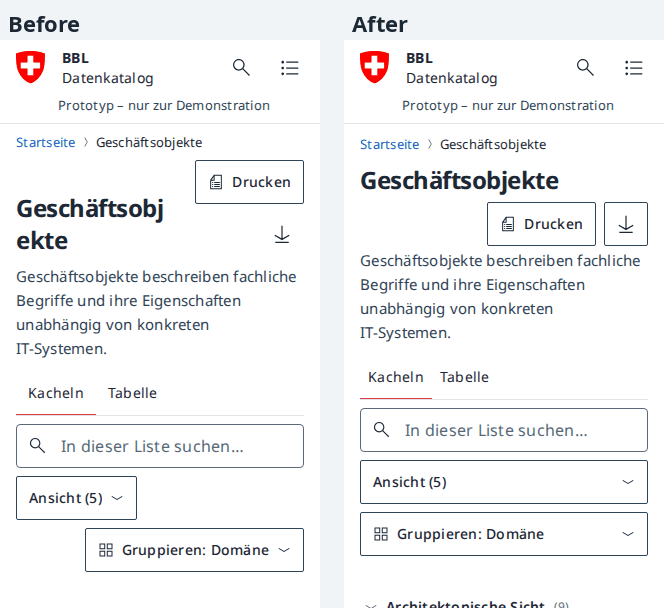 Phone collection at 320 px: full-width title, outlined action pair, stacked controls sharing the left edge | 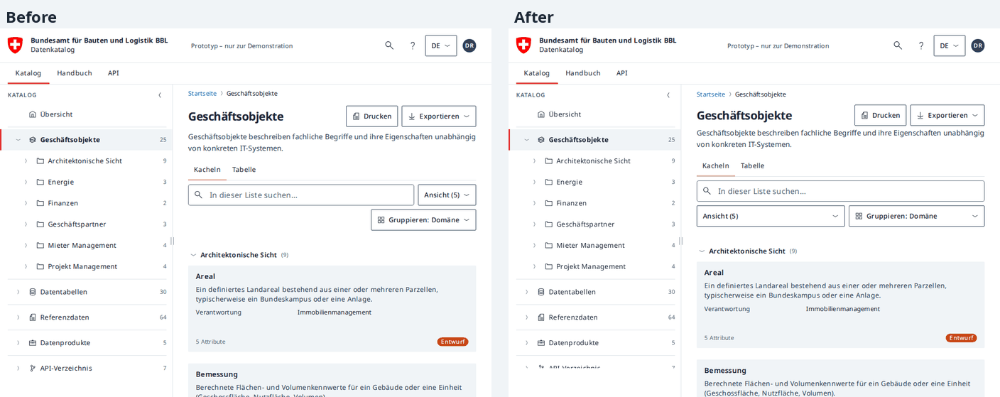 Tablet landscape: search on its own row, view and grouping menus sharing the next row |
| 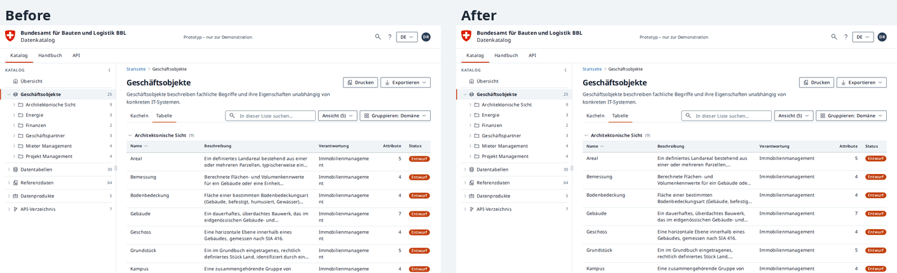 Laptop table: responsibility on one line, descriptions clamped to two lines | 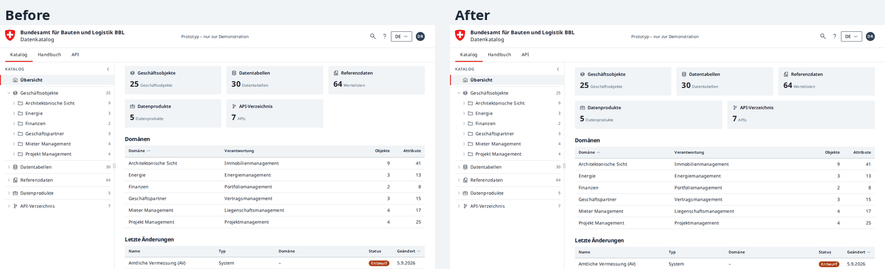 Home summary cards: 3 + 2 without an orphan slot |
| 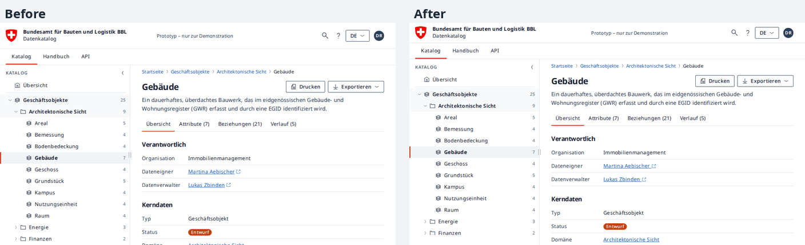 Small laptop profile: 101 px header, 144 px label column | 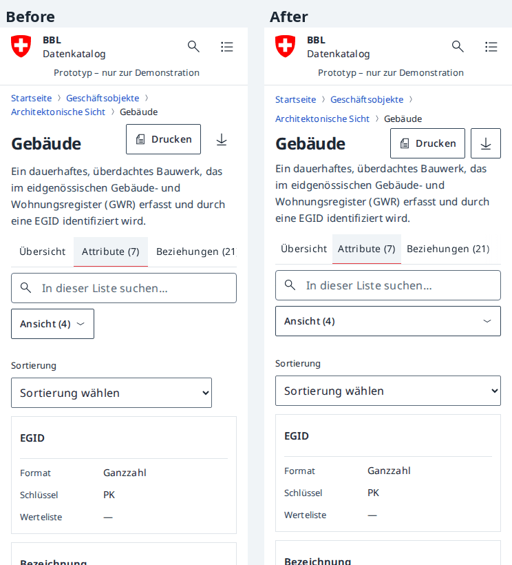 Phone rows tab: action pair, tab fade, full-width view control |
| 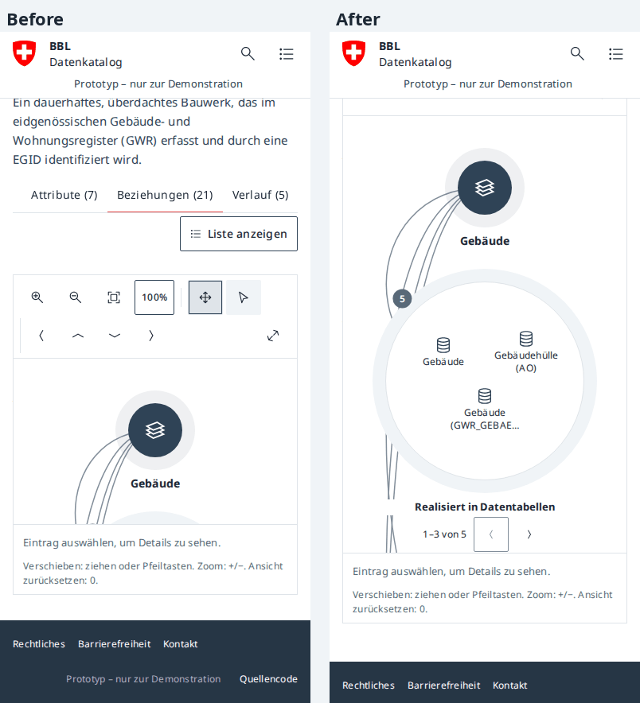 Phone diagram filling the height below the header | 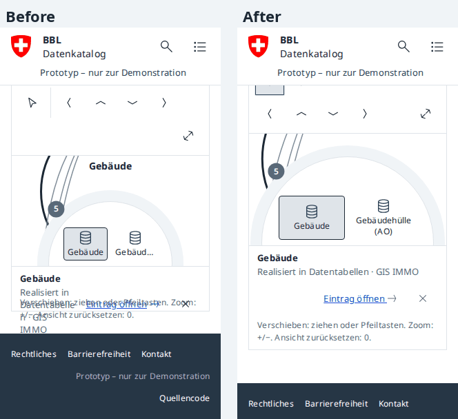 Selection row and hint without overlap |
| 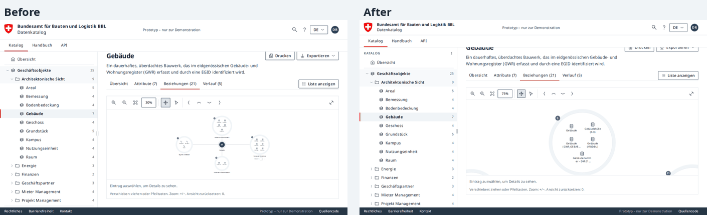 Laptop diagram at 75 % instead of 30 % | 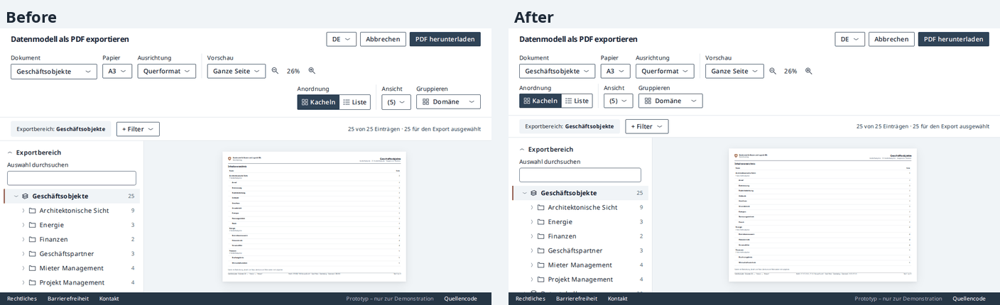 Print toolbar: equal control heights, wrapped group flush left |
| 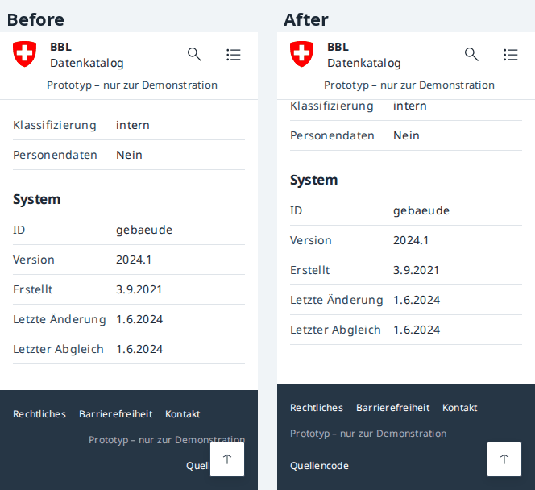 Phone footer: left-aligned rows, docked back-to-top button | 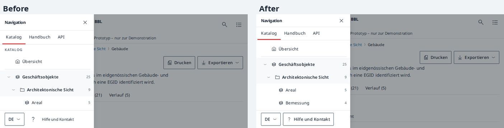 Landscape phone drawer: 84 px header, labelled help button, scrolling tree |

## Verification

- All 33 repository suites were run after the changes: 30 pass, including the core checks, responsive (150 layouts, 8,816 profile combinations), laptop layout (204 layouts), mobile, sidebar, design consistency, contrast, graph, list search, visibility, functional, routing, the import suites and every print suite. `api.cjs`, `catalog-browser.cjs` and `security-browser.cjs` need PGlite, which was not available in the review environment.
- Five assertions that had been stale since earlier content changes were repaired to check the intended behaviour: the 740 px select comparison (`polish.cjs`), the mixed description choice (`visibility.cjs`, `print-review.cjs`, `print-widths.cjs`), the reference-data overview and table titles (`gwr.cjs`) and the canonical handbook URL (`excel.cjs`). No check was weakened or removed.
- `git diff --check` passes. Before/after measurements and the full screenshot set were kept outside the repository; the composites above are the retained evidence.

## Refuted and deliberately unchanged

- Refuted after reproduction: suggestions anchored to the whole search form (documented), the table-to-card switch mechanism (already em-based), hyphenation of card labels (`hyphens: auto` is in place; headless Chromium has no German dictionary), sticky headers below 960 px (only static under 500 px height), preview link sizes in the PDF facsimile, the API parameter table sliver (documented local scrolling), the KPI heading weight (explicit component override), safe-area insets without `viewport-fit=cover` (no visible defect) and mixed-language shell strings (draft translations, content work).
- Not implemented: a two-column stacked diagram for 598–639 px canvases (C24, optional; the fit floor removes the readability problem) and a grid layout for the compact print filter bar (C34; the one-line scope caption contract was kept).
- Environment limits: headless Chromium has no German hyphenation dictionary, so a few very long single words still break at a character on 320 px phones; physical iOS/Android keyboards, safe areas, Safari and Firefox and screen readers remain part of device validation.

## References

- [Design system](../design-system.md) (responsive layout, header logo, component ownership, tokens), [architecture](../architecture.md) and [behavior](../behavior.md) were updated with the new contracts.
- Styles: [tokens](../../css/tokens.css), [components](../../css/components.css), [main](../../css/main.css), [graph](../../css/graph.css), [export](../../css/export.css). Scripts: [views](../../js/views.js), [detail](../../js/detail.js), [ui](../../js/ui.js), [presentation](../../js/presentation.js), [graph](../../js/graph.js), [app](../../js/app.js).
- [Capture script](../../tests/design-review.cjs) and the [test guide](../../tests/README.md).
