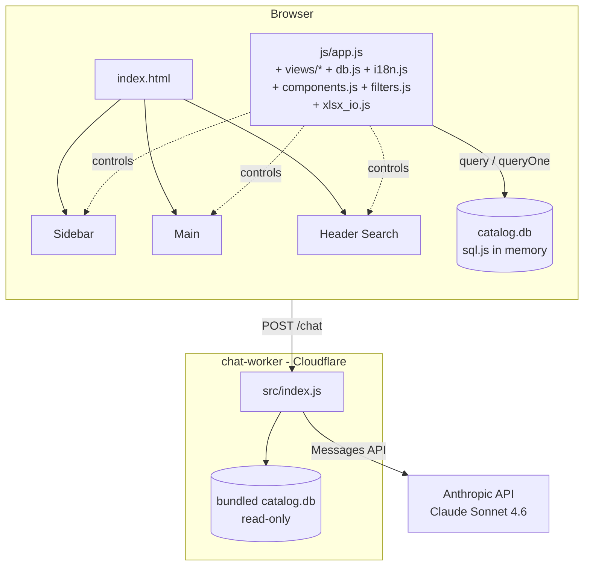
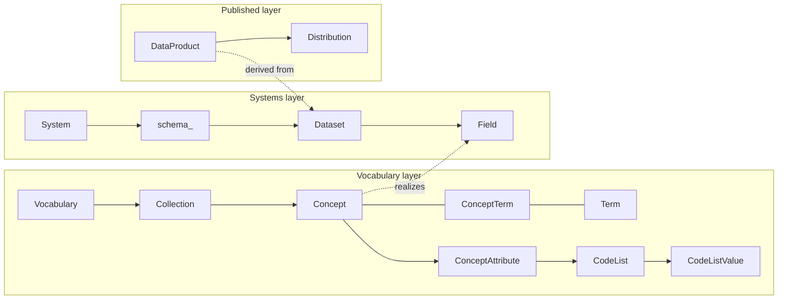
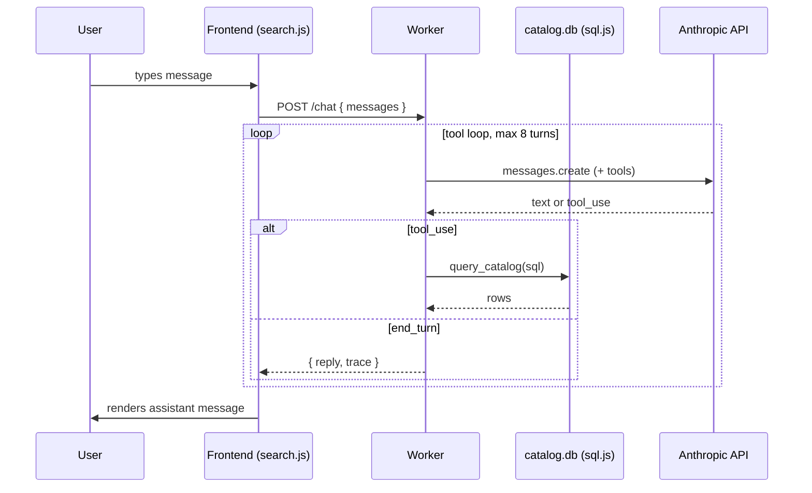

# CLAUDE.md — prototype-sqlite

Developer guide for the **BBL Datenkatalog** SQLite prototype. Scoped to this folder; the repo-root [`../CLAUDE.md`](../CLAUDE.md) documents `prototype-main/`.

## Overview

A pure-static catalog browser backed by a SQLite file loaded client-side via sql.js. Adds an optional Claude-powered chat (KI-Assistent) via a sibling Cloudflare Worker. No build step, no bundler, no framework. Multilingual (DE primary; FR, IT, EN), German UI.

## Architecture at a glance



Key properties:

- **No build step.** Reload to see changes.
- **Zero JS deps on the frontend.** Three CDN scripts only: sql.js, Lucide, SheetJS.
- **Hash-based routing.** `window.location.hash` and query params hold all UI state.
- **The Worker is optional.** Without `CHAT_WORKER_URL` set, the KI-Assistent shows a setup message; the rest of the app is unaffected.

## Repository layout

```
prototype-sqlite/
├── index.html               # Single-page shell (~115 lines)
├── css/
│   ├── tokens.css           # Design tokens (colors, spacing, type)
│   └── styles.css           # All component styles (~2400 lines)
├── js/
│   ├── app.js               # State, router, sidebar, list/detail rendering (~3000 lines)
│   ├── db.js                # query()/queryOne() wrappers around sql.js
│   ├── components.js        # Stateless render helpers (tables, badges, breadcrumbs)
│   ├── filters.js           # URL-as-state filter logic
│   ├── i18n.js              # tr(), tStatus(), tSection(), lang resolution
│   ├── xlsx_io.js           # Excel export + DB download
│   └── views/
│       ├── home.js          # Dashboard (KPIs, recent activity, quality)
│       ├── search.js        # Global search + KI-Assistent chat view
│       ├── graph.js         # Lineage / relationship graph
│       └── export.js        # Workflows & API page
├── data/
│   ├── catalog.db           # SQLite catalog (source of truth)
│   └── i18n.json            # UI translations (4 langs)
├── docs/
│   ├── DATAMODEL.md         # Full ERD + entity reference
│   ├── init-schema.sql      # DDL
│   ├── seed-data.sql        # Seed
│   ├── rebuild_db.py        # Rebuild catalog.db from SQL files
│   └── update_seed_keys.py
├── migrations/              # Per-system seed migrations (GIS IMMO, SAP RE-FX, …)
└── assets/                  # Preview images
```

Sibling folder used by the KI-Assistent:

```
chat-worker/
├── src/index.js             # Cloudflare Worker, ~200 lines
├── wrangler.toml            # CF config: bundles sql.js WASM + catalog.db
├── package.json             # sql.js only; Anthropic API via direct fetch
└── README.md                # Deploy instructions (manual + GH Actions)
```

## Data model



Three layers tied together by **`concept_mapping`** (concept → field, ArchiMate "realizes"), **`lineage_link`** (dataset → dataset), and the materialised **`relationship_edge`** table. Cross-cutting: classifications, profiles, contacts, users.

Full ERD and per-entity column reference: [`docs/DATAMODEL.md`](docs/DATAMODEL.md).

SQL adaptations from the PostgreSQL spec (since this runs on SQLite):

| Postgres | SQLite |
|---|---|
| `UUID` | `TEXT DEFAULT (lower(hex(randomblob(16))))` |
| `TIMESTAMPTZ` | `TEXT` (ISO 8601 UTC) |
| `JSONB` | `TEXT` (parsed in JS via `parseJSON()`) |
| `BOOLEAN` | `INTEGER` (0/1) |
| `TEXT[]` | `TEXT` (JSON array) |

Note `schema` is a SQL reserved word in some contexts → table is named **`schema_`** with a trailing underscore.

## Routing & state

All routes are hash-based. Examples:

| URL | View |
|---|---|
| `#/home` | Dashboard |
| `#/vocabulary/table` | Concept list (table view) |
| `#/vocabulary/diagram?attrs=0` | Concept list (diagram view, attributes hidden) |
| `#/vocabulary/<concept-id>` | Concept detail (overview tab) |
| `#/vocabulary/<concept-id>/relationships` | Concept relationships tab |
| `#/vocabulary/collection/<coll-id>/table` | Concepts filtered by collection |
| `#/systems/<sys-id>/datasets/<ds-id>/overview` | Dataset detail nested under system |
| `#/search?q=mietobjekt` | Search results |
| `#/chat` | KI-Assistent |
| `#/export` | Workflows & API |

State globals live at the top of [`js/app.js`](js/app.js): `currentSection`, `currentEntityId`, `currentTab`, `activeFilters[section]`, `expandedSections`, etc. Filter selections are reflected in URL query params via `filters.js`, so links and back/forward navigation preserve state.

Sidebar table counts are cached in `sidebarCounts` — invalidate if you mutate the DB (we don't, currently).

## i18n

- UI strings: keys in [`data/i18n.json`](data/i18n.json), looked up by `tr('key')`.
- Data row text: typed columns `name_de`, `name_en`, `name_fr`, `name_it`, resolved by `n(row, 'name')` with fallback `lang → en → de → ''`.
- Long prose (`definition`, `description`): stored as JSON blobs `{de:..., en:..., fr:..., it:...}`, resolved by `getDefinitionText()`.
- Tag and enum keys are language-neutral; translations come from `tag.*` / `enum.*` i18n keys.
- Active language: stored in URL `lang` param and `localStorage`, default `de`.
- Section labels and status labels live in `SECTION_LABELS` / `STATUS_LABELS` (populated from `i18n.json`); section icons stay hard-coded in `SECTION_ICONS` since they aren't translation data.

## Code conventions

### JavaScript
- Vanilla JS, no frameworks. `'use strict'` at top of `app.js`.
- IIFE-style globals; no modules.
- Template literals for HTML generation.
- Event delegation on container elements; per-row listeners are rare.
- Each view function returns a string and writes to `#main-content` in one assignment, then calls `lucide.createIcons({ nodes: [mainEl] })` once to render icons. Avoid per-element icon initialisation.
- DB access through `query(sql, params)` / `queryOne(sql, params)` only. Both swallow errors with a console warning so renders can treat the DB as synchronous.
- Use `nameCol('name')` to pick the active-language column, `n(row, 'name')` to resolve with fallback.
- Escape user / DB strings with `escapeHtml()` before template interpolation.

### CSS
- Tokens (colors, spacing, radii, type) in [`css/tokens.css`](css/tokens.css). Use `var(--…)` everywhere.
- BEM-ish naming: `.uml-card`, `.uml-card-header`, `.uml-card--expanded`.
- Mobile-first; flexbox/grid for layout.
- Status colors follow Swiss Federal Administration palette (Swiss red, blue-grey).

### HTML
- Semantic elements (`<nav>`, `<main>`, `<article>`).
- ARIA attributes for live regions, tablists, listboxes (search dropdown), and toggles.
- Skeletons in `index.html` render during sql.js init so first paint isn't blank.

## Making changes

### Adding a concept (or any vocabulary entity)
1. Edit `docs/seed-data.sql` (or the relevant migration in `migrations/`).
2. Re-run `python docs/rebuild_db.py` to regenerate `data/catalog.db`.
3. If new tags / enums: extend `data/i18n.json`.
4. Reload the page; sidebar counts refresh from the new DB.
5. If the chat backend is deployed, push to `main` — the bundled DB in the Worker auto-redeploys (the GH Action watches `prototype-sqlite/data/catalog.db`).

### Adding a new view / route
1. Add a `render<Name>View()` function. Convention: put it in `js/views/` if it's a distinct page, or keep it in `app.js` if it's an entity tab.
2. Wire it in the router (`handleRoute()` in `app.js`).
3. Add a nav entry in `renderSidebar()` if it deserves a sidebar item.
4. If it has filters or grouping: define a `filterCtx` via `createFilterContext(...)` and call `renderListTabBar(...)`.

### Adding a sidebar section / detail tab
- Sections: extend the `['terms', 'vocabulary', 'codelists', 'systems', 'datasets']` array in `renderSidebar()`, plus `SECTION_LABELS` and `SECTION_ICONS`.
- Detail tabs: each `render<Entity>Detail()` function builds its own tab bar via `renderTabBar(tabs, activeTab, base)`. Add an `{id, label}` entry and a branch that calls the new tab's renderer.

### Modifying the data model
1. Update `docs/DATAMODEL.md`.
2. Update `docs/init-schema.sql`.
3. Update seed and/or migrations.
4. Rebuild `catalog.db`.
5. If columns the chat backend's system prompt mentions changed, update [`chat-worker/src/index.js`](../chat-worker/src/index.js) too.

## KI-Assistent (chat) integration

### Frontend contract
- Single `POST` to `CHAT_WORKER_URL` (constant at the top of [`js/views/search.js`](js/views/search.js)) with body `{ messages: [{role, content}, ...] }`.
- Response: `{ reply: string, trace: [...], usage: {...} }`.
- Empty `CHAT_WORKER_URL` → renders a "not configured" message; everything else still works.
- Conversation history is module-scope (`chatHistory` in `search.js`); cleared on full page reload.

### Backend (chat-worker)
Tool-calling loop, max 8 turns, capped at 200 rows per query. Read-only at two layers: `PRAGMA query_only = 1` plus a regex blocking DML/DDL keywords. System prompt (German) describes the schema compactly; the LLM can run `SELECT sql FROM sqlite_master` for the full DDL.



### Deploying the worker
GitHub Actions handles it. The workflow ([`.github/workflows/deploy-chat-worker.yml`](../.github/workflows/deploy-chat-worker.yml)) triggers on changes to `chat-worker/**` or `prototype-sqlite/data/catalog.db`. Required GH secrets/variables:

| Type | Name | Purpose |
|---|---|---|
| secret | `CLOUDFLARE_API_TOKEN` | CF API token (Workers edit scope) |
| secret | `ANTHROPIC_API_KEY` | `sk-ant-…` |
| variable | `CLOUDFLARE_ACCOUNT_ID` | CF account ID (not sensitive) |

Manual deploy fallback: `cd chat-worker && npm run deploy`.

## Testing

No automated tests. Manual checklist when touching anything significant:

1. Sidebar navigation across all sections; collapse/expand toggle.
2. Search dropdown (header) + full search page.
3. Grid/list view toggle on every section list.
4. Detail pages: every tab renders, no console errors.
5. Filter panel: apply, remove, clear, share URL.
6. Lineage / relationships graph: nodes clickable, no overlap on small viewports.
7. Excel export + DB download from `/#/export`.
8. Language switch from header dropdown; verify columns, badges, sections all switch.
9. Print stylesheet on a detail page.
10. If chat backend is configured: send a sample question, verify the tool loop runs and a sensible answer comes back.

## Important constraints

- **No build step.** Don't add bundlers or transpilers. The whole point of this prototype is "drop it on any static host".
- **Zero npm deps in the frontend.** Use CDN scripts when an external library is unavoidable. The Worker (`chat-worker/`) is a separate package and may have deps.
- **Source of truth for data.** `data/catalog.db` is the single source. The Worker bundles a copy via `npm run sync-db` (auto-run by GH Actions). Don't drift them.
- **Swiss Federal styling.** Swiss red, blue-grey, Inter font. Preserve.
- **German is primary.** All seed data, all UI defaults. Add translations for FR/IT/EN where present, but never hide content behind a missing translation — `tr()` and `n()` already fall back gracefully.
- **DCAT-AP CH 2.x compliance** for the export path. The metadata structure must round-trip through `data_product` + `distribution`.
- **Read-only attitude in the chat backend.** Even though it's a prototype, the engine-level `PRAGMA query_only = 1` plus the SQL keyword filter must stay; the LLM should never mutate.
