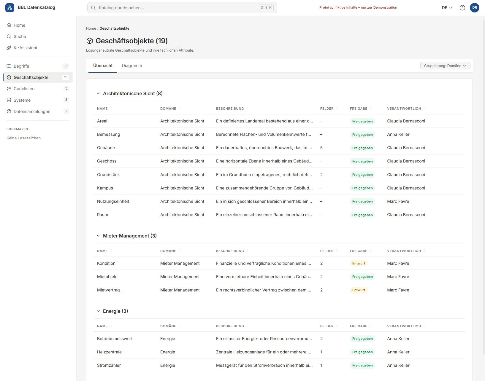
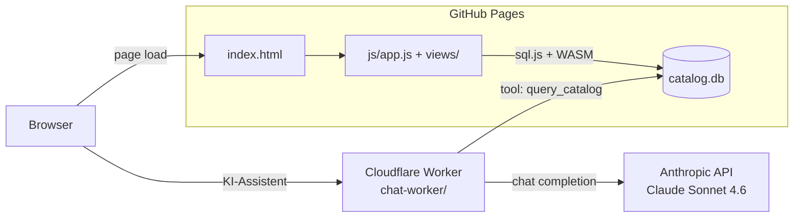

# SQLite Catalog Explorer

Data catalog backed by a SQLite file that runs entirely in the browser. Sidebar navigation, full-text search, detail views for every entity, interactive lineage graphs, and an optional **KI-Assistent** (Claude-powered chat) that answers natural-language questions by querying the catalog directly. In-app branding: *BBL Datenkatalog*. Part of the [BBL Data Catalog prototypes](../README.md).

<p>
  
  
</p>

**Live demo:** https://bbl-dres.github.io/data-catalog/prototype-sqlite/

## Features

- SQLite catalog loaded client-side via sql.js (WASM)
- Keyboard search (Ctrl+K) and dedicated search page
- Sidebar navigation across systems, tables, columns, and vocabulary
- Detail pages for every catalog entity with metadata, attributes, lineage, and relationships
- Interactive UML / lineage graphs
- Excel export and SQLite database download
- **KI-Assistent**: natural-language chat over the catalog, backed by Claude Sonnet 4.6 with tool-call access to SQL
- Multilingual UI (DE, FR, IT, EN), German primary

## Architecture



The frontend is **pure static**: no build step, no server. The Worker is a separate, optional component — without it, the KI-Assistent shows a "not configured" state but everything else works.

## Run locally

```bash
python -m http.server 8000
# open http://localhost:8000
```

Any static file server works.

## Chat backend (optional)

The KI-Assistent view talks to a Cloudflare Worker that proxies Anthropic API calls and gives Claude tool-call access to a bundled copy of `catalog.db`. See [`../chat-worker/README.md`](../chat-worker/README.md) for setup. After deploy, update `CHAT_WORKER_URL` in [`js/views/search.js`](js/views/search.js).

## Tech notes

- [sql.js](https://github.com/sql-js/sql.js) for in-browser SQLite (loaded via CDN)
- [Lucide](https://lucide.dev/) icons via CDN
- [SheetJS](https://sheetjs.com/) for Excel export
- Catalog data lives in `data/` as a SQLite file and supporting JSON
- Chat backend (separate folder): Cloudflare Workers, deployed via GitHub Actions

## Development guide

See [`CLAUDE.md`](CLAUDE.md) for the in-depth developer guide: data model, code organisation, conventions, and how the chat backend fits in.

## License

MIT — see repo root [LICENSE](../LICENSE).
