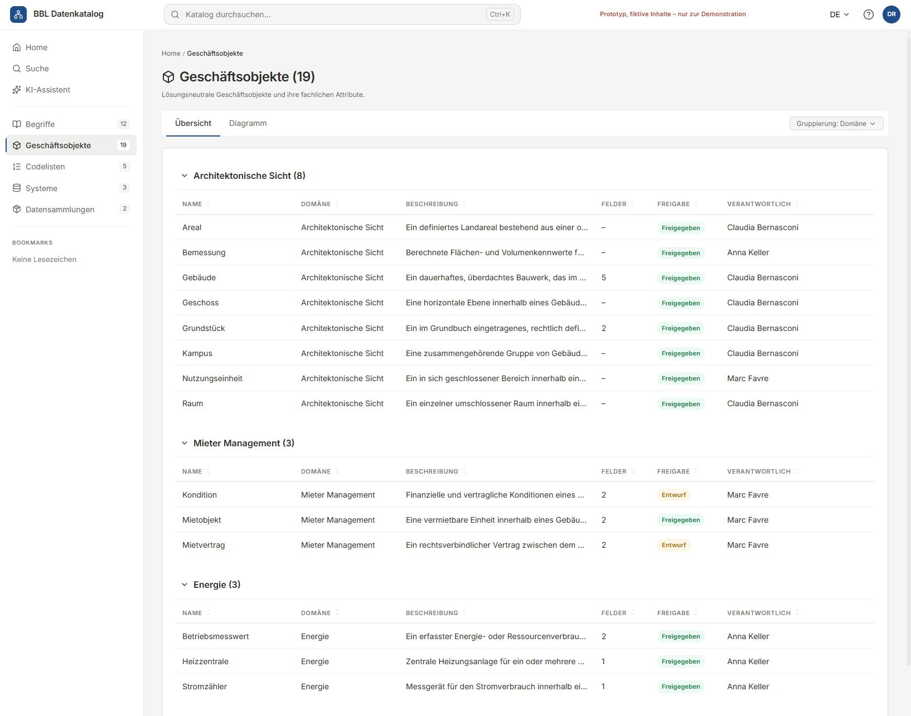
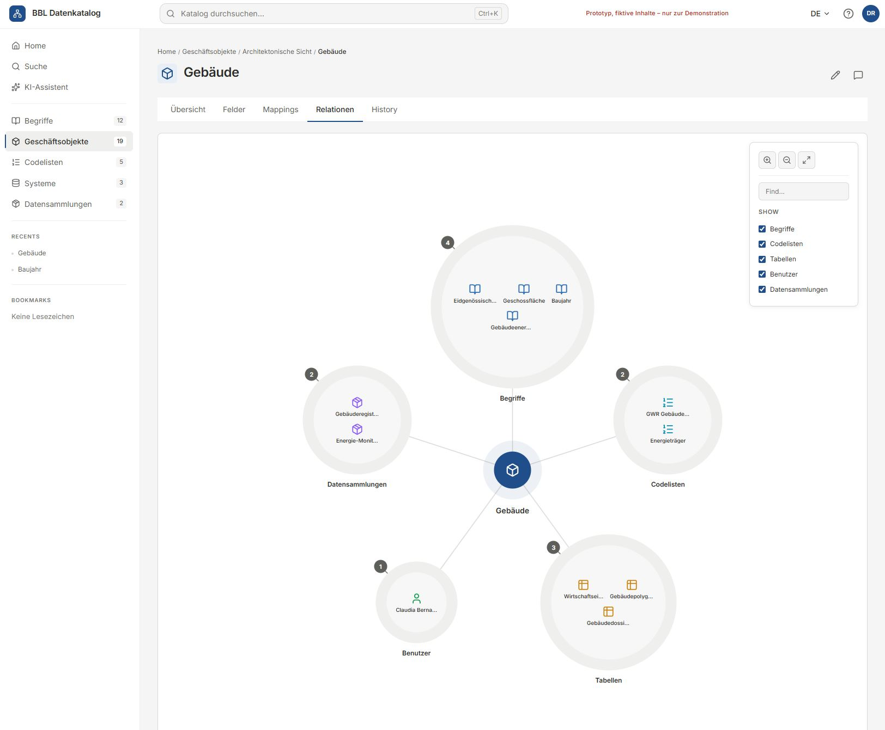

# SQLite Catalog Explorer

[](https://bbl-dres.github.io/data-catalog/prototype-sqlite/)
[](../LICENSE)

> [!CAUTION]
> Unofficial prototype with fictional data. Features may be incomplete, and it is not intended for production use.

Data catalog backed by a SQLite file that runs entirely in the browser through sql.js: sidebar navigation, full-text search, detail views for every entity, interactive lineage graphs, and an optional **KI-Assistent** that answers natural-language questions by querying the catalog through a Claude-powered Cloudflare Worker. In-app branding: *BBL Datenkatalog*. Part of the [BBL Data Catalog prototypes](../README.md).

## Demo

**Live demo:** https://bbl-dres.github.io/data-catalog/prototype-sqlite/

<p align="center">
  
  
</p>

## Features

- SQLite catalog loaded client-side via sql.js (WASM); the `.db` file is the single source of truth.
- Keyboard search (Ctrl+K) and a dedicated search page.
- Sidebar navigation across terms, business objects, code lists, systems and datasets.
- Detail pages with metadata, attributes, lineage and relationships; interactive UML and lineage graphs.
- Excel export and SQLite database download.
- KI-Assistent: natural-language chat over the catalog, backed by Claude with tool-call access to SQL (optional backend).
- Multilingual UI: German primary, with French, Italian and English.

## Run locally

Static vanilla JavaScript that loads the SQLite file over HTTP, so serve it from the repository root:

```bash
python -m http.server 8000
```

Open <http://localhost:8000/prototype-sqlite/>. The KI-Assistent needs the Cloudflare Worker in [`../chat-worker/`](../chat-worker/README.md); without it the view shows a "not configured" notice and everything else works. After deploying, set `CHAT_WORKER_URL` in `js/views/search.js`.

## Documentation

- [Development guide](CLAUDE.md) — architecture, data model, routing, conventions and the chat integration.
- [Data model](docs/DATAMODEL.md) — full ERD and entity reference; the [generic-node](docs/DATAMODEL-NODE.md) and [hybrid](docs/DATAMODEL-HYBRID.md) variants are exploratory drafts.
- [Chat worker](../chat-worker/README.md) — deploying the KI-Assistent backend.

## License

Project code is covered by the [MIT License](../LICENSE). sql.js, Lucide and SheetJS are loaded from CDN under their own licenses.
