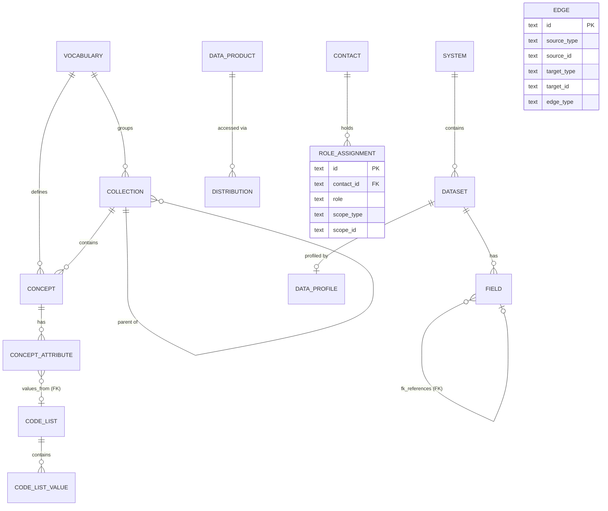

# BBL Datenkatalog – Hybrid Data Model (node/edge backbone)

**Version:** 0.1 (draft — exploration)
**Owner:** DRES — Kreis Digital Solutions
**Status:** Exploratory — a candidate simplification of [`DATAMODEL.md`](DATAMODEL.md) (v0.3)
**Target backend:** SQLite (read-only, built offline by [`rebuild_db.py`](rebuild_db.py), served via sql.js)

---

## 0. What this document is

`DATAMODEL.md` (v0.3) describes the current, fully-normalised relational catalog — ~30 tables. This document is a **candidate redesign** that keeps everything that makes the catalog valuable but collapses the table count by routing all *cross-cutting relationships* through a single polymorphic `edge` table, while keeping the *entity backbone* as typed tables with real foreign keys.

It is deliberately a **hybrid**, not a pure node/edge model (cf. [`../../prototype-canvas/docs/DATAMODEL.md`](../../prototype-canvas/docs/DATAMODEL.md), which is the pure version). The two differ on one axis:

| | prototype-canvas (pure) | **this hybrid** |
|---|---|---|
| Entities | one universal `node` table + `kind` discriminator | **typed tables** (`concept`, `field`, `dataset`, …) |
| Containment (system→dataset→field) | edges (`contains`) | **typed FK columns** |
| Cross-cutting (realizes, lineage, skos) | edges | edges |
| Edge → endpoint integrity | real FK to `node.id` | polymorphic `(type, id)`, validated at build time |
| business↔physical split | collapsed (one `attribute` kind) | **preserved** (`concept` vs `field`, joined by `realizes`) |

The hybrid is chosen here because prototype-sqlite is a **read-only static catalog**: there is no Postgres/RLS to lean on, the DB is rebuilt offline, and the layered SKOS/ArchiMate semantics (the reason this catalog exists) are worth keeping as first-class typed entities rather than enum values.

> This is a *thinking artefact*. Nothing in the running app changes until/unless we decide to adopt it and rewrite [`rebuild_db.py`](rebuild_db.py), the seed, and the read queries in [`../js/app.js`](../js/app.js).

---

## 1. Goals

| # | Goal |
|---|------|
| G1 | **Preserve the business↔physical split.** `concept` (Geschäftsobjekt, solution-neutral) stays distinct from `field` (physical column), tied by `realizes`. This is the catalog's headline value and is non-negotiable for v0.1. |
| G2 | **Dissolve the relationship/junction zoo.** Every M:N junction, every cross-cutting relationship table, and the materialised `relationship_edge` cache collapse into one `edge` table. |
| G3 | **Keep referential integrity on the backbone.** Containment trees (system→dataset→field, data_product→distribution, code_list→value, concept→attribute) stay as `NOT NULL` FKs — orphans impossible by construction. |
| G4 | **Keep the quality lens.** `data_profile` survives (the quality tab depends on it). |
| G5 | **Stay SQLite-shaped & zero-dep.** No build step beyond the existing offline `rebuild_db.py`; read API stays synchronous via sql.js. |
| G6 | **Uniform "what's related?".** Any entity's relationships answerable by a single query over `edge` — no per-type renderers, no materialisation. |

### Non-goals (v0.1)

- Not a pure node/edge model — see prototype-canvas for that.
- Not multi-canvas / multi-tenant — single catalog.
- Not editable in-app — the DB is built offline and shipped read-only.
- Not promoting code-list values, profiles, or distributions to graph nodes — they are leaf/child data (see §2 rule).

---

## 2. Design principle — when does something escape `edge`?

Everything that is a **relationship between two catalog entities** is an `edge`. Everything else is a typed table. An entity earns a table (rather than being an edge or an inline column) only when one of these holds:

1. **It is a navigable thing with its own detail page** → backbone entity table (`concept`, `dataset`, `field`, `data_product`, `term`, `code_list`, `system`).
2. **It is high-cardinality leaf data that is never a relationship endpoint** → child table of its parent (`code_list_value`, `field`, `concept_attribute`, `distribution`). Promoting these to the graph would multiply rows and unlock no query.
3. **It is a 1:1 fact about one entity** → side table (`data_profile`).
4. **It is a person/team, or a role attribution** → `contact` / `role_assignment` (roles carry temporal validity and a role enum — more than a bare typed link).

And the mirror rule — things that look like tables but **aren't**:

- Pure M:N junctions (`dataset_contact`, `data_product_dataset`, …) → edges or `role_assignment`.
- Materialised adjacency (`relationship_edge`) → **deleted**; `edge` is the source of truth.
- Thin grouping layers (`schema_`) → flattened to columns.
- <10-row enum lookups (`data_classification`) → inline CHECK enum + reference data.

---

## 3. Migration map (v0.3 → hybrid v0.1)

30 tables → **17**. The reduction is concentrated entirely in the relationship/junction layer (15 tables → 2).

| v0.3 table | rows | Hybrid fate |
|---|---|---|
| `vocabulary` | 1 | **kept** (light container) |
| `collection` | 5 | **kept** (drives sidebar navigation) |
| `concept` | 19 | **kept** (conceptual entity) |
| `concept_attribute` | 80 | **kept** as child table of `concept` |
| `term` | 12 | **kept** (glossary entity) |
| `concept_term` | 21 | → `edge` (`references_term`) |
| `concept_relation` | 17 | → `edge` (`skos_broader` / `skos_narrower` / `skos_related` / `skos_exact_match`) |
| `code_list` | 5 | **kept** (entity) |
| `code_list_value` | 29 | **kept** as child table of `code_list` |
| `concept_mapping` | 26 | → `edge` (`realizes`) — carries `match_type`, `verified`, `transformation_note` |
| `system` | 3 | **kept** (entity) |
| `schema_` | 4 | **flattened** → `dataset.schema_name`, `dataset.schema_type` |
| `dataset` | 12 | **kept** (entity) |
| `field` | 335 | **kept** as child table of `dataset` |
| `data_product` | 11 | **kept** (entity) |
| `distribution` | 22 | **kept** as child table of `data_product` |
| `lineage_link` | 4 | → `edge` (`lineage`) — carries `transformation_type`, `tool_name`, `job_name`, `frequency` |
| `relationship_edge` | 42 | **deleted** (materialised cache; `edge` + query-time derivation replace it — see §7) |
| `data_classification` | 4 | → inline `classification` enum + reference data |
| `data_profile` | 8 | **kept** as 1:1 side table of `dataset` |
| `data_policy` | 2 | **kept** (entity; linked via `edge` `governed_by`) |
| `contact` | 5 | **kept**, merged with `user` |
| `user` | 5 | → merged into `contact` (`app_role`, `auth_*` nullable) |
| `data_product_dataset` | 6 | → `edge` (`derived_from`) |
| `data_product_classification` | 11 | → inline `data_product.classification` |
| `data_product_contact` | 33 | → `role_assignment` |
| `data_product_policy` | 0 | → `edge` (`governed_by`) |
| `dataset_classification` | 9 | → inline `dataset.classification` |
| `dataset_contact` | 12 | → `role_assignment` |
| `dataset_policy` | 12 | → `edge` (`governed_by`) |
| — | | **NEW:** `edge` |
| — | | **NEW:** `role_assignment` |

**Optional further reductions** (would reach ~14 tables, deferred): fold `vocabulary` into a column on `concept`; replace `collection` with a tag; drop `data_policy`. Each costs a bit of navigation/fidelity, so they are left out of v0.1.

---

## 4. Conceptual model



Two things the diagram **cannot** draw, because they are polymorphic by design:

- **`EDGE`** connects `(source_type, source_id)` → `(target_type, target_id)` across *any* backbone entities. It replaces six v0.3 relationship tables. See §7.
- **`ROLE_ASSIGNMENT.scope`** = `(scope_type, scope_id)` points at any entity. It replaces every `*_contact` junction.

The model has two concerns, same as v0.3:

- **Catalog backbone** — typed entity + child tables with FK containment: *what exists* and its strict hierarchy.
- **Graph & governance** — `edge` (semantic/lineage relationships), `contact` + `role_assignment` (people & responsibilities), inline `classification` (ISG tier).

---

## 5. Entity overview

| Table | Role | Layer | DCAT / SKOS / ArchiMate | Volume (now) |
|---|---|---|---|---|
| `vocabulary` | entity | Vocabulary | `skos:ConceptScheme` | 1 |
| `collection` | entity (nav) | Vocabulary | `skos:Collection` | 5 |
| `concept` | entity | Vocabulary | `skos:Concept` / Business Object | 19 |
| `concept_attribute` | child of `concept` | Vocabulary | local ext. | 80 |
| `term` | entity | Vocabulary | `skos:Concept` (glossary) | 12 |
| `code_list` | entity | Vocabulary | `skos:ConceptScheme` (codelist) | 5 |
| `code_list_value` | child of `code_list` | Vocabulary | `skos:Concept` | 29 |
| `system` | entity | Systems | `bv:System` | 3 |
| `dataset` | entity | Systems | `dcat:Dataset` (physical) | 12 |
| `field` | child of `dataset` | Systems | `bv:Field` | 335 |
| `data_product` | entity | Products | `dcat:Dataset` (published) | 11 |
| `distribution` | child of `data_product` | Products | `dcat:Distribution` | 22 |
| `data_profile` | 1:1 of `dataset` | Cross-cutting | `dqv:QualityMeasurement` | 8 |
| `data_policy` | entity | Cross-cutting | local ext. | 2 |
| **`edge`** | **graph** | Cross-cutting | `dcat:qualifiedRelation`, `skos:*`, `prov:wasDerivedFrom`, `realizes` | (≈90, was spread over 6 tables) |
| `contact` | entity | Cross-cutting | `dcat:contactPoint` + user | 5 |
| `role_assignment` | graph (people) | Cross-cutting | `Assignment` / NaDB roles | (≈45) |

SQLite type conventions (carried from [`../CLAUDE.md`](../CLAUDE.md)): `UUID → TEXT`, `TIMESTAMPTZ → TEXT` (ISO 8601 UTC), `JSONB → TEXT` (parsed in JS), `BOOLEAN → INTEGER` (0/1), `TEXT[] → TEXT` (JSON array).

---

## 6. Backbone entities

Long-prose fields (`definition`, `description`, `scope_note`) keep the existing prototype-sqlite convention: a JSON blob `{de,fr,it,en}` in a `TEXT` column, resolved by `getDefinitionText()`. Short labels stay as typed `name_*` columns resolved by `n(row, 'name')`. (prototype-canvas went all-typed; we stay JSON-for-prose to avoid touching the existing resolver.)

Only **new or changed** columns are annotated in detail; unchanged columns reference [`DATAMODEL.md`](DATAMODEL.md).

### 6.1 vocabulary
Unchanged from v0.3 §6.1. Top SKOS scheme. `id`, `name_*`, `description`(JSON), `version`, `homepage`, `publisher`, `status`, `created_at`, `modified_at`.

### 6.2 collection
Unchanged from v0.3 §6.2. `id`, `vocabulary_id` FK, `parent_collection_id` FK (self), `name_*`, `description`(JSON), `sort_order`. Kept because the sidebar groups concepts by collection.

### 6.3 concept
As v0.3 §6.3, **minus** the relationship-bearing columns:

| Column | Type | Note |
|---|---|---|
| `id` | TEXT | PK |
| `vocabulary_id` | TEXT | FK → `vocabulary.id`, NOT NULL |
| `collection_id` | TEXT | FK → `collection.id`, nullable |
| `name_de/fr/it/en` | TEXT | `name_de` recommended |
| `alt_names` | TEXT | JSON `{de:[...],...}` |
| `definition` | TEXT | JSON `{de,fr,it,en}` |
| `scope_note` | TEXT | JSON |
| `status` | TEXT | `draft \| approved \| deprecated` |
| `classification` | TEXT | **NEW (inline)** ISG tier — see §9 enum, nullable |
| `egid_relevant` | INTEGER | 0/1 |
| `egrid_relevant` | INTEGER | 0/1 |
| `created_at`, `modified_at` | TEXT | |

**Removed vs v0.3:** `standard_ref` (now `references_term` edges + standard text on `term`), `steward_id` (now `role_assignment`). SKOS concept↔concept relations move to `edge`.

### 6.4 concept_attribute  *(child of concept — leaf, not a graph node in variant A)*

| Column | Type | Note |
|---|---|---|
| `id` | TEXT | PK |
| `concept_id` | TEXT | FK → `concept.id`, NOT NULL |
| `name_de/fr/it/en` | TEXT | |
| `definition` | TEXT | JSON |
| `value_type` | TEXT | `text\|integer\|float\|boolean\|date\|uri\|code` |
| `code_list_id` | TEXT | **FK → `code_list.id`** (kept as a clean typed link, not an edge) |
| `required` | INTEGER | 0/1 |
| `key_role` | TEXT | `PK\|FK\|UK\|null` |
| `standard_ref` | TEXT | |
| `sort_order` | INTEGER | |

> **Variant A vs B.** In **variant A** (documented here, = today's semantics) the `realizes` relationship is `concept → field`, and `concept_attribute` stays a leaf child. In **variant B** (richer, column-level lineage) `concept_attribute` becomes a graph endpoint and `realizes` is `concept_attribute → field`; nothing else changes except `edge`'s allowed `realizes` signature. The decision is isolated to one edge signature — see §7.4.

### 6.5 term
As v0.3 §6.3a. `id`, `name_*`, `definition`(JSON), `standard_ref`, `source_type`, `source_document`, `status`, `created_at`, `modified_at`. `related_terms` (v0.3 JSON array) → `edge` (`skos_related` term→term) for consistency, or kept as JSON if cheaper. Concept↔term links are now `edge` (`references_term`).

### 6.6 code_list
As v0.3 §6.5, minus `owner_id` (→ `role_assignment`). `id`, `concept_id` FK (nullable), `name_*`, `source_ref`, `version`, `status`.

### 6.7 code_list_value  *(child of code_list — leaf)*
Unchanged from v0.3 §6.6. `id`, `code_list_id` FK, `code`, `label_*`, `description`(JSON), `deprecated`, `sort_order`. Never a graph endpoint (§2 rule 2).

### 6.8 system
As v0.3 §6.8, minus `owner_id` (→ `role_assignment`). `id`, `name_*`, `description`(JSON), `archimate_type`, `technology_stack`, `base_url`, `scanner_class`, `last_scanned_at`, `active`, `created_at`.

### 6.9 dataset  *(absorbs `schema_`)*

| Column | Type | Note |
|---|---|---|
| `id` | TEXT | PK |
| `system_id` | TEXT | **FK → `system.id`, NOT NULL** (was via `schema_`) |
| `schema_name` | TEXT | **NEW** flattened from `schema_.name` |
| `schema_type` | TEXT | **NEW** flattened (`database_schema\|gis_workspace\|bim_project\|file_folder\|api_namespace`) |
| `name` | TEXT | technical name |
| `display_name` | TEXT | |
| `dataset_type` | TEXT | `table\|view\|gis_layer\|bim_model\|file\|api_resource` |
| `description` | TEXT | JSON |
| `classification` | TEXT | **NEW (inline)** ISG tier |
| `certified` | INTEGER | 0/1 |
| `egid`, `egrid` | TEXT | |
| `row_count_approx` | INTEGER | |
| `source_url` | TEXT | |
| `created_at`, `modified_at` | TEXT | |

**Removed:** `owner_id` (→ `role_assignment`); `schema_id` (table gone). Classification + policy + contact junctions gone (→ inline / edge / role_assignment).

### 6.10 field  *(child of dataset — leaf; realizes-target)*
As v0.3 §6.11. `id`, `dataset_id` FK NOT NULL, `name`, `display_name`, `data_type`, `description`(JSON), `nullable`, `is_primary_key`, `is_foreign_key`, `references_field_id` (**kept as self-FK** for column-level FK integrity), `sample_values`(JSON), `sort_order`.

> `field.references_field_id` stays a typed FK (clean, enforced). It is *projected* into the relationships graph at query time rather than duplicated into `edge` (see §7.3). The target of `realizes` edges from `concept` (variant A).

### 6.11 data_product
As v0.3 §6.12, minus the classification/contact junctions:

| Column | Type | Note |
|---|---|---|
| `id` | TEXT | PK |
| `name_de/fr/it/en` | TEXT | |
| `description` | TEXT | JSON |
| `publisher` | TEXT | |
| `license` | TEXT | |
| `theme` | TEXT | JSON array |
| `keyword` | TEXT | JSON |
| `spatial_coverage` | TEXT | |
| `temporal_start`, `temporal_end` | TEXT | |
| `update_frequency` | TEXT | |
| `classification` | TEXT | **NEW (inline)** ISG tier |
| `certified` | INTEGER | 0/1 |
| `issued`, `modified` | TEXT | |

Source datasets (`data_product_dataset`) → `edge` (`derived_from`). Policies → `edge` (`governed_by`). Contacts → `role_assignment`.

### 6.12 distribution  *(child of data_product — leaf)*
Unchanged from v0.3 §6.13. `id`, `data_product_id` FK NOT NULL, `name_*`, `access_url`, `download_url`, `media_type`, `access_type`, `format`, `byte_size`, `conformsTo`, `description`(JSON), `availability`. Not a graph endpoint.

### 6.13 data_profile  *(1:1 side table of dataset)*
Unchanged from v0.3 §6.17. PK/FK `dataset_id` (UNIQUE → 1:1). All the quality scores (`completeness_score`, `format_validity_score`, `timeliness_score`, `accuracy_score`, `consistency_score`, `uniqueness_score`, `null_percentage`, `row_count`, …). Powers the dataset Quality tab.

### 6.14 data_policy  *(entity, linked via edge)*
As v0.3 §6.18. `id`, `name_*`, `policy_type`, `rule_definition`(JSON), `legal_basis`, `owner`, `valid_from`, `valid_to`. Datasets/products reference it via `edge` (`governed_by`).

---

## 7. The graph: `edge`

The heart of the simplification. One table replaces `concept_mapping`, `lineage_link`, `concept_relation`, `concept_term`, `data_product_dataset`, the `*_policy` junctions, **and** the materialised `relationship_edge`.

### 7.1 Table

```sql
CREATE TABLE edge (
  id            TEXT PRIMARY KEY,           -- lower(hex(randomblob(16)))
  source_type   TEXT NOT NULL,             -- entity table name (see §7.2)
  source_id     TEXT NOT NULL,
  target_type   TEXT NOT NULL,
  target_id     TEXT NOT NULL,
  edge_type     TEXT NOT NULL,             -- enum, see §7.4

  -- relationship attributes (nullable; used only by the noted edge_types)
  match_type          TEXT,   -- realizes: skos:exactMatch | relatedMatch | broadMatch | narrowMatch
  verified            INTEGER,-- realizes: 0/1 steward-confirmed
  transformation_note TEXT,   -- realizes
  transformation_type TEXT,   -- lineage: copy|transform|aggregate|filter|join|derive
  tool_name           TEXT,   -- lineage: FME|SAP PI|Python|ArcGIS Pro|...
  job_name            TEXT,   -- lineage
  frequency           TEXT,   -- lineage: realtime|daily|weekly|on_demand
  weight              REAL,   -- UI sort hint (carried from relationship_edge)
  note                TEXT,   -- DE-only commentary
  created_at          TEXT,

  CHECK (NOT (source_type = target_type AND source_id = target_id)),   -- no self-loops
  CHECK (edge_type IN (
    'realizes','skos_broader','skos_narrower','skos_related','skos_exact_match',
    'references_term','lineage','derived_from','governed_by'
  ))
);
CREATE UNIQUE INDEX edge_uniq ON edge (source_type, source_id, target_type, target_id, edge_type);
CREATE INDEX edge_src ON edge (source_type, source_id);
CREATE INDEX edge_tgt ON edge (target_type, target_id);
CREATE INDEX edge_type_idx ON edge (edge_type);
```

The handful of nullable attribute columns are the EAV-ish cost of one generic table. Only `realizes` and `lineage` use them; everything else leaves them NULL. (Alternative: a single `attributes` JSON column — cheaper to extend, harder to query. Sparse typed columns were chosen because the app already treats the DB as a typed read API, and `relationship_edge` already carried `weight`/`derived_from` the same way.)

### 7.2 Endpoint types

`source_type` / `target_type` ∈ the backbone table names that can be relationship endpoints:

```
concept | term | code_list | system | dataset | field | data_product | data_policy
( + concept_attribute in variant B )
```

Child/leaf tables that are **never** endpoints: `code_list_value`, `distribution`, `data_profile`, `collection`, `vocabulary`, and (in variant A) `concept_attribute`.

### 7.3 Three kinds of relationship — where each lives

| Kind | Example | Stored where | Rationale |
|---|---|---|---|
| **Structural / containment** | dataset→field, system→dataset, code_list→value, concept→attribute, attr→code_list, field→field FK | **typed FK columns** | strict trees; FK `NOT NULL` guarantees integrity for free |
| **Semantic / lineage** | concept realizes field, dataset lineage, product derived_from dataset, concept skos_broader concept, concept references_term term, dataset governed_by policy | **`edge`** | many-to-many, cross-layer, the interesting graph |
| **Derived** | `sibling` (same `schema_name`), `shared_classification` (same `classification`) | **computed at query time** | were materialised rows in `relationship_edge`; now a `WHERE` clause |

This is the key move that lets `relationship_edge` disappear: its rows were a *mix* of real relationships (now in `edge`) and *derivable* ones (now computed). Nothing is lost.

A unified "related to X" query (replacing five per-type renderers and the materialised table):

```sql
-- stored relationships, both directions
SELECT edge_type, target_type AS other_type, target_id AS other_id FROM edge
  WHERE source_type = :t AND source_id = :id
UNION ALL
SELECT edge_type, source_type, source_id FROM edge
  WHERE target_type = :t AND target_id = :id;
-- derived "sibling" datasets, when :t='dataset', added on demand:
-- SELECT 'sibling','dataset', id FROM dataset
--   WHERE schema_name = (SELECT schema_name FROM dataset WHERE id=:id) AND id <> :id;
```

### 7.4 Edge type signatures

Each `edge_type` is only valid between specific endpoint types. Enforced at build time (§8), documented here:

| edge_type | source_type → target_type | Direction meaning | v0.3 origin |
|---|---|---|---|
| `realizes` | `concept` → `field` *(A)* / `concept_attribute` → `field` *(B)* | business element realised by physical field (ArchiMate) | `concept_mapping` |
| `skos_broader` | `concept` → `concept` | source is narrower than target | `concept_relation` |
| `skos_narrower` | `concept` → `concept` | source is broader than target | `concept_relation` |
| `skos_related` | `concept` → `concept` / `term` → `term` | associative | `concept_relation`, `term.related_terms` |
| `skos_exact_match` | `concept` → `concept` | equivalence | `concept_relation` |
| `references_term` | `concept` → `term` | concept cites a standardised term | `concept_term` |
| `lineage` | `dataset` → `dataset` | data flows source → target (downstream) | `lineage_link` |
| `derived_from` | `data_product` → `dataset` | product built from physical dataset | `data_product_dataset` |
| `governed_by` | `dataset`/`data_product` → `data_policy` | entity subject to a policy | `*_policy` junctions |

`skos_broader`/`skos_narrower` are kept as an explicit inverse *pair* (not one direction inferred) so the graph view never has to reason about inversion; the build step (§8) asserts they stay consistent.

---

## 8. Integrity & build-time validation

The polymorphic `edge` and `role_assignment.scope` cannot be FK-enforced by SQLite (no FK to "whatever table"). In v0.3 the DB engine guaranteed this; here it moves to [`rebuild_db.py`](rebuild_db.py). The build **must fail** if any check below fails — this is the price of the table reduction, paid once at build time instead of continuously at the engine.

Backbone FKs are still real and enforced (`PRAGMA foreign_keys = ON`): containment trees, `concept_attribute.code_list_id`, `field.references_field_id`, `data_profile.dataset_id`, `role_assignment.contact_id`.

Build-time assertions for the graph:

1. **Endpoint resolves.** For every `edge` (and every `role_assignment.scope`), `(type, id)` references an existing row in the named table.
2. **Signature valid.** `(source_type, target_type)` matches the `edge_type`'s allowed signature (§7.4).
3. **No self-loop / no duplicate.** Covered by CHECK + unique index, re-asserted for clarity.
4. **SKOS inverse coherence.** Every `skos_broader (a→b)` has a matching `skos_narrower (b→a)` (and vice versa).
5. **Cardinality where v0.3 had it.** e.g. a `field` has exactly one parent `dataset` (FK, automatic); a `realizes` edge's `field` endpoint should resolve to a real field. "At least one mapping per concept" — which v0.3 also could not enforce — stays a *warning*, not an error.
6. **Containment vs edge separation.** No `edge` row encodes containment (e.g. no `system→dataset` edge) — those belong in FK columns only, so the graph stays free of structural noise.

Recommended: ship these as a `validate()` pass in `rebuild_db.py` that prints a per-rule report and exits non-zero on any hard failure.

---

## 9. Enums & reference data

CHECK enums (keys are technical; labels via `data/i18n.json` `enum.*` / `tag.*`):

```
concept.status / term.status / code_list.status : draft | approved | deprecated
classification (concept/dataset/data_product)   : public | internal | confidential | secret
concept_attribute.value_type                    : text | integer | float | boolean | date | uri | code
concept_attribute.key_role                       : PK | FK | UK | null
dataset.dataset_type                             : table | view | gis_layer | bim_model | file | api_resource
dataset.schema_type                              : database_schema | gis_workspace | bim_project | file_folder | api_namespace
distribution.access_type                          : rest_api | sql_endpoint | file_export | report | dashboard | odata
edge.edge_type                                    : see §7.4
role_assignment.role                              : data_owner | data_steward | data_custodian | publisher | subject_matter_expert
contact.app_role                                  : admin | steward | analyst | viewer | null
```

**Classification reference** (replaces the `data_classification` table; this is static reference data, not rows):

| key | sensitivity | legal_basis (ISG/DSG) |
|---|---|---|
| `public` | 0 | EMBAG Art. 10 |
| `internal` | 1 | ISG Art. 6 |
| `confidential` | 2 | ISG Art. 7 / DSG Art. 5 lit. c |
| `secret` | 3 | ISG Art. 8, VGG |

> **Lossy vs v0.3:** classification becomes **single-valued** per entity (was M:N), and `legal_basis`/`sensitivity_level` become reference data rather than queryable columns. If a dataset legitimately needs both an ISG tier *and* a DSG personal-data flag, add a separate `personal_data` enum column rather than reintroducing the junction.

---

## 10. Governance: `contact` + `role_assignment`

### 10.1 contact (merges v0.3 `contact` + `user`)

| Column | Type | Note |
|---|---|---|
| `id` | TEXT | PK |
| `name` | TEXT | person or team name |
| `email` | TEXT | UNIQUE |
| `phone` | TEXT | |
| `organisation` | TEXT | |
| `is_team` | INTEGER | 0/1 |
| `app_role` | TEXT | `admin\|steward\|analyst\|viewer\|null` (null = non-user) |
| `preferred_language` | TEXT | `de\|fr\|it\|en` |
| `created_at` | TEXT | |

### 10.2 role_assignment (replaces every `*_contact` junction)

```sql
CREATE TABLE role_assignment (
  id          TEXT PRIMARY KEY,
  contact_id  TEXT NOT NULL REFERENCES contact(id),
  role        TEXT NOT NULL,        -- see §9
  scope_type  TEXT NOT NULL,        -- entity table name (polymorphic)
  scope_id    TEXT NOT NULL,
  valid_from  TEXT,
  valid_to    TEXT,                 -- null = current
  note        TEXT,
  created_at  TEXT
);
CREATE INDEX role_scope ON role_assignment (scope_type, scope_id);
CREATE INDEX role_contact ON role_assignment (contact_id, role);
```

`role_assignment` is "an edge with a role and a validity window." It is kept separate from `edge` because (a) its endpoint is always a `contact` on one side, (b) it carries temporal columns no other edge needs, and (c) it never appears in the entity-to-entity relationships graph. The DCAT `dcat:contactPoint` / `dct:publisher` projections are computed from it, never stored (cf. v0.3 §6.10).

---

## 11. Read-side impact (why this helps a *browser*)

prototype-sqlite is a read tool, so the win is measured in rendering code, not write ergonomics:

- **Five relationship renderers collapse to one.** `renderConceptRelationships`, `renderCodeListRelationships`, `renderSystemRelationships`, `renderDatasetRelationships`, `renderProductRelationships` (in [`../js/app.js`](../js/app.js)) all become one `edge`-driven helper + the §7.3 query.
- **The `relationship_edge` materialisation disappears** — no rebuild step, no staleness, no `sidebarCounts`-style cache to invalidate for it.
- **Lineage graph simplifies.** [`../js/views/graph.js`](../js/views/graph.js) already wants edges; it reads `edge` directly (filter `edge_type IN ('lineage','realizes','derived_from')`).
- **Detail tabs stay direct typed queries.** Overview/Attributes/Quality/Stakeholders read backbone + child tables exactly as today — the split being preserved means `renderConceptOverview`, `renderDatasetQuality`, etc. barely change.
- **Mappings tab** (`renderConceptMappings`) becomes `SELECT … FROM edge JOIN field … WHERE edge_type='realizes' AND source_id=:concept`.

Net: fewer code paths, no materialised cache, and the parts that were already typed-table reads stay typed-table reads.

---

## 12. What's lost / deferred

Honest ledger of what the hybrid gives up versus v0.3:

| Lost / changed | Severity | Mitigation |
|---|---|---|
| Engine-enforced edge integrity | medium | build-time `validate()` in `rebuild_db.py` (§8); DB is read-only so a passing build is a frozen guarantee |
| Multi-valued classification (M:N) | low | single enum + optional `personal_data` column |
| `data_classification.legal_basis` as data | low | reference table in §9 / i18n |
| `schema_` as an entity | low | flattened to `dataset.schema_name`; grouping label preserved |
| `relationship_edge.weight` per stored edge | none | carried as `edge.weight` |
| Sparse nullable columns on `edge` | low (cosmetic) | only `realizes`/`lineage` use them; JSON-attributes alternative noted |
| Column-level lineage | n/a | not in v0.3 either; **variant B** unlocks it for free |

Explicitly **kept** (the things that justified saying "hybrid"): the business↔physical split, SKOS relation types, the glossary `term` entity, the quality `data_profile`, FK integrity on every containment tree, and the existing JSON-for-prose i18n convention.

---

## 13. Open decision

The one fork that needs a human call before this could be implemented:

- **Variant A** — `realizes` is `concept → field`; `concept_attribute` is a leaf. Matches today's semantics exactly; smallest change.
- **Variant B** — `realizes` is `concept_attribute → field`; `concept_attribute` becomes a graph endpoint. True column-level realization; richer lineage; ~80 more graph endpoints. Isolated to one edge signature (§7.4) + adding `concept_attribute` to §7.2.

Everything else in this document is independent of that choice.

---

*End of document — exploratory draft, not yet adopted.*
