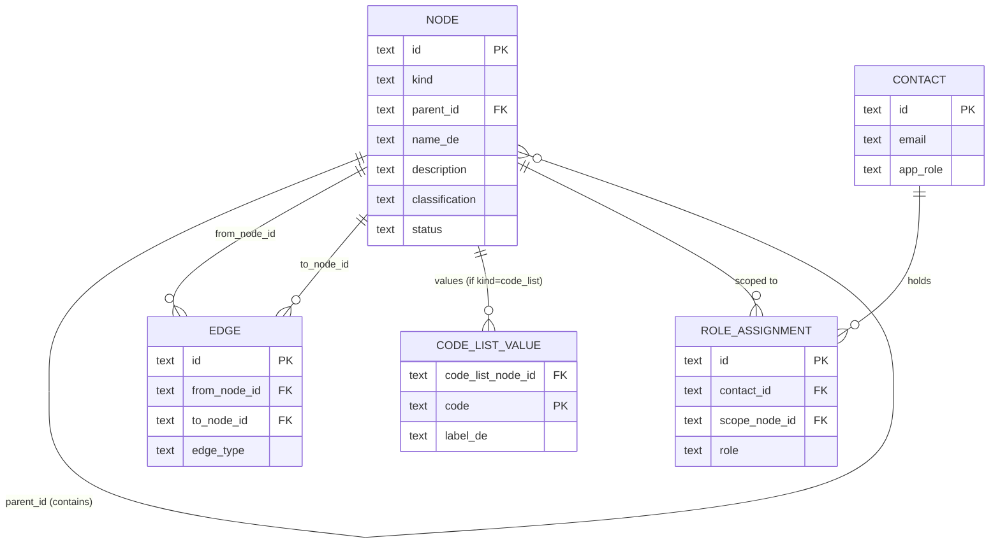

# BBL Datenkatalog – Generic-Node Data Model

**Version:** 0.2 (draft — exploration)
**Owner:** DRES — Kreis Digital Solutions
**Status:** Exploratory — pushes [`DATAMODEL-HYBRID.md`](DATAMODEL-HYBRID.md) (v0.1) further: collapse the typed entity tables into one generic `node`.
**Target backend:** SQLite (read-only, built offline by [`rebuild_db.py`](rebuild_db.py), served via sql.js)

---

## 0. What this document is

[`DATAMODEL.md`](DATAMODEL.md) (v0.3) is the current, fully-normalised relational catalog — ~30 tables. [`DATAMODEL-HYBRID.md`](DATAMODEL-HYBRID.md) (v0.1) kept a typed table per entity but routed all relationships through one `edge`. This document takes the next step: **every navigable entity becomes a row in one generic `node` table, discriminated by `kind`.** Relationships stay in `edge`; containment moves to a self-referencing `parent_id` on `node`.

| | v0.3 relational | hybrid (v0.1) | **generic-node (v0.2)** | prototype-canvas (pure) |
|---|---|---|---|---|
| Entities | ~13 typed tables | ~14 typed tables | **one `node` + `kind`** | one `node` + `kind` |
| Containment | FK per child table | FK per child table | **`node.parent_id` self-FK** | edges (`contains`) |
| Cross-cutting | 6 tables + cache | `edge` | `edge` | edges |
| Edge → endpoint integrity | n/a | **polymorphic, build-time only** | **real FK → `node.id`** | real FK → `node.id` |
| business↔physical split | preserved | preserved | **preserved** | collapsed |
| Tables | ~30 | 17 | **5** | 11 |

Two things make this *strictly better* than the hybrid, not merely smaller:

1. **`edge` regains real foreign keys.** The hybrid's worst compromise was polymorphic `(type, id)` endpoints with no FK — an entire build-time `validate()` pass (hybrid §8) existed to catch dangling edges. With one `node` table, `edge.from_node_id` / `to_node_id` are real FKs. So is `role_assignment.scope_node_id`. **The hardest integrity problem of the hybrid disappears.**
2. **Containment becomes one self-FK.** `node.parent_id → node.id` expresses *every* hierarchy (vocabulary→collection→concept→attribute, system→dataset→field, data_product→distribution) as a single enforced adjacency-list tree, instead of a typed FK per child table.

The split that matters survives untouched: `concept` and `field` are simply **two different `kind` values joined by a `realizes` edge.** Collapsing them (as prototype-canvas did) was never a requirement of the pattern.

> This is a *thinking artefact*. Nothing in the running app changes until/unless we adopt it and rewrite [`rebuild_db.py`](rebuild_db.py), the seed, and the read queries in [`../js/app.js`](../js/app.js).

---

## 1. Goals

| # | Goal |
|---|------|
| G1 | **Preserve the business↔physical split.** `concept` (Geschäftsobjekt) stays distinct from `field` (physical column), tied by `realizes`. Non-negotiable. |
| G2 | **One generic entity table.** Every navigable thing is a `node` row discriminated by `kind`; new kinds are an enum value, not a new table. |
| G3 | **Restore referential integrity.** Edge endpoints and role scopes become real FKs to `node.id` — recovering what the hybrid's polymorphic columns gave up. |
| G4 | **One containment tree.** All parent-child hierarchy is a single self-referencing `node.parent_id`; `edge` is reserved for the cross-cutting graph. |
| G5 | **Keep the quality lens.** Dataset profiling survives (the quality tab depends on it). |
| G6 | **Stay SQLite-shaped & zero-dep.** No build step beyond the offline `rebuild_db.py`; the read API stays synchronous via sql.js. |
| G7 | **Uniform read code.** One card renderer, one detail shell, one "children" query, one "related" query — kind-parameterised. |

### Non-goals (v0.2)

- Not the pure prototype-canvas model — that collapses the business↔physical split; we keep it.
- Not multi-canvas / multi-tenant — single catalog.
- Not editable in-app — the DB is built offline and shipped read-only.
- Not promoting leaf data (code-list values) to nodes — they never participate in the graph (§2).

---

## 2. Design principle — node / leaf / edge / column

Everything is a `node` unless a sharper rule applies. A piece of the model lands in exactly one of five places:

1. **`node`** — a navigable thing with its own detail page (`concept`, `dataset`, `field`, `term`, `code_list`, `system`, `data_product`, `distribution`, `policy`, `vocabulary`, `collection`). Discriminated by `kind`.
2. **inline column on `node`** — a kind-specific attribute (`dataset.schema_name`) or a 1:1 fact (`data_profile` scores). Nullable; populated only for the relevant kind.
3. **leaf child table** — high-cardinality 1:N data that is *never* a relationship endpoint (`code_list_value`). Promoting it to nodes would multiply rows and unlock no query.
4. **`edge`** — a cross-cutting relationship between two nodes (`realizes`, `lineage`, `skos_*`, `derived_from`, `governed_by`, `references_term`, `fk_references`).
5. **`node.parent_id`** — strict containment (the tree). Single-valued, FK-enforced.

Plus people: a `contact` (person/team) and a `role_assignment` (contact + role + scoped node) — kept out of `edge` because a role carries a temporal validity window and always has a `contact` on one end (§10).

The mirror rule — things that look like tables but **aren't**: M:N junctions → edges or `role_assignment`; materialised adjacency (`relationship_edge`) → **deleted**; thin grouping layers (`schema_`) → inline columns; <10-row enum lookups (`data_classification`) → inline CHECK enum + reference data.

---

## 3. Migration map (v0.3 → generic-node v0.2)

30 tables → **5**. Every entity table becomes a `kind`; every relationship/junction/cache becomes an `edge`, a `parent_id`, or a `role_assignment`.

| v0.3 table | rows | Generic-node fate |
|---|---|---|
| `vocabulary` | 1 | → `node` (kind=`vocabulary`) |
| `collection` | 5 | → `node` (kind=`collection`), nested via `parent_id` |
| `concept` | 19 | → `node` (kind=`concept`) |
| `concept_attribute` | 80 | → `node` (kind=`concept_attribute`) *(variant B)* / leaf table *(variant A)* |
| `term` | 12 | → `node` (kind=`term`) |
| `concept_term` | 21 | → `edge` (`references_term`) |
| `concept_relation` | 17 | → `edge` (`skos_broader`/`skos_narrower`/`skos_related`/`skos_exact_match`) |
| `code_list` | 5 | → `node` (kind=`code_list`) |
| `code_list_value` | 29 | → **`code_list_value`** (leaf table, kept — §2 rule 3) |
| `concept_mapping` | 26 | → `edge` (`realizes`) — carries `match_type`, `verified`, `transformation_note` |
| `system` | 3 | → `node` (kind=`system`) |
| `schema_` | 4 | → **flattened** to `node` columns `schema_name`, `schema_type` (dataset rows) |
| `dataset` | 12 | → `node` (kind=`dataset`) |
| `field` | 335 | → `node` (kind=`field`) |
| `data_product` | 11 | → `node` (kind=`data_product`) |
| `distribution` | 22 | → `node` (kind=`distribution`) |
| `lineage_link` | 4 | → `edge` (`lineage`) — carries `transformation_type`, `tool_name`, `job_name`, `frequency` |
| `relationship_edge` | 42 | → **deleted** (materialised cache; `edge` + query-time derivation replace it — §7.3) |
| `data_classification` | 4 | → inline `classification` enum + reference data (§9) |
| `data_profile` | 8 | → inline columns on `dataset` nodes (1:1) |
| `data_policy` | 2 | → `node` (kind=`policy`); linked via `edge` (`governed_by`) |
| `contact` | 5 | → `contact`, merged with `user` |
| `user` | 5 | → merged into `contact` (`app_role`, `auth_*` nullable) |
| `data_product_dataset` | 6 | → `edge` (`derived_from`) |
| `data_product_classification` | 11 | → inline `classification` |
| `data_product_contact` | 33 | → `role_assignment` |
| `data_product_policy` | 0 | → `edge` (`governed_by`) |
| `dataset_classification` | 9 | → inline `classification` |
| `dataset_contact` | 12 | → `role_assignment` |
| `dataset_policy` | 12 | → `edge` (`governed_by`) |
| — | | **NEW:** `node` |
| — | | **NEW:** `edge` |
| — | | **NEW:** `role_assignment` |

The five survivors: **`node`, `edge`, `code_list_value`, `contact`, `role_assignment`.**

**Column-level mappings worth calling out** (verified against `catalog.db` + the queries in [`../js/app.js`](../js/app.js)):
- `dataset.name` / `field.name` (technical) → `node.technical_name`; v0.3 `display_name` → `node.name_de`. The rendered label is `n(row,'name') || technical_name`.
- `concept_attribute.code_list_id` (drives the entire codelists feature) → `values_from` edge (variant B) / FK column on the leaf table (variant A).
- `schema_.name` / `display_name` → `dataset.schema_name` / `schema_display_name`; the schema's own `description` is not carried.
- `concept.standard_ref`, `concept.approved_at`, and `data_profile.profiler` are **kept** — all three are rendered today.
- `relationship_edge` is **deleted with zero app impact**: the running app already builds every relationship view from the source tables (`concept_mapping`, `lineage_link`, `concept_term`) and never reads `relationship_edge`.

---

## 4. Conceptual model



The model has two concerns, same framing as v0.3 and the hybrid:

- **Catalog** — `node` (every entity, via `kind`), its `parent_id` containment tree, the `code_list_value` leaf table, and `edge` (the cross-cutting graph): *what exists* and how it relates.
- **Governance** — `contact` + `role_assignment` (people & responsibilities) and inline `node.classification` (ISG tier).

SQLite type conventions (from [`../CLAUDE.md`](../CLAUDE.md)): `UUID → TEXT`, `TIMESTAMPTZ → TEXT` (ISO 8601 UTC), `JSONB → TEXT` (parsed in JS), `BOOLEAN → INTEGER` (0/1), `TEXT[] → TEXT` (JSON array).

---

## 5. Kind overview

The `node` table holds twelve kinds. The four non-node tables (`edge`, `code_list_value`, `contact`, `role_assignment`) follow.

| kind | Layer | DCAT / SKOS / ArchiMate | `parent_id` → | Volume (now) |
|---|---|---|---|---|
| `vocabulary` | Vocabulary | `skos:ConceptScheme` | — | 1 |
| `collection` | Vocabulary | `skos:Collection` | vocabulary / collection | 5 |
| `concept` | Vocabulary | `skos:Concept` / Business Object | collection / vocabulary | 19 |
| `concept_attribute` | Vocabulary | local ext. | concept | 80 |
| `term` | Vocabulary | `skos:Concept` (glossary) | — | 12 |
| `code_list` | Vocabulary | `skos:ConceptScheme` (codelist) | — | 5 |
| `system` | Systems | `bv:System` | — | 3 |
| `dataset` | Systems | `dcat:Dataset` (physical) | system | 12 |
| `field` | Systems | `bv:Field` | dataset | 335 |
| `data_product` | Products | `dcat:Dataset` (published) | — | 11 |
| `distribution` | Products | `dcat:Distribution` | data_product | 22 |
| `policy` | Cross-cutting | local ext. | — | 2 |
| **(non-node)** `code_list_value` | Vocabulary | `skos:Concept` | (FK to code_list node) | 29 |
| **(non-node)** `contact` | Cross-cutting | `dcat:contactPoint` + user | — | 5 |
| **(non-node)** `edge` | Cross-cutting | `dcat:qualifiedRelation`, `skos:*`, `prov:wasDerivedFrom`, `realizes` | — | ≈90 |
| **(non-node)** `role_assignment` | Cross-cutting | `Assignment` / NaDB roles | — | ≈45 |

---

## 6. The `node` table

One table for every navigable entity. Short labels are typed `name_de/fr/it/en` columns; long prose is a JSON `{de,fr,it,en}` blob in a `TEXT` column. Both keep the existing prototype-sqlite resolvers (`n(row,'name')` and `getDefinitionText()`). The universal `description` column holds each entity's *primary* prose — v0.3's `definition` for `concept` / `term` / `concept_attribute`, or `description` for the rest; `concept.scope_note` stays a separate column. Physical/technical names (source-system table and column names) are single-locale — see `technical_name` below and the full i18n rules in §6.6.

### 6.1 Universal columns

| Column | Type | Note |
|---|---|---|
| `id` | TEXT | PK, `lower(hex(randomblob(16)))` |
| `kind` | TEXT | CHECK enum (§9) |
| `parent_id` | TEXT | **self-FK → `node.id`**, nullable; the single containment parent |
| `name_de/fr/it/en` | TEXT | short labels; `name_de` recommended |
| `description` | TEXT | JSON `{de,fr,it,en}` |
| `status` | TEXT | lifecycle: `draft \| approved \| deprecated` |
| `classification` | TEXT | ISG tier `public \| internal \| confidential \| secret \| null` |
| `tags` | TEXT | JSON array of language-neutral keys |
| `sort_order` | INTEGER | order within `parent_id` |
| `created_at` / `modified_at` | TEXT | ISO 8601 UTC |

### 6.2 Kind-specific columns (nullable; populated only for the kind)

| kind | extra columns |
|---|---|
| `vocabulary` | `version`, `homepage`, `publisher` |
| `collection` | *(grouping via `parent_id`; nothing extra)* |
| `concept` | `alt_names`(JSON), `scope_note`(JSON), `standard_ref`, `egid_relevant`(0/1), `egrid_relevant`(0/1), `approved_at` |
| `concept_attribute` | `value_type`, `required`(0/1), `key_role`(PK\|FK\|UK), `standard_ref`; code-list binding via `values_from` edge *(variant B)* or `code_list_id` FK column *(variant A)* |
| `term` | `standard_ref`, `source_type`, `source_document` |
| `code_list` | `source_ref`, `cl_version` |
| `system` | `technology_stack`, `base_url`, `scanner_class`, `archimate_type`, `last_scanned_at`, `active`(0/1) |
| `dataset` | `technical_name`, `schema_name`, `schema_display_name`, `schema_type`, `dataset_type`, `certified`(0/1), `egid`, `egrid`, `row_count_approx`, `source_url` |
| `dataset` (quality, 1:1) | `row_count`, `null_percentage`, `cardinality`, `min_value`, `max_value`, `completeness_score`, `format_validity_score`, `timeliness_score`, `accuracy_score`, `consistency_score`, `uniqueness_score`, `sample_values`(JSON), `profiled_at`, `profiler` |
| `field` | `technical_name`, `data_type`, `is_nullable`(0/1), `is_primary_key`(0/1), `is_foreign_key`(0/1), `sample_values`(JSON) |
| `data_product` | `publisher`, `license`, `theme`(JSON), `keyword`(JSON), `spatial_coverage`, `temporal_start`, `temporal_end`, `update_frequency`, `certified`(0/1), `issued`, `modified` |
| `distribution` | `access_url`, `download_url`, `media_type`, `access_type`, `format`, `byte_size`, `conformsTo`, `availability` |
| `policy` | `policy_type`, `rule_definition`(JSON), `legal_basis`, `owner`, `valid_from`, `valid_to` |

≈90 columns total; a typical row uses ~15. (SQLite stores NULLs in ~1 byte; width is a readability concern, not performance.)

### 6.3 The `parent_id` tree (containment)

`parent_id` carries the whole hierarchy as one enforced self-FK; see the "→" column in §5. It is for the **tree** only — every *lateral / cross-layer* relationship is an `edge` (§7). This is the clean separation the hybrid blurred: **tree = self-FK, graph = `edge`.** "At most one parent" is automatic (single-valued); "correct parent kind" is checked at build time (§8).

### 6.4 Indexes

```sql
CREATE INDEX node_kind        ON node (kind);
CREATE INDEX node_parent      ON node (parent_id);
CREATE INDEX node_kind_parent ON node (kind, parent_id);   -- "all fields of dataset X"
CREATE INDEX node_class       ON node (classification) WHERE classification IS NOT NULL;
```

### 6.5 Why inline columns, not side tables

Collapsing into `node` forces a choice about where kind-specific columns live:

| | **Inline (this doc)** | **Side tables (canvas-style)** |
|---|---|---|
| Shape | one wide `node` (~90 cols, sparse) | `node` (universal) + ~9 `*_meta` 1:0..1 tables |
| Tables | **5** | ~14 |
| Per-kind typing | weak (a `concept` row *can* physically hold `access_url`) | strong (column exists only for its kind) |
| Reads | no join — `SELECT * FROM node WHERE id=?` | join node ⋈ meta per detail page |
| Best when | small, **read-only**, built offline | large, writable, RLS-governed (→ prototype-canvas) |

**Inline is recommended here**: the catalog is tiny, read-only, and rebuilt offline, so the reasons canvas split (write-time typing, per-table RLS, 50k-row attribute tables, no-JSONB policy, concurrent writes) don't apply. Weak typing is covered by the build validator (§8); reads get *simpler* (no per-kind join). The side-table form is documented only as the bridge to prototype-canvas, should the two converge. *(Middle option, ~9 tables: inline the thin kinds, give side tables only to the fat ones — noted, not recommended.)*

### 6.6 Internationalisation (de / fr / it / en)

Every user-facing string is fully translatable into all four languages; the model carries the same i18n contract as v0.3, unified onto `node`. Two storage shapes, each with its existing resolver:

| Shape | Used for | Columns | Resolver | Fallback chain |
|---|---|---|---|---|
| Typed locale columns | short labels (≤ ~200 chars) | `name_de`, `name_fr`, `name_it`, `name_en` | `n(row, 'name')` | active `lang → en → de → ''` |
| JSON `{de,fr,it,en}` blob | long prose | `description`, `scope_note` (concept), `rule_definition` (policy), `edge.description` | `getDefinitionText()` | `locale → en → de → ''` |
| Typed locale columns (leaf) | code-list value labels | `code_list_value.label_de/fr/it/en` + `description`(JSON) | `n()` / `getDefinitionText()` | as above |

**Single-locale by design (never translated):** technical identifiers that read the same in every language — `technical_name`, `schema_name`/`schema_display_name`, `code` (code-list value), `data_type`, `access_url`/`download_url`, `format`, `media_type`, `contact.name`/`email`, and every enum *key* (`kind`, `status`, `classification`, `edge_type`, `role`, …).

**Enum & tag labels** are translated outside the catalog, in [`../data/i18n.json`](../data/i18n.json) under the `enum.*` and `tag.*` namespaces — all four locales — and resolved at render time. The DB stores only the language-neutral key.

**Coverage rule.** All four locale columns/keys are nullable so the catalog stays incrementally populatable; German is the recommended minimum. The fallback chains guarantee a value is always shown when `de` or `en` exists — never a blank in their place. A build-time *warning* (not error — §8 item 5) flags an `approved` node missing `name_de`. This satisfies "full de/fr/it/en support": every translatable field has all four locales available, with graceful degradation when a translation is absent.

---

## 7. The graph: `edge`

`edge` holds only **cross-cutting** relationships (containment lives in `parent_id`, §6.3). One table replaces `concept_mapping`, `lineage_link`, `concept_relation`, `concept_term`, `data_product_dataset`, the `*_policy` junctions, **and** the materialised `relationship_edge`.

### 7.1 Table

```sql
CREATE TABLE edge (
  id           TEXT PRIMARY KEY,
  from_node_id TEXT NOT NULL REFERENCES node(id) ON DELETE CASCADE,   -- real FK ✔
  to_node_id   TEXT NOT NULL REFERENCES node(id) ON DELETE CASCADE,   -- real FK ✔
  edge_type    TEXT NOT NULL,

  -- relationship attributes (nullable; only realizes/lineage use them)
  match_type          TEXT,    -- realizes: skos:exactMatch | relatedMatch | broadMatch | narrowMatch
  verified            INTEGER, -- realizes: 0/1 steward-confirmed
  transformation_note TEXT,    -- realizes
  transformation_type TEXT,    -- lineage: copy|transform|aggregate|filter|join|derive
  tool_name           TEXT,    -- lineage: FME|SAP PI|Python|ArcGIS Pro|...
  job_name            TEXT,    -- lineage
  frequency           TEXT,    -- lineage: realtime|daily|weekly|on_demand
  weight              REAL,    -- UI sort hint (carried from relationship_edge)
  description         TEXT,    -- JSON {de,fr,it,en} — multilingual (e.g. lineage transformation prose)
  note                TEXT,    -- DE-only internal commentary
  created_at          TEXT,

  CHECK (from_node_id <> to_node_id),                                 -- no self-loops
  CHECK (edge_type IN (
    'realizes','values_from','skos_broader','skos_narrower','skos_related','skos_exact_match',
    'references_term','lineage','derived_from','governed_by','fk_references'
  ))
);
CREATE UNIQUE INDEX edge_uniq ON edge (from_node_id, to_node_id, edge_type);
CREATE INDEX edge_from ON edge (from_node_id);
CREATE INDEX edge_to   ON edge (to_node_id);
CREATE INDEX edge_type_idx ON edge (edge_type);
```

The handful of nullable attribute columns are the EAV-ish cost of one generic table; only `realizes` and `lineage` use them. (Alternative: a single `attributes` JSON column — cheaper to extend, harder to query. Sparse typed columns were chosen because the app treats the DB as a typed read API, and `relationship_edge` already carried `weight` the same way.)

### 7.2 Endpoint kinds

Both endpoints are `node.id` (FK-enforced). The *kinds* that may appear on each end are constrained per `edge_type` (§7.4). Kinds that are **never** endpoints: `vocabulary`, `collection` (they relate via `parent_id`), plus the non-node `code_list_value`.

### 7.3 Three kinds of relationship — where each lives

| Kind | Example | Stored where | Rationale |
|---|---|---|---|
| **Structural / containment** | dataset→field, system→dataset, concept→attribute | **`node.parent_id`** | strict tree; single self-FK, integrity for free |
| **Semantic / lineage** | concept realizes field, dataset lineage, product derived_from dataset, concept skos_broader concept, concept references_term term, governed_by policy, field fk_references field | **`edge`** | many-to-many, cross-layer, the interesting graph |
| **Derived** | `sibling` (same parent + `schema_name`), `shared_classification` (same `classification`) | **computed at query time** | were materialised rows in `relationship_edge`; now a `WHERE` clause |

This is what lets `relationship_edge` disappear: its rows were a *mix* of real relationships (now `edge`) and *derivable* ones (now computed). Nothing is lost.

### 7.4 Edge-type signatures

| edge_type | from.kind → to.kind | Direction meaning | v0.3 origin |
|---|---|---|---|
| `realizes` | `concept` → `field` *(A)* / `concept_attribute` → `field` *(B)* | business element realised by physical field | `concept_mapping` |
| `values_from` | `concept_attribute` → `code_list` *(B; FK column on the leaf table in A)* | attribute's allowed values come from a code list | `concept_attribute.code_list_id` |
| `skos_broader` / `skos_narrower` | `concept` → `concept` | hierarchy (explicit inverse pair) | `concept_relation` |
| `skos_related` | `concept`→`concept` / `term`→`term` | associative | `concept_relation`, `term.related_terms` |
| `skos_exact_match` | `concept` → `concept` | equivalence | `concept_relation` |
| `references_term` | `concept` → `term` | concept cites a standardised term | `concept_term` |
| `lineage` | `dataset` → `dataset` | data flows source → target | `lineage_link` |
| `derived_from` | `data_product` → `dataset` | product built from dataset | `data_product_dataset` |
| `governed_by` | `dataset`/`data_product` → `policy` | entity subject to a policy | `*_policy` junctions |
| `fk_references` | `field` → `field` | column-level FK | `field.references_field_id` |

Containment edge types (`contains`) **do not exist** — that is what `parent_id` is for, keeping the graph free of structural noise.

---

## 8. Integrity & build-time validation

Far less is left to the build than in the hybrid, because endpoints are now FK-backed.

**Enforced by SQLite (`PRAGMA foreign_keys = ON`):**
- `node.parent_id`, `edge.from_node_id`, `edge.to_node_id`, `role_assignment.scope_node_id`, `role_assignment.contact_id`, `code_list_value.code_list_node_id` — all real FKs.
- No self-loops / no duplicate edges (CHECK + unique index).
- "At most one parent" — automatic (`parent_id` single-valued).

**Still build-time only (no FK can express these)** — a `validate()` pass in [`rebuild_db.py`](rebuild_db.py) that exits non-zero on any hard failure:

1. **Edge signature.** `(from.kind, to.kind)` matches the `edge_type` (§7.4).
2. **Parent kind.** e.g. a `field`'s parent is a `dataset`; a `distribution`'s parent is a `data_product` (§5).
3. **SKOS inverse coherence.** Every `skos_broader (a→b)` has its `skos_narrower (b→a)`.
4. **Kind-column hygiene.** A row's populated kind-specific columns belong to its `kind` (the inline-typing safety net, §6.5).
5. **Soft warnings (do not block).** Concept with no `realizes`; `approved` node without `name_de`.

Because the DB is read-only, a passing build is a frozen guarantee.

---

## 9. Enums & reference data

CHECK enums (keys are technical; labels via `data/i18n.json` `enum.*` / `tag.*`):

```
node.kind          : vocabulary | collection | concept | concept_attribute | term
                     | code_list | system | dataset | field | data_product | distribution | policy
node.status        : draft | approved | deprecated
node.classification: public | internal | confidential | secret | null
concept_attribute.value_type : text | integer | float | boolean | date | uri | code
concept_attribute.key_role   : PK | FK | UK | null
dataset.dataset_type         : table | view | gis_layer | bim_model | file | api_resource
dataset.schema_type          : database_schema | gis_workspace | bim_project | file_folder | api_namespace
distribution.access_type     : rest_api | sql_endpoint | file_export | report | dashboard | odata
edge.edge_type     : see §7.4
role_assignment.role: data_owner | data_steward | data_custodian | publisher | subject_matter_expert
contact.app_role   : admin | steward | analyst | viewer | null
```

**Classification reference** (replaces the `data_classification` table; static reference data, not rows):

| key | sensitivity | legal_basis (ISG/DSG) |
|---|---|---|
| `public` | 0 | EMBAG Art. 10 |
| `internal` | 1 | ISG Art. 6 |
| `confidential` | 2 | ISG Art. 7 / DSG Art. 5 lit. c |
| `secret` | 3 | ISG Art. 8, VGG |

> **Lossy vs v0.3:** classification becomes **single-valued** per node (was M:N), and `legal_basis`/`sensitivity_level` become reference data rather than queryable columns. If a node needs both an ISG tier *and* a DSG personal-data flag, add a separate `personal_data` enum column rather than reintroducing the junction.

---

## 10. Governance: `contact` + `role_assignment`

### 10.1 contact (merges v0.3 `contact` + `user`)

| Column | Type | Note |
|---|---|---|
| `id` | TEXT | PK |
| `name` | TEXT | person or team name |
| `email` | TEXT | UNIQUE |
| `phone` | TEXT | |
| `organisation` | TEXT | |
| `is_team` | INTEGER | 0/1 |
| `app_role` | TEXT | `admin\|steward\|analyst\|viewer\|null` (null = non-user) |
| `preferred_language` | TEXT | `de\|fr\|it\|en` |
| `created_at` | TEXT | |

### 10.2 role_assignment (replaces every `*_contact` junction)

Now FK-backed on *both* sides (was polymorphic in the hybrid):

```sql
CREATE TABLE role_assignment (
  id            TEXT PRIMARY KEY,
  contact_id    TEXT NOT NULL REFERENCES contact(id),
  role          TEXT NOT NULL,                          -- §9
  scope_node_id TEXT NOT NULL REFERENCES node(id) ON DELETE CASCADE,   -- real FK ✔
  valid_from    TEXT,
  valid_to      TEXT,                                   -- null = current
  note          TEXT,
  created_at    TEXT
);
CREATE INDEX role_scope   ON role_assignment (scope_node_id);
CREATE INDEX role_contact ON role_assignment (contact_id, role);
```

`role_assignment` is "an edge with a role and a validity window." It is kept out of `edge` because (a) one end is always a `contact`, (b) it carries temporal columns no other edge needs, and (c) it never appears in the entity-to-entity relationships graph. `steward_id` / `owner_id` columns from v0.3 entities are gone — ownership/stewardship are uniform `role_assignment` rows scoped to any node. DCAT `dcat:contactPoint` / `dct:publisher` projections are computed from it, never stored.

---

## 11. Read-side impact

The generic node pays off most in the UI layer — and prototype-sqlite is a *browser*, so this is where the value lands:

- **One card renderer, one detail shell.** Every list/detail view fetches `SELECT * FROM node WHERE …`; `kind` drives icon, columns, and which tabs show. The per-kind `render*List` / `render*Detail` families in [`../js/app.js`](../js/app.js) converge to a single parameterised pair.
- **Children in one query.** "Contents" of anything = `SELECT * FROM node WHERE parent_id = ?` — same code for system→datasets, dataset→fields, concept→attributes, data_product→distributions.
- **Relationships in one query**, FK-guaranteed to resolve (no orphan-endpoint defensive coding):
  ```sql
  SELECT e.edge_type, n.* FROM edge e JOIN node n ON n.id = e.to_node_id   WHERE e.from_node_id = :id
  UNION ALL
  SELECT e.edge_type, n.* FROM edge e JOIN node n ON n.id = e.from_node_id WHERE e.to_node_id   = :id;
  ```
- **`relationship_edge` and the sidebar-count cache gone.** Counts are `SELECT kind, COUNT(*) FROM node GROUP BY kind`.
- **Lineage / graph view** ([`../js/views/graph.js`](../js/views/graph.js)) reads `edge` directly (its native shape).
- The five per-type relationship renderers (`renderConceptRelationships`, `renderCodeListRelationships`, `renderSystemRelationships`, `renderDatasetRelationships`, `renderProductRelationships`) collapse into one.

---

## 12. What's lost / deferred

Honest ledger versus the hybrid (and v0.3):

| Lost / changed | Severity | Mitigation |
|---|---|---|
| Per-kind column typing | medium | inline columns are nullable across kinds; covered by build validator (§8.4). Side-table variant (§6.5) buys it back at +9 tables. |
| Narrow, self-documenting tables | low | one ~90-col table vs. many small ones — readability, not correctness |
| `data_profile` as its own table | low | inlined onto dataset nodes (1:1) — all columns carried (§6.2); revert to a side table if preferred |
| Distinct `vocabulary`/`collection`/`policy` tables | low | now `kind`s; grouping via `parent_id`, governance via `governed_by` edges |
| Multi-valued classification (M:N) | low | single enum + optional `personal_data` column |
| `data_classification.legal_basis` / `access_restriction` as data | low | reference table in §9 / i18n |
| Edit provenance (`concept_mapping.created_by`, `lineage_link.recorded_by`, `dataset_classification.assigned_at/by`) | low | not rendered by the app today; add an optional `created_by` to `edge` if ever surfaced |
| `user.department` / `active` | low | folded into `contact` (department → `organisation`); add columns if surfaced |
| schema-as-entity (`schema_.description`) | low | flattened to `dataset.schema_name` / `schema_display_name` |
| `skos:definition` vs `dcterms:description` distinction | low | both map to the universal `description`; `scope_note` kept separate (§6.6) |

**Gained vs. the hybrid:** real FK integrity on all edges and role scopes (the hybrid's biggest weakness), one self-FK containment tree, 17→5 tables, and uniform read code — all while **keeping** the business↔physical split, SKOS relation types, the `term` glossary, and the quality scores.

---

## 13. Open decisions

Three independent, reversible decisions before this could be built:

1. **Inline vs. side tables** (§6.5) — recommend *inline* for a read-only SQLite catalog (5 tables); side-table variant only if converging with prototype-canvas (~14 tables).
2. **Variant A vs. B** for attribute granularity:
   - **Variant A** — `concept_attribute` is a leaf table; `realizes` is `concept → field`. Matches today's semantics; adds one table (→ 6).
   - **Variant B** *(default)* — `concept_attribute` is a node (`parent_id → concept`); `realizes` is `concept_attribute → field`. True column-level lineage; stays at 5 tables. Only delta is the `realizes` signature (§7.4) + the kind enum (§9).
3. **Quality inline vs. side table** (§12) — recommend *inline*; trivially reversible.

Everything else in the model is fixed by the two core tables, `node` and `edge`.

---

*End of document — exploratory draft, not yet adopted.*
