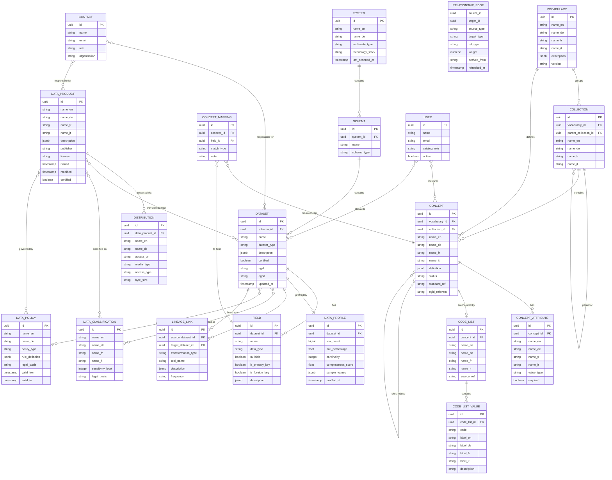

# BBL Datenkatalog – Data Model

**Version:** 0.2 (draft)
**Owner:** DRES – Kreis Digital Solutions
**Status:** In Review

---

## Table of Contents

1. [Goals](#1-goals)
2. [Requirements](#2-requirements)
3. [Standards Alignment](#3-standards-alignment)
4. [Conceptual Model](#4-conceptual-model)
5. [Entity Overview](#5-entity-overview)
6. [Entity Details](#6-entity-details)
   - 6.1 [Vocabulary](#61-vocabulary-skosconceptscheme)
   - 6.2 [Collection](#62-collection-skoscollection)
   - 6.3 [Concept](#63-concept-skoasconcept)
   - 6.4 [Concept Attribute](#64-concept-attribute)
   - 6.5 [Code List](#65-code-list)
   - 6.6 [Code List Value](#66-code-list-value)
   - 6.7 [Concept Mapping](#67-concept-mapping-skosexactmatch)
   - 6.8 [System](#68-system-bvsystem)
   - 6.9 [Schema](#69-schema-bvschema)
   - 6.10 [Dataset](#610-dataset-dcatdataset)
   - 6.11 [Field](#611-field-bvfield)
   - 6.12 [Data Product](#612-data-product-dcatdataset)
   - 6.13 [Distribution](#613-distribution-dcatdistribution)
   - 6.14 [Relationship Edge](#614-relationship-edge)
   - 6.15 [Lineage Link](#615-lineage-link-provwasderivedform)
   - 6.16 [Data Classification](#616-data-classification)
   - 6.17 [Data Profile](#617-data-profile-dqvqualitymeasurement)
   - 6.18 [Data Policy](#618-data-policy)
   - 6.19 [Contact](#619-contact-dcatcontactpoint)
   - 6.20 [User](#620-user)

---

## 1. Goals

The BBL Datenkatalog serves as the authoritative metadata registry for the federal real estate management domain. It is structured in three layers aligned to ArchiMate 3.x and DCAT-AP 2.x.

**G1 – Solution-neutral vocabulary.** A business-layer vocabulary of concepts (`skos:Concept`) must exist independently of any physical system. Concepts are the authoritative, multilingual definitions of what data means — not what it is called in SAP or GIS IMMO. This resolves the current situation where the same concept (e.g. "Mietobjekt") carries different names across SAP RE-FX, GIS IMMO, and GEVER.

**G2 – Physical system transparency.** The internal technical landscape (SAP RE-FX, GIS IMMO, ActaNova, EDM InterWatt, CDE Bund) must be browsable as systems containing schemas, datasets, and fields. This is a `bv:System` extension to DCAT, not published externally.

**G3 – Published data products.** Anything that delivers data to users — REST APIs, SQL endpoints, file exports, reports — must be catalogued as a `dcat:Dataset` with `dcat:Distribution` entries. This is the externally published layer.

**G4 – Realizations (Mappings).** The ArchiMate `realizes` relationship between a `skos:Concept` (business object) and a physical `bv:Field` (artifact) must be stored and browsable. This is the core of the catalog's value — it answers "which field in which system represents this concept?"

**G5 – Multilingual by design.** All user-visible text fields on all entities must support DE, FR, IT, EN. Names and short labels use typed columns (`name_en`, `name_de`, `name_fr`, `name_it`). Long-form text (definitions, descriptions) uses JSONB with locale keys. The UI defaults to EN with fallback chain EN → DE → [blank].

**G6 – DCAT-AP export.** The `data_product` and `distribution` layers must be exportable as valid DCAT-AP CH 2.x RDF (Turtle or JSON-LD) without transformation. Internal extensions (`bv:System`, `bv:Field`) are omitted from the public export.

**G7 – Related assets view.** A materialised `relationship_edge` table powers a "related" view for any entity without requiring a graph database.

> **Navigation note:** The frontend exposes four top-level sidebar sections — Vocabulary, Code Lists, Systems, Data Products. `code_list` is a first-class navigation section, not subordinated to Vocabulary, because it serves a distinct user population (developers, integrators) and many code lists (eBKP-H, GWR, ISG) span multiple concepts. The link between conceptual and physical layers is `concept_attribute.code_list_id` and the `concept_mapping` table.

---

## 2. Requirements

### Functional

| ID | Requirement |
|----|-------------|
| FR-01 | Every concept must have a name in at least one language; other languages nullable (shows translation gap in UI). |
| FR-02 | Every concept must be traceable to at least one vocabulary (`skos:ConceptScheme`). |
| FR-03 | Concepts can be grouped into collections (`skos:Collection`) within a vocabulary; grouping is optional. |
| FR-04 | Concepts can have typed attributes (logical properties at the business layer). |
| FR-05 | Concepts that have finite allowed values must support a code list with typed values. |
| FR-06 | A concept mapping (`skos:exactMatch` / `skos:relatedMatch`) must link a concept to one or more physical fields. |
| FR-07 | Systems contain schemas; schemas contain datasets; datasets contain fields. |
| FR-08 | Data products are published datasets (`dcat:Dataset`) with one or more distributions (`dcat:Distribution`). |
| FR-09 | A data product can reference one or more source datasets via `prov:wasDerivedFrom`. |
| FR-10 | Lineage links must be directional (source dataset → target dataset) and record the transformation tool. |
| FR-11 | A materialised relationship edge table must be derivable from lineage, concept mappings, shared classification, and sibling co-location. |
| FR-12 | Every dataset and data product must support data classification (sensitivity tier). |
| FR-13 | Data profiling results (quality metrics) must be stored per dataset. |
| FR-14 | EGID and EGRID must be supported as first-class identifier fields on datasets and concepts. |
| FR-15 | Every published entity must have at least one contact (`dcat:contactPoint`). |

### Non-functional

| ID | Requirement |
|----|-------------|
| NR-01 | Implementable in PostgreSQL 15+ without graph extensions. |
| NR-02 | All primary keys are UUIDs. |
| NR-03 | All timestamps use `TIMESTAMPTZ` (stored UTC, displayed Europe/Zurich). |
| NR-04 | Name fields use four typed columns (`_en`, `_de`, `_fr`, `_it`). Definition and description fields use `JSONB` with locale keys. |
| NR-05 | The `relationship_edge` table is refreshed as a scheduled materialised view after each scan or edit. |
| NR-06 | DCAT-AP CH 2.x export covers `data_product` and `distribution` only; `bv:System` entities are excluded. |
| NR-07 | Multi-hop lineage traversal (up to 6 hops) via recursive CTE. |
| NR-08 | Access-restricted assets (`sensitivity_level ≥ 2`) render as locked cards on the public frontend — name visible, content hidden, access request link shown. |

---

## 3. Standards Alignment

| Layer | ArchiMate 3.x | DCAT-AP 2.x / SKOS | Our entity |
|-------|--------------|---------------------|-----------|
| Business | `Business Object` | `skos:Concept` | `concept` |
| Business | `Grouping` | `skos:Collection` | `collection` |
| Business | `Business Object` (enumerated) | `skos:ConceptScheme` (type=codelist) | `code_list` |
| Business | `realizes` | `skos:exactMatch` | `concept_mapping` |
| Application | `Application Component` | `bv:System` | `system` |
| Application | `Data Object` | `bv:Schema` | `schema` |
| Application + Technology | `Data Object` + `Artifact` | `dcat:Dataset` (physical) | `dataset` |
| Technology | `Artifact` property | `bv:Field` | `field` |
| Application | `Representation` | `dcat:Dataset` (published) | `data_product` |
| Application | `Application Interface` | `dcat:Distribution` | `distribution` |
| Application | `Application Service` | `dcat:DataService` | `distribution` (type=service) |
| Cross-cutting | `Assignment` | `dcat:contactPoint` | `contact` |
| Cross-cutting | `Association` | `dcat:qualifiedRelation` | `relationship_edge` |
| Cross-cutting | `Triggering` | `prov:wasDerivedFrom` | `lineage_link` |
| Cross-cutting | — | `dqv:QualityMeasurement` | `data_profile` |

**Namespace prefixes used in this document:**

| Prefix | Namespace |
|--------|-----------|
| `dcat:` | http://www.w3.org/ns/dcat# |
| `dqv:` | http://www.w3.org/ns/dqv# |
| `dcterms:` | http://purl.org/dc/terms/ |
| `skos:` | http://www.w3.org/2004/02/skos/core# |
| `prov:` | http://www.w3.org/ns/prov# |
| `bv:` | https://data.bund.admin.ch/def/catalog# |

---

## 4. Conceptual Model

The model has three layers separated by the ArchiMate `realizes` relationship. The Vocabulary layer is solution-neutral. The Systems layer describes physical sources. The Data Products layer describes published access points. The Relationship Edge table connects all three.

---

## 5. Entity Overview

| Entity | DCAT / SKOS / ArchiMate | Section | Description | Approx. volume |
|--------|------------------------|---------|-------------|----------------|
| `vocabulary` | `skos:ConceptScheme` | Vocabulary | A named scheme of concepts | < 10 |
| `collection` | `skos:Collection` | Vocabulary | Domain grouping within a vocabulary | 20 – 100 |
| `concept` | `skos:Concept` / `Business Object` | Vocabulary | Solution-neutral business concept | 200 – 1 000 |
| `concept_attribute` | local ext. | Vocabulary | Logical property of a concept | 500 – 3 000 |
| `code_list` | `skos:ConceptScheme` (codelist) | Vocabulary | Finite set of allowed values | 50 – 200 |
| `code_list_value` | `skos:Concept` (in codelist) | Vocabulary | A single allowed value | 500 – 5 000 |
| `concept_mapping` | `skos:exactMatch` | Cross-cutting | Realizes: concept → physical field | 1 000 – 10 000 |
| `system` | `bv:System` | Systems | A connected source application | < 20 |
| `schema` | `bv:Schema` | Systems | Logical grouping within a system | < 100 |
| `dataset` | `dcat:Dataset` (physical) | Systems | Table, view, GIS layer, IFC model | 500 – 5 000 |
| `field` | `bv:Field` | Systems | Column or field within a dataset | 5 000 – 50 000 |
| `data_product` | `dcat:Dataset` (published) | Data Products | A published data offering | 20 – 200 |
| `distribution` | `dcat:Distribution` | Data Products | An access method for a data product | 50 – 500 |
| `relationship_edge` | `dcat:qualifiedRelation` | Cross-cutting | Materialised relationship graph | 50 000 – 500 000 |
| `lineage_link` | `prov:wasDerivedFrom` | Cross-cutting | Directed data flow between datasets | 500 – 5 000 |
| `data_classification` | local ext. | Cross-cutting | ISG / DSG sensitivity tier | < 20 |
| `data_profile` | `dqv:QualityMeasurement` | Cross-cutting | Automated quality metrics | 1:1 with datasets |
| `data_policy` | local ext. | Cross-cutting | Governance rule | < 100 |
| `contact` | `dcat:contactPoint` | Cross-cutting | Responsible person or team | < 500 |
| `user` | local ext. | Cross-cutting | Catalog user | < 500 |

---

## 6. Entity Details

---

### 6.1 Vocabulary (`skos:ConceptScheme`)

A **Vocabulary** is a named, versioned scheme of concepts. It is the top-level container for the business-layer knowledge of the catalog. Corresponds to ArchiMate `Business Object` container and SKOS `ConceptScheme`.

**Table:** `vocabulary`

| Column | Type | Nullable | DCAT/SKOS | Description |
|--------|------|----------|-----------|-------------|
| `id` | `UUID` | NO | — | Primary key |
| `name_en` | `TEXT` | NO | `skos:prefLabel@en` | English name |
| `name_de` | `TEXT` | YES | `skos:prefLabel@de` | German name |
| `name_fr` | `TEXT` | YES | `skos:prefLabel@fr` | French name |
| `name_it` | `TEXT` | YES | `skos:prefLabel@it` | Italian name |
| `description` | `JSONB` | YES | `skos:definition` | `{"en": "...", "de": "...", "fr": "...", "it": "..."}` |
| `version` | `TEXT` | YES | `owl:versionInfo` | Semantic version string |
| `homepage` | `TEXT` | YES | `foaf:homepage` | External documentation URL |
| `publisher` | `TEXT` | YES | `dcterms:publisher` | Responsible organisational unit |
| `status` | `TEXT` | NO | — | `draft`, `active`, `deprecated` |
| `created_at` | `TIMESTAMPTZ` | NO | `dcterms:issued` | |
| `modified_at` | `TIMESTAMPTZ` | NO | `dcterms:modified` | |

**BBL vocabularies:**

| name_en | name_de | publisher |
|---------|---------|-----------|
| BBL Real Estate Vocabulary | BBL Immobilienvokabular | DRES – Digital Solutions |
| Swiss Construction Cost Vocabulary | Schweizer Baukostenvokabular | DRES – Digital Solutions |

---

### 6.2 Collection (`skos:Collection`)

A **Collection** groups related concepts within a vocabulary. Collections are self-referencing to allow nesting. Corresponds to ArchiMate `Grouping` and SKOS `Collection`.

**Table:** `collection`

| Column | Type | Nullable | DCAT/SKOS | Description |
|--------|------|----------|-----------|-------------|
| `id` | `UUID` | NO | — | Primary key |
| `vocabulary_id` | `UUID` | NO | `skos:inScheme` | FK → `vocabulary.id` |
| `parent_collection_id` | `UUID` | YES | — | FK → `collection.id`; null for root |
| `name_en` | `TEXT` | NO | `skos:prefLabel@en` | |
| `name_de` | `TEXT` | YES | `skos:prefLabel@de` | |
| `name_fr` | `TEXT` | YES | `skos:prefLabel@fr` | |
| `name_it` | `TEXT` | YES | `skos:prefLabel@it` | |
| `description` | `JSONB` | YES | `skos:scopeNote` | |
| `sort_order` | `INTEGER` | YES | — | Display order within parent |

**Suggested root collections (BBL):**

| name_en | name_de |
|---------|---------|
| Property & Building | Grundstück & Gebäude |
| Portfolio | Portfolio |
| Space Management | Raummanagement |
| Costs & Benchmarks | Kosten & Kennwerte |
| Energy & Resources | Energie & Ressourcen |
| Documents & Plans | Dokumente & Pläne |
| Governance | Governance |

---

### 6.3 Concept (`skos:Concept`)

A **Concept** is a solution-neutral business concept. It exists independently of any physical system. Corresponds to ArchiMate `Business Object` and SKOS `Concept`. This is the core entity of the Vocabulary section.

**Table:** `concept`

| Column | Type | Nullable | DCAT/SKOS | Description |
|--------|------|----------|-----------|-------------|
| `id` | `UUID` | NO | — | Primary key |
| `vocabulary_id` | `UUID` | NO | `skos:inScheme` | FK → `vocabulary.id` |
| `collection_id` | `UUID` | YES | `skos:member` (inverse) | FK → `collection.id` |
| `name_en` | `TEXT` | NO | `skos:prefLabel@en` | Canonical English label |
| `name_de` | `TEXT` | YES | `skos:prefLabel@de` | |
| `name_fr` | `TEXT` | YES | `skos:prefLabel@fr` | |
| `name_it` | `TEXT` | YES | `skos:prefLabel@it` | |
| `alt_names` | `JSONB` | YES | `skos:altLabel` | `{"de": ["Mietobjekt", "MO"], ...}` |
| `definition` | `JSONB` | YES | `skos:definition` | Long-form definition per locale |
| `scope_note` | `JSONB` | YES | `skos:scopeNote` | Usage notes per locale |
| `status` | `TEXT` | NO | — | `draft`, `approved`, `deprecated` |
| `standard_ref` | `TEXT` | YES | `dcterms:source` | e.g. `SIA 416 §3.2`, `eCH-0071 v2.0` |
| `egid_relevant` | `BOOLEAN` | NO | — | Whether EGID applies to this concept |
| `egrid_relevant` | `BOOLEAN` | NO | — | Whether EGRID applies to this concept |
| `steward_id` | `UUID` | YES | — | FK → `user.id` |
| `approved_at` | `TIMESTAMPTZ` | YES | — | |
| `created_at` | `TIMESTAMPTZ` | NO | `dcterms:issued` | |
| `modified_at` | `TIMESTAMPTZ` | NO | `dcterms:modified` | |

**Junction table — concept relations** (`skos:related`, `skos:broader`, `skos:narrower`):

| Column | Type | Description |
|--------|------|-------------|
| `source_concept_id` | `UUID` | FK → `concept.id` |
| `target_concept_id` | `UUID` | FK → `concept.id` |
| `relation_type` | `TEXT` | `skos:related`, `skos:broader`, `skos:narrower`, `skos:exactMatch` |

**Example concepts (BBL):**

| name_en | name_de | standard_ref | collection |
|---------|---------|-------------|-----------|
| Building | Gebäude | eCH-0071, GWR | Property & Building |
| Rental Unit | Mietobjekt | VILB Anhang A | Portfolio |
| Occupancy Unit | Nutzungseinheit | SIA 416 §3 | Space Management |
| Energy Reference Area | Energiebezugsfläche | SIA 416 §3.6 | Energy & Resources |
| Construction Cost Index | Kostenkennwert | eBKP-H | Costs & Benchmarks |

---

### 6.4 Concept Attribute

A **Concept Attribute** is a logical property of a concept at the business layer — independent of physical implementation. Not a SKOS standard element; modelled as `bv:ConceptAttribute`.

**Table:** `concept_attribute`

| Column | Type | Nullable | Description |
|--------|------|----------|-------------|
| `id` | `UUID` | NO | Primary key |
| `concept_id` | `UUID` | NO | FK → `concept.id` |
| `name_en` | `TEXT` | NO | Attribute name in English |
| `name_de` | `TEXT` | YES | |
| `name_fr` | `TEXT` | YES | |
| `name_it` | `TEXT` | YES | |
| `definition` | `JSONB` | YES | Per-locale definition |
| `value_type` | `TEXT` | NO | `text`, `integer`, `float`, `boolean`, `date`, `uri`, `code` |
| `code_list_id` | `UUID` | YES | FK → `code_list.id`; set if `value_type = code` |
| `required` | `BOOLEAN` | NO | Whether this attribute is mandatory |
| `standard_ref` | `TEXT` | YES | |
| `sort_order` | `INTEGER` | YES | |

---

### 6.5 Code List

A **Code List** is a controlled vocabulary of allowed values for a concept attribute. Corresponds to `skos:ConceptScheme` with `dcterms:type = skos:ConceptScheme` and `rdf:type = skos:ConceptScheme`.

**Table:** `code_list`

| Column | Type | Nullable | DCAT/SKOS | Description |
|--------|------|----------|-----------|-------------|
| `id` | `UUID` | NO | — | Primary key |
| `concept_id` | `UUID` | YES | — | FK → `concept.id`; which concept this list serves |
| `name_en` | `TEXT` | NO | `skos:prefLabel@en` | |
| `name_de` | `TEXT` | YES | `skos:prefLabel@de` | |
| `name_fr` | `TEXT` | YES | `skos:prefLabel@fr` | |
| `name_it` | `TEXT` | YES | `skos:prefLabel@it` | |
| `source_ref` | `TEXT` | YES | `dcterms:source` | e.g. `GWR Merkmalskatalog 2023` |
| `version` | `TEXT` | YES | `owl:versionInfo` | |

**BBL code lists:**

| name_en | name_de | source_ref |
|---------|---------|------------|
| GWR Building Category | GWR Gebäudekategorie | GWR Merkmalskatalog |
| GWR Building Status | GWR Gebäudestatus | GWR Merkmalskatalog |
| SIA Usage Type | SIA Nutzungsart | SIA 416 |
| eBKP-H Cost Group | eBKP-H Kostengruppe | eBKP-H 2012 |
| ISG Classification Level | ISG Schutzstufe | ISG Art. 6–8 |

---

### 6.6 Code List Value

A single allowed value within a code list. Corresponds to `skos:Concept` within a `skos:ConceptScheme`.

**Table:** `code_list_value`

| Column | Type | Nullable | DCAT/SKOS | Description |
|--------|------|----------|-----------|-------------|
| `id` | `UUID` | NO | — | Primary key |
| `code_list_id` | `UUID` | NO | `skos:inScheme` | FK → `code_list.id` |
| `code` | `TEXT` | NO | `skos:notation` | Machine-readable code (e.g. `1010`) |
| `label_en` | `TEXT` | NO | `skos:prefLabel@en` | |
| `label_de` | `TEXT` | YES | `skos:prefLabel@de` | |
| `label_fr` | `TEXT` | YES | `skos:prefLabel@fr` | |
| `label_it` | `TEXT` | YES | `skos:prefLabel@it` | |
| `description` | `JSONB` | YES | `skos:definition` | |
| `deprecated` | `BOOLEAN` | NO | `owl:deprecated` | |
| `sort_order` | `INTEGER` | YES | — | |

**Example values (GWR Gebäudekategorie):**

| code | label_de | label_fr |
|------|----------|----------|
| 1010 | Einfamilienhaus | Maison individuelle |
| 1020 | Zweifamilienhaus | Maison à deux logements |
| 1030 | Mehrfamilienhaus | Immeuble locatif |
| 1060 | Gebäude mit teilw. Wohnnutzung | Bâtiment à usage mixte |
| 1110 | Bürogebäude | Immeuble de bureaux |

---

### 6.7 Concept Mapping (`skos:exactMatch`)

A **Concept Mapping** records the ArchiMate `realizes` relationship between a `skos:Concept` (business layer) and a physical `bv:Field` (technology layer). This is the core artifact of the Mappings tab.

**Table:** `concept_mapping`

| Column | Type | Nullable | DCAT/SKOS | Description |
|--------|------|----------|-----------|-------------|
| `id` | `UUID` | NO | — | Primary key |
| `concept_id` | `UUID` | NO | — | FK → `concept.id` |
| `field_id` | `UUID` | NO | — | FK → `field.id` |
| `match_type` | `TEXT` | NO | `skos:exactMatch`, `skos:relatedMatch`, `skos:broadMatch`, `skos:narrowMatch` | Mapping precision |
| `transformation_note` | `TEXT` | YES | — | Any conversion logic (e.g. unit conversion, encoding) |
| `verified` | `BOOLEAN` | NO | — | Whether a steward has confirmed this mapping |
| `created_by` | `UUID` | YES | — | FK → `user.id` |
| `created_at` | `TIMESTAMPTZ` | NO | — | |

---

### 6.8 System (`bv:System`)

A **System** is a connected source application. Corresponds to ArchiMate `Application Component`. This is a local extension (`bv:System`) not exported in the DCAT-AP output.

**Table:** `system`

| Column | Type | Nullable | Description |
|--------|------|----------|-------------|
| `id` | `UUID` | NO | Primary key |
| `name_en` | `TEXT` | NO | Display name |
| `name_de` | `TEXT` | YES | |
| `description` | `JSONB` | YES | |
| `archimate_type` | `TEXT` | NO | `Application Component` (always, per ArchiMate) |
| `technology_stack` | `TEXT` | YES | e.g. `SAP S/4HANA`, `ArcGIS Online`, `Oracle DB` |
| `base_url` | `TEXT` | YES | Base URL for deep links into the system |
| `scanner_class` | `TEXT` | YES | Internal scanner identifier |
| `owner_id` | `UUID` | YES | FK → `contact.id` |
| `last_scanned_at` | `TIMESTAMPTZ` | YES | |
| `active` | `BOOLEAN` | NO | |
| `created_at` | `TIMESTAMPTZ` | NO | |

**BBL systems:**

| name_en | name_de | technology_stack |
|---------|---------|-----------------|
| SAP RE-FX | SAP RE-FX | SAP S/4HANA |
| GIS IMMO | GIS IMMO | ArcGIS Online |
| ActaNova GEVER | ActaNova GEVER | Acta Nova (Rubicon) |
| EDM InterWatt | EDM InterWatt | InterWatt |
| EHP Wüest Dimensions | EHP Wüest Dimensions | Wüest Partner API |
| CDE Bund | CDE Bund | Autodesk Construction Cloud |

---

### 6.9 Schema (`bv:Schema`)

A **Schema** is a logical grouping of datasets within a system — a database schema, GIS workspace, IFC project, or folder structure.

**Table:** `schema`

| Column | Type | Nullable | Description |
|--------|------|----------|-------------|
| `id` | `UUID` | NO | Primary key |
| `system_id` | `UUID` | NO | FK → `system.id` |
| `name` | `TEXT` | NO | Technical schema name (as found in source) |
| `display_name` | `TEXT` | YES | Human-readable override |
| `schema_type` | `TEXT` | NO | `database_schema`, `gis_workspace`, `bim_project`, `file_folder`, `api_namespace` |
| `description` | `JSONB` | YES | |
| `created_at` | `TIMESTAMPTZ` | NO | |

---

### 6.10 Dataset (`dcat:Dataset`)

A **Dataset** is a physical data container — a table, view, GIS layer, IFC model, or file. Corresponds to ArchiMate `Data Object` + `Artifact` collapsed into one browsable entity. At the Systems layer this is the physical dataset; at the Data Products layer the same class is used for published datasets (see §6.12).

**Table:** `dataset`

| Column | Type | Nullable | DCAT/ArchiMate | Description |
|--------|------|----------|---------------|-------------|
| `id` | `UUID` | NO | — | Primary key |
| `schema_id` | `UUID` | NO | — | FK → `schema.id` |
| `name` | `TEXT` | NO | `dcterms:title` | Technical name in source system |
| `display_name` | `TEXT` | YES | `dcterms:title` | Human-readable override |
| `dataset_type` | `TEXT` | NO | `dcterms:type` | `table`, `view`, `gis_layer`, `bim_model`, `file`, `api_resource` |
| `description` | `JSONB` | YES | `dcterms:description` | Per-locale |
| `certified` | `BOOLEAN` | NO | — | Steward-certified |
| `egid` | `TEXT` | YES | — | GWR Gebäudeidentifikator |
| `egrid` | `TEXT` | YES | — | Grundstücksidentifikator |
| `row_count_approx` | `BIGINT` | YES | — | Approximate record count |
| `source_url` | `TEXT` | YES | `dcat:landingPage` | Deep link into source system |
| `owner_id` | `UUID` | YES | — | FK → `contact.id` |
| `created_at` | `TIMESTAMPTZ` | NO | `dcterms:issued` | |
| `modified_at` | `TIMESTAMPTZ` | NO | `dcterms:modified` | |

**Junction tables:**

`dataset_classification`: `(dataset_id, classification_id, assigned_at, assigned_by)`
`dataset_policy`: `(dataset_id, policy_id)`
`dataset_contact`: `(dataset_id, contact_id, role)` — role: `data_owner`, `data_steward`, `data_custodian`, `subject_matter_expert`

---

### 6.11 Field (`bv:Field`)

A **Field** is a single column, attribute, or property within a dataset. Corresponds to ArchiMate `Artifact` property. The target of `concept_mapping`.

**Table:** `field`

| Column | Type | Nullable | Description |
|--------|------|----------|-------------|
| `id` | `UUID` | NO | Primary key |
| `dataset_id` | `UUID` | NO | FK → `dataset.id` |
| `name` | `TEXT` | NO | Technical field name |
| `display_name` | `TEXT` | YES | Human-readable override |
| `data_type` | `TEXT` | NO | Physical data type (e.g. `VARCHAR`, `INTEGER`, `GEOMETRY`) |
| `description` | `JSONB` | YES | Per-locale |
| `nullable` | `BOOLEAN` | NO | |
| `is_primary_key` | `BOOLEAN` | NO | |
| `is_foreign_key` | `BOOLEAN` | NO | |
| `references_field_id` | `UUID` | YES | FK → `field.id`; for foreign keys |
| `sample_values` | `JSONB` | YES | Array of representative values |
| `sort_order` | `INTEGER` | YES | Column position in source |

---

### 6.12 Data Product (`dcat:Dataset`, published)

A **Data Product** is a published dataset made available to data consumers. Corresponds to ArchiMate `Representation` and DCAT `dcat:Dataset` (published). This is the externally facing layer. Unlike the physical `dataset`, a data product is defined and maintained by data owners, not extracted by a scanner.

**Table:** `data_product`

| Column | Type | Nullable | DCAT | Description |
|--------|------|----------|------|-------------|
| `id` | `UUID` | NO | — | Primary key |
| `name_en` | `TEXT` | NO | `dcterms:title@en` | |
| `name_de` | `TEXT` | YES | `dcterms:title@de` | |
| `name_fr` | `TEXT` | YES | `dcterms:title@fr` | |
| `name_it` | `TEXT` | YES | `dcterms:title@it` | |
| `description` | `JSONB` | YES | `dcterms:description` | |
| `publisher` | `TEXT` | NO | `dcterms:publisher` | Responsible organisational unit |
| `license` | `TEXT` | YES | `dcterms:license` | e.g. `CC BY 4.0`, `OGD CH` |
| `theme` | `TEXT[]` | YES | `dcat:theme` | EU Data Theme URIs |
| `keyword` | `JSONB` | YES | `dcat:keyword` | `{"en": ["building", ...], "de": [...]}` |
| `spatial_coverage` | `TEXT` | YES | `dcterms:spatial` | e.g. `Switzerland`, `Kanton Bern` |
| `temporal_start` | `DATE` | YES | `dcterms:temporal` | |
| `temporal_end` | `DATE` | YES | `dcterms:temporal` | |
| `update_frequency` | `TEXT` | YES | `dcterms:accrualPeriodicity` | EU frequency URIs |
| `certified` | `BOOLEAN` | NO | — | |
| `issued` | `TIMESTAMPTZ` | YES | `dcterms:issued` | First publication |
| `modified` | `TIMESTAMPTZ` | YES | `dcterms:modified` | Last update |

**Junction tables:**

`data_product_dataset`: `(data_product_id, dataset_id)` — `prov:wasDerivedFrom`
`data_product_classification`: `(data_product_id, classification_id)`
`data_product_policy`: `(data_product_id, policy_id)`
`data_product_contact`: `(data_product_id, contact_id, role)` — role: `data_owner`, `data_steward`, `publisher`

---

### 6.13 Distribution (`dcat:Distribution`)

A **Distribution** is a specific form in which a data product is made available. Corresponds to ArchiMate `Application Interface` (for APIs and endpoints) or `Artifact` (for file exports). A data product must have at least one distribution.

**Table:** `distribution`

| Column | Type | Nullable | DCAT | Description |
|--------|------|----------|------|-------------|
| `id` | `UUID` | NO | — | Primary key |
| `data_product_id` | `UUID` | NO | `dcat:distribution` (inverse) | FK → `data_product.id` |
| `name_en` | `TEXT` | NO | `dcterms:title@en` | e.g. "Monthly Excel Export" |
| `name_de` | `TEXT` | YES | `dcterms:title@de` | |
| `name_fr` | `TEXT` | YES | `dcterms:title@fr` | |
| `name_it` | `TEXT` | YES | `dcterms:title@it` | |
| `access_url` | `TEXT` | NO | `dcat:accessURL` | Endpoint or download URL |
| `download_url` | `TEXT` | YES | `dcat:downloadURL` | Direct file link if applicable |
| `media_type` | `TEXT` | YES | `dcat:mediaType` | IANA media type |
| `access_type` | `TEXT` | NO | — | `rest_api`, `sql_endpoint`, `file_export`, `report`, `dashboard`, `odata` |
| `format` | `TEXT` | YES | `dcterms:format` | e.g. `XLSX`, `GeoJSON`, `IFC`, `CSV` |
| `byte_size` | `BIGINT` | YES | `dcat:byteSize` | |
| `conformsTo` | `TEXT` | YES | `dcterms:conformsTo` | Standard the API conforms to |
| `description` | `JSONB` | YES | `dcterms:description` | |
| `availability` | `TEXT` | YES | `dcatap:availability` | `stable`, `available`, `experimental` |

---

### 6.14 Relationship Edge

The **Relationship Edge** table materialises all connections between entities — across vocabulary, systems, and data products — into a single adjacency structure. Powers the Relationships tab without a graph database.

**Table:** `relationship_edge`

| Column | Type | Nullable | Description |
|--------|------|----------|-------------|
| `source_id` | `UUID` | NO | ID of the source entity |
| `source_type` | `TEXT` | NO | `concept`, `dataset`, `field`, `data_product` |
| `target_id` | `UUID` | NO | ID of the target entity |
| `target_type` | `TEXT` | NO | `concept`, `dataset`, `field`, `data_product` |
| `rel_type` | `TEXT` | NO | Enum — see below |
| `weight` | `NUMERIC` | NO | 0.0–1.0; sort order for the UI |
| `derived_from` | `TEXT` | YES | Source table/rule that produced this edge |
| `refreshed_at` | `TIMESTAMPTZ` | NO | Last materialisation |

**Primary key:** `(source_id, source_type, target_id, target_type, rel_type)`

**Relationship types:**

| rel_type | weight | derived_from | description |
|----------|--------|--------------|-------------|
| `realizes` | 1.0 | `concept_mapping` | Field realizes a concept (ArchiMate) |
| `lineage_downstream` | 1.0 | `lineage_link` | Data flows from source to target |
| `lineage_upstream` | 1.0 | `lineage_link` | Inverse of downstream |
| `derived_from` | 0.9 | `data_product_dataset` | Data product derived from dataset |
| `skos_related` | 0.7 | `concept_relation` | `skos:related` between concepts |
| `skos_broader` | 0.7 | `concept_relation` | `skos:broader` |
| `shared_classification` | 0.6 | `dataset_classification` | Shared sensitivity classification |
| `sibling` | 0.4 | `dataset` | Same schema, same parent |

**Materialisation procedure:** Truncate and re-populate from all source tables. Schedule after each scan run and after any edit to `concept_mapping`, `lineage_link`, or `concept_relation`.

---

### 6.15 Lineage Link (`prov:wasDerivedFrom`)

A **Lineage Link** records a directed data flow between two datasets. Corresponds to `prov:wasDerivedFrom` and ArchiMate `Triggering` relationship.

**Table:** `lineage_link`

| Column | Type | Nullable | DCAT/PROV | Description |
|--------|------|----------|-----------|-------------|
| `id` | `UUID` | NO | — | Primary key |
| `source_dataset_id` | `UUID` | NO | `prov:used` | FK → `dataset.id` |
| `target_dataset_id` | `UUID` | NO | `prov:wasDerivedFrom` | FK → `dataset.id` |
| `transformation_type` | `TEXT` | YES | — | `copy`, `transform`, `aggregate`, `filter`, `join`, `derive` |
| `tool_name` | `TEXT` | YES | `prov:wasAssociatedWith` | e.g. `FME`, `SAP PI`, `Python`, `ArcGIS Pro` |
| `job_name` | `TEXT` | YES | — | Specific job, mapping, or workflow name |
| `description` | `JSONB` | YES | — | Per-locale description of the transformation |
| `frequency` | `TEXT` | YES | `dcterms:accrualPeriodicity` | `realtime`, `daily`, `weekly`, `on_demand` |
| `recorded_at` | `TIMESTAMPTZ` | NO | — | |
| `recorded_by` | `UUID` | YES | — | FK → `user.id` |

---

### 6.16 Data Classification

Sensitivity classification aligned to ISG, DSG, and EMBAG. Applied to both `dataset` and `data_product`.

**Table:** `data_classification`

| Column | Type | Nullable | Description |
|--------|------|----------|-------------|
| `id` | `UUID` | NO | Primary key |
| `name_en` | `TEXT` | NO | |
| `name_de` | `TEXT` | NO | |
| `name_fr` | `TEXT` | YES | |
| `name_it` | `TEXT` | YES | |
| `sensitivity_level` | `INTEGER` | NO | 0 = public, 1 = internal, 2 = confidential, 3 = secret |
| `legal_basis` | `TEXT` | YES | e.g. `ISG Art. 7`, `DSG Art. 5 lit. c` |
| `description` | `JSONB` | YES | |
| `access_restriction` | `TEXT` | YES | Who may access this level |

**Standard classifications:**

| name_en | name_de | sensitivity_level | legal_basis |
|---------|---------|------------------|-------------|
| Public | Öffentlich | 0 | EMBAG Art. 10 |
| Internal | BBL-intern | 1 | ISG Art. 6 |
| Confidential | Vertraulich | 2 | ISG Art. 7 |
| Personal Data | Personendaten | 2 | DSG Art. 5 lit. c |
| Sensitive Personal Data | Besonders schützensw. | 3 | DSG Art. 5 lit. c |
| Classified (VS-INTERN) | Geheim VS-INTERN | 3 | ISG Art. 8, VGG |

---

### 6.17 Data Profile (`dqv:QualityMeasurement`)

Automated quality metrics per dataset, generated by the scanner. Corresponds to `dqv:QualityMeasurement`.

**Table:** `data_profile`

| Column | Type | Nullable | DQV | Description |
|--------|------|----------|-----|-------------|
| `id` | `UUID` | NO | — | Primary key |
| `dataset_id` | `UUID` | NO | `dqv:computedOn` | FK → `dataset.id` |
| `row_count` | `BIGINT` | YES | — | Total records |
| `null_percentage` | `FLOAT` | YES | `dqv:value` | Across all fields (0.0–1.0) |
| `cardinality` | `INTEGER` | YES | — | Distinct values (for field-level profiles) |
| `min_value` | `TEXT` | YES | — | |
| `max_value` | `TEXT` | YES | — | |
| `completeness_score` | `FLOAT` | YES | `dqv:value` | Composite completeness 0.0–1.0 |
| `format_validity_score` | `FLOAT` | YES | `dqv:value` | Share matching expected format |
| `sample_values` | `JSONB` | YES | — | Representative sample array |
| `profiled_at` | `TIMESTAMPTZ` | NO | `dcterms:issued` | |
| `profiler` | `TEXT` | YES | `prov:wasAssociatedWith` | Tool or script |

---

### 6.18 Data Policy

A governance rule applicable to datasets and data products. Covers retention, access control, and quality obligations.

**Table:** `data_policy`

| Column | Type | Nullable | Description |
|--------|------|----------|-------------|
| `id` | `UUID` | NO | Primary key |
| `name_en` | `TEXT` | NO | |
| `name_de` | `TEXT` | YES | |
| `name_fr` | `TEXT` | YES | |
| `name_it` | `TEXT` | YES | |
| `policy_type` | `TEXT` | NO | `retention`, `access`, `quality`, `privacy`, `opendata` |
| `rule_definition` | `JSONB` | NO | Per-locale rule text |
| `legal_basis` | `TEXT` | YES | |
| `owner` | `TEXT` | YES | Responsible unit |
| `valid_from` | `TIMESTAMPTZ` | YES | |
| `valid_to` | `TIMESTAMPTZ` | YES | Null = indefinite |

---

### 6.19 Contact (`dcat:contactPoint`)

A **Contact** is a responsible person or team for a dataset or data product. Corresponds to `dcat:contactPoint` and ArchiMate `Assignment` (Actor → Element). Kept separate from `user` — contacts may exist without a catalog account.

**Table:** `contact`

| Column | Type | Nullable | DCAT | Description |
|--------|------|----------|------|-------------|
| `id` | `UUID` | NO | — | Primary key |
| `name` | `TEXT` | NO | `vcard:fn` | Full name or team name |
| `email` | `TEXT` | YES | `vcard:hasEmail` | |
| `phone` | `TEXT` | YES | `vcard:hasTelephone` | |
| `organisation` | `TEXT` | YES | `vcard:organization-name` | |
| `role` | `TEXT` | NO | — | `data_owner`, `data_steward`, `data_custodian`, `publisher`, `subject_matter_expert` |
| `user_id` | `UUID` | YES | — | FK → `user.id`; if contact has a catalog account |

---

### 6.20 User

A catalog user. Intentionally thin — seeded from federal IAM (IAM Bund / AD). Separate from `contact` which is the DCAT-facing stakeholder record.

**Table:** `user`

| Column | Type | Nullable | Description |
|--------|------|----------|-------------|
| `id` | `UUID` | NO | Primary key; matches IAM subject identifier |
| `name` | `TEXT` | NO | Full name |
| `email` | `TEXT` | NO | `@*.admin.ch` |
| `catalog_role` | `TEXT` | NO | `admin`, `steward`, `analyst`, `viewer` |
| `preferred_language` | `TEXT` | NO | `en`, `de`, `fr`, `it`; default `en` |
| `department` | `TEXT` | YES | e.g. `DRES – Digital Solutions` |
| `active` | `BOOLEAN` | NO | Default `true` |
| `created_at` | `TIMESTAMPTZ` | NO | |

**Role permissions:**

| catalog_role | Edit vocabulary | Approve concepts | Edit datasets | Manage policies | Admin systems |
|-------------|----------------|-----------------|---------------|----------------|---------------|
| `admin` | ✓ | ✓ | ✓ | ✓ | ✓ |
| `steward` | ✓ | ✓ | ✓ | ✗ | ✗ |
| `analyst` | ✗ | ✗ | ✗ | ✗ | ✗ |
| `viewer` | ✗ | ✗ | ✗ | ✗ | ✗ |

---

*End of document.*
